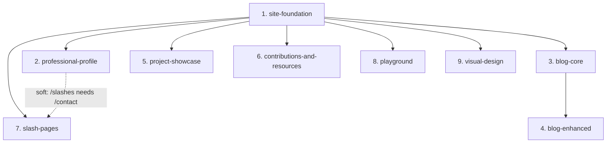

# Spec Decomposition: matthewfield.ca

## Overview

Personal website rebuild for Matthew Field — replacing WordPress.com with a markdown-driven, Next.js static site. Originally eight specs ordered to deliver professional value early and defer complex features. A ninth spec — **visual-design** (#9) — was added after the eight shipped, to resolve the visual identity deliberately deferred by the `design-system.md` steering document and apply it across the built site.

## Specs

### 1. site-foundation

**Scope**: Project scaffolding and core site shell. Next.js App Router, Tailwind CSS v4, shadcn/ui, Velite content pipeline configuration (with `pages` schema as the working pattern — downstream specs add their own schemas), root layout, site layout with header/nav/footer, dark/light theme toggle (next-themes), landing page with hero cards linking to each major section (placeholder pages for sections not yet built), global styles and CSS theme variables, CSP headers in next.config.ts, custom 404 page, TypeScript strict mode, ESLint + Prettier config, .nvmrc + pnpm packageManager pin, CI/CD via GitHub Actions (lint, type-check, test, build, deploy to Vercel), XML sitemap generation, Vitest + Playwright configuration, metadata/SEO convention (title template, default OG image, `generateMetadata()` pattern). Includes a time-boxed CSS isolation spike: set up the `(playground)` route group with `all: initial` + `@layer playground` reset and verify it works in both dev (Turbopack) and production (Webpack) builds. Verify that Velite handles empty content directories gracefully (empty array, not build error); if it requires at least one file per collection, add placeholder content files.

**Delivers**: A visitable site with a working landing page, navigation, theme toggle, the complete development toolchain, and a validated CSS isolation approach for the playground.

**End-to-end verification**: Visit the site locally, see the landing page with hero cards for each section, toggle dark/light mode, navigate between placeholder routes, confirm responsive layout on mobile viewport. Verify the playground route group renders correctly in both dev and prod builds — see spike verification criteria below.

**Dependencies**: None.

**Design considerations**:
- Hero cards on the landing page link to routes that don't have content yet — use styled placeholder pages until their specs are implemented. Hero cards are data-driven so sections can be added/removed without code changes.
- Velite is configured with the `pages` schema only (for landing page and future slash page content). Each downstream content spec adds its own schema to `velite.config.ts`. Spec 1 documents the schema pattern for downstream specs to follow.
- Velite must run before type-checking in CI. Ensure a `postinstall` script or explicit Velite build step generates `.velite/` before `tsc` runs, so imports from `#site/content` don't produce TypeScript errors.
- The CSS isolation spike is time-boxed: create the `(playground)` route group, apply `all: initial` + `isolation: isolate` + `@layer playground`. **Spike verification must include**: (1) a plain div with conflicting colors/fonts (proves basic `all: initial` works), (2) a shadcn/ui Button or Card rendered inside the playground container (proves shared components work after the reset — specifically that CSS custom properties like `--background` and `--foreground` are either re-established by a playground base stylesheet or unnecessary), (3) Tailwind utility classes applied inside the playground container (proves utilities work within `@layer playground`). Test in both themes (light and dark) and in both dev and production builds. A plain-div-only test provides false confidence — the real question is whether shared components survive the CSS reset. **Spike failure path**: if `all: initial` + `@layer playground` does not work acceptably, the playground defaults to iframe-only isolation. Spec 8's scope reduces to: manifest system, dynamic imports, iframe embed routes, and gallery page. Same-page rendering is cut.
- Establish the metadata/SEO convention: title template (e.g., `"Page Title | matthewfield.ca"`), default OG image in `public/images/`, `generateMetadata()` in page files. All downstream specs follow this pattern.
- Spec 1 is the largest spec by far (foundation work is inherently front-loaded). Recommended implementation order within spec 1: (a) scaffolding + CI/CD, (b) CSS isolation spike + Velite pipeline + pages schema, (c) layouts + theme toggle + metadata convention, (d) landing page + hero cards. The spike runs before the CSS architecture is finalized so its findings inform layout and theme decisions in step (c) rather than potentially invalidating them. Note: these are a suggested sequence, not hard gates — spec 1 is one deliverable.

---

### 2. professional-profile

**Scope**: Professional profile page (wide layout, MDX-driven visual resume/CV), contact section with LinkedIn/GitHub links, bot-protected email via react-obfuscate, contact form (name, email, message) with Resend API route, zod server-side validation, honeypot spam field. Standalone /contact slash page reusing the same contact components.

**Delivers**: The primary professional inbound funnel — employers and recruiters can view Matthew's experience and get in touch.

**End-to-end verification**: View the profile page with rendered MDX content, submit the contact form, verify email delivery via Resend, confirm email obfuscation works, visit /contact and confirm it uses the same contact components.

**Dependencies**: site-foundation.

**Design considerations**:
- Contact components (form, email display, social links) must be extractable to `src/components/shared/` for reuse on /contact. Contact components should be self-contained (own state, validation, and submission logic) so consuming pages render them without configuration.
- The Resend API route at `/api/contact/route.ts` needs zod schema validation and honeypot check.
- Wide layout — profile page uses more viewport width than standard content pages.
- /contact is a slash page per the product steering doc. Spec 7's /slashes index must include /contact even though it is built here.

---

### 3. blog-core

**Scope**: Blog index page (reverse-chronological listing), individual blog post pages, MDX rendering with Shiki syntax highlighting, tags and categories with filtering, estimated reading time, previous/next post navigation, draft/unpublished status (excluded from production builds), last-updated date display (shown only when updated after publication), code block styling, RSS/Atom feed generation (static XML at build time via `/feed.xml/route.ts`, blog posts only). Adds the blog Velite schema to `velite.config.ts`.

**Delivers**: A fully functional, subscribable blog where Matthew can publish markdown posts with syntax-highlighted code and an RSS feed.

**End-to-end verification**: Create an MDX blog post with frontmatter and code blocks. Verify it renders with syntax highlighting, reading time, prev/next links, and tag filtering. Confirm drafts are excluded from production build. Validate RSS feed with a feed validator.

**Dependencies**: site-foundation.

**Design considerations**:
- Velite blog schema: title, date, updated, description, tags, categories, series, seriesOrder, draft, body. Defined in this spec, not stubbed in spec 1.
- Shiki theme selection — should support both light and dark themes matching the site toggle.
- Reading time computed via Velite schema transform using reading-time package.
- Blog content line length constrained to ~75 characters per product principles (readability), with generous whitespace.
- Content query helpers go in `src/lib/blog.ts` (not `src/lib/content.ts` — see cross-spec conventions).

---

### 4. blog-enhanced

**Scope**: Pagefind search integration (build-time indexing via crawler mode, client-side WASM search — includes CI pipeline modification to run `next build && next start` + Pagefind crawl), series/multi-part post grouping UI, related posts suggestions, social sharing buttons, reading progress bar, auto-generated table of contents from headings (rehype plugin), footnotes/sidenotes via rehype/remark plugins, copy-to-clipboard button on code blocks.

**Delivers**: Blog discovery, engagement, and polish features — readers can search, navigate series, share posts, and benefit from enhanced reading UX (TOC, footnotes, copy-to-clipboard).

**End-to-end verification**: Build the site, verify Pagefind index is generated, search for a known post and find it. Navigate a multi-part series. Confirm related posts appear. Verify progress bar tracks scroll position. Verify using a single test post that exercises all plugins simultaneously: a post with headings (TOC source), footnotes, and syntax-highlighted code blocks — confirming these features work in combination, not just independently. Verify Pagefind search UI renders correctly in both light and dark themes.

**Dependencies**: blog-core.

**Design considerations**:
- Pagefind requires `next build && next start` + crawl in CI — this spec modifies the CI pipeline (package.json scripts, GitHub Actions workflow) established in spec 1. Introduce the Pagefind crawl as a non-blocking CI step (`continue-on-error: true` in GitHub Actions) initially. Promote to blocking after the step has been verified stable for 3+ deploys. This eliminates cascading deployment failure risk.
- Pagefind indexing scope: use `data-pagefind-body` to limit indexing to content regions (blog post body, project descriptions) rather than indexing entire pages. Exclude navigational pages (/sitemap, /slashes), placeholder pages, and non-content regions (nav, footer) via `data-pagefind-ignore`. This prevents noisy search results.
- Related posts algorithm — tag/category overlap scoring, simple is fine.
- Series UI — banner or sidebar showing all posts in the series with current position highlighted.
- TOC, footnotes, and copy-to-clipboard involve rehype/remark plugin integration — plugin ordering in the unified pipeline matters. These are the highest-risk implementation items in the blog feature set, which is why they are in this spec rather than blog-core: if plugin debugging takes time, the core blog is already shipped and usable. The design phase for this spec should specify plugin ordering relative to spec 3's existing pipeline (rehype-pretty-code), documenting which plugins run in which order and what structural assumptions each makes about the HAST/MDAST tree.
- Spec 4 bundles several unrelated blog enhancement features for pragmatic reasons (the overhead of separate specs exceeds the value for a solo developer). If any single feature proves unexpectedly complex, consider splitting it into its own spec rather than blocking the others.

---

### 5. project-showcase

**Scope**: Project gallery page with visual preview cards, individual project subpages with full details (description, story, screenshots, GIF captures, technical details, links). MDX-driven content with image support. Adds the project Velite schema to `velite.config.ts`.

**Delivers**: A showcase of Matthew's projects demonstrating active building.

**End-to-end verification**: Create an MDX project entry with images. See it in the gallery with a preview card. Click through to the detail page with full content rendered.

**Dependencies**: site-foundation.

**Design considerations**:
- Velite project schema: title, description, date, image (cover/preview), tags, links (demo, repo, etc.), body. Defined in this spec.
- Gallery cards need visual previews — images or screenshots as primary visual element.
- Content images colocated in `content/projects/`, copied to `public/static/` by Velite.
- Next.js Image component for optimization.
- Content query helpers go in `src/lib/projects.ts`.

---

### 6. contributions-and-resources

**Scope**: Contributions gallery — single page displaying curated open-source contributions as cards (repo, contribution description, PR/commit links). Data from `content/contributions.yaml`. Resources/bookmarks page — entries grouped by category (title, URL, description). Data from `content/resources.yaml`. Both are single-page, data-driven, no subpages. Adds contributions and resources Velite schemas to `velite.config.ts`.

**Delivers**: Evidence of open-source activity and a curated reference directory. These are thematically distinct (contributions = builder credibility, resources = curated reference) but bundled because both are trivially small — neither has enough complexity to block the other.

**End-to-end verification**: Add entries to both YAML files. Contributions page renders cards with repo links. Resources page renders grouped entries with working external links.

**Dependencies**: site-foundation.

**Design considerations**:
- Both use YAML source data processed by Velite — not MDX (no prose body needed).
- Velite schemas for contributions (repo, description, prUrl, commitUrl, date) and resources (title, url, description, category). Defined in this spec.
- Contributions cards don't need subpages — all on one page.
- Resources grouped by category with a clean, scannable layout. "Blogs & Feeds" category serves as blogroll.
- Content query helpers go in `src/lib/contributions.ts` and `src/lib/resources.ts`.

---

### 7. slash-pages

**Scope**: /about (personal page, MDX-driven), /colophon (tech stack documentation, MDX-driven), /now (current focus, MDX-driven), /sitemap (auto-generated HTML listing all pages), /slashes (index of all slash pages with descriptions — must include /contact, which is built in spec 2).

**Delivers**: IndieWeb-convention pages that round out the site's personal presence.

**End-to-end verification**: Visit each slash page. /about, /colophon, /now render MDX content. /sitemap lists all site pages. /slashes lists all slash pages (including /contact) with descriptions and links.

**Dependencies**: site-foundation. Soft dependency on spec 2 (professional-profile): the /slashes index page must include /contact, and /contact's route must exist for links to work. Implement after spec 2 for completeness. Best implemented after other content specs are complete so /sitemap has full page coverage, but not strictly blocked.

**Design considerations**:
- /about, /colophon, /now use MDX content from `content/pages/` (Velite `pages` schema established in spec 1).
- /sitemap is component-only — queries all routes/content programmatically.
- /slashes is component-only — lists all slash pages including /contact (built in spec 2).

---

### 8. playground

**Scope**: Playground index/gallery page, playground manifest system (`playground/manifest.ts`), dynamic item loading via `[slug]/page.tsx`, playground layout building on the CSS isolation foundation validated in spec 1's spike (`all: initial`, `isolation: isolate`, `@layer playground`), CSS Modules for scoped styles, iframe isolation path with `/playground/[slug]/embed/page.tsx`, permissive playground CSP in next.config.ts. Include one sample item in each isolation mode to validate the architecture.

**Delivers**: A working sandbox system where self-contained mini-apps can be added independently.

**End-to-end verification**: Visit playground index, see gallery of items. Load a same-page item — confirm styles don't leak, site theme doesn't apply. Load an iframe-isolated item — confirm full isolation. Verify both work in production build (Turbopack/Webpack divergence check).

**Dependencies**: site-foundation (including the CSS isolation spike from spec 1). If the spec 1 spike determined that same-page isolation is not viable, this spec's scope reduces to iframe-only isolation (see spec 1 spike failure path).

**Design considerations**:
- Style isolation builds on the spike from spec 1. The full implementation adds: playground base stylesheet re-establishing `font-family`, `font-size`, `line-height`, `color`, `box-sizing` after `all: initial` reset.
- Manifest pattern: single source of truth for `generateStaticParams`, gallery, and dynamic import.
- Verify in Vercel preview deploys, not just local dev (bundler divergence).
- Sample items must include enough CSS to prove isolation works — set colors, fonts, and layout properties that would visibly conflict with the main site theme. Trivial "hello world" divs don't exercise the isolation architecture.

---

### 9. visual-design

**Scope**: Resolve and apply the site's visual identity, governed by the `design-system.md` steering doc. Decide the design system's **Deferred Decisions** — direction (refine the current neutral/minimal look vs. a distinct identity), the OKLCH palette/chroma and exact role values for both themes, the type scale (and any voice beyond Geist), spacing rhythm/gutters, elevation language, and motion presence/tokens — then apply them across the eight already-built `(site)` sections (landing, professional profile, projects, contributions, blog, resources, slash pages), migrating `src/styles/tokens.css` and the per-section styles accordingly. Includes the CI/code hardening the design-system gates depend on: status-role tokens (`success`/`warning`/`info`), an active-role↔token CI check, LCP/CLS/INP + byte-weight Lighthouse assertions with full-route coverage, and `disableTransitionOnChange` for no-flash theming.

**Delivers**: A deliberate, coherent visual identity across the whole site — replacing the placeholder-neutral starting look — with the design-system gates actually enforced in CI.

**End-to-end verification**: Every `(site)` route reviewed in both themes at the named Tailwind breakpoints; AA contrast (axe) and the Lighthouse gates pass; visual diff against the `design-baseline/` screenshots captured before the work.

**Dependencies**: site-foundation, and the approved `design-system.md` steering doc. Cross-cutting over the content specs (2, 3, 5, 6, 7, 8): this is a **retrofit** of a visual identity onto already-implemented sections, so it runs after them.

**Design considerations**:
- This is the single spec that resolves `design-system.md`'s Deferred Decisions. The steering doc constrains it (architecture, gates, budgets) but does not decide the identity — that happens (and is adversarially pressure-tested) in this spec's requirements phase.
- **One spec vs. a series**: kept as one vertical spec (decide the identity, then migrate the eight sections) because this is a retrofit for a solo developer and the sections share one token set. If application proves large, split per-section migration into follow-on specs after the identity is locked.
- The eight built sections currently encode pre-design choices; per section, this spec decides whether to codify the existing look or re-style it to the new identity.
- Playground (`(playground)`) is out of scope — it is style-isolated and owns its own presentation per the design system.

---

### 10. profile-resume

**Scope**: Bring Matthew's resume content onto `/profile`. Work history becomes a validated Velite collection (roles, nested "highlighted delivery" blocks, responsibility highlights) rendered as a timeline beneath the existing narrative, plus curated skills and education. Adds a professional-summary frontmatter field, JSON-LD `Person` data derived from the same collection, and print rules that suppress the personal narrative so the PDF is strictly professional. Content is curated rather than a full resume dump — no phone number, no personal email, no ATS keyword inventories.

**Delivers**: The `/profile` page finally keeps `product.md`'s promise that it functions "as a visual resume/CV" — today it renders a bio with no employment history. Deepens the professional inbound funnel and wires employment claims to the project pages that evidence them.

**End-to-end verification**: `/profile` renders narrative → experience → skills/education → contact in both themes at the named breakpoints; a delivery links through to `/projects/rudder`; malformed experience data fails the build; printing produces a clean light CV with the narrative suppressed; axe reports zero violations.

**Dependencies**: professional-profile (owns the page and its contact section), project-showcase (cross-links resolve to project slugs), visual-design (print stylesheet, tokens, measure rules).

**Design considerations**:
- Structured data, not pasted MDX — the print stylesheet needs per-role page-break control, and the schema enables cross-linking and JSON-LD that prose cannot.
- No `/resume` route: the PDF is a *rendering* of `/profile`, so a resume and a profile cannot drift apart.
- The `.docx` master stays the complete ATS artifact; the site is the curated cut. Authoring the collection is a manual editorial act, not document parsing.
- A project page for the Temporal platform delivery is out of scope here (content work for the project showcase) but the schema must not block it.

---

### 11. github-activity

**Scope**: A rolling 26-week GitHub contribution heatmap below the curated cards on `/contributions`. A new `githubActivity` Velite collection reads a flat `{date, count}` YAML file; a pure, clock-free helper derives the window, quartile buckets, grid, and monthly totals; a server component renders inline SVG with month labels, a legend, and a `
` table as the non-color channel. The file is seeded by hand and refreshed by hand; a CI script warns on stale, impossible, or incomplete data. Zero client JS, zero network calls at build or runtime, no CSP change, no credential anywhere in the deployed app.

**Delivers**: On-site corroboration that the open-source work on the page is sustained rather than a one-off, without sending the visitor to GitHub and without the site depending on GitHub being up.

**End-to-end verification**: `/contributions` renders the grid below the cards in both themes at the named breakpoints and fits 320px without scrolling; a malformed, duplicated, gapped, or future-dated record fails the build with a named error; an absent, empty, all-zero, or under-covering file produces the documented outcome and a CI warning rather than a wrong graphic; the published period never extends beyond the data at either edge; printing hides the grid and keeps the totals; axe reports zero violations.

**Dependencies**: contributions-and-resources (owns the page, the YAML loader, and the shared build-time error contract), visual-design (tokens, print stylesheet, and the non-text-data-mark amendment this spec required), site-foundation (Velite pipeline, CI).

**Design considerations**:
- Data lives in git, not in an API call — the page must render correctly during a GitHub outage, and a stale graphic is an accepted soft failure that the visible "as of" line discloses.
- The window is a fixed editorial parameter and never moves to avoid a gap; the *published period* shrinks to whatever the data actually covers, at both edges.
- Levels are bucketed locally rather than taken from GitHub, for reproducibility from the committed file — not for stability of meaning, which a rolling window cannot give.
- Required the first data-visualization carve-out in the design system: a single-hue sequential ramp of `brand` at alpha, gated mark-versus-surface. Multi-series charts remain out of scope.
- Sync automation is deliberately deferred to a follow-on spec (#12); the manual seed plus a staleness detector is the launch posture.

### 12. github-activity-sync

**Scope**: A scheduled GitHub Actions workflow that refreshes `content/github-activity.yaml` on its own. It queries the contributions calendar with a repo secret, rewrites the file in the same ascending, fully-covered shape spec 11 validates, verifies the payload before committing, and pushes to `main` — which triggers a Vercel deploy. No change to the application: the page stays static, the render path stays network-free, and no credential enters the deployed app or the browser.

**Delivers**: The heatmap stays current without anyone remembering to refresh it, closing the one manual step spec 11 shipped with. It does not add an alarm: a failed sync is delivered by the red workflow run plus GitHub's own workflow-failure notification, and nothing else.

**End-to-end verification**: The workflow runs on schedule and on manual dispatch; a refreshed file passes spec 11's schema, duplicate, and contiguity checks before it is committed; a failed or empty API response leaves the committed file untouched rather than truncating it; a run that produces no change makes no commit; the deployed page reflects the new data after the resulting Vercel build; spec 11's freshness check reports zero warnings on a synced repo.

**Dependencies**: github-activity (#11) — owns the file format, the coverage contract, the validation pipeline, and the freshness detector this spec feeds. Must be implemented, not merely specified, since the sync writes to a contract only the built pipeline enforces.

**Design considerations**:
- **Auth is settled and deliberately minimal** (verified 2026-08-10): a **classic PAT with no scopes** reaches `user(login:).contributionsCollection` and returns the same figure as a `read:user` token, because there are currently zero restricted contributions. No-scope is chosen over `read:user` so the published number is **public-only by construction** — a scoped token would silently begin inflating the graph above the verifiable public profile if private work ever appeared. Stored as `GH_CONTRIBUTIONS_TOKEN`; GitHub forbids secret names beginning with `GITHUB_`.
- **The PAT never touches the repository.** The commit uses the workflow's auto-injected `GITHUB_TOKEN` with `contents: write`. The PAT is read-only against the account and needs no repository access at all.
- **Validate before committing, not after.** A commit authored by the injected `GITHUB_TOKEN` does not trigger `ci.yml`, so the workflow must run the content validation itself. Vercel's build is a backstop, not the gate — a bad payload there fails the deploy and leaves the previous one live.
- **Never write a short or empty file.** A truncated payload is exactly the failure spec 11's coverage contract exists to catch; the workflow must abort rather than commit one, since the resulting build error is a worse outcome than a stale graphic.
- **Seed and sync must agree.** Spec 11's one-time seed uses the same no-scope token, so the initial file and every later refresh cannot diverge in what they count.
- **Token expiry is a foreseen operational event, not an incident.** The one-year lapse is expected and scheduled, and the run itself catches it: an expired token fails the run with an authentication-specific cause within one cadence period rather than silently producing an empty calendar. Spec 11's 45-day freshness warning does not catch it — it is a backstop that fires only inside a human-initiated CI run, not a notification channel — and GitHub's 60-day inactivity disablement has no detector in scope (deferral `d-65ff36e0`).

---

## Dependency Graph

Specs 2, 3, 5, 6, 7, and 8 can all proceed after spec 1. Spec 4 requires spec 3. Spec 7 has a soft dependency on spec 2 (for /slashes completeness). The recommended linear order prioritizes business value (professional funnel first, then content, then polish). Spec 9 (visual-design) is a cross-cutting retrofit: it requires spec 1 and the approved `design-system.md` steering doc, and runs after the content specs (2–8) are implemented, since it re-styles their built UI.

## Cross-Spec Conventions

**MDX content pattern**: All prose content uses MDX files in `content/` with frontmatter metadata. Velite processes at build time into typed collections. Page components import from `#site/content`.

**Velite schema ownership**: Each content spec owns its schema definition in `velite.config.ts`. Spec 1 provides the Velite pipeline infrastructure and the `pages` schema as the pattern to follow. Downstream specs add their schemas directly — no stubs, no premature contracts. Note: `velite.config.ts` is a shared file modified by multiple specs (3, 5, 6). If developing on parallel branches, expect trivial additive merge conflicts in this file.

**Content query file organization**: Each content type gets its own query helper file: `src/lib/blog.ts`, `src/lib/projects.ts`, `src/lib/contributions.ts`, `src/lib/resources.ts`. `src/lib/content.ts` is reserved for shared utilities (e.g., generic sorting, date formatting) if needed. This avoids merge conflicts when multiple specs modify content helpers.

**Page layout pattern**: Server components by default. Content pages follow: import Velite data, render MDX body with custom components, wrap in page-level layout. Client components only for interactive elements (theme toggle, search, contact form, playground items).

**Metadata/SEO pattern**: All pages use `generateMetadata()` with a consistent title template and default OG image. Convention established in spec 1 and followed by all downstream specs.

**UI primitives**: shadcn/ui Card and other primitives are the base building blocks. All gallery cards (blog, projects, contributions, playground) use the shadcn `Card` component with its default container props. Content-specific layout inside the card varies by content type, but the card container itself (border radius, padding, shadow, hover behavior) is visually consistent via the shared primitive.

**Contact component reuse**: Contact form, email obfuscation, and social links are shared components in `src/components/shared/`, built in spec 2 and reused by spec 7's /contact slash page. Contact components should be self-contained (own state, validation, and submission logic) so consuming pages render them without configuration.

**Accessibility verification**: Every spec's E2E verification must include: (1) keyboard-navigate all interactive elements on new pages, (2) run a Lighthouse accessibility audit (or axe-core) on new pages, (3) verify color contrast in both themes for new components. WCAG 2.1 AA violations are blocking issues. This applies to all specs — accessibility is a cross-cutting concern, not a per-spec afterthought.

**Theme verification**: All new components and pages must be visually verified in both light and dark themes. E2E tests for each spec should toggle the theme and confirm no contrast or rendering issues on new pages.

**Performance baseline**: After each spec's first deployment, run Lighthouse against new pages. Score below 90 performance is a blocking issue. This ensures the 90+ Lighthouse target from the tech steering doc is maintained incrementally rather than checked only at the end.

**Visual design conformance**: All `(site)` pages and shared components conform to the `design-system.md` steering document — token roles, type/spacing scales, component conventions, and the accessibility/performance gates. Concrete identity values live in `src/styles/tokens.css` and are decided by the visual-design spec (#9); other specs consume the tokens and must not introduce one-off colors or arbitrary spacing/type values.

## What Is NOT a Spec

| Item | Absorbed into | Rationale |
|---|---|---|
| Project scaffolding (Next.js init, pnpm, tsconfig) | site-foundation | No independent value |
| Velite pipeline setup | site-foundation | Infrastructure for all content specs |
| shadcn/ui installation + base components | site-foundation | UI foundation |
| ESLint, Prettier, Vitest, Playwright config | site-foundation | Dev tooling |
| CI/CD (GitHub Actions) | site-foundation | Delivery pipeline |
| CSP headers | site-foundation (base) + playground (permissive override) | Security configuration |
| XML sitemap (sitemap.ts) | site-foundation | Auto-generated by Next.js, simple setup |
| CSS isolation spike | site-foundation | Retire playground architectural risk early |
| E2E tests for contact form | professional-profile | Test the feature where it's built |
| E2E tests for search, theme toggle | blog-enhanced (search), site-foundation (theme) | Test alongside feature |
| Link checker CI integration | blog-core or whichever spec sets up CI fully | CI enhancement |

## Decisions

These were evaluated during decomposition and resolved:

1. **Landing page hero cards before content exists**: Use styled placeholder pages. Hero cards are data-driven so sections can be added/removed without code changes. If a section's spec is deferred or cut, its hero card is removable without breaking the page.

2. **Blog split**: Split into blog-core (spec 3: rendering + navigation + RSS) and blog-enhanced (spec 4: discovery + engagement + polish). Core delivers a fully readable, subscribable blog. Enhanced adds search, series, related posts, and rehype/remark plugin features (TOC, footnotes, copy-to-clipboard). The split isolates the highest-risk plugin work from core blog functionality so the blog can ship even if plugin debugging takes time.

3. **Pagefind CI integration**: Deferred to blog-enhanced (spec 4) since it's the consumer. Spec 4's scope explicitly includes CI pipeline modification. Introduced as non-blocking (`continue-on-error: true`) initially.

4. **Sample playground items**: Minimal test fixtures with enough CSS to exercise isolation (conflicting colors, fonts, layout) — not real items. Real playground items are added ad-hoc after the system works.

5. **CSS isolation spike failure path**: If the spike in spec 1 determines that `all: initial` + `@layer playground` does not work acceptably, the playground defaults to iframe-only isolation. Spec 8's scope reduces to: manifest system, dynamic imports, iframe embed routes, and gallery page. Same-page rendering is cut.

## Open Questions

1. **Deployment strategy**: When should the custom domain (matthewfield.ca) point to the new site? Options with tradeoffs:
   - **(a)** Point at spec 1 deploy. Public sees placeholder pages. Forces real-world testing but exposes "coming soon" pages to recruiters.
   - **(b)** Point after spec 2 (professional profile). The primary business value (employer inbound funnel) is live. Remaining placeholders are secondary sections. Likely the best balance.
   - **(c)** Point after all content specs are complete. No placeholders visible, but delays all real-world testing.
   - **(d)** Keep the existing WordPress site live until the new site is content-complete, then do a hard cutover with DNS change + 301 redirects. No downtime, but requires maintaining two sites.

2. **Content migration strategy**: The site replaces an existing WordPress.com site. Does existing content (blog posts, pages) need to be migrated? Before deciding, conduct a content audit: count existing posts/pages, check Google Search Console for indexed URLs receiving organic traffic. If migration is needed, determine which spec handles WordPress export, HTML-to-MDX conversion, frontmatter mapping, image migration, and redirect rules in `next.config.ts`. If starting fresh (clean break), document the decision and evaluate whether old URLs need 301 redirects to avoid dropping search traffic to indexed content.
