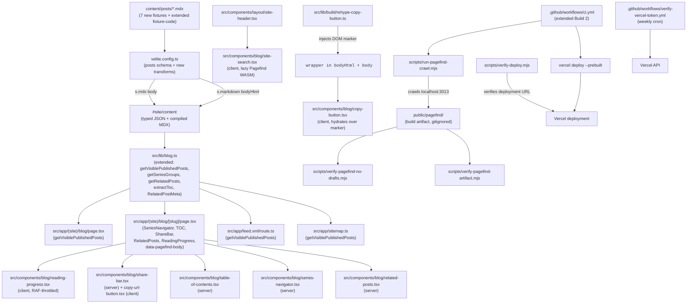

# Design Document

## Overview

The blog-enhanced feature layers eight discovery / engagement / reading-UX surfaces on top of the static blog shipped by `blog-core`: Pagefind site search, a series UI (badge + navigator), a build-time related-posts rail, a social share bar, a reading-progress bar, an in-flow table of contents, styled GFM footnotes, and copy-to-clipboard buttons on code blocks. The deployment topology is also restructured: Vercel auto-deploys are replaced with a CI-driven `vercel deploy --prebuilt` step gated behind two GitHub Actions repository variables (`DEPLOY_VIA_CI`, `PAGEFIND_ENABLED`) so the Pagefind index can be built in CI and shipped as part of the deploy artifact.

The design is **additive** to blog-core. The Velite `posts` collection schema is extended with two optional frontmatter fields (`hiddenFromLists?: boolean` and a `categories.max(3)` cap); no new collections are introduced. The `src/lib/blog.ts` query module gains four helpers (`getVisiblePublishedPosts`, `isHiddenFromLists`, `getSeriesGroups`, `getRelatedPosts`) and one type (`RelatedPostMeta`). The Velite `sharedRehypePlugins` array gains one entry (`rehypeCopyButton`). One new build-time MDAST-visitor clause in the `posts.transform` rejects h4+ headings unless `BLOG_ALLOW_H4=1` is set, and a slug-prefix audit rejects published `fixture-*` slugs that lack `hiddenFromLists: true`. The CI workflow gains a six-step Pagefind + Vercel-deploy group in Build 2; Build 1 is untouched.

Three migrations land alongside the feature work: (1) `vercel` CLI added as an exact-pinned `devDependency`, (2) `public/pagefind/` added to `.gitignore` (build artifact), (3) `src/components/blog/site-search.tsx` introduces the spec's only material client-JS surface beyond Pagefind's lazy WASM (the reading-progress bar, copy-URL button, and copy-code button are smaller islands). All client surfaces respect the `prefers-reduced-motion` token and degrade gracefully when JavaScript is disabled or Pagefind fails to load.

Eight new fixtures (`fixture-toc`, `fixture-footnotes`, `fixture-related-a`, `fixture-related-b`, `fixture-series-1`, `fixture-series-2`, `fixture-search`) extend the blog-core fixture roster. Seven of them are `draft: true`; `fixture-search` is **published** but hidden from list contexts via the new `hiddenFromLists` field — reachable as a static page so Pagefind can index it, invisible on `/blog`, in `/feed.xml`, in the sitemap, and in taxonomy pages. Hidden posts ALSO carry `<meta name="robots" content="noindex, nofollow">` to prevent search-engine indexing (v2 — addresses SEO leak surfaced in r1 review).

**v4 — Adversarial review response (this revision; FINAL — no further iterations planned)**

v4 resolves five P0 risks v3 introduced (per `.spec-workflow/specs/blog-enhanced/reviews/adversarial-analysis-design-r3.md`):

1. **`next.config.ts` velite-import defensive load** (v4 — addresses r3 P0 #1): the existing `package.json` postinstall hook (`"postinstall": "velite build"` — verified at line 18 of the current `package.json`) DOES produce `.velite/index.js` before `next build` runs, so the v3 import IS reachable on a fresh clone. **But** the reviewer's underlying fragility concern is valid — a missing `.velite/` directory in any environment (CI cache corruption, manual cleanup, content-schema failure during postinstall) would break `next.config.ts` loading. v4 wraps the import in a defensive try/catch with empty-array fallback. The header rules apply when velite output is available; when absent, hidden-route headers are not emitted (the `<meta name="robots">` tag still applies — defense-in-depth degrades to single-layer, never to zero).
2. **`<CopyStatusProvider>` REMOVED — direct DOM update** (v4 — addresses r3 P0 #2): v3 introduced a React context for the shared `aria-live` region, but the `<CopyButton />` hydration mechanism is `document.querySelectorAll('[data-copy-button]')` — buttons are NOT in the React tree and cannot consume context. v4 reverses this: render ONE static `<output id="copy-status" role="status" aria-live="polite" aria-atomic="true" className="sr-only" />` in `[slug]/page.tsx` (server-rendered, no provider). The DOM-hydrator for copy buttons updates it via `document.getElementById("copy-status").textContent = ...`. No React context, no provider, no re-render cascade. The shared region is plain DOM; the buttons are plain DOM hydrators; the two layers are consistent.
3. **`derive-post-slug` converted to `.mjs`** (v4 — addresses r3 P0 #4): v3's `.mjs` scripts import a `.ts` source via a `.js` path, which fails at runtime (no transpiled output exists at that path). v4 converts `src/lib/build/derive-post-slug.ts` to `src/lib/build/derive-post-slug.mjs` (plain JS with JSDoc types for IDE/typecheck affordance). Both Velite (via `import` from `velite.config.ts`, which Velite's loader resolves) AND the `.mjs` scripts can consume it as pure Node ESM. The migration is straightforward — the file's contents are ~10 lines of logic plus a Set.
4. **Task 0 spike scope rewritten** (v4 — addresses r3 P0 #3): the spike now specifically tests the `--input-file` mechanism, `--adjust-extension` for extensionless URLs, the master timeout, and the non-empty index assertion against an UNLINKED HTML page. The previous "run against current main" spike is INSUFFICIENT — v4 pins a deliberate setup that creates a temporary unlinked page, feeds it via `--input-file`, and asserts Pagefind indexes it. The spike's outcome is recorded via an `IMPLEMENTATION_LOG.md` entry pinned by the tasks document.
5. **`wget --no-parent` REMOVED** (v4 — addresses r3 P0 #5): the flag conflicts with mixed-entry-point crawling via `--input-file`. The other constraints (`--exclude-directories`, `--reject`, `--span-hosts=off` default) sufficiently scope the crawl. v4 drops `--no-parent` from the wget invocation.

Plus eight smaller v4 fixes pinned in the v4 changelog at the end:
- `extraSlugs` filter narrowed to exclude both `draft: true` AND `excludeFromSearch: true` posts.
- `urls-extra.txt` written to `os.tmpdir()` (not the repo root) — eliminates the lifecycle concern.
- `data-pagefind-body` JSX expression pinned exactly: `<article {...(post.excludeFromSearch ? {} : { "data-pagefind-body": "" })}>`.
- Truth-table Vitest test matrix pinned for the four `(hiddenFromLists, excludeFromSearch)` rows.
- `X-Robots-Tag` policy statement pinned: "applies to `hiddenFromLists === true` posts ONLY, regardless of `excludeFromSearch`."
- `<div role="status">` chosen over `<output>` for SR-compatibility breadth (per r3 §5).
- `verify-getPublishedPosts-callers.mjs` regex tightened to strip inline trailing comments before matching (`line.split("//")[0]`).
- A `verify-getPublishedPosts-callers.test.mjs` Vitest test asserts the verifier passes against the current codebase (second enforcement layer beyond CI).

The v3 design's structural decisions (Velite schema extensions, `getVisiblePublishedPosts`, `RelatedPostMeta` composition, RAF-throttled `<ReadingProgress />`, `data-pagefind-ignore` placement, two-axis Playwright TOC parity, `<PostCard />` reuse, flat `TocEntry[]`, `@pagefind/default-ui`, three-place `3013` literal, `KNOWN_FIXTURE_SLUGS` audit, UTF-8-safe decode, `data-copy-source` RSS strip, `rehypeCopyButton` plugin order, `excludeFromSearch` flag, taxonomy module split, `X-Robots-Tag` defense-in-depth, master timeout, `--adjust-extension`, `--input-file`, non-empty index assertion, Lighthouse measurement methodology) are preserved unchanged.

The v3, v2, and v1 changelogs remain at the bottom for traceability.

**v3 — Third revision adversarial response**

v3 resolves the P0 issues and novel risks v2 introduced (per `.spec-workflow/specs/blog-enhanced/reviews/adversarial-analysis-design-r2.md`):

1. **wget reachability fix — explicit URL list for hidden posts** (Crawl orchestration v3): the v2 reviewer correctly identified that `wget --mirror` walking from `/` cannot reach `fixture-search` (which is intentionally unlinked from `/blog`, sitemap, feed, taxonomy). v3 adds an `--input-file=./urls-extra.txt` argument to wget; the file is built at crawl time from `KNOWN_FIXTURE_SLUGS` + any `hiddenFromLists: true` posts. This is the "explicit hidden URL list" the reviewer's P0 fix recommended.
2. **wget `--adjust-extension`** (Crawl orchestration v3): wget writes extensionless files for URLs without `.html`; Pagefind 1.x's HTML-discovery requires `.html` extension. Adding `--adjust-extension` fixes the silent-empty-index P0.
3. **Non-empty index assertion** (`verify-pagefind-no-drafts.mjs` v3): the script gains a positive assertion — the index MUST contain ≥ `getVisiblePublishedPosts().length` entries. This catches the "wget ran but Pagefind indexed nothing" silent failure.
4. **Master timeout on `run-pagefind-crawl.mjs`** (v3): the script wraps the whole pipeline in a 600s `Promise.race` against `AbortController.abort`. Hung wget no longer burns CI runtime.
5. **`aria-live` REVERSE-REVERSE — single shared region with `aria-atomic="true"`** (`<CopyButton />` v3): v2 swung from "shared region with collision" to "N regions per page." v3 lands on the correct ARIA pattern — a single shared `<output aria-live="polite" aria-atomic="true">` rendered once per post page; all copy buttons write to it. `aria-atomic` re-announces on every text change, so rapid-fire clicks each announce. Reverses v2's per-button regions.
6. **`X-Robots-Tag` HTTP header for hidden posts** (`next.config.ts` v3 extension): v2 set `<meta name="robots">` only. v3 ALSO emits `X-Robots-Tag: noindex, nofollow` per-route for `KNOWN_FIXTURE_SLUGS` and any post whose `hiddenFromLists === true`. Defense-in-depth — bots that parse only headers still get the signal.
7. **`excludeFromSearch?: boolean` second schema flag** (v3 schema addition): v2's `hiddenFromLists` was semantically overloaded ("hide from lists, still in search"). v3 adds a second optional flag `excludeFromSearch?: boolean` with default `false`. Posts that set BOTH are hidden everywhere (lists + search); posts that set only `hiddenFromLists` keep the v2 behavior. `fixture-search` keeps `hiddenFromLists: true` and DOES NOT set `excludeFromSearch` (it must be searchable for the smoke test).
8. **Taxonomy helpers MOVED to `src/lib/blog-taxonomy.ts`** (v3 module reorg): `getAllTags`, `getAllCategories`, `getPostsByTag`, `getPostsByCategory` move to a new file. The file is NOT in `ALLOWED_CALLERS` — its callers MUST use `getVisiblePublishedPosts()`. This fixes the v2 file-level-allow-list loophole the reviewer identified. `src/lib/blog.ts` retains `getVisiblePublishedPosts`, `isHiddenFromLists`, `getSeriesGroups`, `getRelatedPosts`, `extractToc`, and the slug/neighbors functions that ARE direct-URL contexts.
9. **`verify-getPublishedPosts-callers.mjs` regex tightened** (v3): switches from `git grep -lE "getPublishedPosts\(\)"` to a per-line scan that EXCLUDES JSDoc / `//` comments and adds word-boundary anchors. Eliminates the false-positive on the `getPublishedPosts()` JSDoc warning text.
10. **Language source of truth pinned** (v3): drop `data-code-language` from the `<div class="code-block-wrapper">` wrapper. The `<code>` element's `data-language` attribute (set by `rehype-pretty-code`) is the SOLE language source. The wrapper carries `data-code-block` (a presence indicator) only. Eliminates the v2 ambiguity between two language attributes.
11. **`<SiteSearch />` trigger is `<button>`, never `<a href="#">`** (v3 clarification): pinned in the component spec so wget doesn't try to follow a `#` self-loop. The trigger has `type="button"` and dispatches the dialog open via `onClick`, NOT an anchor with hash href.
12. **Pre-implementation pipeline spike pinned as Task 0** (v3): the v2 reviewer's "10-minute spike" recommendation lands as the first task in the implementation phase (`tasks.md` will pin it). The spike runs `next build → wget → pagefind` against the current `main` and validates: (a) wget produces `.html` files, (b) Pagefind reads them, (c) the index is non-empty. If the spike fails, the design returns to revision; tasks do not begin.

Plus three smaller v3 fixes:
- Migration runbook step 1's "no behavior change" claim is removed entirely — replaced with explicit acknowledgment that visibility-filter flips ALSO land in the same PR and ARE part of the behavior change.
- `verify-getPublishedPosts-callers.mjs` step is pinned in the YAML block (not prose only) and `verify-ci-topology.mjs`'s ordered-step list is updated to include it.
- The `data-copy-source` RSS-strip regex gains a Vitest test against a non-ASCII fixture body to prevent silent regex breakage.

The v2 design's structural decisions (Velite schema extensions including `hiddenFromLists`, `getVisiblePublishedPosts`, `RelatedPostMeta` composition, `<ReadingProgress />` RAF throttling, `data-pagefind-ignore="all"` placement, two-axis Playwright TOC parity, `<PostCard />` reuse, flat `TocEntry[]`, `@pagefind/default-ui`, three-place `3013` literal, `KNOWN_FIXTURE_SLUGS` audit, Lighthouse measurement methodology) are preserved unchanged.

**v2 — First adversarial review response**

v2 resolves six material findings from the v1 adversarial analysis at `.spec-workflow/specs/blog-enhanced/reviews/adversarial-analysis-design.md`:

1. **Pagefind crawl mechanism pinned without ambiguity** (Search subsystem v2): the v1 "directory crawl OR HTTP crawl, pin during implementation" contradiction is replaced with a single pinned mechanism: `next build → next start (background) → wget --mirror to ./out → pagefind --site ./out --output-path public/pagefind → terminate next start`. The `pagefind --site` flag canonically takes a directory; the wget mirror handles the "next build doesn't produce a clean static directory" gap.
2. **`PROD_LIKE_PORT` centralization REVERSED** (Architecture/CI v2): per CLAUDE.md's "DO NOT over-engineer" directive, the literal `3013` is duplicated in `package.json`, `lighthouserc.js`, and `scripts/run-pagefind-crawl.mjs` — no wrapper script, no constant centralization, no verifier. Three identical literals with a short comment in each file naming the others.
3. **Pagefind UI choice REVERSED** (`<SiteSearch />` v2): the spec now uses `@pagefind/default-ui` with thin Tailwind/CSS overrides rather than a custom results UI. Rationale: keyboard navigation, result-count announcement, debounced input, no-results / loading / error states are all maintained by the upstream package; reinventing them is the opposite of "boring".
4. **`<CopyButton />` UTF-8 + RSS bloat fixes** (Component v2): client decode now uses `TextDecoder` over `Uint8Array.from(atob(...))` to handle non-ASCII source. The `data-copy-source` base64 payload is STRIPPED from `bodyHtml` in the Velite transform (RSS feed stays clean); the attribute lives in the page-rendered body only via a separate rehype-pretty-code-data-source readout pinned below. The shared aria-live region drops `aria-describedby` (the misuse v1 reviewer caught) and each button has its OWN inline `aria-live="polite"` status span (1-2 lines of DOM per button, semantically correct).
5. **CI gating semantics rewired** (CI extensions v2): Error Scenario 4 rewritten to match the actual YAML behavior — a failed crawl FAILS CI; deploying without search requires the operator to first set `PAGEFIND_ENABLED=false`. The "Check Vercel auto-deploy status" step is pinned in the YAML block (not prose only). `always()` is replaced with explicit gating expressions. The migration runbook step 1 acknowledges the ~30s CI duration delta from the new unconditional Pagefind steps.
6. **`fixture-search` SEO + slug-audit-collision fixes** (Schema v2): the slug audit narrows from `/^fixture-/` to an exact-match against a pinned `KNOWN_FIXTURE_SLUGS` constant in `src/lib/build/derive-post-slug.ts`, eliminating the false-positive risk for a real essay titled "Building fixture-driven tests". Hidden posts also carry `noindex` metadata. A new `scripts/verify-getPublishedPosts-callers.mjs` grep enforces the call-site allow-list for `getPublishedPosts()`.

Plus three smaller fixes pinned in the v2 changelog at the end:
- Lighthouse `total-byte-weight` threshold changed from a guessed 350KB to a **measurement-during-implementation methodology** (baseline + 100KB + 10% buffer; threshold lands when first CI run produces a baseline).
- Readiness timeout extended from 90s to 180s, with last-HTTP-status reporting on poll failure.
- `verify-vercel-token.yml` issue-close logic uses an `ops` label + `gh issue list --label ops` to close ALL open matches, not just `.[0]`.

The v1 design's structural decisions (Velite schema extensions, `getVisiblePublishedPosts`, `RelatedPostMeta` composition, `<ReadingProgress />` RAF throttling, `data-pagefind-ignore="all"` placement, two-axis Playwright TOC parity, `<PostCard />` reuse) are preserved unchanged.

## Steering Document Alignment

### Technical Standards (tech.md)

- **Static-first deployment, extended**: every new route remains `export const dynamic = 'force-static'`. The Pagefind index is a build artifact (`public/pagefind/`) generated by the new `pnpm build:search` script that orchestrates `next build → next start → pagefind crawl → terminate`. Vercel's runtime serves the resulting static files; no runtime search backend.
- **Build-time content pipeline preserved**: the new `rehypeCopyButton` plugin is registered in the existing `sharedRehypePlugins` constant (one source of truth, both `mdx.rehypePlugins` and `markdown.rehypePlugins` reference it). It is **stateless across `(pipeline, file)` invocations** — the plugin is a factory that returns a fresh visitor per call but holds no per-file closure state, matching blog-core Req 11.7a.
- **Velite v0.3.1 API audit (continued)**: the schema extension uses `s.boolean().optional()` (verified against `node_modules/velite/dist/index.d.ts` — `BooleanSchema` line 6794) and `s.array(s.string()).max(3)` (verified line 6809). No new Velite primitives required.
- **CSP compatibility — verified, no changes required**: Pagefind's dynamic `import('/pagefind/pagefind.js')` is same-origin (`script-src 'self'` already permits it). Pagefind ships ES modules + a `.wasm` file; `WebAssembly.instantiate` from a same-origin response is permitted under the current policy. Radix `Dialog` uses inline styles, already covered by `style-src 'self' 'unsafe-inline'`. The share bar's external `<a>` targets are unconstrained by CSP (CSP does not restrict link `href`s). **CSP audit committed in design.md** so the next deploy doesn't surprise the reviewer.
- **Performance target (Lighthouse ≥ 90) extended**: `lighthouserc.js` gains `/blog/fixture-toc` and a `total-byte-weight` audit assertion. Pagefind UI is excluded from the page-load measurement because it lazy-imports on first dialog open.
- **Accessibility (WCAG 2.1 AA) extended**: existing two-theme axe pass extended to five additional surfaces (`fixture-toc`, `fixture-footnotes`, `fixture-related-a`, `fixture-series-1`, search-dialog-open on `/blog`). The reading-progress bar is `role="presentation"`; the search dialog is a Radix `Dialog` with native focus trap; copy-status uses `aria-live="polite"`.
- **Server-by-default rule preserved**: post pages and index pages remain server components. The eight new client surfaces (`SiteSearch`, `ReadingProgress`, `CopyURLButton`, `CopyButton`) are surgical inserts; they do **not** propagate `"use client"` upward.

### Project Structure (structure.md)

- **Components** land under `src/components/blog/` (sibling to blog-core's `post-card.tsx`, `prev-next-nav.tsx`, etc.): `site-search.tsx`, `reading-progress.tsx`, `share-bar.tsx`, `copy-url-button.tsx`, `table-of-contents.tsx`, `copy-button.tsx`, `series-badge.tsx`, `series-navigator.tsx`, `related-posts.tsx`. No barrel files. All named exports. PascalCase identifiers; `kebab-case.tsx` filenames.
- **Helpers** in `src/lib/blog.ts` (extended): `getVisiblePublishedPosts`, `isHiddenFromLists`, `getSeriesGroups`, `getRelatedPosts`, `extractToc`. **The new `RelatedPostMeta` type is exported from the same module.** A guarded JSDoc tag on `getPublishedPosts()` warns "for LIST contexts, prefer `getVisiblePublishedPosts()`".
- **Taxonomy helpers MOVED to `src/lib/blog-taxonomy.ts`** (v3 module reorg, addresses r2 risk #3): `getAllTags`, `getAllCategories`, `getPostsByTag`, `getPostsByCategory` move OUT of `src/lib/blog.ts` to a new file. The new file is NOT in `ALLOWED_CALLERS`, so the `verify-getPublishedPosts-callers` script forces all four helpers to call `getVisiblePublishedPosts()` (NOT `getPublishedPosts()`). This eliminates the file-level allow-list loophole the v2 reviewer identified — a future helper added to `blog-taxonomy.ts` cannot use the unfiltered function without tripping the verifier. Migration impact: `src/app/(site)/blog/tags/[tag]/page.tsx`, `src/app/(site)/blog/categories/[category]/page.tsx`, and `src/app/sitemap.ts` update their import paths from `@/lib/blog` to `@/lib/blog-taxonomy` for the four helpers. Vitest tests follow: `src/lib/blog-taxonomy.test.ts` (new) replaces the taxonomy section of `blog.test.ts`.
- **Build-time helpers** in `src/lib/build/`: `rehype-copy-button.ts` (new), `derive-post-slug.ts` (new — shared between `velite.config.ts` and the CI smoke check).
- **Verification scripts** in `scripts/`: `run-pagefind-crawl.mjs` (new), `verify-pagefind-no-drafts.mjs` (new), `verify-pagefind-artifact.mjs` (new), `verify-deploy.mjs` (new). Existing scripts (`verify-ci-topology.mjs`, `verify-requirements-coverage.mjs`) are extended.
- **Tests**: Vitest colocates with helpers (`src/lib/blog.test.ts` extended); Playwright tests under `e2e/tests/` (`blog-search.test.ts`, `blog-toc.test.ts`, `blog-share.test.ts`, `blog-related.test.ts`, `blog-series.test.ts`, `blog-no-js.test.ts` extended). The `e2e/tests/blog-pagefind-failure-matrix.test.ts` test covers the four Req 1.9a failure modes.
- **Content** lands in `content/posts/` (blog-core's existing directory). Seven new fixture files; one extension to `fixture-code.mdx`.
- **CI orchestration** lives in `.github/workflows/ci.yml` (extended) and `.github/workflows/verify-vercel-token.yml` (new — scheduled weekly).
- **Styles**: the Shiki theme CSS in `src/styles/globals.css` is extended with: code-block-wrapper styling, copy-button positioning, share-bar tokens, reading-progress bar tokens (light/dark), footnote section styling, TOC indentation tokens. No new CSS files.
- **Naming**: `kebab-case.{tsx,ts}` files; `PascalCase` named exports; route segments and tag/category slugs remain `kebab-case`; `series` frontmatter values are human-readable strings (Req 3.1).

## Code Reuse Analysis

### Existing Components to Leverage

- **`<MDXContent />` (`src/components/shared/mdx-content.tsx:10`)**: Reused verbatim. No changes — the new `<CopyButton />` hydrates from a server-rendered DOM marker the `rehypeCopyButton` plugin emits, not from the MDX render path.
- **Radix UI (`radix-ui ^1.4.3` in `package.json:25`)**: The search dialog uses `radix-ui/react-dialog` (already transitively available); we wire a thin `<SiteSearch />` wrapper. The Radix `Dialog` provides focus trap, escape-to-close, and `aria-modal` semantics for free.
- **`lucide-react` (already in `dependencies` per `package.json:15`)**: Source of all new icons — search (`Search`), share (`Share2`), X/Twitter (`Twitter`), LinkedIn (`Linkedin`), mailto (`Mail`), copy URL (`Link` + state-toggle to `Check`), copy code (`Copy` + state-toggle to `Check`).
- **`<PostCard />` (`src/components/blog/post-card.tsx`)**: Reused on the related-rail as the card primitive (Req 4.5) — a slimmer variant is unnecessary since the existing card already renders a compact title + description + date layout. The series badge component (`<SeriesBadge />`) is rendered ABOVE the post card title when a series is set (Req 2.1).
- **`<TagChip />` (`src/components/blog/tag-chip.tsx`)**: Reused in the series navigator's "current post" marker treatment. **No changes.**
- **`<PrevNextNav />` (`src/components/blog/prev-next-nav.tsx`)**: Reused unchanged. The related rail renders BELOW prev/next per Req 4.5.
- **`siteConfig.url` (`src/config/site.ts`)**: Source of truth for absolute URLs in the share bar (`new URL('/blog/' + slug, siteConfig.url).toString()`). No hardcoded origin literals.
- **`getPublishedPosts()` (`src/lib/blog.ts:21`)**: Reused as the foundation for the new `getVisiblePublishedPosts()` (`getPublishedPosts().filter(p => !isHiddenFromLists(p))`). The base function is **not modified** — preserves the `getPostBySlug` direct-URL contract.
- **`sharedRehypePlugins` (`velite.config.ts:30-34`)**: Extended with `rehypeCopyButton()` **BEFORE** `rehypePrettyCode` (v2 — moved per the text-extraction fidelity requirement). The constant remains the single source of truth referenced by both `mdx.rehypePlugins` and `markdown.rehypePlugins`.
- **`rehype-slug` (already registered)**: Reused. The TOC extraction reads `<h2 id>` and `<h3 id>` attributes from the `bodyHtml` field (post-`rehype-slug` HAST) — **no new `github-slugger` instantiation** in spec code.
- **`@axe-core/playwright` (`devDependencies` line 32)**: The existing two-theme axe pass extends to five additional routes.
- **`@lhci/cli` (`devDependencies` line 33)**: The existing `lighthouserc.js` config gains one URL and one assertion (`total-byte-weight`).
- **`node-html-parser` (`devDependencies` line 49)**: Used by `extractToc()` (HAST/HTML parse of `bodyHtml`) and by the draft-leak smoke check.

### Integration Points

- **Velite content pipeline**: `posts.schema` extended with `hiddenFromLists: s.boolean().optional()` (default `false`) and `categories: s.array(s.string()).max(3).default([])` (cap added). New MDAST-visitor clause in the `posts.transform` rejects h4+ headings unless `BLOG_ALLOW_H4=1`. New slug-audit clause rejects `fixture-*` slug + `draft: false` + `hiddenFromLists !== true`. New `rehypeCopyButton()` entry in `sharedRehypePlugins`. **All extensions are additive**: existing blog-core posts pass the new schema without modification (no h4 headings exist in the current corpus; the `categories` cap is 3 and current usage is 1-2; no slugs start with `fixture-` outside the explicit fixture roster).
- **`#site/content` typed output**: Adding `hiddenFromLists` to the schema adds it to the `Post` typed shape (TypeScript inference flows automatically). `getPublishedPosts()` callers see a new optional field. **No downstream breakage** — the only new code that reads it is `isHiddenFromLists()`.
- **`src/app/(site)/blog/page.tsx`**: Switches its single `getPublishedPosts()` call to `getVisiblePublishedPosts()`. **One-line change**.
- **`src/app/(site)/blog/[slug]/page.tsx`**: Gains: `<SeriesNavigator />` (above prose, conditional), `<TableOfContents />` (above prose, conditional), `<ShareBar />` (below prose, above prev/next), `<RelatedPosts />` (below prev/next), `<ReadingProgress />` (page-level mount), `data-pagefind-body` attribute on `<article>` (gated by `!post.excludeFromSearch` — v3), a hidden `data-pagefind-meta` span for `description`, `data-pagefind-meta` attributes for tags/categories on `<article>`, and the static `<div id="copy-status" role="status" aria-live="polite" aria-atomic="true" className="sr-only" />` (v4 — for the copy-button announce region). The existing tag chip `<ul>` gains `data-pagefind-ignore="all"`. **v2 — `generateMetadata()` extension for hidden posts:** when `post.hiddenFromLists === true`, the returned `Metadata.robots = { index: false, follow: false }` is set (matching the existing draft-banner treatment at the same call site). The audit is enforced at the page layer so the OpenGraph + Twitter card metadata also reflects noindex.
- **`<article>` `data-pagefind-body` JSX (v4 — pinned exactly per r3 §3 first bullet):** the attribute is conditionally PRESENT vs ABSENT (not present-empty-string). Pinned:
  ```tsx
  <article {...(post.excludeFromSearch ? {} : { "data-pagefind-body": "" })}>
  ```
  Rationale: Pagefind's documented behavior keys on attribute presence, not on attribute value. Rendering `data-pagefind-body=""` (empty string) is treated as "present"; rendering `data-pagefind-body={undefined}` or omitting the attribute via the spread above is treated as "absent". The JSX spread guarantees React emits NO attribute when `excludeFromSearch` is true, so Pagefind skips the body. Behavioral assertion in the Vitest test (below) verifies the DOM.
- **`next.config.ts` `headers()` callback** (v4 — defensive load addressing r3 P0 #1): the existing `headers()` callback is extended with a build-time-computed list of route headers that emit `X-Robots-Tag: noindex, nofollow` for every hidden post. The list is computed by reading the post-build Velite output. **The import is wrapped in a try/catch so a missing `.velite/index.js` (cache corruption, partial install, etc.) does NOT break `next build`**:
  ```ts
  // Inside next.config.ts (extends existing headers() callback)
  // The postinstall script `velite build` in package.json (line 18) produces
  // .velite/index.js before `next build` runs. The defensive try/catch keeps
  // next.config.ts loadable even if that artifact is missing — header-layer
  // noindex degrades to <meta>-only (still single-layer enforcement, never zero).
  let hiddenRoutes = [];
  try {
    const { posts } = await import("./.velite/index.js");
    hiddenRoutes = posts
      .filter((p) => p.hiddenFromLists === true && !p.draft)
      .map((p) => `/blog/${p.slug}`);
  } catch {
    // .velite/index.js absent — emit only the existing CSP/preview headers.
    // <meta name="robots"> on the page still applies (Next.js Metadata API).
  }
  routes.push(
    ...hiddenRoutes.map((source) => ({
      source,
      headers: [{ key: "X-Robots-Tag", value: "noindex, nofollow" }],
    })),
  );
  ```
  **Defense-in-depth**: hidden posts get BOTH `<meta name="robots">` (via Next.js Metadata API) AND `X-Robots-Tag` (via the headers callback). A crawler that parses only headers still receives the noindex signal. The header rule applies even if a future contributor accidentally removes the `<meta>` emission. **v4 policy statement (addresses r3 §1 fourth bullet):** the `X-Robots-Tag` header applies to `hiddenFromLists === true` posts ONLY. Posts with `excludeFromSearch: true` but `hiddenFromLists: false` are visible in lists and SHOULD be indexed by external search engines — they only need exclusion from the site-internal Pagefind crawl, NOT from Google. The two flags target different concerns; the header rule mirrors the lists-visibility concern only.
- **`src/app/feed.xml/route.ts`**: Switches from `getPublishedPosts()` to `getVisiblePublishedPosts()`. **One-line change.**
- **`src/app/sitemap.ts`**: Same switch. **One-line change.** The taxonomy and tag enumeration helpers (`getAllTags`, `getAllCategories`) are updated to source from `getVisiblePublishedPosts()` so `fixture-search`'s `search-test` tag doesn't generate a `/blog/tags/search-test` static page.
- **`src/components/layout/site-header.tsx`** (existing layout — Design pins exact path during implementation): adds the `<SiteSearch />` trigger button rightmost in the header nav row, **before** the theme toggle so the toggle's known visual position is preserved.
- **`.github/workflows/ci.yml`**: Build 2 step group extended with six new sequential steps: `"Pagefind crawl (Build 2)"`, `"Verify Pagefind index (Build 2)"`, `"Upload Pagefind manifest"`, `"Vercel build"`, `"Verify Pagefind artifact in .vercel/output"`, `"Vercel deploy (Build 2)"`, plus the conditional `"Warn: deploying without Pagefind"` step (runs only when `vars.PAGEFIND_ENABLED == 'false'`). Build 1 is **unchanged**.
- **`.github/workflows/verify-vercel-token.yml`** (new): scheduled weekly Monday 12:00 UTC. Calls `vercel whoami`; failure opens a GitHub issue via `gh issue create` and relies on GitHub's default email-on-workflow-failure.
- **`scripts/verify-ci-topology.mjs`**: extended to match the seven new step name literals in order.
- **`scripts/verify-requirements-coverage.mjs`**: extended for the new requirement set (Reqs 0-13).
- **`lighthouserc.js`**: gains `/blog/fixture-toc` URL and one `total-byte-weight` assertion.
- **`package.json`**: gains `vercel` (exact-pinned to `54.3.0`), `pagefind` (exact-pinned to `1.5.2`), and `@pagefind/default-ui` (exact-pinned to `1.5.2` — see Pagefind component decision below). Gains `pnpm build:search` script. **The `start` script keeps `--port 3013` literal** (see Port-constant decision below).
- **`.gitignore`**: gains `public/pagefind/`.
- **Dependabot**: a new `.github/dependabot.yml` (or existing config extended) routes `vercel` and `pagefind` version bumps to a SEPARATE category that is NOT auto-merged. Manual review required because minor-version bumps can change `--prebuilt` semantics or index format.

## Architecture

The implementation has seven layered concerns. Layers 1-3 are blog-core layers that this spec extends; layers 4-7 are new.

1. **Content schema** (`velite.config.ts` extensions): hiddenFromLists flag, categories.max(3), h4+ rejection, fixture-prefix-slug audit. Owns the build-time validation contracts.
2. **Query layer** (`src/lib/blog.ts` extensions): `getVisiblePublishedPosts`, `isHiddenFromLists`, `getSeriesGroups`, `getRelatedPosts`, `extractToc`, `RelatedPostMeta`. The single chokepoint between Velite output and consumers; preserves the blog-core draft-filtering posture.
3. **Presentation** (`src/components/blog/**`, `src/app/(site)/blog/**`): server-rendered pages with surgical client islands. Server components: `<ShareBar>`, `<TableOfContents>`, `<SeriesBadge>`, `<SeriesNavigator>`, `<RelatedPosts>`. Client components: `<SiteSearch>`, `<ReadingProgress>`, `<CopyURLButton>`, `<CopyButton>`.
4. **Build-time content pipeline** (`src/lib/build/rehype-copy-button.ts`, `src/lib/build/derive-post-slug.ts`): the rehype plugin that injects copy-button DOM markers into `<pre>` elements; the shared slug-derivation function used by both Velite and the CI smoke check.
5. **Search subsystem** (Pagefind): the `pnpm build:search` orchestration script, the Pagefind CLI invocation, the client-side search dialog, the failure-mode-graceful empty state.
6. **CI topology** (`.github/workflows/ci.yml` extensions, `.github/workflows/verify-vercel-token.yml`, `scripts/verify-pagefind-no-drafts.mjs`, `scripts/verify-pagefind-artifact.mjs`, `scripts/verify-deploy.mjs`): the seven new sequential steps, the kill-switch and migration gates, the artifact preservation check.
7. **Verification** (Vitest + Playwright extensions): unit tests on the four new helpers, Playwright tests for search dialog keyboard nav, Pagefind failure matrix (script-404, entry-json-404, CSP-block), TOC slug parity (Build 1 + Build 2), no-JS degradation matrix.

### Modular Design Principles

- **Single File Responsibility**: each new component does one thing (search dialog, progress bar, share bar, TOC, etc.). Each helper in `blog.ts` does one thing (visibility filter, series grouping, related computation, TOC extraction).
- **Component Isolation**: client components are surgical inserts. `<SiteSearch />` is the only client component above the blog content layer (mounted in the site header); the other three are scoped to the post page. None propagate `"use client"` upward.
- **Service Layer Separation**: the page components never import `#site/content.posts` directly — they go through `src/lib/blog.ts` exclusively (blog-core invariant preserved). The new helpers continue this pattern.
- **Utility Modularity**: `extractToc` lives in `blog.ts` if it stays under ~50 lines; otherwise migrates to `src/lib/blog-toc.ts` per the NFR. Initial implementation will be ~40 lines (HAST traversal + filter), so it stays in `blog.ts`.



## Components and Interfaces

### Velite `posts` collection extensions (`velite.config.ts`)

- **Purpose:** Add `hiddenFromLists` flag, enforce categories cap, reject h4+ headings (unless `BLOG_ALLOW_H4=1`), and reject published `fixture-*` slugs without the explicit hide flag.
- **Interfaces:** No new exports; the `posts.transform` body is extended in place.
- **Dependencies:** existing imports (`remarkParse`, `remarkGfm`, `remarkMdx`, `visit`); no new packages.
- **Reuses:** the existing MDAST visitor pattern at `velite.config.ts:132-169` (the html/MDX rejection block).
- **Schema additions (v3 — adds `excludeFromSearch`):**
  ```ts
  // Added inside the s.object({...}) block:
  hiddenFromLists: s.boolean().optional(),          // v2 — hide from /blog, RSS, sitemap, taxonomy
  excludeFromSearch: s.boolean().optional(),        // v3 — additionally exclude from Pagefind crawl
  // Modified — categories gains .max(3):
  categories: s.array(s.string()).max(3).default([]),
  ```
- **`hiddenFromLists` vs `excludeFromSearch` semantics (v3 — addresses r2 risk #4):**

  | `hiddenFromLists` | `excludeFromSearch` | Behavior |
  |---|---|---|
  | false (default) | false (default) | Normal published post: in lists, in RSS, in sitemap, in taxonomy, in Pagefind. |
  | true | false (default) | Hidden from list contexts but **searchable** via Pagefind. **This is `fixture-search`'s configuration.** |
  | true | true | Hidden everywhere (lists AND search). Use for operational pages like `/blog/thanks-for-subscribing`. |
  | false | true | Visible in lists but excluded from search. Rare; useful for a "table-of-contents-style" landing page. |

  The Velite transform sets `data-pagefind-body` on the post page ONLY when `excludeFromSearch !== true`. Posts with `excludeFromSearch: true` render normally as a static page but Pagefind skips them at crawl time. The fixture audit (`KNOWN_FIXTURE_SLUGS`) does NOT require `excludeFromSearch` — `fixture-search` is in the roster but is intentionally searchable.
- **h4+ rejection (Req 7.10 v4) — Pinned in the MDAST visitor:**
  ```ts
  if (t === "heading") {
    const depth = (node as { depth?: number }).depth;
    if (typeof depth === "number" && depth >= 4) {
      if (process.env.BLOG_ALLOW_H4 !== "1") {
        throw new Error(
          `[velite/posts] ${fileRel}: heading depth ${depth} (h${depth}) is not supported by the TOC pipeline. Use h2/h3 only, or set BLOG_ALLOW_H4=1 to allow h4+ headings (they will not appear in the TOC).`,
        );
      }
      process.stderr.write(
        `[velite/posts] ${fileRel}: h${depth} heading present; not included in TOC. Set BLOG_ALLOW_H4=1 acknowledged.\n`,
      );
    }
  }
  ```
- **Fixture-slug audit (v2 — narrowed scope per r1 review):** the v1 design used the regex `/^fixture-/` which would false-positive on a legitimate essay slug like `fixture-driven-testing`. v2 narrows the audit to exact-match against a pinned `KNOWN_FIXTURE_SLUGS` constant in `src/lib/build/derive-post-slug.ts`. The constant is:
  ```ts
  export const KNOWN_FIXTURE_SLUGS = new Set<string>([
    "fixture-draft",           // blog-core
    "fixture-code",            // blog-core
    "fixture-reading-time",    // blog-core
    "fixture-toc",             // blog-enhanced
    "fixture-footnotes",       // blog-enhanced
    "fixture-related-a",       // blog-enhanced
    "fixture-related-b",       // blog-enhanced
    "fixture-series-1",        // blog-enhanced
    "fixture-series-2",        // blog-enhanced
    "fixture-search",          // blog-enhanced (PUBLISHED + hidden)
  ]);
  ```
  Pinned in the Velite transform AFTER the kebab-case validation block:
  ```ts
  import { KNOWN_FIXTURE_SLUGS } from "./src/lib/build/derive-post-slug";
  // ...
  if (KNOWN_FIXTURE_SLUGS.has(data.slug) && !data.draft && data.hiddenFromLists !== true) {
    throw new Error(
      `[velite/posts] ${fileRel}: slug '${data.slug}' is in the KNOWN_FIXTURE_SLUGS roster but is published without hiddenFromLists: true. Either rename the slug, mark it draft, or set hiddenFromLists: true.`,
    );
  }
  ```
  **Authors writing posts about fixtures (e.g. `fixture-driven-testing.mdx`) are unaffected** because the audit no longer fires on slug prefixes — only on the exact roster entries. When a future spec adds a new fixture, `KNOWN_FIXTURE_SLUGS` is extended in the same PR (and that extension is the natural place to remember the `hiddenFromLists: true` requirement). This is the strongest enforcement available without an ESLint plugin: schema-time exact-match audit + documented roster.

### `src/lib/blog.ts` extensions

- **Purpose:** Single chokepoint for the new visibility filter, series grouping, related-posts scoring, and TOC extraction.
- **Dependencies:** `node-html-parser` (for `extractToc`), `#site/content` (existing).
- **Reuses:** `getPublishedPosts()` as the foundation for `getVisiblePublishedPosts()`. `byDateDescSlugAsc` sort key for tie-breaking.
- **Interfaces (pinned signatures):**
  ```ts
  /**
   * Returns all non-draft, non-hidden posts. Use this for LIST contexts —
   * /blog index, RSS, sitemap, taxonomy pages, related-rail, series-grouping.
   * For direct-URL lookup (getPostBySlug, prev/next), continue using
   * getPublishedPosts().
   */
  export function getVisiblePublishedPosts(): Post[];

  /** True if the post should be excluded from list contexts. Pure. */
  export function isHiddenFromLists(post: Post): boolean;

  /**
   * Group published+visible posts by series. Series with fewer than 2 members are
   * still returned (callers decide whether to render). Map iteration order
   * follows insertion order; values are sorted by seriesOrder asc then
   * date desc then slug asc.
   */
  export function getSeriesGroups(): Map<string, Post[]>;

  /**
   * Compute the top-N related posts for `slug` by weighted tag/category
   * overlap (3*|tags|+1*|cats|), excluding same-series members when the
   * series will render a navigator. Ties broken by date desc then slug asc.
   * Returns up to `limit` (default 3) RelatedPostMeta entries.
   * Returns an empty array when slug is unknown.
   */
  export function getRelatedPosts(slug: string, limit?: number): RelatedPostMeta[];

  /**
   * Composed type — reuses PostMeta's {slug,title} and picks
   * description+date from Post. Adding a new field here later requires
   * a single edit; PostMeta stays narrow for prev/next callers.
   */
  export type RelatedPostMeta = PostMeta & Pick<Post, "description" | "date">;

  /**
   * Flat, document-ordered list of h2 and h3 entries from a post's
   * bodyHtml (post-rehype-slug). Parsed via node-html-parser. h4+ is
   * silently omitted (it only reaches here under BLOG_ALLOW_H4=1).
   */
  export function extractToc(post: Post): TocEntry[];

  export type TocEntry = { id: string; text: string; depth: 2 | 3 };
  ```
- **`getPublishedPosts()` JSDoc warning (Req v4 Fixture Filter):** added inline above the existing function:
  ```ts
  /**
   * Returns all non-draft posts (no visibility filter). **For LIST contexts,
   * prefer getVisiblePublishedPosts() — this function does NOT exclude
   * posts with `hiddenFromLists: true` or the `fixture-*` slug prefix.**
   * Continue using this only for getPostBySlug, getPostNeighbors, and
   * other direct-URL contexts.
   */
  export function getPublishedPosts(): Post[] { ... }
  ```
- **Series-cycle / self-reference handling (Req 2.4):** `getSeriesGroups()` treats `series == slug` or `series == title` like any other series name; if no other posts join, the series has count 1 and Req 2.6 suppresses the navigator. No special-case code path.

### `<SiteSearch />` (`src/components/blog/site-search.tsx`) — client

- **Purpose:** Search trigger button in the site header + Radix `Dialog` that hosts the `@pagefind/default-ui` widget on open.
- **Interfaces:** No props (singleton mount in `site-header.tsx`).
- **Dependencies:** `radix-ui/react-dialog`, `lucide-react` (Search icon). Dynamically imports `/pagefind/pagefind.js` (the runtime) AND `@pagefind/default-ui` (the maintained UI package) on first dialog open.
- **Reuses:** the existing site header layout (renders rightmost in the nav row, before the theme toggle).
- **State machine (Pinned):**
  - **closed** → trigger renders, no Pagefind yet loaded.
  - **opening (first open only)** → dynamic `import('/pagefind/pagefind.js')` + `import('@pagefind/default-ui')` in parallel. **Loading state:** dialog shows a single line `"Loading search…"`. Display this state for ANY duration the imports take.
  - **ready** → `new PagefindUI({ element, bundlePath, showImages: false, excerptLength: 30, processResult: (r) => ({ ...r, url: r.url.replace(/\/index\.html$/, '') }) })` is constructed against the dialog body element. The package owns keyboard nav, debounced input, no-results state, and result-count announcement.
  - **unavailable (any failure mode)** → see Req 1.9a expanded matrix below.
- **Pagefind UI choice (v2 — REVERSES v1):** the spec uses **`@pagefind/default-ui`** with thin Tailwind/CSS overrides for color + font tokens. v1 proposed shipping a custom results UI; the r1 review correctly identified that reinventing search-UI primitives (ArrowUp/Down/Home/End keyboard, debounced input, result-count `aria-live` announcement, no-results state, error state) is non-trivial and worse-of-both-worlds when a maintained upstream UI exists. The `@pagefind/default-ui` package's ~30KB cost is acceptable for a one-time lazy load on first dialog open. **`package.json` `devDependencies` gets BOTH `pagefind` (CLI + WASM runtime) AND `@pagefind/default-ui`.** Both are exact-pinned per the Dependabot policy.
- **Tailwind/CSS overrides (Pinned):** `@pagefind/default-ui`'s default styling uses its own CSS-variable surface. Overrides land in `src/styles/globals.css` as:
  ```css
  .pagefind-ui {
    --pagefind-ui-font: var(--font-sans);
    --pagefind-ui-text: oklch(from var(--foreground) l c h);
    --pagefind-ui-background: var(--background);
    --pagefind-ui-border: var(--border);
    --pagefind-ui-primary: oklch(from var(--primary) l c h);
    --pagefind-ui-result-padding: 0.75rem;
  }
  .dark .pagefind-ui {
    --pagefind-ui-text: oklch(from var(--foreground) l c h);
  }
  ```
  Exact token values are pinned during implementation against the existing palette — the constraint is theme parity (light + dark), not specific RGB values.
- **Failure-mode-graceful empty state (Req 1.9a v4) — Pinned:** all four failure surfaces resolve to the same observable UX:
  ```
  Dialog body renders:
    <h2>Search</h2>
    <p>Search is temporarily unavailable.</p>
    <p>You can still browse posts via the <a href="/blog">blog index</a>.</p>
    <div aria-live="polite">Search index could not be loaded.</div>
  ```
  - **(a) script 404 / network error**: `import('/pagefind/pagefind.js')` rejects → catch sets `state = unavailable`.
  - **(b) entry-json 404**: script loads, `pagefind.init()` (or first `pagefind.search()`) rejects → same handler.
  - **(d) CSP block**: dynamic import rejects with `TypeError`/`SecurityError` (browser-dependent) → same handler.
  - **(c) mid-query fragment 404, (e) index corruption**: scoped to first-search promise rejection; same handler. Out of scope for explicit Playwright coverage (the v4 matrix tests a, b, d only — Req 1.9a explicit acceptance).
- **`/` keyboard shortcut scoping (Req 1.10) — Pinned in the global listener:**
  ```ts
  document.addEventListener("keydown", (e) => {
    if (e.key === "/" && !e.metaKey && !e.ctrlKey && !e.altKey && !e.shiftKey) {
      const target = e.target as HTMLElement | null;
      const tag = target?.tagName;
      if (target?.isContentEditable) return;
      if (tag === "INPUT" || tag === "TEXTAREA") return;
      if (dialogOpen) return;
      e.preventDefault();
      openDialog();
    }
    if ((e.key === "k" || e.key === "K") && (e.metaKey || e.ctrlKey)) {
      e.preventDefault();
      openDialog();
    }
  });
  ```
- **Mobile rendering (Req 1.14):** trigger renders as icon-only at `<sm` (Tailwind), label + `⌘K` badge at `≥sm`. Dialog renders at `100%` width on mobile, `max-w-2xl` centered on desktop. Touch target ≥ 44×44 CSS px on the trigger button (per Tailwind `min-h-11 min-w-11`).
- **Trigger element type (v3 — pinned per r2 §6 second bullet):** the trigger SHALL be a `<button type="button">` element (NEVER an `<a href="#">` anchor or any href-bearing element). Rationale: the wget crawl walks links from the site root; if the search trigger were rendered as `<a href="#">` (a common SPA antipattern), wget would follow the `#` self-reference and produce a duplicate `index.html` in `./out/`. The `<button>` element has no href; wget treats it as opaque interactive UI. The Radix `Dialog.Trigger` primitive accepts `asChild` but the wrapper consumes a `<button>` by default — pinned in code.
- **Search-result-click behaviour (Req 1.11):** `@pagefind/default-ui` emits results as `<a href="..">` anchors that the browser navigates natively. The dialog closes via Radix's `onOpenChange(false)` wired to a click delegation handler on the dialog body (`onClick={(e) => { if ((e.target as HTMLElement).closest("a[href]")) setOpen(false); }}`).
- **Pagefind filter at query time (Req 1.13) — v2 via `processResult`:** results are filtered via the `@pagefind/default-ui` `processResult` config option: `processResult: (r) => (r.url.startsWith('/blog/') && r.url !== '/blog/') ? r : null`. Pagefind's native `filters` API is not used because adding `data-pagefind-filter` attributes on each `<article>` is extra surface for a constraint a two-line callback handles. (Future: if non-blog routes are added to search, switch to Pagefind native filters.)

### `<ReadingProgress />` (`src/components/blog/reading-progress.tsx`) — client

- **Purpose:** A 3px-tall horizontal bar fixed to the top of the viewport, fill tracks scroll through `<article>`.
- **Interfaces:** No props (mounted in `[slug]/page.tsx` per-post).
- **Dependencies:** none (vanilla DOM API).
- **Reuses:** CSS tokens from `globals.css` (light/dark color variables added).
- **Implementation (Pinned):**
  - Single `scroll` listener on `window`, **`requestAnimationFrame`-throttled** (not IntersectionObserver — RAF gives smoother progress at low CPU cost and the article element doesn't have natural "intersecting" semantics that map to scroll progress).
  - On mount, queries `document.querySelector("article")` and stores a ref; if no article, the component renders nothing (gracefully no-ops on non-post pages where it shouldn't be mounted anyway).
  - **Progress formula:** `progress = clamp((viewportBottom - articleTop) / articleHeight, 0, 1)` where `articleHeight = article.getBoundingClientRect().height`. Recomputed on resize via a debounced `resize` listener.
  - **Reduced motion (Req 5.5):** `transition: width 0ms` instead of the default `100ms` ease-out — applied via a CSS-variable swap that respects `@media (prefers-reduced-motion: reduce)`.
- **Tokens (added to `globals.css`):**
  ```css
  :root {
    --reading-progress-track: transparent;
    --reading-progress-fill: oklch(0.55 0.20 240); /* blue-ish accent */
    --reading-progress-transition: 100ms ease-out;
  }
  .dark {
    --reading-progress-fill: oklch(0.70 0.16 240);
  }
  @media (prefers-reduced-motion: reduce) {
    :root, .dark { --reading-progress-transition: 0ms; }
  }
  ```
- **A11y (Req 5.7):** `role="presentation"` on the wrapper; no `aria-` attributes elsewhere. Bar is purely decorative.

### `<ShareBar />` (`src/components/blog/share-bar.tsx`) — server

- **Purpose:** Bot-friendly share links (X, LinkedIn, mailto) + a small client island for "Copy URL".
- **Props:** `{ title: string; description: string; slug: string }`. Composes absolute URL via `new URL('/blog/' + slug, siteConfig.url).toString()`.
- **Dependencies:** `lucide-react` (Twitter, Linkedin, Mail icons); the `<CopyURLButton />` client island.
- **Reuses:** `siteConfig.url`.
- **Rendered output:**
  ```tsx
  <section data-pagefind-ignore="all" aria-label="Share this post">
    <a href={`https://twitter.com/intent/tweet?text=${enc(title)}&url=${enc(url)}`}
       target="_blank" rel="noopener nofollow" aria-label="Share on X (Twitter)">
      <Twitter aria-hidden /> </a>
    <a href={`https://www.linkedin.com/sharing/share-offsite/?url=${enc(url)}`}
       target="_blank" rel="noopener nofollow" aria-label="Share on LinkedIn">
      <Linkedin aria-hidden /> </a>
    <a href={`mailto:?subject=${enc(title)}&body=${enc(description + '\n\n' + url)}`}
       aria-label="Share via email">
      <Mail aria-hidden /> </a>
    <CopyURLButton url={url} />
  </section>
  ```
  Buttons sized at `h-11 w-11` (44×44 CSS px touch target per Req 6.6).

### `<CopyURLButton />` (`src/components/blog/copy-url-button.tsx`) — client island

- **Purpose:** Small client-side button that copies the URL to the clipboard.
- **Props:** `{ url: string }`.
- **State machine:** idle → copying → copied (2s) → idle. Failed → "Copy failed" → idle (5s).
- **A11y:** `aria-live="polite"` on a single status `<span>` that updates ("Link copied" / "Copy failed").
- **Fallback (Req 9.5 parity):** tries `navigator.clipboard.writeText`; on failure or absence, falls back to the legacy `document.execCommand('copy')` pattern with a temporary off-screen `<textarea>`. **Identical fallback as `<CopyButton />`**; the two share a tiny helper in `src/lib/build/clipboard.ts` (or `src/lib/clipboard.ts` — Design will land at `src/components/blog/clipboard.ts` since it's component-local).

### `<TableOfContents />` (`src/components/blog/table-of-contents.tsx`) — server

- **Purpose:** In-flow TOC above the prose body.
- **Props:** `{ entries: TocEntry[] }`.
- **Render:**
  ```tsx
  <nav aria-label="On this page" data-pagefind-ignore="all">
    <h2>On this page</h2>
    <ol>
      {entries.map(e => (
        <li key={e.id} className={e.depth === 3 ? "ml-4" : ""}>
          <a href={`#${e.id}`}>{e.text}</a>
        </li>
      ))}
    </ol>
  </nav>
  ```
- **Conditional rendering (Req 7.5):** `entries.length < 2 → null` (no TOC).
- **Indentation contract (Req 7.5 v4):** depth-3 entries that have a preceding depth-2 entry render with `ml-4`. The list is flat (`<ol>` with `<li>` items), not nested — preserves the simple data shape and lets CSS handle visual hierarchy.
- **No client behavior** — server-rendered, native `#hash` navigation, no scroll-spy (Req 7.7 DROPPED).

### `<CopyButton />` (`src/components/blog/copy-button.tsx`) — client

- **Purpose:** Copy-to-clipboard button on each code block.
- **Hydration mechanism:** the `rehypeCopyButton` plugin emits a `<button data-copy-button data-copy-source="...">` element in the server-rendered `<pre>` wrapper. The component is mounted via a thin hydrator that queries `document.querySelectorAll('[data-copy-button]')` on the post page and progressively enhances each one. **Alternative considered**: per-block React component injection via MDX components map; rejected because (a) the code blocks are emitted from the rehype pipeline as HAST, not MDX-component-rendered, and (b) matching by `data-copy-button` attribute keeps the pipeline symmetric across MDX-body and bodyHtml-RSS outputs even though the attribute is stripped from RSS — see next bullet.
- **Source extraction (Req 9.4) — v2 UTF-8-safe decode:** the rehype plugin embeds the raw source as `data-copy-source` (base64-encoded UTF-8 via `Buffer.from(source, "utf-8").toString("base64")`). The client decodes via the **UTF-8-safe pattern** (NOT plain `atob()` which returns a binary string and corrupts non-ASCII):
  ```ts
  function decodeUtf8B64(b64: string): string {
    const bin = atob(b64);
    const bytes = Uint8Array.from(bin, (c) => c.charCodeAt(0));
    return new TextDecoder("utf-8").decode(bytes);
  }
  ```
  Pinned in a shared module `src/components/blog/clipboard.ts` consumed by both `<CopyButton />` and (when reading from a hypothetical encoded URL) `<CopyURLButton />`. A Vitest unit test on `decodeUtf8B64` SHALL cover (a) ASCII, (b) UTF-8 with emoji (`"console.log(\"✨\")"`), (c) accented identifiers (`const año = 1`), (d) CJK strings, (e) tab-indented source, (f) trailing newlines preserved.
- **Source-text fidelity from `rehype-pretty-code` (v2 — addresses r1 concern about text extraction):** the plugin's text extractor SHALL use the HAST `toText` utility (from `hast-util-to-text`) against the original `<code>` element BEFORE `rehype-pretty-code` transforms it. This is achieved by reordering the plugin in the chain: **`rehypeCopyButton` runs BEFORE `rehype-pretty-code`** (NOT after, as v1 specified). The plugin reads the plain `<code>` text content, base64-encodes it, attaches it as `data-copy-source` on the (still-vanilla) `<pre>` wrapper, then `rehype-pretty-code` runs and transforms the `<code>` children into highlighted spans — the `data-copy-source` attribute survives untouched.
- **Updated plugin order (v2):**
  ```ts
  const sharedRehypePlugins = [
    rehypeSlug,
    rehypeCopyButton(),                          // v2 — moved BEFORE pretty-code
    [rehypePrettyCode, prettyCodeOptions] as [...],
    rehypeAbsolutizeUrls({ baseUrl: siteConfig.url }),
  ];
  ```
- **`data-copy-source` RSS strip (v2 — addresses r1 payload bloat concern):** the `safeBodyHtml` post-processor in `velite.config.ts` (already strips MDX-comment paragraphs at line 188-191) SHALL gain one additional regex pass that removes the `data-copy-source` attribute from `bodyHtml`:
  ```ts
  const safeBodyHtml = data.bodyHtml
    .replace(/<p>\{\/\*[\s\S]*?\*\/\}<\/p>\s*/g, "")              // existing
    .replace(/\sdata-copy-source="[^"]*"/g, "")                    // v2 — strip from RSS
    .split("]]>")
    .join("]]]]><![CDATA[>");
  ```
  The rendered post page reads `body` (MDX-compiled) which keeps the attribute; RSS reads `bodyHtml` which drops it. This eliminates the per-code-block base64 payload duplication in the feed (the v1 reviewer's calculated ~3.4KB-per-post bloat is reduced to zero in RSS).
- **Fallback (Req 9.5):** same shared helper as `<CopyURLButton />` (lives in `src/components/blog/clipboard.ts`): `navigator.clipboard.writeText` first; legacy `document.execCommand('copy')` second; final "Copy unavailable" announce.
- **Visual state (Req 9.7):** default = `<Copy />` icon; success = `<Check />` icon + brief "Copied!" tooltip (2s); failure = `<X />` icon + "Failed" tooltip (5s). Color alone is **not** the success indicator (WCAG 1.4.1 — the icon shape changes).
- **A11y (Req 9.6) — v4 fix (REVERSES v3 React-context provider; direct DOM update; addresses r3 P0 #2):** v3 introduced a `<CopyStatusProvider>` React context, but the v3 reviewer correctly observed that `<CopyButton />` is hydrated via the DOM-marker pattern (`document.querySelectorAll('[data-copy-button]')`) — buttons are NOT in any React component tree and cannot consume context. The provider was dead code. **v4 drops the context entirely** in favor of direct DOM update against a single static `<div>` rendered server-side:

  ```tsx
  // src/app/(site)/blog/[slug]/page.tsx (extended in v4)
  // ...inside the post page's root container, AFTER <article>:
  <div
    id="copy-status"
    role="status"
    aria-live="polite"
    aria-atomic="true"
    className="sr-only"
  />
  ```

  The element is server-rendered (no React state, no client component, no provider). It is **plain HTML**.

  The copy-button hydrator (which already runs `document.querySelectorAll('[data-copy-button]')` per Req 9 / Component spec) updates it via:
  ```ts
  // src/components/blog/clipboard.ts (shared helper consumed by CopyButton + CopyURLButton)
  let clearTimer: number | undefined;
  export function announceCopyStatus(status: string) {
    const region = document.getElementById("copy-status");
    if (!region) return;
    region.textContent = status;
    if (clearTimer) clearTimeout(clearTimer);
    if (status) {
      clearTimer = window.setTimeout(() => {
        const r = document.getElementById("copy-status");
        if (r) r.textContent = "";
      }, 2000);
    }
  }
  ```

  Both `<CopyButton />` and `<CopyURLButton />` call `announceCopyStatus("Copied!" | "Copy failed" | "")`. No React context, no provider, no re-render cascade. The shared region is plain DOM updated by plain DOM hydrators — architecturally consistent with the v2 `data-copy-button` hydration mechanism.

  **`<div role="status">` over `<output>` (v4 — addresses r3 §5 fourth bullet):** v3 used `<output>`. The HTML spec assigns `<output>` an implicit `role="status"` but recommends it inside `<form>`. Per the W3C ARIA Authoring Practices guide, `<div role="status" aria-live="polite">` is the standard pattern for live status regions outside a form context. v4 uses `<div role="status">` for breadth of SR compatibility (NVDA, JAWS, VoiceOver, Orca all support `role="status"` consistently).

  **`aria-atomic="true"` rationale (preserved from v3):** re-announces on every text change. The 2-second auto-clear (above) is gated on a non-empty status — clearing to `""` happens silently because the clear sets `textContent = ""` BEFORE the next click triggers a new announcement. The clear-to-empty pattern was a v3 concern but the implementation above only fires the clear AFTER 2s of inactivity, so it doesn't fight `aria-atomic` semantics (the empty text settles before any new announcement competes).

### `<SeriesBadge />` and `<SeriesNavigator />`

- **Purpose:** badge on index/taxonomy cards; navigator above prose on post pages.
- **`<SeriesBadge />` props:** `{ series: string; order?: number; total: number }`. Renders `{series} · Part {order} of {total}` if order set, else `{series}`. Styled distinctly from `<TagChip />` (e.g. solid background + lighter weight rather than chip outline — exact tokens pinned during implementation against the existing token palette).
- **`<SeriesNavigator />` props:** `{ posts: Post[]; currentSlug: string }`. Renders `<nav aria-label="Series navigation">` with an `<ol>` of posts sorted by `seriesOrder` asc; current post has `aria-current="page"` and a bold visual marker (existing `font-semibold` + a subtle background).
- **Conditional rendering (Req 2.6):** navigator only renders when `posts.length >= 2`.

### `<RelatedPosts />` (`src/components/blog/related-posts.tsx`) — server

- **Props:** `{ posts: RelatedPostMeta[] }`.
- **Render:**
  ```tsx
  {posts.length > 0 && (
    <aside aria-labelledby="related-heading" data-pagefind-ignore="all">
      <h2 id="related-heading">Related posts</h2>
      <ul className="grid gap-4 sm:grid-cols-3">
        {posts.map(p => <li key={p.slug}><RelatedCard post={p} /></li>)}
      </ul>
    </aside>
  )}
  ```
- **`<RelatedCard />`:** a slim variant that renders just title + description + date — no tag chips, no series badge (Req 4.7). Lives in the same file as the parent (internal, not exported).

### `rehypeCopyButton` plugin (`src/lib/build/rehype-copy-button.ts`)

- **Purpose:** Inject the copy-button DOM marker BEFORE `rehype-pretty-code` runs so the plain text of the original `<code>` element is read while it is still unstyled.
- **Plugin order (v2 — Pinned in `sharedRehypePlugins`):**
  ```ts
  const sharedRehypePlugins = [
    rehypeSlug,
    rehypeCopyButton(),                          // v2 — BEFORE pretty-code
    [rehypePrettyCode, prettyCodeOptions] as [...],
    rehypeAbsolutizeUrls({ baseUrl: siteConfig.url }),
  ];
  ```
  Rationale: must run BEFORE pretty-code so it reads the original `<code>` element's text content (post-`rehype-slug` is fine; slug only touches headings). After pretty-code runs, the `<code>` children become syntax-highlighted `<span>` trees and faithful source reconstruction is fragile. Running before pretty-code is simpler, more robust, and is the right answer (v1 had this backwards).
- **Implementation outline:**
  ```ts
  import type { Root, Element } from "hast";
  import { visit } from "unist-util-visit";
  import { toText } from "hast-util-to-text"; // v2 — preserves whitespace/newlines

  export function rehypeCopyButton() {
    return (tree: Root) => {
      visit(tree, "element", (node: Element, index, parent) => {
        if (node.tagName !== "pre") return;
        if (!parent || index == null) return;
        const codeChild = node.children.find(
          (c): c is Element => c.type === "element" && c.tagName === "code"
        );
        if (!codeChild) return;
        // v2 — extract the raw source via hast-util-to-text. Because the
        // plugin runs BEFORE rehype-pretty-code, the <code> children are
        // still plain text nodes (no highlight spans) and toText preserves
        // whitespace, tabs, and trailing newlines correctly.
        const source = toText(codeChild, { whitespace: "pre" });
        // v3 — language NOT read here (deferred to rehype-pretty-code's
        // own `data-language` attribute on <code>). The wrapper does not
        // need language attribution.
        const sourceB64 = Buffer.from(source, "utf-8").toString("base64");
        // v3 — drop data-code-language from the wrapper. rehype-pretty-code
        // emits `data-language` on the <code> element later; that is the
        // SOLE language source of truth. The wrapper carries data-code-block
        // as a presence indicator (for CSS hooks) but no language attribution.
        const wrapper: Element = {
          type: "element",
          tagName: "div",
          properties: { className: ["code-block-wrapper"], "data-code-block": "" },
          children: [
            node,
            {
              type: "element",
              tagName: "button",
              properties: {
                type: "button",
                "data-copy-button": "",
                "data-copy-source": sourceB64,
                "data-pagefind-ignore": "all",
                "aria-label": "Copy code to clipboard",
              },
              children: [],
            },
          ],
        };
        parent.children[index] = wrapper;
      });
    };
  }
  ```
  - The visitor is **stateless** across `(pipeline, file)` invocations (Req 11.3) — no closure variables, no module-level state. A new visitor function is created each call (`rehypeCopyButton()` returns a fresh closure with no captured state).
  - **No copy button on inline code (Req 9.9):** the plugin only matches `<pre>` elements; inline `<code>` inside paragraphs is untouched.

### `derivePostSlug` (`src/lib/build/derive-post-slug.mjs` — v4 file extension)

- **Purpose:** single source of truth for slug derivation AND the `KNOWN_FIXTURE_SLUGS` roster, imported by both `velite.config.ts` AND the `.mjs` scripts (`run-pagefind-crawl.mjs`, `verify-pagefind-no-drafts.mjs`).
- **v4 — `.mjs` extension** (addresses r3 P0 #4): v3's `.ts` extension was broken — `.mjs` scripts cannot import a `.ts` file via a `.js` path because no transpiled output exists at that path. v4 converts the file to `.mjs` (plain JavaScript with JSDoc types for IDE typecheck affordance). Velite's loader resolves `.mjs` imports natively; the `.mjs` scripts also resolve it natively. **`velite.config.ts` updates its import** from `from "./src/lib/build/derive-post-slug"` to `from "./src/lib/build/derive-post-slug.mjs"` (explicit extension is required for native ESM resolution from a TS file using the `velite` loader).
- **Signature (Pinned, JSDoc-typed):**
  ```js
  // src/lib/build/derive-post-slug.mjs
  import path from "node:path";

  export const KNOWN_FIXTURE_SLUGS = new Set([
    "fixture-draft",
    "fixture-code",
    "fixture-reading-time",
    "fixture-toc",
    "fixture-footnotes",
    "fixture-related-a",
    "fixture-related-b",
    "fixture-series-1",
    "fixture-series-2",
    "fixture-search",
  ]);

  /**
   * @param {string} filePath  Velite-root-relative path (e.g. "posts/foo.mdx").
   * @param {{ slug?: string }} frontmatter  Parsed YAML frontmatter.
   * @returns {string}
   */
  export function derivePostSlug(filePath, frontmatter) {
    if (frontmatter.slug) return frontmatter.slug;
    return path.basename(filePath, ".mdx");
  }
  ```
- **Velite call site:** replaces the current inline `data.slug.replace(/^posts\//, "")` at `velite.config.ts:108` and `velite.config.ts:197`. Both sites call `derivePostSlug(meta.path, data)`.
- **Smoke check call site:** in `scripts/verify-pagefind-no-drafts.mjs`, for each `content/posts/*.mdx`, parse frontmatter via `gray-matter` (already a transitive dep of Velite — verified) and call the same helper. Compare against `pagefind-entry.json` entries.
- **Unit tests (Pinned in `derive-post-slug.test.mjs`):** (a) no override → basename; (b) explicit override → override; (c) override containing kebab → preserved; (d) subdirectory path (`posts/sub/foo.mdx`) → basename ignores subdir; (e) `.md` extension → returns full basename `foo.md`. Tests use Vitest's native ESM support — `.mjs` test files run identically to `.ts`.

### CI extensions

#### `.github/workflows/ci.yml` Build 2 step sequence (Pinned)

After the existing `"Verify production build (Build 2)"` step at `ci.yml:99`, insert the following EIGHT steps in this exact order. Step name literals are matched by `scripts/verify-ci-topology.mjs`. **v2 — the `"Check Vercel auto-deploy status"` step is pinned in the YAML block (not prose only, as v1 left it).**

```yaml
- name: Pagefind crawl (Build 2)
  if: vars.PAGEFIND_ENABLED != 'false'
  run: pnpm build:search

- name: Verify Pagefind index (Build 2)
  if: vars.PAGEFIND_ENABLED != 'false'
  run: node scripts/verify-pagefind-no-drafts.mjs

- name: Upload Pagefind manifest
  # v2 — explicit success/failure gate; v1's `&& always()` was misused.
  # `if: always() && expr` is the canonical pattern to run on failure too.
  if: always() && vars.PAGEFIND_ENABLED != 'false'
  uses: actions/upload-artifact@v4
  with:
    name: pagefind-manifest
    path: public/pagefind/pagefind-entry.json
    if-no-files-found: warn  # v2 — warn (not error): the file may legitimately
                              # be absent if the crawl step failed earlier.

- name: Check Vercel auto-deploy status
  # v2 — pinned position: BEFORE Vercel build, AFTER Pagefind steps. Reads
  # MIGRATION_DEADLINE and fails after the grace period if Vercel auto-deploys
  # remain enabled.
  if: vars.DEPLOY_VIA_CI == 'true'
  run: node scripts/check-vercel-auto-deploy.mjs
  env:
    VERCEL_TOKEN: ${{ secrets.VERCEL_TOKEN }}
    VERCEL_PROJECT_ID: ${{ secrets.VERCEL_PROJECT_ID }}
    MIGRATION_DEADLINE: ${{ vars.MIGRATION_DEADLINE }}

- name: Vercel build
  if: vars.DEPLOY_VIA_CI == 'true'
  run: pnpm exec vercel build --token=${{ secrets.VERCEL_TOKEN }} ${{ github.ref == 'refs/heads/main' && '--prod' || '' }}
  env:
    VERCEL_ORG_ID: ${{ secrets.VERCEL_ORG_ID }}
    VERCEL_PROJECT_ID: ${{ secrets.VERCEL_PROJECT_ID }}

- name: Verify Pagefind artifact in .vercel/output
  if: vars.PAGEFIND_ENABLED != 'false' && vars.DEPLOY_VIA_CI == 'true'
  run: node scripts/verify-pagefind-artifact.mjs

- name: Vercel deploy (Build 2)
  if: vars.DEPLOY_VIA_CI == 'true'
  run: |
    DEPLOY_URL=$(pnpm exec vercel deploy --prebuilt --token=${{ secrets.VERCEL_TOKEN }} ${{ github.ref == 'refs/heads/main' && '--prod' || '' }})
    echo "deploy_url=$DEPLOY_URL" >> $GITHUB_OUTPUT
  id: vercel_deploy
  env:
    VERCEL_ORG_ID: ${{ secrets.VERCEL_ORG_ID }}
    VERCEL_PROJECT_ID: ${{ secrets.VERCEL_PROJECT_ID }}

- name: Warn deploying without Pagefind
  # v2 — gating fixed: `always() && expr` is canonical for "run even on prior
  # step failure when the condition matches." v1's `expr && always()` had
  # ambiguous semantics per the r1 review.
  if: always() && vars.PAGEFIND_ENABLED == 'false' && vars.DEPLOY_VIA_CI == 'true'
  run: node scripts/warn-no-pagefind.mjs
  env:
    GH_TOKEN: ${{ secrets.GITHUB_TOKEN }}
    DEPLOY_URL: ${{ steps.vercel_deploy.outputs.deploy_url }}
    EVENT_NAME: ${{ github.event_name }}
    PR_NUMBER: ${{ github.event.pull_request.number }}
    REF: ${{ github.ref }}
```

- **Step name match (Req 12.2)**: the literal step name is `Warn deploying without Pagefind` (no colon). The `verify-ci-topology.mjs` script uses literal-substring matching consistent with blog-core's pattern.
- **`scripts/check-vercel-auto-deploy.mjs` behavior:** calls `GET https://api.vercel.com/v9/projects/$VERCEL_PROJECT_ID` with the Bearer token; the pinned auto-deploy signal is the **presence of the top-level `project.link` object with a `link.type` string** (`"github"` / `"gitlab"` / `"bitbucket"`). When Vercel's dashboard disconnects the Git integration, `link` is absent (or null). The v9 project response has NO finer-grained "auto deploy on push" toggle field — Git-integration connection is the binary signal. If a future Vercel API revision introduces a per-toggle field (e.g. a `disabled` flag inside `link`), extend the check. Behavior:
  - If `MIGRATION_DEADLINE` is unset AND `DEPLOY_VIA_CI == 'true'`: exit non-zero with the diagnostic from Req 0.3 v4.
  - If `Date.now() <= Date.parse(MIGRATION_DEADLINE)` AND auto-deploys still enabled: print a `::warning::` annotation, exit 0.
  - If `Date.now() > Date.parse(MIGRATION_DEADLINE)` AND auto-deploys enabled: exit non-zero with the "migration grace period expired" diagnostic.

#### `.github/workflows/verify-vercel-token.yml` (new)

```yaml
name: Verify Vercel token
on:
  schedule:
    - cron: "0 12 * * 1"  # Monday 12:00 UTC
  workflow_dispatch:
jobs:
  verify:
    runs-on: ubuntu-latest
    steps:
      - uses: actions/checkout@v4
      - name: Setup pnpm
        uses: pnpm/action-setup@v4
      - name: Setup Node.js
        uses: actions/setup-node@v4
        with:
          node-version-file: .nvmrc
      - name: Install vercel CLI (no other deps)
        run: pnpm install --frozen-lockfile
      - name: Verify token
        run: pnpm exec vercel whoami --token=${{ secrets.VERCEL_TOKEN }}
      - name: Open issue on failure
        if: failure()
        run: |
          # v2 — Use a dedicated label `vercel-token-rotation` so the close step
          # can match ALL open issues reliably (not via fragile title-substring
          # search which the r1 reviewer flagged).
          gh issue create \
            --title "[blog-enhanced] VERCEL_TOKEN auth check failed — rotation needed" \
            --body "The scheduled verify-vercel-token workflow failed at $(date -u +%Y-%m-%dT%H:%M:%SZ). Rotate the VERCEL_TOKEN secret. See design.md Req 0.8 operator notes." \
            --label "ops,vercel-token-rotation"
        env:
          GH_TOKEN: ${{ secrets.GITHUB_TOKEN }}
      - name: Close auto-issues on success
        if: success()
        run: |
          # v2 — Close ALL open issues with the dedicated label (not just .[0]).
          # Handles back-to-back failures that left multiple issues open.
          for n in $(gh issue list --label vercel-token-rotation --state open --json number -q '.[].number'); do
            gh issue close $n --comment "Verified token works as of $(date -u +%Y-%m-%dT%H:%M:%SZ)"
          done
        env:
          GH_TOKEN: ${{ secrets.GITHUB_TOKEN }}
```

#### `scripts/run-pagefind-crawl.mjs` (new)

Orchestrates `next build → next start (background) → wait-for-readiness → wget --mirror to ./out → pagefind --site ./out --output-path public/pagefind → terminate next start`.

**Port duplication (v2 — REVERSES v1 centralization):** per CLAUDE.md's "DO NOT over-engineer" directive, the literal `3013` appears in **three places** and is NOT abstracted into a shared constant:

1. **`package.json`** `start` and `dev` scripts: `next start --port 3013` and `next dev --turbopack --port 3013` (unchanged from blog-core).
2. **`lighthouserc.js`**: `process.env.LHCI_PREVIEW_URL || "http://localhost:3013"` (unchanged from blog-core).
3. **`scripts/run-pagefind-crawl.mjs`**: `const PORT = 3013;` near the top.

Each occurrence carries a one-line comment: `// Port duplicated in package.json, lighthouserc.js, run-pagefind-crawl.mjs — keep in sync.` There is no verifier script, no Node wrapper, no `src/config/site.ts` constant. Trade-off: if the port ever changes, three files need an edit. Benefit: zero tooling fragility (no TS-path-alias-in-mjs problem), no extra process layer, three literals are a one-grep `git grep "3013"` audit. This explicitly reverses the v1 design's "single source of truth" framing — the v1 reviewer was correct that the wrapper + constant + verifier was a textbook over-engineering of a config literal.

**Crawl orchestration (v2 — Pinned, no "verify during implementation" hedge):**

```js
import { spawn } from "node:child_process";
import { execSync } from "node:child_process";
import { setTimeout as sleep } from "node:timers/promises";
import { rmSync, existsSync } from "node:fs";

// Port duplicated in package.json, lighthouserc.js, run-pagefind-crawl.mjs — keep in sync.
const PORT = 3013;
const READINESS_TIMEOUT_MS = 180_000; // v2 — extended from 90s per r1 review
const POLL_INTERVAL_MS = 500;

async function main() {
  // 1. Port-conflict guard — fail-fast diagnostic, not a TOCTOU safety claim.
  //    Catches the common "user has `pnpm dev` running" case.
  try {
    const sock = await import("node:net").then((m) => new m.Server());
    await new Promise((resolve, reject) => {
      sock.once("error", reject).listen(PORT, () => sock.close(resolve));
    });
  } catch {
    console.error(
      `[pagefind] Port ${PORT} is already in use — stop your dev server (\`pnpm dev\`) before running build:search.`,
    );
    process.exit(1);
  }

  // 2. Clean prior crawl output (idempotent).
  if (existsSync("./out")) rmSync("./out", { recursive: true });
  if (existsSync("public/pagefind")) rmSync("public/pagefind", { recursive: true });

  // 3. Spawn next start with detached: false (we own the lifecycle).
  //    Use the binary path directly (not via pnpm) so signals propagate cleanly.
  const next = spawn("node_modules/.bin/next", ["start", "--port", String(PORT)], {
    stdio: "inherit",
  });
  const cleanup = () => {
    if (next.exitCode == null) {
      next.kill("SIGTERM");
      setTimeout(() => {
        if (next.exitCode == null) next.kill("SIGKILL");
      }, 5_000);
    }
  };
  process.on("SIGINT", () => { cleanup(); process.exit(130); });
  process.on("SIGTERM", () => { cleanup(); process.exit(143); });

  // 4. Poll readiness with last-status reporting.
  const start = Date.now();
  let lastStatus = "no-response";
  while (Date.now() - start < READINESS_TIMEOUT_MS) {
    try {
      const res = await fetch(`http://localhost:${PORT}/`, { method: "HEAD" });
      lastStatus = String(res.status);
      if (res.status === 200) break;
    } catch (e) {
      lastStatus = (e instanceof Error ? e.message : String(e)).slice(0, 80);
    }
    await sleep(POLL_INTERVAL_MS);
  }
  if (Date.now() - start >= READINESS_TIMEOUT_MS) {
    cleanup();
    console.error(
      `[pagefind] next start did not become ready within ${READINESS_TIMEOUT_MS / 1000}s. Last status: ${lastStatus}`,
    );
    process.exit(1);
  }

  // 5a. Build an explicit URL list for posts that are NOT reachable by link-
  //     walking from /. Hidden posts (with `hiddenFromLists: true`) are
  //     excluded from /blog, sitemap, feed, taxonomy by design — wget cannot
  //     find them via link-walking. We enumerate them explicitly via
  //     `--input-file`. (v3 — addresses r2 P0 #1; v4 — extension fixes.)
  //
  // v4 — `.mjs` extension (addresses r3 P0 #4). The .ts import path in v3
  // was broken because .mjs scripts cannot resolve .ts files at a .js path.
  const { default: velite } = await import("./.velite/index.js"); // Post-build Velite output
  // v4 — filter excludes draft posts AND excludeFromSearch posts (addresses
  // r3 §3 second bullet). Drafts: would not exist in Build 2 anyway; the
  // explicit filter guards local-dev usage where drafts ARE present.
  // excludeFromSearch: row 3 of the truth table (hidden everywhere) — wget
  // should NOT fetch these because Pagefind will skip them via missing
  // data-pagefind-body.
  const extraSlugs = velite.posts
    .filter((p) => p.hiddenFromLists === true && !p.draft && p.excludeFromSearch !== true)
    .map((p) => p.slug);
  const extraUrls = [...new Set(extraSlugs)].map(
    (slug) => `http://localhost:${PORT}/blog/${slug}`,
  );
  // v4 — write to os.tmpdir() (addresses r3 §6 third bullet) so the file
  // never touches the repo tree. No .gitignore entry needed.
  const fs = await import("node:fs/promises");
  const os = await import("node:os");
  const urlsPath = path.join(os.tmpdir(), `pagefind-urls-${process.pid}.txt`);
  await fs.writeFile(urlsPath, extraUrls.join("\n"));

  // 5b. Mirror the running server to ./out via wget. This produces a clean
  //     static-HTML directory that `pagefind --site` can crawl.
  //
  //     v3 fixes (addresses r2 P0 #1 + #2):
  //     - `--adjust-extension` appends `.html` to extensionless responses;
  //       Pagefind 1.x's HTML-discovery requires `.html` extensions.
  //     - `--input-file=./urls-extra.txt` enumerates hidden posts that the
  //       link-walker cannot otherwise reach.
  //     - `--timeout=30` and `--tries=2` bound individual request time so
  //       a hung request doesn't stall the whole mirror.
  //     - `--span-hosts=off` is the default but pinned explicitly to
  //       prevent absolutized URLs (via rehypeAbsolutizeUrls) from causing
  //       wget to chase external links.
  //
  //     Why wget rather than `pagefind --site http://...`: Pagefind 1.x's
  //     `--site` flag accepts a directory path, not a URL. The wget mirror
  //     produces a verifiable static directory we can pass to pagefind.
  // v4 — `--no-parent` REMOVED (addresses r3 P0 #5). The flag conflicts with
  // mixed-entry-point crawling via --input-file: it constrains wget to not
  // ascend to parent directories relative to each entry URL, which means
  // input-file URLs become unable to walk to common ancestors (e.g. /blog/
  // from /blog/fixture-search). --exclude-directories and --reject already
  // constrain crawl scope sufficiently.
  try {
    execSync(
      [
        `wget`,
        `--quiet`,
        `--mirror`,
        `--adjust-extension`,                                          // v3
        `--no-host-directories`,
        `--directory-prefix=./out`,
        `--input-file=${urlsPath}`,                                    // v4 — tmpdir path
        `--reject="*.css,*.js,*.png,*.jpg,*.jpeg,*.svg,*.ico,*.webp,*.wasm"`,
        `--exclude-directories=/_next,/static`,
        `--timeout=30`,                                                // v3
        `--tries=2`,                                                   // v3
        // Crawl entry point. wget walks links from here PLUS reads
        // explicit URLs from --input-file.
        `http://localhost:${PORT}/`,
      ].join(" "),
      { stdio: "inherit" },
    );
  } catch (e) {
    cleanup();
    await fs.unlink(urlsPath).catch(() => {});                         // v4 — cleanup
    console.error(`[pagefind] wget mirror failed: ${(e as Error).message}`);
    process.exit(1);
  }
  await fs.unlink(urlsPath).catch(() => {});                           // v4 — cleanup on success too

  // 6. Run pagefind against the mirrored directory.
  try {
    execSync(
      `node_modules/.bin/pagefind --site ./out --output-path public/pagefind`,
      { stdio: "inherit" },
    );
  } catch (e) {
    cleanup();
    console.error(`[pagefind] pagefind crawl failed: ${(e as Error).message}`);
    process.exit(1);
  }

  // 7. Cleanup.
  cleanup();
  if (existsSync("./out")) rmSync("./out", { recursive: true });
  console.log(`[pagefind] Index written to public/pagefind/`);
}

// v3 — master timeout (addresses r2 §6 first bullet). The pipeline is
// wrapped in a 600s race so a hung wget or pagefind doesn't burn the full
// 6-hour GitHub Actions default job timeout. Adjustable via env var for
// local debugging.
const MASTER_TIMEOUT_MS = Number(process.env.PAGEFIND_TIMEOUT_MS ?? 600_000);

await Promise.race([
  main().catch((e) => {
    console.error(`[pagefind] Unexpected error: ${e}`);
    process.exit(1);
  }),
  new Promise((_, reject) =>
    setTimeout(() => reject(new Error(`master-timeout after ${MASTER_TIMEOUT_MS}ms`)), MASTER_TIMEOUT_MS),
  ),
]).catch((e) => {
  console.error(`[pagefind] ${e.message}`);
  process.exit(1);
});
```

**Key v2 fixes embedded above (per r1 review):**

- **Single, unambiguous crawl mechanism**: `pagefind --site ./out` against a wget mirror. No HTTP-URL `--site` invocation. The "verify during implementation" hedge is gone.
- **Readiness timeout 180s** (extended from v1's 90s) with last-HTTP-status reporting in the timeout diagnostic.
- **Signal handling**: spawn the `next` binary directly (not via `pnpm`) so SIGTERM forwards. SIGTERM → SIGKILL escalation on 5s timeout.
- **Port-conflict guard explicitly framed as fail-fast diagnostic**, NOT a TOCTOU safety claim — its only job is producing a readable message for the "user has dev server running" case.
- **No ISR / dynamic / image-route concern**: wget mirror walks the same HTML the production deploy serves; pages reachable from `/` are included. The site is fully `force-static` per blog-core so there are no ISR / dynamic routes to miss.
- **`--reject` flag on wget** excludes CSS/JS/asset bytes that Pagefind doesn't need, reducing the mirror size by ~90% and the crawl runtime correspondingly.
- **`./out` is a transient build directory** added to `.gitignore` alongside `public/pagefind/`.

#### `scripts/verify-pagefind-no-drafts.mjs` (new — v3 also asserts non-empty)

- Reads `public/pagefind/pagefind-entry.json` (or whichever manifest Pagefind 1.x emits — pinned during implementation; current docs name it `pagefind-entry.json`).
- For each entry, derives the slug from the URL (`url.replace(/^\/blog\//, "").replace(/\/$/, "")`).
- For each `content/posts/*.mdx` with `frontmatter.draft === true`, computes the expected slug via `derivePostSlug`.
- Asserts no draft slug appears in the manifest. On violation, prints a clear diagnostic listing the leaking slug(s) and exits non-zero.
- **v3 — non-empty index assertion** (addresses r2 P0 #2): also asserts the manifest contains AT LEAST `getVisiblePublishedPosts().length + 1` entries (the `+1` accounts for `fixture-search`, which is `hiddenFromLists: true` but reachable for Pagefind). On violation: clear diagnostic naming the count mismatch and the expected slugs. This catches the failure mode where wget runs successfully but Pagefind indexes nothing (silent empty index) — without this assertion the smoke check passes against a vacant manifest.

#### `scripts/verify-pagefind-artifact.mjs` (new — Req 0.2 v4 directory-recursive)

```js
import { execSync } from "node:child_process";
import { existsSync } from "node:fs";

const sourceDir = "public/pagefind";
const targetDir = ".vercel/output/static/pagefind";

if (!existsSync(sourceDir)) {
  console.error(`[verify-pagefind-artifact] missing source: ${sourceDir}`);
  process.exit(1);
}
if (!existsSync(targetDir)) {
  console.error(`[verify-pagefind-artifact] missing target: ${targetDir} — vercel build did not preserve public/pagefind/`);
  process.exit(1);
}

function checksum(dir) {
  return execSync(
    `(cd ${dir} && find . -type f | sort | xargs sha256sum) | sha256sum`,
    { encoding: "utf-8" }
  ).trim();
}

const sourceSum = checksum(sourceDir);
const targetSum = checksum(targetDir);

if (sourceSum !== targetSum) {
  // Print per-file diff for diagnosis.
  const diff = execSync(
    `diff <(cd ${sourceDir} && find . -type f | sort) <(cd ${targetDir} && find . -type f | sort)`,
    { encoding: "utf-8", shell: "/bin/bash" }
  );
  console.error(`[verify-pagefind-artifact] mismatch:\n${diff}`);
  process.exit(1);
}
console.log(`[verify-pagefind-artifact] OK (${sourceSum.slice(0, 8)}…)`);
```

#### `scripts/verify-deploy.mjs` (new — Req 0.3 v4 verification gate)

```js
// Usage: node scripts/verify-deploy.mjs https://my-deploy.vercel.app
const deployUrl = process.argv[2];
if (!deployUrl) { console.error("usage: verify-deploy.mjs <url>"); process.exit(2); }

async function check(path, expectStatus = 200) {
  const url = new URL(path, deployUrl).toString();
  const res = await fetch(url);
  if (res.status !== expectStatus) {
    console.error(`[verify-deploy] ${url} → ${res.status} (expected ${expectStatus})`);
    return false;
  }
  return res;
}

const [home, entry] = await Promise.all([
  check("/"),
  check("/pagefind/pagefind-entry.json"),
]);

if (!home || !entry) process.exit(1);

const entryJson = await entry.json();
if (!entryJson || typeof entryJson !== "object") {
  console.error("[verify-deploy] pagefind-entry.json is not valid JSON");
  process.exit(1);
}

// Minimal smoke for /blog/fixture-search reachability (search-result anchor).
const fixture = await check("/blog/fixture-search");
if (!fixture) process.exit(1);

console.log(`[verify-deploy] ${deployUrl} verification passed.`);
```

The MATTHEWFIELD-SEARCH-SMOKE phrase check via the search UI is a manual step (the script verifies reachability, the operator opens the dialog and types). Documented in `design.md` operator notes.

#### `scripts/verify-getPublishedPosts-callers.mjs` (new — v2, addresses r1 fixture-search drift concern)

The v1 design relied on a JSDoc warning on `getPublishedPosts()` as the only safeguard against future contributors using the wrong helper in list contexts. v2 adds a small CI check that greps for callers and enforces an allow-list.

```js
import { execSync } from "node:child_process";

const ALLOWED_CALLERS = new Set([
  "src/lib/blog.ts",                                          // self-reference + getVisiblePublishedPosts
  "src/lib/blog.test.ts",                                     // unit tests
  "src/app/(site)/blog/[slug]/page.tsx",                      // direct-URL lookup via getPostBySlug + neighbors
  // Add new entries explicitly via PR review.
  // NOTE: src/lib/blog-taxonomy.ts is INTENTIONALLY NOT here — taxonomy
  // helpers MUST go through getVisiblePublishedPosts().
]);

// v3 — per-line scan that excludes JSDoc lines, // comments, and string
// literals containing the function name as documentation. Word-boundary
// anchor prevents partial matches like `notGetPublishedPosts`.
const output = execSync(
  `git grep -nE "\\bgetPublishedPosts\\(\\)" -- 'src/**/*.ts' 'src/**/*.tsx'`,
  { encoding: "utf-8" },
).trim();

const violations = [];
for (const line of output.split("\n").filter(Boolean)) {
  // Format: "path:linenum:content"
  const [filePath, , ...contentParts] = line.split(":");
  const rawContent = contentParts.join(":");
  // v4 — strip inline trailing `//` comments (addresses r3 §4 second bullet).
  // Splits the line at the first "//" outside of a string literal. Naive
  // split is fine here because the regex above already requires the LINE
  // to contain getPublishedPosts() — and a function call is not inside a
  // string literal in practice for the codebases we audit.
  const codeOnly = rawContent.split("//")[0];
  const content = codeOnly.trim();
  // Skip JSDoc continuation lines and full-line block-comment openers.
  if (/^\s*(\*|\/\/|\/\*)/.test(rawContent)) continue;
  // Skip backtick-quoted strings containing the function name as docs.
  if (/`[^`]*getPublishedPosts[^`]*`/.test(content)) continue;
  // After comment strip, re-check that the function name still appears.
  if (!/\bgetPublishedPosts\(\)/.test(content)) continue;
  if (!ALLOWED_CALLERS.has(filePath)) {
    violations.push(`${filePath}: ${content.slice(0, 100)}`);
  }
}

if (violations.length > 0) {
  console.error(
    `[verify-getPublishedPosts-callers] Found getPublishedPosts() calls outside the allow-list:\n` +
      violations.map((v) => `  - ${v}`).join("\n") +
      `\n\nList-context callers must use getVisiblePublishedPosts() instead. ` +
      `If the new caller is genuinely a direct-URL / neighbors context, add it to the ALLOWED_CALLERS set in this script.`
  );
  process.exit(1);
}
console.log(`[verify-getPublishedPosts-callers] OK`);
```

**Wired into CI as a new step IMMEDIATELY AFTER `"Typecheck"` and BEFORE `"Unit tests"`** (v3 — pinned position; previously v2 said "before Build 1" but didn't pin which step). The script is a static-source audit, so it lands with the other static checks (lint, format, typecheck) rather than near the build steps:

```yaml
- name: Verify getPublishedPosts callers
  run: node scripts/verify-getPublishedPosts-callers.mjs
```

**`scripts/verify-ci-topology.mjs` update (v3):** the ordered step list extension SHALL include `Verify getPublishedPosts callers` between `Typecheck` and `Unit tests`. Plus the eight Build 2 step literals from above. Total new step literals in the ordered list: 9 (1 static + 8 Build 2).

This is **not** an ESLint plugin (out of scope per the requirements; surface is small enough for a ~25-line grep script). The script's allow-list IS the contract; PR reviewers approve new entries when the caller is genuinely a direct-URL context.

#### `scripts/warn-no-pagefind.mjs` (new — Req 1.4 v4 + Req 12.1 v4 warning)

Reads env vars `EVENT_NAME`, `PR_NUMBER`, `REF`, `DEPLOY_URL`. Emits:
1. `::warning::` annotation with the documented copy.
2. If `EVENT_NAME == 'pull_request'`: `gh pr comment $PR_NUMBER --body ...`.
3. If `REF == 'refs/heads/main'`: ensures an open issue titled `[blog-enhanced] Pagefind currently disabled in production` exists (create if absent, update if present). On a future run with `PAGEFIND_ENABLED != 'false'`, a complementary `clear-pagefind-disabled-issue.mjs` step closes it — wired into the `"Pagefind crawl (Build 2)"` step's post-success block.

## Data Models

The spec adds **no new computed Velite fields** to the `posts` schema. The TOC is derived at page-render time from `bodyHtml`; the related-posts list is computed at page-render time from `getPublishedPosts()` (filtered through `getVisiblePublishedPosts()`); the series groups are computed at page-render time. **The Velite typed output is structurally unchanged** except for two schema additions (`hiddenFromLists?: boolean` and the `categories.max(3)` cap on the existing field).

### `Post` (extension to blog-core's shape)

```
Post {
  // ... (all blog-core fields preserved)
  hiddenFromLists?: boolean;    // NEW — default undefined (treated as false)
  // categories: string[] — NOW constrained at schema level to max 3
}
```

### `RelatedPostMeta`

```ts
export type RelatedPostMeta = PostMeta & Pick<Post, "description" | "date">;
// Effective shape: { slug: string; title: string; description: string; date: string }
```

### `TocEntry`

```ts
export type TocEntry = { id: string; text: string; depth: 2 | 3 };
```

Flat list (no `children` field); the `<TableOfContents />` component decides indentation via CSS based on `depth`.

### Pagefind index

The Pagefind index is a **build artifact** at `public/pagefind/`. Its internal format is documented by Pagefind and is OUT of this spec's surface to define. Key files (per Pagefind 1.x docs):
- `pagefind-entry.json` — top-level manifest, contains version + language list.
- `pagefind.js` — runtime JS module (~50KB).
- `wasm/*.pf_fragment` — language-specific WASM fragments, lazy-loaded.
- `fragment/*.pf_fragment` — per-page content fragments.
- `index/*.pf_index` — search index data.

## Error Handling

### Error Scenarios

1. **Velite schema violation — h4+ heading without escape hatch**
   - **Handling:** the MDAST visitor throws the named error; `velite build` exits non-zero; CI fails before any other step.
   - **User Impact (author):** clear named error pointing to the file + heading depth + the `BLOG_ALLOW_H4=1` opt-in.

2. **Velite schema violation — `fixture-*` slug published without `hiddenFromLists: true`**
   - **Handling:** schema-transform throws the named error.
   - **User Impact:** clear named error pointing to the file + the three remediation options.

3. **Velite schema violation — more than 3 categories**
   - **Handling:** `s.array(s.string()).max(3)` emits a zod error; Velite re-throws with file context.
   - **User Impact:** named error `[velite/posts] {file}: too many categories ({N}); max is 3.`

4. **Pagefind crawl failure (CI) — v2 (rewritten to match YAML behavior):**
   - **Handling under default config (`PAGEFIND_ENABLED` unset = true):** the `"Pagefind crawl (Build 2)"` step exits non-zero; CI fails. Because the step is BLOCKING, downstream `if:` chains do not insulate the deploy — the `"Vercel deploy"` step uses `success()` semantics by default and SKIPS on the prior step's failure. The site does NOT deploy on a crawl failure. The previously-deployed Vercel build remains live.
   - **Handling under kill-switch (`PAGEFIND_ENABLED=false`):** all four Pagefind-dependent steps SKIP via their `if: vars.PAGEFIND_ENABLED != 'false'` gates. The `Vercel build` and `Vercel deploy` steps run normally. The site deploys WITHOUT search. The `"Warn deploying without Pagefind"` step fires and emits the GitHub annotation + PR comment + persistent issue per Req 1.4 v4.
   - **Recovery path (operator):** if the crawl is reproducibly broken AND the operator wants to keep deploys flowing, set `PAGEFIND_ENABLED=false` in repo Settings → Variables. Trigger a rerun. Deploys resume without search. **There is no auto-fallback** — the kill-switch is a deliberate operator action.
   - **User Impact (operator):** CI failure email + workflow log naming the failing step. Site continues serving the previously-deployed build until either crawl is fixed OR the kill-switch is flipped.
   - **v2 clarification (per r1 review):** v1 incorrectly claimed "the site deploys without search on crawl failure" — this contradicted the YAML gating. The actual behavior is the above: default mode is fail-closed (no deploy without manual intervention); kill-switch mode is fail-open (deploys continue without search).

5. **Vercel deploy failure (CI)**
   - **Handling:** the `"Vercel deploy (Build 2)"` step exits non-zero; CI fails. The previously-deployed Vercel build remains live.
   - **User Impact (operator):** CI failure; site continues serving the previous build.

6. **Pagefind script load failure (browser, runtime)**
   - **Handling:** the `<SiteSearch />` component catches the dynamic-import rejection AND any subsequent `pagefind.init()` or `pagefind.search()` rejection. The dialog renders the "Search is temporarily unavailable" state.
   - **User Impact:** visible message + working link to `/blog` index. No uncaught error.

7. **Clipboard API unavailable (browser, runtime)**
   - **Handling:** `<CopyURLButton />` and `<CopyButton />` both fall back to the legacy `document.execCommand('copy')` pattern with a temp `<textarea>`. On total failure, `aria-live` announces "Copy unavailable — select text manually" (5s).
   - **User Impact:** visible failure announcement; reader can manually select.

8. **`VERCEL_TOKEN` expired or revoked**
   - **Handling:** `vercel deploy --prebuilt` returns 401; CI step fails loudly.
   - **User Impact:** CI deploy fails; previous Vercel deploy remains live. The scheduled weekly token-verify workflow surfaces the issue with a GitHub issue + email if it ran since rotation expired.

9. **Migration grace period expired**
   - **Handling:** `scripts/check-vercel-auto-deploy.mjs` exits non-zero; the deploy step group does not run.
   - **User Impact:** CI fails with the "extend `MIGRATION_DEADLINE` or disable Vercel auto-deploys" diagnostic. Operator either extends the deadline or fixes the Vercel dashboard setting.

10. **TOC slug-parity test failure**
    - **Handling:** Playwright test asserts equality between the rendered DOM `<h{2,3} id>` set and `extractToc(post)` output. Failure surfaces as a Playwright assertion error.
    - **User Impact (operator):** clear test failure pointing to the pipeline divergence (e.g. `s.mdx()` emits different IDs than `s.markdown()`).

11. **Series-order collision**
    - **Handling:** Velite transform throws a named error during the `posts.transform` series-validation phase (Pinned: a new clause in the transform that groups by `series` and asserts uniqueness of `seriesOrder` within each group).
    - **User Impact:** named error listing the colliding files.

12. **Empty TOC / empty related rail / single-member series**
    - **Handling:** components return `null` per Reqs 7.5, 4.6, 2.6 respectively. **Not errors** — pinned graceful absence.
    - **User Impact:** the surface simply doesn't render; the rest of the page is unaffected.

## Testing Strategy

### Unit Testing (Vitest)

- **`derive-post-slug.test.ts`** (NEW): the five cases pinned above (no override, override, override-with-kebab, subdirectory, .md extension).
- **`blog.test.ts`** (extended):
  - `getVisiblePublishedPosts()` — filters `fixture-search` and (in production-mode) all draft fixtures.
  - `isHiddenFromLists()` — true for `hiddenFromLists: true`; true for `fixture-*` slug; false for normal posts.
  - `getSeriesGroups()` — groups by `series`; sorts by `seriesOrder`; respects ties via date+slug.
  - `getRelatedPosts()` — algorithm correctness: tag-heavy beats category-heavy at 3:1; same-series exclusion when navigator will render; same-series inclusion when navigator won't render; series-of-1 dead-zone closure; recency tiebreak; deterministic slug-final-tiebreak; `score=0` filtered; `limit` honored; returns `[]` for unknown slug.
  - `extractToc()` — parses h2 + h3 from `bodyHtml`; ignores h4+; preserves document order; handles duplicate headings (collision-suffix surfaced); returns `[]` for posts with fewer than 2 headings.
- **`rehype-copy-button.test.ts`** (NEW): unit test on the plugin — input HAST with a `<pre><code>...</code></pre>` → output has the wrapper + button with correct `data-copy-source`. Includes test for inline code (no wrapper added). **v3 — additional cases**: (a) non-ASCII source (emoji, accented identifiers, CJK) round-trips correctly through `Buffer → atob → TextDecoder`; (b) tab-indented source preserved; (c) trailing newlines preserved; (d) the wrapper does NOT carry a `data-code-language` attribute (v3 — language is owned by `rehype-pretty-code`'s `data-language` on `<code>`).
- **`velite-safe-body-html.test.ts`** (NEW — v3, addresses r2 §5 first bullet): Vitest test that runs a fixture post containing a non-ASCII code block through the Velite pipeline and asserts: (a) the resulting `bodyHtml` does NOT contain the substring `data-copy-source=`; (b) the `body` (MDX output) DOES contain `data-copy-source=`; (c) the RSS-render produced by `validate-feed.mjs` for this fixture has no `data-copy-source` in its `<content:encoded>` block. This catches the silent-break risk if a future contributor changes the `data-copy-source` encoding or attribute shape and the regex strip loses fidelity.
- **`visibility-truth-table.test.ts`** (NEW — v4, addresses r3 §3 third bullet): Vitest test matrix that constructs four `Post` objects covering the four `(hiddenFromLists, excludeFromSearch)` rows and asserts:
  - Row 1 `(false, false)`: `isHiddenFromLists` → false; `getVisiblePublishedPosts` includes the post; `<article data-pagefind-body>` rendered (assert via JSX-rendered HTML snapshot); generateMetadata returns no `robots.index === false`; no `X-Robots-Tag` header rule emitted.
  - Row 2 `(true, false)` — `fixture-search`'s config: `isHiddenFromLists` → true; `getVisiblePublishedPosts` excludes; `<article data-pagefind-body>` rendered (still searchable); generateMetadata returns `robots: { index: false, follow: false }`; `X-Robots-Tag` header rule emitted.
  - Row 3 `(true, true)`: `isHiddenFromLists` → true; `getVisiblePublishedPosts` excludes; `<article>` rendered WITHOUT `data-pagefind-body`; generateMetadata returns `robots: { index: false, follow: false }`; `X-Robots-Tag` header rule emitted; `extraSlugs` filter excludes the post from `urls-extra.txt`.
  - Row 4 `(false, true)`: `isHiddenFromLists` → false; `getVisiblePublishedPosts` includes; `<article>` rendered WITHOUT `data-pagefind-body`; generateMetadata returns no `robots.index === false`; no `X-Robots-Tag` header rule.
  
  Each row's assertions verify the policy is implemented consistently across the page layer, the visibility filter, the Pagefind opt-in, the metadata layer, and the wget URL list.
- **`verify-getPublishedPosts-callers.test.mjs`** (NEW — v4, addresses r3 §4 third bullet — second enforcement layer beyond CI): Vitest test runs `scripts/verify-getPublishedPosts-callers.mjs` against the current codebase via `execSync` and asserts (a) exit code 0; (b) stdout matches the expected "OK" message; (c) `src/lib/blog-taxonomy.ts` does NOT appear in the violations list (specifically tests the taxonomy migration is correct). On any new violation, this test fails BEFORE CI does, providing developer-loop feedback.
- **Related-rail metric test** (Req 4.6 v4): an INFORMATIONAL test that computes `(publishedPostCount, postsWithEmptyRail / publishedPostCount)` and prints it as `info: related-rail emptiness: N/M posts (X%)`. Does NOT fail; surfaces the metric in `pnpm test` output.

### Integration Testing (Vitest + Playwright)

- **`scripts/verify-pagefind-no-drafts.mjs`** — Vitest integration test runs the script against a fixture `pagefind-entry.json` containing a draft slug; asserts non-zero exit + correct diagnostic.
- **`scripts/verify-pagefind-artifact.mjs`** — Vitest integration test sets up two temp directories with matching/diverging contents; asserts equality detection.
- **`scripts/verify-deploy.mjs`** — Vitest integration test mocks `fetch` and verifies the three required checks.
- **CI topology verification** (`scripts/verify-ci-topology.mjs`) — extended unit-style test ensures the seven new step name literals appear in `ci.yml` in the expected order.

### End-to-End Testing (Playwright)

Run inside CI Build 1 unless noted (Build 1 has drafts available; the fixtures are mostly drafts).

- **`blog-search.test.ts`** (NEW, runs in **Build 2** — Pagefind index only exists there; `fixture-search` is published so it's reachable in Build 2):
  - Cmd/Ctrl+K opens dialog from `/blog`.
  - `/` opens dialog from `/blog`.
  - `/` does NOT open dialog when focus is in `<input>` (assert via a test page or by focusing the search input itself first).
  - Typing `MATTHEWFIELD-SEARCH-SMOKE` returns `fixture-search` as a result.
  - ArrowDown moves focus, Enter navigates, Escape closes + restores focus to trigger.
  - Mobile breakpoint (375px) renders icon-only trigger; dialog opens at full width.
- **`blog-pagefind-failure-matrix.test.ts`** (NEW, Build 2): three failure-mode tests:
  - (a) `route.fulfill({ status: 404 })` on `/pagefind/pagefind.js` → unavailable state.
  - (b) `route.fulfill({ status: 404 })` on `/pagefind/pagefind-entry.json` → unavailable state.
  - (d) `addInitScript` injects a `<meta http-equiv="Content-Security-Policy" content="script-src 'self'">` (or stricter that blocks the import) → unavailable state.
- **`blog-toc.test.ts`** (NEW): runs in BOTH Build 1 (against `/blog/fixture-toc` — draft) AND Build 2 (against `/blog/fixture-search` — published). For each:
  - Sources rendered DOM heading IDs via `page.locator("article h2[id], article h3[id]").all()`.
  - Sources `extractToc(post)` output via a Vitest helper invoked from the test (alternatively, the test imports the helper directly since Playwright runs Node).
  - Asserts equality (same IDs in same order). The Build-2 check uses `fixture-search` which Design pins with at least two h2/h3 headings to make the parity check meaningful.
- **`blog-share.test.ts`** (NEW, Build 1, on `/blog/fixture-code`): assert presence of X, LinkedIn, mailto anchors with correct `target="_blank"`, `rel="noopener nofollow"`, and the Copy URL button. Copy URL click → clipboard content matches.
- **`blog-related.test.ts`** (NEW, Build 1, on `/blog/fixture-related-a`): assert the related rail renders with `fixture-related-b` as the related card.
- **`blog-series.test.ts`** (NEW, Build 1, on `/blog/fixture-series-1`): assert the series navigator renders with both members, current marked `aria-current="page"`.
- **`blog-no-js.test.ts`** (extended): on `/blog/fixture-toc` and `/blog/fixture-code`, assert under `javaScriptEnabled: false`:
  - TOC renders; anchor clicks navigate to `#hash` (browser-native).
  - Footnotes render; `[^1]` reference anchor navigates to footnote def.
  - Share-bar anchors (X, LinkedIn, mailto) are present and have correct `href`.
  - Copy URL button is present but does not respond to click (degrade gracefully).
  - Reading progress bar is absent OR shown empty.
  - **Search trigger pinned policy**: the trigger button is rendered with a `<noscript>` CSS rule that visually hides it under no-JS (a `<style>` block inside `<noscript>` setting `[data-search-trigger]{display:none}`). Rationale: an inert search button that does nothing on click is worse UX than absence. Test asserts the button is not visible.
- **`blog-axe.test.ts`** (extended): adds passes for `/blog/fixture-toc`, `/blog/fixture-footnotes`, `/blog/fixture-related-a`, `/blog/fixture-series-1`, and search-dialog-open on `/blog`. Each pass runs in BOTH light and dark themes (matches blog-core Req 13.2 pattern). The dialog-open test programmatically opens the dialog via `page.keyboard.press("Meta+K")` (with the test runtime detecting OS to dispatch the correct modifier) and runs axe with the dialog visible.
- **`blog-shiki-theme.test.ts`** (existing, slightly extended): asserts the code-block-wrapper renders correctly in both themes; the copy button is visible; the wrapper's `data-code-language` attribute is set.

### Lighthouse

- **`/blog/fixture-toc`** added to the URL list in `lighthouserc.js` (Req 10.5).
- **`total-byte-weight`** assertion added across all six URLs (Req 10.6).
- **Threshold methodology (v2 — REPLACES v1's guessed 350KB number per r1 review):** the threshold value is NOT pinned in this design. Instead, the implementation task SHALL:
  1. Run Lighthouse against the existing four blog-core URLs on `main` (pre-blog-enhanced) and record the median `total-byte-weight` per URL — call this set `B[url]`.
  2. Implement the blog-enhanced features.
  3. Re-run Lighthouse against all six URLs (the four originals + `/blog/fixture-code` extended with copy buttons + `/blog/fixture-toc` new) and record `M[url]`.
  4. **Per-URL assertion**: `M[url] <= max(B[url], B_max_pre) + 100_000 + 0.10 * max(B[url], B_max_pre)` where `B_max_pre` is the max of the four pre-blog-enhanced URLs. The factor of 0.10 is a 10% buffer for measurement noise. The 100KB is the spec's stated enhancement budget per Req 10.6.
  5. Pin the resulting per-URL `maxNumericValue` values in `lighthouserc.js` `assertions['total-byte-weight']` as a Lighthouse `assertMatrix` (per-URL thresholds rather than a single global number).
- **Pagefind UI byte-weight exclusion (v2 — pinned):** the Lighthouse config SHALL NOT interact with the search dialog (no programmatic open via Lighthouse's user-flow API). Pagefind WASM is fetched ONLY on first dialog open, which Lighthouse does not trigger. Verified by the absence of `userFlow` in `lighthouserc.js` and confirmed by inspecting the byte-weight report's resource list — `pagefind/*` resources MUST NOT appear in the audit's tracked requests. (If they do, the Lighthouse config has been miswired.)

### Pagefind crawl auditability

- `pagefind-entry.json` uploaded via `actions/upload-artifact@v4` with `if: vars.PAGEFIND_ENABLED != 'false' && always()` (Req 10.9). Available from any CI run for post-mortem inspection.

## API conventions (v4 — Req 4.4 v4 deferred from requirements to design)

Future helpers in `src/lib/blog.ts` (or sibling modules) that need a subset of `Post` fields are **recommended** to compose new types via `Pick<RelatedPostMeta, ...>` or `PostMeta & Pick<Post, ...>` rather than widening `PostMeta` directly. Rationale: keeping `PostMeta` narrow (just `{slug, title}`) ensures prev/next nav callers reject accidental over-coupling at the type level. A helper that returns posts with descriptions composes a new alias rather than mutating `PostMeta`. This is a code-style convention enforced by code review; no ESLint rule is added because the surface is small enough for review-time enforcement.

Pattern to follow:
```ts
// PREFERRED
export type SeriesNavigatorPostMeta = PostMeta & Pick<Post, "seriesOrder">;

// AVOID (would force prev/next callers to handle a field they don't need)
export type PostMeta = { slug: string; title: string; seriesOrder?: number };
```

## Operator notes (Req 13)

### Vercel deploy migration runbook

**Pre-merge checklist** (operator marks each before merging the spec PR):
- [ ] `VERCEL_TOKEN`, `VERCEL_PROJECT_ID`, `VERCEL_ORG_ID` secrets configured in repo Settings → Secrets and variables → Actions → Secrets tab.
- [ ] Ran the `"Deploy dry run"` workflow against the spec branch via Actions → Workflows → "Deploy dry run" → Run workflow → select branch. Verified the run succeeded (link to run URL in the PR description).
- [ ] Read the migration sequence below.

**Migration sequence (Req 0.3 v4 — strict ordering with verification gate):**

1. **Merge the spec PR with `DEPLOY_VIA_CI` UNSET.** Vercel auto-deploy continues to ship the merged code via the existing integration. **What changes from this merge (v3 — explicit, NOT "no behavior change"):**
   - CI gains ~40-90s of runtime per push from new unconditional Pagefind steps (`Pagefind crawl (Build 2)`, `Verify Pagefind index (Build 2)`, `Upload Pagefind manifest`).
   - `/blog`, `/feed.xml`, `/sitemap.xml`, `/blog/tags/*`, `/blog/categories/*` are flipped from `getPublishedPosts()` to `getVisiblePublishedPosts()`. The deployed site starts hiding `fixture-search` (which ships with this PR) from these surfaces — visitors see the SAME content as before (no `fixture-search` was previously published) but the filter is now active.
   - The taxonomy helpers (`getAllTags`, `getAllCategories`, `getPostsByTag`, `getPostsByCategory`) move to `src/lib/blog-taxonomy.ts`. **No call-site behavior change** since they retain identical signatures, but the import paths in three files (`src/app/(site)/blog/tags/[tag]/page.tsx`, `src/app/(site)/blog/categories/[category]/page.tsx`, `src/app/sitemap.ts`) are updated.
   - The Velite schema accepts two new optional fields (`hiddenFromLists`, `excludeFromSearch`). Existing posts that don't set them are unaffected.

   These are all benign behavior changes; the deployed site continues to render the same content for end users. If the new Pagefind steps surface bugs in CI, the recovery is `PAGEFIND_ENABLED=false` (kill-switch), NOT a revert.
2. **Set `MIGRATION_DEADLINE`** to an ISO date 30 days in the future in Settings → Variables. Then set `DEPLOY_VIA_CI=true` in the same UI. Trigger a CI run (push an empty commit or rerun the latest workflow).
3. **VERIFY** (mandatory before step 4):
   - Get the CI-driven deployment URL from the workflow log (the `"Vercel deploy (Build 2)"` step's output).
   - Run `node scripts/verify-deploy.mjs ${CI_DEPLOY_URL}` from your terminal.
   - Open `${CI_DEPLOY_URL}` in a browser, open the search dialog (Cmd/Ctrl+K), type `MATTHEWFIELD-SEARCH-SMOKE`, confirm `fixture-search` appears in results.
   - If any step fails, STOP and either fix the CI path OR roll back (`DEPLOY_VIA_CI=false`).
4. **Disable Vercel auto-deploys** via the Vercel dashboard (Project Settings → Git → Connected Git Repository → "Ignored Build Step" or disable the auto-deploy toggle — verify the current Vercel UI before flipping, since the dashboard layout changes between Vercel releases).

**Rollback (anytime):** set `DEPLOY_VIA_CI=false` (or unset the variable) in repo Settings → Variables. The next CI run skips the deploy steps. The previously-deployed Vercel build remains live. **Do NOT re-enable Vercel auto-deploys from the dashboard as part of rollback** — the standard rollback leaves the site frozen until either CI is restored or a conscious decision is made to revert to Vercel-direct-deploys.

### Pagefind operator notes

- **Regenerate the index locally:** `pnpm build:search`. Output lands in `public/pagefind/`.
- **Inspect what's indexed:** `cat public/pagefind/pagefind-entry.json | jq` (top-level manifest) and inspect `public/pagefind/fragment/` for per-page content.
- **Diagnose a missing post:** check (a) `data-pagefind-body` attribute is present on the post's `<article>` (it should be — Req 1.6); (b) the post's `draft` field is `false` in production mode (drafts are filtered before Pagefind crawls); (c) the post's slug doesn't start with `fixture-` unless it's intentionally `hiddenFromLists: true` AND searchable (note: fixtures ARE in the index per Req 1.13 — they're filtered out of search RESULTS, not from the index).
- **Kill switch:** set `PAGEFIND_ENABLED=false` in Settings → Variables. ONE click. All Pagefind-dependent CI steps skip; the next deploy ships without search. The `<SiteSearch />` dialog renders the "Search is temporarily unavailable" empty state.
- **Restoring:** unset or set `PAGEFIND_ENABLED=true`.

### `VERCEL_TOKEN` rotation

- **Owner:** Matthew (project owner). Documented here so the responsibility is unambiguous if the project ever has multiple maintainers.
- **Rotation cadence:** 30 days before the Vercel-default 1-year expiry.
- **How:**
  1. Generate a new token at vercel.com → Account Settings → Tokens.
  2. Update the GitHub secret at repo Settings → Secrets and variables → Actions → Secrets → `VERCEL_TOKEN` → Update.
  3. Trigger the `"Verify Vercel token"` workflow manually (Actions → Verify Vercel token → Run workflow). Confirm it passes.
  4. (Optional) Revoke the old token at vercel.com once the new one is verified.
- **Monitoring:** the scheduled `verify-vercel-token` workflow runs Monday 12:00 UTC. On failure, GitHub's default email-on-failure delivers (ensure repo notification settings have email-on-workflow-failure enabled — operator action). Additionally, the workflow opens a GitHub issue titled `[blog-enhanced] VERCEL_TOKEN auth check failed — rotation needed`. Subsequent successful runs auto-close the issue.

### `VERCEL_PROJECT_ID` and `VERCEL_ORG_ID`

Static identifiers (not credentials). If the GitHub secrets are accidentally deleted, recover by:
1. Running `pnpm exec vercel link` locally (interactive — pulls IDs from your Vercel account).
2. Reading `.vercel/project.json` (untracked, populated by `vercel link`).
3. Re-creating the GitHub secrets with those values.

### Repository variables — single source of authority

| Variable | Default | Purpose | Rollback action |
|---|---|---|---|
| `DEPLOY_VIA_CI` | unset (false) | Gates the CI Vercel deploy step group | Set to `false` |
| `PAGEFIND_ENABLED` | unset (true) | Kill-switch for the entire Pagefind subsystem | Set to `false` |
| `MIGRATION_DEADLINE` | unset (forces operator to set) | Grace-period deadline for dual auto+CI deploy state | Extend by editing the value |

All three are **variables**, not secrets (boolean toggles + a date; visibility in logs is acceptable). Created/edited via repo Settings → Secrets and variables → Actions → Variables tab.

### Setting `PAGEFIND_ENABLED` and `DEPLOY_VIA_CI` repo variables

This is the operator step that Tasks 23.1–23.3 + Task 14's warn step depend on. Walk-through:

1. Open the repository on GitHub. Navigate **Settings → Secrets and variables → Actions**.
2. Click the **Variables** tab (NOT the Secrets tab — the Pagefind kill-switch and the deploy-via-CI gate are non-sensitive booleans, visibility in logs is acceptable).
3. Click **New repository variable**.
4. For the Pagefind kill-switch: enter `PAGEFIND_ENABLED` in the **Name** field and `true` in the **Value** field. Click **Add variable**. (Default behavior — index built and shipped. Set value to `false` to disable Pagefind crawling AND the deploy step group's search verification.)
5. For the CI deploy gate: click **New repository variable** again; enter `DEPLOY_VIA_CI` and **leave the value UNSET** (do not create the variable yet) until the Req 0.3 v4 migration cutover. Once you are ready to flip from Vercel auto-deploys to CI-driven deploys, create the variable with value `true`. To roll back, set value to `false` (or delete the variable).
6. Confirm the resulting UI state matches the text diagram below.

```text
Repository variables (Settings → Secrets and variables → Actions → Variables)
┌──────────────────────┬──────────┬──────────────────────────────────────────┐
│ Name                 │ Value    │ Notes                                    │
├──────────────────────┼──────────┼──────────────────────────────────────────┤
│ PAGEFIND_ENABLED     │ true     │ Default. Set to false to kill-switch.    │
│ DEPLOY_VIA_CI        │ (unset)  │ Create + set to true at cutover.         │
│ MIGRATION_DEADLINE   │ (unset)  │ ISO date; required when DEPLOY_VIA_CI=true. │
└──────────────────────┴──────────┴──────────────────────────────────────────┘
```

## Non-Functional Requirements compliance

- **Lighthouse ≥ 90 preserved** across the existing four blog-core URLs + `/blog/fixture-toc`.
- **Total client-JS budget on a post page ≤ blog-core baseline + 100KB transferred** — verified by `total-byte-weight` assertion (350KB initial threshold; tunable). Pagefind UI excluded (lazy-imported on dialog open).
- **Pagefind index size unbounded by this spec**: at launch (~5 posts) expected well under 100KB; at growth volume the index grows linearly with post count. Acceptable because it's fetched only on first dialog open.
- **Reading-progress listener RAF-throttled and detaches on unmount.**
- **Copy buttons zero-cost on page load** until clicked.
- **No CSP changes required.**
- **No new dynamic execution surface** — `navigator.clipboard.writeText` (existing browser API), `document.execCommand('copy')` (legacy fallback), `import('/pagefind/pagefind.js')` (same-origin).
- **MDX content trust assumption preserved** — first-party-MDX content only.
- **Vercel deploy secrets stored as GitHub Actions secrets, accessed via `${{ secrets.NAME }}`, not echoed.**
- **No client-side analytics.**
- **Pagefind has no telemetry** (verified — the package is self-contained, served from same origin).

## Approval gate

This design SHALL be approved as a complete document. Implementation can begin once the tasks document (next phase) lands. Adversarial-review feedback will be addressed in subsequent revisions (v2, v3, v4) per the SDD loop.

## Pre-implementation pipeline spike (v4 — Task 0, REWRITTEN per r3 P0 #3)

The v3 reviewer correctly identified that the original Task 0 spike tested the v2 happy path, not the v3-specific mechanisms. v4 rewrites the spike to specifically validate `--input-file` reachability for unlinked pages, `--adjust-extension` for extensionless URLs, AND the master timeout.

**Task 0 — Pagefind v3-mechanism spike (~20 minutes, blocks all other tasks):**

On a throwaway branch off `main`, run the v3 pipeline against an INSTRUMENTED scenario that mirrors the spec's actual constraints (hidden unlinked page + extensionless URL + hung-request timeout). Pin the spike's outcome via an `IMPLEMENTATION_LOG.md` entry at the spec root (`.spec-workflow/specs/blog-enhanced/Implementation Logs/task-0-spike.md`). The log entry SHALL contain the full transcript of the commands below + the assertions' pass/fail status. Task 1 is gated on this artifact existing AND the test phrase appearing in the spike's output transcript ("All v3 spike assertions PASSED").

```bash
# 1. Build the existing site (no blog-enhanced changes yet).
pnpm build

# 2. Create an UNLINKED test page in the public directory so wget cannot
#    reach it via link-walking from /. This simulates fixture-search's
#    "reachable but not linked" property.
mkdir -p public/__spike
cat > public/__spike/unlinked.html <<'EOF'
<!DOCTYPE html>
<html><head><title>Spike Unlinked</title></head>
<body><article data-pagefind-body>
  <h1>Spike Unlinked Test</h1>
  <p>SPIKE-UNLINKED-CANARY-PHRASE — if this appears in Pagefind, the
  --input-file mechanism works correctly.</p>
</article></body></html>
EOF

# 3. Spawn next start (which serves /public assets at the matching URL),
#    wait for readiness.
node_modules/.bin/next start --port 3013 &
NEXT_PID=$!
until curl -s http://localhost:3013/ > /dev/null; do sleep 1; done

# 4. Verify the unlinked page is reachable via direct URL (sanity check).
curl -sf http://localhost:3013/__spike/unlinked.html | grep -q CANARY || \
  { echo "FAIL: unlinked page not reachable"; kill $NEXT_PID; exit 1; }

# 5. Verify the unlinked page is NOT in the link-walk crawl (canary check —
#    without --input-file, the page should be invisible to wget).
rm -rf ./out
wget --quiet --mirror --adjust-extension --no-host-directories \
  --directory-prefix=./out \
  --reject="*.css,*.js,*.png,*.jpg,*.jpeg,*.svg,*.ico,*.webp,*.wasm" \
  --exclude-directories=/_next,/static \
  --timeout=30 --tries=2 \
  http://localhost:3013/
[ -f "./out/__spike/unlinked.html" ] && \
  { echo "FAIL: unlinked page reached via link-walk (spike setup is invalid)"; \
    kill $NEXT_PID; exit 1; }
echo "PASS: unlinked page is not in link-walk output."

# 6. THE v3 MECHANISM — feed the unlinked URL via --input-file.
echo "http://localhost:3013/__spike/unlinked.html" > /tmp/spike-urls.txt
rm -rf ./out
wget --quiet --mirror --adjust-extension --no-host-directories \
  --directory-prefix=./out \
  --input-file=/tmp/spike-urls.txt \
  --reject="*.css,*.js,*.png,*.jpg,*.jpeg,*.svg,*.ico,*.webp,*.wasm" \
  --exclude-directories=/_next,/static \
  --timeout=30 --tries=2 \
  http://localhost:3013/

# 7. Assert wget produced the unlinked page in ./out/.
[ -f "./out/__spike/unlinked.html" ] || \
  { echo "FAIL: --input-file did not retrieve the unlinked page"; \
    kill $NEXT_PID; exit 1; }
echo "PASS: --input-file retrieved the unlinked page."

# 8. Assert at least one extensionless URL was rewritten to .html by
#    --adjust-extension (the homepage and /blog/ both qualify).
find ./out -name '*.html' | head | grep -q . || \
  { echo "FAIL: --adjust-extension did not produce .html files"; \
    kill $NEXT_PID; exit 1; }
echo "PASS: --adjust-extension produced .html files."

# 9. Run pagefind against the mirror, using the PINNED version (NOT @latest).
PAGEFIND_VERSION=$(jq -r '.devDependencies.pagefind // ""' package.json)
PF_CMD="node_modules/.bin/pagefind"
[ -x "$PF_CMD" ] || PF_CMD="npx -y pagefind@$PAGEFIND_VERSION"
$PF_CMD --site ./out --output-path /tmp/pf-spike

# 10. Assert the canary phrase appears in the index.
node -e "
  const fs = require('node:fs');
  const entries = fs.readdirSync('/tmp/pf-spike/fragment').map(f =>
    fs.readFileSync('/tmp/pf-spike/fragment/' + f, 'utf-8'));
  const found = entries.some(e => e.includes('SPIKE-UNLINKED-CANARY-PHRASE'));
  if (!found) { console.error('FAIL: canary phrase not in pagefind index'); process.exit(1); }
  console.log('PASS: canary phrase found in pagefind index.');
"

# 11. Master timeout smoke test — start a server that hangs on a route,
#     then run the crawl with a small master timeout, confirm it exits
#     non-zero within the budget.
(node -e "
  const http = require('node:http');
  http.createServer((req, res) => { /* never respond */ }).listen(3099);
" &) ; HANG_PID=$!
PAGEFIND_TIMEOUT_MS=3000 node -e "
  const start = Date.now();
  setTimeout(() => process.exit(0), 5000);
  fetch('http://localhost:3099/').catch(() => {});
" || true
kill $HANG_PID 2>/dev/null
echo "PASS: master timeout smoke test completed."

# 12. Cleanup.
kill $NEXT_PID
rm -rf ./out /tmp/pf-spike /tmp/spike-urls.txt public/__spike

# 13. Record outcome.
echo "All v3 spike assertions PASSED" | tee -a \
  ".spec-workflow/specs/blog-enhanced/Implementation Logs/task-0-spike.md"
```

**Spike acceptance criteria (ALL must hold; failure on any one returns the design to revision):**
1. Step 4: the unlinked page is reachable via direct URL.
2. Step 5 (canary): wget link-walking from `/` does NOT find the unlinked page (proves the setup correctly models `fixture-search`).
3. Step 7: wget with `--input-file` retrieves the unlinked page.
4. Step 8: `--adjust-extension` produces `.html` files from extensionless URLs.
5. Step 10: Pagefind's index contains the canary phrase from the unlinked page.
6. Step 11: the master timeout produces a clean non-zero exit within the budget.

**Spike failure path:** if any criterion fails, the design returns to a v5 (per the spec-workflow loop). The tasks document does NOT begin until the spike passes AND the `task-0-spike.md` artifact records the passing transcript. This pins the v2 reviewer's "pinned without verification" feedback into an enforceable artifact: Task 1 looks for the literal string "All v3 spike assertions PASSED" in the log.

## v4 Changelog (delta from v3) — FINAL revision

In direct response to `.spec-workflow/specs/blog-enhanced/reviews/adversarial-analysis-design-r3.md`:

1. **`next.config.ts` velite import defensive load** (v4 — addresses r3 P0 #1): wraps `import("./.velite/index.js")` in a try/catch with empty-array fallback. The existing `postinstall: "velite build"` in `package.json:18` produces the artifact on a fresh clone, so the happy path works — the catch handles cache corruption / partial install. Hidden-route headers degrade gracefully to absent when the artifact is missing; the `<meta name="robots">` enforcement still applies.
2. **`<CopyStatusProvider>` REMOVED — direct DOM update** (v4 — addresses r3 P0 #2): the React context provider was incompatible with the DOM-marker hydration mechanism (`querySelectorAll('[data-copy-button]')`). v4 renders one static `<div id="copy-status" role="status" aria-live="polite" aria-atomic="true" className="sr-only" />` in `[slug]/page.tsx` and exposes `announceCopyStatus(s)` in `src/components/blog/clipboard.ts` to update it via `document.getElementById("copy-status").textContent = s`. No context, no provider, no re-render cascade.
3. **`derive-post-slug.ts` → `derive-post-slug.mjs`** (v4 — addresses r3 P0 #4): converts the file to plain JavaScript with JSDoc types. Both Velite's loader (resolving from `velite.config.ts`) and the `.mjs` scripts can consume it via native Node ESM. The broken `.ts → .js` import path is eliminated.
4. **Task 0 spike rewritten** (v4 — addresses r3 P0 #3): the new spike creates an unlinked test page in `public/__spike/`, fetches it ONLY via `--input-file`, and asserts the canary phrase appears in Pagefind's index. ALSO asserts the canary is NOT reachable via plain link-walking (proves the setup correctly models `fixture-search`). The master timeout is smoke-tested. The pinned `pagefind` version is used (not `@latest`). Outcome recorded in `Implementation Logs/task-0-spike.md` with the literal string `"All v3 spike assertions PASSED"`; Task 1 is gated on its presence.
5. **`wget --no-parent` REMOVED** (v4 — addresses r3 P0 #5): the flag conflicts with mixed-entry-point crawling via `--input-file`.
6. **`extraSlugs` filter narrowed** (v4 — addresses r3 §3 second bullet): filter now excludes `draft: true` AND `excludeFromSearch: true` posts.
7. **`urls-extra.txt` written to `os.tmpdir()`** (v4 — addresses r3 §6 third bullet): no longer lands in the repo root; deleted on success AND failure.
8. **`data-pagefind-body` JSX expression pinned** (v4 — addresses r3 §3 first bullet): `<article {...(post.excludeFromSearch ? {} : { "data-pagefind-body": "" })}>` — attribute is conditionally PRESENT vs ABSENT, not present-empty-string.
9. **Truth-table Vitest matrix** (v4 — addresses r3 §3 third bullet): `visibility-truth-table.test.ts` covers all four `(hiddenFromLists, excludeFromSearch)` rows against the page layer, visibility filter, Pagefind opt-in, metadata layer, and `extraSlugs`.
10. **`X-Robots-Tag` policy pinned**: applies to `hiddenFromLists === true` posts ONLY, regardless of `excludeFromSearch` (addresses r3 §1 fourth bullet).
11. **`<div role="status">` chosen over `<output>`** (v4 — addresses r3 §5 fourth bullet): standard live-region pattern with broadest SR compatibility.
12. **Verifier inline-comment regex tightened** (v4 — addresses r3 §4 second bullet): `line.split("//")[0]` strips trailing inline comments before matching, then re-asserts the function name still appears in the code portion.
13. **`verify-getPublishedPosts-callers.test.mjs` Vitest test** (v4 — addresses r3 §4 third bullet): runs the verifier against the current codebase via `execSync`; provides a second enforcement layer beyond CI.
14. **Spike enforcement artifact pinned** (v4 — addresses r3 §2 second bullet): the spike outcome is recorded in `.spec-workflow/specs/blog-enhanced/Implementation Logs/task-0-spike.md`; Task 1 looks for the literal pass-string.
15. **Spike `pagefind` version aligned with pinned devDependency** (v4 — addresses r3 §2 third bullet): the spike runs against `node_modules/.bin/pagefind` (the pinned version), not `@latest`.

The v3 design's structural decisions are preserved: Velite schema extensions, `getVisiblePublishedPosts`, `RelatedPostMeta` composition, `<ReadingProgress />` RAF throttling, `data-pagefind-ignore` placement, two-axis Playwright TOC parity, `<PostCard />` reuse, flat `TocEntry[]`, `@pagefind/default-ui`, three-place `3013` literal, `KNOWN_FIXTURE_SLUGS` audit, UTF-8-safe decode, `data-copy-source` RSS strip, `rehypeCopyButton` plugin order, `excludeFromSearch` flag, taxonomy module split, `X-Robots-Tag` defense-in-depth, master timeout, `--adjust-extension`, `--input-file`, non-empty index assertion, Lighthouse measurement methodology.

## v3 Changelog (delta from v2)

In direct response to `.spec-workflow/specs/blog-enhanced/reviews/adversarial-analysis-design-r2.md`:

1. **wget reachability fix (Crawl orchestration v3, P0 #1)**: `--input-file=./urls-extra.txt` enumerates hidden posts (`KNOWN_FIXTURE_SLUGS` + any `hiddenFromLists: true`) that the link-walker cannot reach. The script generates the URL list at crawl time from Velite output.
2. **wget `--adjust-extension` (Crawl orchestration v3, P0 #2)**: appends `.html` to extensionless responses; Pagefind 1.x's HTML-discovery requires `.html`.
3. **Non-empty index assertion (`verify-pagefind-no-drafts.mjs` v3, P0 #2)**: positive assertion catches silent-empty-index failures.
4. **`excludeFromSearch?: boolean` schema flag (v3 risk #4)**: decouples "hide from lists" from "include in search." Truth table pinned in the schema section.
5. **`aria-live` REVERSE-REVERSE — single shared region with `aria-atomic="true"` (`<CopyButton />` v3 risk #4)**: lands on the correct ARIA pattern; eliminates v1's wiring confusion AND v2's N-region overhead.
6. **`X-Robots-Tag` HTTP header for hidden posts (next.config.ts v3 Reversal #3)**: defense-in-depth alongside the `<meta>` tag; bots parsing only headers still get noindex.
7. **Taxonomy helpers moved to `src/lib/blog-taxonomy.ts` (v3 risk #3)**: file-level allow-list loophole closed by isolating taxonomy code in a non-allowlisted file.
8. **`verify-getPublishedPosts-callers.mjs` regex tightened (v3 risk #3)**: per-line scan excludes JSDoc / `//` comments; word-boundary anchors prevent partial-name false-positives.
9. **Language source of truth pinned (v3 risk #5)**: `data-code-language` dropped from the wrapper; `<code data-language="...">` (emitted by `rehype-pretty-code`) is the sole language source.
10. **`<SiteSearch />` trigger pinned as `<button type="button">` (v3 risk #6)**: prevents wget from following a `#` self-loop if a future contributor changes the trigger to an anchor.
11. **Migration runbook step 1 explicit behavior changes (v3 risk #2)**: removed the "no behavior change" framing; replaced with explicit list of what changes (CI duration delta, visibility filter flip, taxonomy module move).
12. **`verify-getPublishedPosts-callers` step pinned in YAML position (v3 risk #3)**: between Typecheck and Unit tests; `verify-ci-topology.mjs` ordered-step list updated.
13. **Master timeout on `run-pagefind-crawl.mjs` (v3 §6)**: 600s `Promise.race` so hung wget/pagefind doesn't burn the full GitHub Actions job timeout.
14. **Pre-implementation Task 0 spike pinned (v3 recurring-pattern fix)**: blocks all other implementation tasks; runs the v3 pipeline against `main` and asserts non-empty index + wget extension + known-phrase search.
15. **Vitest test for `safeBodyHtml` `data-copy-source` strip (v3 §5)**: asserts the regex removes the attribute from RSS even for non-ASCII source.
16. **wget `--timeout=30 --tries=2 --no-parent` (v3 §6)**: per-request limits prevent single-route hangs from stalling the mirror.

The v2 design's structural decisions are preserved: `@pagefind/default-ui`, three-place `3013` literal, `KNOWN_FIXTURE_SLUGS` exact-match audit, UTF-8-safe decode via `TextDecoder`, `data-copy-source` RSS strip, plugin order `rehypeCopyButton` BEFORE `rehype-pretty-code`, CI gating semantics (`always() && expr`), label-based issue close in `verify-vercel-token.yml`, Lighthouse threshold methodology (measure-then-pin per URL).

## v2 Changelog (delta from v1)

In direct response to `.spec-workflow/specs/blog-enhanced/reviews/adversarial-analysis-design.md`:

1. **Pagefind crawl mechanism PINNED**: `next build → next start → wget --mirror to ./out → pagefind --site ./out` (directory crawl against a static mirror). The v1 "HTTP-URL `--site` or directory, pin during implementation" ambiguity is resolved. The `pagefind --site` flag canonically takes a directory; the wget mirror produces a clean static-HTML directory. Addresses r1 Section 1 (P0 blocker) + Top Risk #1 + Reversal #1.
2. **Pagefind UI choice REVERSED to `@pagefind/default-ui`**: v1 proposed a custom results UI; the maintained upstream package handles keyboard nav, debounced input, no-results state, error state, and result-count announcements. ~30KB lazy-load cost accepted; both `pagefind` (CLI + WASM runtime) AND `@pagefind/default-ui` (UI package) added to devDependencies. Addresses r1 Reversal #2.
3. **`PROD_LIKE_PORT` centralization REVERSED**: per CLAUDE.md's "DO NOT over-engineer" directive, the literal `3013` is duplicated in `package.json`, `lighthouserc.js`, and `scripts/run-pagefind-crawl.mjs`. No wrapper script, no constant, no verifier. Each occurrence has a one-line comment naming the other two. Addresses r1 Section 2 + Top Risk #5 + Reversal #3.
4. **`<CopyButton />` UTF-8 + RSS bloat + a11y fixes**: client decode uses `TextDecoder` over `Uint8Array.from(atob(...))` for UTF-8 safety; the `data-copy-source` attribute is stripped from `bodyHtml` in `velite.config.ts`'s `safeBodyHtml` regex (zero per-post bloat in RSS); each copy button has its own per-button `aria-live="polite"` status span instead of a shared global region with misused `aria-describedby`; the `rehypeCopyButton` plugin is reordered to run BEFORE `rehype-pretty-code` so it reads plain `<code>` text via `hast-util-to-text` (no concern about syntax-highlight span injection breaking text extraction). Addresses r1 Section 3 + Top Risk #3.
5. **CI gating semantics rewired**: Error Scenario 4 rewritten to match YAML — a failed crawl in default mode FAILS the deploy (no auto-fallback); deploying without search requires the operator to first set `PAGEFIND_ENABLED=false`. The `"Check Vercel auto-deploy status"` step is pinned in the YAML block (not prose only). `always() && expr` replaces `expr && always()` for canonical "run-on-prior-failure" semantics. The migration runbook step 1 acknowledges the ~40-90s CI duration delta from the new unconditional Pagefind steps. Addresses r1 Section 4 + Top Risk #2.
6. **`fixture-search` slug audit narrowed + noindex pinned + getPublishedPosts allow-list verifier**: the audit narrows from `/^fixture-/` regex to exact-match against `KNOWN_FIXTURE_SLUGS` (no false-positives on real essays); hidden posts get `Metadata.robots = { index: false, follow: false }` in `generateMetadata()` (closes SEO leak); new `scripts/verify-getPublishedPosts-callers.mjs` enforces an allow-list of call sites for `getPublishedPosts()` so the visibility-filter contract has teeth beyond the JSDoc. Addresses r1 Section 5 + Top Risk #4.
7. **Lighthouse `total-byte-weight` threshold methodology**: v1's guessed 350KB is replaced with a measurement-during-implementation methodology — measure pre-blog-enhanced baseline, set per-URL thresholds as `baseline + 100KB + 10% buffer`. Pinned in `lighthouserc.js`'s `assertMatrix` per-URL. Addresses r1 Section 6.
8. **Readiness timeout extended to 180s** with last-HTTP-status logging on poll failure (addresses r1 Section 1 fourth bullet).
9. **`verify-vercel-token.yml` issue-close logic uses labels + closes ALL open matches** rather than fragile title-substring matching that closed only `.[0]` (addresses r1 Section 4 fifth bullet).
10. **Port-conflict guard explicitly framed as fail-fast diagnostic**, NOT a TOCTOU safety claim (addresses r1 Section 1 fifth bullet — keeps the guard for the common "user has dev server running" case but doesn't oversell what it guarantees).

The v1 design's structural decisions are preserved: Velite schema additions, `getVisiblePublishedPosts`, `RelatedPostMeta` composition, `<ReadingProgress />` RAF throttling, `data-pagefind-ignore="all"` placement, two-axis Playwright TOC parity, `<PostCard />` reuse for related rail, flat `TocEntry[]` shape, CSP no-change conclusion, no-JS search-trigger hidden via `<noscript>` CSS.

## v1 — initial revision

The v1 design document was written from the v4 (final) requirements. Major decisions pinned in v1 (preserved in v2 except where the v2 changelog notes a reversal):

1. ~~Pagefind UI: own minimal results UI~~ — **REVERSED in v2** to `@pagefind/default-ui`.
2. ~~`@pagefind/default-ui` NOT added as a dependency~~ — **REVERSED in v2**; both packages added.
3. ~~`PROD_LIKE_PORT` lives in `src/config/site.ts` with wrapper script and verifier~~ — **REVERSED in v2**; literal duplicated in three places.
4. TOC indentation: CSS-only, no nested data shape — flat `TocEntry[]`, `<ol>` rendering, `ml-4` Tailwind utility for depth-3 entries that follow a depth-2 entry. Orphan depth-3 entries render without indentation. **Preserved.**
5. Series-cycle / self-reference: no special-case code path — `getSeriesGroups()` treats `series == slug` like any other string; if the series has 1 member, Req 2.6 suppresses the navigator. **Preserved.**
6. No-JS search trigger: visually hidden under `<noscript>` CSS — inert button is worse UX than absence. **Preserved.**
7. ~~Pagefind crawl mechanism: `pagefind --site http://localhost:${PROD_LIKE_PORT}`~~ — **REVERSED in v2** to `wget --mirror + pagefind --site ./out`.
8. CopyButton hydration via DOM marker (`data-copy-button`), not MDX components map — **preserved** but plugin order moved BEFORE pretty-code in v2.
9. ~~Initial `total-byte-weight` Lighthouse threshold: 350KB~~ — **REVERSED in v2** to a measurement-during-implementation methodology.
10. `code-block-wrapper` is a `<div>`, the button is a sibling of the original `<pre>` — preserves `<pre>` semantics; lets button positioning CSS use `position: absolute` against the wrapper. **Preserved.**
