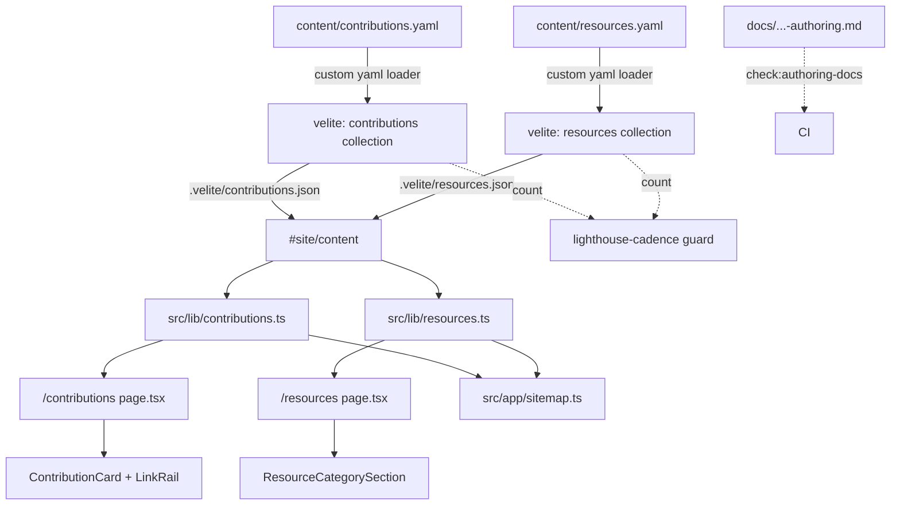

# Design Document

## Overview

This spec adds two YAML-driven, statically generated sections to matthewfield.ca:

- **`/contributions`** — a card gallery of curated open-source contributions, sourced from `content/contributions.yaml`.
- **`/resources`** — a category-grouped list of curated bookmarks, sourced from `content/resources.yaml`.

Both sections follow the established content pipeline: a Velite collection validates the data at build time and emits typed JSON; a `src/lib/*` helper owns querying/sorting/grouping behind the `#site/content` chokepoint; a server-component route renders the page with `dynamic = 'force-static'`. The author edits a YAML file, commits, and CI redeploys — no React changes.

The design intentionally reuses the project-showcase precedent end-to-end: the `linkSchema` enum + `errorMap` pattern (`velite.config.ts:252-282`), the `getPublished*`/comparator/`formatContentDate` helper shape (`src/lib/projects.ts`, `src/lib/blog.ts`), the `page.tsx` route skeleton (`src/app/(site)/projects/page.tsx`), the `#site/content` chokepoint lint guard (`eslint.config.mjs:22-50`), and the count-based Lighthouse cadence guard (`scripts/check-lighthouse-cadence.mjs`).

### Design-phase corrections to the approved requirements (post-r1 adversarial)

The requirements were approved through four adversarial rounds, but three of their pinned **implementation mechanisms** do not survive contact with Velite 0.3.1's actual source. The design phase is the correct place to reconcile this. All three corrections preserve the requirements' observable behavior and intent; only the mechanism changes. They are called out here and detailed in **Architecture**. All were verified against on-disk source (`node_modules/velite/dist/chunk-4HFW4XPZ.js`, line numbers cited) and the third was reproduced empirically against Velite 0.3.1.

1. **Schema envelope (Req 1.1, 4.1).** The requirements pin `schema: s.array(s.object({...}).strict()).min(0)` with `single: false`. Velite 0.3.1's loader iterates a YAML array element-by-element and applies the collection `schema` to **each element**, not to the array as a whole (proof: `chunk-4HFW4XPZ.js:38005-38019`). The correct envelope is therefore the **per-entry** schema `s.object({...}).strict()` with `single` left at its default `false` (which generates `Contribution[]`, `chunk-4HFW4XPZ.js:37937`). An `s.array(...)` schema would validate each individual entry object against an array schema and fail every build. Observable behavior is identical; the `.min(0)` constraint is moot.

2. **Empty-payload mechanism (Req 1.6, 4.6).** The requirements say the zero-byte/`null`/`~` case is "detected by a Velite collection-level `transform` that asserts the parsed value is an array; this transform runs before the per-entry schema parse." It cannot: `VeliteFile.create()` fails at `meta.data?.data == null` (`chunk-4HFW4XPZ.js:33320-33321`) **before any schema or transform executes**, with Velite's generic message `no data loaded from '<path>'`. The design instead registers a **custom YAML loader** (`config.loaders`) that owns the envelope checks and throws the exact named messages. A user loader is resolved before the built-in `yaml_default` (`chunk-4HFW4XPZ.js:37908` prepend + first-`.find()` match, `33317`), and a `throw` inside `load` propagates to a non-zero exit (empirically confirmed). This is the only hook that runs early enough.

3. **Build-failure mechanism — THE LOAD-BEARING ONE (Req 1.4, 3.1, 4.4, 10.1; "typo → build fail").** The requirements' entire premise is that a schema violation is a **CI-blocking build error**. It is not, as the repo is configured. Velite only throws on zod issues when it runs in **strict mode**: `if (config.strict) throw new Error("Schema validation failed.")` is the *only* throw for validation issues (`chunk-4HFW4XPZ.js:38055-38056`); otherwise it emits `logger.warn` and **continues, writing the invalid entry to the JSON**. This repo runs Velite **non-strict** — `velite.config.ts` sets no `strict`, and no invocation passes `--strict`. The default is `strict: false` (`chunk-4HFW4XPZ.js` resolveConfig: `strict: options.strict ?? loadedConfig.strict ?? false`). The existing `check-velite-output.mjs` gate is only a **coarse presence + key-type shape check** (array-ness + `slug/title/date/draft` keys exist) — it does NOT enforce lengths, URL schemes, enum membership, or `.strict()` unknown keys. **So neither the existing collections nor the design-as-v1 actually hard-fail on fine-grained schema violations.**

   **Where Velite actually runs (corrected after r2 — v2 wrongly claimed `next build` triggers Velite via a webpack plugin; it does NOT).** `package.json:8` is a bare `next build`, and `next.config.ts` has **no Velite/webpack plugin** — it only does a runtime `import("./.velite/index.js")` of the pre-built JSON. Velite's `build()` (and therefore the loader) runs ONLY via: (a) `postinstall: velite build` (`package.json:18`), which in CI runs during `pnpm install --frozen-lockfile` (`ci.yml:42-43`) on every fresh checkout; (b) `velite dev`; and (c) the explicit `Velite build (for Build 2)` step `pnpm exec velite build` (`ci.yml:117-119`), which precedes Build 2's `pnpm build` (`ci.yml:121-123`). Build 1 (`ci.yml:94-95 pnpm build`) consumes the `postinstall`-produced `.velite/`. So the loader's hard-fail surfaces at **`postinstall` (the install step) and the explicit Build-2 `velite build`** — both of which run on every CI run with a fresh checkout, so a malformed entry blocks the deploy. (Local caveat: an author who edits YAML and runs only `next build` without re-running `velite build` reads stale `.velite/`; this is an existing property of the repo's build wiring, not introduced here, and is mitigated in CI by the fresh-checkout `postinstall`.) On **Vercel** the production `buildCommand` (`vercel.json`) ends in `pnpm build` (= `next build`), so there too the loader's hard-fail fires only at Vercel's dependency-install `postinstall`, never at the build command — consistent with the postinstall-is-the-real-run-point framing. The authoritative deploy gate remains CI (which runs the explicit Build-2 `velite build` and blocks promotion on failure).

   **Resolution (this design):** the custom YAML loader (correction #2) is promoted to the **authoritative validator**. Because a `throw` in `load` reliably exits non-zero (verified: un-caught through `VeliteFile.create` at `chunk-4HFW4XPZ.js:33320` → CLI `build().catch(() => process.exit(1))`), the loader runs each entry through the shared per-entry zod schema via `safeParse` (sync — confirmed valid for all declared fields), aggregates issues, formats them per the Shared Error-Message Contract, and **throws** — delivering the hard build failure the requirements demand, **scoped to the two new YAML files only**. Velite's own (non-strict) re-parse of the now-validated array still runs to produce the typed output and generated types; on clean data it is a guaranteed pass (no double-parse divergence — same schema, same shared `BUILD_START_UTC`, idempotent `.trim()`).

   **Rejected alternative — global `strict: true`:** setting `strict` in `defineConfig` is the obvious lever, but it is config-level and **all-or-nothing across every collection**. It would immediately convert any *currently-warning* `posts`/`projects` content into a hard build failure — a cross-spec behavior change with an unassessed blast radius, well outside this spec's scope. The loader-validation approach delivers the same guarantee scoped to contributions/resources with zero blast radius, and is therefore chosen. (If the project later wants strict globally, that is its own spec with its own content audit.)

All three corrections are recorded as resolved design decisions; no requirements amendment is requested (the acceptance criteria describe *behavior*, which is fully met). The loader-as-validator choice also resolves several downstream error-contract problems — see **Architecture → Error-message contract**.

**Complete requirements↔design deviation list (for a full delta).** Beyond the three mechanism corrections above, the design supersedes these specific requirements statements, all of which were premised on the same mistaken Velite model and are therefore moot:
- Introduction (requirements.md:10, 16) and Reqs 1.1/4.1: "YAML handled by Velite's built-in `yaml_default` loader, no `loaders` override required" → **superseded**: a custom loader is registered (corrections #2/#3).
- Reqs 1.8 / 4.7 / 7.4: "No new lint rule is added… the existing rule already exempts `src/lib/*`" → **superseded**: the existing rule is `posts`-only with a file allowlist (no `src/lib/*` glob), so an additive eslint edit *and* a chokepoint AST scanner are added (see Chokepoint enforcement).
- Req 1.6/4.6: "collection-level `transform` asserts the parsed value is an array" → **superseded** by the custom loader (the transform can't run before the null-fail).

These are documented deviations, not silent ones; the observable acceptance behavior of every cited Req is still delivered.

## Steering Document Alignment

### Technical Standards (tech.md)

- **Velite for typed, build-time-validated content** (tech.md "Content Pipeline"): both collections are Velite collections with `.strict()` zod schemas; zero runtime cost.
- **Server components by default, minimize client JS** (tech.md "Performance"): both routes are `force-static` server components with zero added client JS beyond the Next.js baseline.
- **Build-time validation catches bad content before production** (tech.md decision #3): every malformed entry is a CI-blocking build error; a failed build is never promoted by Vercel (tech.md "Deployment").
- **External link safety** (tech.md "Security"): every external `<a>` carries `rel="noopener"`; every URL is `new URL()`-parsed and restricted to `http:`/`https:` at build time, reusing the exact two-stage check already in `linkSchema` (`velite.config.ts:271-279`).
- **90+ Lighthouse** (tech.md "Performance"): no images, no client JS; re-verified via the count-based cadence guard.

### Project Structure (structure.md)

- Routes under `src/app/(site)/contributions/` and `src/app/(site)/resources/` (structure.md directory map already reserves both).
- Helpers in `src/lib/` (`contributions.ts`, `resources.ts`), components in `src/components/contributions/` and `src/components/resources/`, mirroring `src/components/projects/`.
- Pure structured-data collections use YAML, not MDX (structure.md "Content File Organization": *"Pure structured data collections (contributions, resources) may use YAML or JSON instead"*).
- CI/build scripts under `scripts/*.mjs` (structure.md "Deployment & scripts").
- Velite-config transforms/loaders that grow large are extracted to `src/lib/build/` — matching the existing `checkProjectHeadings` precedent (`velite.config.ts:17` imports from `./src/lib/build/check-project-headings`).
- `kebab-case` files, `PascalCase` components, `camelCase` functions, `UPPER_SNAKE_CASE` frozen maps (structure.md naming).
- No barrel files; direct imports; helpers never import from `src/components` or `src/app` (structure.md module boundaries).

## Code Reuse Analysis

### Existing Components to Leverage

- **`linkSchema` errorMap + two-stage URL check** (`velite.config.ts:252-282`): the contributions typed-link schema is a near-clone — different enum members and a `kind`-required-instead-of-optional shape, but the same `errorMap` idiom and the identical `new URL()` + protocol `.refine`.
- **`formatContentDate(iso)`** (`src/lib/format-date.ts:7-9`): returns `{ datetime, display }`. Both pages reuse it verbatim for `date`/`added` rendering and `<time datetime>` attributes. Re-exported as `formatContributionDate` / `formatResourceDate` to mirror `formatProjectDate`/`formatPostDate`.
- **Helper module shape** (`src/lib/projects.ts`, `src/lib/blog.ts`): `export type X = (typeof collection)[number]`, deterministic `(a,b) => number` comparators, `getAll*` getters, formatter re-exports.
- **Route skeleton** (`src/app/(site)/projects/page.tsx`): `export const dynamic = "force-static"`, `generateMetadata()` returning `{ title, description, alternates.canonical }`, an `<h1>` + populated/empty branch.
- **`#site/content` chokepoint guard** (`eslint.config.mjs:22-50`): `no-restricted-imports` on `#site/content`, with a per-file exemption allowlist.
- **Count-based Lighthouse cadence guard** (`scripts/check-lighthouse-cadence.mjs`): reads a `.velite/*.json` count + a runs-log doc, fires when `delta >= N`. Parser regex and `matches.at(-1)` "last entry wins" convention reused.
- **CI annotation precedent** (`scripts/warn-no-pagefind.mjs:103`, `scripts/check-vercel-auto-deploy.mjs:127-133`): bare `::warning::<message>` on stdout (no `file=` parameter).
- **Self-test precedent** (`scripts/check-velite-output.test.mjs`): `node --test` runner, pure functions returning `{ exitCode, diagnostic }`.

### Integration Points

- **`velite.config.ts`** (`collections: { pages, profile, posts, projects }` at line ~425): additively register `contributions` and `resources`; add `loaders: [contentYamlLoader]`. Existing collections untouched.
- **`#site/content`** (Velite-generated `.velite/index.d.ts`): two new typed exports `contributions: Contribution[]`, `resources: Resource[]`.
- **`src/app/sitemap.ts`**: currently lists `/contributions` and `/resources` as static routes with `lastModified: now` (lines 11-13). The design **moves both out of the static `routes` array** into dedicated entries whose `lastModified` is computed from the collections (Req 6.2).
- **`eslint.config.mjs`**: extend `no-restricted-imports` (additive) + add the new canary to the `off` file list. **New** `src/lib/build/check-content-chokepoint.ts`, `src/__fixtures__/content-chokepoint-canary.ts`, `src/lib/build/check-content-chokepoint.test.ts`, and a **separate** gate `scripts/verify-content-canary-regex-pair.mjs` (the projects scanner/canary/gate are untouched). **`tsconfig.json`**: add the new canary to `exclude`. (See Architecture → "Chokepoint enforcement — two layers".)
- **`.github/workflows/ci.yml`**: two new steps — `check:authoring-docs` (after `Lint` line 45, before `Build 1` line 94) and the contributions/resources Lighthouse cadence check (co-located with the existing cadence step, line 135, after Build 2).
- **`package.json` scripts**: add `check:authoring-docs`.
- **`src/config/site.ts`**: `navItems`/`heroCards` already contain `/contributions` and `/resources` (verified at `site.ts:36,38,55,65`). Descriptions MAY be refined (Req 9.2); no structural change. (`heroCards` was later renamed `homeIndex`.)

## Architecture

The feature is two parallel vertical slices (contributions, resources) over four shared layers: **build-time validation** (Velite), **query/shaping** (`src/lib`), **rendering** (routes + components), and **CI guardrails** (scripts).



### Modular Design Principles

- **Single File Responsibility**: schema/loader/errorMap in the Velite layer; query/sort/group in `src/lib`; rendering in routes+components; doc-drift and cadence checks in standalone scripts.
- **Component Isolation**: `ContributionCard`, `ContributionLinkRail`, and `ResourceCategorySection` are small focused components receiving typed props; pages orchestrate only.
- **Service Layer Separation**: routes never touch `#site/content`; they call `src/lib` helpers exclusively.
- **Utility Modularity**: the shared YAML loader and the shared zod `errorMap` factory are single-purpose modules under `src/lib/build/`.

### Velite layer — the corrected mechanism (Req 1, 3, 4)

**File layout.** To keep `velite.config.ts` lean (structure.md size guidance), new build-time modules under `src/lib/build/`:

- `src/lib/build/contributions-schema.ts` and `.../resources-schema.ts` — export the per-entry `s.object({...}).strict()` schemas. These are the single source of truth, imported by BOTH the collection registration (for types/output) AND the loader (for validation).
- `src/lib/build/content-error-format.ts` — exports `formatZodIssues(issues, { basename, entry, index })` and value-serialization helpers implementing the Shared Build-Time Error-Message Contract.
- `src/lib/build/content-yaml-loader.ts` — exports a factory `makeContentYamlLoader(schemasByBasename)` returning the `defineLoader` instance that does the envelope checks **and** the authoritative per-entry validation.

**Custom YAML loader = envelope checks + authoritative validation (resolves corrections #2 and #3; Req 1.4/1.6/3.1/4.4/4.6/10.1).**

```ts
// src/lib/build/content-yaml-loader.ts
import { defineLoader } from "velite";
import yaml from "yaml";              // direct devDependency (package.json) — already used by scripts/check-velite-output.mjs
import { formatZodIssues } from "./content-error-format";

export function makeContentYamlLoader(schemasByBasename) {
  return defineLoader({
    test: /\.(ya?ml)$/,               // applies to ALL content/**/*.y(a)ml — see coupling note below
    load: (file) => {
      const basename = file.path.split(/[\\/]/).pop()!;       // "contributions.yaml"
      const schema = schemasByBasename[basename];
      if (schema == null) return { data: yaml.parse(file.toString()) ?? [] }; // not ours — passthrough
      const parsed = yaml.parse(file.toString());
      if (parsed == null)
        throw new Error(`${basename} is empty or null. To represent zero entries, write the explicit empty list literal: []`);
      if (!Array.isArray(parsed))
        throw new Error(`${basename} must be a top-level YAML list. Found a ${typeof parsed}. Write entries as a list ('- ...') or the empty list literal: []`);
      // Authoritative validation: hard-fail here because Velite is non-strict (correction #3).
      const messages = [];
      parsed.forEach((entry, index) => {
        let r;
        try {
          r = schema.safeParse(entry);   // defense-in-depth: a transform that throws (zod-v3 property)
        } catch (e) {                     // would otherwise escape as a bare RangeError (r3 finding 2b)
          messages.push(`${basename} entry[${index}]: internal validation error: ${e instanceof Error ? e.message : String(e)}`);
          return;
        }
        if (!r.success) messages.push(...formatZodIssues(r.error.issues, { basename, entry, index }));
      });
      if (messages.length > 0) throw new Error("\n" + messages.join("\n"));
      return { data: parsed };          // raw array; Velite re-parses for transforms + types
    },
  });
}
```

Registered config-side via `loaders: [makeContentYamlLoader({ "contributions.yaml": contributionEntrySchema, "resources.yaml": resourceEntrySchema })]`.

Why this works (all source-verified):
- **Resolution order:** Velite prepends user loaders (`loaders: [...loadedConfig.loaders ?? [], ...builtin]`, `chunk-4HFW4XPZ.js:37908`) and resolves by first `.test` match (`33317`), so this wins over the built-in `yaml_default`.
- **Hard failure:** a `throw` in `load` is un-caught through `VeliteFile.create` → `resolve` → the CLI's `build().catch(err => { logger.error(err.message); process.exit(1) })`. The raw `err.message` is surfaced untruncated. This is the *only* reliable per-collection hard-fail hook, since Velite's zod-issue path merely warns when non-strict (`38055`).
- **`safeParse` is synchronous-safe here:** the per-entry schemas use only `s.string`/`s.enum`/`s.isodate`/`s.array` + sync `.refine`/`.superRefine` (no `s.image`/`s.mdx`/`s.path` and no async refinements), so `safeParse` is valid. (If a future field needs an async refine, switch the loader to `async load` + `safeParseAsync`.)
- **No double-validation divergence:** the loader and the collection registration import the **same** schema object; Velite's subsequent non-strict re-parse of the already-validated raw array applies the `.transform()` trims to produce final output and generates the `_output` type — guaranteed to pass on clean data.
- **`schemasByBasename` keying** makes the loader a no-op passthrough for any non-managed YAML, so it never hijacks an unrelated file.

**Coupling note (forward risk, per r1 review):** because the loader's `test` matches all `content/**/*.y(a)ml`, any *future* YAML collection added by another spec passes through this loader. Managed files (in `schemasByBasename`) get full validation; unmanaged YAML gets a benign null→`[]` passthrough. Documented so a future author knows to register their schema here rather than expecting Velite's built-in loader.

Envelope state table (matches Req 1.6 exactly):

| File state | `yaml.parse` result | Behavior |
|---|---|---|
| File absent | (glob matches nothing) | collection emits `[]`, build OK |
| `[]` literal | `[]` | iterates zero entries, emits `[]`, build OK |
| zero bytes `""` | `null` | loader throws named "empty or null" error |
| `~` / `null` literal | `null` | same named error |
| top-level mapping/scalar | object/string/number | loader throws named "must be a top-level YAML list" error |
| valid list | `[{...}, ...]` | per-entry schema validation (below) |

**Per-entry schema (resolves correction #1).** Each collection's `schema` is the **per-entry** object:

```ts
const contributions = defineCollection({
  name: "Contribution",
  pattern: "contributions.yaml",
  // single: false (default) — Velite iterates the loaded array element-by-element
  schema: s.object({ /* fields below */ }).strict(),
});
```

Velite's `load` sets `path2 = [index]` as the parse-path root for each element (`chunk-4HFW4XPZ.js:38008`), so issue paths are naturally rooted at the entry index. The generated type is `Contribution[]` (`single` false appends `[]`, `chunk-4HFW4XPZ.js:37937`).

**Contributions per-entry fields (Req 1.2, 1.3, 3):**

```ts
s.object({
  repo: s.string().min(1).max(80).regex(/^[a-zA-Z0-9][a-zA-Z0-9._-]*\/[a-zA-Z0-9._-]+$/),
  repoUrl: httpUrl(),                              // shared URL refinement (below)
  title: s.string().transform((v) => v.trim()).pipe(s.string().min(5).max(100)),
  description: s.string().transform((v) => v.trim()).pipe(s.string().min(30).max(280)),
  date: isoDate(),                                 // date-only ISO; future-dated permitted (Req 1.2)
  language: s.string().min(1).max(24).optional(),
  links: s.array(contributionLinkSchema).min(1).max(5)
            .superRefine(uniqueByKind),            // Req 3.2
}).strict()
```

- `httpUrl()` is the shared two-stage check extracted from `linkSchema`: `s.string().url().refine(parse+protocol)`.
- `trim-then-length` uses `.transform().pipe()` so length bounds apply post-trim (Req 1.2 / 4.2). (`.pipe` is available in the bundled zod — `ZodPipeline` is exported, `chunk-4HFW4XPZ.js` zod_exports.)
- `contributionLinkSchema`: `s.object({ kind: s.enum([...6]), label: trimmed(1, 60).optional(), url: httpUrl() }).strict()`. The six members: `pr, commit, issue, release, writeup, discussion`. **`label` is trimmed** via the same `.transform(trim).pipe(min/max)` idiom as `title`/`description` (r1 gap: a whitespace-only `"   "` label would otherwise pass `.min(1)` and render blank). No per-field `errorMap` is attached — all error formatting is centralized in `formatZodIssues` (above).
- `uniqueByKind`: a `superRefine` that adds an issue when two links share a `kind`. Message routed through the shared errorMap helper.

**Resources per-entry fields (Req 4.2):**

```ts
s.object({
  title: s.string().transform((v) => v.trim()).pipe(s.string().min(2).max(80)),
  url: httpUrl(),
  description: s.string().transform((v) => v.trim()).pipe(s.string().min(20).max(200)),
  category: s.enum(["devops-tools", "blogs-and-feeds", "reading", "fun-stuff"]),
  added: isoDate().refine((d) => Date.parse(d) <= BUILD_START_UTC),  // future-blocked (Req 4.2)
}).strict()
```

- **`isoDate()` shared helper (corrects r2 finding #4 AND the two r3 holes it introduced).** Velite's `s.isodate()` is `stringType().refine(Date.parse-ok).transform(toISOString)` (`index.js:140`) — and r3 proved a regex-then-`s.isodate()` composition is **doubly broken**: (2a) `Date.parse("2026-02-30")` rolls over to Mar 2, so calendar-impossible dates are silently accepted and rewritten; (2b) for a shape-valid-but-unparseable string like `"2026-13-45"`, `s.isodate()`'s refine sets status *dirty* (not aborted, `chunk-4HFW4XPZ.js:36837`), so the chained `.transform` still runs `new Date("2026-13-45").toISOString()` → an **uncaught `RangeError`** that escapes `safeParse` (no try/catch, `34019`), bypassing `formatZodIssues` and printing a contextless `"Invalid time value"`.

  **v4 design — validate, do NOT transform, abort fatally:**
  ```ts
  const ISO_DATE_RE = /^(\d{4})-(\d{2})-(\d{2})$/;
  const isoDate = () => s.string().superRefine((v, ctx) => {
    const m = ISO_DATE_RE.exec(v);
    if (!m) { ctx.addIssue({ code: "custom", fatal: true, message: "must be an ISO 8601 date (YYYY-MM-DD)" }); return; }
    const [, y, mo, d] = m;
    const dt = new Date(`${v}T00:00:00.000Z`);                 // never reaches toISOString on bad input
    if (Number.isNaN(dt.getTime())
        || dt.getUTCFullYear() !== +y || dt.getUTCMonth() + 1 !== +mo || dt.getUTCDate() !== +d) {
      ctx.addIssue({ code: "custom", fatal: true, message: "is not a real calendar date" });  // round-trip rejects rollover
    }
  });
  ```
  - **No `.transform`** → `safeParse` can never throw a `RangeError`; every bad date is a normal ZodIssue routed through `formatZodIssues` (contract-conformant).
  - **`fatal: true`** sets the parse status to *aborted* (not dirty), so a downstream chained `.refine` (the `added` upper-bound) short-circuits and never runs `Date.parse` on garbage.
  - **Round-trip check** (`getUTCFullYear/Month/Date` === captured groups) rejects rollover dates (`2026-02-30`, `2026-04-31`, non-leap `2026-02-29`) and out-of-range (`2026-13-45`, `2026-00-10`).
  - **Stored/`_output` value is the raw date-only `YYYY-MM-DD` string** (no rewrite — better than v3, round-trips the author's input, matches "ISO 8601 date" exactly). Comparators sort lexicographically over uniform `YYYY-MM-DD` (chronological); `formatContentDate("2026-05-28")` parses UTC-midnight identically to the existing `posts`/`projects` behavior; sitemap `maxOr` works unchanged.
- **`added` upper bound:** `added: isoDate().refine((d) => Date.parse(d) <= BUILD_START_UTC)`. `BUILD_START_UTC = Date.now()` captured once at schema-module load (Req 4.2), shared by the loader's `safeParse` and Velite's re-parse. `d` is the raw `YYYY-MM-DD`; `Date.parse` → UTC midnight; an author in a non-UTC zone setting "today" can be rejected before UTC midnight (documented wall-clock caveat). Because `isoDate()`'s failure is `fatal`, this refine only runs on calendar-valid dates.

**Error-message contract — owned entirely by `formatZodIssues` in the loader.** The v1 design tried to deliver the contract through Velite's native per-field `errorMap` + `file.message`/`source`. The r1 review proved that path cannot deliver the contract: (a) `file.message` prepends the **absolute** path, not the basename (`chunk-4HFW4XPZ.js:33197-33199`); (b) `source` renders mid-path indices as `.2.`, not `[2]` (`38023` — `join(".")` after the index map); (c) a per-field `errorMap` cannot be a `makeContentErrorMap(file)` factory because the schema/errorMap is built once at config load and zod never passes it `file`; and (d) `.strict()` `unrecognized_keys` is raised by the *object*, so no per-field errorMap ever sees it — leaving the `unknown key 'repoURL'` contract example with no home.

Promoting the loader to validator (correction #3) makes all of this moot: **`formatZodIssues` runs inside the loader, where it has the basename, the full entry object, and the entry index in hand**, and produces the entire contract string itself (Velite's native message path is bypassed). It delivers, per the Shared Build-Time Error-Message Contract:

1. **File name** — the basename the loader already computed (not the absolute path).
2. **Entry locator** — the entry's `repo`/`title` when (a) `issue.path[0]` is NOT the identifier field itself, AND (b) the identifier value is a non-empty string after trim; otherwise `entry[<index>]`. **Precise rule (corrects r2 finding 2c):** if `issue.path[0] === "repo"` (contributions) or `=== "title"` (resources) — i.e. the identifier itself is the failing field — always use `entry[<index>]`, never the malformed identifier value. The loader sees the whole entry, so the repo/title-preferred form (contract item 2) IS delivered for non-identifier-field failures — reversing v1's incorrect "impossible" claim.
3. **Field path** — built from `issue.path` in the contract's dot-and-bracket form (`links[2].kind`: numeric segments bracketed, string segments dot-joined), formatted by us — NOT Velite's `.2.` join (which v1 wrongly claimed produced `[2]`).
4. **Offending value** — `serializeValue(v)`: quoted strings; bare numbers/booleans/`null`; **objects/arrays rendered via compact `JSON.stringify`** (covers the `invalid_type`-on-`links` case, e.g. `links: {}` → `{}`, where the offending value is non-scalar — r2 finding 2d); `\n`-escape then 80-char truncate with `…` inside the closing quote (for strings, inside the quote; for compound values, after the JSON). For `unrecognized_keys` there is no single offending value, so item 4 is skipped in favor of item 6's key form.
5. **Enum members** — derived by **walking the schema along `issue.path` to the failing field's `ZodEnum` and reading its `_def.values`** — NOT from `issue.options` alone. r2 confirmed `issue.options` is present only for `invalid_enum_value` (a non-member *string*); a non-string enum value (`kind: 42`) yields `invalid_type` with NO `options` (`chunk-4HFW4XPZ.js:36647`). Schema-walk covers both codes, so the member list is always emitted for any enum-field failure.
6. **`.strict()` unknown keys** — `unrecognized_keys` (issue has a `keys` ARRAY, no `received`, path = the object's path; `chunk-4HFW4XPZ.js:35595-35602`) is surfaced by `safeParse` and formatted as, per key, `unknown key 'repoURL' (did you mean 'repoUrl'?)`. The "did you mean" is a nearest-key match against the **correct object's** `.shape` keys — found by walking the schema along `issue.path` (so a stray key under `links[2]` matches against `contributionLinkSchema.shape`, not the top-level entry). Multiple stray keys each get their own `unknown key …` segment.
7. **`Hint:` lines** — appended per the contract's locked format (own line, `Hint: ` prefix, ≤3 per message), e.g. `Hint: map GitLab MRs to pr`.

**Schema-walk unwrap table (corrects r3 finding #3 — the v3 walk had no wrapper spec).** Walking the schema by `issue.path` to reach a `ZodEnum` (for members) or the correct `ZodObject` (for `.shape` "did you mean") MUST unwrap the wrappers the design's fields actually produce — confirmed by introspection: `links` is a **`ZodEffects`** (from `.superRefine`) over `ZodArray`; `title`/`description`/`label` are **`ZodPipeline`** (from `trimmed()`'s `.transform().pipe()`); `date`/`added` are **`ZodEffects`** (from `isoDate()`'s `.superRefine`); `language`/`label` are **`ZodOptional`**. The walk helper applies, at each node before consuming the next path segment:

| node `typeName` | unwrap to |
|---|---|
| `ZodEffects` | `node._def.schema` |
| `ZodPipeline` | `node._def.out` (then `_def.in` if needed) |
| `ZodOptional` / `ZodNullable` / `ZodDefault` | `node._def.innerType` |
| `ZodArray` (path segment is numeric) | `node._def.type` |
| `ZodObject` (path segment is a key) | `node.shape[segment]` |

So reaching `["links", 0, "kind"]` is: entry `ZodObject` → `.shape.links` (`ZodEffects`) → `_def.schema` (`ZodArray`) → `_def.type` (element `ZodObject`) → `.shape.kind` (`ZodEnum`) → `_def.values`. A unit test walks exactly this path through the `superRefine` `ZodEffects` and asserts the enum members are found. If the walk reaches a node lacking the expected shape (defensive), member-derivation falls back to omitting the list rather than throwing.

`serializeValue`, `formatEnumMembers`, the field-path builder, the locator chooser, the schema-walk-to-field helper (with the unwrap table above), and the nearest-key matcher are pure functions unit-tested directly — including the non-scalar value, non-string-enum, multi-key-unrecognized, nested-object-unknown-key, and identifier-itself-failed cases. **All issue-shape introspection (`issue.code`, `issue.options`, `issue.keys`, `_def.values`, `.shape`) is written against Velite's bundled `s`/zod (v3-shaped), NOT the top-level `zod ^4.4.3` dependency** (which has different issue field names — r2 finding 5a). `content-error-format.ts` imports types from `velite`, never from `zod`.

`uniqueByKind` is a `superRefine` on the `links` array; its issues are collected by the same `safeParse` and flow through `formatZodIssues` identically — and because the formatter receives the whole entry, the locator/repo logic applies uniformly regardless of which field raised the issue. So duplicate-`kind` errors are contract-conformant too.

Also pin `trimmed(min, max)` as the shared helper for trim-then-bound (`s.string().transform((v) => v.trim()).pipe(s.string().min(min).max(max))`), used by `title`, `description`, and `label`.

**Chokepoint enforcement — two layers, mirroring `projects` (corrects Req 1.8 / 7.4 premise).** The requirements assert the existing lint rule already exempts `src/lib/*` and so "no new lint rule is needed." This is wrong on two counts, both confirmed against source:

1. `eslint.config.mjs:22-50` restricts **only** `importNames: ["posts"]` with a **hardcoded file allowlist** (not a `src/lib/*` glob). `projects` passes eslint today only because it is not named in `importNames` — there is no `src/lib` exemption doing the work. So `contributions`/`resources` would be **completely unguarded** by eslint with no change.
2. More importantly, `projects` is **not** actually guarded by eslint at all — it is guarded by a **separate AST scanner**, `src/lib/build/check-projects-chokepoint.ts` (`PROJECTS_NAME = "projects"`), driven by `src/lib/projects.test.ts` Cases 8-11 with a 17-import-shape canary fixture (`src/__fixtures__/chokepoint-canary.ts`) and a pinned production allowlist (`projects.test.ts:312-317`). This scanner exists precisely because eslint `no-restricted-imports`/`importNames` does **not** catch namespace access (`import * as c from "#site/content"; c.contributions...`) — the exact hole that would silently leak the chokepoint. v1 ignored this scanner entirely.

The design therefore enforces both layers, for true parity with `projects`:

- **Layer 1 (eslint, additive edit):** extend the single existing `no-restricted-imports` block —
  ```js
  importNames: ["posts", "contributions", "resources"],
  // exemption allowlist gains: src/lib/contributions.ts, src/lib/resources.ts
  ```
  This catches the common named-import bypass. (Test files use `vi.mock("#site/content", …)` like `projects.test.ts:4,42` and do not import the real collection, so they do **not** need allowlist entries — a correction to v1, which over-added test files.)
- **Layer 2 (AST scanner — a SEPARATE, parallel scanner, NOT a generalization of the projects one).** r2 showed that generalizing `check-projects-chokepoint.ts` is unsafe: its signature is single-arg `projects`-hardcoded (`check-projects-chokepoint.ts:45`), `projects.test.ts:411-413` pins **exactly 17** `projects`-literal sentinels, the allowlist is a flat symbol-agnostic file list, and the canary fixture is locked to `projects.test.ts` by a paired-merge CI gate (`scripts/verify-canary-regex-pair.mjs`, TRACKED_SET frozen to `{chokepoint-canary.ts, projects.test.ts}`, run at `ci.yml:85`). Touching any of these risks breaking the existing `projects` guard. So the design **leaves all projects infrastructure untouched** and adds a parallel one:
  - New scanner `src/lib/build/check-content-chokepoint.ts` that takes a **symbol→authorized-helper-allowlist map** `{ contributions: ["src/lib/contributions.ts"], resources: ["src/lib/resources.ts"] }` (so `contributions.ts` is NOT allowed to import `resources`, and vice-versa — closing the cross-symbol hole r2 flagged). It catches all import shapes including `import * as c from "#site/content"; c.contributions`, which eslint `importNames` cannot. The **new canary fixture path is itself path-exempted** in this scanner's allowlist (it deliberately imports both symbols to exercise their shapes).
  - New canary fixture `src/__fixtures__/content-chokepoint-canary.ts` (parallel to the projects canary), covering the import shapes for both new symbols. It carries raw `#site/content` imports, so it MUST be added to **(i)** `tsconfig.json`'s `exclude` (which today excludes only the projects canary — r3 finding #5; otherwise `pnpm typecheck` at ci.yml:51 fails on the intentional violations), **(ii)** the eslint exemption file list (the rule is `off` there), and **(iii)** the new scanner's own allowlist.
  - A dedicated test `src/lib/build/check-content-chokepoint.test.ts` owns the canary's regex sentinels and drives the scanner (the symbol→allowlist self-test asserts `contributions.ts` cannot import `resources` and the `import * as` shape is caught). The per-collection comparator/grouping tests stay in `src/lib/contributions.test.ts` / `resources.test.ts` (they use `vi.mock` and don't touch the canary).
  - **A SEPARATE paired-merge gate** `scripts/verify-content-canary-regex-pair.mjs` with its OWN tracked pair `{ src/__fixtures__/content-chokepoint-canary.ts, src/lib/build/check-content-chokepoint.test.ts }`, wired as its own CI step. r3 finding #4 showed that *appending* to the existing `verify-canary-regex-pair.mjs` flat `TRACKED_SET` would couple the two pairs (its all-or-none rule is union-wide, so a future PR touching only one pair would FAIL the strict-subset check). A separate script keeps each pair's all-or-none logic independent and leaves the projects gate untouched.

This contradicts the requirements' literal "no rule edit / no new mechanism" claim and is documented as a deliberate, reasoned deviation: anything less than both layers leaves the new collections strictly less protected than `projects`, which a reviewer expecting parity would (correctly) reject. The parallel-scanner-and-gate approach achieves parity with **zero** changes to the pinned projects infrastructure.

### `src/lib` layer (Req 7)

**`src/lib/contributions.ts`**
- `export type Contribution = (typeof contributions)[number]`
- `export type ContributionLink = Contribution["links"][number]`
- `byDateDescRepoAscTitleAsc(a, b): number` — three deterministic keys (Req 2.1).
- `getAllContributions(): readonly Contribution[]` — returns the collection sorted by the comparator (no draft filtering; collection has no draft flag).
- `export const formatContributionDate = formatContentDate`

**`src/lib/resources.ts`**
- `export type Resource = (typeof resources)[number]`, `export type ResourceCategory = Resource["category"]`
- `byAddedDescTitleAscUrlAsc(a, b): number` — three deterministic keys (Req 5.3).
- `RESOURCE_CATEGORY_LABELS: Record<ResourceCategory, string>` — frozen enum→label map (Req 5.1). The four entries: `devops-tools→"DevOps Tools"`, `blogs-and-feeds→"Blogs & Feeds"`, `reading→"Reading"`, `fun-stuff→"Fun Stuff"`.
- `CATEGORY_ORDER: readonly ResourceCategory[]` — canonical render order (matches the enum order).
- `getAllResources(): readonly Resource[]`
- `getResourcesGroupedByCategory(): readonly { category, label, entries }[]` — grouped in `CATEGORY_ORDER`, each group's entries sorted by the comparator, **empty groups omitted** (Req 5.6).
- `export const formatResourceDate = formatContentDate`

Both files import their collection from `#site/content` (now permitted by the extended exemption allowlist).

### Rendering layer (Req 2, 5)

**`/contributions` route** (`src/app/(site)/contributions/page.tsx`)
- `export const dynamic = "force-static"`.
- `generateMetadata()` → `{ title: "Contributions", description: CONTRIBUTIONS_DESCRIPTION, alternates: { canonical: "/contributions" } }`. The same `CONTRIBUTIONS_DESCRIPTION` constant feeds both populated and empty branches (Req 2.9 — meta consistency). `CONTRIBUTIONS_DESCRIPTION`/`RESOURCES_DESCRIPTION` are pinned to the 50–160-char bound (Req 2.8/5.8); a one-line length assertion lives in the corresponding `src/lib` test (the constant can be exported or re-declared there) so a future edit out of bounds fails CI.
- `<main>` → `<h1 id="page-heading">Contributions</h1>`.
- Populated: `<ul role="list" aria-labelledby="page-heading">` of `<li><ContributionCard contribution={c} index={i} /></li>` over `getAllContributions()`.
- Empty (`length === 0`): `<section aria-labelledby="empty-state-heading">` with `<h2 id="empty-state-heading">` + `<p>` (prose owned by component). No 404, no empty `<main>`.

**`ContributionCard`** (`src/components/contributions/contribution-card.tsx`)
- `<article>` wrapper (no whole-card link; Req 2.5).
- `<h2 id={`contrib-${index}`}>{title}</h2>` (index = sorted-output position, Req 2.4).
- `<code className="contrib-repo">{repo}</code>` (element locked, Req 2.4).
- `<p>{description}</p>`.
- `<time dateTime={datetime}>{display}</time>` via `formatContributionDate`.
- `language` badge iff present.
- `<ContributionLinkRail links={links} labelledBy={`contrib-${index}`} />`.

**`ContributionLinkRail`** (`.../contribution-link-rail.tsx`)
- Wrapper element with `role="group"` + `aria-labelledby={labelledBy}` (Req 2.6, 3.7).
- Each link a plain `<a href={url} rel="noopener">` (same-tab; Req 2.7/3.6), in array order (Req 3.4).
- Rendered text = `label ?? DEFAULT_LABELS[kind]`. `DEFAULT_LABELS` map owned by this component (Req 3.1 note): `pr→"Pull request"`, `commit→"Commit"`, `issue→"Issue"`, `release→"Release notes"`, `writeup→"Write-up"`, `discussion→"Discussion"`.
- Responsive grid handled in CSS (Req 2.10): 1 col `<640px`, 2 col `641–1023px`, ≥2 col `≥1024px`.

**`/resources` route** (`src/app/(site)/resources/page.tsx`)
- `force-static`; `generateMetadata()` → `{ title: "Resources", description: RESOURCES_DESCRIPTION, canonical }`.
- `<main>` → `<h1>Resources</h1>`.
- Populated: `getResourcesGroupedByCategory().map(...)` → one `<ResourceCategorySection>` per non-empty group.
- Empty: identical sectioned empty-state pattern as contributions (Req 5.7).

**`ResourceCategorySection`** (`src/components/resources/resource-category-section.tsx`)
- `<section>` → `<h2 id={`cat-${category}`}>{label}</h2>` (Req 5.4) → `<ul>` of `<li>`.
- Each `<li>`: `<a href={url} rel="noopener">{title}</a>` then `<p className="resource-note">{description}</p>` (Req 5.5; `<ul>/<li>`, not `<dl>`).
- Categories stack vertically at all breakpoints; entries single-column (Req 5.9).
- No sticky TOC at launch (Req 5.10); `id="cat-<slug>"` retained for deep links.

### Sitemap (Req 6)

`src/app/sitemap.ts`: remove `/contributions` and `/resources` from the static `routes` array; add two computed entries:

```ts
const contributions = getAllContributions();
const resources = getAllResources();
const maxOr = (dates: string[], fallback: Date) =>
  dates.length ? new Date(dates.reduce((a, b) => (a > b ? a : b))) : fallback;

const sectionEntries = [
  { url: url("/contributions"), lastModified: maxOr(contributions.map((c) => c.date), now) },
  { url: url("/resources"),     lastModified: maxOr(resources.map((r) => r.added), now) },
];
```

`now` is the existing build-timestamp fallback (Req 6.2). Imports go through the new helpers (chokepoint-clean).

### CI guardrails (Req 8.2, NFR Performance)

**Author-doc heading check** — `scripts/check-authoring-docs.mjs` + `scripts/check-authoring-docs.test.mjs`.
- Pure, testable core (`checkHeadings(docText) → { exitCode, missing[] }`), mirroring `check-velite-output.test.mjs`'s `{ exitCode, diagnostic }` shape.
- Reads `docs/contributions-and-resources-authoring.md`; asserts each canonical heading from Req 8.1 appears as an exact line.
- Missing heading → bare `::warning::<heading missing>` on stdout (precedent: `warn-no-pagefind.mjs:103`) and **exit non-zero** (CI and local identical — Req 8.2).
- Doc missing → exit non-zero, stderr error, no annotation. Doc zero-byte → warnings for every heading, exit non-zero.
- `package.json`: `"check:authoring-docs": "node scripts/check-authoring-docs.mjs"`.
- CI: new step `pnpm check:authoring-docs` after `Lint` (ci.yml:45), before `Build 1` (ci.yml:94).
- Self-test: `node --test scripts/check-authoring-docs.test.mjs` as its own CI step, co-located with the existing `check-velite-output.test.mjs` self-test (ci.yml:88).
- Canonical headings are constrained to single-line, no-comma, no-colon (Req 8.1) — the bare `::warning::` form has no parameter-parsing surface, so this is belt-and-suspenders.

**Lighthouse cadence** — `scripts/check-contributions-resources-lighthouse-cadence.mjs` + runs-log `docs/contributions-and-resources-lighthouse-runs.md`.
- Structural clone of `check-lighthouse-cadence.mjs`: count = `contributions.length + resources.length` from `.velite/contributions.json` + `.velite/resources.json`; last logged count parsed from the runs-log via the same `matches.at(-1)` "last entry wins" regex convention; fires when `count - last >= 10` (Req NFR: N=10, vs project-showcase's N=3). Emits to stderr with a `[contrib-resources-lighthouse-cadence]` tag; exit 0 ok / non-zero when the cadence fires.
- **Two-file-missing semantics (r3 finding 5e):** the cadence step runs after Build 2, where Velite always emits both files as `[]` even when empty (verified: `outputData` skips only on `null`, and a non-single collection is never null). If EITHER `.velite/*.json` is genuinely absent, that signals a broken build, so — matching the single-file precedent's fail-hard behavior — the script exits non-zero with a diagnostic naming the missing file (it does NOT treat absent as count 0).
- CI step co-located with the existing cadence step (ci.yml:135, after Build 2, where `.velite/*.json` exists).
- A new script (not an extension of the existing one) keeps each guard single-responsibility and avoids coupling project-showcase's N=3 to this feature's N=10.

**CI-topology verifier (acceptance gate, per r1 review).** `.github/workflows/ci.yml` is guarded by `scripts/verify-ci-topology.mjs`, which asserts an ordered list of step-name literals and specific pins and is **fatal** on any missing/misordered literal. This design inserts three steps (`check:authoring-docs`, its `node --test` self-test, and the contributions/resources cadence check). Inserting `check:authoring-docs` between `Lint` (ci.yml:45) and the first ordered literal does not violate any "X after Y" pin, but the inserted steps must not collide with or reorder the verifier's pinned literals. **Acceptance requirement:** the implementing task MUST run `node scripts/verify-ci-topology.mjs` (and `node scripts/check-velite-output.mjs --verify-ci-wiring`) after editing the workflow and confirm exit 0. If the verifier's literal list needs to grow to register the new steps, that edit is part of the same task.

### Author documentation (Req 8.1)

`docs/contributions-and-resources-authoring.md` with the canonical headings (verbatim): `## Contributions YAML shape`, `## Link kinds`, `## Resources YAML shape`, `## Resource categories`, `## Seeding added for legacy bookmarks`, `## Sort order`, `## Empty-file behavior`, `## No-draft policy and removal latency`, `## Deep-link anchor stability`, plus one example entry per collection. Content covers the forge-mapping convention, the UTC wall-clock caveat, the extension workflow, the seed-date degenerate case, and the anchor-stability conditions.

## Components and Interfaces

### Velite collections (`velite.config.ts` + `src/lib/build/*`)
- **Purpose:** validate YAML at build time, emit typed JSON.
- **Interfaces:** `makeContentYamlLoader(schemasByBasename)` (envelope + authoritative validation), the two per-entry schema modules, two `defineCollection` registrations, `formatZodIssues`, `httpUrl`, `trimmed`, `uniqueByKind`.
- **Dependencies:** `velite`, `yaml`.
- **Reuses:** `linkSchema` errorMap + URL idiom; `checkProjectHeadings` extraction precedent.

### `src/lib/contributions.ts` / `src/lib/resources.ts`
- **Purpose:** sole query/sort/group/label surface behind the chokepoint.
- **Interfaces:** the getters, comparators, type re-exports, label/order maps listed above.
- **Dependencies:** `#site/content`, `src/lib/format-date.ts`.
- **Reuses:** `projects.ts`/`blog.ts` shape; `formatContentDate`.

### Route + presentational components
- **Purpose:** render static pages.
- **Interfaces:** default-exported `page.tsx` + `generateMetadata`; `ContributionCard`, `ContributionLinkRail`, `ResourceCategorySection` named exports.
- **Dependencies:** the `src/lib` helpers; shared CSS.
- **Reuses:** `projects/page.tsx` skeleton; `formatContentDate`.

### CI scripts
- **Purpose:** fail the build on author-doc drift; nudge Lighthouse re-checks.
- **Interfaces:** `checkHeadings`, the cadence comparator core (pure, exported for tests).
- **Reuses:** `check-lighthouse-cadence.mjs`, `warn-no-pagefind.mjs` annotation form, `check-velite-output.test.mjs` self-test pattern.

## Data Models

### Contribution (`.velite/contributions.json` element)
```
- repo: string  (owner/name, regex-validated, 1–80)
- repoUrl: string  (http/https URL)
- title: string  (trimmed, 5–100)
- description: string  (trimmed, 30–280)
- date: string  (date-only ISO `YYYY-MM-DD`, calendar-validated, stored verbatim; future permitted)
- language?: string  (1–24)
- links: ContributionLink[]  (1–5, unique kind)
```

### ContributionLink
```
- kind: "pr" | "commit" | "issue" | "release" | "writeup" | "discussion"
- label?: string  (1–60)
- url: string  (http/https URL)
```

### Resource (`.velite/resources.json` element)
```
- title: string  (trimmed, 2–80)
- url: string  (http/https URL)
- description: string  (trimmed, 20–200)
- category: "devops-tools" | "blogs-and-feeds" | "reading" | "fun-stuff"
- added: string  (date-only ISO `YYYY-MM-DD`, calendar-validated, stored verbatim; ≤ build-start UTC)
```

## Error Handling

### Error Scenarios

1. **Empty / null / non-array YAML payload**
   - **Handling:** custom loader throws the named diagnostic before any schema runs (corrects the requirements' transform mechanism).
   - **User Impact:** CI build fails (exit 1, verified) with `contributions.yaml is empty or null. To represent zero entries, write the explicit empty list literal: []` (or the "must be a top-level YAML list" variant). Production is never updated (failed build not promoted).

2. **Per-entry schema violation** (missing/oversize field, bad URL, bad `repo` regex, future-dated `added`, empty/oversize `links`)
   - **Handling:** the loader runs `schema.safeParse(entry)`, and on any issue `formatZodIssues` builds the full contract string and the loader **throws** (correction #3 — Velite non-strict would otherwise only warn and ship the entry).
   - **User Impact:** build fails with e.g. `contributions.yaml entry[3] links[2].kind: "merge-request" is not a valid kind (pr, commit, issue, release, writeup, discussion). Hint: map GitLab MRs to pr` — basename, locator, bracket-form field path, all formatted by us.

3. **Unknown key under `.strict()`** (e.g. `repoURL:` typo)
   - **Handling:** `safeParse` surfaces a `unrecognized_keys` issue; `formatZodIssues` renders it with the locator + `unknown key 'repoURL' (did you mean 'repoUrl'?)`. (v1 had no home for this; loader-side formatting fixes it.)
   - **User Impact:** named build error pinpointing the stray key.

4. **Duplicate `kind` within one contribution's `links`**
   - **Handling:** `uniqueByKind` `superRefine` raises an issue on the offending `links[i].kind`, collected by the same `safeParse`/`formatZodIssues` path.
   - **User Impact:** named build error identifying the duplicate.

5. **Closed-enum typo (`kind` / `category`)**
   - **Handling:** `invalid_enum_value` issue → `formatZodIssues` lists valid members; blocks the whole deploy (accepted blast radius, Req 10.2).
   - **User Impact:** build fails; fix-forward via revert or correction commit.

6. **Author-doc missing a canonical heading**
   - **Handling:** `check:authoring-docs` emits `::warning::` and exits non-zero before Build 1.
   - **User Impact:** CI red; deploy blocked until the doc is fixed.

7. **Empty collection at render time** (valid empty state)
   - **Handling:** helper returns `[]`; page renders sectioned empty state.
   - **User Impact:** a real page (not a 404) with `<h1>` + explanatory empty-state section.

## Testing Strategy

### Unit Testing (Vitest, colocated — `src/lib/projects.test.ts` pattern)
- **`contributions.test.ts`:** all three comparator-key branches; comparator stability on identical keys; `getAllContributions` sort order; type assertions (`expectTypeOf`) on `Contribution`/`ContributionLink`; empty-collection behavior.
- **`resources.test.ts`:** all three comparator-key branches; stability; empty-group omission (Req 5.6); the seed-date degenerate case (equal `added` → alphabetical by title, Req 5.3); `RESOURCE_CATEGORY_LABELS` covers every enum member; group order = `CATEGORY_ORDER`.
- **`content-error-format`:** `serializeValue` rules (quoting, bare numbers/null, `\n`-escape, 80-char truncation with `…` inside quotes); `formatEnumMembers`; the field-path builder (`links[2].kind` bracket form); the locator chooser (repo/title vs `entry[n]`, including the "identifier failed → fall back to index" branch); the `unrecognized_keys` "did you mean" nearest-key match.
- **chokepoint scanner:** new lib tests invoke the new `check-content-chokepoint` scanner against the new `content-chokepoint-canary.ts` fixture (mirrors `projects.test.ts` Cases 8-11, but parallel and independent); the symbol→allowlist self-test asserts `contributions.ts` cannot import `resources` and vice-versa, plus the `import * as` namespace shape is caught.

### Loader validation tests (Vitest, against the real schema modules)
- The loader's `safeParse`-and-throw behavior is unit-tested by calling `makeContentYamlLoader(...).load(fakeVFile)` with synthetic file contents: valid array → returns `{ data }`; null/`~`/zero-byte → throws the named envelope error; non-array → throws; an entry with a bad enum / oversize field / unknown key / duplicate `kind` / whitespace-only `label` → throws with a contract-conformant message. This is where corrections #2 and #3 are pinned as tests (no full Velite build needed).

### Script self-tests (`node --test`, `scripts/*.test.mjs`)
- **`check-authoring-docs.test.mjs`:** all-headings-present → exit 0, no output; one missing → exit non-zero + `::warning::` on stdout; doc missing → exit non-zero + stderr, no annotation; doc zero-byte → exit non-zero + warning per heading.
- **Cadence core:** delta `< N` → 0; delta `>= N` → non-zero; last-entry-wins parsing.

### Integration Testing
- **The CI build IS the integration test for the Velite layer:** since the loader is the authoritative validator, a clean `content/*.yaml` builds green and a malformed entry hard-fails (exit 1) — exercised in a throwaway branch, not committed. The CI invocation of `pnpm check:authoring-docs` against real `docs/` is the integration test for that script (no separate fixture harness — Req 8.2). Implementation acceptance also runs `node scripts/verify-ci-topology.mjs` after the workflow edit.
- **Empty-state and seed-date** behaviors are exercised against the actual built `.velite/*.json` where the launch data may be empty or seed-dated.

### End-to-End Testing
- No new Playwright flows: both pages are static, zero-interaction. E2E scope (tech.md) is interactive flows only. Accessibility/structure (landmarks, heading chain, `role="group"`/`aria-labelledby`, `rel="noopener"`) is verified by manual review + the structural assertions implied by the component contracts; Lighthouse a11y is part of the cadence runs-log.
