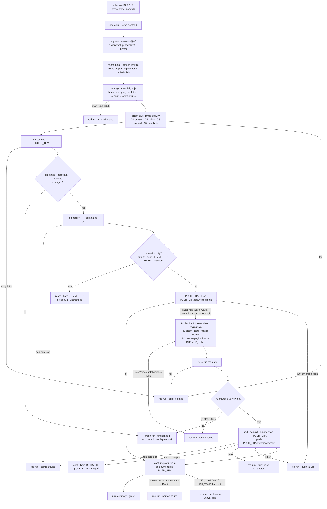

# Design Document

> **Version 9 — terminal.** Edit pass after adversarial review r8
> (`reviews/adversarial-analysis-design-r8.md`). **Twelve findings — 2 MUST_FIX, 3 SHOULD_FIX,
> 7 MINOR — every one accepted, none rejected.** Running total across eight rounds: **103 findings,
> 103 accepted, 0 rejected.** Curve **19 → 9 → 15 → 12 → 15 → 11 → 10 → 12**. **The convergence loop
> hard-caps at v9, so this version is terminal** — r8's findings were closed in place and that closure
> is the one edit no review has seen.
>
> **r8 validated the mechanism, which is the most important fact in this header.** It assembled
> §Push and retry's six fences in v8's stated execution order and **ran** them under
> `bash --noprofile --norc -e -o pipefail`, in a throwaway repository with a bare remote, the real
> `.githooks/pre-commit` and the repository's own prettier, across **ten scenarios**: a real change, a
> renormalising hook, a push race, a non-race rejection, a forced witness exit 128, no-change, a retry
> resolving to no-change, a second-push race, and both paths under `-u`. **All ten behaved exactly as
> documented.** v8's fix for r7's M1 delivers data; `pipefail` breaks nothing.
>
> **Every remaining finding was in bookkeeping, the diagram, arithmetic, or transcribability — and
> r8's escalation names the real problem: the failure is now in the fix-application process, not in
> the design.** v8 had applied the §Cause vocabulary half of r7's explicit four-item repair list and
> **none of its six emphasised items**, so `resync-failed` carried four contradictory scopes for a
> third consecutive round, and an implementer building the retry's error paths from §Error Handling 9
> would have left R4 and R6's `git status` bare — dying with no cause under `bash -e`.
>
> **v9 therefore ran r7's and r8's repair lists as checklists and verified each item by grep**, rather
> than editing the site each finding named. All six M1 repairs confirmed present; the obsolete 12.5×
> figure — which had survived inside *new v8 prose* 27 lines below the note identifying it as obsolete
> — is now ≈ 28×, with the only remaining occurrences being historical citations of the error itself.
>
> **What changed, by finding:**
>
> | Finding | Class | Severity | Where |
> |---|---|---|---|
> | M1 — the cause-slug sweep ran at §Cause vocabulary only; six enumerated repairs untouched | Recurring (10th) | MUST_FIX | §Error Handling 9 & 10, §Cause vocabulary, three diagram edges |
> | M2 — the obsolete 12.5× survived inside new v8 prose, 27 lines below its own correction | Recurring (r7's N1) | MUST_FIX | §Component 3 |
> | S1 — the job skeleton and `shell: bash` lived only as prose under §Push and retry | Compounding | SHOULD_FIX | §Component 4, all three `run:` snippets |
> | S2 — the R1–R6 fence's `R1 `–`R6 ` labels are not shell; assembling as instructed fails | Novel | SHOULD_FIX | §Retry (labels → comments, block dedented) |
> | S3 — "assembled naively … exits 127" is false on the modal path; the execution obligation named no scenarios | Novel | SHOULD_FIX | §The step boundary (eight named scenarios) |
> | N1–N7 | Novel | MINOR | the diagram's missing setup nodes, the merged step row (the workflow has **eight** steps), "three" helpers that are four, the emitter absolute vs. steps 1–4, two omitted bindings, `DEPLOY_POLL_MS`'s superseded ≤ 80, and the unsupported `pipefail` claim |
>
> **The one thing a reader should carry out of eight rounds:** every defect in §Push and retry — seven
> of them — was in its *glue*, never its body, and **five were findable only by executing the code**.
> §The step boundary now carries an implementation obligation naming the eight scenarios r8 ran, and
> that obligation is the single most load-bearing sentence in this document.
>
> ---
>
> **Version 8.** Edit pass after adversarial review r7
> (`reviews/adversarial-analysis-design-r7.md`). **Ten findings — 3 MUST_FIX, 3 SHOULD_FIX, 4 MINOR —
> every one accepted, none rejected.** Running total: **91 findings, 91 accepted, 0 rejected.**
> Curve **19 → 9 → 15 → 12 → 15 → 11 → 10**.
>
> **M1 is the sharpest instance of the pattern every round has shown: v7's repair was worse than the
> defect it repaired.** To close a fail-open, v7 wrote `git diff --quiet …; empty=$?` — a **bare simple
> command**, whose non-zero exit `bash -e` acts on *before* `empty=$?` is evaluated. Measured, and
> independently re-measured before accepting:
>
> ```
> bash -e -c 'git diff --quiet HEAD~1 HEAD -- f; empty=$?; echo "REACHED: empty=$empty"'
>   → (no output)          exit=1
> bash -e -c 'if git diff --quiet HEAD~1 HEAD -- f; then empty=0; else empty=$?; fi; echo …'
>   → REACHED: empty=1     exit=0
> ```
>
> **Exit 1 is the modal path** — a real change, the run that is supposed to push. Under v7 the workflow
> built the commit, died at the witness with no cause and an empty run summary, and left `main`
> untouched **on every successful refresh**: the specified workflow could never deliver data. It also
> violated this section's own `bash -e` discipline, stated seventeen lines above it.
>
> **The other two MUST_FIXes were v7 sweeps that stopped at one site**, the eighth and ninth instances
> of that class: four cause slugs raised where their own definitions exclude them, and a claim that an
> untokened poll "works for ~30 iterations and then 403s" standing three lines above v7's own
> re-derivation to ≈ 36 requests against 60 — which never 403s. The token stays; its justification is
> now the honest one (the anonymous limit is keyed to the runner's **shared IP**).
>
> **S1–S3 supplied a skeleton the document never had.** Seven rounds specified every step's content and
> none of them its shape: §Component 4 named no `runs-on` and no pnpm/Node setup, and — most
> consequentially — **no `run:` step ever declared `shell: bash`**, so the entire `bash -e` discipline
> that r2's N4, r3's S1, r6's S1 and r7's M1 all turned on was never actually established. §Push and
> retry's six topic-ordered fences also assemble, in document order, into a script that exits **127**
> because the helpers sit 94 lines below their first call site; the execution order is now stated, with
> an explicit obligation on the implementation task to **run** the assembled block against a throwaway
> repository before committing it.
>
> **What changed, by finding:**
>
> | Finding | Class | Severity | Where |
> |---|---|---|---|
> | M1 — the `case` blocks kill the step under `bash -e`; the modal path can never push | Compounding (r6's S1) | MUST_FIX | §Push and retry, both blocks |
> | M2 — four cause slugs raised at sites their own definitions exclude | Recurring (8th) | MUST_FIX | §Cause vocabulary, §Error Handling 13 |
> | M3 — §Component 3 contradicts its own re-derivation on whether an untokened poll 403s | Recurring (9th) | MUST_FIX | §Component 3 |
> | S1 — no runner, no toolchain setup, no `shell: bash` | Novel | SHOULD_FIX | §The job's shape (new) |
> | S2 — the six fences are in presentation order; assembled naively the step exits 127 | Novel | SHOULD_FIX | §The step boundary |
> | S3 — nothing established the shell the `bash -e` discipline depends on | Novel | SHOULD_FIX | §The job's shape |
> | N1–N4 | Novel | MINOR | the two headroom figures from different request counts, the 610 s tail, the `on:` stanza and `inputs.seed`, Component 1's unvalued timeout |
>
> **Clean, and worth recording as the document approaches its cap:** r7 walked **all 87 acceptance
> criteria** and found every one has a locatable mechanism in the body, not merely in the coverage
> table (five needed manual resolution; all five resolved). Every v7-added citation resolves and
> carries its claim.
>
> ---
>
> **Version 7.** Edit pass after adversarial review r6
> (`reviews/adversarial-analysis-design-r6.md`). **Eleven findings — 3 MUST_FIX, 4 SHOULD_FIX,
> 4 MINOR — every one accepted, none rejected.** Running total: **81 findings, 81 accepted, 0
> rejected.** Curve **19 → 9 → 15 → 12 → 15 → 11**.
>
> **The round's most consequential finding was a fail-open at the single most important guard in the
> document.** The empty-commit witness — which §Testing Strategy calls the only barrier between a
> renormalising hook and a no-op production deploy — was written as
> `if git diff --quiet …; then unwind; fi`. **Measured: `git diff --quiet` exits 0 for no difference,
> 1 for a difference, and 128 on error**, and a bare `if` sends 128 down the *else* branch. A failure
> of the witness itself therefore read as "there is a real change, go ahead and push". It is now an
> explicit three-way `case`. This is the same fail-open shape r5's S3 closed on the no-change checks
> one round earlier, at a site that had been rewritten twice since.
>
> **All three MUST_FIXes were Recurring, and two were caused by v6's own fixes:**
>
> - **M1 (7th unswept site)** — §Documentation Changes still named the insertion point v6's own rule 1
>   quotes and rejects, **25 lines below the rule, in the same section**.
> - **M2** — v6's S3 fix put `|| fail resync-failed` on the **first attempt**, before any push or
>   race, giving the slug four different scopes across the document while `commit-failed` — broadened
>   by v6 in the same round — already covered that line.
> - **M3** — v6's `GH_TOKEN` fix reached §Component 3 and not §Component 4, the section an
>   implementer builds the YAML from, which still read "`GH_CONTRIBUTIONS_TOKEN` … and nowhere else".
>   Building from it reproduces the 80-against-60 rate-limit failure v6 had just measured.
>
> **The fresh lens — assembling the workflow YAML the design implies — found what prose review could
> not:** the `cp` to `$RUNNER_TEMP` had no command, no cause and the wrong position relative to the
> gate, and the `seed` dispatch input was declared but never wired to `--seed`, leaving Req 13.4's
> recovery path undeliverable.
>
> **What changed, by finding:**
>
> | Finding | Class | Severity | Where |
> |---|---|---|---|
> | M1 — the rejected insertion-point phrase survived 25 lines below its own fix | Recurring (7th) | MUST_FIX | §Documentation Changes |
> | M2 — `resync-failed` raised on the first attempt; one slug, four scopes | Recurring | MUST_FIX | §The no-change check |
> | M3 — the token fix reached one section and not the one that specifies `env:` | Recurring (r5's M1) | MUST_FIX | §Component 4, §Component 3 |
> | S1 — the empty-commit witness failed open on `git diff --quiet`'s exit 128 | Compounding (r5's S3) | SHOULD_FIX | §Push and retry, both blocks |
> | S2 — the `$RUNNER_TEMP` copy had no command, no cause, and the wrong position | Novel | SHOULD_FIX | §The step boundary |
> | S3 — "always carries exactly one outcome or one cause" was false; 3 of 5 emitters had no format | Novel | SHOULD_FIX | §Cause vocabulary |
> | S4 — the `seed` input was never connected to `--seed` | Novel | SHOULD_FIX | §Component 4 |
> | N1–N4 | Recurring/Novel | MINOR | the 12.5× headroom, a fresh wrong-way pointer, the poll arithmetic after the request timeout, the repository source named two ways |
>
> **What held, measured:** the inline gate emitter behaves exactly as written under `bash -e`;
> `changed=$(…) || fail` is correct on all four file states; v6's Markdown fix landed with **no
> remaining lazy-continuation defect anywhere in the document** (AST-parsed); and "rungs 3–4", the
> revision-history order, the ten-of-eleven arithmetic, `commit-failed`'s re-scope and both new token
> citations all landed and resolve.
>
> ---
>
> **Version 6.** Edit pass after adversarial review r5
> (`reviews/adversarial-analysis-design-r5.md`). **Fifteen findings — 4 MUST_FIX, 5 SHOULD_FIX,
> 6 MINOR — every one accepted, none rejected.** Running total: **70 findings, 70 accepted, 0
> rejected.** Curve **19 → 9 → 15 → 12 → 15**.
>
> **v5 made the right step-boundary call and did not follow its consequences — three of the four
> MUST_FIXes are its direct fallout.** Splitting the workflow into steps put the `fail` helper inside
> the commit step, which means:
>
> - **`gate-rejected` had no emitter on the primary gate.** The only `|| fail gate-rejected` left was
>   R5's, on the *retry* path; a G2 or G4 failure on the modal path would have gone red naming no cause
>   at all. The gate step now emits inline (§The gate).
> - **Component 3 had no `main()` contract and no token.** **Measured:** an anonymous read of this
>   repository's deployments endpoint returns **HTTP 200** with `x-ratelimit-limit: 60`, so an
>   untokened poll works for ~30 iterations and then 403s — the design's own "≤ 80 requests against
>   1 000/hour, two orders of magnitude of headroom" inverts to **80 against 60**, and a *healthy*
>   deploy produces a red `deploy-api-unavailable` run after the data is on `main`.
> - **"the confirm script's own `fail` has already written the cause" was false** — `fail` is a shell
>   function in the workflow step, unreachable from a Node script — so `|| exit 1` discarded the
>   diagnosis for three of the eleven causes `requirements.md:589-593` names individually.
>
> **The unswept-site class recurred for the fifth time (M4) and the sixth (S5).** "rungs 3–4", killed
> by r4's S5, survived verbatim **34 lines below its own fix, in the same section**; and §Revision
> History was still ordered v1, v2, v5, v4, v3 while the v5 header claimed r4's N2 had landed.
>
> **The fresh lens found the document's only Markdown defect:** Req 4.3's entire block/warn decision
> table — the gate's core rule — was silently absorbed into a `> [v3]` version-history blockquote by
> lazy continuation, where a reader skimming for requirements would never see it.
>
> **What changed, by finding:**
>
> | Finding | Class | Severity | Where |
> |---|---|---|---|
> | M1 — Component 3 had no `main()` contract and no routed token; the rate-limit argument inverts | Novel | MUST_FIX | §Component 3 |
> | M2 — the confirm script's failure reporting was specified nowhere and discarded by `\|\| exit 1` | Novel | MUST_FIX | §Component 3, §Push and retry |
> | M3 — `gate-rejected` had no emitter on the primary gate after v5's step decree | Novel (step-boundary fallout) | MUST_FIX | §The gate |
> | M4 — "rungs 3–4" survived 34 lines below its own fix | Recurring (5th of this class) | MUST_FIX | §Documentation Changes |
> | S1 — Component 1's summary writer was still unguarded — the one rung 2 runs | Compounding (r4's S2) | SHOULD_FIX | §Component 1 |
> | S2 — Req 4.3's decision table swallowed by a blockquote | Novel | SHOULD_FIX | §Component 2 |
> | S3 — both no-change checks failed open on a failing `git status` | Novel | SHOULD_FIX | §The no-change check, R6 |
> | S4 — §Insertion plan named two insertion points; the "nine" hedge was evasive | Compounding | SHOULD_FIX | §Insertion plan |
> | S5 — §Revision History ordered v1, v2, v5, v4, v3 | Recurring (6th) | SHOULD_FIX | §Revision History |
> | N1–N6 | Novel | MINOR | `DEPLOY_POLL_MS`'s ratio, a pointer facing the wrong way, `commit-failed`'s scope, `$RUNNER_TEMP` in the step enumeration, §Staging's fence, the request timeout's value |
>
> **What v5 got right, measured not assumed:** the trailing `:` on the `summary` guard is load-bearing
> and correctly diagnosed; all four no-change file states behave as documented; `outcome refreshed` is
> genuinely unreachable with nothing pushed; the `api-auth` sweep landed; and `$RUNNER_TEMP` really
> does transport across the step boundary.
>
> ---
>
> **Version 5.** Edit pass after adversarial review r4
> (`reviews/adversarial-analysis-design-r4.md`). **Twelve findings — 2 MUST_FIX, 5 SHOULD_FIX,
> 5 MINOR — every one accepted, none rejected.** Running total: **55 findings, 55 accepted, 0
> rejected.** Curve **19 → 9 → 15 → 12**.
>
> **The thing r4 was aimed at held.** It rebuilt the renormalise case in a throwaway repository with
> the real hook and ran v4's exact lines: the tree test fires, the unwind lands, nothing is pushed.
> `is_race` classified a real explicit-refspec rejection correctly, the `RACED` guard traced correctly
> on all three push outcomes, and `git fetch origin main` does move `refs/remotes/origin/main`. Six of
> the seven attack lines were dropped after measurement.
>
> **But §Push and retry produced a defect for the fourth consecutive round, and for the fourth time it
> was in the glue rather than the body — this time one layer further out than shell.** Every
> control-flow primitive the section relies on is **step-local**: `exit 0` ends only its own step,
> `COMMIT_TIP`/`PUSH_SHA`/`RACED` are shell variables, the helpers are shell functions. Yet
> §Architecture's taxonomy and §Component 3's "exit before this step" both implied the confirm
> invocation was a *separate* step, and the document contained no `GITHUB_OUTPUT`, `GITHUB_ENV`, `id:`
> or `if:` anywhere to carry anything across that boundary. Under the split reading a benign no-change
> run goes **red** (Reqs 6.1, 6.2) and `PUSH_SHA` reaches Req 10 **empty**, making the query `?sha=` —
> the unfiltered deployment list — which is r1's M1 in a new costume at the very line billed as
> closing it. §The step boundary now states the decomposition: **one `run:` step.**
>
> **And the demoted-absolute class recurred a fourth time.** r3's S7 replaced "the literal has only
> loud ones" with the true comparison — at its own section only. §Pinned Constants and, worse, the
> **veto list** still stated the falsified absolute verbatim, so the one section that exists for a
> human to overrule a decision handed them a premise the document had already disproved. The v4 header
> asserted the sweep had happened. It had not.
>
> **What changed, by finding:**
>
> | Finding | Class | Severity | Where |
> |---|---|---|---|
> | M1 — the S7 absolute survived at two unswept sites, one of them the veto list; the header claimed otherwise | Recurring (4th of this class) | MUST_FIX | §Pinned Constants, §Decisions surfaced for veto |
> | M2 — the step boundary was unspecified while every primitive is step-local | Novel (4th consecutive glue defect) | MUST_FIX | §The step boundary (new), §Architecture, §Component 3 |
> | S1 — `outcome refreshed` was never emitted; the modal success path wrote no outcome line | Novel | SHOULD_FIX | §Push and retry, §The no-change check |
> | S2 — both `$GITHUB_STEP_SUMMARY` writers were unguarded on the paths handed to a human | Novel | SHOULD_FIX | the helper definitions, §Component 2 |
> | S3 — `api-auth`'s new second meaning existed at one site; v4 swept slug names, not changes | Recurring (r3's M2 class) | SHOULD_FIX | §Cause vocabulary, §Error Handling 1 |
> | S4 — the diagram's unwind node named `COMMIT_TIP` for the retry path, where R6 uses `RETRY_TIP` | Recurring (diagram/body drift) | SHOULD_FIX | the mermaid diagram |
> | S5 — "rungs 3–4" contradicted the ladder, and the gate instruction sat 130 doc lines from the procedure | Compounding (r1's S5) | SHOULD_FIX | §Insertion plan rule 2 |
> | N1–N5 | Novel | MINOR | scenario renumbering, revision-history order, `DEPLOY_POLL_MS`, the unverifiable "nine", the unwind's cause definition |
>
> **Standing rule 3 — "a finding closed at its originating section is not closed" — has now caught
> three separate regressions (r3's M2/S5/N1, r4's M1/S3/S4).** The sweep that closes a finding must be
> run on *what changed in meaning*, not on the token that was edited.
>
> ---
>
> **Version 4.** Edit pass after adversarial review r3
> (`reviews/adversarial-analysis-design-r3.md`). **Fifteen findings — 2 MUST_FIX, 7 SHOULD_FIX,
> 6 MINOR — every one accepted, none rejected.** Running total: **43 findings, 43 accepted, 0
> rejected.** Curve **19 → 9 → 15** — the rise is v3's own doing, and that is the story of this round.
>
> **v3 introduced one change no review had asked for, and it was the worst defect in three rounds.**
> To close r2's F3 it invented a commit-failure disambiguation that branched on re-reading the
> worktree, resting on the claim that `git commit` exits 1 both when the pre-commit hook fails and
> when the hook renormalises the payload back to the tip. **That claim was asserted, not measured, and
> it is false.** Measured independently twice — by r3 and again before accepting the finding — git
> decides there is something to commit *before* running the hook and then builds the commit from the
> post-hook index, so the renormalise case yields an **empty commit and exit 0**:
>
> ```
> parent tree = f4b31bf7c9402945…    new commit's tree = f4b31bf7c9402945…    commit exit = 0
> [ "$PUSH_SHA" != "$COMMIT_TIP" ] → TRUE   ← the guard passes; the empty commit is pushed
> ```
>
> The green branch v3 wrote was dead for the state it was written for, and that state instead **pushed
> an empty commit to `main`**, triggering a no-op production deploy which Component 3 then confirms —
> a green run whose push does not mean what the summary says. `requirements.md:771` names that exact
> implementation as the one to reject. §Push and retry now tests the commit's tree against its
> parent's and unwinds with `git reset --hard`; **this is the third consecutive round with a defect in
> that section, and every one of the three has been in its glue rather than its body.**
>
> **What changed, by finding:**
>
> | Finding | Class | Severity | Where |
> |---|---|---|---|
> | M1 — the disambiguation's premise is false; its green branch is dead and the state pushes an empty commit | Recurring (3rd round at this site) | MUST_FIX | §The empty-commit trap; both command blocks |
> | M2 — §Error Handling still carried v2's unconditional poll-retry rule and lacked two v3 causes | Recurring (r2's F6) | MUST_FIX | §Error Handling 10 and new 13; the diagram |
> | S1 — `fail`/`outcome`/`classify` undefined (exit 127 under `bash -e`), and no join between the two blocks | Compounding (r1's M1) | SHOULD_FIX | §Push and retry (helpers + `RACED` guard) |
> | S2 — `nowMs` as a scalar cannot express elapsed time, so the promised timeout test is unwritable | Novel | SHOULD_FIX | §Component 3 (`nowMs()`) |
> | S3 — the insertion plan's arithmetic was wrong: six edits sit above cited lines, not two | Novel | SHOULD_FIX | §Insertion plan |
> | S4 — Req 12.1's "normal path" was traded for a stability the plan does not deliver | Novel | SHOULD_FIX | §Insertion plan; `### The automated refresh` moves to `:309` |
> | S5 — the claim F1 killed still stood in §Requirements Coverage; the artifact was missing from the file table | Recurring (r2's F1) | SHOULD_FIX | §Requirements Coverage, §Project Structure |
> | S6 — the token contract made fallback rung 3 unrunnable and misnamed a missing token | Compounding (r2's F7) | SHOULD_FIX | §Component 1's `main()` contract |
> | S7 — the login reversal's stated asymmetry is false (rename-and-reclaim; public forks) | Novel | SHOULD_FIX | §The subject is a person, not a repository |
> | N1–N6 | Recurring/Novel | MINOR | §Testing Strategy, the diagram, `commit-failed` on the first attempt, the Req 11.3 departure note, `deploy-api-unavailable`, the fence assertion's anchoring |
>
> **The decision in S7 survives; its guarantee does not.** The pinned login stays — but "the literal
> has only loud ones" is replaced by the true comparison, and the literal's three homes are recorded.
> This is the third round in which an absolute had to be demoted to a comparison.
>
> **What r3 confirmed rather than broke**, recorded so it is not re-attacked: F4's `|| fail` discipline
> is correct on every form it uses; `RETRY_TIP`'s placement and R6's ordering both hold; the
> fence-extraction assertion is writable and passes today with no normalisation at all; the
> organisation-transfer row is right (HTTP 200, `data.user` null, `NOT_FOUND`); the 404 fold does not
> break the poll (the not-yet-created state is 200 `[]`); and a fresh lens — running the design's
> derived bounds against the live API — confirmed a future `to` is accepted and clamped, returning
> exactly 364 days anchored on the run date.
>
> ---
>
> **Version 3.** Edit pass after adversarial review r2
> (`reviews/adversarial-analysis-design-r2.md`). **Nine findings — 1 MUST_FIX, 5 SHOULD_FIX,
> 3 MINOR — every one accepted, none rejected.** Running total across two rounds: **28 findings, 28
> accepted, 0 rejected.** Curve **19 → 9**.
>
> **The theme of r2 is that v2's fixes added guarantees and obligations without adding the artifacts
> that make them true.** v2 said Req 3.1 was satisfied "by construction" because the query was exported
> and the documentation referenced it — but Markdown cannot import a JS constant, so two hand-synced
> copies remained and the guarantee was false at the criterion it named. v2 promised a poll-error test
> for a loop it left unexported and unseamed. v2 stated a poll-retry rule with no taxonomy, so a 403
> would become a ten-minute wait reported as a timeout. Each is now backed by a named artifact that
> fails when the property does.
>
> **And §Push and retry failed twice at the same site.** r1's M1 lived in the retry block; v2 rewrote
> the *first attempt* in full and compressed the retry's terminal step to
> `git add / commit / PUSH_SHA / push`, losing the re-captured baseline, the explicit refspec, the
> "nothing to commit" branch, and the gate/no-change ordering. Separately, r2 **measured** that
> GitHub Actions' `bash -e` kills the step on `git commit`'s non-zero exit, so v2's
> `[ "$PUSH_SHA" != "$BEFORE_SHA" ]` guard — cited in v2 as proof the M1 fix held — **could never
> run**. Both are written out in full, and the M1 argument is re-billed to the explicit refspec, which
> was carrying it alone.
>
> **What changed, by finding:**
>
> | Finding | Class | Severity | Where |
> |---|---|---|---|
> | F1 — Req 3.1 not "by construction"; the design contradicted itself on whether the doc reproduces the query | Recurring (r1's S4) | MUST_FIX | §Component 1, §Overview property 4, §Unit Testing (fence-extraction assertion) |
> | F2 — the documentation plan silently invalidates 11 line-anchored requirement citations | Novel | SHOULD_FIX | §Insertion plan |
> | F3 — R6 was shorthand and dropped the mechanisms §Push and retry was rewritten to install | Compounding (r1's M1) | SHOULD_FIX | §Retry (R6 written out) |
> | F4 — `bash -e` eats every git failure but the push; the guard was unreachable | Compounding (r1's N4) | SHOULD_FIX | §Push and retry (`\|\| fail` on every command) |
> | F5 — Component 3's v2-added poll-error test had no seam, and the named harness cannot express it | Novel | SHOULD_FIX | §Component 3 (`pollForDeployment`), §Code Reuse, §Unit Testing |
> | F6 — the poll-retry rule had no taxonomy, so a 403 became a `deploy-timeout` | Novel | SHOULD_FIX | §Component 3, §Cause vocabulary (`deploy-api-denied`) |
> | F7 — `login` had one workflow-only source; rung 2 was unrunnable and the robustness claim was inverted | Novel | SHOULD_FIX | §The subject is a person, not a repository; §Component 1's `main()` contract |
> | F8 — 8.3 and 8.5 claimed body homes they did not have | Recurring (r1's N7) | MINOR | §Technical Standards |
> | F9 — Req 4.3's literal "SHALL run the script" is substituted by an import, unrecorded | Novel | MINOR | §Component 2 |
> | F10 — `gate:` bundles G1, which is not a gate member | Novel | MINOR | §Documentation Changes |
>
> **What the document survived in r2**, recorded so it is not re-attacked: every `path:line` v2 added
> or changed resolves and carries its claim (~30 checked, zero failures, the script counts exact); the
> `package.json` alias was **executed** and runs, with `&&` short-circuiting and all three bare
> binaries resolving; §Ordering's reframed argument holds for every run type the design allows; R3's
> ordering and `--frozen-lockfile` behaviour are correct; Component 2's read-error rule is sound; and
> `Everything up-to-date` is genuinely unreachable under the explicit refspec.
>
> **r1 supplied three measurements v1 asserted but never took**, and they remain part of the record:
> `pnpm exec velite build` exits **1** on a future date and **1** on a duplicate date but **0** on a
> 100-record truncation — so G2 discharges Req 4.2(a) *and* Req 4.4 is independently proven
> load-bearing; the hard failure comes from `src/lib/build/content-yaml-loader.ts:76`'s `throw`, not
> from Velite's `strict` (unset); and the emitter reproduces `content/github-activity.yaml`
> **byte-identically at full 364-record scale** (11 703 bytes, LF, trailing newline).
>
> **Two findings could not be fixed here and are deferrals**, because Requirements v9 is approved and
> hard-capped: `d-3079c159` (Req 10.2's fail-fast can fire early if a Preview record precedes the
> Production one) and `d-ae7216b4` (Req 10.4 reads a superseded-but-successful deploy as a failure).
> Both are implemented verbatim as the requirements demand; r2 confirmed both are correctly scoped;
> both are surfaced at the phase boundary.

## Overview

A scheduled GitHub Actions workflow refreshes `content/github-activity.yaml` weekly, validates the
result before committing it, pushes to `main`, and confirms the resulting Vercel production
deployment succeeded.

The shape is deliberately flat: **one workflow that orchestrates, three Node scripts that decide.**
Nothing is added to the application. Every judgement the workflow makes lives in a script with a
pure, exported core that `node --test` can drive without a network or a clock.

Four properties carry the design:

1. **The gate runs before anything is staged, and it runs on every run** — including runs that turn
   out to change nothing. Req 4.5's frozen-year detector *only* has something to say on a run whose
   payload stopped moving, so gating after the no-change check would blind the one criterion invented
   to catch a hardcoded date (§Ordering).
2. **The committed bytes are the validated bytes.** The payload is normalised by prettier *before* the
   gate, so `.githooks/pre-commit:11-16` finds nothing to rewrite (Req 4.7).
3. **The retry path recreates the commit — stage, commit, and push an explicit SHA refspec — rather
   than rebasing.** A whole-file generated artifact has no merge to perform, so no content conflict
   can arise; and naming the SHA in the refspec makes "which commit did we push?" a fact rather than
   an inference (§Push and retry).
4. **The transform and the bounds are shared by the automated and manual paths because they are
   exported; the query text exists in two places and is held together by a test.** Req 13.2's "the
   two paths must not diverge" is discharged by one definition of each artifact, an assertion that
   fails when the documented query drifts from the script's, and a fallback ladder that puts
   hand-written bounds at the very bottom (§Component 1, §Unit Testing).

## Steering Document Alignment

### Technical Standards (tech.md)

- **No application change.** `tech.md:37` describes a static-first single Next.js app; this spec adds
  no route, no component, no runtime dependency, and no runtime call. Req 8 is satisfied by the file
  surface alone (§Project Structure).
- **[v3] No CSP change, and nothing a visitor can see beyond the numbers** (Reqs 8.3, 8.5). CSP is
  configured by route-scoped headers in `next.config.ts` (`tech.md:113-116`), which Req 8.1 forbids
  this spec from modifying — so 8.3 holds because the file that would have to change is out of reach.
  8.5 follows from the same surface: the page, its markup, its styles and its client JS are produced by
  code this spec does not touch, so the only difference across a sync commit is the values in
  `content/github-activity.yaml` and the `anchorDate` the page already discloses. v2 asserted both
  criteria "now have homes in the body" while leaving them only in the coverage table (r2's F8); this
  bullet is that home.
- **Node 24, pnpm, no new dependency.** `.nvmrc` is `24` and `package.json:84` pins `>=24`; the
  scripts use only `node:` builtins plus `yaml` (`package.json:81`, devDependency `^2.9.0`, already
  imported by `scripts/check-github-activity-freshness.mjs:59`). Global `fetch` is used rather than
  adding an HTTP client. This follows the NFR's "prefer what the repository already has".
- **CI/CD is GitHub Actions** (`tech.md:86`). The sync is a second workflow beside `ci.yml`, not a job
  inside it — Req 1.1, and required anyway because `ci.yml` triggers on `push` to `main`
  (`.github/workflows/ci.yml:3-5`), which GitHub will not fire for a `GITHUB_TOKEN`-authored push.
- **Vercel deploys from the push webhook** (`tech.md:92`, Assumption A1). The design does not deploy;
  it *observes* the deployment GitHub records (Req 10).
- **No credential reaches the application.** The two tokens exist only in the Actions runner's step
  environment: no `.env*` file is touched, nothing under `src/` reads them, and neither appears in a
  build artifact or in anything served to a browser (Reqs 7.6, 8.4). **[v3] Req 7.6's workflow-logs
  clause** — the operationally relevant half — is discharged by passing both secrets via `env:` rather
  than interpolating them into a `run:` line (Security NFR), and by nothing in the design echoing a
  token: the diagnostics print HTTP statuses and response bodies, never request headers. **[v2]**
  steering's only
  credential-handling convention is `tech.md:65` ("Credentials are stored in Vercel environment
  variables", for playground server routes) and this spec neither uses nor changes it. v1 cited
  `tech.md:113-116` for this, which is the Security section's four bullets — zod validation, honeypot,
  react-obfuscate, CSP — none of which mentions credentials. r1's M3.

### Project Structure (structure.md)

`structure.md:116` names `scripts/` as the home for CI/dev wrapper scripts. All three new scripts land
there, beside the **26** non-test `.mjs` scripts already present, and follow the `kebab-case.mjs` +
colocated `kebab-case.test.mjs` shape those scripts use.

> **[v2] Two corrections from r1's M4.** v1 said "the fourteen scripts that already exist" — measured,
> there are 26 non-test scripts and 13 test files (v1 had the test count right and used it correctly).
> And v1 attributed the `.mjs` naming convention to `structure.md`, which has **no `.mjs` entry** in
> its Files list and no `.github` mention at all: the convention is real but **emergent in `scripts/`,
> not documented in steering**. Worth recording plainly: `structure.md:116` itself says `scripts/`'s
> "first (and, for now, only) inhabitant is `scripts/run-e2e.mjs`" — it is 25 scripts out of date, and
> this design leans on it as a location authority only, not as a naming authority.

| Artifact | Change | Requirement |
|---|---|---|
| `.github/workflows/sync-github-activity.yml` | **new** — schedule + dispatch, one job | Req 1 |
| `scripts/sync-github-activity.mjs` | **new** — bounds, query, transform, emit, atomic write | Reqs 2, 3, 5.2, 5.3, 5.5, 13.2 |
| `scripts/sync-github-activity.test.mjs` | **new** — bounds/transform/emitter self-test, **plus the fence-extraction assertion** holding the doc's query block to `CONTRIBUTION_CALENDAR_QUERY` | Reqs 3.1, 13.2, NFR-SRP |
| `scripts/check-github-activity-payload.mjs` | **new** — the validation gate's decision logic | Reqs 4.3, 4.4, 4.5, 4.8 |
| `scripts/check-github-activity-payload.test.mjs` | **new** — the gate self-test Req 4.9 mandates | Req 4.9 |
| `scripts/confirm-production-deployment.mjs` | **new** — deployment selection + status polling | Req 10 |
| `scripts/confirm-production-deployment.test.mjs` | **new** — selection/tie-break/status self-test | Req 10.2–10.4 |
| `package.json` | **one script** — `gate:github-activity`, the gate's named home | Reqs 4.8, NFR-Maintainability |
| `.github/workflows/ci.yml` | **one step** added after `:66`, running all three test files | Reqs 4.9, 8.1 |
| `docs/contributions-and-resources-authoring.md` | revised H3s under the pinned `## GitHub activity data` H2 | Req 12.1–12.9, 13.1, 13.3 |
| `.spec-workflow/spec-decomposition/decomposition.md` | `:216` and `:228` corrected | Req 12.10 |

**Nothing under `src/`, and neither `velite.config.ts` nor `next.config.ts`, is touched** — Req 8.1's
three prohibitions, all of which the file list above respects.

**[v2] One reading of Req 8.1, applied consistently.** Req 8.1 states three closed prohibitions
(`src/`, `velite.config.ts`, `next.config.ts`) and then a set of permissions ("MAY add a step to
`ci.yml`…"). The permission list **cannot** be exhaustive: Req 12.1 mandates modifying an *existing*
`docs/` file and Req 12.10 mandates editing `decomposition.md`, which is not under any listed path. So
the prohibitions are the operative constraint and the list is permissive.

v1 then used the *opposite* reading — "Req 8.1 does not list `package.json`" — as its sole reason for
refusing a script alias, which r1's M2 correctly called out as having it both ways. **Decided on the
merits instead: the alias is added.** The gate is a four-command sequence whose ordering §Ordering
spends three paragraphs defending; without a named home that ordering lives only in workflow YAML and
in this prose, the retry path has to repeat it, and Req 4.8's "reachable and runnable outside a
workflow run" is satisfied only for a human who has read this document. One line in `package.json`
fixes all three. It is not an application change: no file under `src/` and no build behaviour moves.

**`scripts/check-authoring-docs.mjs` is deliberately not modified.** Req 12.6 requires any **new** H2
in the authoring doc to be registered in `CANONICAL_HEADINGS`
(`scripts/check-authoring-docs.mjs:30-41`, with `## GitHub activity data` pinned at `:40`). The
documentation changes are written as H3 subsections *under* that existing H2, so no registration is
needed. `## GitHub activity data` is the last H2 in the file, so new subsections append cleanly.

## Code Reuse Analysis

### Existing Components to Leverage

- **`scripts/check-github-activity-freshness.mjs`** — its pure core is *already* exported for exactly
  this purpose: `evaluate(fileContents, nowMs)` at `:119` returns an ordered list of warning strings
  and never throws. The gate **imports and calls it**, then applies Req 4.3's block/warn decision rule
  to the returned strings. The script is not modified, re-implemented, or re-tuned — Req 9.5's
  prohibition.
- **`src/lib/build/content-yaml-loader.ts:76`** — **[v2]** the mechanism behind G2, named explicitly
  rather than left as "the gate reaches it". The loader accumulates per-entry Zod issues and
  `throw`s when any exist; **Velite's own `strict` is unset**, which `velite.config.ts:554` and `:566`
  both warn about, so a check that merely logged would exit 0 and ship the bad data. The throw is why
  `pnpm exec velite build` exits non-zero on a bad payload (measured: exit 1 on a future date, exit 1
  on a duplicate date).
- **`scripts/check-vercel-auto-deploy.mjs:77-105`** — the repository's house pattern for an
  API-calling script: `fetch`, an explicit non-200 branch that reads `res.text()` for the diagnostic,
  a JSON-parse branch, a `TAG` prefix (`:49`), and `process.exit` with a remediation message.
  Component 1 follows it directly. **[v2] Component 3 follows it for request construction and
  diagnostics but deliberately not for its exit policy** — see §Component 3's poll-error rule.
- **`scripts/__fetch-mock-loader.mjs`** — an existing test-only preload that replaces `globalThis.fetch`
  from a `FETCH_MOCK` env map, driven as
  `node --import ./scripts/__fetch-mock-loader.mjs scripts/<script>.mjs` (`:7-8`) and already used by
  `scripts/verifiers.test.mjs:29`. **This is how Component 1's CLI fetch path is tested** — no new
  harness, no new dependency, no network in CI. **[v3]** v2 claimed it covered "both new scripts"; it
  cannot cover Component 3, because it is keyed by URL and stateless (`:13-16`) and so cannot script a
  *sequence* of differing responses, and it drives scripts by spawning the real CLI — which for a
  15-second poll loop means a test that sleeps for minutes. Component 3 injects its dependencies
  directly instead (r2's F5).
- **The CLI guard idiom** at `scripts/check-github-activity-freshness.mjs:279-281` — every new script
  uses it, which is what makes the modules importable by their own tests and by each other without
  executing a CLI.
- **`scripts/__fixtures__/github-activity/seed-52w.json`** — the committed raw API response. Measured:
  53 weeks, 364 flattened days, `2025-08-12` → `2026-08-10`. It is the transform's primary fixture,
  and `.prettierignore:24-27` already keeps it byte-identical.

### Integration Points

- **Velite content pipeline** — `velite.config.ts:443` registers the `github-activity.yaml` pattern,
  `:507` maps it to `githubActivityEntrySchema` in the strict YAML loader, and `:569-571` calls
  `runGithubActivityInvariants` in `prepare()`. The gate reaches all three by running
  `pnpm exec velite build`; it does not import them (they are TypeScript under `src/`, which Req 8.1
  puts out of reach and which a `.mjs` script cannot load).
- **`.githooks/pre-commit`** — enabled by `package.json:21`'s `prepare` script on every `pnpm install`,
  it runs `prettier --write` on each staged file and re-stages it (`:11-16`).
  `content/github-activity.yaml` is **not** in `.prettierignore`, so it is in scope. §The gate step G1
  is the closure Req 4.7 demands.
- **`ci.yml`'s `node --test` convention** — four such steps exist (`ci.yml:56-66`) out of thirteen
  `scripts/*.test.mjs` files present, so a colocated test is dormant unless a step names it. The new
  step names all three new test files explicitly (Req 4.9).
- **GitHub Deployments API** — read with the workflow token's `deployments: read` scope; the only
  integration this spec adds to the delivery path, and it is read-only.

## Architecture

The workflow is a single job of ordered steps. Each step is either a setup action, a one-line
invocation of a script, or a short block of git orchestration — **except that the commit, push, retry
and deployment-confirmation sequence is deliberately one step**, because its control flow is carried by
shell variables and `exit 0` (§The step boundary). **No transform, no decision rule, and
no selection logic lives in YAML** — the Modular Design NFR's requirement, and the reason the safety
argument is testable at all.



### Modular Design Principles

- **Single file responsibility.** Fetch-and-transform, decide-whether-to-commit, and
  confirm-the-deployment are three files. The middle boundary is the one the Clear Interfaces NFR
  names explicitly; the third is separated because it runs against a different token, at a different
  phase, and has its own selection logic that must be unit-tested.
- **Pure cores, thin CLIs.** Every script exports pure functions and keeps I/O in a `main()` behind
  the `import.meta.url` guard, mirroring `check-github-activity-freshness.mjs:119` / `:249`.
- **One definition per constant, and per query.** `PULL_RANGE_DAYS` is declared once, in the module
  that issues the query, and imported by the module that enforces it. **[v2]** the GraphQL query text
  is exported from the same module for the same reason (§Component 1, r1's S4).

### Ordering — why the gate precedes the no-change check

The obvious arrangement is to compare bytes first and skip an expensive build when nothing changed.
The design does the opposite.

Req 4.5's note states the failure it exists to catch: a hardcoded date leaking into the workflow
"would commit once and then find the file byte-identical forever, producing green runs and a
permanently frozen heatmap."

**[v2] r1's N1 sharpened this into the real argument.** The window is 364 days and it slides weekly,
so on a healthy scheduled run seven records enter and seven leave: **the payload changes on every
scheduled run by construction.** Byte-identity on a scheduled run is therefore not a benign no-op — it
is *the signature of a window that has stopped sliding*, which is exactly the frozen-year failure. A
no-change short-circuit placed before the gate would skip the anchor-recency check on precisely the
runs that carry the symptom.

**The cost is therefore near-zero, not one build a year as v1 claimed.** The no-change branch remains
reachable only by a same-day second dispatch and by the retry path resolving to no-change — both
handled, neither routine.

Running the gate first also keeps Req 4.1's literal reading ("WHEN a refreshed payload has been
written … THEN the workflow SHALL run the gate against it before staging or committing anything")
satisfied without interpretation.

> **[v2]** v1 additionally argued that Req 4.0 "defines the gate as an indivisible set of four
> checks". r1's N2 is right that it does not: Req 4.0 enumerates *membership* ("comprises exactly
> these checks: 4.2, 4.3, 4.4 and 4.5") and says nothing about running them at one point. That
> argument is withdrawn; the two above carry the decision on their own.

## Components and Interfaces

### Component 1 — `scripts/sync-github-activity.mjs`

- **Purpose:** derive the request bounds, query the contributions calendar, flatten it, emit the file
  bytes, and write them atomically. It is the only component that holds the read token.
- **Interfaces (all exported; pure unless noted):**
  - `PULL_RANGE_DAYS = 364` — the single declaration of the pull range (Reqs 2.1, 2.5).
  - `CONTRIBUTION_CALENDAR_QUERY` — the GraphQL document, exported as a string constant. This is the
    canonical copy.
    > **[v3] What this does and does not buy (r2's F1).** v2 claimed Req 3.1 was "true by construction
    > instead of by proofreading" because the query was exported and the doc referenced it. **Markdown
    > cannot import a JS constant**, so the documented copy is a *reproduction*, and Req 3.1's other
    > term is the document — which means the export removed the script-side duplication r1 named while
    > leaving the duplication Req 3.1 is actually about. The claim was false in v2 and is withdrawn.
    > It is replaced by the artifact that makes it true: `sync-github-activity.test.mjs` extracts the
    > ` ```graphql ` fence under `### The refresh query` and asserts it equals
    > `CONTRIBUTION_CALENDAR_QUERY` after whitespace normalisation (§Unit Testing). This matters
    > because Req 13.3 keeps the raw `gh api graphql` fallback alive and a human on that path copies
    > the query **out of the doc** (`docs:343-346` warns that a rewritten query "can quietly produce a
    > different span or a different field selection") — so a drifted doc means the fallback issues a
    > different query, which Req 13.2 defines as a defect.
  - `CONTRIBUTIONS_LOGIN = "madmatt112"` — **[v3]** the account whose calendar is queried, overridable
    with `--login`. See §The subject is a person, not a repository.
  - `requestBounds(nowMs) → { from, to }` — `to` is the run's UTC date at `T23:59:59Z`, `from` is
    `to − 363 days` at `T00:00:00Z`, giving 364 inclusive days as RFC 3339 `DateTime` values
    (Reqs 2.1, 2.2; `docs:376-377` for why a bare date is rejected).
  - `flattenCalendar(responseBody) → records[]` — flattens `weeks[].contributionDays[]` into
    `{ date, count }` sorted ascending (Req 3.2), mapping `contributionCount → count` and carrying no
    other key (Reqs 3.4, 3.5). Counts pass through untouched, including a trailing `count: 0` on the
    in-progress anchor day (Req 3.6). The anchor is whatever the response reports and nothing else
    ever writes it (Req 2.3).
  - `formatActivityYaml(records) → string` — `yaml.stringify(records, { defaultStringType:
    "QUOTE_DOUBLE", defaultKeyType: "PLAIN" })`. **Measured:** the library default emits
    `- date: 2025-08-12` unquoted, which is not the committed shape; this option pair emits
    `- date: "2025-08-12"` / `  count: 0`, and over the committed fixture reproduces
    `content/github-activity.yaml` **byte-identically at full 364-record scale** — 11 703 bytes, LF
    endings, trailing newline (Reqs 3.7, 13.2).
  - `fetchCalendar({ login, from, to, token, fetchImpl })` — *impure*; the injected `fetchImpl`
    defaults to global `fetch` and is what the `FETCH_MOCK` harness replaces.
- **[v3] `main()`'s input contract** (r2's F7 — v2 specified the pure interfaces and left this
  unstated, which made the fallback ladder's second rung undeliverable):

  | Input | Source | Default |
  |---|---|---|
  | read token | env `GH_CONTRIBUTIONS_TOKEN` | **required only on the fetch path**; absent ⇒ `api-auth` abort naming the variable |
  | login | `--login <login>` | `CONTRIBUTIONS_LOGIN`; **inert under `--input`**, since no query is issued |
  | `--input <file>` | argv | unset ⇒ fetch |
  | `--seed` | argv | unset ⇒ refuse to create an absent file (Req 5.5) |

  Exit is `0` on a successful write, `1` on any abort, with the cause slug on `::error::` and — **when
  `GITHUB_STEP_SUMMARY` is set** — in the run summary. **[v6, r5's S1]** the guard matters most here:
  v5 guarded Component 2's writer and the shell helper and missed this one, which is the writer that
  **fallback rung 2 actually runs** (`node scripts/sync-github-activity.mjs` on a developer machine).
  An unguarded `appendFileSync(undefined, …)` throws `ERR_INVALID_ARG_TYPE` there.

  > **[v4] Two corrections to v3's table (r3's S6).** It made the token unconditional, which aborts
  > **fallback rung 3** — `--input <file>`, reached precisely when the script's *fetch* is broken —
  > before it transforms anything, for want of a credential it will never use. That is r2's F7 shape
  > recreated one rung down by F7's own fix: v2 made rung 2 unrunnable by sourcing the login only from
  > a workflow expression, v3 made rung 3 unrunnable by requiring a token only the fetch path needs.
  > And v3 named a missing token `request-failure`, which is false — no request was attempted — where
  > `api-auth` already exists for this shape and Req 9.3 asks for an authentication-specific message.
- **Behaviour of `main()`:**
  - Aborts **before writing** on: request throw or timeout, non-2xx, a body carrying `errors`, a null
    `data.user`, or zero day records (Reqs 5.2, 5.3). 401/403 is reported as its own authentication
    cause (Req 9.3).
  - Refuses to create `content/github-activity.yaml` when it is absent unless `--seed` is passed
    (Req 5.5); `--seed` relaxes that precondition **and nothing else**, so no dispatch input can land
    a payload a scheduled run would have rejected (Reqs 1.3, 13.4, 13.5).
  - **Atomic write.** The full byte string is built in memory, written to
    `content/.github-activity.yaml.tmp`, and `renameSync`d into place, so a killed run cannot leave a
    truncated or partial file (Req 5.4). **[v2, r1's N6]** The temp file is a *sibling* because
    `renameSync` is only atomic within one filesystem; it is dot-prefixed so it is inconspicuous, it
    is `unlink`ed in a `finally`, and it does not match Velite's `github-activity.yaml` pattern
    (`velite.config.ts:443`). Req 3.8's "written to `content/github-activity.yaml` and to no other
    path" is read as naming the payload's destination, not forbidding a transient that never survives
    the call.
  - `--input <file>` transforms a locally saved response instead of fetching.
- **Dependencies:** `node:fs`, `node:path`, `yaml`, global `fetch`.

**[v2] What "one transform" does and does not buy (r1's S4).** v1 claimed the manual and automated
paths were "the same three pure functions" and that convergence was therefore structural. `--input`
skips two of them — `fetchCalendar` and `requestBounds` — so the claim was overstated for exactly the
two things `docs:343-346` and `docs:391-393` warn about by name: the query text and the bounds. The
fix is to remove the duplication where it can be removed, **hold the rest with a test rather than a
claim**, and document a **fallback ladder** so hand-supplied bounds are the last resort rather than
the first:

1. `workflow_dispatch` — the preferred manual path (Req 13.3).
2. **`node scripts/sync-github-activity.mjs` run locally**, with `GH_CONTRIBUTIONS_TOKEN` in the
   environment and no flags. This covers *both* cases Req 13.3 names — Actions being unavailable, and
   the workflow being disabled or broken — because in both the script itself still runs, with the same
   login, the same bounds, the same query, and the same transform. **[v3]** It is runnable because
   `CONTRIBUTIONS_LOGIN` supplies the login; under v2 the only stated source was
   `${{ github.repository_owner }}`, which does not exist on a developer machine, so this rung could
   not actually be executed (r2's F7a).
3. `gh api graphql` by hand, then `node scripts/sync-github-activity.mjs --input <file>`. Needed only
   if the script's *fetch* is what is broken. The bounds are hand-supplied here, and the documentation
   says so.
4. Hand-writing the file — not documented as a path; `docs:309`'s "do not hand-edit it row by row"
   stands.

Rungs 1–2 share everything. Rung 3 shares the transform and the login, shares the query only as far as
the fence-extraction test holds it, and leaves the bounds to the human. That is the honest scope of the
guarantee.

### The subject is a person, not a repository

**[v3] The contributions login is a pinned constant, and v2's argument for the opposite was backwards
(r2's F7b).** v2 passed `login: ${{ github.repository_owner }}` and claimed that "a rename or transfer
cannot leave a stale literal behind". The query is `user(login: $login)`, so the two possible transfers
resolve very differently:

| Event | With `github.repository_owner` | With a pinned login |
|---|---|---|
| Transfer to an organisation (Assumption A5's only recorded trigger) | the org has no `user`, `data.user` is null, every run aborts `api-error` — loud, but for a misleading reason | keeps querying the right account — no effect |
| Transfer to a *different personal account* | **silently publishes that account's heatmap.** 364 contiguous records with a fresh anchor pass G2, G3 and G4 — no check can see it | keeps querying the right account — no effect |
| Matthew renames his GitHub account | tracks the rename | `data.user` is null, run aborts `api-error` — loud, one-line fix |

**The identity whose contributions are published and the account that owns the repository are
independent facts that coincide today**, and Req 2 does not mandate a source, so this is the design's
choice. It is pinned, with `--login` available for testing.

> **[v4] The absolute v3 stated here was false, and the decision survives without it (r3's S7).** v3
> wrote "the dynamic value has one silent failure mode; the literal has only loud ones". Applying this
> document's own standing test — name the artifact that fails when the property does — there is none,
> and two concrete cases falsify it:
>
> - **Rename plus reclaim.** GitHub releases a renamed account's old login. If Matthew renames and a
>   stranger later registers `madmatt112`, `user(login: "madmatt112")` resolves *to them*, and 364
>   contiguous records with a fresh anchor pass G2, G3 and G4 — silently. The table's third row is true
>   only for the window before the login is reclaimed.
> - **Public forks.** A fork that deliberately enables the workflow and supplies its own token
>   publishes **Matthew's** heatmap on the forker's site. (Assumption A3 notes scheduled workflows do
>   not run on forks by default, so this needs a deliberate act — but the output is not his to fix.)
>
> **The honest comparison, which still favours the pin:** the dynamic value's silent mode is reachable
> by a transfer nobody initiates with the heatmap in mind; the literal's silent modes need either a
> rename Matthew performs himself — with the reclaim window under his control — or a fork whose output
> he does not own. That is a real asymmetry; "only loud ones" was not.

**The literal has three homes, and the fence assertion holds none of them.** Recorded so a rename is a
checklist rather than a search: `scripts/sync-github-activity.mjs`'s `CONTRIBUTIONS_LOGIN` (new),
`docs/contributions-and-resources-authoring.md:370` (`-F login=madmatt112`, inside the ` ```bash `
fence — **not** the ` ```graphql ` one the assertion covers), and `src/config/site.ts:98`. §Modular
Design's "one definition per constant" is therefore a statement about this spec's own constants, not
about the login string across the repository.

**The repository stays dynamic.** **[v7, r6's N4]** it reaches Component 3 as the **`GITHUB_REPOSITORY`
environment variable Actions injects automatically** — not as a `${{ github.repository }}` expression
the workflow passes, which is how v6 described it in one place and not the other. One source, one name.
It feeds only Req 10's deployment endpoints,
where "the repository this workflow is running in" is exactly the right referent and a rename must be
followed. Verified: the remote is `madmatt112/www.matthewfield.ca`.

### Component 2 — `scripts/check-github-activity-payload.mjs`

- **Purpose:** the decision half of Req 4's gate — the three checks that are *not* delegated to an
  existing pipeline. It reads the refreshed payload **from disk** and answers one question: may this
  be committed?
- **Interfaces:**
  - `ANCHOR_RECENCY_DAYS = 2` — Req 4.5's window, declared once.
  - `evaluatePayload({ fileContents, nowMs }) → { blocked, causes[], warnings[] }` — pure, clock
    injected, never throws. It:
    1. calls `evaluate(fileContents, nowMs)` from the freshness script and classifies each returned
       message by Req 4.3's table — **`FILE ABSENT`, `EMPTY FILE`, `EMPTY LIST`, `UNEXPECTED SHAPE`,
       `IMPOSSIBLE DATE`, `INCOMPLETE COVERAGE` and `UNREADABLE` block; `ALL COUNTS ZERO` and `STALE`
       warn without blocking** (Reqs 4.3, 5.6). **[v6, r5's S2]** this rule was previously written
       *after* the version-history blockquote below and was silently absorbed into it by Markdown's
       lazy continuation — the document's only such instance, and it hid the gate's entire decision
       table inside a `> [v3]` aside a reader skims past. Moved above the note;
    2. checks the record count equals `PULL_RANGE_DAYS` (Req 4.4) — the check no inherited pipeline
       can perform. **Measured by r1:** a 100-record contiguous truncation passes
       `pnpm exec velite build` with exit 0, because `checkCoverageContiguity` derives its range from
       the data itself (`src/lib/build/check-github-activity-invariants.ts:78-88`) and the freshness
       floor is 182 days, not 364 (`check-github-activity-freshness.mjs:83`);
    3. checks the resulting anchor is within `ANCHOR_RECENCY_DAYS` of the run's UTC date (Req 4.5).

  > **[v3] Importing `evaluate` is a deliberate departure from Req 4.3's literal wording, recorded
  > rather than silent (r2's F9).** Req 4.3 says the gate "SHALL **run** `node
  > scripts/check-github-activity-freshness.mjs` and apply this decision rule". Running it as a command
  > cannot satisfy the second half: the script always exits 0
  > (`check-github-activity-freshness.mjs:276`) — which Req 4.3's own preamble gives as the reason the
  > decision rule exists — so its verdict is only reachable by parsing stdout or by importing the pure
  > core it exports for exactly this purpose (`:119`). Importing is the better engineering and is what
  > the criterion's *intent* requires; it is also what makes the `UNREADABLE FILE` gap below real,
  > since that string lives in the script's own `main()`.
  - `main(cwd, nowMs)` — prints one `::warning::` line per non-blocking state and one `::error::` line
    per blocking cause, and exits `1` if `blocked`. It appends a line to `$GITHUB_STEP_SUMMARY`
    **only when that variable is set**. **[v5, r4's S2]** v4 stated the append unconditionally, and
    `appendFileSync(undefined, …)` throws `ERR_INVALID_ARG_TYPE` — an uncaught stack trace on exactly
    the bare `node scripts/check-github-activity-payload.mjs` invocation Req 4.8 mandates, which is the
    outcome this component's own read-error rule forbids. The try/catch went on the read and the write
    beside it was left bare.
- **Classification is by message prefix, and unknown messages block.** The prefix vocabulary
  `evaluate` can emit is total and collision-free — no state's prefix is a prefix of another — so the
  match is sound. A message the gate does not recognise is treated as **blocking**: fail-closed, so a
  future state added to the freshness script cannot be silently ignored.
- **[v2] The reader has its own failure rule (r1's S7).** Two things v1 left open:
  - `evaluatePayload`'s "never throws" is a promise about the pure core, not about the I/O wrapped
    around it. `main` therefore wraps its `readFileSync` in `try`/`catch` and maps any read error
    (`EACCES`, `EISDIR`, `EIO`) to `gate-rejected` with a message naming the errno — never an uncaught
    stack trace, which would violate Req 9.2's "the run summary SHALL name which condition caused an
    abort".
  - The `UNREADABLE FILE` string at `check-github-activity-freshness.mjs:263` is pushed inside that
    script's **own `main()`** catch and **can never be returned by `evaluate`**; only `:139`'s
    `UNREADABLE:` (unparseable YAML) reaches the gate. The gate must also not depend on *which* of
    `UNREADABLE` or `UNEXPECTED SHAPE` a malformed file produces — spec #11's own self-test asserts
    only `/UNREADABLE|UNEXPECTED SHAPE/` (`check-github-activity-freshness.test.mjs:186`), so that
    boundary is unpinned. Both block, so the gate is correct either way; it is stated so it stays
    correct.
- **Runnable outside a workflow** (Req 4.8): `node scripts/check-github-activity-payload.mjs` against
  the working tree, exactly as `ci.yml:79-80` already runs the freshness script — or as part of the
  whole gate via `pnpm gate:github-activity`.
- **Reuses:** `evaluate` and `CONTENT_REL` from the freshness script; `PULL_RANGE_DAYS` from
  Component 1. **[v2]** v1 also claimed to import `STALENESS_THRESHOLD_DAYS` and `MIN_COVERAGE_DAYS`;
  it has no use for either — it classifies by message, it does not re-derive the thresholds — and
  `pnpm lint` would flag the unused bindings. Claim withdrawn (r1's N6).

### Component 3 — `scripts/confirm-production-deployment.mjs`

- **Purpose:** answer Req 10 — did the commit that was actually pushed produce a *successful*
  *production* deployment?
- **Interfaces:**
  - `DEPLOY_TIMEOUT_MS = 600_000`, `DEPLOY_POLL_MS = 15_000` — Req 10.5's bound, against a measured
    push-to-record latency of 53–81 seconds.
  - `selectProductionDeployment(records) → record | null` — keeps records whose `environment`, trimmed
    and lower-cased, **equals** `production` (Req 10.2); of those, returns the one with the greatest
    `created_at` (Req 10.3's tie-break). `production_environment` is never read — it is `false` on
    Production and Preview alike (Assumption A1; r1 re-confirmed it `false` on all 20 sampled records
    across both environments).
  - `latestStatus(statuses) → status | null` — the status with the greatest `created_at`, not array
    position (Req 10.3). r1 found a real multi-status deployment in this repository (`4811291063`,
    two statuses 18 minutes apart), which retroactively justifies the tie-break.
  - `classify({ records, statuses })` — pure; returns `pending` | `confirmed` | `not-success` |
    `unknown-environment`.
  - **[v3]** `pollForDeployment({ repo, sha, token, fetchImpl, sleep, nowMs })` — the loop itself,
    **exported with its three impure dependencies injected** (r2's F5). **[v4] `nowMs` is a
    *function*, `nowMs()`, not a scalar** — everywhere else in this document `nowMs` is a single
    reading (`evaluate(fileContents, nowMs)`, `requestBounds(nowMs)`), and an implementer following
    that convention would have had no way to express `elapsed >= DEPLOY_TIMEOUT_MS` without calling
    `Date.now()` directly (defeating the injection) or counting iterations (making
    `DEPLOY_TIMEOUT_MS` decorative and unbinding the test from Req 10.5's bound). The injected
    `sleep(ms)` is what advances the fake clock in tests. r3's S2 — F5's own shape, one version later. v2 added a poll-error test
    while leaving the loop unexported inside `main()`, with no `fetchImpl`, no injected sleep and no
    clock — so the test it promised could not be written. Worse, the harness v2 named for it is
    structurally incapable: `scripts/__fetch-mock-loader.mjs` is keyed by URL and stateless (`:13-16`),
    so it cannot script call *n+1* differing from call *n*, which is the whole content of "the loop
    continued"; and it drives scripts by spawning the real CLI (`:7-8`), so such a test would sleep for
    up to ten real minutes inside a `node --test` step. Injection makes the loop drivable in
    milliseconds and mirrors Component 1's `fetchCalendar({ …, fetchImpl })`.
- **Polling contract:**
  - `GET /repos/{owner}/{repo}/deployments?sha=<full-40>` — the **full** SHA; r1 verified an
    abbreviated SHA returns zero results and the full one returns the record (Req 10.1). r1 also
    verified the list record carries **no `state` or `status` field**, only `statuses_url`, and that
    `deployments: read` covers both endpoints.
  - An **empty** list means Vercel has not created the record yet: keep polling. Req 10.2's fail-fast
    is evaluated **only** once at least one record has been seen.
  - Records present but none exactly `Production` ⇒ fail immediately with
    `deploy-environment-unrecognised`, naming every `environment` value seen (Req 10.2). **Residual
    risk `d-3079c159`** — if a Preview record for the sync SHA ever arrives before the Production one,
    this fires early on a healthy sync. Measured across all 156 deployment records: never observed for
    a push to `main`; in the only multi-record SHA that has a Production record, Production precedes
    Preview by 20 minutes. Implemented verbatim because the criterion is approved and capped.
  - The selected record's latest status is read from `GET /repos/{owner}/{repo}/deployments/{id}/statuses`.
    `success` ⇒ confirmed; `failure`, `error` or `inactive` ⇒ fail immediately as `deploy-not-success`
    (Req 10.4); anything else ⇒ keep polling. **Residual risk `d-ae7216b4`** — GitHub's `auto_inactive`
    marks a *superseded* deployment `inactive`, so a success superseded inside the poll window would
    read as a failure. Measured: the single `inactive` in this repository's history follows a
    `failure`, not a `success`.
  - **[v3] A failed poll is retried only when retrying can help (r2's F6).** v2's rule was
    unconditional — "a poll that throws or returns non-2xx is logged and the loop continues" — which
    turns a permissions failure into forty pointless requests and then reports it as
    **`deploy-timeout`**, the wrong cause. That is the exact misnaming Req 10.4's own [v8] note calls
    a harm ("reported as a timeout after exactly the pointless ten-minute wait"), reintroduced one
    requirement over. The rule is therefore split:

    | Poll outcome | Action |
    |---|---|
    | thrown request, 5xx, 429 | log with status and body; **continue**; `deploy-timeout` is the backstop |
    | 401, 403, 404 | **fail immediately** as `deploy-api-unavailable`, naming the status |

    > **[v4] The slug is `deploy-api-unavailable`, not v3's `deploy-api-denied` (r3's N5).** The
    > repository is public, so a token lacking `deployments: read` gets **403** ("Resource not
    > accessible by integration"), never 404; a 404 here means a malformed URL or a deleted
    > deployment — a bug, not a denial. Failing fast is right for all three, but "denied" named only
    > two of them. r3 also measured the reassuring half: the "Vercel has not created the record yet"
    > state is **HTTP 200 with `[]`**, on both a real SHA with no deployment and a fabricated one, so
    > folding 404 into fail-fast cannot break the poll.

    Retrying is right for the transient case and only the transient case: this script makes up to 40
    requests **after the payload is already on `main`**, where a single 502 from `api.github.com` would
    be a red alarm about data that is fine and deployed (the Reliability NFR's "a transient network
    failure SHALL be tolerable"), whereas a 403 will still be a 403 in ten minutes. This is also a
    deliberate departure from `check-vercel-auto-deploy.mjs`'s `process.exit(1)`-on-any-non-200 shape,
    which is right for a script making **one** request before anything has been mutated.

    **The 403 branch is reachable and the requirements name its trigger.** Assumption A5 records that
    a transfer to an organisation lets a policy cap what a workflow may request, "silently downgrading
    a declared `contents: write` until the push 403s"; the same policy caps `deployments: read`, and
    Component 3 is the step that would discover it.
  - **[v7] Iteration and rate-limit arithmetic, re-derived after `DEPLOY_REQUEST_TIMEOUT_MS` existed
    (r6's N1, N3).** v6's "600 000 ÷ 15 000 = 40 iterations, ≤ 80 requests" predates the per-request
    timeout. A worst-case iteration is up to two requests that each hang to the 10 s bound plus the
    15 s sleep = **35 s**, so the bound admits **≈ 18 iterations / ≈ 36 requests**, not 40 / 80. The
    ≤ 80 ceiling therefore still holds with room to spare. **[v8, r7's N1]** both headroom figures are
    now quoted against the **same** worst case of ≈ 36 requests: **≈ 28× against `GITHUB_TOKEN`'s
    1 000/hour/repo**, and ≈ 1.7× against the unauthenticated 60/hour. (v7 computed 12.5× from the
    obsolete 80 and 1.7× from 36, in one paragraph.)
  - **[v7] The bound is enforced on elapsed time, not on iteration count.** Eighteen worst-case
    iterations of 35 s is 630 s, which would overshoot Req 10.5's ten minutes if the loop counted
    iterations. It does not: `pollForDeployment` compares `nowMs()` against the deadline **before**
    each sleep and each request. **[v8, r7's N2]** that bounds the *decision* to 600 s but not the
    *return*: a request begun at 599 s may run to `DEPLOY_REQUEST_TIMEOUT_MS`, so the step can take up
    to 610 s. Req 10.5 says "IF no confirmed deployment is observed within 10 minutes THEN the run
    SHALL fail" — an observation window, which this satisfies; the ten-second tail is reporting
    latency, not extra waiting, and is recorded rather than claimed away.
- **[v6] `main(sha)`'s contract, and the token it needs (r5's M1, M2).** v5 specified this component's
  pure functions and its polling rules and never said how it is invoked, how it is credentialled, or
  how it reports. All three are now stated:

  | Input | Source |
  |---|---|
  | the full 40-character SHA | `process.argv[2]`, passed as `"$PUSH_SHA"` |
  | repository | env `GITHUB_REPOSITORY`, injected by Actions |
  | token | env `GH_TOKEN`, routed in the step's `env:` as `GH_TOKEN: ${{ secrets.GITHUB_TOKEN }}`. **[v7]** absent ⇒ abort immediately as `deploy-api-unavailable` naming the variable, rather than polling anonymously into the 60/hour limit |

  **[v8] The token is mandatory, and the honest reason is the shared limit — not a 403 this run would
  hit on its own.** Measured: an anonymous read of this repository's deployments endpoint returns
  **HTTP 200** with `x-ratelimit-limit: 60`, the unauthenticated per-hour limit, **keyed to the source
  IP**. The arithmetic **above** puts a worst-case run at ≈ 36 requests, so an untokened poll would
  *not* exhaust 60 by itself — v7 claimed it "works for roughly the first 30 iterations and then 403s"
  three lines above its own re-derivation to ≈ 18 iterations, and that claim is withdrawn (r7's M3).
  What is true and sufficient: 36-against-60 is **1.7× headroom on a limit shared with every other
  anonymous caller on the runner's IP**, against ≈ 28× on a per-repository limit the token makes
  private to this repository. A hosted runner's address is not this workflow's alone, so the
  unauthenticated margin is not a margin. Every other workflow in this repository routes the token
  explicitly (`ci.yml:143`, `verify-vercel-token.yml:32`), and this one must too.

  **Reporting is this component's own job.** It writes its own `::error::` line and its own
  `$GITHUB_STEP_SUMMARY` line (guarded, per §Component 2) naming one of `deploy-timeout`,
  `deploy-not-success`, `deploy-environment-unrecognised` or `deploy-api-unavailable`, then exits `1`.
  v5's §Push and retry claimed "the confirm script's own `fail` has already written the cause" — false,
  because `fail` is a **shell function in the workflow step**, not something a Node script can call.
  Under that text three of the eleven causes `requirements.md:589-593` names individually would never
  have reached the run summary at all.
- **[v6] The request timeout is `DEPLOY_REQUEST_TIMEOUT_MS = 10_000`** per poll request, via
  `AbortSignal.timeout`, so a hung connection cannot consume the whole 10-minute budget. v5 named a
  timeout for Component 1 and never gave this one a value (r5's N6).
- **Not invoked at all when nothing was pushed** (Req 10.6) — the workflow's no-change branches
  `exit 0` before reaching this point, **in the same `run:` step** (§The step boundary).

### Component 4 — `.github/workflows/sync-github-activity.yml`

- **Purpose:** orchestration only.
- **[v9, r8's S1] Runner, toolchain and shell — stated here, in the section that specifies the
  workflow.** v8 wrote these into an H3 under §Push and retry, which is not where an implementer
  building the YAML looks:
  - `runs-on: ubuntu-latest`, matching `ci.yml:12`.
  - `pnpm/action-setup@v5`, then `actions/setup-node@v4` with `node-version-file: .nvmrc` and
    `cache: pnpm` — the two steps `ci.yml:17-24` shows are required before any `pnpm` command
    resolves, and which v8's diagram and snippets both omitted.
  - **Every `run:` step declares `shell: bash`.** The `bash -e` discipline that r2's N4, r3's S1,
    r6's S1 and r7's M1 all turned on is a property of the shell the step runs under, and until v9 no
    snippet in this document declared it. The reason is that it **pins the shell**; v8 additionally
    claimed it "turns on `pipefail`, which the document has assumed since v2", and r8 measured that
    there is **no shell pipeline anywhere in this document**, so nothing has ever depended on
    `pipefail`. That justification is withdrawn; pinning is sufficient and true.
  - The full ordered step list is in §The job's shape.
- **Triggers:** `schedule: - cron: "37 9 * * 2"` and `workflow_dispatch` with one boolean input,
  `seed` (Reqs 1.2, 13.4). **[v7, r6's S4] The input is wired to Component 1's flag** — v6 declared it
  and never connected it, leaving Req 13.4's recovery path undeliverable:

  ```yaml
  - name: Refresh the contribution calendar
    shell: bash
    run: node scripts/sync-github-activity.mjs ${{ inputs.seed && '--seed' || '' }}
    env:
      GH_CONTRIBUTIONS_TOKEN: ${{ secrets.GH_CONTRIBUTIONS_TOKEN }}
  ```

  with the trigger stanza it depends on:

  ```yaml
  on:
    schedule:
      - cron: "37 9 * * 2"     # weekly, for churn; minute/hour avoid GitHub's contended marks
    workflow_dispatch:
      inputs:
        seed:
          description: "Create content/github-activity.yaml if it is absent (Req 13.4)"
          type: boolean
          default: false
  ```

  **[v8, r7's N3]** v7 asserted "`inputs.seed` is `false` on every scheduled run … by construction" and
  showed neither the stanza nor an artifact. The real mechanism, now visible: on a `schedule` event
  `inputs` is not populated at all, so `inputs.seed` is null, the `&&` yields the empty string, and no
  flag is passed — and `default: false` covers a dispatch that leaves the box unticked. **Even if that
  failed, Req 1.3 would still hold**: `--seed` relaxes only Req 5.5's file-must-exist precondition and
  the full gate runs either way, so no dispatch input can land a payload a scheduled run would reject.
  That is the artifact-free half of the argument, and it is the half that carries it. The cron carries a comment naming the reason (Req 1.4). Minute `37` and
  hour `09` satisfy Req 1.5's exclusions; Tuesday keeps it off the Monday slot the repository's other
  weekly workflow uses (`.github/workflows/verify-vercel-token.yml:4`).
- **Cadence against Req 1.6.** A success at day 0 sets `anchorDate` to that date; failures at days
  7…42 leave `ageDays = 42`, and `evaluate` warns only when `ageDays > 45`
  (`check-github-activity-freshness.mjs:213`). Six consecutive failed runs therefore cannot produce a
  staleness warning — Req 1.6 satisfied. **[v2, r1's N8]** v1 said "the seventh failure is what trips
  it"; what trips it is **elapsed time — day 46** — three days before the seventh run. The distinction
  matters because the warning only surfaces inside a human-initiated CI run (Req 9.5), so it is
  calendar age, not run count, that a reader should reason about.
- **Permissions**, exactly and only (Req 7.3, and necessary because the repository default is `read`
  per Assumption A4 and declaring a block zeroes every unlisted scope):
  ```yaml
  permissions:
    contents: write      # the commit and push (Req 11)
    deployments: read    # the deployment check (Req 10)
  ```
- **Concurrency** (Req 11.1): `group: sync-github-activity`, `cancel-in-progress: false`. Queueing
  rather than cancelling, because a dispatch arriving mid-run should not kill a run that may already
  have pushed and be waiting on its deployment check.
- **Checkout:** `actions/checkout@v4` with `fetch-depth: 0`. Req 11.6 forbids the default depth of 1;
  depth is *also* load-bearing for the gate itself, because `velite.config.ts:105-118`'s `profile`
  transform shells out to `git log -1 --follow` (`:107`) and **throws** when the output is empty,
  naming a shallow clone as the usual cause (`:110-116`). `vercel.json`'s build command deepens
  history for the same reason. Full history removes the question rather than tuning a depth.
- **Secrets** are passed via `env:` from `secrets.`, never interpolated into a `run:` line (Security
  NFR). **[v7, r6's M3] Two secrets are routed, to two different steps, and neither appears anywhere
  else:**

  | Step | `env:` | Why |
  |---|---|---|
  | the fetch (Component 1) | `GH_CONTRIBUTIONS_TOKEN: ${{ secrets.GH_CONTRIBUTIONS_TOKEN }}` | the zero-scope read PAT (Reqs 7.1, 7.2, 7.4) |
  | commit / push / confirm | `GH_TOKEN: ${{ secrets.GITHUB_TOKEN }}` | Component 3's authenticated poll (§Component 3) |

  The read token still never reaches the commit, the push or the deployment check (Req 7.2), and the
  write token never reaches the calendar query. v6 specified `GH_TOKEN` in §Component 3 and left this
  section — the one an implementer builds the YAML from — saying `GH_CONTRIBUTIONS_TOKEN` was routed
  "and nowhere else", which reproduces the exact 80-against-60 rate-limit failure v6 had just measured.
- **Comments carry the four non-obvious facts** the Maintainability NFR names: `ci.yml` does not run on
  this workflow's commits; Vercel deploys anyway and that is an assumption, not a guarantee; the
  pre-commit hook reformats staged YAML; the repository default workflow permission is `read`.

### The gate, as executed

One named command — `pnpm gate:github-activity` — expanding to four, in this order, all before
anything is staged (Req 4.1). The same command is what the retry path re-runs and what a human runs by
hand (Req 4.8).

```json
"gate:github-activity": "prettier --write content/github-activity.yaml && velite build && node scripts/check-github-activity-payload.mjs && next build"
```

| Step | Command | Discharges |
|---|---|---|
| G1 | `prettier --write content/github-activity.yaml` | **Req 4.7** — *not* a member of Req 4.0's set |
| G2 | `velite build` | Req 4.2(a) |
| G3 | `node scripts/check-github-activity-payload.mjs` | Reqs 4.3, 4.4, 4.5 — three of Req 4.0's four |
| G4 | `next build` | Req 4.2(b) |

**[v6] The gate step emits its own `gate-rejected` (r5's M3).** The gate is a step of its own, above
the one that defines `fail` — so when v5 moved the helpers into the commit step, the *only* remaining
`|| fail gate-rejected` was R5's, on the **retry** path. A G2 or G4 failure on the modal path would
have produced a red run naming no cause at all, which is Req 4.6 and Req 9.2 unsatisfied on the
likeliest gate failure there is. Since the helpers are not in scope there, the gate step carries the
emission inline:

```yaml
- name: Validate the refreshed payload
  shell: bash
  run: |
    pnpm gate:github-activity || {
      printf '::error::[sync] gate-rejected\n'
      [ -n "${GITHUB_STEP_SUMMARY:-}" ] && printf 'FAILED — gate-rejected\n' >> "$GITHUB_STEP_SUMMARY"
      exit 1
    }
```

This is the general shape of the step-boundary consequence r5 found: **a cause slug can only be raised
by a step that can see the helper that raises it.** Every `fail <cause>` in this document is inside the
commit step; every cause raised outside it — `gate-rejected` here, and Component 1's and Component 3's
causes, which their scripts own — must emit for itself.

> **[v2, r1's N2] The four-and-four symmetry is coincidental** and v1's phrasing invited the wrong
> reading. Req 4.0's members are 4.2, 4.3, 4.4 and 4.5: G2 and G4 are the two halves of one member;
> G3 is three members; G1 is not a member at all, but must precede them, which is why the alias
> bundles it.

**G1 closes Req 4.7 by normalising, not by bypassing.** Req 4.7 offers two options — format before the
gate, or bypass the hook. Formatting is chosen because `--no-verify` would leave the *manual* path
(where Matthew commits by hand and the hook does run) producing prettier-formatted bytes while the
workflow produced unformatted ones — the divergence Req 13.2 calls a defect. Normalising makes both
paths converge. r1 attacked this five ways and all failed: the hook and G1 invoke the same binary from
the same install; `--ignore-unknown` is inert on a known extension; `prepare` really does run on
`pnpm install --frozen-lockfile`, so `core.hooksPath` is live on the runner; the committed file is
already prettier's fixed point; and the `$RUNNER_TEMP` copy is taken after G1, so the restored bytes
are the normalised ones.

**G2 is load-bearing, and this is the design's least obvious point.** `pnpm install` runs
`postinstall: velite build` (`package.json:22`) — but that happens *before* the payload is written, so
`.velite/` holds the **previous** data. **Measured:** `next build` does not regenerate it —
`next.config.ts:121-131` merely imports `./.velite/index.js` inside a `try/catch` with an empty-array
fallback. Without G2, G4 would render the old payload, the schema at
`src/lib/build/github-activity-schema.ts:33-38` and the invariants at `velite.config.ts:569-571` would
never see the new one, and **both halves of Req 4.2 would silently validate the wrong file.**

**G3 sits between the two builds deliberately** — it is the only cheap check, so a short or misanchored
payload fails in seconds rather than after a full render.

## Push and retry

**[v2] This section is rewritten.** v1's sequence omitted the re-commit on the retry path (r1's M1),
left the staging path unspecified (S2), left `node_modules` stale after the reset (S1), and lost
`git push`'s stderr to `bash -e` before it could be classified (N4).

### The job's shape, and the steps in order

**[v8, r7's S1, S2, S3] The document specified every step's *content* and never its *skeleton*.**
§Component 4 named no runner and no toolchain setup, and the diagram drew `checkout → pnpm install`
with nothing between — while `ci.yml:12-24` shows this repository needs `runs-on: ubuntu-latest`,
`pnpm/action-setup@v5` and `actions/setup-node@v4` with `node-version-file: .nvmrc` before any `pnpm`
command resolves. The full step list, in execution order:

| # | Step | Emits |
|---|---|---|
| 1 | `actions/checkout@v4` with `fetch-depth: 0` | — |
| 2 | `pnpm/action-setup@v5` | — |
| 3 | `actions/setup-node@v4`, `node-version-file: .nvmrc`, `cache: pnpm` | — |
| 4 | `pnpm install --frozen-lockfile` | — |
| 5 | Refresh: `node scripts/sync-github-activity.mjs …` (`env: GH_CONTRIBUTIONS_TOKEN`) | Component 1's causes |
| 6 | Gate: `pnpm gate:github-activity` | `gate-rejected` |
| 7 | Preserve the validated payload: `cp` to `$RUNNER_TEMP` | `gate-rejected` |
| 8 | **Commit, push, and confirm the deployment** (`env: GH_TOKEN`) | the shell causes; Component 3's causes |

**[v9, r8's N2]** the workflow has **eight** steps: v8's table merged the gate and the `cp` into one
row while §The step boundary and the two exhibited `- name:` blocks both make them separate, leaving
the numbering off by one against the YAML.

`runs-on: ubuntu-latest`, matching `ci.yml:12`. Steps 1–4 fail with GitHub's own step-level error and
no cause slug; that is correct and deliberate — they are before any payload exists, so there is nothing
to misreport and `main` cannot be affected.

**Every `run:` step declares `shell: bash`.** The whole `bash -e` discipline this section rests on —
r2's N4, r3's S1, r6's S1 and r7's M1 were all about it — is a property of the *shell the step runs
under*, and nothing in the design made that shell explicit. **[v9, r8's N7]** v8 added "declaring it
also turns on `pipefail`, which is what the document has assumed since v2" — measured false, and
contradicted 130 lines later by the document's own note that `-e` is the operative half. r8 parsed all
thirteen fenced blocks: **there is no shell pipeline anywhere in the document**, so nothing has ever
depended on `pipefail`. Withdrawn. Pinning the shell is the whole reason, and it is sufficient.

### The step boundary — one `run:` block, stated because everything below depends on it

**[v5] r4's M2: the document licensed two readings and only one of them works.** Every control-flow
primitive in this section is **step-local** — `exit 0` ends only its own step and the job's later steps
still run; `COMMIT_TIP`, `RETRY_TIP`, `PUSH_SHA` and `RACED` are plain shell variables; and the three
helpers are shell functions. Meanwhile §Architecture's taxonomy called a one-line script invocation a
step of its own, and §Component 3 said the no-change branches "exit before **this step**". Both cannot
hold, and the document offered no `GITHUB_OUTPUT`, `GITHUB_ENV`, `id:` or `if:` anywhere — so under the
split reading there was no transport for any of it.

**The decision: staging, the no-change check, the commit, the push, the retry (R1–R6) and the
deployment confirmation are ONE `run:` step.** Named "Commit, push, and confirm the deployment".
Everything else in the workflow — checkout, setup, install, the fetch, the gate, and **then** the `cp`
to `$RUNNER_TEMP` — stays a step of its own. **[v6, r5's N4]** the `$RUNNER_TEMP` copy appeared in
neither list in v5; it is named because it is the one artifact that deliberately **crosses** the
boundary, and it can only do so because `$RUNNER_TEMP` is a filesystem path that outlives a step,
unlike every shell variable in this section.

**[v8, r7's S2] The fences below are presentation order, not execution order.** This section publishes
one program as six fenced blocks under separate headings — helpers, staging policy, the no-change
check, the first attempt, R1–R6, and the confirm — ordered by topic rather than by execution.

> **[v9, r8's S3] v8 justified this with a measured-false claim and it is withdrawn.** v8 said a naive
> top-to-bottom assembly "exits **127**" because the helpers sit below their first call site. r8
> measured the opposite on the modal path: naive assembly **exits 0 and delivers data**, because the
> first call a modal run reaches is `outcome`/`fail` only on branches it does not take. The real
> hazard is narrower and worse for being quiet — the helpers are undefined on the *failure* branches,
> which is exactly where a cause slug is supposed to appear.

The execution order of the commit step's single `run:` block is:

1. the four helper definitions (`summary`, `outcome`, `fail`, `is_race`);
2. the no-change check (§The no-change check);
3. the commit block — **`COMMIT_TIP=$(git rev-parse HEAD)`**, `git config`, the path-scoped `git add`
   (§Staging is *policy* for this line, not a separate stage), `git commit`, the empty-commit witness,
   `PUSH_SHA`, **`RACED=0`**, the push;
4. `if [ "$RACED" = 1 ]; then` R1–R6 `fi`;
5. the confirm invocation and `outcome refreshed`.

**[v9, r8's N5]** `COMMIT_TIP` and `RACED` are named explicitly because the witness, the unwind and
item 4's guard all read them, and v8's description omitted both.

**[v9, r8's S3] The implementation obligation, with the scenarios named.** Five of this section's seven
defects across eight rounds were findable **only by running the code** — the fenced-by-topic layout is
why they survived, and a single happy-path run would have caught none of them. The task that builds
this step must assemble it in the order above and execute it against a throwaway repository with a bare
remote, the real `.githooks/pre-commit`, and the repository's own prettier, under
`bash --noprofile --norc -e`, over **all of**:

1. a real change — expect: commit, push, confirm, `outcome refreshed`;
2. a hook that renormalises the payload back to the tip — expect: empty commit unwound, nothing pushed,
   green `unchanged`;
3. a push race — expect: R1–R6 recreates the commit and pushes;
4. a non-race rejection — expect: `push-failure`, no retry;
5. a forced witness error (exit 128) — expect: `commit-failed`;
6. no change at all — expect: green `unchanged`, no deployment wait;
7. a retry that resolves to no-change — expect: green `unchanged`;
8. a second-push race — expect: `push-race-exhausted`.

Each must produce the documented outcome **and** its `::error::` cause or `outcome` line. r8 ran
exactly this set against v8 and all eight behaved as documented; the obligation exists so the same is
true of what is actually committed.

**[v7, r6's S2] The copy runs AFTER the gate, and it emits its own cause.** v6's enumeration listed it
before the gate, contradicting the diagram and two prose sites — and the order is load-bearing, because
what R4 restores must be the **prettier-normalised, gate-validated** bytes, which only exist after G1.
Its command was also never written and it was the one step that could fail silently:

```yaml
- name: Preserve the validated payload for the retry path
  shell: bash
  run: |
    cp content/github-activity.yaml "$RUNNER_TEMP/payload.yaml" || {
      printf '::error::[sync] gate-rejected could not preserve the validated payload\n'
      exit 1
    }
```

`gate-rejected` rather than a new slug: the copy is the gate step's tail, nothing has been staged, and
the outcome is identical — a red run with `main` untouched.

Under the split reading three things broke, which is why this is stated rather than left to the
implementer:

1. **A benign no-change run would go red**, violating Reqs 6.1 and 6.2: `exit 0` in the no-change check
   ends that step successfully, the next step runs anyway, reaches `git commit` with nothing staged,
   exits 1, and `|| fail commit-failed` reports red.
2. **`PUSH_SHA` would be empty in the confirm step**, so Req 10.1's query becomes `?sha=` — the
   *unfiltered* deployment list, whose newest Production record belongs to some other commit. That is
   r1's M1 in a new costume, at the very line billed as closing it.
3. **Req 10.6 would be violated on every no-change branch**, since the four `exit 0` sites are the only
   thing preventing the deployment wait.

§Architecture's taxonomy is corrected accordingly: a one-line script invocation is its own step *except*
where it consumes a shell variable from the block above it.

### Staging — path-scoped, always

```
git add content/github-activity.yaml    || fail commit-failed
```

**[v6]** The staging fence is shown here for emphasis but **executes inside the commit block below**,
after the no-change check — this section explains the *policy*, not a separate step (r5's N5, which
noted the fence appeared to precede the no-change check and carried no failure cause).

**Never `git add -A`, `git add .`, or `git commit -a`.** This is not stylistic. `velite.config.ts:485-489`
sets `output: { data: ".velite", assets: "public/static", base: "/static/", clean: true }`. `.velite/`
is gitignored; **`public/static/` is not — 13 files are tracked there** — and G2 rewrites that
directory with `clean: true` on every gate run. The output is deterministic today, but a content change
that shifts an asset hash makes G2 produce a tracked add plus a tracked delete, and a blanket stage
would sweep them into a commit whose message says `chore(content): refresh GitHub activity data`. The
path-scoped `git add` matches the path-scoped `git status --porcelain -- content/github-activity.yaml`
used one step earlier, and the two should be read as a pair.

### The no-change check

```
changed=$(git status --porcelain -- content/github-activity.yaml) || fail commit-failed
if [ -z "$changed" ]; then
  outcome unchanged; exit 0
fi
```

**[v7, r6's M2] The cause here is `commit-failed`, not `resync-failed`.** v6 wrote `resync-failed` on
this line — the **first attempt**, before any push, any race, or any re-synchronisation. Req 11.3
defines that slug as "the re-synchronisation itself cannot complete", §Cause vocabulary scopes it to
R1–R4, §Error Handling 9 says R1–R3, and the diagram draws it only on the retry path: the same slug
with four different scopes. `commit-failed` is scoped to "any failure inside the commit block", which
already covers it — so v6's own other edit in that round had made this line's correct cause available
while its S3 fix reached for the wrong one. In R6 the identical line keeps `resync-failed`, because
there it genuinely is inside the re-synchronisation.

**[v6] The check does not fail open (r5's S3).** v5 wrote this as
`if ! git status --porcelain -- <path> | grep -q .`, where a **failing `git status`** — a corrupt
index, a lock held, `EACCES` — produces no output, `grep -q` finds nothing, and the run reports the
green `unchanged` outcome having verified nothing. Capturing into a variable makes the command's exit
status observable, and `|| fail` raises a cause instead of inventing a verdict. The same correction
applies to R6's copy of this check.

`git status --porcelain` rather than `git diff --quiet`, because on the Req 13.4 seed path the file is
**untracked** and `git diff` would report it unchanged (verified: `porcelain` reports `?? path`).
Unchanged ⇒ the run summary records the branch taken and the step exits green without waiting for a
deployment (Reqs 6.1, 6.2, 6.3, 10.6). **[v5]** v4 described that exit in prose while the two *other*
no-change exits carried real `outcome unchanged; exit 0` calls — the same branch discharged by artifact
in two places and by narration in a third. It is now in the fence.

### First attempt

**[v3] Every command carries its own failure cause.** GitHub Actions runs `run:` blocks as
`bash -e {0}`, so *any* bare non-zero command aborts the step immediately. v2 reasoned this out for
`git push` and wrapped it in `if !`, then left `git rev-parse`, `git config`, `git add` and
`git commit` bare — which r2 **measured** to mean the `[ "$PUSH_SHA" != "$BEFORE_SHA" ]` guard could
never execute for the failure it names, because `git commit` exits 1 first and `-e` kills the step.
The guard was cited at this very site as proof the M1 fix held. It was unreachable. (r1 described the
default as `set -eo pipefail`; `pipefail` is added only when `shell: bash` is stated explicitly, but
`-e` — the operative half — is on either way.)

```
COMMIT_TIP=$(git rev-parse HEAD)                        || fail commit-failed
git config user.name  "github-actions[bot]"             || fail commit-failed
git config user.email "41898282+github-actions[bot]@users.noreply.github.com" || fail commit-failed
git add content/github-activity.yaml                    || fail commit-failed

# A non-zero exit here is a pre-commit hook failure and nothing else: the
# "nothing staged" case was already excluded by the no-change check above.
git commit -m "chore(content): refresh GitHub activity data" || fail commit-failed

# MEASURED: git decides there is something to commit BEFORE running the hook and
# then builds the commit from the post-hook index — so a hook that renormalises
# the payload back to the tip produces an EMPTY commit and exits 0. The witness
# is the commit's tree against its parent's, never the worktree.
# MEASURED: `git diff --quiet` exits 0 = no difference, 1 = difference, 128 = error.
# A bare `if` maps 128 to the push branch, which fails OPEN at the one guard
# standing between a renormalising hook and a no-op production deploy — but a
# BARE `git diff --quiet …; empty=$?` is worse: under `bash -e` the exit-1 case
# kills the step before `empty` is read, so the modal path never pushes at all.
# The `if` wrapper is what makes the status readable.
if git diff --quiet "$COMMIT_TIP" HEAD -- content/github-activity.yaml; then
  empty=0
else
  empty=$?
fi
case "$empty" in
  0) git reset --hard "$COMMIT_TIP" || fail commit-failed
     outcome unchanged; exit 0 ;;
  1) : ;;                       # a real change — fall through to the push
  *) fail commit-failed ;;      # the witness itself failed; never assume "safe to push"
esac

PUSH_SHA=$(git rev-parse HEAD)                          || fail commit-failed
[ "$PUSH_SHA" != "$COMMIT_TIP" ]                        || fail commit-failed

RACED=0
if ! push_err=$(git push origin "$PUSH_SHA:refs/heads/main" 2>&1); then
  is_race "$push_err" || fail push-failure "$push_err"
  RACED=1
fi
```

**[v4] The four helpers, defined once at the top of the step (r3's S1).** v3 wrote both blocks
entirely in terms of `fail`, `outcome` and `classify` and defined none of them; r3 measured that an
undefined helper under `bash -e` exits **127** with `command not found`, which would leave every
failure path with no `::error::`, no cause slug and no run-summary line — Req 9.2 unsatisfied on
exactly the paths the block exists to name.

```
# The guard and the trailing `:` are both load-bearing — see below.
summary() { [ -n "${GITHUB_STEP_SUMMARY:-}" ] && printf '%s\n' "$*" >> "$GITHUB_STEP_SUMMARY"; : ; }
outcome() { printf '[sync] outcome=%s\n' "$1"; summary "outcome: $1"; }
fail()    { printf '::error::[sync] %s %s\n' "$1" "${2:-}"; summary "FAILED — $1"; exit 1; }
is_race() {
  case "$1" in
    *non-fast-forward*|*"fetch first"*|*"cannot lock ref"*) return 0 ;;
    *) return 1 ;;
  esac
}
```

**[v5] `summary` is guarded, and the guard needs the trailing `:` (r4's S2).** Measured: with
`GITHUB_STEP_SUMMARY` unset under `bash -e`, the unguarded redirect fails and `set -e` kills the shell
**with status 1 before the following `exit 0` runs** — so the green `unchanged` branch became a red
run. `fail` survived the same bug only by accident, because its intended status is already 1. The
failure is therefore asymmetric and one-directional, and it fires on precisely the paths the design
hands to a human: fallback rung 2 runs the scripts locally, and Req 4.8 requires the gate to be
runnable outside a workflow. Without the trailing `:` the guard is no better — a false `[ -n … ]`
makes the function itself return 1 and `set -e` kills the shell just the same.

`classify` is gone. v3 called it at two sites with two incompatible meanings — on the first attempt a
race must *enter the retry*, on the second it must *fail as `push-race-exhausted`* — so it is replaced
by `is_race`, a predicate each site branches on itself. That is r3's S1 third symptom.

**[v4] The join between the two blocks is explicit.** r3 measured that execution continues past
`if ! push_err=$(…); then … fi` on **both** branches, so under v3's text a *successful* first push fell
straight into `R1 git fetch` and `R2 git reset --hard origin/main` on every healthy run. The retry is
therefore guarded:

```
if [ "$RACED" = 1 ]; then
  ...R1–R6...
fi
# reached only when a push succeeded; PUSH_SHA is the commit that became the remote tip.
# The script owns its own ::error::, summary line and cause slug — see §Component 3.
node scripts/confirm-production-deployment.mjs "$PUSH_SHA"   || exit 1
outcome refreshed
```

**[v5] `outcome refreshed` is emitted here, after the confirmation succeeds (r4's S1).** v4 named
`refreshed` as an outcome and never produced it: all three `outcome` call sites were `unchanged`, so
the **modal** run — the one that actually commits and deploys — wrote no outcome line at all, leaving
Req 6.3's "state which branch it took" discharged for the no-op case and not for the committing one.
It is placed *after* the confirm so a failed deployment check is never reported as `refreshed`.

> **[v6, r5's M2]** v5 justified the bare `|| exit 1` by saying "the confirm script's own `fail` has
> already written the cause". That was false: `fail` is a shell function defined in this step, not
> something a Node script can reach, and §Component 3 specified no error output at all — so `|| exit 1`
> discarded the diagnosis entirely for three of Req 9.2's named causes. Component 3 now owns its
> reporting explicitly, which is what makes the bare `|| exit 1` correct rather than lossy.

Four things close M1:

1. **The commit is explicit on both paths.** v1's retry block went from `cp` straight to "push once",
   leaving the payload uncommitted.
2. **The refspec names the SHA.** `"$PUSH_SHA:refs/heads/main"` rather than `HEAD:main` means a
   successful push places *that* commit at the remote tip, and `Everything up-to-date` is unreachable
   because `PUSH_SHA` names a commit this run just created.
3. **The SHA handed to Req 10 is `PUSH_SHA`** — captured from our own commit — never re-derived with
   `git rev-parse HEAD` after the fact. v1's rule ("after a zero exit") is what let the human's commit
   through.
4. **[v4] `git commit` can *succeed* silently, and that is what needs guarding.** A pre-commit hook
   failure is a live possibility — `package.json:21`'s `prepare` sets `core.hooksPath` on the
   workflow's own `pnpm install`, so `.githooks/pre-commit` runs on the runner, `set -e` around a
   per-file `prettier --write` — and it exits non-zero, which `|| fail commit-failed` catches. The
   dangerous case is the opposite one, and the emptiness test above is what catches it.

> **[v3] Re-billing the argument (r2's second challenge).** With the guard now reachable it is
> defence-in-depth, but the honest statement is that **the explicit refspec carries the M1 fix on its
> own** — v2 credited a line that never ran. The `COMMIT_TIP` comparison is also renamed from v2's
> `BEFORE_SHA`, because on the retry path that name invited exactly the bug r2's F3 found: a baseline
> captured before the reset, against which the comparison is tautologically true.

### The empty-commit trap, and why v3's version of this made it worse

**[v4] v3 asserted a behaviour of `git commit` instead of measuring it, and got it backwards (r3's
M1).** v3 claimed `git commit` exits 1 both when the hook fails *and* when the hook renormalises the
payload back to the tip, and branched on re-reading the worktree afterwards. **Measured** — throwaway
repository, git 2.43.0, a hook modelled on `.githooks/pre-commit:11-16`:

```
staged a real change, hook rewrote it back to HEAD's bytes and re-staged
  git commit           → exit 0            (not 1)
  parent tree          = f4b31bf7c9402945…
  new commit's tree    = f4b31bf7c9402945…   ← identical: an EMPTY commit
  [ "$PUSH_SHA" != "$COMMIT_TIP" ]  → TRUE   ← the guard passes
```

Git decides there is something to commit *before* running the hook, then builds the commit from the
post-hook index. So under v3 the renormalise case never reached the `else` branch written for it, the
empty commit passed the guard, and **it would have been pushed to `main`** — a no-op production deploy
that Component 3 then confirms, reporting green. That is the M1 shape a third time, and it is the exact
implementation Req 11.4's note rules out at `requirements.md:771` ("one of which lands an empty commit
and triggers a no-op production deploy"), as well as a violation of Req 6.1.

Two things follow, and both are in the block above:

**[v7, r6's S1] The witness is read by exit code, not by truthiness.** `git diff --quiet` exits **0**
for no difference, **1** for a difference and **128** on error (measured). A bare
`if git diff --quiet …; then unwind; fi` sends 128 down the *else* branch — i.e. **pushes** — so a
failure of the witness itself would be read as "there is a real change, go ahead". That is the same
fail-open shape r5's S3 closed on the no-change checks, at the site §Testing Strategy calls the only
barrier between a renormalising hook and a no-op production deploy.

> **[v8, r7's M1] v7's repair was worse than the defect, and this is the sharpest instance of the
> pattern six rounds have shown.** v7 wrote `git diff --quiet …; empty=$?` — a **bare simple command**,
> whose non-zero exit `bash -e` acts on *before* `empty=$?` is ever evaluated. Measured, in a throwaway
> repository:
>
> ```
> bash -e -c 'git diff --quiet HEAD~1 HEAD -- f; empty=$?; echo "REACHED: empty=$empty"'
>   → (no output)   exit=1        ← the step dies; two of the three case arms are dead code
> bash -e -c 'if git diff --quiet HEAD~1 HEAD -- f; then empty=0; else empty=$?; fi; echo …'
>   → REACHED: empty=1   exit=0
> ```
>
> Exit **1 is the modal path** — a real change, the run that is supposed to push — so under v7 the
> workflow built the commit, died at the witness with no cause and an empty run summary, and left
> `main` untouched **on every successful refresh**. The specified workflow could never deliver data.
> It also violated this section's own `bash -e` discipline, stated seventeen lines above it. The `if`
> wrapper is the whole fix: it puts the command in a condition, where `-e` does not apply, and `$?`
> inside the `else` branch is still the command's status.

1. **A non-zero `git commit` is unambiguously a hook failure.** The other state that exits 1 —
   "nothing staged at all" — is already excluded by the no-change check, which exits green before
   `git add` when porcelain is empty. So the whole disambiguation collapses to `|| fail commit-failed`.
2. **The witness for "the hook renormalised it" is the commit's tree against its parent's**, not the
   worktree. `git diff --quiet "$COMMIT_TIP" HEAD -- <path>` asks exactly that question, and
   `git reset --hard "$COMMIT_TIP"` unwinds the empty commit before anything can push it.

v3's *reasoning* about why a pre-commit check cannot work was correct and is kept: the hook runs
*during* the commit, so nothing checked beforehand survives it. Only the conclusion drawn from it was
wrong. (Under Req 4.7's argument the renormalise state is unreachable anyway, since G1 and the hook
invoke the same prettier binary — but "the outcome SHALL NOT be left to chance" is the criterion's own
instruction, and an unwind is cheaper than an empty commit on `main`.)

**Failure classification, fail-closed.** `push_err` is matched against the race patterns
`non-fast-forward`, `fetch first`, and **`cannot lock ref`** — the third added in v2 because a genuine
concurrent push can be rejected as
`! [remote rejected] … (cannot lock ref 'refs/heads/main': is at <sha> but expected <sha>)`, whose
stderr contains neither of the first two. **Anything else ⇒ `push-failure`, red, no retry**: branch
protection being enabled (Assumption A2 inverting) lands here, and retrying a rejection that is not a
race only burns a second build before failing identically.

### Retry — recreate, do not rebase

```
# --- R1 ---
git fetch origin main                                         || fail resync-failed
# --- R2 ---
git reset --hard origin/main                                  || fail resync-failed
# --- R3 ---
pnpm install --frozen-lockfile                                || fail resync-failed
# --- R4 ---
cp "$RUNNER_TEMP/payload.yaml" content/github-activity.yaml   || fail resync-failed
# --- R5 ---
pnpm gate:github-activity                                     || fail gate-rejected

# --- R6 --- Req 6.1 / 11.4, re-evaluated against the NEW tip; AFTER the gate, because G1 renormalises.
changed=$(git status --porcelain -- content/github-activity.yaml) || fail resync-failed
if [ -z "$changed" ]; then outcome unchanged; exit 0; fi
RETRY_TIP=$(git rev-parse HEAD)                           || fail commit-failed
git add content/github-activity.yaml                      || fail commit-failed
git commit -m "chore(content): refresh GitHub activity data" || fail commit-failed
if git diff --quiet "$RETRY_TIP" HEAD -- content/github-activity.yaml; then
  empty=0
else
  empty=$?
fi
case "$empty" in
  0) git reset --hard "$RETRY_TIP" || fail commit-failed
     outcome unchanged; exit 0 ;;   # the hook renormalised it back to the new tip
  1) : ;;
  *) fail commit-failed ;;
esac
PUSH_SHA=$(git rev-parse HEAD)                            || fail commit-failed
[ "$PUSH_SHA" != "$RETRY_TIP" ]                           || fail commit-failed
if ! push_err=$(git push origin "$PUSH_SHA:refs/heads/main" 2>&1); then
  is_race "$push_err" && fail push-race-exhausted "$push_err"
  fail push-failure "$push_err"
fi
```

The payload was copied to `$RUNNER_TEMP` immediately after the gate, so R4 restores the exact
validated, prettier-normalised bytes.

> **[v3] R6 is written out because summarising it is what produced M1 (r2's F3, and its ESCALATE).**
> v2 compressed this step to `git add / commit / PUSH_SHA / push || fail push-race-exhausted`, at the
> one site in the document where the silent-green defect had lived, in a section §Testing Strategy
> declares not unit-testable. Four mechanisms were lost in that shorthand and are restored above:
>
> 1. **The baseline is re-captured after the reset** (`RETRY_TIP`). v2's `BEFORE_SHA` was bound before
>    the *first* commit, two tips back, so the guard would have been tautologically true on exactly
>    the path M1 lived on.
> 2. **The explicit refspec is restated**, rather than left as "push".
> 3. **"Nothing to commit" gets its own green branch.** v2's single `|| fail push-race-exhausted`
>    mapped a failed `git add`, a failed `git commit` and any non-race second-push rejection onto a
>    cause meaning "a second concurrent push beat us".
> 4. **The Req 6.1 re-evaluation moved after the gate**, so both paths order identically
>    (gate → no-change check → commit). v2 checked before the gate, which is wrong because **G1 can
>    change the payload's bytes**: a human merge that bumps prettier or edits `.prettierrc` — precisely
>    the merge class R3 exists for — makes R5 renormalise the restored bytes to match the new tip, and
>    under v2's ordering the run would have reached `git commit`, found nothing staged, and reported
>    `push-race-exhausted`. A red run on a benign human merge is the outcome Req 11.2's note says
>    retry-once exists to prevent, and Reqs 6.1 and 11.4 mandate a green no-change exit there.
>
> r3 re-attacked `RETRY_TIP`'s placement and R6's ordering and both held: nothing between R2 and the
> binding moves `HEAD`, and R6 matches the first attempt in shape, differing only in the already-taken
> `cp` and the already-written `git config`.

> **[v4] The Req 11.3 departure, recorded (r3's N4).** Req 11.3 says that if the second push also
> fails, "the run SHALL fail under Req 9, with the cause named as **push-race exhaustion**". R6 splits
> that: a race ⇒ `push-race-exhausted`, anything else ⇒ `push-failure`. The split serves the
> criterion's own stated purpose — "so a routine merge is distinguishable from a data or auth failure"
> — better than its literal, since calling a branch-protection rejection "push-race exhaustion" is
> precisely the conflation the criterion is trying to prevent. Recorded here rather than left implicit,
> following the same norm as Req 4.3's departure in §Component 2.

**[v2] R3 is new (r1's S1).** `git reset --hard` moves `package.json` and `pnpm-lock.yaml` to the new
tip but does not touch ignored paths, so `node_modules/` and `.velite/` survive the reset — which is
what makes the restore work and also what makes the tree inconsistent. Without a re-install, a human
merge that adds a dependency (exactly the kind of merge that causes a push race) makes R5's `next
build` fail `Module not found`, and the run reports **`gate-rejected`** — a cause whose whole meaning
is "the payload is bad" — about a payload that is fine. The same staleness would have G1 normalise with
the old prettier while the lockfile moved to a new one, leaving committed bytes that fail the next
human `pnpm format:check`. Re-installing also re-runs `postinstall: velite build` and `prepare`, both
of which are wanted here anyway. A residual ambiguity is worth naming: after R3, an R5 failure can
still be caused by the human's commit rather than the payload — the `::error::` line names which gate
step failed, which is the diagnostic that separates them.

Three consequences, stated rather than buried:

1. **No force-push and no history rewrite** (Req 11.5). `reset --hard` discards a *local* commit the
   remote never accepted; `main` is only ever appended to.
2. **Req 11.3's re-synchronisation branch survives; its cause is a failed R1–R3, not a merge conflict.**
   Whole-file replacement of a generated artifact has no merge to perform, so a content conflict cannot
   arise. **[v2] This is a policy, not an impossibility** (r1's third challenge): the workflow now
   overwrites a human's hand-refresh rather than aborting, where Req 11.3's note chose abort on the
   reasoning that nobody should have to resolve a generated file. The design reaches the same
   destination — nobody resolves anything — by a different route, justified by "whole-file generated
   artifact, freshest query wins" rather than by the claim that ours is necessarily the later query.
   **[v2, r1's N3]** v1 asserted "ours is the later query" as a property; the retry fires on when the
   human *pushed*, not when they *queried*, so that holds in the r4 hand-refresh scenario it was
   answering and not in general. Surfaced for veto.
3. **The retry re-runs the whole gate**, because the re-synchronised tip may contain an application
   change the payload must be validated against. This is what Req 4.1 asks for and is the right cost
   on a path that should be rare.

**On Req 11.7, and which half is load-bearing.** Req 11.7 requires the commit to be authored by the
`GITHUB_TOKEN` identity and notes the whole `ci.yml`-suppression premise depends on it. The design
satisfies it and records the mechanism precisely: **suppression follows the credential that pushed, not
the string in the author field.** r1 verified both halves externally — `actions/checkout@v4` declares
`persist-credentials` with `default: true`, so the push authenticates as the token, and GitHub's own
documentation states that events triggered by the `GITHUB_TOKEN` do not create a new workflow run.
Setting the bot identity satisfies the criterion as written and makes the commit legible in history.

## Data Models

```
ActivityRecord             # one committed line pair
- date:  string  "YYYY-MM-DD"     # ISO calendar day, ascending, unique, ≤ run date
- count: integer ≥ 0              # exactly as returned; no derived level field

RequestBounds
- from: string  "YYYY-MM-DDT00:00:00Z"
- to:   string  "YYYY-MM-DDT23:59:59Z"   # to − from + 1 day = PULL_RANGE_DAYS (364)

GateResult
- blocked:  boolean
- causes:   string[]              # blocking cause slugs, from the closed vocabulary below
- warnings: string[]              # non-blocking (ALL COUNTS ZERO, STALE)

DeploymentVerdict
- state:        "pending" | "confirmed" | "not-success" | "unknown-environment"
- deploymentId: number | null
- status:       string | null     # the latest status's state, when one was read
- environments: string[]          # every environment value seen, for the diagnostic
```

### Cause vocabulary

One slug per abort, printed as `::error::` and echoed to the run summary. Req 9.2 requires
distinguishing eleven causes **"at minimum"** — a floor, not a cap — so the set below adds three
beyond it where an undifferentiated cause would misname a real state: `api-auth` (Req 9.3 demands an
authentication-*specific* message), and **[v3]** `commit-failed` and `deploy-api-unavailable`. r1 walked
the eleven-cause mapping and found it total in both directions.

| Slug | Raised by | Requirement |
|---|---|---|
| `request-failure` | Component 1 | 5.2, 9.2 |
| `api-auth` | Component 1 | 9.3, and **[v5]** an **absent** `GH_CONTRIBUTIONS_TOKEN` on the fetch path. Two triggers, one slug: the *message* distinguishes them (the variable name vs. the HTTP status), which is what Req 9.3's "authentication-specific" asks for |
| `api-error` | Component 1 | 5.2, 9.2 |
| `degraded-payload` | Component 1 | 5.3, 9.2 |
| `file-absent-no-seed` | Component 1 | 5.5, 9.2 |
| `gate-rejected` | **the whole gate step** — G1–G4 and the `$RUNNER_TEMP` copy that ends it | 4.6, 9.2 |
| `commit-failed` | workflow | **[v6]** **any failure inside the commit block**: capturing a tip SHA, `git config`, `git add`, `git commit`, or unwinding an empty commit — including a `.githooks/pre-commit` failure. Distinct from "nothing to commit", which is the green `unchanged` outcome. The unwind is included deliberately: a failed `git reset --hard` leaves a real (empty) commit in the local checkout, unpushed, and a red run with `main` untouched is the correct outcome. (r4's N5 broadened this once and r5's N3 found three call sites — the two `rev-parse` captures and the two `git config` lines — still outside the wording; it is now scoped to the block rather than enumerated) |
| `push-failure` | workflow | 9.2 |
| `resync-failed` | workflow: **R1–R4, and R6's re-synchronised no-change check** — and nothing else inside R6, whose staging, commit, witness and push lines raise `commit-failed`, `push-race-exhausted` or `push-failure` | 11.3, 9.2 |
| `push-race-exhausted` | workflow (R6) | 11.3, 9.2 |
| `deploy-environment-unrecognised` | Component 3 | 10.2, 9.2 |
| `deploy-not-success` | Component 3 | 10.4, 9.2 |
| `deploy-api-unavailable` | Component 3 | **[v8]** 401/403/404 from the deployments API, **or an absent `GH_TOKEN`** — all non-transient, so failing immediately rather than waiting out Req 10.5's bound and misreporting it as a timeout. Prints the status (or the variable name), because 403 (scope capped), 404 (bad URL / deleted deployment) and a missing secret need different fixes. The absent-token trigger is stated here as well as at the contract table, following the `api-auth` precedent eleven rows above rather than repeating the mistake it was raised for |
| `deploy-timeout` | Component 3 | 10.5, 9.2 |

> **[v2, r1's N5]** v1's `degraded-payload` row also cited Req 5.1. It should not: Component 1 raises
> that slug only for the zero-records case (Req 5.3), while every other Req 5.1 state — wrong length,
> gap, duplicate, future date, misanchored — is detected post-write by the gate and reported as
> `gate-rejected`.

Non-failure outcomes are `refreshed` and `unchanged`.

**[v7, r6's S3] One emitter format, five emitters, and the honest statement of what the summary
carries.** Five things can now write a cause — the shell `fail` helper, the gate step's inline block,
the `cp` step's inline block, Component 1, and Component 3 — and v6 specified the format for only the
first. All five emit the same two lines:

```
::error::[sync] <cause-slug> <detail>
FAILED — <cause-slug>          (appended to $GITHUB_STEP_SUMMARY only when that variable is set)
```

The previous claim — "the run summary **always** carries exactly one outcome or one cause" — is
withdrawn as another absolute with no artifact behind it (standing rule 1). What is true, and
sufficient for Req 6.3 and the Usability NFR: **every terminating path from step 5 onward emits exactly one `::error::`
cause or one `outcome` line on stdout**, and the summary carries the same unless
`GITHUB_STEP_SUMMARY` is unset — which happens only outside Actions, where there is no summary to read.

**[v9, r8's N4] Steps 1–4 are deliberately outside that scope.** Checkout, the two setup actions and
the install fail with GitHub's own step-level error and no cause slug. That is correct: all eleven
causes Req 9.2 names are post-payload, no payload exists yet, `main` cannot be affected, and Req 9.1 —
the run exits non-zero and the failure notification is sent — is satisfied by the step failing. v8
stated the emitter rule as an unqualified absolute in one section and the steps-1–4 exception in
another, added in the same round; this is the scoping that makes both true.

## Error Handling

### Error Scenarios

1. **The GraphQL request fails, times out, or returns non-2xx.**
   - **Handling:** abort before any write; `request-failure`, or `api-auth` on 401/403. An
     `AbortSignal.timeout(FETCH_TIMEOUT_MS)` bounds the request so a hung connection cannot occupy the
     job (**[v8, r7's N4]** — v6 and v7 both named this timeout and neither gave it a value).
     **[v5]** `api-auth` also covers an **absent** `GH_CONTRIBUTIONS_TOKEN` on the fetch path, naming
     the variable — v3 called that `request-failure`, which was false because no request was
     attempted. The token is not required under `--input`, where none is used.
   - **Impact:** `main` untouched; the previous heatmap keeps rendering; red run (Reqs 5.2, 5.4, 9.1).

2. **The token has expired.**
   - **Handling:** **measured** — an invalid credential returns HTTP **401** with body
     `{"message":"Bad credentials","documentation_url":"…","status":"401"}` and **no** `data`/`errors`
     envelope, so the status branch is evaluated *before* any envelope parsing. Reported as `api-auth`,
     never as an empty calendar (Req 9.3). A foreseen operational event, not an incident (Req 9.4).
   - **Impact:** red run within seven days of expiry; data unchanged.

3. **The response is 200 but carries `errors`, or `data.user` is null.**
   - **Handling:** `api-error`; abort before writing (Req 5.2). A null user is explicitly *not* an
     empty calendar.

4. **The response carries zero day records.**
   - **Handling:** `degraded-payload`; abort before writing (Req 5.3).

5. **The payload is structurally degraded** — wrong length, gap, duplicate, future date, anchored off.
   - **Handling:** written to the runner's tree, then rejected by the gate: G2 for duplicates,
     contiguity and the future-date bound (measured: exit 1 on each); G3 for length and anchor recency
     (measured: G2 alone passes a 100-record truncation). `gate-rejected`, nothing staged.
   - **Impact:** red run; **`main` is untouched** — Req 5.4's guarantee is about the committed file, not
     the ephemeral runner tree, which is discarded with the job.

6. **A genuinely quiet year — 364 records, every count zero.**
   - **Handling:** **not** an error. `ALL COUNTS ZERO` warns and the payload is written and committed
     (Reqs 4.3, 5.6).
   - **Impact:** green run, warning annotation, an honest empty grid.

7. **The content file is absent and `--seed` was not passed.**
   - **Handling:** `file-absent-no-seed`, abort (Req 5.5). Recovery is a `workflow_dispatch` with
     `seed: true`. r1 traced the seed path end to end and it holds: `postinstall`'s Velite run with the
     file absent matches zero files and passes; the script writes it under `--seed`; G2 validates it;
     G3 sees the *contents* of a now-existing file so `FILE ABSENT` cannot fire; and
     `git status --porcelain` reports `?? path`, so the branch is "changed" and the seed commits.

8. **The content file is present but unreadable** (`EACCES`, `EISDIR`, `EIO`).
   - **Handling:** **[v2]** Component 2's `main` catches the read error and reports `gate-rejected`
     naming the errno. Note that the freshness script's `UNREADABLE FILE` string lives in its own
     `main()` and is unreachable through `evaluate`, so the gate must produce this diagnosis itself
     (r1's S7).
   - **Impact:** red run with a named cause rather than a Node stack trace.

9. **A human commit lands on `main` during the run.**
   - **Handling:** §Push and retry. Race patterns ⇒ R1–R6; non-race rejection ⇒ `push-failure`
     immediately; **R1–R4, and R6's re-synchronised no-change check, failing ⇒ `resync-failed`**;
     second push failing ⇒ `push-race-exhausted`. **[v9]** v8 said "R1–R3", which excluded R4's `cp`
     and R6's `git status` — both of which raise the slug in the fence, so an implementer building
     error paths from this catalogue would have left them bare, and a bare command under `bash -e`
     dies with no `::error::` and no summary line.
   - **Impact:** normally invisible — the retry succeeds and the run is green.

10. **The push succeeds but no production deployment appears, or it fails.**
    - **Handling:** `deploy-timeout` after ten minutes; `deploy-not-success` immediately on a terminal
      non-`success` status; `deploy-environment-unrecognised` immediately when records exist for the
      SHA but none is exactly `Production`. **[v4]** A poll that itself errors is triaged rather than
      blanket-retried (§Component 3): a thrown request, 5xx or 429 is logged and retried with
      `deploy-timeout` as the backstop, while **401, 403 or 404 — or an absent `GH_TOKEN`, naming the
      variable — fails immediately as `deploy-api-unavailable`** — retrying a denial for ten minutes
      and then calling it a timeout is the misnaming Req 10.4's own [v8] note identifies as a harm.
      **[v9]** the absent-token trigger was added to §Component 3 and §Cause vocabulary in v8 and not
      here, nine lines above a blockquote narrating that exact omission for `api-auth`; an implementer
      building this component's error paths from the catalogue would have written no branch for it and
      polled anonymously.
      > **[v4, r3's M2]** v3 closed this split in §Component 3 and left this scenario carrying v2's
      > unconditional "logged and retried" rule in bold. §Error Handling is the catalogue an
      > implementer builds error paths from, so the finding was closed at one site and open at the
      > other.
      > **[v5, r4's S3]** v4 then claimed the three new causes were "checked as a set" — but it swept
      > **slug names**, not **changes in meaning**, so `api-auth`'s newly added second trigger (an
      > absent token) existed at exactly one site. The sweep is redone on what changed: `api-auth` now
      > carries both triggers in §Cause vocabulary and in **scenario 1 above** (r5's N2 — v5 wrote
      > "below", pointing the wrong way).
    - **Impact:** red run **after** the data is on `main`. Inherent and disclosed: Req 10 is a detector,
      not a preventer. Two residual false-red paths are recorded as `d-3079c159` and `d-ae7216b4`.

11. **The scheduled workflow is disabled after 60 days of repository inactivity.**
    - **Handling:** documented as a known failure mode with **no detector in scope**, and the
      documentation says so plainly rather than claiming the 45-day warning covers it — that warning
      fires only inside a human-initiated CI run and so cannot fire during the very inactivity that
      caused the disablement (Reqs 9.5, 9.6).

12. **A failed sync goes unnoticed.**
    - **Handling:** the delivery channel is Req 9.1's red run plus GitHub's own workflow-failure
      notification, **and nothing else** (Req 9.7). The documentation states that this channel is known
      to be weak, citing the eleven consecutive unread failures of
      `.github/workflows/verify-vercel-token.yml`. Escalation is deferred under `d-65ff36e0`.

13. **[v4] Staging, committing, or unwinding the payload fails.**
    - **Handling:** **[v8]** any non-zero exit **anywhere in the commit block** — the no-change check,
      `git config`, `git add`, `git commit`, `git rev-parse`, the empty-commit witness or
      the empty-commit `git reset --hard` ⇒ `commit-failed`. The live cause is a
      `.githooks/pre-commit` failure, reachable because `package.json:21`'s `prepare` sets
      `core.hooksPath` on the workflow's own install. **A commit that succeeds but is empty is not a
      failure** — it is unwound and reported as the green `unchanged` outcome (§The empty-commit trap).
    - **Impact:** red run with a named cause; `main` untouched, and no empty commit reaches it.
    - **[v5]** appended as scenario 13 rather than inserted after 10, which is where v4 put it —
      breaking the catalogue's numbering and two pointers into it (r4's N1).

## Testing Strategy

### Unit Testing

`node --test`, three colocated `scripts/*.test.mjs` files, added to `ci.yml` as **one** step after
`:66` (Reqs 4.9, 8.1). Thirteen such files already exist and only four are wired up, so the step is
what makes these run at all. r1 verified that adding a step there trips no CI guard:
`scripts/verify-ci-topology.mjs` is not invoked by `ci.yml` and its step anchors do not exist in the
current file, and none of the three paired-merge verifiers references anything this spec touches.

- **`sync-github-activity.test.mjs`** — `requestBounds` at pinned clocks including a UTC-midnight
  boundary, a leap day, and a year boundary, asserting a 364-day inclusive span and RFC 3339 formats;
  `flattenCalendar` against the committed `seed-52w.json` fixture, asserting ascending order, no
  duplicates, exactly two keys per record, and a preserved trailing zero; `formatActivityYaml` against
  a golden string asserting quoted `date` and bare `count`; and the fetch failure branches driven
  through `scripts/__fetch-mock-loader.mjs` for throw, 401, non-2xx, `errors`, null user, and zero
  records. **[v3]** plus the **query-fence assertion**: extract the ` ```graphql ` fence under
  `### The refresh query` in `docs/contributions-and-resources-authoring.md` and assert it equals
  `CONTRIBUTION_CALENDAR_QUERY` after whitespace normalisation. This is the artifact that makes
  Req 3.1 hold mechanically instead of by proofreading (r2's F1) — it fails when the documented copy
  and the issued query drift apart, which is the state Req 13.2 calls a defect.
  **[v4] Three constraints on it (r3's N6), because the documentation plan itself creates the hazard:**
  the extraction is **anchored to the `### The refresh query` heading** rather than to "the first
  ` ```graphql ` fence", because `### Refreshing by hand` documents the `gh api graphql` ladder and is
  the obvious place a second fence appears; a missing heading or missing fence **fails loudly** rather
  than passing vacuously; and normalisation is **collapse-runs-and-trim**, which r3 measured absorbs
  only indentation and reflow while still catching a field swap, a field deletion, or any token-level
  change. r3 also confirmed the assertion passes today with no normalisation at all — the doc's fence
  is byte-identical to the constant's natural form — and that a `docs/` read resolves from
  `scripts/*.test.mjs` because `node --test` runs from the repository root.
- **`check-github-activity-payload.test.mjs`** — Req 4.3's table exhaustively: every state the
  freshness script can emit, asserting block versus warn; an unrecognised message asserting
  **blocked**; 363 / 364 / 365 records; anchors at −3, −2, 0 and +1 days against a pinned clock. This
  is the self-test Req 4.9 names.
- **`confirm-production-deployment.test.mjs`** — `selectProductionDeployment` against the measured
  environment vocabulary (`Production`, `Preview`, `Preview – matthewfield-ca`), plus whitespace and
  case variants and a qualified `Production – x` asserting it is **not** selected; the multi-record
  tie-break by `created_at`; `latestStatus` by greatest `created_at` rather than array position;
  `classify` for pending, confirmed, terminal-not-success and unknown-environment; and **[v3]**
  `pollForDeployment` driven directly with injected `fetchImpl`, `sleep` and `nowMs` — a 502 then a
  success, asserting the loop continued; a 403, asserting immediate `deploy-api-unavailable`; and an
  always-empty list, asserting `deploy-timeout` at the bound without sleeping in real time. v2 promised
  the first of these while leaving the loop unexported and unseamed, so it could not have been written
  (r2's F5).

**Not unit-testable, and named as such:** the push classification and the retry sequence are shell in
the workflow. **[v4]** Their correctness rests on three things, in this order: the explicit
`<sha>:refs/heads/main` refspec, which carries the M1 fix by itself; the empty-commit check, which is
the only thing standing between a renormalising hook and a no-op production deploy; and the
`is_race` predicate. The `[ "$PUSH_SHA" != "$COMMIT_TIP" ]` comparison is defence-in-depth, not
evidence. (v3's version of this sentence named `BEFORE_SHA`, a variable v3 itself had renamed, and
rested correctness on the guard that v3's own §Push and retry had just demoted — r3's N1.)

### Integration Testing

There is no fixture-driven harness for GitHub Actions in this repository, and adding one is out of
scope. The gate is its own integration test: G2 and G4 exercise the real Velite loader, the real
schema, the real invariants and the real render path on every run.

**One integration check is performed once, at implementation, and recorded in the implementation log:**
run the transform over the committed `seed-52w.json` and assert the output is byte-identical to the
current `content/github-activity.yaml`. r1 already executed this and it passes (11 703 bytes, LF,
trailing newline), which is direct evidence for Req 13.2 and Req 3.7. It is deliberately **not** a
permanent test, because Req 12.7 records that the fixture stops corresponding to the live file at the
first automated sync.

### End-to-End Testing

**None, deliberately.** Req 8 makes the rendered surface unchanged, so there is no new Playwright spec,
no axe run, no Lighthouse route, and no visual baseline. Adding any would test spec #11's component,
not this spec's workflow.

### First live run

A workflow's `workflow_dispatch` control appears only once the file exists on the default branch, so
the sequence is: land the scripts and the workflow on a feature branch (where `ci.yml` runs the new
self-test step), merge, then trigger the first run by manual dispatch and watch it. The blast radius of
a bad first run is bounded by the gate and by Req 5.4 — the worst case is a red run with `main`
untouched.

**[v2] The first run's diff will be large, and that is correct (Req 6.4, r1's S6).** The seeded range
`2025-08-12` → `2026-08-10` cannot equal a range ending at the run date, so the first automated commit
rewrites most of the file. It is not an anomaly and must not be treated as one; the gate is what makes
that diff safe. This is stated here and again in the authoring documentation, which is where a future
reader will look.

## Pinned Constants

The Maintainability NFR requires each to be stated once, in a named place, with its reason attached.

| Constant | Value | Home | Reason |
|---|---|---|---|
| `PULL_RANGE_DAYS` | 364 | `scripts/sync-github-activity.mjs` | 52 weeks; spec #11's parameter, not re-opened (Req 2.5) |
| `CONTRIBUTION_CALENDAR_QUERY` | — | `scripts/sync-github-activity.mjs` | the canonical copy; the doc's reproduction is held to it by the fence-extraction test (Req 3.1) |
| `CONTRIBUTIONS_LOGIN` | `madmatt112` | `scripts/sync-github-activity.mjs` | **[v5]** the heatmap's subject is a person, not the repository's owner. Both sources have silent failure modes; the pinned literal's need an act by Matthew or affect only a fork he does not own — see §The subject is a person, not a repository for the full comparison |
| `DEPLOY_POLL_MS` | 15 000 | `scripts/confirm-production-deployment.mjs` | **[v6]** comfortably below the measured 53–81 s push-to-record latency, so the record is seen within a poll or two of appearing, and it bounds a worst-case run at ≈ 36 authenticated API calls against 1 000/hour/repo — ≈ 28× headroom (**[v9, r8's N6]** v8 left the superseded ≤ 80 here, in the last place a reader checks a constant). (v5 said "an order of magnitude below"; 15 s against 53 s is ~3.5×, r5's N1) |
| `DEPLOY_REQUEST_TIMEOUT_MS` | 10 000 | `scripts/confirm-production-deployment.mjs` | **[v6]** per-request `AbortSignal.timeout`, so one hung connection cannot consume the 10-minute budget (r5's N6) |
| `FETCH_TIMEOUT_MS` | 30 000 | `scripts/sync-github-activity.mjs` | **[v8]** bounds the single calendar query. Longer than the deploy poll's per-request bound because it is one request, not up to 36, and a slow GraphQL response is worth waiting for where a slow poll is not (r7's N4) |
| `ANCHOR_RECENCY_DAYS` | 2 | `scripts/check-github-activity-payload.mjs` | absorbs a late cron crossing midnight; still catches a frozen year by three orders of magnitude (Req 4.5) |
| cadence | `37 9 * * 2` | the workflow's cron comment | weekly for churn; minute and hour avoid GitHub's contended marks (Reqs 1.4, 1.5) |
| `DEPLOY_TIMEOUT_MS` | 600 000 | `scripts/confirm-production-deployment.mjs` | ~an order of magnitude over the measured 53–81 s latency (Req 10.5) |
| `STALENESS_THRESHOLD_DAYS` | 45 | **owned by `scripts/check-github-activity-freshness.mjs:70`; neither imported nor restated here** | spec #11 owns it; Req 9.5 forbids re-tuning it, and the gate classifies by message rather than re-deriving the threshold |

## Requirements Coverage

| Req | Where |
|---|---|
| 1 — scheduled workflow | §Component 4 (triggers, cadence, the 1.6 arithmetic) |
| 2 — bounds and anchor | §Component 1; 2.3 holds by construction — nothing but the response ever writes the anchor; 2.4's enforcement point is G3 |
| 3 — the transform | §Component 1; **3.1 by the fence-extraction assertion holding the doc's reproduction to `CONTRIBUTION_CALENDAR_QUERY`** (§Unit Testing) — *not* by the export alone, which is the claim r2's F1 killed; 3.3 and 3.7 proven byte-exact; 3.8 in the atomic-write note |
| 4 — validation before commit | §The gate and §Component 2 |
| 5 — no degraded payload | §Component 1 abort behaviour; §Error Handling 1–8 |
| 6 — unchanged ⇒ no commit | §The no-change check, §Ordering; **6.4 in §First live run and §Documentation Changes** |
| 7 — credentials | §Component 4 permissions and secrets; §Component 1 holds the read token alone; **7.6 in §Technical Standards** |
| 8 — application unchanged | §Project Structure file table; **8.2 (static, zero client JS, zero network calls), 8.3 (no CSP change) and 8.5 (only the data values and the disclosed `anchorDate` differ) all hold because nothing under `src/`, `next.config.ts` or `velite.config.ts` is touched** |
| 9 — failure visibility | §Cause vocabulary; §Error Handling 2, 8, 11, 12 |
| 10 — deployment confirmed | §Component 3; §Push and retry for the SHA; residual risks `d-3079c159`, `d-ae7216b4` |
| 11 — concurrency, race, git | §Component 4; §Push and retry |
| 12 — documentation | §Documentation Changes |
| 13 — manual path and recovery | §Component 1 (fallback ladder, `--input`, `--seed`); §Error Handling 7 |

> **[v2, r1's N7]** v1's §Design System said Req 8.2 requires the page to be "byte-for-byte the same
> apart from the data values". It does not — 8.2 is about static generation, zero client JS and zero
> network calls; the byte-level statement is 8.5's territory and stronger than either. Corrected.
> **[v3, r2's F8]** v2 then claimed 7.6, 8.3 and 8.5 "now have homes in the body" while only 7.6
> actually got one — a bookkeeping falsehood in the paragraph asserting the fix. 8.3 and 8.5 now have
> a real home in §Technical Standards, and 7.6's workflow-logs clause is discharged there too.

**Design System (design-system.md): N/A.** This spec renders nothing and touches no CSS, token,
component, or print rule.

## Documentation Changes (Req 12)

All edits land under the existing `## GitHub activity data` H2 (`docs:300`), as H3 subsections, so
`CANONICAL_HEADINGS` needs no change.

### Insertion plan, and the line-citation shift it causes

**[v3, r2's F2] This edit moves lines that the approved requirements cite by number, and nothing
mechanical will catch it.** The requirements anchor `docs/contributions-and-resources-authoring.md`
in eleven places — `:309`, `:316-320`, `:341`, `:348-364`, `:376-377`, `:379-381`, `:385-387`,
`:391-393`, `:395-396`, `:410-413`, `:416-424` — including **Req 3.1's own `docs:348-364`**. All
resolve correctly today. `pnpm check:authoring-docs` asserts only that the ten registered H2s are
present (`scripts/check-authoring-docs.mjs:30-41`), which is exactly the property that makes the H3
strategy satisfy Req 12.6 and exactly what makes it blind here.

> **[v4] v3's containment plan was arithmetically wrong, and the trade it made bought nothing (r3's
> S3, S4).** v3 appended the new sections at the end "because placed there they shift nothing", and
> claimed **"only two"** planned edits sat above cited lines. r3 counted **six** — the `:309`
> extension, the `:316-320` correction, the `### The refresh query` reframe, the `:369-373` rewrite,
> the `:379-387` reframe and the `:389-397` reconciliation — and **the `:309-320` edits shift every
> cited anchor below them: ten of the eleven** (all but `:309` itself — `:316-320`, `:341`, `:348-364`,
> `:376-377`, `:379-381`, `:385-387`, `:391-393`, `:395-396`, `:410-413`, `:416-424`). **[v6]** v4 said
> "nine" and v5 hedged rather than counting; r5 was right that the hedge was evasive when the paragraph
> contains its own derivation. The count is ten, and rule 3's mapping remains the artifact that makes
> the count non-load-bearing. So the stability being purchased did not exist,
> while the price was Req 12.1's
> "**describes the automated refresh as the normal path**": under v3's plan a reader entering the
> section met roughly 160 lines of hand-run procedure, opening with "run by hand through the `gh` CLI"
> (`docs:343`), before reaching the first mention of the automation. With the shift incurred either
> way, there is nothing left on the other side of the trade.

Three rules replace it:

1. **`### The automated refresh` is inserted at `docs:322`** — immediately before `### Entry shape`,
   i.e. after the whole of `### Generated file — do not hand-edit it row by row` (`:309-320`) rather
   than after its heading line. **[v6, r5's S4]** v5 said "immediately after `:309`", which reads as
   splitting that section and orphaning its body at `:311-320`, including the fixture claim Req 12.7
   requires correcting *in place*. The automation is still the first thing after the file's own
   "generated, do not hand-edit" contract, which is what Req 12.1 asks for. The other three new H3s
   follow the existing material.
2. **`### The refresh query` and `### Re-derive from and to on every refresh` are explicitly marked as
   **rung 3** of §Component 1's ladder** — the raw `gh api graphql` path — rather than left reading as
   the normal path. **[v5, r4's S5]** v4 said "rungs 3–4", which contradicts §Component 1: rung 4 is
   hand-writing the file, which is explicitly *not* documented as a path (`docs:309`'s "do not
   hand-edit it row by row" stands). Each of these two sections also carries the
   `pnpm gate:github-activity` instruction **inline**, rather than only in `### Refreshing by hand`
   — v4 left the gate instruction roughly 130 documentation lines from the procedure it guards, which
   is how r1's S5 (an ungated manual path) comes back.
3. **The old→new mapping for all eleven requirement citations is recorded in the implementation log.**
   This was v3's third rule, it is the only mitigation that actually works, and it works from either
   insertion position. Note that **Req 3.1's own anchor `docs:348-364` is not merely shifted — the
   block it points at is rewritten** as the reproduction of `CONTRIBUTION_CALENDAR_QUERY`, so the
   mapping must record content changes and not only offsets. This is inherited fragility (v9 chose line
   anchors) but this design is the artifact that moves them.

- **`### Generated file — do not hand-edit it row by row`** (`:309`) — extended to say the file is
  machine-written weekly (Req 12.2). The fixture claim at `:316-320` is corrected: it describes the
  *seed*, and stops corresponding to the live file at the first automated sync (Req 12.7).
- **New: `### The automated refresh`**, inserted at `docs:322` — immediately **before**
  `### Entry shape`, i.e. after the whole of the `### Generated file` section including its body at
  `:311-320` (§Insertion plan rule 1). **[v7, r6's M1]** v6 wrote "immediately after `:309`" here, 25
  lines below the rule that rejects exactly that phrasing for splitting the section and orphaning the
  Req 12.7 fixture claim — the seventh instance of the unswept-site class. What runs, when, which token
  commits, that `ci.yml` does not run on the resulting commit, and that Vercel deploys anyway as an
  assumption rather than a guarantee (Reqs 12.1, 12.4). **[v2]** also states that the first automated
  commit produces a large diff and that this is expected (Req 6.4).
- **New: `### Tokens, permissions, and expiry`** — the secret name, the zero-scope classic PAT and why
  it is not upgraded, the one-year expiry consequence, and the two workflow scopes with the reason for
  each (Req 12.3).
- **New: `### When the sync fails, what tells you`** — Req 9.7's channel, its known weakness, the
  60-day inactivity mode with no detector, and a pointer to `d-65ff36e0` (Reqs 12.5, 9.6).
- **New: `### Refreshing by hand`** — **[v2, r1's S5]** the fallback ladder of §Component 1, and
  explicitly: **the manual path is not gated by the workflow, so run `pnpm gate:github-activity`
  before committing.** v1 left this open, which meant the one path outside the workflow could
  reintroduce the frozen year the design spends its strongest paragraphs preventing.
  **[v3, r2's F10]** this section also carries the one-line note that the alias runs Req 4.7's
  normalisation *in addition to* Req 4.0's four checks, and that the normalisation must not be dropped
  from it. The note belongs here rather than beside the script because JSON takes no comments, and the
  design's own reason for adding the alias was that the ordering otherwise "lives only in workflow YAML
  and in this prose".
- **`### The refresh query`** (`:341-374`) — retained, but reframed **and explicitly marked as
  rung 3 of the fallback ladder** rather than the normal path (Req 13.3), and carrying the
  `pnpm gate:github-activity` instruction inline. **[v6]** v5 fixed this phrase in rule 2 above and
  left "rungs 3–4" standing here, 34 lines below its own fix and in the same section — the fifth
  instance of the unswept-site class, and r5's M4. The query block becomes a
  reproduction of `CONTRIBUTION_CALENDAR_QUERY` with a pointer to the script as the canonical copy, and
  the fence-extraction assertion holds it there (Req 3.1). **[v2]** the verbatim invocation at
  `:369-373` carries hardcoded
  `from="2025-08-12T00:00:00Z"` / `to="2026-08-10T23:59:59Z"`; those are rewritten as derived bounds
  with the literals marked illustrative, because a human copying them gets the frozen year back.
- **`:379-387`** — **[v2]** reframed as a description of the *seed* rather than of the live file. Every
  figure in it ("52 weeks: `2025-08-12` through `2026-08-10` … 2003 total contributions, 129 active
  days") becomes false at the first sync. This is the same defect class Req 12.7 names, at a second
  site the requirements did not quote; Reqs 12.1 and 13.1 both reach it.
- **`### Re-derive from and to on every refresh`** (`:389-397`) — reconciled with Req 2: the request
  bounds are derived from the run clock, and the anchor is whatever the response reports (Req 12.9).
- **Unchanged:** `### Staleness is a soft failure and the as-of line is the tell` (`:431-436`) stays
  true and is not contradicted (Req 12.8).
- **`decomposition.md`** — `:216` and `:228` corrected in the same change; both currently assert the
  "genuine alarm" and "45-day warning is the detector" theses this spec explicitly withdrew (Req 12.10).

## Decisions surfaced for veto

Clean reviews would not catch these; they are choices, not defects.

1. **`fetch-depth: 0`.** Full history on every weekly run rather than a tuned depth, because
   `velite.config.ts:107-116` throws on a shallow clone and guessing a sufficient depth is a latent
   failure. r1 confirmed this is load-bearing for the gate, not merely Req 11.6 compliance.
2. **The retry recreates the commit instead of rebasing, and therefore overwrites a human's
   hand-refresh rather than aborting.** Req 11.3's note anticipated an abort. The design reaches the
   same end state — nobody resolves a generated file by hand — by a different route. This is the one
   behaviour change from what the requirements envisaged.
3. **`37 9 * * 2`** — a specific cron the requirements left open beyond their exclusions.
4. **A `package.json` script is added** (`gate:github-activity`). v1 declined one; r1's M2 showed the
   stated reason was inconsistent, and the alias is what makes Req 4.8 and the Maintainability NFR real
   rather than nominal. r2 executed the exact string and confirmed it runs, that all three bare
   binaries resolve, and that the `&&` chain short-circuits and propagates.
5. **Two requirements-inherited residual risks are accepted rather than designed around**, because
   Requirements v9 is capped: `d-3079c159` (Req 10.2's fail-fast may fire early) and `d-ae7216b4`
   (Req 10.4 reads a superseded success as a failure). Both are implemented verbatim; both have
   countable revisit triggers; both were measured against this repository's full deployment history and
   have never occurred. r2 confirmed both are correctly scoped.
6. **[v3] The contributions login is pinned rather than derived from the repository owner**, reversing
   v1 and v2. **[v5] Both sources have silent failure modes** — the dynamic value publishes a new
   owner's heatmap after a transfer to another personal account; the literal publishes a stranger's
   after a rename-and-reclaim, and publishes Matthew's in a fork that deliberately enables the
   workflow. The pin wins on *who can trigger it*: its silent modes need an act Matthew performs
   himself, or affect output he does not own. Veto this on the real comparison in §The subject is a
   person, not a repository — **not** on v3's "the literal has only loud ones", which the same section
   establishes is false.
7. **[v3] Three cause slugs beyond Req 9.2's eleven** — `api-auth`, `commit-failed`,
   `deploy-api-unavailable` — on the reading that Req 9.2's "at minimum" is a floor rather than a cap.

## Revision History

Oldest first. **[v6]** v5 left this table ordered v1, v2, v5, v4, v3 while its header claimed r4's N2
was fixed — r5's S5, and the sixth instance of the unswept-site class.

| Version | Change |
|---|---|
| v1 | First draft against approved Requirements v9. Four mechanical measurements taken; two of them — that `next build` does not re-run Velite, and that `yaml.stringify`'s default omits the quotes the committed file uses — changed the design rather than confirming it. |
| v2 | Edit pass after r1. **19 findings, all accepted, none rejected.** M1 (the retry never re-committed, producing the design's only silent-and-green failure) forced a rewrite of §Push and retry around an explicit SHA refspec. M2 resolved by adopting one reading of Req 8.1 and adding the `package.json` alias on its merits. M3 and M4 were citation and count corrections. S1–S7 added the post-reset re-install, the path-scoped `git add`, the poll-error rule, the exported query, the ungated-manual-path documentation, Req 6.4's home, and Component 2's read-error rule. §Ordering was reframed around r1's sharper argument (byte-identity on a sliding window *is* the frozen-year signature) and shed a bad appeal to Req 4.0. Two findings that cannot be fixed under a capped v9 became deferrals `d-3079c159` and `d-ae7216b4`. |
| v3 | Edit pass after r2. **9 findings — 1 MUST_FIX, 5 SHOULD_FIX, 3 MINOR — all accepted, none rejected.** The round's theme was that **v2's fixes added guarantees and obligations without adding the artifacts that make them true**: F1 withdrew "Req 3.1 is true by construction" (Markdown cannot import a JS constant) and replaced it with a fence-extraction test; F5 gave Component 3 the injected `fetchImpl`/`sleep`/`nowMs` seam its v2-promised poll-error test had no way to drive; F6 split the unconditional poll-retry rule so a 403 fails as `deploy-api-denied` instead of becoming a ten-minute `deploy-timeout`. F3 and F4 hit §Push and retry again, at the site of r1's M1: R6 was a six-token shorthand that dropped the re-captured baseline, the explicit refspec, the "nothing to commit" branch, and the gate/no-change ordering — and r2 **measured** that `bash -e` made v2's `[ … ]` guard unreachable for the failure it names, so the M1 fix was resting on a line that never ran. Both are written out in full. F7 reversed the login from `github.repository_owner` to a pinned constant on a silent-versus-loud failure argument, and specified `main()`'s input contract, without which the fallback ladder's second rung was undeliverable. F2 added an insertion plan for the documentation edit, which would otherwise have silently invalidated eleven line-anchored requirement citations including Req 3.1's own. |
| v4 | Edit pass after r3. **15 findings — 2 MUST_FIX, 7 SHOULD_FIX, 6 MINOR — all accepted, none rejected.** The round's lesson is narrower than r1's or r2's: **v3's one self-initiated change was its worst defect.** Every other mechanical claim in this document had been measured before it was relied on; the behaviour of `git commit` under a re-staging hook was asserted, and it was backwards — the renormalise case exits 0 with an empty commit, so v3's green branch was dead and that state would have pushed a no-op commit to `main` and confirmed its deploy. Fixed by testing the commit's tree against its parent's. M2, S5 and N1 were all the same bookkeeping failure — a finding closed at its originating section and left standing in the catalogue, the coverage table, or the testing notes — which is now swept as a set. S1 supplied the three helper definitions and the `RACED` guard without which both command blocks were, at the program level, still summaries. S3/S4 reversed the documentation insertion decision after r3 showed its arithmetic was wrong and its trade bought nothing. S6 and S7 are r2's F7 recreated by F7's own fix, one rung down and one claim over. |
| v5 | Edit pass after r4. **12 findings — 2 MUST_FIX, 5 SHOULD_FIX, 5 MINOR — all accepted, none rejected.** **The empty-commit unwind held under rebuild**, and six of the seven attack lines r4 was aimed at were dropped after measurement — but §Push and retry produced a defect for the **fourth** consecutive round, and for the fourth time it was in the glue: this time the **step boundary**. Every primitive the section relies on (`exit 0`, `COMMIT_TIP`/`PUSH_SHA`/`RACED`, the three helpers) is step-local, while §Architecture and §Component 3 both implied the confirm invocation was a separate step; under that reading a benign no-change run goes red and `PUSH_SHA` reaches Req 10 empty. v5 states the decomposition: the commit, push, retry and confirm sequence is **one `run:` step**. M1 was the fourth occurrence of the demoted-absolute class — r3's S7 fix landed only at its own section while §Pinned Constants and the **veto list** still handed a human the falsified premise, and the v4 header asserted a sweep that had not happened. S1–S3 were three more artifacts that did not exist behind stated properties: `outcome refreshed` was never emitted on the modal success path, both `$GITHUB_STEP_SUMMARY` writers were unguarded (measured: the unguarded one turns the green `unchanged` branch red, and Node's throws on the exact Req 4.8 invocation), and `api-auth`'s new second meaning existed at one site because v4 swept slug *names* rather than *changes*. |
| v6 | Edit pass after r5. **15 findings — 4 MUST_FIX, 5 SHOULD_FIX, 6 MINOR — all accepted, none rejected.** **Three of the four MUST_FIXes are direct fallout from v5's own step-boundary decision** — the right call, whose consequences v5 did not follow. Splitting the workflow into steps left `gate-rejected` with **no emitter on the primary gate** (the only `|| fail gate-rejected` was on the retry path, because the helpers live in the commit step), and left Component 3 with **no `main()` contract and no token**: measured, an anonymous read of this repository's deployments API returns HTTP 200 with `x-ratelimit-limit: 60`, so the design's own "≤80 requests against 1 000/hour" budget inverts to 80-against-60 and a healthy deploy goes red mid-poll. v5 also claimed "the confirm script's own `fail` has already written the cause" — false, since `fail` is a shell function a Node script cannot reach, so three of Req 9.2's named causes reached no summary at all. The fourth MUST_FIX was the unswept-site class for the **fifth** time: "rungs 3–4", killed by r4's S5, survived verbatim 34 lines below its own fix in the same section. S1–S3 continued the pattern one layer down — the summary-guard sweep reached two of three writers and missed the one fallback rung 2 actually runs; both no-change checks **failed open**, reporting a failing `git status` as a green `unchanged`; and Req 4.3's entire block/warn decision table was silently swallowed into a `> [v3]` blockquote by Markdown lazy continuation, found by the fresh lens as the document's only such instance. |
| v7 | Edit pass after r6. **11 findings — 3 MUST_FIX, 4 SHOULD_FIX, 4 MINOR — all accepted, none rejected.** The round's most consequential finding was S1, at the site §Testing Strategy calls the only barrier between a renormalising hook and a no-op production deploy: **`git diff --quiet` exits 128 on error**, and a bare `if` routes 128 to the *push* branch — so a failure of the empty-commit witness itself read as "there is a real change, go ahead". Measured and replaced with an explicit three-way `case`. The same fail-open shape r5's S3 had just closed on the no-change checks. All three MUST_FIXes were **Recurring**: the insertion-point phrase v6 rejected in its own rule 1 survived 25 lines below it (7th unswept site); `resync-failed` was raised on the *first attempt* where no re-synchronisation exists, giving one slug four different scopes; and v6's own `GH_TOKEN` fix reached §Component 3 while §Component 4 — the section an implementer builds the YAML from — still said one secret was routed "and nowhere else", reproducing the 80-against-60 failure v6 had just measured. S2 and S4 came from the fresh lens assembling the workflow YAML: the `cp` to `$RUNNER_TEMP` had no command, no cause and the wrong position relative to the gate, and the `seed` input was declared but never wired to `--seed`, leaving Req 13.4's recovery path undeliverable. S3 withdrew another absolute — "the run summary always carries exactly one outcome or one cause" — and replaced it with one emitter format shared by all five emitters. |
| v8 | Edit pass after r7. **10 findings — 3 MUST_FIX, 3 SHOULD_FIX, 4 MINOR — all accepted, none rejected.** **M1 is the sharpest instance of the pattern all seven rounds have shown: v7's repair was worse than the defect it repaired.** v7 replaced a fail-open `if` with `git diff --quiet …; empty=$?` — a bare simple command, whose non-zero exit `bash -e` acts on before `empty` is read. Measured: exit **1 is the modal path** (a real change), so the step died at the witness with no cause and an empty summary, and the specified workflow **could never deliver data**. Wrapped in `if/then/else` at both blocks. M2 swept four cause slugs whose call sites their own definitions excluded — `resync-failed` at R6, `gate-rejected` at G1 and the `cp`, `deploy-api-unavailable`'s absent-token trigger, and `commit-failed`'s narrower enumeration. M3 withdrew "an untokened poll works for ~30 iterations and then 403s", which v7's own re-derivation to ≈36 requests against 60 falsifies three lines below it; the token's real justification is that the anonymous limit is **keyed to the runner's shared IP**. S1–S3 supplied the job skeleton the document never had — `runs-on`, the pnpm/Node setup steps, the ordered step table, and `shell: bash` on every `run:`, without which the entire `bash -e` discipline four rounds have turned on was never actually established — and stated the **execution order** of §Push and retry's six topic-ordered fences, which assembled naively exit 127. |
| v9 | **Terminal version** — the convergence loop forbids a v10. Edit pass after r8. **12 findings — 2 MUST_FIX, 3 SHOULD_FIX, 7 MINOR — all accepted, none rejected.** **r8 validated the mechanism**: it assembled §Push and retry's six fences in v8's stated execution order and ran them under `bash -e` in a throwaway repo with a bare remote, the real `.githooks/pre-commit` and the repository's own prettier, across **ten scenarios** — real change, renormalising hook, push race, non-race rejection, forced witness exit 128, no-change, retry-resolving-to-no-change, second-push race, and both paths under `-u`. **All ten behaved exactly as documented.** Every r8 finding was therefore in bookkeeping, the diagram, arithmetic or transcribability — and r8's own escalation is the honest summary: *the failure is now in the fix-application process, not the design.* v8 had applied the §Cause vocabulary half of r7's four-item repair list and none of its six emphasised items, so `resync-failed` carried four scopes for a third consecutive round. v9 ran that list as a checklist and verified each item landed by grep: §Error Handling 9's scope, the vocabulary's scope, §Error Handling 10's absent-token trigger, and all three missing diagram edges. The obsolete 12.5× headroom figure — surviving inside new v8 prose 27 lines below the note identifying it as obsolete — is now ≈28×. S1 moved the runner, toolchain and `shell: bash` into §Component 4 and onto all three `run:` snippets. S2 converted the R1–R6 fence's `R1 `–`R6 ` labels, which are **not shell**, into comments and dedented the block. S3 withdrew "assembled naively … exits 127" — measured false on the modal path — and replaced the untargeted execution obligation with the eight named scenarios r8 actually ran. |
