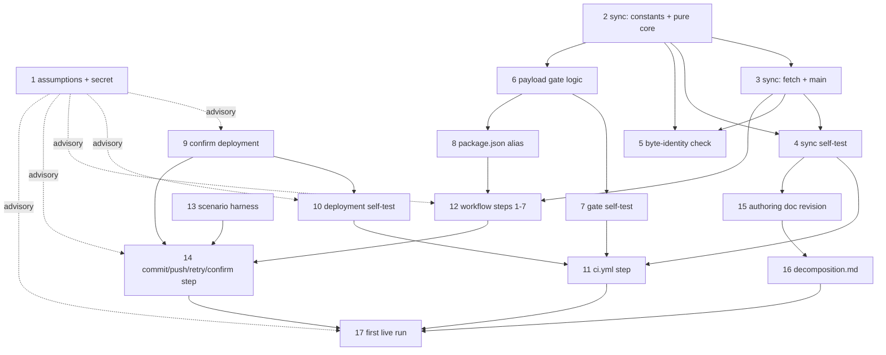

# Tasks Document

> **Version 9 — terminal.** The convergence loop hard-caps at v9, so this version is final. Edit pass
> after adversarial review r8 (`reviews/adversarial-analysis-tasks-r8.md`), which returned
> **`VERDICT: converged` — 0 MUST_FIX, 1 SHOULD_FIX, 4 MINOR, `DESIGN_READY: yes`, `ESCALATE: none`.**
> **All five findings accepted, none rejected. Running total across eight rounds: 108 findings, 108
> accepted, 0 rejected. Curve 24 → 17 → 17 → 16 → 12 → 8 → 9 → 5.**
>
> **Read this first: r8's five findings were closed in place, and that closure is the one edit no
> review has seen** — the same terminal shape the requirements and design phases both reached.
>
> **The proof paragraph survived its eighth attack — the first time in eight rounds.** r8 assembled the
> block from `design.md`'s six fences, built the harness from scratch **driven from the `_Prompt:`
> Restrictions alone** (the surface that failed in each of the two preceding rounds), and ran the full
> matrix: **all twelve rows exact on the first build; both bite tests bit at exactly their named row and
> only there** — the first-attempt witness as a two-way `if` turned row 5 red with eleven others
> byte-identical, R6's turned row 12 red with eleven others byte-identical. The untracked-hook clause
> was in the Prompt this time and the hook counter read `2`, so scenario 12's poison survived R2.
>
> **The one substantive finding was that v8's headline improvement was credited to the wrong
> criterion.** Rows 4 and 8's 40-hex-token check is correct, falsifiable and cheap — measured
> discriminating cleanly, one 40-hex token under the correct block and **zero** under the
> `HEAD:refs/heads/main` substitution. But it does not test **Req 11.8**, which is the push *target*
> (`origin`, `refs/heads/main`) — and `HEAD:refs/heads/main` states that target just as explicitly.
> What those rows detect is the *source* half of the refspec, which the design files under the M1 fix
> and **Req 11.4's carried-forward SHA**. Relabelled at all four sites. Req 11.8's own content is
> discharged by every pushing row and was never review-only.
>
> **v8's process claim — "every repair was grepped after application" — held at eight of nine
> locations**, the exception being a location-column error rather than a missing repair. That is a real
> improvement on the two preceding rounds, where the header reported closures that had landed nowhere.
>
> **What changed in v9, by finding:**
>
> | Finding | Class | Severity | Where |
> |---|---|---|---|
> | S1 — the rows-4-and-8 lever credited to Req 11.8, which it does not test | Novel | SHOULD_FIX | task 14's disclaimer item (g) and Success; this header; the revision row |
> | N1 — v8's table put the `stage-unknown` clause in task 12's Restrictions; it landed in its Success | Recurring in class | MINOR | the v8 header's location column |
> | N2 — r7's S1 second limb never landed: S1's untracked-hook clause has no r8 provenance either | Recurring | MINOR | task 13's Setup preamble |
> | N3 — "all five emitters" is asserted by Component 2, which is not one of the design's five | Novel | MINOR | tasks 3, 6, 9, 12, 14 |
> | N4 — a twelfth `docs/` anchor (`:370`, cited by `design.md:764`) also moves and was unmapped | Novel | MINOR | task 15 |
>
> **What r8 verified and could not break — the section a human should read before approving this
> terminal version:** all twelve rows exact and both bite tests biting, from a `_Prompt:`-only build;
> **the three newly rig-detectable criteria all work** — Req 11.4's lever discriminates, Req 11.7's
> `git log -1 --format='%an %ae'` is runnable at row 1 and returns the expected string character for
> character, and the `fetch-depth` assertion (written and run) catches an omitted `with:` block, a wrong
> value, **and** a string-quoted `"0"`; the coverage table at **87 criteria with zero mismatches both
> ways**, per-requirement counts independently matched against `requirements.md`; the graph against all
> seventeen `_Depends on:_` footers; the standing clause in exactly the eleven claimed Prompts with all
> three prohibitions; **all ten facts re-measured exact**; every cited anchor resolving; the
> summary-unset pass flipping all four `exit 0` rows red when the trailing `:` is dropped; and pnpm's
> banner confirming "last marker" as the correct read rule.
>
> ---
>
> **Version 8.** Edit pass after adversarial review r7
> (`reviews/adversarial-analysis-tasks-r7.md`). **9 findings — 1 MUST_FIX, 5 SHOULD_FIX, 3 MINOR —
> every one accepted, none rejected.** Running total across seven rounds: **103 findings, 103 accepted,
> 0 rejected.** Curve **24 → 17 → 17 → 16 → 12 → 8 → 9**, `DESIGN_READY: yes` for the third round
> running.
>
> **r7 escalated that this header had stopped being a reliable index of what changed, and it was
> right.** r5's N5 was reported closed by the v6 header and by the v7 header, and had landed at
> **neither** of its two sites — while a third site nobody had named still said "twelve". Task 13's body
> contradicted itself nineteen lines apart. **That is this document's own most-repeated defect class,
> committed by the surface that reports the class.** v8's response is procedural rather than rhetorical:
> **every repair below was grepped after application, and the counts verified**, and the four sites of
> that one finding are now consistent.
>
> **The proof paragraph's mechanism finally survived — its propagation did not, and the category
> changed again.** r7 rebuilt the rig from scratch: all twelve rows exact on first build, both bite
> tests biting at exactly their named row, and **v7's untracked-hook clause confirmed correct and
> harmless** (`git reset --hard` leaves untracked files, `core.hooksPath`, the counter, the symlink and
> `$RUNNER_TEMP` alone, and rows 3, 9 and 12 still run the hook on the retry path). But the clause
> landed **only in the body** — so built from the `_Prompt:` alone, row 12 still passed on both blocks.
> Seven for seven, and for the second round running the content was right and only the surface wrong.
>
> **Three findings strengthen the document rather than merely correcting it, and all three came from
> measurement.** r7 ran **eight further block transcriptions** across the full matrix to establish what
> the rig can and cannot see:
>
> - **Item (g)'s headline number was wrong in the document's favour**: the `HEAD:refs/heads/main`
>   substitution is byte-identical on **ten** of twelve rows, not twelve. Rows 4 and 8 differ, because
>   `git push` echoes the source ref token as written in its rejection line. **Those two rows are now
>   task 14's lever for making Req 11.8 rig-detectable** instead of review-only.
> - **Req 11.7's bot identity** was homed at task 14, invisible to the rig, and checked by nothing —
>   measured, deleting both `git config` lines leaves all twelve rows otherwise byte-identical. One
>   Success clause on row 1's transcript closes the criterion outright.
> - **Req 11.6's `fetch-depth: 0`** was named in task 12's Restrictions and absent from its structural
>   check — the one criterion in Req 11 that task 12 owns, in the task that carries a bespoke check
>   *because* prettier is the only other gate on that file. Now one more assertion in a check already
>   being written.
>
> **Negative results worth keeping**, because they bound the disclaimer honestly: the commit message,
> `--force` and `--frozen-lockfile` **are** rig-detectable, and `RACED=0` is harmlessly undetectable —
> none of them belongs on the review-only list. Two that do were added: the confirm invocation's
> `"$PUSH_SHA"` argument and the path-scoped `git status`.
>
> **What changed, by finding:**
>
> | Finding | Class | Severity | Where |
> |---|---|---|---|
> | M1 — r5's N5 landed at neither named site while two headers reported it closed | **Compounding — the document's worst class, at the surface that reports it** | MUST_FIX | task 13 (two sites), the v6 header, the v7 header table |
> | S1 — the untracked-hook clause landed in the body and not the `_Prompt:` | **Recurring (7th round in this paragraph)** | SHOULD_FIX | task 13's Restrictions |
> | S2 — item (g)'s central measurement was wrong: ten of twelve, not twelve | Novel | SHOULD_FIX | task 14's disclaimer and Success (Req 11.8 now rig-detectable) |
> | S3 — the review-only list was short by two, both measured | Novel | SHOULD_FIX | task 14, items (h) and (i) |
> | S4 — Req 11.7's bot identity was checked by nothing | Novel | SHOULD_FIX | task 14's Success |
> | S5 — Req 11.6's `fetch-depth: 0` was absent from task 12's structural check | Novel | SHOULD_FIX | task 12's Success |
> | N1 — the `stage-unknown` default lived only in task 12's body | Compounding | MINOR | task 12's Restrictions |
> | N2 — v7's G4 repair reintroduced "record the substitution", which v6 had closed | **Compounding — a regression inside an unrelated repair** | MINOR | tasks 8, 12 |
> | N3 — task 12's G4 clause needs a forced `next build` failure and did not say how | Compounding | MINOR | task 12's Success |
>
> **What r7 attacked and could not break**, recorded so r8 does not re-derive it: **all twelve rows
> exact on a from-scratch build; both bite tests bite at exactly their named row; the untracked-hook
> clause is correct and breaks nothing**; `git reset --hard` leaves untracked files, `core.hooksPath`,
> the counter, the symlink and `$RUNNER_TEMP` untouched; the commit message, `--force` and
> `--frozen-lockfile` are rig-detectable; `RACED=0`'s undetectability is harmless; and the Gate-step
> reader works against a real `pnpm` alias.
>
> ---
>
> **Version 7.** Edit pass after adversarial review r6
> (`reviews/adversarial-analysis-tasks-r6.md`). **8 findings — 1 MUST_FIX, 3 SHOULD_FIX, 4 MINOR —
> every one accepted, none rejected.** Running total across six rounds: **94 findings, 94 accepted,
> 0 rejected.** Curve **24 → 17 → 17 → 16 → 12 → 8**, `DESIGN_READY: yes` for the second round running.
>
> **The single most useful thing r6 produced is an answer to the question five rounds had been
> circling:** *is there a transcription of the block that passes all twelve scenarios and both bite
> tests and is still wrong?* **There is.** Substituting `HEAD:refs/heads/main` for the explicit
> `"$PUSH_SHA:refs/heads/main"` refspec leaves **all twelve rows and both bite tests byte-identical**,
> because `HEAD == PUSH_SHA` at both push sites in every row — and that refspec is the line the design
> says carries the M1 fix **on its own**. The byte-identity clause cannot help, because it binds the
> rig's block to the committed block and both would carry the same error. It is now item (g) of task
> 14's disclaimer, labelled as **caught by review, not by the rig**.
>
> **The MUST_FIX fires tomorrow, and it is r1's F1 shape inside v6's own repair.** v6's answer to r5's
> M2 was "force a failure at each of G1–G4 and confirm the stage named" — but the alias is
> `G1 && G2 && G3 && G4`, so printing `[gate] G4` requires passing G3, and fact 7 says G3 blocks on the
> committed seed from **2026-08-13**. Task 8's own next sentence says the chain "stops at G3". Both
> instinctive remedies are forbidden by the same task's Restrictions. v7 scopes the G4 clause the way
> task 8's neighbouring clauses are already scoped to the run date, using the temporary-alias-edit
> licence the short-circuit check had already established.
>
> **The proof paragraph did not survive — six for six — but the failure mode finally changed.** r6's
> instance produces a **stall, not a wrong-direction green**: if the harness's hook copy is *tracked*
> (the natural build, since this repository tracks `.githooks/pre-commit`), R2's
> `git reset --hard origin/main` restores it and silently deletes scenario 12's second-invocation
> poison. **Task 13's own criterion catches it** — "a rig that passes both the correct and either broken
> block is recorded as NOT done" — which is why r6 charged it SHOULD_FIX rather than a sixth
> consecutive MUST_FIX. The rig must keep the hook untracked; v7 says so.
>
> **What changed, by finding:**
>
> | Finding | Class | Severity | Where |
> |---|---|---|---|
> | M1 — the G4 verification clause is unreachable from 2026-08-13 | **Recurring shape (r1's F1) inside v6's repair for r5's M2** | MUST_FIX | tasks 8, 12 |
> | S1 — a tracked hook copy loses scenario 12's poison at R2 | **Recurring (6th round in this paragraph)** | SHOULD_FIX | task 13 item S1 |
> | S2 — the disclaimer was short by the one behaviour that answers the whole question | Novel | SHOULD_FIX | task 14, item (g) |
> | S3 — r5's N5 did not land, while v6's header listed it as closed | **Compounding — the document's own worst pattern** | SHOULD_FIX | task 13, the v5 header |
> | N1–N4 | Compounding/Novel | MINOR | the run summary's matching double line, the five emitters' surface-by-surface disagreement, the last-marker read's missing default, and how to recover row 5's transcript once the poison is in `.git/config` |
>
> **What r6 attacked and could not break**, recorded so r7 does not re-derive it: **all twelve rows
> exact on first build; both bite tests bite at exactly their named row with the other eleven
> byte-identical; scenarios 2, 6, 7 and 9 hit the four distinct `exit 0` sites one each**; the
> summary-unset pass and the trailing-`:` claim exact in both directions; **capture-and-re-emit works** —
> warnings survive, G2 says G2, G4 says G4, and a G3 block gives exactly two `::error::` lines with the
> detail-bearing one first and no third copy; N7's YAML `run:`-scalar extraction is byte-identical to
> the standalone script; **the sixth renumber sweep found no survivors**; the graph matches all
> seventeen footers both ways; and every fact re-measured correct.
>
> ---
>
> **Version 6.** Edit pass after adversarial review r5
> (`reviews/adversarial-analysis-tasks-r5.md`). **12 findings — 3 MUST_FIX, 2 SHOULD_FIX, 7 MINOR —
> every one accepted, none rejected.** Running total across five rounds: **86 findings, 86 accepted,
> 0 rejected.** Curve **24 → 17 → 17 → 16 → 12**, and **r5 returned `DESIGN_READY: yes`** — the first
> round to do so.
>
> **v5's central repair works, measured.** r5 rebuilt the rig from task 13's five Setup items and its
> twelve-row stimulus table and ran everything under `bash --noprofile --norc -e -o pipefail`:
> **all twelve scenarios reproduced their documented outcome and cause line exactly**; **scenario 12 is
> real and is the only row that reaches R6's `*)` arm** (both `case` statements were instrumented); and
> **both bite tests bite** — the first-attempt witness broken makes scenario 5 red with the other eleven
> byte-identical, and R6's witness broken makes scenario 12 red with the other eleven byte-identical.
> r4's F1 and F2 are genuinely closed, and S5's last-line placement is correct in all four respects.
>
> **The proof paragraph still produced a defect, for the fifth round running — and this time only in
> its `_Prompt:`.** The body's stimulus row for scenario 12 says "first race as in 3", but the sentence
> under the table and the Prompt Restrictions both listed the race-requiring rows as "3, 7, 8, 9, 10 and
> 11". Measured: built as the Restrictions instruct, scenario 12 reports `outcome refreshed` on **both**
> the correct and the R6-broken block — reinstating exactly the blind spot it exists to close. That is
> r4's F3 shape again: the body right, the surface §Scope decisions 4 calls authoritative wrong.
>
> **The G1–G4 diagnostic has now moved "no home" → "no mechanism" → "mechanism, no signal" across three
> rounds.** v6 gives it the signal: task 8's Success forces a failure at each of G1–G4 and checks the
> stage named, and task 12's requires the same plus **re-emission** — because v5's capture instruction,
> taken at its natural idiom, deletes the step's whole log including the `::warning::` lines Req 5.6
> requires.
>
> **What changed, by finding:**
>
> | Finding | Class | Severity | Where |
> |---|---|---|---|
> | M1 — scenario 12 missing from the first-race list in the body sentence and the Prompt | **Recurring (5th round in this paragraph)** | MUST_FIX | task 13 |
> | M2 — the G1–G4 diagnostic has a mechanism and no falsifiable signal | **Recurring (r3's N4 → r4's F6)** | MUST_FIX | tasks 8, 12 |
> | M3 — "the four bare binaries resolve from `node_modules/.bin`" contradicts fact 10(c) | Novel | MUST_FIX | task 8's `_Leverage:` |
> | S1 — the capture idiom deletes the Gate step's log, including Req 5.6's warnings | Novel (inside v5's own repair) | SHOULD_FIX | task 12 |
> | S2 — task 3 is the one emitter of five whose Prompt and Success omit the two-line format | Compounding (r3's F6 reached the other four) | SHOULD_FIX | task 3 |
> | N1–N7 | Recurring/Novel | MINOR | two entity escapes inside code spans, the disclaimer short by two behaviours, the unset-summary pass with no Success clause, the renumber annotation's placement and glossary, the pre-v4 scenario arithmetic, task 8's "record" with no artifact, and the byte-identity diff against a YAML block scalar |
>
> **What r5 attacked and could not break**, recorded so r6 does not re-derive it: **all twelve scenarios
> green; scenario 12 reaches R6's `*)` arm; both bite tests bite; scenario 9 substitutes for neither,
> exactly as task 13 warns**; task 8's new alias runs, short-circuits, propagates exit codes and names
> the right stage at each of G1–G4 (the pnpm banner reprints all four markers first, so "last
> occurrence" — what task 12 specifies — is the correct rule); **the fifth renumber sweep found no
> survivors**; the graph matches all seventeen `_Depends on:_` footers both ways; the coverage table has
> zero mismatches at 87 criteria; the standing clause is in exactly the eleven claimed Prompts with all
> three prohibitions plus the escalation half; the `GITHUB_STEP_SUMMARY`-unset pass is runnable and
> task 14's claim about scenario 6 is exact; and **no task is unstartable, unfalsifiable in a blocking
> way, or wrong.**
>
> ---
>
> **Version 5.** Edit pass after adversarial review r4
> (`reviews/adversarial-analysis-tasks-r4.md`). **16 findings — 4 MUST_FIX, 5 SHOULD_FIX, 7 MINOR —
> every one accepted, none rejected.** Running total across four rounds: **74 findings, 74 accepted,
> 0 rejected.** Curve **24 → 17 → 17 → 16**.
>
> **v4's split worked.** r4 built the rig from task 13's items and stimulus table and **all eleven
> scenarios reproduced their documented outcome and cause line exactly — the first round the whole set
> went green.** S5's hook poison genuinely reaches the witness and fires the `case *)` arm, closing
> r3's F1. The stimulus table is right row for row, including the two rows v3 had made unreachable.
>
> **The defect moved into the proof criterion itself — the paragraph v4 invented to end the pattern.**
> The block contains the three-way `case` **twice**, and v4 said "transcribe **the** empty-commit
> witness … and confirm scenario 5 **or 9** goes red". Measured: breaking the **first-attempt** witness
> makes scenario 5 red; breaking **R6's** leaves **all eleven scenarios byte-identical to the correct
> block**, and scenario 9 cannot bite under either transcription. So a rig satisfying v4's criterion is
> blind to the retry path's fail-closed guard — the one thing standing between a renormalising hook on
> the retry path and a no-op production deploy. **Fourth consecutive round with a defect in this
> paragraph, and the second in a row that is a wrong-direction green.**
>
> **v5's answer is a twelfth scenario, measured and producible by r4** — race, differing seed, and a
> hook copy that poisons `diff.algorithm` only on its **second** invocation, so the poison lands between
> R6's `git commit` and R6's witness. It reaches R6's `*)` arm and it bites the fail-open variant. The
> proof criterion now names **both** witnesses explicitly and drops the false `or 9`.
>
> **The renumber sweep missed four sites, and one of them authorised the failure it forbids.** Task
> 12's merge-safety bullet said "do not merge between tasks 12 and **13**" while its own Prompt said
> 14 — and merging after 13, which lands nothing in the workflow, puts a workflow with no commit step on
> the default branch. **And task 6's `_Prompt:` still carried r3's corrected-in-the-body-only "four of
> the nine state names"** — the surface §Scope decisions 4 argues is the only one an implementer reads.
>
> **What changed, by finding:**
>
> | Finding | Class | Severity | Where |
> |---|---|---|---|
> | F1 — the bite test is satisfiable by a rig blind to R6's witness; "or 9" is false | **Recurring (4th round in this paragraph)** | MUST_FIX | task 13's proof criterion |
> | F2 — "scenarios 5 and 9 are the only things that execute the `*)` arm" is false; no scenario reached R6's | Novel | MUST_FIX | task 14; new scenario 12 |
> | F3 — task 6's `_Prompt:` still said "four of the nine state names" | **Recurring (r3's F3, half-closed)** | MUST_FIX | task 6's Prompt |
> | F4 — four renumber sites still resolved to the wrong task; one authorised the forbidden merge | Compounding | MUST_FIX | fact 7, §Scope decisions 1, the Human-owned table, task 12 |
> | F5 — S5's poison also disabled the hook's prettier stage | Compounding (r2's F1) | SHOULD_FIX | task 13 item S5 |
> | F6 — "name which of G1–G4 failed" had no workable mechanism and no Success clause | Compounding (r3's N4) | SHOULD_FIX | tasks 8, 12 |
> | F7 — four load-bearing block behaviours unexercised, and the disclaimer did not name them | Novel | SHOULD_FIX | task 14 |
> | F8 — task 9's Success contradicted its own absent-`argv[2]` rule | Compounding (r3's F4, mirrored) | SHOULD_FIX | task 9 |
> | F9 — nothing bound the block proved to the block landed | Novel | SHOULD_FIX | tasks 13, 14 |
> | N1–N7 | Novel | MINOR | entity escapes inside code spans, task 13's `11.2–11.8` range, the coverage preamble's wrong list, task 2's missing Success clause, task 14's dropped escalation half, the NFR-footer guarantee, and the unannotated v2 header |
>
> **What r4 attacked and could not break**, recorded so r5 does not re-derive it: **all eleven scenarios
> green, first time** — the rig is buildable and the block is correct; S5's poison reaches the witness
> and executes the fail-closed arm with the commit created first; scenario 2's "trailing whitespace, not
> a blank line" is correct in both directions; the stimulus table is right row for row; **the coverage
> table matches all footers, 87 criteria, zero mismatches, and task 13 discharges none**; and the
> standing clause's three prohibitions really are in all eleven Prompts.
>
> ---
>
> **Version 4.** Edit pass after adversarial review r3
> (`reviews/adversarial-analysis-tasks-r3.md`). **17 findings — 4 MUST_FIX, 6 SHOULD_FIX, 7 MINOR —
> every one accepted, none rejected.** Running total across three rounds: **58 findings, 58 accepted,
> 0 rejected.** Curve **24 → 17 → 17**.
>
> **r3 built the harness from v3's six items and ran all ten scenarios. Eight reproduced their
> documented outcome exactly — the block is correct. The rig around it was not.** And for the **third
> consecutive round** the defect in that paragraph was a *wrong-direction green*: `git config
> diff.algorithm bogus` is not scoped to `git diff`, so `git status --porcelain` — the block's **first**
> command — exits 128, the block dies at line 1, prints the documented `commit-failed`, and the
> fail-closed `case *)` witness arm the design calls its one barrier against a no-op production deploy
> **stays dead code**. A two-way `if` — the fail-*open* shape the design rewrote three times — would
> have passed that scenario too.
>
> **The diagnosis is not "the contract keeps being wrong."** Each round's repair was measured **in
> isolation** and adopted **without re-running the block**: r2 measured `diff.algorithm` against
> `git diff --quiet` alone, and v3 took it. **So v4 acts on r3's escalation and splits the rig into its
> own task (13), with its own proof criterion — it is not done when it runs, it is done when it *bites*
> a deliberately-broken block.** §Scope decisions 3's droppability argument keeps the step and its
> execution together in task 14; it never required the rig's *construction* to share their checkbox.
> **Tasks 13–16 renumber to 14–17.**
>
> **The scenario set is now eleven and its provenance is stated honestly.** v3 said the contract was
> "recovered from the method design r8 actually ran" — true of the rig's setup and the shell flags,
> **false of the scenario set**. The set is the design's eight, plus r8's ninth (the retry-path
> witness, which v3 demoted to an optional footnote *and made unreachable*), plus two for the slugs
> nothing exercised. r8's tenth — both paths under `set -u` — is deliberately not reproduced, and the
> reason is recorded rather than left as a silent drop.
>
> **Six of v3's ten scenarios had no stated stimulus**, and two of them were measurably unreachable — v3's 9 and 10, now rows 10
> and 11 need the *first* push to be rejected as a race, because R3 and R5 sit inside
> `if [ "$RACED" = 1 ]`. Run as v3 specified them they produced `outcome refreshed` and never raised
> their slugs. Task 13 now carries a per-scenario stimulus table.
>
> **What changed, by finding:**
>
> | Finding | Class | Severity | Where |
> |---|---|---|---|
> | F1 — item 5 never reaches the witness; scenario 5 passes for the wrong reason | Compounding (r2's F8) | MUST_FIX | task 13 item S5 |
> | F2 — item 4's universal seed rule makes scenario 7 unreachable | Compounding (r2's F3) | MUST_FIX | task 13's stimulus table |
> | F3 — "four of the nine state names contain spaces"; measured, seven | Novel | MUST_FIX | task 6; the v3 revision row |
> | F4 — task 9's "four slugs, one branch each" contradicts its own body and the design | Novel | MUST_FIX | task 9 |
> | F5 — six of v3's ten scenarios have no stimulus; v3's 9 and 10 (now rows 10 and 11) never reach R3/R5 | Novel | SHOULD_FIX | task 13's stimulus table |
> | F6 — the emitter format is specified in task 3 and nowhere else | Novel | SHOULD_FIX | tasks 6, 9, 12, 14 |
> | F7 — `gate-rejected` double-reports, and no task names which gate stage failed | Novel | SHOULD_FIX | tasks 6, 12 |
> | F8 — `STALE`'s warn verdict is unobservable, making task 7's mutation criterion unsatisfiable | Novel | SHOULD_FIX | tasks 6, 7 |
> | F9 — the fourth `exit 0` site's recipe violates item 4's own mandatory seed property | Compounding (F2's sibling) | SHOULD_FIX | task 13 (promoted to scenario 9) |
> | F10 — "every pinned constant with its reason" is instructed only for the cron | Novel | SHOULD_FIX | tasks 2, 6, 9 |
> | N1–N7 | Novel | MINOR | the standing clause's third prohibition, `DeploymentVerdict`'s dropped fields, `sleep`'s unbound interval, task 12's four uncheckable comments, the header's stale item numbers, the r8-provenance overclaim, and the `created_at` comparison method |
>
> **What r3 attacked and could not break**, recorded so r4 does not re-derive it: **eight of ten
> scenarios reproduced their documented outcome and cause line exactly, and the two exceptions were rig
> defects, not block defects** — including scenario 2, which confirms v3's "never shadow `node`" fix
> closed r2's F1. Fact 10's three claims re-measured exact. Fact 7's boundary correct and stated
> identically in tasks 6 and 8, with no other date-sensitive Success line in the document. **Task 6's
> `evaluatePayload`, task 9's three pure functions, and task 12's workflow-plus-structural-check were
> each built from their `_Prompt:` alone and satisfied every Success clause** — including the all-zero
> payload warning rather than blocking. `causes[]`'s one-element vocabulary is licensed by the design.
> §Scope decisions 4's eleven-Prompt sweep is mechanically accurate. Task 14's (now 15's) checklist is
> complete in both directions. `-o pipefail` breaks nothing — the block contains no pipeline. All nine
> pinned constants carry the design's exact values, and `STALENESS_THRESHOLD_DAYS`'s "owned by spec
> #11" is honoured.
>
> ---
>
> *(Everything from here down predates v4's renumber. In the v2 and v3 blocks, task references
> are the numbering current at the time: old 13 = the commit step (now 14), old 14 = the authoring
> doc (now 15), old 15 = decomposition.md (now 16), old 16 = the first live run (now 17). They are
> history, not instructions. The one exception is the parenthetical inside the v3 block about
> harness item numbers, which was written by v4 and already uses current numbering.)*
>
> ---
>
> **Version 3.** Edit pass after adversarial review r2
> (`reviews/adversarial-analysis-tasks-r2.md`). **17 findings — 3 MUST_FIX, 7 SHOULD_FIX, 7 MINOR —
> every one accepted, none rejected.** Running total across two rounds: **41 findings, 41 accepted,
> 0 rejected.** Curve **24 → 17**.
>
> **All three MUST_FIXes are in the harness contract v2 wrote to close r1's F6 and F7 — and r2 measured
> them by running it.** This is r1's own lesson landing on the most mechanism-dense paragraph v2
> produced: *the repair is frequently worse than the defect it repaired.*
>
> **Item 3 was the worst, because it failed green in the wrong direction.**
> `node_modules/.bin/prettier` is not a Node script — it is a pnpm-generated `sh` shim whose last line
> is `exec node …`, and **there is no `node_modules/.bin/node`**, so it resolves `node` from `PATH`.
> v2's `PATH`-shadowed `node` therefore silently disabled the pre-commit hook. Measured, both
> directions: with the shim active, scenario 2 — the renormalising hook, which the design calls the
> only barrier between a bad hook and a no-op production deploy — emits `outcome=refreshed` and
> **pushes**; with the real `node`, it emits `outcome unchanged` and pushes nothing. An implementer
> trusting v2's contract would have concluded the *block* was broken.
>
> **The rig already existed and v2 did not recover it.**
> `reviews/adversarial-analysis-design-r8.md:4-6` records the ten scenarios run against a bare remote,
> a real `.githooks/pre-commit` and *"this repository's real `prettier`"* — no `PATH`-shadowing
> anywhere, and under `-e -o pipefail`. v2 re-derived the rig from the design's recorded *outcomes*
> while the design phase's own review artifacts held the *method*. That is r1's third defect class —
> inheriting an outcome without its rig — repeating one level up. **v3's harness contract is recovered
> from r8's method and from r2's measurements, not re-specified.**
>
> **What changed, by finding:**
>
> *(Locations below are v3's harness-item numbers, which v4 renumbered — F1, F2 and F3's repairs now
> live in task 13's items S2, S1 and S4 respectively, and F8's in S5.)*
>
> | Finding | Class | Severity | Where |
> |---|---|---|---|
> | F1 — the `PATH`-shadowed `node` disables the hook; scenario 2 pushes | Novel | MUST_FIX | v3 item 3; new fact 10 |
> | F2 — "`node_modules/.bin` on `PATH` for prettier" is the wrong mechanism; every committing scenario dies at `git commit` | Novel | MUST_FIX | v3 item 1 |
> | F3 — "gate-validated bytes" is not executable, and the natural reading collapses scenarios 3 and 8 into 7 | Novel | MUST_FIX | v3 item 2 |
> | F4 — the shims leave `resync-failed` and `gate-rejected` unexercised while the footer claims Reqs 11.3 and 4.1 | Novel | SHOULD_FIX | the scenario set (v3: ten; v4: eleven) |
> | F5 — task 14's checklist leaves six of its own footer's criteria with no clause | Compounding (r1's F11) | SHOULD_FIX | task 14 |
> | F6 — `causes[]` has no vocabulary, and two Success lines assert a slug the design scopes to the step | Novel | SHOULD_FIX | tasks 6, 8 |
> | F7 — "the state token" is still not implementable one way; the one-token reading blocks `ALL COUNTS ZERO` | Recurring (residual of r1's F16) | SHOULD_FIX | task 6 |
> | F8 — item 4 shadows `git` when a one-line config forces the same exit 128 | Novel | SHOULD_FIX | v3 item 4 |
> | F9 — task 8's Success asserts the gate blocks unconditionally; false before 2026-08-13 | Compounding (r1's F1, overshot into its mirror image) | SHOULD_FIX | tasks 6, 8 |
> | F10 — task 14 pins one H3's position and drops the design's rule for the other three | Novel | SHOULD_FIX | task 14 |
> | N1–N7 | Novel | MINOR | item 5's missing second clone, task 7's `+1` verdict, the Reliability NFR's home, the standing clause's nine omissions, the fourth `exit 0` site, the advisory edges to 9 and 10, and the harness shell's missing `-o pipefail` |
>
> **What r2 attacked and could not break**, recorded so r3 does not re-derive it: **the coverage table
> matches all sixteen footers exactly in both directions** (parsed mechanically — 87 criteria, 0
> mismatches), which was the round's one auto-MUST_FIX claim; **task 2's `yaml.stringify` option pair
> reproduces `content/github-activity.yaml` byte for byte at 11 703 bytes**, written from its `_Prompt:`
> alone, verifying task 5's criterion in advance; `requestBounds` correct at every clock task 4 names;
> task 4's fence assertion works and detects field swap, field deletion and whitespace change; facts 3,
> 8 and 9 re-measured correct; fact 7's inclusive boundary stated consistently everywhere; task 12's
> `node -e` structural check runnable exactly as described; item 5's race timing correct; the graph
> edits right; and `4.1 → 8, 12, 13` and `5.1 → 6, 8` accurate on their merits, not merely consistent.
>
> ---
>
> **Version 2.** Edit pass after adversarial review r1
> (`reviews/adversarial-analysis-tasks.md`). **24 findings — 7 MUST_FIX, 10 SHOULD_FIX, 7 MINOR —
> every one accepted, none rejected.**
>
> **The round's sharpest finding has a clock attached.** The committed seed's anchor is `2026-08-10`
> and `ANCHOR_RECENCY_DAYS` is 2, so **from 2026-08-13 the gate blocks on the untouched repository** —
> which made tasks 6 and 8 unpassable as written, with both natural remedies (widen the window,
> hand-edit the payload) forbidden by the spec. It is now measured fact 7 and both Success criteria are
> restated against the injected clock Component 2 already exposes.
>
> **The most dangerous finding was quieter.** v1 told the implementer to classify `evaluate`'s messages
> "by prefix" — but **every message it returns is prefixed with `[check-github-activity-freshness] `**
> (measured at all ten emission sites). A literal `startsWith("FILE ABSENT")` matches nothing, and
> under v1's own correct fail-closed rule that makes **every** state blocking, including the two
> Req 4.3 and Req 5.6 require to warn. The defect is invisible on today's payload and would first
> appear on a genuinely quiet year — the exact case Req 5.6 exists to protect.
>
> **Three of v1's stated gates do less than it claimed** (F5, F12, F17): `pnpm lint` does not lint
> workflow YAML at all and exits 0 on warnings; `pnpm typecheck` sees no file under `scripts/`; and
> `pnpm format:check` is red in any local tree where `pnpm lhci` has run. The "green at every checkbox"
> policy was doing less work than four tasks credited it with. Facts 3, 8 and 9 now state what each
> command actually covers, and those Success lines name checks that exist.
>
> **What changed, by finding:**
>
> | Finding | Severity | Where |
> |---|---|---|
> | F1 — tasks 6 and 8 expire on 2026-08-13 | MUST_FIX | fact 7 (new); tasks 6, 8, 12, 16 |
> | F2 — Req 4.1 homed at a task that discharges neither clause; task 12's footer contradicts the table | MUST_FIX | coverage table; tasks 12, 13 |
> | F3 — Req 5.1's gap and duplicate clauses have no home in task 6 | MUST_FIX | coverage table; tasks 6, 8 |
> | F4 — the `verify-vercel-token.yml` sweep ran on `design.md` only | MUST_FIX | §Scope decisions 1 (four `requirements.md` rows added); task 1 |
> | F5 — fact 3 false in three ways | MUST_FIX | fact 3; tasks 6, 11, 12 |
> | F6 — task 13's scenario 1 cannot produce `outcome refreshed` under its own Restrictions | MUST_FIX | task 13 (harness contract) |
> | F7 — scenarios 3, 7, 8 traverse R3–R5, which cannot run in a throwaway repository | MUST_FIX | task 13 (harness contract) |
> | F8 — the Usability NFR's commit-message clause had no task | SHOULD_FIX | task 13; NFR paragraph |
> | F9 — task 9 claimed Req 10.6, which Component 3 cannot support | SHOULD_FIX | task 9 |
> | F10 — the `13 → 15` graph edge is not real | SHOULD_FIX | graph; task 15 |
> | F11 — task 14's completion signal cannot detect a partial | SHOULD_FIX | task 14 (criterion-keyed checklist) |
> | F12 — `pnpm typecheck` gates four `.mjs` tasks and sees none of them | SHOULD_FIX | fact 8 (new); tasks 2, 3, 6, 9 |
> | F13 — task 1 re-raised the Vercel topology judgement Requirements v9 retired | SHOULD_FIX | §Human-owned; task 1 |
> | F14 — "must not be merged between the two" is unenforceable, and the fact that makes it safe was withheld | SHOULD_FIX | task 12 |
> | F15 — task 3's abort enumeration reads positionally wrong at three of five | SHOULD_FIX | task 3 (condition→slug table) |
> | F16 — "classify by message prefix" is under-specified; every message carries the script's TAG | SHOULD_FIX | tasks 6, 7 |
> | F17 — `pnpm format:check` is red locally for a pre-existing reason | SHOULD_FIX | fact 9 (new); every Success line |
> | N1–N7 | MINOR | the inventory row count, the quoted-key inversion, the advisory graph edges, task 13's two omitted lines, task 4's dummy token, task 12's uncheckable half, actionlint's absence |
>
> **What r1 confirmed rather than broke**, recorded so it is not re-attacked: all ~40 `path:line`
> citations resolve and carry their claims (zero failures); facts 1, 2, 4, 5 and 6 re-measured correct;
> all 87 criteria appear in the coverage table and the arithmetic is exact; every row of the design's
> inventory has a task; **task 13's stated execution order matches `design.md:1200-1211` item for
> item**; the `4 → 14` edge is right and sufficient; and tasks 1, 5 and 16 are real checkable units
> rather than narration.

Derived from `design.md` v9 (approved 2026-08-12, `approval_1786558366724_66mkjbiur`) and
`requirements.md` v9 (approved 2026-08-12, `approval_1786485295072_1uyqe11cx`). Both are terminal —
the convergence loop hard-caps at v9 — so **neither can be amended by this phase.** Where the
repository has moved since the design was written, this document records the adaptation rather than
pretending the design still describes the tree; see §Scope decisions.

Tasks are listed in **topological order** consistent with the dependency graph below; the linear
ordering does not imply serial execution. Each task carries a `_Depends on:_` footer.

## Ten facts every task in this document rests on

These are measured against the tree at `30f46b2`, not inherited from the design.

1. **`pnpm build` is not the content validator — `pnpm exec velite build` is.** `package.json:8` is
   `next build`, and `next.config.ts:121-131` only *consumes* `./.velite/index.js` inside a `try/catch`
   with an empty-array fallback. Every content failure this spec's gate rests on — the loader envelope
   throw at `src/lib/build/content-yaml-loader.ts:76`, `.strict()`'s unknown-key rejection, the
   future-date bound, `checkNoDuplicateDates`, `checkCoverageContiguity` — fires inside Velite. This is
   why the gate is `velite build && … && next build` and not `next build` alone.
2. **`pnpm test` does not run the three new self-tests.** `vitest.config.ts:16` includes only
   `src/**/*.test.{ts,tsx,mjs}`. The new files are `scripts/*.test.mjs`, so they are reachable only via
   `node --test` and **only run in CI because task 11 names them**. Thirteen such files already exist
   and `ci.yml` runs four (`:57`, `:60`, `:63`, `:66`) — a colocated test here has a 4-in-13 base rate
   of ever running, which is what Req 4.9's "executed in CI" wording exists to prevent.
3. **`pnpm format:check` covers `scripts/*.mjs` *and* `.github/workflows/*.yml`; `pnpm lint` covers
   only `scripts/*.mjs`, at warning severity.** Measured: `npx eslint .github/workflows/ci.yml` →
   *"File ignored because no matching configuration was supplied"* — there is no YAML plugin and no
   matching `files:` entry, so **`pnpm lint` does not lint workflow YAML at all**. And an unused
   binding is a **warning**: `eslint` exits **0**. (`eslint.config.mjs` also *does* declare two
   `files:`-scoped blocks, at `:43-56` — v1 said it declared none.) The consequence, stated plainly:
   **prettier is the only automatic gate on a new workflow file**, which is why task 12 carries a
   structural check of its own.
4. **The pre-commit hook is live on the runner.** `package.json:21`'s `prepare` sets
   `core.hooksPath=.githooks` on every `pnpm install`, and `.githooks/pre-commit:11-16` runs
   `prettier --write --ignore-unknown` on each staged file matching `\.(…|ya?ml)$` and re-stages it.
   `content/github-activity.yaml` is not in `.prettierignore`, so it is in scope. This is why G1
   normalises before the gate (Req 4.7) and why the empty-commit witness exists.
5. **`ci.yml:66` is the last `node --test` step**, and `ci.yml:143` is the repository's existing
   `GH_TOKEN: ${{ secrets.GITHUB_TOKEN }}` routing. No CI guard objects to a new step:
   `scripts/verify-ci-topology.mjs` is **not invoked by `ci.yml`**, and none of the three paired-merge
   verifiers references any path this spec touches.
6. **`scripts/__fetch-mock-loader.mjs`'s stub returns `{ status, json(), text() }` and nothing else** —
   no `ok`, no `headers`, no `url`. Component 1's fetch path must therefore branch on `res.status`, not
   on `res.ok`, or task 4's fetch-branch tests cannot drive it. The stub *does* support a thrown
   `TypeError` via `entry.throw` (`:20-22`), which covers task 4's throw branch; the one thing it
   cannot express is an abort/timeout, because its signature `async (input) =>` ignores `init` and so
   never sees `AbortSignal.timeout`. **No task asserts on the timeout branch**, so the constraint
   reaches far enough.
7. **The committed seed's anchor is `2026-08-10`, and `ANCHOR_RECENCY_DAYS` is 2 — so G3 blocks on the
   untouched repository from 2026-08-13 onward.** Measured: the payload's last record is
   `- date: "2026-08-10"`, it holds 364 records, and the authoring date was `2026-08-12` — exactly at
   the inclusive boundary. **This is correct behaviour, not a defect**: the seed is a fixed snapshot and
   Req 4.5's check exists precisely to catch a payload whose window has stopped moving. It is stated
   because tasks 6, 8, 12 and 17 all touch it, and because the two instinctive remedies are both
   forbidden — widening `ANCHOR_RECENCY_DAYS` re-tunes the one check this spec invented, and
   hand-editing `content/github-activity.yaml` is forbidden by `docs:309` and by task 5. **The correct
   posture: drive Component 2 with an injected clock in every test and Success criterion, and expect
   the bare CLI to block on the seed until task 17's first live sync lands a fresh payload.**
8. **`pnpm typecheck` sees no file under `scripts/`.** `tsconfig.json`'s `include` is `next-env.d.ts`,
   `**/*.ts`, `**/*.tsx`, `.next/types/**/*.ts`, `.next/dev/types/**/*.ts`, `**/*.mts` — **no `.mjs`
   pattern**. Measured: `tsc --noEmit --listFiles | grep '\.mjs$'` returns exactly one file, and it
   enters via an import from a `.ts` file under `src/`. Combined with fact 3, **the only automatic gate
   on a new `scripts/*.mjs` is prettier formatting** — so tasks 2, 3, 6 and 9 name `node --check` and a
   smoke import instead of `pnpm typecheck`.
9. **`pnpm format:check` is red in a local tree where `pnpm lhci` has run.** Measured: three
   `lighthouse.*/Default/README` artifacts with literal Windows paths are reported. They are gitignored
   (`.gitignore:66-70`) but **not** prettierignored, and prettier does not read `.gitignore`. CI is
   green because it is a fresh checkout. **Every Success line therefore scopes the check to the paths
   the task touches** — `pnpm exec prettier --check <paths>` — rather than to the bare command.
10. **`.githooks/pre-commit` reaches prettier by relative path, and that path bottoms out in a `PATH`
    lookup for `node`.** Three measurements, and the reason task 13's harness is written the way it is:
    (a) `.githooks/pre-commit:14` invokes **`./node_modules/.bin/prettier`** — a path relative to the
    hook's cwd, **not** a `PATH` lookup, so putting a `node_modules/.bin` directory on `PATH` has no
    effect on it; (b) that file is not a Node script but a pnpm-generated `sh` shim whose operative
    branch is `if [ -x "$basedir/node" ]; then exec "$basedir/node" …; else exec node …; fi`; and
    (c) **`node_modules/.bin/node` does not exist** in this repository (25 entries, no `node`), so the
    `-x` test fails and the shim falls through to a bare `exec node`, resolved from `PATH`. **The
    consequence: shadowing `node` on `PATH` silently disables the pre-commit hook** — which is the
    mechanism scenario 2 exists to exercise, and disabling it makes that scenario push a commit.

**Intermediate-state policy.** At every checkbox: `pnpm lint` and `pnpm test` pass; `pnpm build`
passes; and `pnpm exec prettier --check <the paths this task touched>` passes. `pnpm typecheck` is
listed only for tasks that touch a `.ts`/`.tsx` file — **none do** (fact 8). Additionally, from task 4
onward `node --test scripts/sync-github-activity.test.mjs` is green; from task 7, the payload
self-test; from task 10, the deployment self-test.

## What "the implementation log" means, mechanically

Six tasks (1, 5, 13, 14, 15, 17) write to it as a **deliverable**, not as narration. It is the
`log-implementation` MCP tool, which writes one file per task into
`.spec-workflow/specs/github-activity-sync/Implementation Logs/` as
`task-<n>_<timestamp>_<hash>.md` — the same convention spec #11 used for its 52 entries. **No task
creates the directory**; the tool does.

## Scope decisions this document makes

### 1. `verify-vercel-token.yml` no longer exists, and **seven citations across both frozen documents** point at it

The design and the requirements were both written against a tree containing
`.github/workflows/verify-vercel-token.yml`. **It was deleted in `30f46b2`, the tip of the branch this
work lands on.** `.github/workflows/` now contains `ci.yml` alone.

> **v1 asserted "three design citations" after searching one of the two frozen documents.** r1's F4
> found four more in `requirements.md`, including a whole §Escalation section that still tells a reader
> the workflow is active and needs Matthew's attention. The sweep is redone across both.

| Document · site | What it claims | Status after `30f46b2` | Decision |
|---|---|---|---|
| `design.md:1024` — §Component 4, cron | "Tuesday keeps it off the Monday slot the repository's other weekly workflow uses (`verify-vercel-token.yml:4`)" | There is no other scheduled workflow | **The cron value is unchanged.** `37 9 * * 2` satisfies Req 1.4 (weekly) and Req 1.5 (minute is none of `00`/`15`/`30`/`45`, hour is not `00`) on its own; Monday-avoidance was a tiebreak, not a driver. Task 12's comment states the Req 1.5 reason and **does not cite a deleted file.** |
| `design.md:958` — §Component 3, token justification | "Every other workflow in this repository routes the token explicitly (`ci.yml:143`, `verify-vercel-token.yml:32`)" | Only `ci.yml:143` remains | **The decision is unchanged** — `GH_TOKEN` is routed explicitly. One of two supporting citations lapsed; the argument that carries it (the anonymous 60/hour limit is keyed to the runner's *shared* IP) is untouched. |
| `design.md:1809` — §Error Handling 12, and `requirements.md:616` — Req 9.7's evidence clause | The documentation SHALL cite "the eleven consecutive unread failures of `verify-vercel-token.yml`" as evidence the red-run channel is weak | The workflow is gone; the failures are historical | **Task 15 states the evidence historically and cites commit `30f46b2`.** Verified: that commit's message independently restates the whole evidence chain — "11+ consecutive scheduled failures since 2026-06-01 and no successful run in its history", the missing `secrets.VERCEL_TOKEN`, the missing labels, the read-only token, "The repo has zero issues, ever." **So a future reader following the citation can still verify it** — which is what makes this a substitution of source rather than a loss of evidence. |
| `requirements.md:154-169` — §Escalation | "The workflow is still `active`", "**All three are one-line fixes**", "**It needs Matthew's attention independently of this spec**" | All three sentences are now false | **Lapsed, and deliberately not re-raised.** `30f46b2` resolved it by removal, and its message gives the reason: *"a permanently red weekly workflow trains the habit of ignoring red scheduled workflows, which is the only failure-delivery channel the github-activity-sync spec has."* That is this spec's own argument, acted on. `HANDOFF.md`'s "Two things for Matthew" item 1 is closed. |
| `requirements.md:214` — Out of scope | "**Fixing `verify-vercel-token.yml`.** See Escalation above." | Moot | Lapsed harmlessly. Nothing depended on it. |
| `requirements.md:126` — Assumption A1's evidence | "r2 proved from the `verify-vercel-token` job log that this secret does not exist" | The job log is gone with the workflow | **Task 1 must not chase it.** The same evidence is in `30f46b2`'s commit message, which also records the positive finding A1 actually needs: *"deployments are created by vercel[bot] via the native Git integration (verified on deployment 5855726914 for 4802b6c)."* Task 1's A1 check is written against that, not against a job log that no longer exists. |

**No requirement or design decision changes as a result.** Recorded per site because a silent
adaptation is exactly the failure class both prior phases spent eight rounds on.

### 2. Artifacts touched that the design's §Project Structure inventory does not name

The inventory covers **eleven** rows (`design.md:444-454`). Two further artifacts are touched, both
authorised by design prose rather than by the table:

- **`content/github-activity.yaml`** — not modified by any task, but **read** by task 5's byte-identity
  check and **normalised in place** by G1 whenever the gate runs locally (task 8). Task 8's
  Restrictions forbid committing a G1-induced change: the committed file is already prettier's fixed
  point (verified), so a diff there means something else moved.
- **The implementation log** — see §What "the implementation log" means above.

### 3. The step and its execution stay in one task — the **rig** does not

The design's §The step boundary calls its eight-scenario execution obligation "the single most
load-bearing sentence in this document", because five of that section's seven defects across eight
rounds "were findable **only by executing the code**." **Task 14 therefore builds the step and runs the
scenarios under one checkbox**; splitting the *execution* off would make it droppable.

> **[v4] But the rig is now its own task (13), and that is r3's escalation acted on.** The harness
> contract produced a defect in **three consecutive rounds** — r1 found it absent, r2 found it green in
> the wrong direction at scenario 2, r3 found it green in the wrong direction at scenario 5, where the
> block died at its *first* command and printed the documented cause while the fail-closed witness arm
> stayed dead code. The diagnosis is not "the contract keeps being wrong" but **"each round's repair was
> measured in isolation and adopted without re-running the block"** — r2's own suggested fix for
> scenario 5 was verified against `git diff --quiet` alone and broke `git status`. §Scope decisions 3's
> droppability argument justifies keeping the step and its execution together; **it never required the
> rig's construction to share their checkbox**, and three rounds have shown the rig is exactly what
> needs to be reviewable on its own. Task 13 therefore carries its own proof criterion: it is not done
> when it runs, it is done when it **bites** a deliberately-broken block.

> **r1's F6 and F7 showed the checkbox could not be *started*, which is worse than droppable.** The
> design recorded r8's *outcomes* and not its *rig*: scenario 1's `outcome refreshed` requires a
> zero-exit confirm, which an absent `GH_TOKEN` in a throwaway repo makes impossible; and scenarios 3,
> 7 and 8 traverse `pnpm install` (R3), a `$RUNNER_TEMP` copy created by a *different step* (R4) and
> the full gate (R5), none of which exists there.
>
> **[v3] v2's answer then became the problem, and r2 measured it.** Three of the contract's five items
> were wrong, and the claim that the contract lets an implementer "tell 'my block is wrong' from 'my rig
> is wrong'" was **false in the opposite direction** at two scenarios: under the old item 1 every
> committing scenario reported `commit-failed` from a hook that could not find prettier — a block-shaped
> symptom with a rig-shaped cause — and under the old item 3 scenario 2 reported `outcome refreshed` and
> pushed. **The claim is withdrawn and replaced by the artifact that earns it:** the contract is now
> recovered from the method design r8 actually ran, each item names the *mechanism* rather than the
> effect, and the contract states in its own words what the rig does not prove.

> **[v3, corrected v4] The scenario count is eleven, and it is not r8's ten.** The design names eight
> scenarios; r8 ran ten. Mapping the block's five cause slugs against the design's eight showed
> `resync-failed` and `gate-rejected` were raised by **nothing** — both live behind `pnpm` calls the
> shim forces to exit 0 — while the step task's footer claims Reqs 11.3 and 4.1, whose whole content
> those two slugs are. So the set is: **the design's eight, plus r8's ninth (the retry-path witness),
> plus two new ones for the unexercised slugs.** r8's tenth — both paths under `set -u` — is
> deliberately not reproduced, because GitHub invokes a `shell: bash` step as
> `bash --noprofile --norc -eo pipefail {0}`, **without `-u`**, so it is not the shell the step ships
> under. **v3 said "recovered from the method design r8 actually ran" and that is true of the rig's
> setup and the shell flags, not of the scenario set** — stated here rather than left to imply that
> v3's ten were r8's ten.

### 4. Req 8.1's prohibitions are a standing restriction on every task

The coverage table discharges Reqs 8.2–8.5 with "no task touches `src/`, `velite.config.ts` or
`next.config.ts`" — true of all seventeen `File:` fields, but nothing *forbade* it. **Every task's
Restrictions are therefore read as carrying this standing clause:** add no file under `src/`, modify no
existing file under `src/`, and modify neither `velite.config.ts` nor `next.config.ts`. And, per the
requirements' own note — which is scoped to Req 8, and is quoted here at that scope rather than
widened: **if satisfying any requirement in Req 8 appears to need an application change, that is a
signal the approach is wrong and SHALL be raised rather than absorbed.**

**[v3] A preamble is not what an implementer working one checkbox at a time reads.** The clause is
restated in the `_Prompt:` Restrictions of every task that authors code — 2, 3, 4, 5, 6, 7, 9, 10, 12,
14, 15. It is omitted from 1, 8, 11, 13, 16 and 17, which write nothing under `scripts/` and whose
`File:` fields are `package.json`, `ci.yml`, `decomposition.md` or nothing at all. **[v4] All three
prohibitions are restated, not two** — v3's eleven Prompts each carried "add no file under `src/`" and
"modify neither `velite.config.ts` nor `next.config.ts`" but dropped **"modify no existing file under
`src/`"**, which is the clause an implementer reaching for a "small tweak to `src/lib/`" would breach.

## Human-owned and environment-dependent tasks

**Human-owned** means "needs an input or a judgement only a person can supply."

| Task | Why | What it blocks |
|---|---|---|
| **1 — re-check assumptions A1–A5 and the secret** | needs the repository's Settings → Secrets page, and confirmation that Vercel's Git integration still deploys production from the `main` push webhook — A1's own recorded re-verify trigger. **No dashboard project-topology check is needed; Requirements v9 retired it** ("There is no second project, no dashboard check is needed") | nothing structurally — but a failure invalidates **9, 10, 12, 14 and 17**. 9 and 10 are on the list because A1's second clause — `production_environment` is `false` on Production and Preview alike — is what `selectProductionDeployment` is built on and what task 10's fixtures encode |
| **17 — first live run** | needs a merge to the default branch and a manual dispatch, then watching a live run | nothing (terminal) |

**Environment-dependent** rather than human-owned: **task 5** needs `pnpm install` to have run (for the
`yaml` package); **tasks 13 and 14** need a POSIX shell, `git`, and the repository's own prettier — all
present locally. Both are scriptable and an agent should run them.

**Protocol when a task cannot be run.** Write nothing to the artifact, leave the checkbox `[-]` and
append `— BLOCKED (Matthew)` to the task title, record the blocker **and the exact command to run** in
the implementation log, and continue with every task not downstream of it. Strip the suffix when the
task resumes. **Never fabricate a measurement** — tasks 5, 13 and 14 exist precisely because asserted
behaviour was wrong four times across the design phase, and three times more across this one.

**Consequence, stated plainly:** with tasks 1 and 17 pending, **tasks 2–16 still complete.**

## Dependency graph



**Task 13 is the one node with no inbound edge and no requirement of its own.** It is the instrument
task 14's evidence rests on, split out because the rig — not the block — produced a defect in three
consecutive review rounds.

## Tasks

- [x] 1. Re-check assumptions A1–A5 and confirm the `GH_CONTRIBUTIONS_TOKEN` secret **[Human-owned]**
  - File: none — this task writes only to the implementation log
  - **A1** — confirm Vercel still deploys production from the `main` push webhook via the native Git
    integration, and that `production_environment` is `false` on Production and Preview alike.
    `30f46b2`'s commit message records the positive evidence to start from: *"deployments are created
    by vercel[bot] via the native Git integration (verified on deployment 5855726914 for 4802b6c)."*
    **Do not look for the `verify-vercel-token` job log `requirements.md:126` cites — it was deleted
    with the workflow** (§Scope decisions 1)
  - **A2** no branch protection on the default branch that would reject a `GITHUB_TOKEN` push; **A3**
    scheduled workflows do not run on forks; **A4** the repository's default workflow permission is
    `read`; **A5** the repository is user-owned, so no org policy caps requested scopes — needs no
    command while that holds
  - Confirm the repository secret `GH_CONTRIBUTIONS_TOKEN` exists and is the **zero-scope classic PAT**
    created during spec #11 task 9, and record its expiry date in the log
  - Purpose: all five assumptions are external state that can change between approval and build, and
    the requirements' §Sequencing makes re-checking them a prerequisite rather than a courtesy
  - _Leverage: requirements.md §Assumptions, §Sequencing and Prerequisite Work; commit 30f46b2's message_
  - _Requirements: 7.1, 7.4, 7.5_
  - _Prompt: Task: Re-check assumptions A1–A5 from requirements.md and confirm the GH_CONTRIBUTIONS_TOKEN repository secret exists as a zero-scope classic PAT, recording each verdict, the evidence used, and the token's expiry date in the implementation log | Restrictions: Do not create, rotate, or modify any secret; do not "upgrade" the token to read:user (Req 7.5 forbids it — public-only-by-construction is the property being protected); do not change repository settings; do not perform a Vercel project-topology check — Requirements v9 retired that question and states there is no second project; do not chase requirements.md:126's verify-vercel-token job log, which no longer exists; if an assumption no longer holds, record which one and stop rather than adapting the design around it | Success: Each of A1–A5 has a recorded verdict with the evidence used; the secret's existence and expiry are recorded; any assumption that has changed is flagged for Matthew rather than absorbed_
  - _Depends on: nothing_

- [x] 2. Create `scripts/sync-github-activity.mjs` — constants and the pure core
  - File: `scripts/sync-github-activity.mjs` (new)
  - Export `PULL_RANGE_DAYS = 364`, `CONTRIBUTIONS_LOGIN = "madmatt112"`, `FETCH_TIMEOUT_MS = 30_000`,
    and `CONTRIBUTION_CALENDAR_QUERY` — the GraphQL document as a string constant, **transcribed from
    the ` ```graphql ` fence at `docs/contributions-and-resources-authoring.md:348-364`**, which is the
    canonical text today
  - Export `requestBounds(nowMs) → { from, to }`: `to` is the run's UTC date at `T23:59:59Z`, `from` is
    `to − 363 days` at `T00:00:00Z`, both RFC 3339 `DateTime` strings, giving 364 inclusive days
  - Export `flattenCalendar(responseBody) → records[]`: flatten `weeks[].contributionDays[]` into
    `{ date, count }` sorted ascending, mapping `contributionCount → count`, carrying no other key,
    passing counts through untouched including a trailing `count: 0` on the anchor day
  - Export `formatActivityYaml(records) → string` using
    `yaml.stringify(records, { defaultStringType: "QUOTE_DOUBLE", defaultKeyType: "PLAIN" })` — the
    library default emits `- date: 2025-08-12` with the **value** unquoted, which is not the committed
    shape. The pair quotes the value and leaves the key plain
  - Keep every I/O behind the `import.meta.url` CLI guard (task 3), following
    `scripts/check-github-activity-freshness.mjs:279-281`
  - Purpose: the pure, clock-free, network-free core that `node --test` drives and that Component 2
    imports its range constant from
  - _Leverage: scripts/check-github-activity-freshness.mjs:64,119,279-281 (export + CLI-guard idiom); yaml@^2.9.0 (package.json:81, already a devDependency); scripts/__fixtures__/github-activity/seed-52w.json_
  - _Requirements: 2.1, 2.2, 2.3, 2.5, 3.1, 3.2, 3.4, 3.5, 3.6, 3.7, NFR-SRP, NFR-Dependency Management_
  - _Prompt: Task: Create scripts/sync-github-activity.mjs exporting PULL_RANGE_DAYS, CONTRIBUTIONS_LOGIN, FETCH_TIMEOUT_MS, CONTRIBUTION_CALENDAR_QUERY, requestBounds, flattenCalendar and formatActivityYaml as pure functions and constants per design §Component 1, transcribing the query verbatim from docs/contributions-and-resources-authoring.md:348-364 | Restrictions: Add no runtime dependency — node: builtins and the existing yaml devDependency only; do not compute the anchor date (Req 2.3 — the response is authoritative and nothing but the response ever writes it); do not emit a contributionLevel field (Req 3.5); do not adjust, drop or back-fill a trailing zero count (Req 3.6); declare PULL_RANGE_DAYS exactly once here since Component 2 imports it; give every constant the reason design §Pinned Constants records for it as a comment — the Maintainability NFR requires each stated once, in a named place, WITH ITS REASON ATTACHED, and that reason is the whole argument against a future reader tuning the value, living otherwise only in a terminal document nobody reads at the constant; no I/O at module scope; add no file under src/, modify no existing file under src/, and modify neither velite.config.ts nor next.config.ts — and if satisfying a criterion appears to need an application change, raise it rather than absorbing it | Success: node --check scripts/sync-github-activity.mjs passes and `node -e "import('./scripts/sync-github-activity.mjs').then(m=>console.log(Object.keys(m)))"` prints all seven exports (pnpm typecheck cannot see this file — fact 8); pnpm lint and pnpm exec prettier --check scripts/sync-github-activity.mjs pass; requestBounds returns a 364-day inclusive span in RFC 3339 DateTime form with the documented time-of-day on each bound; flattenCalendar over the committed seed-52w.json fixture yields 364 ascending records of exactly two keys each; formatActivityYaml emits double-quoted date VALUES, plain keys, and bare integer counts; and each of PULL_RANGE_DAYS, CONTRIBUTIONS_LOGIN, FETCH_TIMEOUT_MS and CONTRIBUTION_CALENDAR_QUERY carries the reason design §Pinned Constants records for it as a comment_
  - _Depends on: nothing_

- [x] 3. Add `fetchCalendar` and `main()` to `scripts/sync-github-activity.mjs`
  - File: `scripts/sync-github-activity.mjs` (continue from task 2)
  - Export `fetchCalendar({ login, from, to, token, fetchImpl })` — impure; `fetchImpl` defaults to
    global `fetch`; bound the request with `AbortSignal.timeout(FETCH_TIMEOUT_MS)`; **branch on
    `res.status`, never on `res.ok`** (fact 6)
  - `main()`'s input contract: read token from `env GH_CONTRIBUTIONS_TOKEN`, **required only on the
    fetch path**; `--login <login>` overriding `CONTRIBUTIONS_LOGIN` and inert under `--input`;
    `--input <file>` transforming a saved response instead of fetching; `--seed` relaxing the
    file-must-exist precondition **and nothing else**
  - **The condition → cause mapping, as a table rather than parallel lists.** Six rows, each emitted by
    exactly one branch:

    | Condition | Cause slug |
    |---|---|
    | request throw or timeout | `request-failure` |
    | non-2xx **other than** 401/403 | `request-failure` |
    | 401/403, **or an absent `GH_CONTRIBUTIONS_TOKEN` on the fetch path** | `api-auth` |
    | body carries `errors`, **or** `data.user` is null | `api-error` |
    | zero contribution day records | `degraded-payload` |
    | the content file is absent and `--seed` was not passed | `file-absent-no-seed` |

  - All six abort **before writing**. Emit each as `::error::[sync] <cause> <detail>` on stdout and
    `FAILED — <cause>` appended to `$GITHUB_STEP_SUMMARY` **only when that variable is set**; exit `1`
    on abort, `0` on a successful write
  - **Atomic write:** build the full byte string in memory, write `content/.github-activity.yaml.tmp`,
    `renameSync` into place, `unlink` the temp file in a `finally`
  - Purpose: the only component holding the read token, and the only writer of the payload
  - _Leverage: scripts/check-vercel-auto-deploy.mjs:77-105 (house pattern: fetch, explicit non-200 branch reading res.text() for the diagnostic, JSON-parse branch, TAG prefix); scripts/check-github-activity-freshness.mjs:64 (CONTENT_REL)_
  - _Requirements: 1.3, 2.3, 3.3, 3.8, 5.2, 5.3, 5.4, 5.5, 7.6, 9.1, 9.2, 9.3, 13.4, 13.5_
  - _Prompt: Task: Add fetchCalendar and the main() CLI to scripts/sync-github-activity.mjs per design §Component 1's main() input-contract table and abort behaviour, implementing the six-row condition-to-cause table in the task body exactly | Restrictions: Branch on res.status not res.ok — scripts/__fetch-mock-loader.mjs's stub exposes no ok property and task 4's tests cannot drive an ok-based branch; a null data.user is api-error and NOT degraded-payload — it is the organisation-transfer and account-rename signal, and conflating it hides the case; a 5xx with no errors envelope is request-failure, not unmapped; never require the token on the --input path (that is fallback rung 3, reached precisely when the fetch is broken); emit the design's two lines on every abort — ::error::[sync] &lt;cause&gt; &lt;detail&gt; on stdout and FAILED — &lt;cause&gt; appended to $GITHUB_STEP_SUMMARY when set; the [sync] prefix is what makes this spec's causes greppable in a run log beside ci.yml's output, and Component 1 is the FIRST emitter a run reaches, so drift here is the most visible; guard every $GITHUB_STEP_SUMMARY append with a set-check because appendFileSync(undefined, …) throws ERR_INVALID_ARG_TYPE on the local invocation fallback rung 2 depends on; never write a partial file — build bytes in memory, write the dot-prefixed sibling temp, renameSync, unlink in finally; --seed must relax Req 5.5's precondition and no validation whatsoever (Req 13.5), which is what makes Req 1.3's "no dispatch input can write a payload a scheduled run would have rejected" true; do not echo the token or any request header in a diagnostic (Req 7.6); add no file under src/, modify no existing file under src/, and modify neither velite.config.ts nor next.config.ts — and if satisfying a criterion appears to need an application change, raise it rather than absorbing it | Success: node --check passes and the module still loads; pnpm lint and pnpm exec prettier --check on the file pass; each of the six table rows is emitted by exactly one branch, printing lines that are literally ::error::[sync] &lt;cause&gt; &lt;detail&gt; on stdout and FAILED — &lt;cause&gt; on $GITHUB_STEP_SUMMARY when set, and exiting 1; a successful run rewrites content/github-activity.yaml atomically and exits 0; an absent GH_CONTRIBUTIONS_TOKEN on the fetch path aborts as api-auth naming the variable, while --input with no token transforms normally; running with GITHUB_STEP_SUMMARY unset produces no ERR_INVALID_ARG_TYPE_
  - _Depends on: 2_

- [x] 4. Create `scripts/sync-github-activity.test.mjs`, including the query-fence assertion
  - File: `scripts/sync-github-activity.test.mjs` (new)
  - `requestBounds` at pinned clocks: a UTC-midnight boundary, a leap day, and a year boundary,
    asserting a 364-day inclusive span and both RFC 3339 formats
  - `flattenCalendar` against `scripts/__fixtures__/github-activity/seed-52w.json`: ascending order, no
    duplicates, exactly two keys per record, a preserved trailing zero
  - `formatActivityYaml` against a golden string: double-quoted `date` values, plain keys, bare integer
    `count`
  - Fetch failure branches driven through `scripts/__fetch-mock-loader.mjs` via
    `node --import ./scripts/__fetch-mock-loader.mjs scripts/sync-github-activity.mjs`, asserting each
    of the six condition→cause rows from task 3. **Set a dummy `GH_CONTRIBUTIONS_TOKEN`** in the child
    environment — without it every branch aborts as `api-auth` before `fetchImpl` is reached. **Run the
    child against a temp `cwd`**, or assert the real payload's mtime is unchanged, so a bug that reaches
    the write path cannot clobber `content/github-activity.yaml`
  - **The query-fence assertion:** extract the ` ```graphql ` fence **anchored to the
    `### The refresh query` heading** in `docs/contributions-and-resources-authoring.md` and assert it
    equals `CONTRIBUTION_CALENDAR_QUERY` after collapse-runs-and-trim normalisation. A missing heading
    or missing fence **fails loudly**, never passes vacuously
  - Purpose: the artifact that makes Req 3.1 hold mechanically rather than by proofreading — it fails
    when the documented copy and the issued query drift, which Req 13.2 defines as a defect
  - _Leverage: scripts/__fetch-mock-loader.mjs; scripts/__fixtures__/github-activity/seed-52w.json (53 weeks, 364 flattened days, 2025-08-12 → 2026-08-10, kept byte-identical by .prettierignore:24-27); scripts/check-github-activity-freshness.test.mjs (colocated node --test shape)_
  - _Requirements: 3.1, 3.2, 3.4, 3.5, 3.6, 3.7, 13.2_
  - _Prompt: Task: Create scripts/sync-github-activity.test.mjs as a node --test suite covering requestBounds at pinned clocks, flattenCalendar over the committed seed fixture, formatActivityYaml against a golden string, the six condition-to-cause fetch branches through scripts/__fetch-mock-loader.mjs, and the query-fence assertion holding the doc's graphql fence to CONTRIBUTION_CALENDAR_QUERY | Restrictions: Set a dummy GH_CONTRIBUTIONS_TOKEN for the spawned CLI or every fetch branch aborts as api-auth before reaching fetchImpl; spawn the child against a temp cwd (or assert content/github-activity.yaml's mtime is unchanged) so a write-path bug cannot clobber the committed payload; anchor the fence extraction to the "### The refresh query" heading, not to "the first graphql fence" — "### Refreshing by hand" is the obvious place a second fence will appear once task 15 lands; a missing heading or fence must fail the test, never pass vacuously; normalisation is collapse-runs-and-trim only, so a field swap, a field deletion or any token-level change still fails; do not hit the network; node:test and node:assert only; add no file under src/, modify no existing file under src/, and modify neither velite.config.ts nor next.config.ts — and if satisfying a criterion appears to need an application change, raise it rather than absorbing it — a "shared test helper" under src/lib/ is the plausible drift here | Success: node --test scripts/sync-github-activity.test.mjs passes; the fence assertion passes against the current doc unmodified; deliberately editing one field name in either the doc fence or the constant makes it fail; deliberately renaming the "### The refresh query" heading makes it fail with a message naming the missing anchor; content/github-activity.yaml is byte-unchanged after the suite runs_
  - _Depends on: 2, 3_

- [x] 5. Prove the transform reproduces the committed payload byte-for-byte, and record it
  - File: none — a one-time check whose result is recorded in the implementation log
  - Run `flattenCalendar` + `formatActivityYaml` over
    `scripts/__fixtures__/github-activity/seed-52w.json` and assert the output is **byte-identical** to
    the current `content/github-activity.yaml` — 11 703 bytes, LF endings, trailing newline
  - Record the byte count, the comparison method, and the result in the implementation log
  - Purpose: direct evidence for Req 13.2 (the manual and automated paths cannot diverge) and Req 3.7,
    taken **once** rather than as a permanent test — Req 12.7 records that the fixture stops
    corresponding to the live file at the first automated sync, so a permanent assertion would break by
    design
  - _Leverage: design §Integration Testing; scripts/__fixtures__/github-activity/seed-52w.json; content/github-activity.yaml_
  - _Requirements: 3.7, 13.2_
  - _Prompt: Task: Run the transform from scripts/sync-github-activity.mjs over scripts/__fixtures__/github-activity/seed-52w.json and verify the emitted bytes are identical to content/github-activity.yaml, recording the byte count and result in the implementation log | Restrictions: Do not add this as a permanent test — Req 12.7 records that the fixture stops corresponding to the live file at the first automated sync, so a committed assertion is guaranteed to break; do not modify content/github-activity.yaml or the fixture to make them agree — a mismatch means the transform is wrong and must be fixed in task 2; compare bytes, not parsed structures; add no file under src/, modify no existing file under src/, and modify neither velite.config.ts nor next.config.ts — and if satisfying a criterion appears to need an application change, raise it rather than absorbing it | Success: The comparison is byte-exact (11 703 bytes, LF, trailing newline) and the result is recorded in the implementation log with the command used; if it is not byte-exact, the discrepancy is diagnosed and task 2 is corrected rather than the artifacts being reconciled_
  - _Depends on: 2, 3_

- [x] 6. Create `scripts/check-github-activity-payload.mjs` — the gate's decision logic
  - File: `scripts/check-github-activity-payload.mjs` (new)
  - Export `ANCHOR_RECENCY_DAYS = 2` and
    `evaluatePayload({ fileContents, nowMs }) → { blocked, causes[], warnings[] }` — pure, clock
    injected, never throws
  - `evaluatePayload` (a) calls `evaluate(fileContents, nowMs)` imported from
    `scripts/check-github-activity-freshness.mjs:119` and classifies each returned message **by the
    state name, which is everything between the tag and the first colon**. **Measured: every message
    that function returns is `` `${TAG} <STATE>: …` `` at all ten emission sites** — so a literal
    `startsWith("FILE ABSENT")` matches nothing, and under the fail-closed rule below that would make
    *every* state blocking, including the two Req 4.3 and Req 5.6 require to warn. **Seven of the nine
    state names contain spaces** — every one except `UNREADABLE` and `STALE` — so "the first token
    after the tag" is the wrong rule too: it
    fail-closes `ALL COUNTS ZERO` on the word `ALL`, which is Req 5.6's state, on the genuinely quiet
    year Req 5.6 exists to protect. Up-to-the-first-colon is the rule. Req 4.3's table:
    `FILE ABSENT`, `EMPTY FILE`, `EMPTY LIST`, `UNEXPECTED SHAPE`, `IMPOSSIBLE DATE`,
    `INCOMPLETE COVERAGE` and `UNREADABLE` **block**; `ALL COUNTS ZERO` and `STALE` **warn without
    blocking**; **an unrecognised message blocks** (fail-closed)
  - (b) checks the record count equals `PULL_RANGE_DAYS` imported from Component 1; (c) checks the
    resulting anchor is within `ANCHOR_RECENCY_DAYS` of the run's UTC date
  - `main(cwd, nowMs)` reads the payload **from disk**, wraps `readFileSync` in `try`/`catch` mapping
    any read error (`EACCES`, `EISDIR`, `EIO`) to `gate-rejected` naming the errno — never an uncaught
    stack trace; prints one `::warning::` per non-blocking state; appends to `$GITHUB_STEP_SUMMARY`
    **only when set**; exits `1` if `blocked`
  - **`causes[]`'s vocabulary is one element: `gate-rejected`** — the only slug the design's closed
    vocabulary makes available to this component, and one it scopes to *the whole gate step*. The
    *detail* string carries which check failed (short payload, stale anchor, unreadable file, the
    errno). **`main` therefore prints exactly ONE `::error::` line** naming that slug with all blocking
    details concatenated, not one per cause: the design's emitter rule is one `::error::` per
    terminating path, and task 12's Gate step carries its own inline `gate-rejected` emitter, so a
    per-cause loop here would multiply the lines further. **[v4] The exactly-one rule is a property of
    this script, not of the run**: when G3 blocks, Component 2 prints its `::error::` and exits 1, the
    `&&` chain short-circuits, and task 12's inline Gate emitter fires and prints a **second**
    `::error::` naming the same slug. Two lines per abort is the workflow's actual behaviour and the
    design's fence produces it; the detail-bearing line comes first. **The run summary likewise carries
    two `FAILED — gate-rejected` lines, for the same reason** — both emitters write both of the design's
    two lines — which matters because the summary is the surface Reqs 6.3 and 9.2 hand to a human.
    Recorded rather than asserted away
  - **The emitted format is the design's, shared by all five emitters:**
    `::error::[sync] gate-rejected <detail>` on stdout, and `FAILED — gate-rejected` appended to
    `$GITHUB_STEP_SUMMARY` **only when that variable is set**. The `[sync]` prefix is what makes this
    spec's causes greppable in a run log alongside `ci.yml`'s output
  - **`STALE` is classified non-blocking by the message rule, but check (c) blocks the same payload
    independently** — `STALE` needs `ageDays > 45` while check (c) blocks above 2, so every payload
    that produces `STALE` also fails the anchor check. Its row is therefore asserted on `warnings`,
    never on `blocked`; **`ALL COUNTS ZERO` is the only warn state whose verdict is observable in
    `blocked`**. Anyone who does not know this reaches for `ANCHOR_RECENCY_DAYS`, which fact 7 and
    Req 4.5 both forbid
  - **This component detects wrong length, misanchoring, and the file-level states — and *not* gaps or
    duplicate dates.** Those are caught by `runGithubActivityInvariants` inside Velite's `prepare()`
    (`velite.config.ts:569-571`), i.e. by G2 in task 8. `INCOMPLETE COVERAGE` is a **span** test against
    `MIN_COVERAGE_DAYS = 182`, not a gap test. Req 5.1's eight states are split across the two
  - Purpose: the three checks no inherited pipeline can perform — a 100-record contiguous truncation
    passes `velite build` with exit 0, because `checkCoverageContiguity` derives its range from the data
    itself and the freshness floor is 182 days, not 364
  - _Leverage: scripts/check-github-activity-freshness.mjs:119 (evaluate — imported, not re-implemented), :64 (CONTENT_REL), :61 (TAG); scripts/sync-github-activity.mjs (PULL_RANGE_DAYS)_
  - _Requirements: 2.4, 4.3, 4.4, 4.5, 4.6, 4.8, 5.1, 5.6, 9.2, 9.5_
  - _Prompt: Task: Create scripts/check-github-activity-payload.mjs implementing design §Component 2 — ANCHOR_RECENCY_DAYS, the pure evaluatePayload with an injected clock, and a main() that reads the payload from disk and exits 1 when blocked | Restrictions: Classify by the state name, defined as everything between the "[check-github-activity-freshness] " tag and the first colon — every string evaluate returns carries that prefix, so matching a bare state name matches nothing and fail-closed would then block every run, and seven of the nine state names contain spaces — every one except UNREADABLE and STALE — so a whitespace-token rule fail-closes ALL COUNTS ZERO on the word ALL; emit exactly one ::error:: line in the design's shared format — ::error::[sync] gate-rejected &lt;detail&gt; on stdout plus FAILED — gate-rejected appended to $GITHUB_STEP_SUMMARY when set — with the blocking details concatenated into the detail string, never one line per cause; the [sync] prefix is what makes this spec's causes greppable in a run log beside ci.yml's output, and omitting it is the exact drift this instruction exists to prevent; import evaluate from the freshness script and do not modify, re-implement or re-tune it (Req 9.5), and do not import STALENESS_THRESHOLD_DAYS or MIN_COVERAGE_DAYS — it classifies by message and has no use for either; do NOT add duplicate-date or contiguity detection here — those are G2's, they live under src/ which Req 8.1 puts out of reach, and adding them would re-implement inherited logic; treat any unrecognised message as blocking so a future upstream state cannot be silently ignored; give ANCHOR_RECENCY_DAYS the reason design §Pinned Constants records for it as a comment (it absorbs a late cron crossing midnight while still catching a frozen year by three orders of magnitude); read the refreshed payload from disk, never from git show HEAD:… — Req 13.4's seed path has no committed file and would block permanently; guard the $GITHUB_STEP_SUMMARY append; never let a read error surface as an uncaught stack trace; add no file under src/, modify no existing file under src/, and modify neither velite.config.ts nor next.config.ts — and if satisfying a criterion appears to need an application change, raise it rather than absorbing it | Success: node --check passes and `node -e "import('./scripts/check-github-activity-payload.mjs').then(m=>console.log(Object.keys(m)))"` prints the exports; pnpm lint and pnpm exec prettier --check on the file pass; `evaluatePayload` driven with the committed payload's bytes and `nowMs: Date.parse("2026-08-11T00:00:00Z")` returns `blocked:false` with no causes; a 363- and a 365-record payload each block; an anchor 3 days before the injected clock blocks; a full-length all-zero payload produces a warning and blocked:false — driven from real evaluate() output, not a hand-written string; an unreadable file reports gate-rejected naming the errno rather than a stack trace; the emitted lines are literally ::error::[sync] gate-rejected … and FAILED — gate-rejected, and ANCHOR_RECENCY_DAYS carries its reason as a comment. NOTE the bare CLI invocation's verdict against the committed seed depends on the run date (fact 7): if the run date is on or after 2026-08-13 it blocks with a named gate-rejected naming the stale anchor, and that is correct; if earlier, it exits 0. Assert whichever the date makes true, and rely on the injected-clock assertions above for the real coverage_
  - _Depends on: 2_

- [x] 7. Create `scripts/check-github-activity-payload.test.mjs` — Req 4.9's self-test
  - File: `scripts/check-github-activity-payload.test.mjs` (new)
  - Req 4.3's table **exhaustively**: every state `evaluate` can emit, asserting block versus warn.
    **Drive at least the `ALL COUNTS ZERO` case from real `evaluate(...)` output** rather than a
    hand-written string, so the TAG-prefix classification is exercised end to end and cannot pass on a
    shared misreading with task 6
  - An unrecognised message asserting **blocked**
  - 363 / 364 / 365 records
  - Anchors at −3, −2, 0 and +1 days against a pinned clock. **State each expected verdict, and note
    that `+1` tests a different mechanism from its three neighbours**: Req 4.5's "within 2 days" is a
    *distance*, so a future anchor **passes** the anchor-recency check and is blocked instead by
    `evaluate`'s `IMPOSSIBLE DATE` (`ageDays < 0`). Expected: −3 blocks (anchor recency), −2 passes,
    0 passes, +1 blocks (`IMPOSSIBLE DATE`)
  - **`STALE` is exempt from the mutation criterion below**, because flipping its expected verdict
    changes nothing observable: check (c) blocks that payload regardless (see task 6). Assert `STALE` on
    `warnings`, and let `ALL COUNTS ZERO` carry the block-versus-warn mutation test
  - Purpose: the gate's decision logic is the one place where a wrong classification ships bad data to
    the default branch with every signal green; Req 4.9 makes this test an obligation
  - _Leverage: scripts/check-github-activity-freshness.test.mjs (colocated node --test shape, and the source of the message vocabulary under test)_
  - _Requirements: 4.3, 4.4, 4.5, 4.9, 5.6_
  - _Prompt: Task: Create scripts/check-github-activity-payload.test.mjs covering Req 4.3's block/warn table exhaustively, an unrecognised message asserting blocked, the 363/364/365 record boundary, and anchors at −3, −2, 0 and +1 days against a pinned clock | Restrictions: Drive evaluatePayload with fileContents and an injected nowMs — never the real content file or the real clock; construct at least the ALL COUNTS ZERO and STALE cases by calling the real evaluate() and feeding its output through, so a shared misreading of the TAG prefix between this test and task 6 cannot pass; enumerate every message prefix the freshness script can emit rather than sampling; do not assert on which of UNREADABLE or UNEXPECTED SHAPE a malformed file produces — that boundary is unpinned upstream (check-github-activity-freshness.test.mjs:186 asserts only /UNREADABLE|UNEXPECTED SHAPE/) and both block either way; node:test and node:assert only; add no file under src/, modify no existing file under src/, and modify neither velite.config.ts nor next.config.ts — and if satisfying a criterion appears to need an application change, raise it rather than absorbing it | Success: node --test scripts/check-github-activity-payload.test.mjs passes; every state in Req 4.3's table has an assertion; flipping any single row's expected verdict makes the suite fail — EXCEPT the STALE row, which is exempt because check (c) blocks that payload regardless and the flip changes nothing observable; stripping the TAG-handling from task 6's classifier makes the ALL COUNTS ZERO case fail_
  - _Depends on: 6_

- [x] 8. Add the `gate:github-activity` script to `package.json`
  - File: `package.json` (modify — one line in `scripts`)
  - `"gate:github-activity": "echo '[gate] G1' && prettier --write content/github-activity.yaml && echo '[gate] G2' && velite build && echo '[gate] G3' && node scripts/check-github-activity-payload.mjs && echo '[gate] G4' && next build"`
  - **The four `[gate] G<n>` markers are load-bearing, not decoration.** When G1, G2 or G4 fails,
    Component 2 never runs and the Gate step's inline emitter is the *only* output — and the design
    leans on "the `::error::` line names which gate step failed" as the diagnostic that separates a bad
    payload from a broken application after a human merge. Exit codes do not identify the stage and no
    stage emits a marker of its own, so **the last `[gate] G<n>` printed is the only mechanism
    available**; task 12 reads it. The alternative — running the four stages as named workflow
    sub-steps — was rejected because it makes this alias decorative and moves the ordering back into
    YAML, which is what the alias exists to prevent
  - G1 `prettier --write` discharges Req 4.7 by **normalising, not bypassing** — `--no-verify` would
    leave the manual path producing prettier-formatted bytes while the workflow produced unformatted
    ones, which Req 13.2 calls a defect
  - G2 `velite build` is what actually validates content (fact 1) **and is where Req 5.1's duplicate,
    gap and future-date clauses are caught**; G3 sits between the two builds because it is the only
    cheap check; G4 `next build` covers the render path
  - **G3 blocks on the committed seed from 2026-08-13 (fact 7)**, so the alias exits non-zero on the
    untouched repository until task 17's first live sync lands a fresh payload. That is the anchor-
    recency check doing its job, not a defect, and the Success criteria below are scoped accordingly
  - Purpose: the gate's named home — without it the four-command ordering lives only in workflow YAML
    and in prose, the retry path has to repeat it, and Req 4.8's "runnable outside a workflow run" is
    satisfied only for someone who has read the design
  - _Leverage: package.json:6-23 (existing scripts block); `prettier`, `velite` and `next` resolve from `node_modules/.bin` in a pnpm script context; `node` resolves from PATH — there is no `node_modules/.bin/node` (fact 10c)_
  - _Requirements: 4.0, 4.1, 4.2, 4.7, 4.8, 5.1, NFR-Maintainability, NFR-Performance_
  - _Prompt: Task: Add a single gate:github-activity script to package.json running prettier --write on the payload, then velite build, then the payload checker, then next build, chained with && | Restrictions: Keep the order exactly G1→G2→G3→G4 — G1 must precede the gate so the committed bytes are the validated bytes (Req 4.7), and G2 must precede G4 because next build only consumes whatever .velite/ already exists and would otherwise validate the previous payload; add no other script and change no existing one; keep the four `[gate] G<n>` markers — they are the only mechanism by which task 12 can name which stage failed; do not add --no-verify or any hook bypass anywhere; do not widen ANCHOR_RECENCY_DAYS or hand-edit content/github-activity.yaml to make the chain go green — G3 blocking on the committed seed after 2026-08-12 is fact 7 and is correct; if G1 leaves content/github-activity.yaml modified, investigate rather than commit — the committed file is already prettier's fixed point | Success: All four binaries resolve and the && chain short-circuits on the first failure and propagates a non-zero exit (verify by temporarily pointing G3 at a nonexistent file); G1 leaves content/github-activity.yaml byte-unchanged; G2 and G4 each exit 0 when run individually against the committed tree; the alias contains all four echo [gate] G1..G4 stages, and a forced failure at each of G1, G2 and G3 leaves that stage as the LAST marker in combined output. G4 CANNOT be reached against the committed seed once the run date is 2026-08-13 or later, because the chain stops at G3 (fact 7) — verify G4 against a chain whose G3 command has been temporarily replaced by true, the same temporary-alias-edit licence the short-circuit check above already uses, then restore it; the whole alias's verdict depends on the run date (fact 7) — if the run date is on or after 2026-08-13 it stops at G3 with a named gate-rejected naming the stale anchor, which is the documented expected state until task 17 lands a fresh payload; if earlier, G3 passes and the alias completes through G4. Assert whichever the date makes true_
  - _Depends on: 6_

- [x] 9. Create `scripts/confirm-production-deployment.mjs`
  - File: `scripts/confirm-production-deployment.mjs` (new)
  - Export `DEPLOY_TIMEOUT_MS = 600_000`, `DEPLOY_POLL_MS = 15_000`,
    `DEPLOY_REQUEST_TIMEOUT_MS = 10_000`
  - Export `selectProductionDeployment(records)` — keep records whose `environment`, trimmed and
    lower-cased, **equals** `production`; of those return the greatest `created_at`. **Never read
    `production_environment`** — it is `false` on Production and Preview alike
  - Export `latestStatus(statuses)` — the status with the greatest `created_at`, **not array position**
  - Export `classify({ records, statuses })` → `pending` | `confirmed` | `not-success` |
    `unknown-environment`
  - Export `pollForDeployment({ repo, sha, token, fetchImpl, sleep, nowMs })` with all three impure
    dependencies injected. **`nowMs` is a function, not a scalar** — the bound is enforced on elapsed
    time (`nowMs()` compared against the deadline before each sleep and each request), not on iteration
    count
  - Polling contract: `GET /repos/{owner}/{repo}/deployments?sha=<full-40>`; an **empty** list means
    Vercel has not created the record yet, so keep polling and evaluate Req 10.2's fail-fast **only**
    after at least one record has been seen; records present but none exactly `Production` ⇒ fail
    immediately as `deploy-environment-unrecognised` naming every `environment` value seen; the selected
    record's latest status from `…/deployments/{id}/statuses` — `success` ⇒ confirmed, `failure` /
    `error` / `inactive` ⇒ fail immediately as `deploy-not-success`, anything else ⇒ keep polling
  - Poll-error triage: a thrown request, 5xx or 429 ⇒ log status and body, **continue**, with
    `deploy-timeout` as the backstop; **401, 403 or 404 ⇒ fail immediately** as
    `deploy-api-unavailable` naming the status
  - `main(sha)`: SHA from `process.argv[2]`, repository from `env GITHUB_REPOSITORY`, token from
    `env GH_TOKEN` — **absent ⇒ abort immediately as `deploy-api-unavailable` naming the variable**.
    An **absent or malformed `argv[2]`** is a hard error too: it exits non-zero with a plain diagnostic
    and **no cause slug**, because the closed vocabulary has none for it and Req 10.6 makes reaching
    this script without a SHA the workflow's bug rather than a runtime condition to name
  - **Emitter format — the design's shared format** (design §Cause vocabulary):
    `::error::[sync] <cause-slug> <detail>` on stdout, and `FAILED — <cause-slug>` appended to
    `$GITHUB_STEP_SUMMARY` **only when that variable is set**. This component writes both itself,
    because the workflow's `fail` helper is a shell function it cannot reach
  - **`deploy-api-unavailable` has two blessed branches** — a 401/403/404 poll response, and an absent
    `GH_TOKEN` — which the design states explicitly. Do not collapse them: the second exists to stop an
    anonymous poll before it starts. The *detail* string distinguishes them (a status versus a variable
    name), exactly as `api-auth`'s two triggers do in task 3
  - **`sleep` is called with `DEPLOY_POLL_MS`**, not a hardcoded interval — a hardcoded one satisfies
    every stated assertion while falsifying the design's rate-limit arithmetic (≈ 36 requests against
    1 000/hour)
  - **"Greatest `created_at`" means `Date.parse`**, and a tie breaks toward the earlier element in
    response order — pinned so task 10's tie-break assertion tests something, and so an offset-form
    timestamp cannot compare differently from a `Z` form
  - **`classify` returns the verdict only; the `environment` values seen are returned alongside it** so
    the `deploy-environment-unrecognised` diagnostic can name them without recomputing the list. The
    design's `DeploymentVerdict` model also carries `deploymentId` and `status`; those are dropped
    because the design's own `classify` signature is the more specific text and nothing consumes them
  - Purpose: a commit that never deploys leaves the site stale while every signal reads green
  - _Leverage: scripts/check-vercel-auto-deploy.mjs:77-105 (request construction and diagnostics — but deliberately NOT its process.exit(1)-on-any-non-200 exit policy, which is right for one request before anything is mutated and wrong for ~36 requests after the payload is already on the default branch)_
  - _Requirements: 7.6, 9.1, 9.2, 10.1, 10.2, 10.3, 10.4, 10.5_
  - _Prompt: Task: Create scripts/confirm-production-deployment.mjs per design §Component 3 — the three constants, the pure selectProductionDeployment/latestStatus/classify functions, the dependency-injected pollForDeployment, and a main(sha) that owns its own error reporting | Restrictions: This script must NOT decide whether a push happened — Req 10.6 is the workflow's obligation, discharged by the four exit 0 sites in task 14, and a "if argv[2] is empty, exit 0" branch here would convert an empty PUSH_SHA from a loud failure into a silent green, recreating the unfiltered-deployment-list defect this component exists to close; treat an absent or malformed argv[2] as a hard error; nowMs must be a function so elapsed time is expressible without calling Date.now() directly — a scalar makes DEPLOY_TIMEOUT_MS decorative and unbinds the test from Req 10.5's bound; query with the full 40-character SHA, never an abbreviation, which returns zero results; never read production_environment; evaluate Req 10.2's fail-fast only after at least one record has been seen, since an empty list is the normal state for the first 53–81 seconds; retry only thrown/5xx/429 and fail immediately on 401/403/404; abort on an absent GH_TOKEN rather than polling anonymously; bound each request with AbortSignal.timeout(DEPLOY_REQUEST_TIMEOUT_MS); emit ::error::[sync] &lt;slug&gt; &lt;detail&gt; plus FAILED — &lt;slug&gt; to $GITHUB_STEP_SUMMARY when set, because the workflow's fail helper is a shell function it cannot reach; keep deploy-api-unavailable's TWO branches (a 401/403/404 response and an absent GH_TOKEN) distinct in their detail strings rather than collapsing them; call sleep with DEPLOY_POLL_MS; give every constant the reason design §Pinned Constants records for it as a comment, since that reason is the whole argument against a future reader tuning the value and it lives only in a terminal document; do not echo the token or any request header (Req 7.6); add no file under src/, modify no existing file under src/, and modify neither velite.config.ts nor next.config.ts — and if satisfying a criterion appears to need an application change, raise it rather than absorbing it | Success: node --check passes and the module's exports load; pnpm lint and pnpm exec prettier --check on the file pass; every terminating branch THAT NAMES A CAUSE emits exactly one line that is literally ::error::[sync] &lt;slug&gt; &lt;detail&gt; on stdout plus FAILED — &lt;slug&gt; on $GITHUB_STEP_SUMMARY when set, naming one of the four slugs (deploy-api-unavailable legitimately has two such branches); the absent-or-malformed-argv[2] branch is the one deliberate exception, emitting a plain diagnostic with no slug, which is a recorded departure from the design invariant that every terminating path carries a cause or an outcome; each of the three constants carries its reason as a comment; the poll loop sleeps DEPLOY_POLL_MS and is drivable in milliseconds through injected fetchImpl/sleep/nowMs with no real waiting; the timeout is enforced on elapsed time and the loop makes no request after the deadline; invoking with no argv[2] produces a hard error, not exit 0_
  - _Depends on: nothing_

- [x] 10. Create `scripts/confirm-production-deployment.test.mjs`
  - File: `scripts/confirm-production-deployment.test.mjs` (new)
  - `selectProductionDeployment` against the measured environment vocabulary — `Production` (58),
    `Preview` (97), `Preview – matthewfield-ca` (1) — plus whitespace and case variants, and a
    qualified `Production – x` asserting it is **not** selected
  - The multi-record tie-break by greatest `created_at`
  - `latestStatus` by greatest `created_at` rather than array position
  - `classify` for pending, confirmed, terminal-not-success and unknown-environment
  - `pollForDeployment` driven with injected `fetchImpl`, `sleep` and `nowMs`: a 502 then a success
    asserting the loop continued; a 403 asserting immediate `deploy-api-unavailable`; an always-empty
    list asserting `deploy-timeout` **reached at the elapsed-time bound**, without sleeping in real time
  - Purpose: the selection logic decides whether a green run means anything; an unfiltered Req 10 would
    confirm a Preview build and report green while production froze
  - _Leverage: scripts/check-github-activity-freshness.test.mjs (colocated node --test shape)_
  - _Requirements: 10.2, 10.3, 10.4, 10.5_
  - _Prompt: Task: Create scripts/confirm-production-deployment.test.mjs covering selectProductionDeployment against the measured environment vocabulary including a qualified Production name asserting non-selection, the created_at tie-break among records and among statuses, classify's four verdicts, and pollForDeployment driven through injected dependencies for the 502-then-success, immediate-403 and always-empty cases | Restrictions: Inject fetchImpl, sleep and nowMs — the test must complete in milliseconds and must never sleep for the real ten-minute bound; assert the always-empty case reaches deploy-timeout at the elapsed-time bound rather than after a fixed iteration count, or DEPLOY_TIMEOUT_MS becomes decorative; do not use scripts/__fetch-mock-loader.mjs here, which is keyed by URL and stateless and so cannot script call n+1 differing from call n; do not hit the network; node:test and node:assert only; add no file under src/, modify no existing file under src/, and modify neither velite.config.ts nor next.config.ts — and if satisfying a criterion appears to need an application change, raise it rather than absorbing it | Success: node --test scripts/confirm-production-deployment.test.mjs passes in under a second; the qualified "Production – x" record is asserted not selected; changing DEPLOY_TIMEOUT_MS changes when the always-empty case gives up_
  - _Depends on: 9_

- [x] 11. Add one `node --test` step to `.github/workflows/ci.yml`
  - File: `.github/workflows/ci.yml` (modify — one step added after `:66`)
  - A single step named for the three new self-tests, running
    `node --test scripts/sync-github-activity.test.mjs scripts/check-github-activity-payload.test.mjs scripts/confirm-production-deployment.test.mjs`
  - Purpose: without this step the three suites never run — `pnpm test` is vitest and
    `vitest.config.ts:16` includes only `src/**` (fact 2). Req 4.9 says "executed in CI", not
    "checkable"
  - _Leverage: .github/workflows/ci.yml:56-66 (the four existing node --test steps and their naming convention)_
  - _Requirements: 4.9, 8.1_
  - _Prompt: Task: Add exactly one step to .github/workflows/ci.yml after line 66, following the naming and shape of the four existing node --test steps, running all three new scripts/*.test.mjs files | Restrictions: Add one step, not three — the design specifies one; place it after :66 with the other self-tests, not at the end of the job; change no existing step and no trigger; do not touch any other workflow; Req 8.1 permits this ci.yml step and nothing more in this file; note pnpm lint does not lint workflow YAML (fact 3), so prettier plus a YAML parse are the only automatic checks here | Success: pnpm exec prettier --check .github/workflows/ci.yml passes and the file still parses as YAML; the step names all three test files explicitly; running the three suites locally with node --test reproduces what the step will do; the paired-merge and topology verifiers still pass_
  - _Depends on: 4, 7, 10_

- [x] 12. Create `.github/workflows/sync-github-activity.yml` — steps 1 through 7
  - File: `.github/workflows/sync-github-activity.yml` (new)
  - `on:` `schedule: - cron: "37 9 * * 2"` **with a comment naming the reason** (weekly for churn;
    minute and hour avoid GitHub's contended marks — Req 1.5 excludes minute `00`/`15`/`30`/`45` and
    hour `00`) and `workflow_dispatch` with one boolean input `seed`, `default: false`
  - `permissions:` exactly and only `contents: write` and `deployments: read` — necessary because the
    repository default is `read` and declaring a block zeroes every unlisted scope
  - `concurrency:` `group: sync-github-activity`, `cancel-in-progress: false`
  - `runs-on: ubuntu-latest`; **every `run:` step declares `shell: bash`**
  - Steps 1–7: `actions/checkout@v4` with `fetch-depth: 0`; `pnpm/action-setup@v5`;
    `actions/setup-node@v4` with `node-version-file: .nvmrc` and `cache: pnpm`;
    `pnpm install --frozen-lockfile`; **Refresh** —
    `node scripts/sync-github-activity.mjs ${{ inputs.seed && '--seed' || '' }}` with
    `env: GH_CONTRIBUTIONS_TOKEN`; **Gate** — `pnpm gate:github-activity` with the inline
    `gate-rejected` emitter; **Preserve** — `cp content/github-activity.yaml
    "$RUNNER_TEMP/payload.yaml"` with its own inline `gate-rejected` emitter
  - **Both inline emitters print the design's two lines** — `::error::[sync] gate-rejected <detail>` on
    stdout and `FAILED — gate-rejected` appended to `$GITHUB_STEP_SUMMARY` **only when set**. **The
    Gate step's detail must name which of G1–G4 failed**, by capturing the alias's **combined** output,
    **re-emitting it verbatim**, and reporting the last `[gate] G<n>` marker task 8 emits as the detail, defaulting to a literal such as `stage-unknown` when none is present and never letting the extraction's own exit status abort the step.
    **Re-emitting is not optional**: the natural capture idiom swallows the step's entire log, including
    the `::warning::` lines Req 5.6 requires a run to emit on an all-zero payload, and the design's own
    fence streams the alias's output rather than capturing it. It is **not** a stderr tail, which cannot see
    G3's report (Component 2 prints on stdout) and cannot name a stage at all. When G1, G2 or G4 fails,
    Component 2 never runs and this is the *only* output, and the design leans on "the `::error::` line
    names which gate step failed" as the diagnostic that separates a bad payload from a broken
    application after a human merge
  - **A G3 failure legitimately produces two `::error::` lines** with the same slug — Component 2's,
    carrying the detail, then this step's. That is what the design's own fences produce; it is recorded
    rather than papered over
  - Comments carry the four non-obvious facts: `ci.yml` does not run on this workflow's commits; Vercel
    deploys anyway and that is an assumption, not a guarantee; the pre-commit hook reformats staged
    YAML; the repository default workflow permission is `read`
  - **Merge safety, with the mechanism stated.** GitHub evaluates `schedule:` triggers and exposes
    `workflow_dispatch` **only from the default branch**, so between this checkbox and task 14 the file
    is inert on a feature branch and the tasks are freely separable. **Do not merge to the default
    branch until task 14 is complete** — note the window closes at **14**, not 13: task 13 lands nothing
    in the workflow at all, so merging after it would put a workflow with no commit step on the default
    branch, where it runs weekly, refreshes the payload, passes the gate, and stops, leaving the branch
    permanently one payload behind with a green run
  - Purpose: the orchestration shell — everything up to the point where anything is staged
  - _Leverage: .github/workflows/ci.yml:12-24 (runs-on, pnpm/action-setup@v5, actions/setup-node@v4 with node-version-file and cache) and :143 (the GH_TOKEN routing convention)_
  - _Requirements: 1.1, 1.2, 1.3, 1.4, 1.5, 1.6, 4.1, 4.6, 4.10, 7.1, 7.2, 7.3, 7.6, 9.2, 11.1, 11.6, 13.4, NFR-Security, NFR-Maintainability_
  - _Prompt: Task: Create .github/workflows/sync-github-activity.yml with the triggers, permissions, concurrency and steps 1–7 of design §The job's shape, stopping before the commit step | Restrictions: Declare shell: bash on every run: step — the entire bash -e discipline the commit step depends on is a property of the shell and is otherwise not established, and pnpm lint does not lint this file so nothing else will catch its absence; pass both secrets via env: from secrets., never interpolated into a run: line; declare exactly two permission scopes and no others (the repository default is read, and a permissions block zeroes every unlisted scope — omitting deployments would 403 on every successful sync); use fetch-depth: 0, because velite.config.ts:105-118's profile transform shells git log -1 --follow and throws on a shallow clone; the gate step and the cp step each emit their own gate-rejected inline, because the fail helper lives in the commit step and a cause slug can only be raised by a step that can see the helper that raises it; the cp runs AFTER the gate so what the retry restores is the prettier-normalised, gate-validated bytes; do not cite .github/workflows/verify-vercel-token.yml in any comment — it was deleted in 30f46b2; give the cron comment the reason design §Pinned Constants records for it, and both inline emitters the literal two lines ::error::[sync] gate-rejected &lt;detail&gt; on stdout and FAILED — gate-rejected on $GITHUB_STEP_SUMMARY when set with the Gate step's detail naming which of G1–G4 failed; do not merge this file to the default branch before task 14 is complete; add no file under src/, modify no existing file under src/, and modify neither velite.config.ts nor next.config.ts — and if satisfying a criterion appears to need an application change, raise it rather than absorbing it | Success: pnpm exec prettier --check .github/workflows/sync-github-activity.yml passes; a structural check passes — parse the file with the yaml devDependency and assert every step carrying a run: key also carries shell: bash, that the permissions block has exactly the two keys, that the concurrency group is set with cancel-in-progress false, and THAT THE CHECKOUT STEP SETS fetch-depth: 0 (Req 11.6 — actions/checkout's default of 1 makes velite.config.ts:105-118 throw on every run, and nothing else in the document can see this) (actionlint is NOT available in this repository — it is absent from package.json and node_modules/.bin — so write this check as a one-off node -e invocation rather than naming a tool that does not exist); grep confirms all four of the design's non-obvious facts are present as comments — that ci.yml does not run on this workflow's commits, that Vercel deploys anyway and that is an assumption not a guarantee, that the pre-commit hook reformats staged YAML, and that the repository default workflow permission is read (fact 3 means prettier is the only automatic gate on this file, so these four are otherwise left entirely to proofreading); both inline emitters print ::error::[sync] gate-rejected &lt;detail&gt; and append FAILED — gate-rejected when GITHUB_STEP_SUMMARY is set; the last-marker extraction defaults to a literal such as stage-unknown when no marker is present and never lets its own exit status abort the step (under -e -o pipefail a failed grep inside a command substitution kills the step before the default applies); the Gate step re-emits the alias's captured output verbatim, so an all-zero payload's Req 5.6 ::warning:: lines still appear in the step log; and its detail names the failing stage — force a G2 failure and confirm the ::error:: line says G2; for G4, note it is unreachable against the committed seed from 2026-08-13 (fact 7, same as task 8) and verify it with G3 temporarily replaced by true AND G4's next build temporarily replaced by false — the same temporary-alias-edit licence — then restore both; the cron comment names the Req 1.5 reason without referencing a deleted file; the on: stanza declares seed as type boolean with default false and the Refresh step's run: line carries the `${{ inputs.seed && '--seed' || '' }}` expression (whether the expression resolves correctly on a real dispatch is task 17's observation, not checkable here)_
  - _Depends on: 3, 8_

- [x] 13. Build the scenario harness, and **prove it exercises the mechanisms**
  - File: none committed — a throwaway rig. Its construction recipe and its proof transcripts are
    recorded in the implementation log
  - **Why this is its own checkbox.** The rig has produced a defect in **three consecutive review
    rounds**, and twice it was a *wrong-direction green* — a scenario reporting its documented outcome
    while never executing the code it exists to test. The cause is structural: each round's repair was
    measured **in isolation** and adopted **without re-running the block**. Splitting the rig out is not
    a relaxation of §Scope decisions 3 — task 14 still runs the scenarios and still cannot be marked
    without its transcripts — it is the recognition that the rig is an artifact with its own failure
    modes and deserves its own proof
  - **Setup — five items.** Recovered from the method design r8 ran
    (`reviews/adversarial-analysis-design-r8.md:3-8`: a bare remote, a real `.githooks/pre-commit`,
    *"this repository's real `prettier`"*, `bash --noprofile --norc -e -o pipefail`). **Items S1–S4 are
    r8's method — **except S1's untracked-hook requirement, which is v7's and has no r8 provenance
    either**; S5 has none, and S5 is the item both later rounds got wrong. Treat S5 and S1's
    untracked-hook clause as the two least-attested lines in this task:**
    1. **S1** — a throwaway repository with a **bare remote**, the real `.githooks/pre-commit` installed
       via `core.hooksPath` **and kept UNTRACKED in the throwaway repository** (add `.githooks/` to
       `.git/info/exclude`) — because R2's `git reset --hard origin/main` restores a *tracked* hook to
       its committed bytes and **silently deletes scenario 12's second-invocation poison**, at which
       point row 12 reports `outcome refreshed` on both the correct and the R6-broken block. This
       repository tracks `.githooks/pre-commit`, so copying it in is the natural build and the trap is
       the default. And this repository's `node_modules` **symlinked into the throwaway root**
       so the hook's `./node_modules/.bin/prettier` resolves. **`PATH` is not the lever** — the hook
       invokes prettier by relative path (fact 10)
    2. **S2** — **never shadow `node`** (fact 10 — it disables the hook, and scenario 2 then pushes).
       Stub the confirm by writing a throwaway `scripts/confirm-production-deployment.mjs` into the
       harness repository that prints its `argv[2]` and exits 0. The block invokes it **by path**, so
       the committed YAML stays byte-identical to what was tested
    3. **S3** — **`PATH`-shadow `pnpm` only**, with a logging shim discriminating on `argv`: `install`
       for R3, `gate:github-activity` for R5, each with a settable exit code
    4. **S4** — **`RUNNER_TEMP` exported** to a scratch directory. R4 restores from a file that task
       12's **separate `cp` step** creates, and that step is deliberately outside the block under test,
       so the rig must write it. **The seed's required bytes differ per scenario — see the stimulus
       table**; there is no universal rule, and v3's attempt at one made two scenarios unreachable
    5. **S5** — **scenario 5's witness error is poisoned from inside the harness's copy of
       `.githooks/pre-commit`**, and the poison must be **appended as the hook's LAST line**, not
       inserted near the top. Measured: inserted at line 2 it also breaks the hook's *own* first
       command (`git diff --cached --name-only --diff-filter=ACMR` exits 128), which empties the
       filename list, so **prettier never runs and the hook silently becomes a no-op** — the same
       "rig lever quietly disables the hook" shape that cost r2 a MUST_FIX. Appended last, prettier runs
       normally and the poison is scoped to the witness alone. **Second side effect, recorded:** the
       poison is written to the harness repo's `.git/config`, so every later `git` invocation in that
       repository exits 128 — including any `git log`-based reporting the rig does, which goes silent
       exactly when the transcript is wanted. **To take row 5's transcript afterwards, strip the
       `algorithm = bogus` line from the harness repo's `.git/config` first** — `git -c
       diff.algorithm=myers` does **not** help, because git rejects the invalid stored value at
       config-parse time, before the override is applied. The poison takes effect **during
       `git commit`** — after
       the no-change check has run clean and after `git commit` has read its own config. **Setting it on
       the repository beforehand does not work
       and must not be used**: `diff.algorithm` is not scoped to `git diff`, so
       `git status --porcelain` — the block's *first* command — exits 128, the block dies at line 1 and
       prints `commit-failed` without ever reaching the witness. Never shadow `git`: the block issues
       ten distinct `git` commands and the hook two more through the same `PATH`
  - **Stimulus — what is written where, before the block runs.** Six of v3's ten scenarios had no
    stated stimulus, and two of them — v3's 9 and 10, now rows 10 and 11 — were measurably unreachable:

    | # | Scenario | Stimulus |
    |---|---|---|
    | 1 | real change | a payload differing from the tip, already prettier-normalised |
    | 2 | renormalising hook | worktree bytes that **differ from the tip yet prettier rewrites back to the tip exactly** — trailing whitespace on one line is sufficient; **a blank line is not**, because prettier preserves single blank lines in YAML |
    | 3 | push race | advance the bare remote from a **second working clone** before the block runs; the rejection matches `is_race`'s `fetch first`. Seed `$RUNNER_TEMP` with bytes **differing** from the racing commit's payload |
    | 4 | non-race rejection | a `pre-receive` hook in the bare remote exiting 1 with a message containing **none** of the three race patterns; git reports `pre-receive hook declined` |
    | 5 | witness error | S5's hook poison. No race |
    | 6 | no change at all | worktree byte-identical to the tip |
    | 7 | retry → no-change | first race as in 3, but seed `$RUNNER_TEMP` with bytes **equal to** the racing commit's payload, so R6's no-change check exits green |
    | 8 | second-push race | first race as in 3; the `pnpm` shim advances the bare remote again when called for **R3** — which runs after R2's reset and before R6's push. A bare repository cannot commit to itself, so this needs the second working clone. Seed differs from the racing payload |
    | 9 | retry-path witness | first race as in 3; seed `$RUNNER_TEMP` with the racing payload **plus trailing whitespace**, so the hook renormalises it back to the new tip at R6. **This is r8's own ninth scenario** and it is the second of the two witness arms |
    | 10 | `resync-failed` | first race as in 3; the `pnpm` shim exits 1 for `install`. **No seed needed** — it fails at R3, before R4's `cp` |
    | 11 | `gate-rejected` | first race as in 3; the `pnpm` shim exits 1 for `gate:github-activity`. Any seed |
    | 12 | **R6's witness errors** | first race as in 3; seed differing from the racing payload; and the hook copy poisons `diff.algorithm` **only on its second invocation** (a counter file), so R6's `git status --porcelain` runs clean and the poison lands between R6's `git commit` and R6's witness. Expect `commit-failed` from **R6's `*)` arm**, nothing pushed. **This is the only row that reaches R6's fail-closed guard** |

    **Scenarios 3, 7, 8, 9, 10, 11 and 12 all require the first push to be rejected as a race**, because R3
    and R5 sit inside `if [ "$RACED" = 1 ]`. **Six of v3's ten scenarios had no stated stimulus at all,
    and two of them were measurably unreachable** — v3's 9 and 10, now rows 10 and 11 — which run
    without the race produced `outcome refreshed` and never raised their slugs. **Scenario 12 is on that list too, and
    it is the one where omitting the race is worst:** built without it, row 12 reports
    `outcome refreshed` and exit 0 on **both** the correct block and the R6-broken block, which
    reinstates precisely the blind spot scenario 12 exists to close
  - **r8 also ran both paths under `set -u`.** That is not reproduced here and the reason is recorded
    rather than left as a silent drop: GitHub invokes a `shell: bash` step as
    `bash --noprofile --norc -eo pipefail {0}`, **without `-u`**, so `-u` hardening is not the shell the
    step ships under. Run it if convenient; it is not a completion criterion
  - **Proof criterion — the rig is not done when it runs, it is done when it *bites*.** Three rounds
    showed a rig can report every documented outcome while testing nothing; **a fourth showed the bite
    test itself can have that shape.** The block contains the three-way `case` **twice**, and only one
    of them is detectable by a naively-named test. Both must be broken, separately:
    1. **Transcribe the FIRST-ATTEMPT witness** (`design.md:1349-1359`, the `case` on `"$COMMIT_TIP"`)
       as a two-way `if` — the fail-**open** shape the design rewrote three times — and confirm
       **scenario 5 goes red**: it stops reporting `commit-failed` and instead pushes the empty commit
       and reports `outcome refreshed`. **Scenario 9 cannot detect this and must not be offered as an
       alternative** — at R6 the witness exits 0, so the two-way `if` and the three-way `case` take the
       same unwind branch
    2. **Transcribe R6's witness** (`design.md:1543-1553`, the `case` on `"$RETRY_TIP"`) as a two-way
       `if` and confirm **scenario 12 goes red**. Measured: without scenario 12, an R6 fail-open block
       is **green on eleven of eleven, character for character** — the retry path's fail-closed guard is
       invisible to the rest of the set
  - **The block the proof runs against is a reference transcription of `design.md`'s six fences in task
    14's stated execution order.** Task 13 necessarily performs that assembly to have something to
    break; task 14 assembles it again into the workflow. **Task 14's Success clause requires the two to
    be byte-identical**, which is what stops the rig proving one block while a different one ships
  - Purpose: the design calls task 14's execution obligation "the single most load-bearing sentence in
    this document", and it is worth exactly as much as the rig underneath it
  - _Leverage: reviews/adversarial-analysis-design-r8.md:3-8 (the method); reviews/adversarial-analysis-tasks-r3.md (the measured stimulus table and the S5 correction); .githooks/pre-commit:11-16_
  - _Requirements: none directly — this is the instrument by which task 14 discharges Reqs 4.1, 5.4, 6.1, 6.2, 6.3, 9.1, 9.2, 10.1, 10.6, 11.2, 11.3, 11.4, 11.5, 11.7 and 11.8 (not 11.6, which is task 12's)_
  - _Prompt: Task: Build the throwaway harness described in this task's Setup and Stimulus sections, then prove it bites by running it against a deliberately-broken copy of the commit block, recording the construction recipe and both transcripts in the implementation log | Restrictions: Never shadow node or git — fact 10 for node, and a git wrapper self-recurses unless it execs an absolute path while discriminating diff --quiet from status; keep the harness's copy of .githooks/pre-commit UNTRACKED (add .githooks/ to .git/info/exclude) — a tracked copy is restored by R2's git reset --hard origin/main, which silently deletes scenario 12's second-invocation poison and makes row 12 pass on both the correct and the R6-broken block; do not set diff.algorithm on the repository, only from inside the harness's hook copy, or the block dies at its first command with the documented cause and the witness is never reached; supply the first-push race for scenarios 3, 7, 8, 9, 10, 11 AND 12 — omitting it for 12 makes that row report outcome refreshed on BOTH the correct and the R6-broken block, which is exactly the blind spot scenario 12 exists to close, and it makes R3 and R5 unreachable for the others; give each scenario the seed its row specifies rather than one universal rule; do not run against this repository or any real remote; do not modify the block to make the rig work | Success: The rig builds and every one of the twelve stimulus rows is producible; BOTH broken-block runs bite — the first-attempt witness as a two-way if makes scenario 5 go red (it pushes the empty commit and reports outcome refreshed instead of commit-failed), and R6's witness as a two-way if makes scenario 12 go red; scenario 9 must NOT be offered as an alternative for either, because at R6 the witness exits 0 and both shapes unwind identically; a rig that passes both the correct and either broken block is recorded as NOT done; the recipe and all three transcripts (correct, first-attempt-broken, R6-broken) are in the implementation log_
  - _Depends on: nothing (but is useless before 14 and pointless after it)_

- [x] 14. Add the commit / push / retry / confirm step — and **execute it over the twelve scenarios**
  - File: `.github/workflows/sync-github-activity.yml` (continue from task 12 — step 8, one `run:` block)
  - **One `run:` step**, named "Commit, push, and confirm the deployment", with
    `env: GH_TOKEN: ${{ secrets.GITHUB_TOKEN }}`. Every control-flow primitive here is step-local —
    `exit 0` ends only its own step, `COMMIT_TIP`/`RETRY_TIP`/`PUSH_SHA`/`RACED` are shell variables,
    the helpers are shell functions — so splitting it breaks the no-change exits, empties `PUSH_SHA`
    for Req 10, and violates Req 10.6 on every no-change branch
  - **Assemble in execution order**, which is *not* the design's presentation order: (1) the four
    helper definitions `summary`, `outcome`, `fail`, `is_race` — `summary`'s set-check guard and its
    **trailing `:`** are both load-bearing, and `is_race` matches all three patterns
    `non-fast-forward`, `fetch first` and **`cannot lock ref`** (the third exists because a genuine
    concurrent push can be rejected with stderr containing neither of the first two); (2) the no-change
    check; (3) the commit block — `COMMIT_TIP`, `git config`, path-scoped `git add`, `git commit`, the
    empty-commit witness, `PUSH_SHA`, the `[ "$PUSH_SHA" != "$COMMIT_TIP" ]` guard, `RACED=0`, the
    push; (4) `if [ "$RACED" = 1 ]; then` R1–R6 `fi` — where **R5 is `pnpm gate:github-activity ||
    fail gate-rejected`, Req 4.1's second clause**; (5) the confirm invocation and `outcome refreshed`
  - **Every emitting site prints the same two lines** (design §Cause vocabulary):
    `::error::[sync] <cause-slug> <detail>` on stdout, and `FAILED — <cause-slug>` appended to
    `$GITHUB_STEP_SUMMARY` **only when that variable is set**. The four helpers are where that format
    lives for this step
  - **The commit message is `chore(content): refresh GitHub activity data`** on both the first attempt
    and R6 — the Usability NFR requires it identify an automated data refresh and follow the project's
    conventional-commit convention
  - **Every command carries its own failure cause** — `bash -e` aborts the step on any bare non-zero
    command, so a bare command dies with no `::error::` and no summary line
  - **The empty-commit witness is read by exit code, not truthiness**, and the command must sit **inside
    an `if` condition**: `git diff --quiet` exits 0 for no difference, 1 for a difference and 128 on
    error, and a bare `git diff --quiet …; empty=$?` is killed by `bash -e` on the **modal** path. The
    three-way `case`'s `*)` arm is the fail-closed guard the design calls the one thing standing
    between a renormalising hook and a no-op production deploy. **The block contains that `case` twice
    and each copy needs its own scenario: 5 executes the first attempt's `*)` arm, and 12 executes
    R6's.** Scenario 9 executes neither — measured, it takes the `1)` arm on the first attempt and the
    `0)` arm at R6
  - **Never `git add -A`, `git add .`, or `git commit -a`** — `velite.config.ts:485-489` sets
    `clean: true` on an output directory `public/static/` that has 13 tracked files, and G2 rewrites it
    on every gate run
  - **What the rig proves and does not prove.** It proves the block's **control flow**. With `pnpm`
    stubbed, no scenario touches a real install, a real Velite build, a real `next build` or a real
    deployment poll — so Reqs 4.1 and 11.3 are discharged at the level of "the right slug is raised at
    the right line", not "the real command failed". **Nine further behaviours the Restrictions above
    call load-bearing are not covered by the twelve rows, and are named rather than left implied:**
    (a) **`summary`'s trailing `:`** — every row runs with `GITHUB_STEP_SUMMARY` *set*, where its loss
    is invisible; measured with it **unset**, dropping the `:` turns scenario 6's green `unchanged`
    into a red exit 1, so run one extra pass over rows 2, 6, 7 and 9 with the variable unset;
    (b) **`is_race`'s other two patterns** — every racing row produces `fetch first`;
    `non-fast-forward` and `cannot lock ref` are never produced, and the third exists precisely because
    a genuine concurrent push can be rejected with neither of the first two; (c) **the confirm's
    failure path** — S2 pins the stub to exit 0, so `|| exit 1` and the placement of
    `outcome refreshed` *after* the confirm are never exercised; (d) **`git add -A` versus the
    path-scoped `git add`** — no row stages an unrelated tracked change; (e) **`push-failure` at R6's
    push** — row 4 covers it at the *first* push only, and the design restored the non-race second-push
    branch specifically because v2 had collapsed it onto `push-race-exhausted`; (f) **a genuine
    `git commit` failure** — row 5 poisons the *witness*, not the commit, and a hook exiting non-zero is
    the sole meaning of a non-zero `git commit`, which the design calls a live possibility;
    (g) **the explicit `"$PUSH_SHA:refs/heads/main"` refspec, and the `[ "$PUSH_SHA" != "$TIP" ]`
    guards.** Measured: substituting `HEAD:refs/heads/main` leaves **ten of the twelve rows
    byte-identical** and both bite tests still biting, because `HEAD == PUSH_SHA` at both push sites in
    every row. **Rows 4 and 8 are the exception**, and only because `git push` echoes the *source ref
    token as written* in its rejection line — `HEAD -> main` versus `<sha> -> main`. This is the direct
    answer to "is there a transcription that passes everything and is still wrong": there very nearly
    is, and the line at stake is the one the design says carries the M1 fix **on its own**. The
    byte-identity clause does not help, because it binds the rig's block to the committed block and both
    would carry the same error. **Rows 4 and 8 are therefore the cheapest lever available, and task 14's
    Success uses them** — recording their `::error::` detail verbatim, with the pushed SHA appearing as
    a 40-hex token, converts **Req 11.4's carried-forward SHA** from review-only into rig-detectable at zero extra cost — note this is the M1 fix's SOURCE refspec, not Req 11.8, whose own content (the explicit `origin` / `refs/heads/main` TARGET) is stated by every pushing row and was never review-only;
    (h) **the confirm invocation's `"$PUSH_SHA"` argument** — measured, substituting
    `$(git rev-parse HEAD)` leaves all twelve rows byte-identical, for the same reason as (g), and the
    design calls this one of the four things that close M1;
    (i) **the path-scoped `git status`** — measured, unscoping both no-change checks leaves all twelve
    rows byte-identical, because the throwaway repository has no `public/static/` and no real G2; the
    design says it and the path-scoped `git add` must be read as a pair. **(g)'s guards, (h) and (i) are
    caught by review, not by the rig**
  - Purpose: five of this section's seven defects across eight design rounds were findable **only by
    running the code**, and a single happy-path run would have caught none of them
  - _Leverage: task 13's harness; design §Push and retry, §The step boundary, §Retry, §The empty-commit trap, §The no-change check, §Staging; .githooks/pre-commit:11-16; scripts/confirm-production-deployment.mjs_
  - _Requirements: 4.1, 5.4, 6.1, 6.2, 6.3, 9.1, 9.2, 10.1, 10.6, 11.2, 11.3, 11.4, 11.5, 11.7, 11.8, NFR-Usability_
  - _Prompt: Task: Add the single "Commit, push, and confirm the deployment" run: step to .github/workflows/sync-github-activity.yml, assembling the design's six topic-ordered fences into the stated execution order, then execute it over all twelve scenarios using task 13's harness and record the transcripts in the implementation log | Restrictions: One run: step — staging, the no-change check, the commit, the push, R1–R6 and the confirm invocation all live in it, because every primitive they use is step-local; put every git command behind its own `|| fail <cause>` with the cause the design's §Cause vocabulary assigns it (commit-failed inside the commit block; resync-failed at R1–R4 and R6's no-change check only; gate-rejected at R5; push-failure and push-race-exhausted at the pushes); every emitter prints ::error::[sync] &lt;slug&gt; &lt;detail&gt; and appends FAILED — &lt;slug&gt; to $GITHUB_STEP_SUMMARY when set; wrap the empty-commit witness in an if condition and branch on a three-way case, never a bare command and never a bare if; keep summary's guard and its trailing colon; keep all three is_race patterns; push an explicit "$PUSH_SHA:refs/heads/main" refspec, never HEAD:main; use the exact commit message chore(content): refresh GitHub activity data on both attempts; hand Req 10 the PUSH_SHA captured from our own commit, never a re-derived git rev-parse HEAD; path-scoped git add only; no force-push and no history rewrite; do not modify the block to make the harness work; add no file under src/, modify no existing file under src/, and modify neither velite.config.ts nor next.config.ts — and if satisfying a criterion appears to need an application change, raise it rather than absorbing it | Success: pnpm exec prettier --check on the workflow passes and the structural check from task 12 still passes (the new step declares shell: bash); the assembled block runs under bash --noprofile --norc -e -o pipefail — the flags GitHub applies to a shell: bash step, and the flags design r8 ran under — and produces the documented outcome AND its ::error:: cause or outcome line for each of — (1) real change: commit, push, the confirm stub invoked with the pushed SHA, outcome refreshed; (2) renormalising hook: empty commit unwound via the FIRST-ATTEMPT witness, nothing pushed, green unchanged; (3) push race: R1–R6 recreates the commit and pushes; (4) non-race rejection: push-failure, no retry; (5) witness error: commit-failed raised by the case *) arm, with the commit created first — a transcript showing the block dying before git add is a rig failure, not a pass; (6) no change at all: green unchanged via the FIRST no-change check, no confirm invocation; (7) retry resolving to no-change: green unchanged via R6's NO-CHANGE CHECK; (8) second-push race: push-race-exhausted; (9) retry-path witness: green unchanged via R6's WITNESS UNWIND; (10) resync-failed at R3; (11) gate-rejected at R5; (12) R6's witness errors: commit-failed raised by R6's case *) arm, nothing pushed — the only row that reaches the retry path's fail-closed guard. Scenarios 2, 6, 7 and 9 between them execute all four exit 0 sites. Rows 4 and 8 record their ::error:: detail VERBATIM, with the pushed SHA appearing as a 40-hex token — this is what makes Req 11.4's carried-forward SHA rig-detectable rather than review-only — the source half of the refspec, which design §Push and retry files under the M1 fix; Req 11.8's own content is the push TARGET and is discharged by every pushing row. Row 1's transcript records git log -1 --format=%an %ae as github-actions[bot] 41898282+github-actions[bot]@users.noreply.github.com, which discharges Req 11.7's bot identity — measured, deleting both git config lines leaves all twelve rows otherwise byte-identical on any machine with a global git identity. All twelve transcripts are recorded in the implementation log, each naming the outcome or cause line observed, and every cause line being literally ::error::[sync] &lt;slug&gt; &lt;detail&gt; with FAILED — &lt;slug&gt; on the summary when set. AND: the block executed under task 13's rig is byte-identical to the committed one — extract the step's run: scalar with the yaml devDependency (it arrives dedented, so a raw diff against the YAML file always fails) and diff THAT against the script the rig executed, because the rig proves whichever transcription it was handed and only the committed one ships; and record that rows 2, 6, 7 and 9 stay green with GITHUB_STEP_SUMMARY unset, which is what makes the loss of summary's trailing colon detectable_
  - _Depends on: 9, 12, 13_

- [x] 15. Revise `docs/contributions-and-resources-authoring.md`, and record the citation mapping
  - File: `docs/contributions-and-resources-authoring.md` (modify — all edits under the existing
    `## GitHub activity data` H2 at `:300`, which is the file's **last** H2, so new H3s append cleanly)
  - **Extend** `### Generated file — do not hand-edit it row by row` (`:309`) to say the file is
    machine-written weekly, and **correct the fixture claim at `:316-320`**: it describes the *seed*
    and stops corresponding to the live file at the first automated sync
  - **Insert `### The automated refresh` at `:322`** — immediately **before** `### Entry shape`, i.e.
    after the whole of the `### Generated file` section including its body at `:311-320`. What runs,
    when, which token commits, that `ci.yml` does not run on the resulting commit, that Vercel deploys
    anyway as an assumption rather than a guarantee, and that the first automated commit produces a
    large diff which is expected
  - **The other three new H3s follow the existing material** — design §Insertion plan rule 1's own
    closing sentence, i.e. they are appended after
    `### An occasional coverage warning on a complete file is expected`, the section's last H3. **Only
    `### The automated refresh` is inserted mid-section.** Placing all four at `:322` would shift ten of
    the eleven cited anchors by a further ~120 lines and would put a hand-refresh ladder ahead of
    `### Entry shape`, which is the trade design v4 measured and rejected — and every Success clause
    below would still pass
  - **New `### Tokens, permissions, and expiry`** — the secret name, the zero-scope classic PAT and why
    it is not upgraded, **the one-year expiry consequence and that expiry is a foreseen operational
    event rather than an incident** (Req 9.4), **that an expired token fails the run with an
    authentication-specific message rather than silently producing an empty calendar** (Req 9.3), and
    the two workflow scopes with the reason for each
  - **New `### When the sync fails, what tells you`** — the red run plus GitHub's own workflow-failure
    notification **and nothing else**; that this channel is known to be weak, evidenced historically by
    `verify-vercel-token.yml`'s eleven consecutive unread failures **and citing commit `30f46b2`, which
    removed it and restates the whole evidence chain in its message** (§Scope decisions 1); the 60-day
    inactivity disablement as a known failure mode **with no detector in scope**, stated plainly rather
    than claimed to be covered by the 45-day warning; **the 45-day check described accurately as a
    backstop that fires only inside a human-initiated CI run, neither weakened nor re-tuned** (Req 9.5);
    and a pointer to `d-65ff36e0`
  - **New `### Refreshing by hand`** — the fallback ladder, and explicitly: **the manual path is not
    gated by the workflow, so run `pnpm gate:github-activity` before committing**, plus the note that
    the alias runs Req 4.7's normalisation *in addition to* Req 4.0's four checks and that the
    normalisation must not be dropped from it. **It also documents the seed recovery path** — a
    `workflow_dispatch` with `seed: true` is how an absent `content/github-activity.yaml` is recreated,
    and it is subject to the same gate (Req 13.4)
  - **Reframe `### The refresh query`** (`:341-374`) as **rung 3** of the fallback ladder, carrying the
    `pnpm gate:github-activity` instruction inline; the query block becomes a reproduction of
    `CONTRIBUTION_CALENDAR_QUERY` with a pointer to the script as the canonical copy; the verbatim
    invocation at `:369-373` has its hardcoded `from`/`to` literals rewritten as derived bounds with the
    literals marked illustrative
  - **Reframe `:379-387`** as a description of the *seed* — every figure in it becomes false at the
    first sync — and **reconcile `### Re-derive from and to on every refresh`** (`:389-397`) with Req 2,
    distinguishing the request bounds from the resulting anchor
  - **Leave `### Staleness is a soft failure and the as-of line is the tell` (`:431-436`) unchanged**
  - **Record the old→new mapping for all twelve cited line anchors in the implementation log** —
    `:309`, `:316-320`, `:341`, `:348-364`, `:376-377`, `:379-381`, `:385-387`, `:391-393`, `:395-396`,
    `:410-413`, `:416-424` — **plus a twelfth, `docs:370`, which `design.md:764` cites for the pinned login and whose surrounding invocation this task rewrites**. Ten of the eleven shift; **Req 3.1's own anchor `:348-364` is not merely
    shifted — the block it points at is rewritten**, so the mapping must record content changes, not
    only offsets
  - Purpose: Req 12's whole point is that a future reader must not follow a manual procedure a robot is
    already performing
  - _Leverage: docs/contributions-and-resources-authoring.md:300-468; scripts/check-authoring-docs.mjs:30-41 (CANONICAL_HEADINGS, with "## GitHub activity data" pinned at :40); commit 30f46b2's message_
  - _Requirements: 3.1, 6.4, 9.3, 9.4, 9.5, 9.6, 9.7, 12.1, 12.2, 12.3, 12.4, 12.5, 12.6, 12.7, 12.8, 12.9, 13.1, 13.3, 13.4_
  - _Prompt: Task: Revise the "## GitHub activity data" section of docs/contributions-and-resources-authoring.md per design §Documentation Changes — extend and correct the Generated file section, insert the four new H3s at the specified positions, reframe the refresh query and the seed figures, reconcile the anchor rule with Req 2 — and record the old→new mapping for all twelve cited line anchors in the implementation log | Restrictions: All new sections are H3 under the existing "## GitHub activity data" H2 — do not add an H2, do not rename or remove that heading, and therefore do not touch scripts/check-authoring-docs.mjs's CANONICAL_HEADINGS (Req 12.6); insert "### The automated refresh" at :322 before "### Entry shape", not after :309's heading line, which would split that section and orphan the Req 12.7 fixture claim; mark "### The refresh query" and "### Re-derive from and to" as rung 3, not "rungs 3–4" — rung 4 is hand-writing the file, which is explicitly not a documented path; carry the pnpm gate:github-activity instruction inline in each of those two sections rather than only in "### Refreshing by hand"; do not contradict the staleness section at :431-436; do not claim the 45-day warning detects the 60-day inactivity disablement — it fires only inside a human-initiated CI run and so cannot fire during the very inactivity that causes it; cite the weak-channel evidence historically with commit 30f46b2, since verify-vercel-token.yml no longer exists; keep the graphql fence under "### The refresh query" equal to CONTRIBUTION_CALENDAR_QUERY; add no file under src/, modify no existing file under src/, and modify neither velite.config.ts nor next.config.ts — and if satisfying a criterion appears to need an application change, raise it rather than absorbing it | Success: every line of this criterion-keyed checklist is individually verifiable — 12.2: :309's section states the file is machine-written weekly; 12.7: the :316-320 fixture claim is corrected to describe the seed and its expiry; 12.1 and 12.4: "### The automated refresh" exists and precedes "### Entry shape", and names the token, the ci.yml suppression and the Vercel assumption; 6.4: it states the first automated diff is large and expected; 12.3: "### Tokens, permissions, and expiry" names GH_CONTRIBUTIONS_TOKEN, the zero-scope posture, the one-year expiry and both workflow scopes; 9.3: the same section states an expired token fails with an authentication-specific message rather than an empty calendar; 9.4: it frames expiry as a foreseen operational event, not an incident; 12.5, 9.6 and 9.7: "### When the sync fails, what tells you" names the channel as the red run plus GitHub's own notification AND NOTHING ELSE, states its weakness with the 30f46b2 citation, states the 60-day mode has no detector in scope, and points at d-65ff36e0; 9.5: the same section describes the 45-day check as a backstop firing only inside a human-initiated CI run, and no edit weakens or re-tunes it; 13.1 and 13.3: "### Refreshing by hand" carries the ladder and the gate instruction; 13.4: it documents the seed dispatch as the recovery for an absent file, gated the same as any refresh; 12.9: :389-397 distinguishes request bounds from the resulting anchor; 12.8: git diff shows :431-436 byte-unchanged; 12.6: git diff --stat scripts/check-authoring-docs.mjs is empty and every new heading is an H3; 3.1: the graphql fence under "### The refresh query" still equals CONTRIBUTION_CALENDAR_QUERY; plus the positional check that only "### The automated refresh" was inserted mid-section and the other three H3s follow the section's last existing H3. Plus: pnpm check:authoring-docs passes; pnpm exec prettier --check on the file passes; node --test scripts/sync-github-activity.test.mjs still passes, proving the fence and the constant did not drift; the twelve-anchor old→new mapping is in the implementation log recording content changes for :348-364 and not merely offsets_
  - _Depends on: 4_

- [x] 16. Correct `decomposition.md:216` and `:228`
  - File: `.spec-workflow/spec-decomposition/decomposition.md` (modify — two statements)
  - `:216` asserts this spec "turns spec 11's staleness warning from a routine chore reminder into a
    genuine alarm"; `:228` asserts "spec 11's 45-day freshness warning is the detector, which is why
    that check is load-bearing". **Both are theses this spec explicitly withdrew** — the 45-day warning
    fires only inside a human-initiated CI run and is a backstop, not a notification channel
  - Purpose: the decomposition is the first thing a future reader of the roadmap hits, so a withdrawn
    thesis left standing there outlives every document that corrected it
  - _Leverage: requirements.md Req 9.5, 9.6, 12.10; design §Documentation Changes; task 15's new "When the sync fails, what tells you" section, which this must agree with_
  - _Requirements: 12.10_
  - _Prompt: Task: Correct the two statements at .spec-workflow/spec-decomposition/decomposition.md:216 and :228 so they no longer assert that this spec turns the staleness warning into a genuine alarm or that the 45-day freshness warning is the detector | Restrictions: Edit only those two statements — do not restructure the spec 12 entry, do not renumber anything, and do not touch any other spec's entry; state what is actually true (the delivery channel is the red run plus GitHub's own workflow-failure notification and nothing else, and the 45-day check is a backstop that fires only inside a human-initiated CI run); do not regenerate INDEX.md, which is tool-generated | Success: Neither statement asserts the withdrawn thesis; the corrected text agrees with Req 9.5, 9.6 and 9.7 and with task 15's "When the sync fails, what tells you" section; the file still parses as the roadmap (the mermaid graph and headings are untouched)_
  - _Depends on: 15_

- [x] 17. Land the branch and take the first live run **[Human-owned]**
  - File: none — a deployment action recorded in the implementation log
  - A workflow's `workflow_dispatch` control appears only once the file exists on the default branch, so
    the sequence is: land the scripts and both workflow edits on the feature branch (where `ci.yml`
    runs the new self-test step), **merge**, then trigger the first run by manual dispatch and watch it
  - Expect a **large first diff** — the seeded range `2025-08-12` → `2026-08-10` cannot equal a range
    ending at the run date, so the first automated commit rewrites most of the file. This is correct and
    must not be treated as an anomaly; the gate is what makes it safe
  - **This run is also what clears fact 7**: once it lands a fresh payload, `pnpm gate:github-activity`
    passes on the default branch again, and it stays passing while the weekly cadence holds
  - Record: the run URL, the outcome line, the pushed SHA, the deployment ID confirmed, the diff size,
    and whether the `seed` input resolved to an empty string as expected
  - Purpose: the blast radius of a bad first run is bounded by the gate and by Req 5.4 — the worst case
    is a red run with the default branch untouched — but nobody has yet seen the whole thing execute
    end to end. This is the end-to-end verification of Reqs 1, 6.4, 10 and 11 in situ, not the discharge
    point for any criterion
  - _Leverage: design §First live run_
  - _Requirements: 1.2, 1.3, 6.4_
  - _Prompt: Task: After CI is green on the feature branch, merge to the default branch and trigger the first sync run by manual workflow_dispatch, watching it end to end and recording the run URL, outcome line, pushed SHA, confirmed deployment ID, diff size and the resolved seed input in the implementation log | Restrictions: Do not dispatch with seed: true — the content file exists, and seed exists only to recover an absent file; do not merge before the new ci.yml self-test step has run green on the branch, and do not merge before task 14 is complete (a workflow whose commit step is missing would refresh, gate, and stop, leaving the branch permanently one payload behind with a green run); if the run goes red, record the cause slug and stop rather than re-dispatching blindly — a named cause is the whole point of the error vocabulary; do not hand-edit content/github-activity.yaml to "help" the first run | Success: The workflow appears under Actions on the default branch; a manual dispatch completes with outcome refreshed; the commit is authored by github-actions[bot]; a production deployment for the pushed SHA reaches status success; the large first diff is recorded as expected rather than investigated as an anomaly; the /contributions page renders the new data after the resulting Vercel build; pnpm gate:github-activity passes again on the refreshed payload_
  - _Depends on: 11, 14, 16_

## Requirements coverage

All 87 acceptance criteria, mapped to the task that discharges each. **Task 17 is the end-to-end
verification of Reqs 1, 6.4, 10 and 11 in situ, not the discharge point for any criterion** — the
three criteria on its footer each have another home that does the discharging — 1.2 at 12, 1.3 at 3
and 12, 6.4 at 15. **Task 13 discharges no criterion at all**:
it is the instrument by which task 14's evidence is produced, and its footer says so.

**Every other task's `_Requirements:_` footer is exactly the set of the 87 numbered criteria this table
assigns it.** The `NFR-` tokens some footers also carry are indicative, not exhaustive — the NFR
paragraph below is the authority for those, and it maps NFRs to tasks whose footers carry no `NFR-`
token at all.
r1's §4 catalogued about twenty one-directional drifts between the two surfaces in v1; r2 verified the
reconciliation mechanically in both directions and r3 re-checked it after v3's edits. **v4 renumbers
tasks 13–16 to 14–17, so every task reference in this table moved** — it has been re-derived, not
patched.

| Req | Criterion → task |
|---|---|
| 1 | 1.1 → 12 · 1.2 → 12, 17 · 1.3 → 3, 12, 17 · 1.4 → 12 · 1.5 → 12 · 1.6 → 12 |
| 2 | 2.1 → 2 · 2.2 → 2 · 2.3 → 2, 3 · 2.4 → 6 · 2.5 → 2 |
| 3 | 3.1 → 2, 4, 15 · 3.2 → 2, 4 · 3.3 → 3 · 3.4 → 2, 4 · 3.5 → 2, 4 · 3.6 → 2, 4 · 3.7 → 2, 4, 5 · 3.8 → 3 |
| 4 | 4.0 → 8 · **4.1 → 8, 12, 14** (8 defines the gate, 12 places it before staging, 14's R5 re-runs it before the second push) · 4.2 → 8 · 4.3 → 6, 7 · 4.4 → 6, 7 · 4.5 → 6, 7 · 4.6 → 6, 12 · 4.7 → 8 · 4.8 → 6, 8 · 4.9 → 7, 11 · 4.10 → 12 |
| 5 | **5.1 → 6, 8** — wrong length and misanchoring at G3 (task 6); duplicates, gaps and future dates at G2 (task 8); absence and emptiness at both · 5.2 → 3 · 5.3 → 3 · 5.4 → 3, 14 · 5.5 → 3 · 5.6 → 6, 7 |
| 6 | 6.1 → 14 · 6.2 → 14 · 6.3 → 14 · 6.4 → 15, 17 |
| 7 | 7.1 → 1, 12 · 7.2 → 12 · 7.3 → 12 · 7.4 → 1 · 7.5 → 1 · 7.6 → 3, 9, 12 |
| 8 | 8.1 → 11 (the only permitted `ci.yml` edit) · 8.2, 8.3, 8.4, 8.5 → no task; they hold because no task touches `src/`, `velite.config.ts` or `next.config.ts`, which §Scope decisions 4 makes a standing Restriction on all seventeen |
| 9 | 9.1 → 3, 9, 14 · 9.2 → 3, 6, 9, 12, 14 · 9.3 → 3, 15 · 9.4 → 15 · 9.5 → 6, 15 · 9.6 → 15 · 9.7 → 15 |
| 10 | 10.1 → 9, 14 · 10.2 → 9, 10 · 10.3 → 9, 10 · 10.4 → 9, 10 · 10.5 → 9, 10 · **10.6 → 14** (the four `exit 0` sites; explicitly *not* task 9) |
| 11 | 11.1 → 12 · 11.2 → 14 · 11.3 → 14 · 11.4 → 14 · 11.5 → 14 · 11.6 → 12 · 11.7 → 14 · 11.8 → 14 |
| 12 | 12.1–12.9 → 15 · 12.10 → 16 |
| 13 | 13.1 → 15 · 13.2 → 4, 5 · 13.3 → 15 · 13.4 → 3, 12, 15 · 13.5 → 3 |

**Non-functional requirements.** SRP and Clear Interfaces → 2, 6, 9 (three files, pure cores, thin
CLIs). Modular Design → 12, 14 (the YAML orchestrates; no transform, decision rule or selection logic
lives in it). Dependency Management → 2 (no new dependency; `node:` builtins plus the existing `yaml`).
Performance → 8, 12 (the gate runs only the `ci.yml` steps that can reject this payload). Security →
12 (`env:` routing, the explicit two-scope block) and 1 (zero-scope preserved). Reliability → 3 (the
atomic write), 9 (the poll-error triage), 14 (the retry, and the no-change branch), **and 12 — the
`concurrency:` block that discharges "concurrent runs SHALL be prevented outright"**. **Usability → 14,
for both bullets: the `outcome` lines make the run legible at a glance, and the
`chore(content): refresh GitHub activity data` commit message satisfies the conventional-commit
clause** — plus 3, 6 and 9 for the cause slugs. Maintainability → 2, 6, 9, 12 — **each of which now
instructs the *reason* alongside the value**, which is the half of "stated once, in a named place, with
its reason attached" that v3 left to task 12's cron alone — and 8 (the gate's named home).

## Deferrals carried into implementation

Three deferrals are open against this spec and **none is actionable here** — they are recorded so a
task does not silently "fix" one and diverge from the approved criteria.

| Deferral | What it is | Task that must implement it verbatim anyway |
|---|---|---|
| `d-3079c159` | Req 10.2's fail-fast can fire early if a Preview record for the sync SHA precedes the Production one. Never observed across 156 deployment records | 9 |
| `d-ae7216b4` | Req 10.4 reads a superseded-but-successful deploy as a failure. The one `inactive` in this repository's history follows a `failure`, not a `success` | 9 |
| `d-65ff36e0` | The issue-based escalation channel, deferred from the Requirements phase | 15 (documents the gap and points at the deferral; builds nothing) |

## Revision history

Oldest first.

| Version | Change |
|---|---|
| v1 | First draft against approved Design v9 and Requirements v9. Six repository facts re-measured at `30f46b2`. One scope decision the design could not anticipate: `.github/workflows/verify-vercel-token.yml` was deleted in `30f46b2`. The commit step and its eight-scenario execution obligation were deliberately made one checkbox. |
| v2 | Edit pass after r1. **24 findings — 7 MUST_FIX, 10 SHOULD_FIX, 7 MINOR — all accepted, none rejected.** Two findings were failures of *measurement* rather than reasoning, and both would have shipped: the committed seed's anchor makes the gate block from 2026-08-13, which made tasks 6 and 8 unpassable with both instinctive remedies forbidden (now fact 7); and **every message `evaluate` returns carries the freshness script's TAG prefix**, so v1's "classify by prefix" instruction would have made every state blocking — invisible today, first surfacing on the quiet year Req 5.6 exists to protect. Three more were failures of *verification*: `pnpm lint` does not lint workflow YAML and exits 0 on warnings, `pnpm typecheck` sees no file under `scripts/`, and `pnpm format:check` is red in any local tree where `pnpm lhci` has run — so v1's "green at every checkbox" policy was crediting three commands with work they do not do (now facts 3, 8, 9, and Success lines that name checks which exist). F6 and F7 showed task 13 could not be *started*: the design recorded r8's outcomes but not its rig, so half the scenarios cannot reach their documented result without a harness; the harness contract is now specified in five numbered items, with `PATH`-shadowing rather than block edits so the committed YAML stays byte-identical to what was tested. F4 was the unswept-site class the design phase hit ten times, reproduced at the first opportunity: v1 swept `design.md` for `verify-vercel-token.yml` and not `requirements.md`, which cites it four more times including a §Escalation section still telling a reader the workflow is active and needs attention. The coverage table and the sixteen `_Requirements:_` footers, which drifted in both directions at about twenty sites, are reconciled and the table is now the single authority. |
| v3 | Edit pass after r2. **17 findings — 3 MUST_FIX, 7 SHOULD_FIX, 7 MINOR — all accepted, none rejected.** Running total **41 findings, 41 accepted, 0 rejected**; curve **24 → 17**. **All three MUST_FIXes were in the harness contract v2 wrote to close r1's F6 and F7**, and r2 found them by *running* it — r1's own lesson landing on the most mechanism-dense paragraph v2 produced. The worst failed **green in the wrong direction**: `node_modules/.bin/prettier` is a pnpm `sh` shim ending in `exec node`, and there is no `node_modules/.bin/node`, so v2's `PATH`-shadowed `node` silently disabled the pre-commit hook and scenario 2 — the renormalising hook, the design's only barrier against a no-op production deploy — **committed and pushed** instead of unwinding. The second made every committing scenario die at `git commit` with `prettier: not found`, a rig-shaped cause wearing a block-shaped symptom. The third, "seed `$RUNNER_TEMP` with gate-validated bytes", is unproducible after 2026-08-12 and, read naturally, made scenario 8 silently pass as scenario 7. **A working rig already existed and v2 did not recover it**: `reviews/adversarial-analysis-design-r8.md:4-6` records the method — real prettier, no shadowing, `-e -o pipefail` — while v2 re-derived it from the design's recorded *outcomes*. That is r1's third defect class repeating one level up, and v3's contract is recovered rather than re-specified. The scenario set also moved from eight to ten, derived from the cause vocabulary rather than the design's sentence: mapping the block's five slugs against the eight showed `resync-failed` and `gate-rejected` were raised by nothing, while task 13's footer claims the two criteria those slugs exist for. F7 was the residual of r1's F16 at the same criterion for the third time — "the state token" admits a whitespace reading that fail-closes `ALL COUNTS ZERO` on the word `ALL`; the rule is now "everything between the tag and the first colon", with the note that state names contain spaces (v3 said four; r3 measured seven, corrected in v4). F9 was r1's F1 overshooting into its mirror image: v2 asserted the gate blocks unconditionally, which is false *before* 2026-08-13, so both Success lines are now conditional on the run date. |
| v4 | Edit pass after r3. **17 findings — 4 MUST_FIX, 6 SHOULD_FIX, 7 MINOR — all accepted, none rejected.** Running total **58 findings, 58 accepted, 0 rejected**; curve **24 → 17 → 17**. **r3 built v3's harness and ran all ten scenarios: eight reproduced their documented outcome exactly, so the block is correct and the rig was not** — and for the **third consecutive round** the defect in that paragraph was a *wrong-direction green*. `git config diff.algorithm bogus` is not scoped to `git diff`, so `git status --porcelain` — the block's first command — exits 128, the block dies at line 1, prints the documented `commit-failed`, and the fail-closed `case *)` witness arm never runs; a two-way `if`, the fail-**open** shape the design rewrote three times, would have passed that scenario too. The diagnosis is not that the contract keeps being wrong but that **each round's repair was measured in isolation and adopted without re-running the block** — r2 measured `diff.algorithm` against `git diff --quiet` alone and v3 took it. **v4 therefore acts on r3's escalation: the rig becomes task 13, with its own proof criterion — it is not done when it runs, it is done when it bites a deliberately-broken block — and tasks 13–16 renumber to 14–17.** §Scope decisions 3's droppability argument keeps the step and its execution together in task 14 and never required the rig's construction to share their checkbox. The scenario set is now **eleven** with honest provenance: v3's "recovered from the method design r8 actually ran" was true of the rig's setup and shell flags and **false of the scenario set**, which is the design's eight plus r8's ninth (the retry-path witness, which v3 demoted to a footnote *and* made unreachable) plus two for the slugs nothing exercised; r8's tenth is deliberately not reproduced because GitHub does not invoke `shell: bash` with `-u`. **Six of twelve scenarios had no stated stimulus** and two were unreachable, so task 13 now carries a per-scenario stimulus table — the seed rule that v3 stated universally is per-scenario, because scenario 7 needs the opposite of what scenarios 3 and 8 need. F3 was a false measurement inside the paragraph correcting a previous false reading of the same function: seven of nine state names contain spaces, not four. F6 found the design's shared emitter format instructed in one task of five; it is now in 6, 9, 12 and 14, along with the fact that a G3 block legitimately produces two `::error::` lines and that the Gate step's detail must name which of G1–G4 failed. F8 found `STALE`'s warn verdict unobservable — the anchor check blocks the same payload independently — which made task 7's mutation criterion unsatisfiable for that row. |
| v5 | Edit pass after r4. **16 findings — 4 MUST_FIX, 5 SHOULD_FIX, 7 MINOR — all accepted, none rejected.** Running total **74 findings, 74 accepted, 0 rejected**; curve **24 → 17 → 17 → 16**. **v4's split worked and r4 proved it: the rig built from task 13's items ran all eleven scenarios and every one reproduced its documented outcome and cause line exactly — the first round the whole set went green**, with S5's hook poison reaching the witness and firing the `case *)` arm. **The defect moved into the proof criterion v4 invented to end the pattern.** The block contains the three-way `case` twice; v4 said "transcribe *the* empty-commit witness … and confirm scenario 5 *or 9* goes red", and measured, breaking R6's witness leaves **all eleven scenarios byte-identical to the correct block** while scenario 9 cannot bite under either transcription — so a rig satisfying v4's criterion is blind to the retry path's fail-closed guard. Fourth consecutive round with a defect in this paragraph and the second running that is a wrong-direction green. v5 adds **scenario 12**, measured and producible by r4 — race, differing seed, and a hook copy poisoning `diff.algorithm` only on its *second* invocation so the poison lands between R6's `git commit` and R6's witness — and names both witnesses explicitly in the criterion. F4 was the renumber sweep missing four sites, **one of which authorised the failure it forbids**: task 12's "do not merge between tasks 12 and 13" against its own Prompt's 14, where merging after 13 puts a workflow with no commit step on the default branch. F3 was r3's F3 closed in the body and left open in the `_Prompt:` — the surface §Scope decisions 4 argues is the only one an implementer reads. F5 found S5's poison also silently disabling the hook's prettier stage (appended last instead of inserted at line 2). F6 replaced a mandate that had no mechanism with one that does: task 8's alias now emits `[gate] G<n>` markers and task 12 reports the last one seen. F7 named the four block behaviours no scenario exercises rather than leaving the disclaimer implying coverage. F9 bound the block proved to the block landed with a byte-identity Success clause. |
| v6 | Edit pass after r5. **12 findings — 3 MUST_FIX, 2 SHOULD_FIX, 7 MINOR — all accepted, none rejected.** Running total **86 findings, 86 accepted, 0 rejected**; curve **24 → 17 → 17 → 16 → 12**, and r5 returned **`DESIGN_READY: yes`**, the first round to do so. **v5's central repair works, measured:** r5 rebuilt the rig from task 13's Setup items and twelve-row stimulus table and **all twelve scenarios reproduced their documented outcome and cause line exactly**; **scenario 12 is the only row that reaches R6's `*)` arm** (both `case` statements instrumented); and **both bite tests bite** — first-attempt witness broken ⇒ scenario 5 red, R6's broken ⇒ scenario 12 red, eleven others byte-identical each time. r4's F1 and F2 are closed and S5's last-line poison placement is correct in all four respects. **The proof paragraph produced a defect for the fifth round running, and this time only in its `_Prompt:`**: the stimulus row for scenario 12 says "first race as in 3" while the sentence under the table and the Restrictions listed the race-requiring rows as "3, 7, 8, 9, 10 and 11" — and built as the Restrictions instruct, scenario 12 reports `outcome refreshed` on **both** the correct and the R6-broken block, reinstating the blind spot it exists to close. That is r4's F3 shape again: body right, authoritative surface wrong. M2 closed the G1–G4 diagnostic's three-round arc from "no home" (r3) to "no mechanism" (r4) to "mechanism, no signal" — task 8's Success now forces a failure at each stage and checks the name, task 12's requires the same plus **re-emission**, because v5's capture instruction at its natural idiom deletes the step's whole log including Req 5.6's mandated `::warning::` lines (S1, a defect inside v5's own repair). M3 corrected a `_Leverage:` line asserting all four gate binaries resolve from `node_modules/.bin`, which contradicts this document's own fact 10(c). S2 closed r3's F6 at the originating task: task 3 was the one emitter of five whose Prompt and Success omitted the two-line format, and it is the first emitter a run reaches. |
| v7 | Edit pass after r6. **8 findings — 1 MUST_FIX, 3 SHOULD_FIX, 4 MINOR — all accepted, none rejected.** Running total **94 findings, 94 accepted, 0 rejected**; curve **24 → 17 → 17 → 16 → 12 → 8**, `DESIGN_READY: yes` twice running. **r6 answered the question five rounds had been circling — is there a transcription that passes all twelve scenarios and both bite tests and is still wrong? There is:** substituting `HEAD:refs/heads/main` for the explicit `"$PUSH_SHA:refs/heads/main"` refspec leaves every row and both bite tests byte-identical, because `HEAD == PUSH_SHA` at both push sites in every row — and that refspec is the line the design says carries the M1 fix on its own. It is now item (g) of task 14's disclaimer, labelled **caught by review, not by the rig**, together with the `[ "$PUSH_SHA" != "$TIP" ]` guards which are unexercised for the same reason. **The MUST_FIX was r1's F1 shape inside v6's own repair for r5's M2**: "force a failure at each of G1–G4" cannot be discharged from 2026-08-13, because printing `[gate] G4` requires passing G3 and fact 7 says G3 blocks on the committed seed from that date — task 8's own next sentence says the chain stops at G3, and both instinctive remedies are forbidden by the same task's Restrictions. v7 scopes the G4 clause to the run date and uses the temporary-alias-edit licence the short-circuit check had already established. **The proof paragraph produced a defect for the sixth round running, but the failure mode finally changed from a wrong-direction green to a stall:** a *tracked* harness hook copy — the natural build, since this repository tracks `.githooks/pre-commit` — is restored by R2's `git reset --hard origin/main`, silently deleting scenario 12's second-invocation poison; task 13's own "a rig that passes both the correct and either broken block is recorded as NOT done" catches it, which is why r6 charged it SHOULD_FIX. S3 was the document's own worst pattern once more: r5's N5 did not land at either site while v6's header listed it among the closed findings. |
| v8 | Edit pass after r7. **9 findings — 1 MUST_FIX, 5 SHOULD_FIX, 3 MINOR — all accepted, none rejected.** Running total **103 findings, 103 accepted, 0 rejected**; curve **24 → 17 → 17 → 16 → 12 → 8 → 9**, `DESIGN_READY: yes` three rounds running. **r7 escalated that the version header had stopped being a reliable index of what changed, and it was right**: r5's N5 was reported closed by both the v6 and v7 headers and had landed at neither of its two sites, while a third site nobody had named still said "twelve" and task 13's body contradicted itself nineteen lines apart — this document's own most-repeated defect class, committed by the surface that reports the class. v8's response is procedural: **every repair was grepped after application and its count verified.** The proof paragraph's mechanism finally survived a from-scratch rebuild — all twelve rows exact, both bite tests biting at exactly their named row, and v7's untracked-hook clause confirmed correct and harmless — but the clause had landed only in the body, so an implementer working from the `_Prompt:` still lost scenario 12's poison. Seven for seven, and for the second round running the content was right and only the surface wrong. **Three findings strengthened the document rather than only correcting it, all from measurement across eight further block transcriptions.** Item (g)'s headline number was wrong in the document's own favour — the `HEAD:refs/heads/main` substitution is byte-identical on **ten** of twelve rows, not twelve, because `git push` echoes the source ref token as written in rows 4 and 8's rejection lines — and those two rows are now task 14's lever for making **Req 11.8 rig-detectable** instead of review-only. **Req 11.7's bot identity** was homed at task 14, invisible to the rig and checked by nothing; one Success clause on row 1's transcript closes it. **Req 11.6's `fetch-depth: 0`** was named in task 12's Restrictions and absent from its structural check — the one Req 11 criterion task 12 owns, in the task that carries a bespoke check precisely because prettier is the only other gate on that file. Two more review-only properties were added on measurement (the confirm invocation's `"$PUSH_SHA"` argument; the path-scoped `git status`), and three candidates were **excluded** on measurement — the commit message, `--force` and `--frozen-lockfile` are rig-detectable, and `RACED=0` is harmlessly undetectable. N2 was a regression: v7's G4 repair reintroduced "record the substitution", which v6 had closed as r5's N6. |
| v9 | **Terminal version** — the convergence loop forbids a v10. Edit pass after r8, which returned **`VERDICT: converged` — 0 MUST_FIX, 1 SHOULD_FIX, 4 MINOR, `DESIGN_READY: yes`, `ESCALATE: none`**. All five accepted; running total **108 findings, 108 accepted, 0 rejected**; curve **24 → 17 → 17 → 16 → 12 → 8 → 9 → 5**. **r8's findings were closed in place and that closure is the one edit no review has seen** — the same terminal shape the requirements and design phases reached. **The proof paragraph survived its eighth attack, the first time in eight rounds**: r8 built the harness from scratch driven from the `_Prompt:` Restrictions alone — the surface that had failed in each of the two preceding rounds — and all twelve rows were exact on the first build, with both bite tests biting at exactly their named row and only there. The one substantive finding was that **v8's headline improvement was credited to the wrong criterion**: rows 4 and 8's 40-hex-token check is correct and falsifiable (measured: one 40-hex token under the correct block, zero under the `HEAD:refs/heads/main` substitution) but it tests the *source* half of the refspec — the M1 fix and **Req 11.4's carried-forward SHA** — not Req 11.8, which is the push *target* and is stated just as explicitly by `HEAD:refs/heads/main`. Relabelled at all four sites; Req 11.8's own content is discharged by every pushing row and was never review-only. v8's process claim that every repair was grepped after application held at eight of nine locations, the exception being a location-column error rather than a missing repair — a real improvement on the two rounds where the header reported closures that had landed nowhere. The remaining MINORs recorded that S1's untracked-hook clause has no r8 provenance either (r7's S1 second limb, which never landed), that "all five emitters" is asserted by Component 2 which the design's five omits under its "whole gate step" scoping, and that a twelfth `docs/` anchor — `:370`, cited by `design.md:764` for the pinned login — also moves and was unmapped. |
