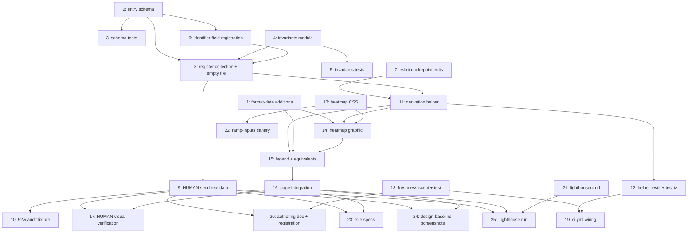

# Tasks Document

> **Version 9 — the loop's hard cap.** Derived from `design.md` v9 (approved 2026-08-10) and
> `requirements.md` v4 (approved 2026-08-09). Adversarially reviewed eight times
> (`reviews/adversarial-analysis-tasks.md`, `-r2.md` … `-r8.md`); every finding from all eight rounds
> has a named disposition in §Revision history.
>
> **Finding curve: 25 → 15 → 11 → 7 → 5 → 4 → 6 → 5**, `DESIGN_READY: yes` from r4 onward, and zero
> MUST_FIX in four of the last five rounds. The curve flattened rather than reaching zero, and from
> r6 onward the findings were overwhelmingly defects introduced by the previous round's own repair
> — which is the useful limit of this loop, and the same signal the design phase recorded at its own
> v9.

Tasks are listed in **topological order** consistent with the DAG below; the linear ordering does not
imply serial execution. Each task carries a `_Depends on:_` footer.

**Intermediate-state policy.** `pnpm build`, `pnpm lint`, `pnpm typecheck` and `pnpm test` are green
at every checkbox.

**`pnpm build` is not the validator — `pnpm velite build` is.** `package.json:8` is `next build`, and
`next.config.ts` only *consumes* `./.velite/index.js` (`:123`). Velite is invoked by `postinstall`
(`package.json:21`), by the `dev` script's `velite dev` (`:7`), by a direct `pnpm velite build`, and
by `vitest.global-setup.ts`, which shells it once per `vitest run` (`src/lib/projects.test.ts:606`
shells a second one mid-suite). Every build-time failure Req 1 rests on — the loader envelope throw,
`.strict()`'s unknown-key rejection, the `BUILD_START_UTC` bound, `checkNoDuplicateDates`,
`checkCoverageContiguity` — fires inside Velite, and `next build` merely consumes whatever `.velite/`
already exists on disk. **Any success criterion about a content failure therefore names
`pnpm velite build`.** The design phase found and fixed this exact fact at its own r3
(`design.md:915`); it is written here so the tasks phase does not lose it a third time.

Two consequences worth stating once rather than in every task: **`pnpm test` also regenerates
`.velite`** through its global setup, so a content failure reddens it too — the four gates are
stronger than they look; and **any task consuming the generated `githubActivity` type (11, 12, 14,
15, 16) needs a Velite run before `pnpm typecheck`** in a working tree with a stale `.velite/`,
because `.velite/index.d.ts` derives every symbol from the registration. The repository states this
rule itself, as a `FOOT-GUN` comment written by whoever was bitten by it —
`e2e/tests/profile-resume.test.ts:74-79`: *"`pnpm test:e2e` re-runs `next build`, but NOT `velite
build`. content/ is compiled by velite into .velite/, so an edit to content/profile.mdx does not
reach the rendered page until you run `pnpm exec velite build` yourself."*

**The tasks that consume a *built page* — 23, 24 and 25 — need more than a Velite run, and they need
different things.** `scripts/run-e2e.mjs:36` does spawn `pnpm build`, so task 23 needs
`pnpm exec velite build` first and then builds for itself; it also fails loudly against stale content,
because its assertions require the section to be present. Task 24 captures a build it makes itself and
its Restrictions already forbid capturing the empty state. **`pnpm lhci` builds nothing and starts no
server** — `scripts/run-lhci.mjs:88` spawns only `pnpm exec lhci autorun`, and with `collect.url` set
and no `serve:lhci` script defined, Lighthouse simply audits whatever is already listening on
`localhost:3013`. Task 25 therefore carries the full four-command procedure in its own body; a
`pnpm velite build` alone would change nothing about what Lighthouse sees.

Task 8 registers the collection with the **explicit empty-list literal `[]`** as
its data file, which is a documented healthy state (Req 1.9, Req 9.7's `[]` branch, Req 11.7) and has
direct precedent: `content/contributions.yaml` and `content/resources.yaml` both shipped as `[]` at
launch. Task 9 replaces it with the real seed. The registration and the data file still land together,
because `content-yaml-loader.ts:36-38` passes any unregistered basename straight through and Velite is
non-strict, so a data file committed ahead of its loader-map entry ships with **no validation at all**
and a green build (design §Commit sequencing item 1).

**The four forced orderings from design §Commit sequencing are absorbed into single tasks**, so no
checkbox can land half of a coupled pair: loader-map entry + data file (task 8), both ESLint edits
(task 7), authoring-doc heading + `CANONICAL_HEADINGS` registration (task 20), and `.prettierignore`
entry + the 52-week fixture (task 10).

## Human-owned tasks, environment-dependent tasks, and what `Complete` means

**The criterion for `[Human-owned]` is "needs an input or a judgement only a person can supply"** —
not "needs a browser", which is an environment question the next section covers. Two tasks meet it:

| Task | Why | What it blocks |
|---|---|---|
| **9 — seed the real data** | needs one live GitHub contributions query, and the decision of which endpoint and window to run | 10, 17, 20, 23, 24, 25 |
| **17 — visual + forced-colors verification** | checks 1 and 2 are irreducibly by-eye: whether adjacent ramp steps are resolvable at 9px is a judgement no assertion can make | nothing (but a failure can invalidate 11, 12, 13, 15, 22, 24) |

**Four more tasks are environment-dependent** rather than human-owned, and use the same stall
protocol when their environment is missing: **10** needs task 9's payload (a dependency the DAG
already encodes, not a capability); **23**, **24** and **25** need a browser — Playwright for the e2e
suite (`pnpm test:e2e` builds the site, starts a server and drives chromium) and the baselines, a
Chrome-capable `pnpm lhci` for the audit. All are scripted or scriptable and an agent with a browser
should run them; `pnpm exec playwright install chromium` and `CHROME_PATH` are the two things to try
before declaring one blocked.

**The stall protocol applies to every task that can fail to run — the seven behind the seed
(9, 10, 17, 20, 23, 24, 25) plus any other task whose environment is missing.** The human/environment
split above says *who* unblocks it; the protocol below is uniform.

**Protocol when a task cannot be run.** Write nothing to the artifact, leave the checkbox `[-]` **and
append `— BLOCKED (Matthew)` to the task title** so a stalled task is distinguishable from an
in-progress one (**strip the suffix when the task resumes** — a completed task must never carry it),
record the blocker **and the exact command or query to run** in the implementation log, and continue
with every task not downstream of it. **Never fabricate.** Task 9's file is published as fact on a
public site; a plausible-looking placeholder is the single failure mode this spec exists to prevent.

**Consequence, stated plainly:** with task 9 pending, **tasks 1–8, 11–16, 18, 19, 21 and 22 —
eighteen of twenty-five — still complete.** All *application* code lands (schema, invariants, helper,
component, page, styles, freshness script, CI wiring), and the site builds and renders correctly with
the section suppressed: Req 11.7's documented state. What waits for the seed is the audit fixture
(10), the visual verification (17), the authoring doc (20, which needs the recorded query), the e2e
specs (23), the baselines (24) and the Lighthouse run (25) — note that 20 and 23 are code, so "all
code lands" would be false. The spec reaches `Complete` only when all twenty-five checkboxes are
`[x]`, which requires Matthew for tasks 9 and 17.

## Scope decisions this document makes

**Six artifacts are touched that no approved inventory names.** The list has been short in four
consecutive rounds, so the **rule** is written down here and the list is derived from it, rather than
the list being asserted:

> An artifact counts when its path appears on a task's `File:` line, or a task's `_Prompt:`
> Restrictions mandate **creating or modifying** it (merely reading a file — as task 22 reads
> `tokens.css` — does not count), **and** it is not covered by a design §Project Structure inventory
> row. A row
> covers its own path, plus sibling tests when it says so — `+ .test.*`, `+ .test.tsx`,
> `+ .test.mjs`, or the prose form `+ tests` — plus every file a glob row matches
> (`design-baseline/after/contributions-*.png`). **A row that names only the source file does not
> cover a sibling test**, which is what puts artifacts 4, 5 and 6 below on this list.
> (`requirements.md`'s in-scope table is a strict subset of the design inventory, so keying on the
> design alone hides nothing.)

Each is authorised by design prose or by a review finding rather than by the inventory table:

1. `package.json` (task 12's `test:tz` script — design §Components mandates the script by name).
2. `src/styles/contrib-heatmap-ramp.test.ts` (task 22 — design §"What is not gated" states as an
   approved fact that *nothing in the repository measures the ramp*, which makes the guard a
   design-identified gap rather than a tasks-phase invention).
3. An appended `## Implementation evidence` section in `design.md` (task 17 — Req 5.6 mandates
   recording the verification there).
4. `src/app/(site)/contributions/page.test.tsx` (task 16 — design §Project Structure inventories the
   page without a `+ .test.tsx`, unlike its sibling rows, because the design assumed the e2e suite
   would carry Req 3.7's ordering; it cannot while the seed is pending, so the page test is the only
   guard on a criterion `requirements.md` twice calls load-bearing).
5. `src/lib/build/content-error-format.test.ts` (task 6 — the inventory row for
   `content-error-format.ts` carries no `+ .test.ts`, but the module's existing behaviour is asserted
   there, so registering a new basename without extending it would leave the locator change
   unguarded).
6. `src/lib/build/github-activity-schema.test.ts` (task 3 — the inventory row for
   `github-activity-schema.ts` reads only `| new |`, unlike its `+ .test.ts` siblings, but design
   §Testing → Unit names the file explicitly and enumerates its seven cases, so it is
   design-mandated and inventory-omitted).

Spec-internal artifacts — the implementation logs written by tasks 9, 10, 17, 20, 23, 24 and 25, and
this spec's own `reviews/` files — are not repository artifacts and are not counted here.

**One artifact was dropped rather than authorised.** v4 had task 20 extend
`scripts/check-authoring-docs.test.mjs`. That work does not exist: the test derives every fixture
from `CANONICAL_HEADINGS` itself (`:53`, `:60-69`), so adding a heading to the constant changes both
sides of every assertion and nothing can go red. The file is removed from task 20 rather than given
an invented assertion.

**Two are deliberately not touched:**

1. **`scripts/verify-task-dependencies.mjs` is not extended to this spec.** Its `SPEC_SLUGS` is
   `["blog-core", "profile-resume"]` (`:36`). The reason is not authorisation — it is that
   registering this spec would make an **unverified DAG look machine-verified**: the verifier checks
   only that every `_Depends on:_` edge resolves to a real task number and that the graph is acyclic.
   It cannot tell whether an edge that *should* exist is missing, which is the failure mode that
   actually matters here. The honest disclaimer is worth more than the false assurance: the footers
   below are a human-readable DAG, and a missing edge will not be caught by anything.
2. **`src/lib/build/check-content-chokepoint.ts` is not extended.** Design §Project Structure records
   this as decided, not overlooked: its closed `ContentSymbol` union at `:78` is invoked from nothing
   but its own test, so `githubActivity`'s chokepoint enforcement is ESLint-only, deliberately.

**One discrepancy inside the approved design, surfaced not papered over.** §Project Structure's
inventory row for `.github/workflows/ci.yml` says *"two steps before `Build`"* (Reqs 9.1, 9.8), while
§Components' v9 `TZ` bullet additionally requires *"CI runs `test:tz` alongside the normal suite."*
Task 19 adds **three** steps; the inventory row is the narrower statement, not a prohibition on the
third.

**One approved-design premise that r1 falsified, recorded for Matthew rather than reversed here.**
Design §Components justifies the `test:tz` split-run mechanism with *"Vitest reads `process.env.TZ`
at worker start, so a single run cannot hold two zones."* That is **false in this repository** —
assigning `process.env.TZ` mid-process switches both `Date`'s local-time behaviour and `Intl`'s
default resolution under Node 24, and `src/lib/format-date-tz.test.ts:4` (the precedent the design
itself cites) is the counterexample. A single-run `beforeAll` form would give both zones inside the
existing `Unit tests` step and delete a `package.json` script, a CI step, **and two full Velite
builds per CI run** — `vitest.global-setup.ts` shells `pnpm velite build` on every `vitest run`, and
`test:tz` is two more runs. **The design's mechanism is implemented as written anyway** — it does produce working two-zone coverage, so this is a
simplification rather than a correctness fix, and re-pinning a mechanism an approved document chose
belongs to that document. Task 12 corrects only the *rationale*, which was not merely redundant but
wrong. Flagged at the phase boundary.



---

- [x] 1. Add the three `format-date.ts` exports the heatmap copy needs
  - File: src/lib/format-date.ts, src/lib/format-date.test.ts
  - Three additions, none of which exists today (the module exports exactly `formatContentDate` and
    `formatMonthYear`): a **range formatter** `formatDateRange(startIso, endIso)` for the published
    range, a **thousands separator** `formatCount(n)` for the four-digit total, and
    **`formatMonthAbbrev(iso)`** for the SVG column labels
  - `formatMonthYear` (`:27`) returns "August 2026", unusable at an 11px column pitch, and slicing a
    localised string is fragile — hence a dedicated export rather than a caller-side slice
  - Names: `formatMonthAbbrev` is fixed by design §Geometry; `formatDateRange` and `formatCount` are
    chosen here, since the design names only their roles
  - **The month-abbreviation test pins the exact expected string for all twelve months.** §Geometry's
    "ink never exceeds 286px" guarantee assumes a three-glyph label; some ICU builds render en-CA
    `month: "short"` with a trailing period ("Aug."), which is four glyphs. Pinning all twelve catches
    that at test time instead of in the rendered SVG
  - Purpose: Req 7.4 forbids ad-hoc formatting in the component and forbids a date library
  - _Leverage: src/lib/format-date.ts (formatContentDate/formatMonthYear shape and en-CA locale), src/lib/format-date.test.ts, src/lib/format-date-tz.test.ts_
  - _Requirements: 7.4_
  - _Depends on: none_
  - _Prompt: Implement the task for spec github-activity, first run spec-workflow-guide to get the workflow guide then implement the task: Role: TypeScript developer maintaining shared formatting utilities | Task: Add formatDateRange, formatCount and formatMonthAbbrev to src/lib/format-date.ts with tests, per Req 7.4 and design §Geometry | Restrictions: NO new dependency — `Intl.NumberFormat`/`Intl.DateTimeFormat` only, no date library (NFR no-new-runtime-dependency); locale stays en-CA to match formatContentDate; pass `timeZone: "UTC"` to every Intl formatter so a date-only ISO string cannot shift a month under a non-UTC runner; formatMonthAbbrev MUST return at most three glyphs — strip a locale-added trailing period rather than letting it through; do NOT modify the existing two exports, whose output is asserted by existing tests | _Leverage: the existing `{ datetime, display }` return shape | _Requirements: 7.4 | Success: all three exports have tests; the month test asserts all twelve abbreviations exactly; `pnpm test` green. Set [-] before starting; log-implementation then [x]_

- [x] 2. Create the per-entry schema module
  - File: src/lib/build/github-activity-schema.ts
  - `githubActivityEntrySchema` — exactly `{ date, count }`, `.strict()`, no other field
  - `count`: integer `>= 0`. `date`: `isoDate()` from `content-schema-primitives.ts:68`, **composed with
    a `BUILD_START_UTC` upper bound** (`:17`) — `isoDate()` validates format and calendar validity and
    nothing else, and the future-date guard is a separate deliberate composition at the call site
    (`resources-schema.ts:23`, `reading-schema.ts:21`)
  - Purpose: `anchorDate = max(date)` originates the whole derivation, so one transposed digit
    (`2126-08-08`) would pass a bare `isoDate()`, shift the window a century, render an empty grid on
    a green build, and permanently silence Req 9's detector
  - _Leverage: src/lib/build/resources-schema.ts (the isoDate + BUILD_START_UTC composition), src/lib/build/contributions-schema.ts, src/lib/build/content-schema-primitives.ts_
  - _Requirements: 1.2, 1.3, 1.4, 1.8_
  - _Depends on: none_
  - _Prompt: Implement the task for spec github-activity, first run spec-workflow-guide to get the workflow guide then implement the task: Role: TypeScript developer building content schemas | Task: Create src/lib/build/github-activity-schema.ts exporting githubActivityEntrySchema per Req 1.3/1.4 | Restrictions: `.strict()` is mandatory — an unknown key must fail, not be silently dropped; build from content-schema-primitives.ts rather than re-deriving date or integer validation (Req 1.4); the BUILD_START_UTC upper bound is NOT optional and is the only guard against a future-dated anchor; note that education-schema.ts is NOT a model here — its future-date guard lives inside `isoMonth()` rather than at the call site, so copy resources-schema.ts/reading-schema.ts instead; the file is named github-activity-schema.ts, never github-contributions-* (NFR-Naming); do NOT add a `contributionLevel` field (Req 1.8) — GitHub's level is computed against the user's personal maximum over the queried period, cannot be reproduced offline, and cannot be asserted in a unit test | _Leverage: resources-schema.ts | _Requirements: 1.2, 1.3, 1.4, 1.8 | Success: module compiles and exports a per-entry schema usable by both the collection and the loader. Set [-] before starting; log-implementation then [x]_

- [x] 3. Write the schema rejection tests
  - File: src/lib/build/github-activity-schema.test.ts
  - The full list design §Testing → Unit commits to: valid entry; negative `count`; non-integer
    `count`; bad date format; impossible date (e.g. `2026-02-30`); future date beyond
    `BUILD_START_UTC`; unknown key under `.strict()`
  - Purpose: the future-date and impossible-date cases are the build-time half of Req 11 states 4 and
    11, and are the only place they are exercised — design §Architecture establishes that CI cannot
    reach them at the freshness script, because Velite runs at `postinstall` (`ci.yml:26-27`, the
    first substantive step)
  - _Leverage: src/lib/build/experience-schema.test.ts, src/lib/build/skills-education-schema.test.ts (schema-test conventions)_
  - _Requirements: 1.3, 11.4_
  - _Depends on: 2_
  - _Prompt: Implement the task for spec github-activity, first run spec-workflow-guide to get the workflow guide then implement the task: Role: Test engineer | Task: Write rejection tests for every case in design §Testing Strategy → Unit for github-activity-schema.test.ts | Restrictions: each listed case gets its own named assertion — do NOT bundle them into one parametrised "invalid input" case; the future-date test must be constructed relative to BUILD_START_UTC rather than hardcoding a year, so it cannot rot into a passing test; assert that the impossible-date and bad-format failures are distinguishable | _Leverage: experience-schema.test.ts | _Requirements: 1.3, 11.4 | Success: seven cases — the valid-entry positive control, plus six rejection cases each of which fails when its corresponding schema rule is removed. Set [-] before starting; log-implementation then [x]_

- [x] 4. Create the cross-entry invariants module
  - File: src/lib/build/check-github-activity-invariants.ts
  - Three exports: `checkNoDuplicateDates(records)`, `checkCoverageContiguity(records)`, and the
    composed **`runGithubActivityInvariants(records)`** that calls both in order and is the single
    entry point `prepare()` invokes
  - Message shapes are pinned by design §Components and are the entire diagnostic surface for the
    coverage contract — reproduce them verbatim:
    - `github-activity.yaml: duplicate date <ISO> (appears N times). Each day must appear exactly once.`
    - `github-activity.yaml: coverage gap — no record for <ISO>. The file must contain every day from <dataStart> to <anchorDate>; see docs/contributions-and-resources-authoring.md.`
  - These throw plain `Error`s and **do not** route through `content-error-format.ts`: that module
    formats per-entry Zod issues reached via `IDENTIFIER_FIELD_BY_BASENAME`, and a cross-entry
    invariant has no offending field, no entry index, and no Zod issue to format (design §Components,
    closing Req 1.10's open question)
  - Purpose: contiguity is what makes coverage decidable from the file alone — "quiet February" and
    "February not seeded" are distinguishable only because the latter is a build error
  - _Leverage: src/lib/build/check-experience-project-links.ts (the established standalone-module-called-from-prepare() precedent, imported at velite.config.ts:20)_
  - _Requirements: 1.10, 11.2, 11.3_
  - _Depends on: none_
  - _Prompt: Implement the task for spec github-activity, first run spec-workflow-guide to get the workflow guide then implement the task: Role: Build engineer implementing cross-collection invariants | Task: Create check-github-activity-invariants.ts with the two checkers plus the composed runGithubActivityInvariants entry point, per design §Components | Restrictions: logic lives in this module, NEVER inline in velite.config.ts's prepare() — unit-testability is the entire point; both functions THROW (velite does not set `strict: true`, so a check that merely logged would exit 0 and ship the bad data); reproduce the two message strings verbatim — they are pinned in the design and name file, date and rule; do NOT route through content-error-format.ts; the composed entry point exists so the call site itself is testable, so keep it a real function rather than a re-export; an empty array and a single record must PASS, since task 8 lands an empty file | _Leverage: check-experience-project-links.ts | _Requirements: 1.10, 11.2, 11.3 | Success: three exports, pure, throwing named errors. Set [-] before starting; log-implementation then [x]_

- [x] 5. Write the invariants tests
  - File: src/lib/build/check-github-activity-invariants.test.ts
  - Duplicates: a repeated date throws naming the date; a clean list passes
  - Contiguity: single interior gap, leading gap, trailing gap, empty array, single record
  - **Plus the wiring test through the composed entry point** — drive `runGithubActivityInvariants`
    with a duplicate-date array and with a gapped array and assert each throws. This is the mechanism
    that closes the "written, unit-tested, never called" hole, because the function under test *is*
    the call site (design §Testing → Integration, which withdrew the two build-driven assertions)
  - _Leverage: src/lib/build/check-experience-project-links.test.ts_
  - _Requirements: 1.10, 11.2, 11.3_
  - _Depends on: 4_
  - _Prompt: Implement the task for spec github-activity, first run spec-workflow-guide to get the workflow guide then implement the task: Role: Test engineer | Task: Write pure-function tests for both checkers and for the composed runGithubActivityInvariants, per design §Testing | Restrictions: the composed-entry-point cases are NOT redundant with the per-checker cases — they are the only evidence that prepare() reaches both checks, and design §Testing names them as the replacement for the withdrawn integration assertions, so do not collapse them; assert message CONTENT (the offending date) not just that something threw; empty array and single record must pass, not throw | _Leverage: check-experience-project-links.test.ts | _Requirements: 1.10, 11.2, 11.3 | Success: every listed case asserted; deleting either checker from runGithubActivityInvariants reddens the suite. Set [-] before starting; log-implementation then [x]_

- [x] 6. Register the identifier field for build-error locators
  - File: src/lib/build/content-error-format.ts, src/lib/build/content-error-format.test.ts
  - Add `"github-activity.yaml": "date"` to `IDENTIFIER_FIELD_BY_BASENAME` (`:304-309`)
  - Purpose: without it the locator falls back to `DEFAULT_IDENTIFIER_FIELD` (`"title"`, `:311`), which
    these entries do not have, so a schema failure would point at a field that cannot exist
  - _Leverage: the existing map entries (contributions→repo, experience→organisation, skills→category, education→credential)_
  - _Requirements: 1.5_
  - _Depends on: 2_
  - _Prompt: Implement the task for spec github-activity, first run spec-workflow-guide to get the workflow guide then implement the task: Role: TypeScript developer maintaining build error formatting | Task: Add the github-activity.yaml → date entry to IDENTIFIER_FIELD_BY_BASENAME | Restrictions: key on FILENAME only, matching the existing map's discipline; change nothing else in this module — its existing output is asserted by content-error-format.test.ts; add a test proving a github-activity issue locates by `date` | _Leverage: the existing map | _Requirements: 1.5 | Success: a malformed entry's error names the offending date rather than an absent title; existing tests stay green. Set [-] before starting; log-implementation then [x]_

- [x] 7. Extend the ESLint chokepoint rule and its allowlist — both edits, one change
  - File: eslint.config.mjs
  - Two edits: add `"githubActivity"` to `importNames` at `:30`, and add `"src/lib/github-activity.ts"`
    to the allowlist `files:` array at `:40-49`
  - **One-way coupling, hence one task**: `importNames` without the allowlist makes the feature's own
    helper violate the new rule, and `pnpm lint` is `ci.yml:29-30` — the first gate (design §Commit
    sequencing item 2)
  - No test file needs an allowlist entry: `no-restricted-imports` fires on `import` declarations,
    while Req 2.10's mandated pattern reaches the collection through `vi.mock("#site/content", …)` — a
    call argument. `contributions.test.ts` uses the same pattern, is absent from the allowlist, and
    lint passes on `main` (Req 1.5, closing the question rather than deferring it)
  - _Leverage: the existing `no-restricted-imports` block and its `src/lib/blog.ts` / `src/lib/contributions.ts` allowlist entries_
  - _Requirements: 1.5, 1.11_
  - _Depends on: none_
  - _Prompt: Implement the task for spec github-activity, first run spec-workflow-guide to get the workflow guide then implement the task: Role: Build engineer maintaining lint policy | Task: Add githubActivity to the no-restricted-imports importNames list and src/lib/github-activity.ts to the allowlist, in one change | Restrictions: BOTH edits or neither — shipping importNames alone makes the helper (task 11) unlintable and reddens the first CI gate; an allowlist entry for a path that does not exist yet is inert, so ordering is safe; do NOT add any test file to the allowlist, and do NOT add src/components/contributions/contribution-heatmap.tsx (it is props-driven and imports nothing from #site/content); leave the existing entries untouched | _Leverage: the existing allowlist | _Requirements: 1.5, 1.11 | Success: `pnpm lint` green now and still green after task 11 lands. Set [-] before starting; log-implementation then [x]_

- [x] 8. Register the collection with an empty-list data file — one change
  - File: content/github-activity.yaml, velite.config.ts
  - **Four `velite.config.ts` edits**, all load-bearing: `defineCollection({ name, pattern: "github-activity.yaml", schema: githubActivityEntrySchema })` beside `contributions` (`:433-443`); the
    `collections:` map entry (`:483-494`); the `makeContentYamlLoader({…})` map entry
    (`:496-503`); and a `prepare()` branch (`:516`) calling **only** `runGithubActivityInvariants`
  - `content/github-activity.yaml` is created as the **explicit empty-list literal `[]`**. Task 9
    replaces it with the real seed. `[]` is not a placeholder pretending to be data: it is the
    documented empty state (Req 1.9, Req 11.7) with the same shape `contributions.yaml` and
    `resources.yaml` shipped at launch, and it unblocks every downstream task's typecheck by making
    the `githubActivity` symbol exist
  - The envelope is the **per-entry** form used at `velite.config.ts:433-443`, **without** a `.min(0)`
    suffix (Req 1.2). The file is **YAML, not JSON**: `makeContentYamlLoader`'s `test` is
    `/\.(ya?ml)$/`, so a `.json` file would bypass the repo's only hard-fail content validator
    entirely (Req 1.6)
  - Purpose and ordering: the loader-map entry must land with or before the data file, because
    `content-yaml-loader.ts:36-38` passes an unregistered basename straight through — *"Not ours —
    benign passthrough"* — and Velite is non-strict, so a file committed first ships unvalidated on a
    green build with nothing warning (design §Commit sequencing item 1)
  - _Leverage: the contributions/resources registration as the exact four-point model; velite.config.ts:20 (checkExperienceProjectLinks import) and the prepare() call sites at :546-550, each reading `(data as {…}).x ?? []`_
  - _Requirements: 1.1, 1.2, 1.5, 1.6, 1.9, 1.10, 1.7, 11.1, 11.7_
  - _Depends on: 2, 4, 6_
  - _Prompt: Implement the task for spec github-activity, first run spec-workflow-guide to get the workflow guide then implement the task: Role: Build engineer wiring the content pipeline | Task: Make all four velite.config.ts registrations and create content/github-activity.yaml as the explicit empty-list literal, in one change | Restrictions: the data file is exactly `[]` — do NOT invent, extrapolate or synthesise any contribution count here or anywhere; task 9 owns the real data and is human-owned for that reason. All four registrations are mandatory — the loader-map entry especially, since its absence fails NOTHING and ships the collection unvalidated. The prepare() branch has the same silent-pass hazard in miniature: the existing call sites read `(data as {...}).x ?? []` (:546-550), so a misspelled or not-yet-registered collection key runs against `[]` and passes vacuously — which is why task 9's three temporary mutations are the checks that actually prove this wiring — and note that only the unknown-key one reaches the loader-map entry, since the two invariant mutations behave identically with and without it. prepare() calls runGithubActivityInvariants ONLY, never the two checkers directly. Do NOT add `.min(0)`. Do NOT use a .json file. Do NOT add any fetch, and do NOT introduce a network call anywhere in the build (Req 1.7). Verify with `pnpm velite build`, NEVER with `pnpm build` — `package.json:8` is `next build`, which consumes whatever `.velite/` already exists and cannot observe a content failure at all | _Leverage: the contributions registration | _Requirements: 1.1, 1.2, 1.5-1.7, 1.9, 1.10, 11.1, 11.7 | Success: `pnpm velite build` green with an empty collection and `.velite/githubActivity.json` written as `[]`; `pnpm build`, `pnpm lint`, `pnpm typecheck` and `pnpm test` all green. The unknown-key rejection is task 3's assertion and is NOT re-checked here — a `{date, count}` entry cannot be hand-added without inventing a count. Set [-] before starting; log-implementation then [x]_

- [x] 9. **[Human-owned]** Seed the real activity data and record the query
  - File: content/github-activity.yaml, .spec-workflow/specs/github-activity/Implementation Logs/ (the recorded query)
  - Replace `[]` with the real hand-seeded data: a flat `{date, count}` list in **ascending `date`
    order**, carrying **every day** from `dataStart` to `anchorDate` including zero-count days — a
    52-week seed per Req 8.2, roughly 364 records
  - Run the query **once, by hand**: authenticated GraphQL
    `user(login: "madmatt112").contributionsCollection` or the unauthenticated public endpoint — both
    acceptable per Req 8.5. Seeding is a human step, not a runtime dependency
  - **Record the exact query text and its `from`/`to` parameters in the implementation log.** This is
    the artifact Req 8.4 needs and task 20 publishes; without it the authoring doc would document a
    reconstructed query that was never run, and the divergence would be invisible until a future
    refresh produced a different span
  - Ascending order is not cosmetic: it makes each refresh a readable diff rather than a whole-file
    replacement
  - **Three temporary mutations, each reverted, are how task 8's four registrations get proved.**
    Deleting a mid-file day proves `checkCoverageContiguity` is reached; duplicating a day proves
    `checkNoDuplicateDates` is; and adding an unknown key **to an existing real entry** proves the
    **loader-map entry** and task 6's identifier registration end to end, because the error must be
    located by `date`. The third is the only one that reaches the loader: with the loader-map entry
    absent, `content-yaml-loader.ts:36-38` passes the file through untouched and `prepare()` still
    receives well-formed objects, so **both invariant mutations behave identically with and without
    it** (design §Testing: *"a missing loader-map entry fails nothing"*). Mutate an existing entry —
    never add a synthesised one — and revert all three before committing
  - _Leverage: content/contributions.yaml (the launch `[]` → real-data transition precedent), Req 8.5's two acceptable endpoints_
  - _Requirements: 8.1, 8.2, 8.4, 8.5, 1.5, 1.10_
  - _Depends on: 8_
  - _Prompt: Implement the task for spec github-activity, first run spec-workflow-guide to get the workflow guide then implement the task: Role: Data steward seeding a published content file by hand | Task: Replace content/github-activity.yaml's empty list with the real 52-week contribution data and record the exact query used | Restrictions: **NEVER fabricate, extrapolate or synthesise counts.** This file is published as fact on a public site. If the query cannot be run in this environment (no network, no credential), write NOTHING to the file, leave this task [-], record the blocker and the exact query in the implementation log, and continue with tasks that are not downstream — see the Human-owned section. Every day from dataStart to anchorDate must be present including zero-count days, or task 4's contiguity check fails the build by design. Ascending date order is required (Req 8.1). Recording the query is a deliverable, not a courtesy — task 20 cannot satisfy Req 8.4 without it. Verify with `pnpm velite build`, NEVER with `pnpm build`: the latter is `next build`, which reads whatever `.velite/` is already on disk and would report green against data it never validated | _Leverage: Req 8.5's endpoints | _Requirements: 8.1, 8.2, 8.4, 8.5, 1.10, 1.5 | Success: `pnpm velite build` green with real data; three temporary mutations of EXISTING entries each make it fail — a deleted mid-file day named by date (contiguity), a duplicated day named by date (duplicates), and an unknown key on a real entry reported with the offending DATE as its locator (the loader-map entry plus task 6's identifier registration, the only one of the four registrations the other two cannot see) — and all three are reverted; the implementation log carries the copy-pasteable query with its from/to. Set [-] before starting; log-implementation then [x]_

- [x] 10. Commit the 52-week audit fixture and its Prettier exemption — one change
  - File: scripts/\_\_fixtures\_\_/github-activity/seed-52w.json, .prettierignore
  - The **raw, unmodified 52-week API payload** from task 9's query, JSON, byte-identical to what the
    API returned. It is an audit artifact — **not** a test input; Req 2.10's tests use an inline
    factory. It is not human-owned in its own right: it needs task 9's payload, which the DAG already
    encodes, so if task 9 stalled so does this
  - **What it makes checkable, and what it does not.** Req 8.2 asks the 52-week payload to make *"this
    document's five-empty-months claim"* checkable — the run of consecutive empty months
    `requirements.md` measured as 2025-08 → 2025-12 on a **2026-08-08** anchor. **Those month labels
    are not a fixed property of the payload**: 52 weeks is 364 trailing days, so an anchor of
    2026-08-08 already starts on 2025-08-10 (clipping 2025-08), and each further month of delay drops
    another month out of range entirely. **The check, stated as a function of the payload and with a
    terminal state:** every complete calendar month from the payload's **first complete month**
    through **2025-12** must be zero-contribution; record the count and the labels. At a 2026-08
    anchor that is four (2025-09 … 2025-12); a partial leading month is expected and not counted.
    **If the payload's first complete month is 2026-01 or later, Req 8.2's claim is no longer
    checkable from this payload** — record that explicitly, and do not write a null result as if the
    claim had been verified. **In that branch the checkbox still completes**: the fixture itself is
    what Req 8.3 asks for, all of this task's other deliverables are done, and Req 8.2's claim being
    unverifiable from a payload seeded that much later is a recorded finding, not an unfinished task
  - The 26-week density figures (1,820 across 114 of 182 days) are **not** checkable at all:
    `requirements.md` states they *"describe the current data … are **not** acceptance thresholds"*,
    they were measured 2026-08-08, and the trailing window moves a day per day. Record the measured
    figures beside the originals; do not assert them
  - Add `/scripts/__fixtures__/github-activity/` to `.prettierignore`, **with or before** the payload,
    or `pnpm format:check` reddens at `ci.yml:38-39` on a file whose entire value is that it is
    unreformatted (design §Commit sequencing item 4)
  - Design §Deferred answers all four of Req 8.3's questions and they are settled, not open: path as
    above (per-script fixture-directory convention, `scripts/__fixtures__/` holds seven such
    directories); format raw JSON; **type-checked: no** — because it is JSON, not because of its
    location (`tsconfig.json`'s `include` is `**/*.ts` repo-wide); **lint-visible: no** — ESLint is
    configured for TS/TSX sources, so no ignore entry is needed
  - _Leverage: .prettierignore's existing chokepoint-canary block (same treatment, same reason: a pinned byte-exact artifact)_
  - _Requirements: 8.3, 8.2_
  - _Depends on: 9_
  - _Prompt: Implement the task for spec github-activity, first run spec-workflow-guide to get the workflow guide then implement the task: Role: Engineer committing a review artifact | Task: Add the raw 52-week payload at scripts/__fixtures__/github-activity/seed-52w.json and the matching .prettierignore entry, in one change | Restrictions: BYTE-IDENTICAL to the API response — do not pretty-print, re-key, sort or strip it; record the payload's sha256 in the implementation log so byte-identity is checkable later rather than asserted; the .prettierignore entry lands with or before the file or format:check reddens; do NOT add an ESLint ignore (nothing lints JSON here) and do NOT reference this fixture from any test — it is evidence, not an input; same no-fabrication rule as task 9, and if task 9 stalled then so does this; do NOT assert the 26-week density figures — requirements.md explicitly denies they are thresholds and the window moves daily, so an assertion would be false by construction within days; do NOT assert the literal months "2025-08 through 2025-12" either — 52 weeks is 364 trailing days, so the payload's coverage shifts with the seeding date and those labels decay the same way; a count of zero is NOT a verification — if the payload's first complete month is 2026-01 or later, record explicitly that Req 8.2's claim is no longer checkable from it, then close the box: the fixture is the deliverable and unverifiability is a finding, not an unfinished task | _Leverage: the chokepoint-canary .prettierignore precedent | _Requirements: 8.3, 8.2 | Success: `pnpm format:check` green; sha256 recorded; **every complete calendar month from the payload's first complete month through 2025-12 is zero-contribution**, with the count and labels recorded (four at a 2026-08 anchor) — or, if the payload no longer reaches 2025, an explicit record that Req 8.2's claim is not checkable from it; the measured 26-week figures recorded beside the Introduction's 2026-08-08 figures, with any divergence noted rather than treated as a failure. Set [-] before starting; log-implementation then [x]_

- [x] 11. Implement the derivation helper
  - File: src/lib/github-activity.ts
  - `getActivityWindow(): ActivityWindow | null` plus the exported primitives `deriveWindow`,
    `bucketLevels`, `toGrid`, `toMonthlyTotals` (Req 2.9). Shape per requirements §Shared Definitions
    and design §Data Models
  - Window: `windowEnd` = Saturday on-or-after `anchorDate`; `windowStart` = `windowEnd − 181`;
    `publishedRangeStart` = `max(windowStart, dataStart)`; `publishedRangeEnd` = `anchorDate`.
    `windowStart`/`windowEnd` are **internal geometry, never published**
  - `hasData` is false when `date < dataStart` or `date > anchorDate`; such cells are excluded from
    `totalContributions`, `activeDays`, `monthlyTotals`, `levelsPresent`, and the bucketing multiset
    `S` (Req 2.4), and render as **no element at all** (Req 3.5)
  - Bucketing: inclusive (R type-7) quartiles of the non-zero `hasData` counts, unrounded, bands
    upper-inclusive; `n === 0`, `n < 4`, and `p25 === p75` each collapse to the documented degenerate
    path with `thresholds: null`; an **empty band is legal, not an error**
  - **Clock-free (Req 2.7)**: no `new Date()` with no arguments, no `Date.now()`, no other wall-clock
    source. **All date arithmetic through `Date.UTC(...)` on split parts and the `getUTC*` accessors**
    — never `new Date(y, m, d)` and never `.getDate()`/`.getMonth()` on a parsed value, which are
    local-time and would misalign columns under a future refactor (design §Components)
  - **This module is the only reader of the collection**: it imports from `#site/content`, and
    `JSON.parse` of `.velite/githubActivity.json` is prohibited anywhere (Req 1.11)
  - _Leverage: src/lib/contributions.ts (collection-reading helper shape), requirements §Shared Definitions, design §Data Models_
  - _Requirements: 2.1, 2.2, 2.3, 2.4, 2.5, 2.6, 2.7, 2.8, 2.9, 1.7, 1.8, 1.11_
  - _Depends on: 7, 8_
  - _Prompt: Implement the task for spec github-activity, first run spec-workflow-guide to get the workflow guide then implement the task: Role: TypeScript developer writing pure derivation logic | Task: Implement src/lib/github-activity.ts per Req 2 and design §Data Models, exporting getActivityWindow plus the four primitives | Restrictions: ZERO wall-clock reads — `new Date()` with no arguments and `Date.now()` are both forbidden, and any function needing "today" takes it as a parameter (Req 2.7); every date computation goes through Date.UTC on split parts and getUTC* accessors — a single `new Date(y, m, d)` or `.getDate()` silently misaligns columns for half the world's timezones and is exactly what task 12's two-zone suite exists to catch; NEVER read or store contributionLevel (Req 1.8); never publish windowStart or windowEnd — publishedRangeStart/End are the only visitor-facing period; do NOT fetch anything and do NOT JSON.parse .velite/ (Reqs 1.7, 1.11); thresholds are NOT rounded; an empty band is legal; getActivityWindow returns null on the empty collection, which is the state task 8 leaves until task 9 runs; the `githubActivity` export only appears in `.velite/index.d.ts` after a Velite run, so run `pnpm velite build` before `pnpm typecheck` rather than concluding the registration is broken | _Leverage: contributions.ts | _Requirements: 2.1-2.9, 1.7, 1.8, 1.11 | Success: `pnpm velite build` then `pnpm typecheck` green; module exports the five symbols, returns null against the empty collection, and `pnpm lint` passes (proving task 7's allowlist entry is correct). Set [-] before starting; log-implementation then [x]_

- [x] 12. Write the derivation tests, including the two-timezone regression suite
  - File: src/lib/github-activity.test.ts, package.json
  - Pattern per Req 2.10: `vi.hoisted` holder + `vi.mock("#site/content", …)`, module imported after
    the mock, fixtures from a small inline factory
  - The list design §Testing → Unit commits to: **one case per anchor weekday (all seven)** for the
    last `hasData` cell and for `publishedRangeEnd ≤ anchorDate`; partial coverage
    (`dataStart > windowStart` → leading cells `hasData: false`, excluded from every published figure,
    `publishedRangeStart === dataStart`); the **empty-band case** `S = [1,1,1,1,2,3,4,10]` → p25 1.0 /
    p50 1.5 / p75 3.25, so `1 < c ≤ 1.5` holds no integer, `levelsPresent` is `{0,1,3,4}` and the
    legend omits level 2; bucket boundaries at exactly p25/p50/p75; all four degenerate paths;
    `monthlyTotals` with a clipped first month, clipped last, whole middle, and a **non-clipped first
    month** (`2026-02-01` and `2026-03-01` are Sundays); empty collection → `null`; single record;
    all-zero; out-of-window exclusion; a 52-week file with a 26-week window; grid always 26 × 7
  - **Two-zone block**, per design §Components. A `describe.each(["America/Edmonton", "Europe/Berlin"])`
    block whose setup asserts `process.env.TZ === zone` and **skips with a named, greppable message**
    when the runner is not configured for it, plus a `test:tz` script in `package.json` invoking
    vitest twice against this one file with `TZ` set. The zones are complementary, not redundant:
    Berlin (UTC+2) catches `new Date(2026,7,8)` drifting a day; Edmonton (UTC−6) catches
    `new Date("2026-08-08").getDate()` returning 7
  - **Scope the `describe.each` block to the TZ-sensitive cases only.** Wrapping the whole file would
    make every derivation test skip under a plain `pnpm test`, which is the opposite of coverage
  - **What the guard does and does not buy, stated because the design's rationale for it is wrong.**
    The assert stops a zone block from *silently passing while running under the wrong zone*. It does
    **not** stop coverage evaporating under a plain `pnpm test` — a skip is silent, and both blocks do
    skip there. The only thing that guarantees both zones actually run is task 19's `test:tz` CI step,
    which is why that step's comment records that deleting it removes all zone coverage
  - Carry the design's mandated code comment: the zones are complementary, and dropping **either**
    silently stops catching one of the two regressions (design §Required code comments)
  - _Leverage: src/lib/contributions.test.ts (vi.hoisted + vi.mock pattern), src/lib/format-date-tz.test.ts (TZ pinning precedent)_
  - _Requirements: 2.10, 2.7, 2.8, 11.5, 11.6, 11.7, 11.8, 11.9, 11.11, 11.12_
  - _Depends on: 11_
  - _Prompt: Implement the task for spec github-activity, first run spec-workflow-guide to get the workflow guide then implement the task: Role: Test engineer | Task: Write src/lib/github-activity.test.ts covering every case in Req 2.10 and design §Testing, plus the two-zone describe.each block and the package.json test:tz script | Restrictions: the describe.each block wraps ONLY the timezone-sensitive assertions — if a plain `pnpm test` skips the derivation tests the suite is worse than before; the skip message must be greppable and name the zone, since a skipped block is otherwise invisible; do NOT write a comment claiming the skip guard prevents coverage evaporation — it does not, the CI test:tz step does, and the design's sentence to that effect is wrong; test:tz runs vitest twice against this one file with TZ set (not the whole suite twice); write the two-zone rationale as a code comment naming which zone catches which regression — a comment saying only "TZ pinned for determinism" invites deleting one zone; use the inline factory, NOT scripts/__fixtures__/github-activity/seed-52w.json, which is an audit artifact | _Leverage: contributions.test.ts, format-date-tz.test.ts | _Requirements: 2.10, 2.7, 2.8, 11.5, 11.6, 11.7-11.9, 11.11, 11.12 | Success: every enumerated case asserted; `pnpm test` and `pnpm test:tz` both green; deleting either zone from the script leaves a regression uncaught. Set [-] before starting; log-implementation then [x]_

- [x] 13. Add the `.contrib-heatmap__*` CSS section
  - File: src/styles/contributions.css
  - A `/* Contribution heatmap */` section, `.contrib-heatmap__*` naming, **every theme colour as a
    `var(--…)`** (the `forced-colors` block below uses the `CanvasText` system keyword by mandate,
    which is the one deliberate exception)
  - **The ramp**: `fill: var(--brand)` plus a separate per-level `fill-opacity` at
    `[0.28, 0.48, 0.66, 0.82, 1.0]` for levels 0–4, over `--background`. **Never a baked alpha** — no
    `color-mix(…)`, no `oklch(… / 25%)` — because `fill-opacity` is not a forced property and a baked
    alpha is (Req 5.6)
  - **The per-level selector is a three-way contract and is pinned here.** Grid marks carry
    `class="contrib-heatmap__cell"` and `data-level="0".."4"`; legend swatches carry
    `class="contrib-heatmap__swatch"` and the same `data-level`. Each of the five `fill-opacity`
    rules is written **once**, against a selector list covering both — e.g.
    `.contrib-heatmap__cell[data-level="3"], .contrib-heatmap__swatch[data-level="3"]` — which is
    what makes design §Components' guarantee true. The legend `<svg>` itself carries
    `.contrib-heatmap__legend`, matching `.contrib-heatmap__scroll` on the grid side, so each half has
    a container handle its tests can scope to that *"legend and grid cannot disagree about what a
    level looks like"*. The forced-colors outline targets the zero state the same way, written out in
    full: `.contrib-heatmap__cell[data-level="0"], .contrib-heatmap__swatch[data-level="0"]` — never a
    bare `[data-level="0"]`, which would breach Req 4.10 and reach any future `data-level` anywhere on
    the page. This satisfies Req 4.10 (every selector is `.contrib-heatmap__*`-prefixed).
    Tasks 14 and 15 emit the markup; **if you rename anything here, rename it there**
  - Why it is pinned rather than left to implementation: nothing can catch a mismatch. jsdom does not
    apply this stylesheet, so the component tests cannot read computed opacity; task 22 reads the CSS
    file, not the DOM; task 23's e2e assertions never look at a fill; and the first thing that would
    notice 182 identical full-opacity marks is task 17's by-eye check, which is human-owned and
    blocked behind the seed
  - **`--chart-1` … `--chart-5` are not used** (Req 4.4) and **GitHub green is not used** (Req 4.5)
  - **Scroll wrapper**: `.contrib-heatmap__scroll { overflow-x: auto }` as a pure CSS net with **no
    `tabindex` and no accessible name** — at the pinned pitch nothing scrolls, so a focusable inert
    region would be a keyboard cost with no benefit (Req 3.6). **Task 14 emits the element**; the
    class name is shared and must match
  - `@media (forced-colors: active)`: pin `fill: CanvasText`, retain per-level `fill-opacity`, and add
    `outline: 1px solid CanvasText` on the **zero** state. Three resolved states: no-data absent, zero
    outlined, non-zero filled (Req 5.6). This ships unconditionally
  - `@media print`: hide the `<svg>` **and the legend**, keep the `<h2>`, summary, freshness line and
    the `<details>` table, and force `<details>` open. `print.css` reaches this route via
    `globals.css:41`; `:53-58` sets surfaces white and `:61-66` re-bases `--brand` (Req 4.12)
  - **The force-open mechanism is `::details-content`, not `display`.** Req 4.12 names
    `details { display: block }` *"/ `[open]` equivalent"*, and the `display` half is a **no-op**: a
    closed `<details>`'s content is hidden through the `::details-content` pseudo-element, which
    `display` on the host or on its children cannot reach. The whole rule is one line — the `[open]`
    equivalent the criterion licenses:

    ```css
    @media print {
      .contrib-heatmap__details::details-content { content-visibility: visible; }
    }
    ```

    **Measured, not assumed:** under Playwright this reveals the closed disclosure's content in
    **Chromium 147, WebKit 26.4 and Firefox 148** alike, and `lightningcss` (via
    `@tailwindcss/postcss` v4) passes the rule through unchanged. No `display` fallback is
    written — it reveals nothing in any of the three engines and demotes the `<table>` to a block
    box, which shrink-wraps a `width: 100%` table in print. No `!important` either: an author
    declaration already beats the UA `details::details-content { content-visibility: hidden }`, and
    the rule was measured to work without it. **Two caveats, both recorded rather than engineered
    around:** Playwright's WebKit is not Safari, so Safari itself is untested; and because no
    fallback is written, an engine that does not implement `::details-content` prints the monthly
    table collapsed. Both are acceptable — the summary, the published range and the freshness line
    still print, which is what NFR-Usability requires of the text channel. **Task 23's print
    assertion is the only gate that can see any of this** — nothing else in the spec reads the
    `@media print` block
  - No animation, no transition, no hover motion — `prefers-reduced-motion` is satisfied by
    construction (Req 5.8)
  - **Two of the three mandated code comments live here** (design §Required code comments): why
    `.contrib-heatmap__scroll` carries no `tabindex`, and why level 0's alpha must stay at 0.27 or
    above (Req 4.3's ≥1.5:1 floor makes empty cells visible on purpose; 0.26 measures 1.4966 and
    fails). Each records a decision that reads as a bug to a future contributor and whose "fix"
    breaches a requirement
  - _Leverage: src/styles/contributions.css (existing section structure and token discipline), src/styles/print.css:53-66_
  - _Requirements: 4.2, 4.3, 4.4, 4.5, 4.8, 4.9, 4.10, 4.12, 5.6, 5.8, 3.6_
  - _Depends on: none_
  - _Prompt: Implement the task for spec github-activity, first run spec-workflow-guide to get the workflow guide then implement the task: Role: CSS developer working inside a governed design system | Task: Add the /* Contribution heatmap */ section to src/styles/contributions.css per design §Design System and §Accessibility | Restrictions: fill + separate fill-opacity ONLY — a baked alpha (color-mix, oklch slash-alpha) silently breaks the forced-colors contract, which is the whole reason Req 5.6 names the two property classes; the five alphas are measured values from design §Design System, not adjustable taste — changing one moves a documented contrast figure; do NOT wrap the marks in a card surface (design v4 reversed that: it breaks the 288px geometry and costs dark-mode contrast); do NOT add tabindex to the scroll wrapper; do NOT use --chart-* or any GitHub green; do NOT rely on `details { display: block }` to force the print disclosure open — it is a no-op, since closed content is hidden through `::details-content`, and Req 4.12's "/ `[open]` equivalent" licenses the pseudo-element form; do NOT add a `display`-based fallback beside it (it reveals nothing in Chromium, WebKit or Firefox and shrink-wraps the printed table) and do NOT add `!important` (an author declaration already beats the UA rule); FOUR class-name contracts bind this task to tasks 14 and 15 and must be reproduced exactly — `.contrib-heatmap__scroll` for the grid wrapper, `.contrib-heatmap__legend` for the legend `<svg>`, `.contrib-heatmap__details` for the disclosure the print rule force-opens, and `.contrib-heatmap__cell[data-level="N"]` / `.contrib-heatmap__swatch[data-level="N"]` for the five opacity steps; write each opacity rule ONCE against a selector list covering both cell and swatch, so the legend physically cannot diverge from the grid; both mandated comments are required and must record WHY, not what | _Leverage: the existing contributions.css sections | _Requirements: 4.2-4.5, 4.8-4.10, 4.12, 5.6, 5.8, 3.6 | Success: section compiles, every theme colour is a var(), forced-colors and print blocks present, both comments written. Set [-] before starting; log-implementation then [x]_

- [x] 14. Build the heatmap graphic — shell, SVG grid, month labels
  - File: src/components/contributions/contribution-heatmap.tsx, src/components/contributions/contribution-heatmap.test.tsx
  - `ContributionHeatmap({ window }: { window: ActivityWindow })` — **props-driven, never called with
    `null`**, performs no lookups (Req 3.1). A server component: no `"use client"`, no hooks, no
    client JavaScript (Req 3.2). **Inline SVG only** — never ``, `<iframe>`, `<canvas>`, or a
    background image (Req 3.3)
  - DOM order for this half (Req 3.4): `<section aria-labelledby>` carrying
    `data-pagefind-ignore="all"` (Req 6.3) → `<h2>` → summary + freshness line → the
    `rel="noopener"` **same-tab** link to `https://github.com/madmatt112` (Req 7.2) →
    **`<div class="contrib-heatmap__scroll">`** → `<svg>` with month labels. Task 15 appends the
    legend and the `<details>` table after the wrapper
  - **The scroll wrapper is a `SHALL`** (Req 3.6): the `<svg>` is wrapped in an `overflow-x: auto`
    container with **no `tabindex` and no accessible name**. CSS cannot create an element — task 13
    writes the rule, this task emits the element, and they share the class name
  - **SVG geometry** (design §Geometry, all pinned): `width="288" height="100"
    viewBox="-1 -1 288 100"`, one-to-one units, no scaling. 26 columns × 7 rows, pitch 11px = 9px mark
    + 2px gap, marks `rx="2"`, content 286 × 98 (17px month band + 4px gap + 77px grid). The 1px
    viewBox margin exists so the forced-colors outline cannot clip at the left edge
  - **Month labels**: `formatMonthAbbrev`, sans stack at `text-xs` (12px), `letter-spacing: normal`,
    explicit `y` baseline at 13px within the band (`dominant-baseline` is not relied on),
    `text-anchor="start"` at the left edge of the column holding that month's first covered day —
    except the **final** label, which is `text-anchor="end"` at the grid's right edge when a
    start-anchored label would exceed 286px. When two labels would overlap, the later one is dropped
  - **Each grid `<rect>` carries `class="contrib-heatmap__cell"` and `data-level={cell.level}`** — the
    selector contract task 13 pins. (Legend swatches are task 15's and carry
    `contrib-heatmap__swatch`.) Nothing else binds a cell's level to its opacity, and no gate in this
    spec can observe a mismatch
  - **Cells without `hasData` render as no element at all** — no rect, no border, no fill, never as
    level 0 (Req 3.5)
  - **Strokes**: none in the normal rendering. The forced-colors outline (task 13) is the only
    exception, and this is the single place that rule is stated
  - **The visible summary states the published range *and the headline figures*** —
    `totalContributions` and `activeDays` (Req 7.1). This is not deferred copy: Req 5.3 forbids the
    `<details>` table from restating them and Req 4.12 hides the `<svg>` and legend in print, so if
    the summary omits them the printed page carries a heading, a date range, a freshness line and a
    month table with **no totals at all** — breaching NFR-Usability's *"readable as text without
    interpreting the graphic — including in print"*. The wording is deferred; their presence is not
  - **Copy** (deferred to implementation by design): the phrasing of the summary and the freshness
    line
  - Test: the wrapper renders and carries no `tabindex`; SVG dimensions and viewBox are exactly the
    pinned values; **every `.contrib-heatmap__cell` carries a `data-level` matching its cell's level,
    and every `<rect>` *inside the grid `<svg>`* carries the class** — scope the query to the grid
    `<svg>`, not to the whole container, because task 15 adds legend `<rect>`s carrying
    `contrib-heatmap__swatch` to this same component and this same test file, and a container-wide
    `querySelectorAll("rect")` assertion would go red at task 15's checkbox on a test task 15 does not
    own; month-label anchoring at both edges; `hasData: false` cells emit no element; the visible
    summary states the published range **and both headline figures**
  - _Leverage: src/components/contributions/contribution-card.tsx (props-driven convention), src/components/contributions/contribution-card.test.tsx, src/lib/format-date.ts (task 1), src/lib/build/rehype-copy-button.ts (data-pagefind-ignore precedent)_
  - _Requirements: 3.1, 3.2, 3.3, 3.4, 3.5, 3.6, 3.10, 4.9, 6.3, 7.1, 7.2, 7.3, 7.4_
  - _Depends on: 1, 11, 13_
  - _Prompt: Implement the task for spec github-activity, first run spec-workflow-guide to get the workflow guide then implement the task: Role: React server-component developer building an accessible data graphic | Task: Build the ContributionHeatmap shell, scroll wrapper, SVG grid and month labels with tests, per Req 3, Req 7 and design §Components/§Geometry | Restrictions: props-driven — the component performs NO lookup and is never rendered with null, because the page owns both gates (Req 3.1); no "use client", no hooks, no client JS; the div.contrib-heatmap__scroll wrapper is mandatory (Req 3.6) and carries no tabindex and no accessible name — omitting it ships task 13's CSS dead AND leaves a mandated comment asserting an element that is not in the DOM, and no gate would catch it because 286px genuinely fits 288px; the SVG width/height/viewBox are pinned values, not suggestions — deriving them at render time reopens the three defensible readings design v9 closed; cells without hasData render as NOTHING — not a level-0 mark, not an empty rect; EVERY date and number goes through src/lib/format-date.ts (Req 7.4) — no inline toLocaleString, no inline Intl constructor; NEVER put windowStart or windowEnd in any visitor-facing string (Reqs 2.2, 7.2) — the published range is the only period any copy may state; NO copy may say "26 weeks"; the summary MUST carry totalContributions and activeDays (Req 7.1) — the table is forbidden from restating them and print hides the graphic, so omitting them here loses the totals from every text channel; every GRID rect carries `class="contrib-heatmap__cell"` and `data-level`, the selector contract task 13 pins — no gate in this spec can see a mismatch, so getting it wrong ships 182 identical marks; scope the test query to the grid `<svg>` rather than the whole container, or task 15's legend rects will redden it | _Leverage: contribution-card.tsx | _Requirements: 3.1-3.6, 3.10, 4.9, 6.3, 7.1-7.4 | Success: component renders valid inline SVG at the pinned geometry inside the scroll wrapper; tests cover the wrapper, the per-level markers, absent cells, label anchoring at both edges, and a summary carrying the published range plus both headline figures. Set [-] before starting; log-implementation then [x]_

- [x] 15. Add the legend, the `aria-label` and the text equivalent
  - File: src/components/contributions/contribution-heatmap.tsx (continue from task 14), src/components/contributions/contribution-heatmap.test.tsx
  - **Legend**: its own inline `<svg>` of `<rect>`s at the same 9px size and `rx="2"` as the grid
    marks, ascending, flanked by "Less" and "More" at `text-xs`. **Not HTML swatches** — five
    `<span>`s with `background-color` collapse to invisible boxes under `forced-colors: active`,
    because `background-color` is forced while `fill-opacity` is not. It renders **only the levels in
    `levelsPresent`**, and when that is a strict subset it carries the period-relative disclosure
    (Req 4.6, Req 11.12)
  - **The legend `<svg>` carries `class="contrib-heatmap__legend"`, and each swatch carries
    `class="contrib-heatmap__swatch"` and `data-level`** — the same selector contract task 13 pins for
    the grid, written as one shared rule per level. That shared rule is the mechanism behind design
    §Components' guarantee that legend and grid cannot disagree about what a level looks like. The
    `__legend` handle exists so the swatch test has a **scope root independent of the class it
    asserts** — without it, `querySelectorAll(".contrib-heatmap__swatch")` would be selecting on the
    very attribute it checks, which is a vacuous assertion (task 14's half is non-vacuous because
    `.contrib-heatmap__scroll svg` is its independent root)
  - **The `<details>` carries `class="contrib-heatmap__details"`** — the fourth pinned class, and the
    handle task 13's `@media print` force-open rule targets. Without it the print rule selects nothing
    and the monthly table prints collapsed. **This one is assertable and must be asserted** (see the
    test list): the *printed outcome* is invisible to jsdom, but the class on the element is not, and
    every other pinned class must have a test that fails when it goes missing. **The `<details>`
    ships CLOSED** — no `open` attribute — which is what makes task 23's "reload, then emulate print"
    remedy work and what the force-open rule exists for
  - **Everything this task adds sits inside task 14's `<section>`**, which carries
    `data-pagefind-ignore="all"`. Req 6.3 requires the Req 5.3 text equivalent to be inside the
    ignored wrapper — a `<details>` placed after `</section>` would put the monthly table into site
    search and drop it out of the `aria-labelledby` framing
  - **`role="img"` plus one `aria-label`** on the `<svg>`, derived from `ActivityWindow`, naming the
    published range, `totalContributions` and `activeDays` — the canonical announcement of the
    headline figures (Reqs 5.1, 5.2)
  - **Cells are not focusable and not separate accessibility-tree nodes; no per-cell `<title>`
    element** — `role="img"` makes the element a leaf, so 182 titles would be announced to nobody
    (Reqs 5.4, 5.5)
  - **Text equivalent**: a `<details>` disclosure containing the `monthlyTotals` table — month label,
    contribution total, active-day count — with the covered range shown on `isClipped` rows. It
    **does not restate the headline figures**, which the summary and the `aria-label` already carry
    (Req 5.3). Values derive from `ActivityWindow.monthlyTotals` in one traversal
  - The `<h2>` continues the page's `<h1>` → `<h2>` chain and the `<section>` carries
    `aria-labelledby` (Req 5.7)
  - **Copy** (deferred to implementation by design): the period-relative disclosure and the
    clipped-row labels
  - Test: the legend renders exactly `levelsPresent` and adds the disclosure on a strict subset;
    **every `<rect>` inside `.contrib-heatmap__legend` carries `contrib-heatmap__swatch` and its
    `data-level`** — scope the query to the legend `<svg>`, not to the swatch class, or the assertion
    selects on the thing it is checking; the swatches are covered here, not by task 14's assertion,
    which is scoped to the grid `<svg>`; **the legend `<svg>` itself carries
    `contrib-heatmap__legend`** — assert that too, or the scope root can vanish and take the swatch
    assertion's non-vacuity with it; **the `<details>` carries `contrib-heatmap__details` and ships
    without `open`** — assert both, since the class is the sole handle task 13's print rule selects
    on and the closed initial state is what task 23's print check depends on; the `aria-label`
    matches the visible published range and neither extends past `anchorDate`; the `<details>` sits
    inside the `data-pagefind-ignore` section; the table omits `totalContributions` and `activeDays`;
    clipped rows carry their range
  - _Leverage: task 14's component file, src/lib/format-date.ts (task 1), requirements §Shared Definitions (monthlyTotals shape)_
  - _Requirements: 4.6, 4.12, 5.1, 5.2, 5.3, 5.4, 5.5, 5.7, 6.3, 7.4, 11.12_
  - _Depends on: 1, 11, 14_
  - _Prompt: Implement the task for spec github-activity, first run spec-workflow-guide to get the workflow guide then implement the task: Role: React server-component developer building the accessible equivalents of a data graphic | Task: Add the legend, role=img + aria-label, and the details table to ContributionHeatmap, with tests, per Req 4.6, Req 5 and design §Components/§Accessibility | Restrictions: the legend is an inline SVG of rects, NOT HTML spans with background-color, which vanish under forced-colors; render ONLY the levels in levelsPresent — a five-swatch legend on a three-level grid is the exact untruth Req 4.6 forbids; no per-cell `<title>` element and no focusable cells; the table must NOT repeat totalContributions or activeDays, which the summary and aria-label already carry — Req 5.5 rejects per-cell titles partly on announcement cost and the same scrutiny applies here; the aria-label is DERIVED from ActivityWindow, never hand-written prose; NEVER put windowStart or windowEnd in the aria-label or any string (Reqs 2.2, 5.2, 7.2) — this is the single most-relitigated decision in the spec and a contributor "fixing" the range to say the full 26-week window is the exact regression it exists to prevent; all formatting through src/lib/format-date.ts (Req 7.4); the legend swatches carry `class="contrib-heatmap__swatch"` and `data-level`, styled by the SAME per-level rules as the grid cells (task 13's contract) — a separate rule set is how the legend silently stops matching the grid; the swatch rects are covered by THIS task's assertion — task 14's is scoped to the grid `<svg>`, so do not widen it and do not weaken it; scope the swatch assertion to `.contrib-heatmap__legend`, never to `.contrib-heatmap__swatch` itself, or it asserts the class by selecting on it; the `<details>` carries `contrib-heatmap__details`, ships CLOSED (no `open` attribute), and the test MUST assert both — task 13's print force-open rule targets that class and selects nothing without it, and a disclosure that ships open makes task 23's print gate vacuous; assert `contrib-heatmap__legend` on the legend `<svg>` as well, so every one of the four pinned classes has a test that fails when it goes missing; everything you add goes INSIDE task 14's `<section>`, since Req 6.3 requires the text equivalent to sit within the data-pagefind-ignore wrapper | _Leverage: task 14's component | _Requirements: 4.6, 4.12, 5.1-5.5, 5.7, 6.3, 7.4, 11.12 | Success: tests cover the legend subset and its disclosure, the swatches' level markers, the legend and details class handles, the closed initial state, the aria-label/copy agreement, the `<details>` sitting inside the ignored section, and the table's omission of the headline figures. Set [-] before starting; log-implementation then [x]_

- [x] 16. Integrate the heatmap into `/contributions`
  - File: src/app/(site)/contributions/page.tsx, src/app/(site)/contributions/page.test.tsx
  - The page performs **both lookups and owns both gates**: it calls `getActivityWindow()` and
    `getAllContributions()`, and renders `<ContributionHeatmap>` **after** the contributions card grid
    (Req 3.7)
  - Two suppression gates, both on the page: `getActivityWindow()` returns `null` → the section is not
    rendered at all, no heading, no frame, no placeholder (Req 3.8); the contributions collection is
    empty → the section is suppressed, because `page.tsx:29-33` renders "No contributions yet" on that
    branch and a heatmap announcing 1,820 contributions directly beneath it would contradict it
    (Reqs 3.9, 11.10)
  - `export const dynamic = "force-static"` (`:9`) is retained unchanged (Req 6.1)
  - **A page-level render test is part of this task**, at
    `src/app/(site)/contributions/page.test.tsx` — inside `vitest.config.ts`'s
    `include: ["src/**/*.test.{ts,tsx,mjs}"]`, and following the existing precedent for tests under
    `src/app/` (`src/app/feed.xml/parity.test.ts`,
    `src/app/(playground)/playground/manifest-integrity.test.ts`). Not deferred to e2e: with task 9 pending the
    collection is `[]`, so `getActivityWindow()` returns `null` and the rendered page cannot show the
    ordering at all — which would leave Req 3.7, the criterion `requirements.md` twice calls *"load
    bearing for Req 5, not a layout preference"*, unverified for as long as the human seed takes.
    Render `page.tsx` with `#site/content` and `getActivityWindow` mocked to a non-null
    `ActivityWindow` and assert the heatmap `<section>` follows the `<ul class="contributions-grid">`
    in DOM order; assert the `null` case renders no section; assert the empty-contributions case
    renders the empty-state heading and no section. The component is props-driven precisely so this
    is cheap
  - _Leverage: the existing page structure (empty-state branch at :29-33, card grid at :35-41), src/lib/github-activity.ts, src/lib/contributions.test.ts (the vi.mock("#site/content") pattern)_
  - _Requirements: 3.7, 3.8, 3.9, 6.1, 6.2, 6.4, 6.5, 6.6, 7.5, 11.7, 11.10, 1.7_
  - _Depends on: 15_
  - _Prompt: Implement the task for spec github-activity, first run spec-workflow-guide to get the workflow guide then implement the task: Role: Next.js developer integrating a section into a static route | Task: Wire ContributionHeatmap into src/app/(site)/contributions/page.tsx below the card grid, with both suppression gates on the page | Restrictions: force-static stays exactly as it is and `revalidate`/ISR is NOT introduced (Req 6.2) — it does not skip build-time prerender, and removing force-static lets a future headers()/cookies()/searchParams access silently convert the route to per-request SSR; the page and the component make NO network request at build or request time, in any environment (Req 1.7) — this is the render path the requirement is actually about; do NOT modify next.config.ts (Req 6.4), .env.example (Req 6.5), or src/app/sitemap.ts or /sitemap (Req 6.6) — the design states these explicitly so a future reader does not "fix" a CSP for a requirement that does not exist; the heatmap renders AFTER the cards, never above them — that ordering is load-bearing for Req 5, not a layout preference; both gates live here, not in the component; staleness and partial coverage must NOT hide the graphic (Req 7.5); do NOT defer the ordering check to the e2e suite — with the seed pending, `getActivityWindow()` is null and a rendered page cannot show the ordering at all, so the mocked page-level test is the only thing standing between an above-the-cards regression and however long the human step takes; put the test at src/app/(site)/contributions/page.test.tsx so vitest's `src/**` include picks it up; run `pnpm velite build` first if `.velite/` is stale, since `pnpm build` does not regenerate it | _Leverage: the existing page, contributions.test.ts's mocking pattern, src/app/feed.xml/parity.test.ts (a test living under src/app/) | _Requirements: 3.7-3.9, 6.1, 6.2, 6.4-6.6, 7.5, 11.7, 11.10, 1.7 | Success: `pnpm build` green; the page-level test asserts all three branches (heatmap after the card grid with a mocked non-null window, no section on null, no section on empty contributions) and passes with the collection still empty. Set [-] before starting; log-implementation then [x]_

- [x] 17. **[Human-owned]** Verify the four things only a rendered page can settle, and record them
  - File: .spec-workflow/specs/github-activity/Implementation Logs/ (verification note + screenshots), .spec-workflow/specs/github-activity/design.md (a new `## Implementation evidence` section appended at the end)
  - **Where to look, before running checks 1 and 2** — from design §Design System's measured
    separations rather than from intuition. Light is `1.42 / 1.41 / 1.39 / 1.45` and dark is
    `1.65 / 1.54 / 1.42 / 1.42` (pairs 0→1, 1→2, 2→3, 3→4). Sorted tightest first:
    **light 2 → 3 at 1.39**, then **light 1 → 2 at 1.41**, then three tied at 1.42 (light 0 → 1,
    dark 2 → 3, dark 3 → 4), then light 3 → 4 at 1.45, dark 1 → 2 at 1.54, and **dark 0 → 1 at 1.65,
    the widest of the eight**. **The two tightest pairs are both in the light theme**, so check 1 is
    where the ramp is most likely to fail — give light 2 → 3 the most scrutiny and light 1 → 2 the
    next
  - **Four checks, each with its own dated verdict** — enumerated so "complete" is countable:
    1. **9px spatial resolvability, light theme** — are all adjacent ramp steps resolvable by eye at
       the 9px mark? This is the remaining half of the design-system carve-out's condition 3; the
       numeric half is settled in design §Design System. **This is the higher-risk of the two themes**
       per the ranking above
    2. **9px spatial resolvability, dark theme** — same question, against the dark ramp; its tightest
       pairs are 2 → 3 and 3 → 4 at 1.42
    3. **`forced-colors: active`** — Req 5.6 requires the verification be recorded in the design
       document **with a screenshot**. The analytic result is already computed (`CanvasText` at the
       five opacities over `Canvas` gives 1.99 / 3.70 / 7.25 / 13.59 / 21.00, adjacent
       1.86 / 1.95 / 1.87 / 1.54); the screenshot confirms rendering. Development is WSL2 on Windows,
       so Edge on the Windows host is available
    4. **SC 1.4.10 at 320px / 400% zoom and SC 1.4.12 under a text-spacing override** — recorded
       together per Req 5.9. This check is **automatable** and partly overlaps task 23's
       320/768/1280 overflow assertions; run it there or here, but record the verdict here so Req 5.9
       has one home
  - Checks 1 and 2 are the ones that make this task human-owned; check 3 has an emulated fallback
    (`page.emulateMedia({ forcedColors: "active" })` under Playwright) if the Windows-host Edge route
    is unavailable — record which route was used, since the emulated one is a rendering
    approximation rather than the real high-contrast theme
  - **The forced-colors fallback is not gated on check 3.** Task 13 ships the three-state block
    unconditionally; the screenshot is evidence Req 5.6 mandates, not a decision point
  - Screenshots live in the spec's `Implementation Logs/`, not `design-baseline/after/`, because
    `design-baseline/` holds **visual-diff baselines** and these are **evidence**. (Req 10.7 names
    four specific files to regenerate; it does not constrain the directory's contents, and nothing in
    the repository counts them — so that is not the reason.) Task 24 cross-references the paths
  - **Branch, and it is a stop not a fix.** If check 1 or 2 fails, Req 4.8's fallback applies —
    reduce to three levels plus zero, at alphas where every level clears 3:1. That is **four** levels
    where everything downstream assumes five, so it re-derives the ramp *and* the level scheme, and
    it is a **design change**. The full rework list, which is what makes the escalation useful:
    - `design.md` §Design System's measured table and §Required code comments' 0.27 figure
    - **task 11** — `Cell.level`'s pinned `0|1|2|3|4`, `levelsPresent`'s `Set<0|1|2|3|4>`, and
      `bucketLevels`, which derives four non-zero bands from three quartile thresholds and would need
      three from two
    - **task 12** — the empty-band case, whose expected output is pinned verbatim as `levelsPresent`
      is `{0,1,3,4}` and the legend omits level 2; that arithmetic exists only in a five-level scheme
    - **task 13** — the five alphas and the level-0 comment
    - **task 15** — the legend's swatch count
    - **task 22** — the pinned inputs
    - **task 24** — the four baselines
    Task 14 is *not* on the list: it renders marks carrying `data-level`, and how many levels exist is
    tasks 11 and 13's business. Stop, record the failure and this list, and escalate to Matthew — do
    not re-alpha the CSS in place
  - _Leverage: design §Design System (greyscale swatches and per-step table), design §Accessibility (the computed forced-colors figures)_
  - _Requirements: 4.8, 5.6, 5.9, 5.10_
  - _Depends on: 9, 16_
  - _Prompt: Implement the task for spec github-activity, first run spec-workflow-guide to get the workflow guide then implement the task: Role: Accessibility verifier working against a rendered page | Task: Run the four enumerated checks against the rendered /contributions page, capture screenshots, and append an `## Implementation evidence` section to design.md recording each verdict | Restrictions: this is a LOOKING task — do not substitute the already-computed numbers for the visual checks, which are the entire remaining question; record a separate dated verdict for each of the four, not a single pass/fail, and capture a screenshot for check 1 as well as 2 and 3 — check 1 is the highest-risk judgement in the spec and was the only one with no evidence artifact until now, which matters when task 22's canary later fires and someone needs to compare a retuned light ramp against what was actually approved at 9px; read the "where to look" ranking BEFORE check 1 — the ramp's two tightest pairs are both in the light theme, so signing off light on a first pass and only then reading the ranking is the failure mode this ordering exists to prevent; if check 1 or 2 fails, STOP and escalate with the rework list in the task body — silently lowering the step count or re-alphaing the ramp changes a table the design measured and eight review rounds checked; the design.md edit is a NEW section appended at the END of the document, evidence only — do NOT revise any design decision, figure or prose, do NOT bump the version header, and do NOT re-request approval; if the Windows-host Edge check cannot be run, use the Playwright `forcedColors: "active"` emulation and SAY WHICH ROUTE YOU USED; if neither is available, leave the task [-] with `— BLOCKED (Matthew)` appended to the title and record what is missing — do not claim a verification that did not happen, and do not treat "the fallback ships anyway" as permission to close the checkbox; this task needs real data, so it is blocked until task 9 lands | _Leverage: design §Design System and §Accessibility | _Requirements: 4.8, 5.6, 5.9, 5.10 | Success: four dated verdicts recorded, screenshots captured for **checks 1, 2 and 3** with the forced-colors route named, design.md carries an `## Implementation evidence` section satisfying Req 5.6. Set [-] before starting; log-implementation then [x]_

- [x] 18. Write the freshness detector and its self-test
  - File: scripts/check-github-activity-freshness.mjs, scripts/check-github-activity-freshness.test.mjs
  - **Test seam**: the module exports a pure `evaluate(fileContents | null, nowMs)` returning an
    ordered list of warning strings; the CLI wrapper reads the file, calls it, prints, and **always
    exits 0**
  - Reads `content/github-activity.yaml` **directly** with the `yaml` package (already imported by
    `scripts/verify-ci-topology.mjs`), not `.velite/githubActivity.json`, because `.velite` collapses
    a missing file and an empty file into the same `[]` and Req 9.7 needs them distinct
  - **Seven input states**, evaluated in order, warnings **stack** with no early return — except the
    three file-level states, which are terminal because no dates exist to check: file absent
    (terminal); file zero-byte or `null` (terminal); file present but `[]` (terminal); all counts zero;
    stale (`anchorDate` older than **45 days**); impossible (`anchorDate` ahead of the build clock);
    incomplete coverage (`anchorDate − dataStart + 1 < 182`). Each emits a **distinct message naming
    the state**
  - Output format: a **bare `::warning::<message>` line on stdout**, one per applicable state — no
    `file=`/`line=` parameters, since there is no source position to point at (Req 9.6)
  - The coverage check is a **span** rule, so it needs no `windowEnd`, no Saturday alignment, and no
    second copy of the window arithmetic. `windowStart = anchorDate + k − 181` for `k ∈ [0,6]`, so
    incomplete ⟺ `span < 182 − k`; testing `span < 182` therefore has **no false negatives** and
    over-warns on at most `k` span values — six at a Sunday anchor, zero at a Saturday. Over-warning
    only, never silence
  - Two of the seven states — impossible date and zero-byte/`null` — are **unreachable in CI at any
    position**, because Velite runs at `postinstall` (`ci.yml:26-27`, the first substantive step) and
    rejects both at install. They are implemented and tested anyway because the script is also run by
    hand and because Req 1.3's bound could later be relaxed; the design says so plainly rather than
    claiming CI exercises them
  - Test (`node --test`): `evaluate()` against all seven states, plus **stacking** (a file that is
    simultaneously stale and under-covering emits both), plus the always-exit-0 contract
  - _Leverage: scripts/check-authoring-docs.mjs:102 (exported-checker pattern), scripts/check-vercel-auto-deploy.mjs and scripts/warn-no-pagefind.mjs (bare ::warning:: convention), scripts/check-authoring-docs.test.mjs (node --test conventions)_
  - _Requirements: 9.2, 9.3, 9.4, 9.5, 9.6, 9.7, 9.8, 7.5, 11.5, 11.6, 11.7, 11.8, 11.9, 11.11_
  - _Depends on: none_
  - _Prompt: Implement the task for spec github-activity, first run spec-workflow-guide to get the workflow guide then implement the task: Role: Node scripting engineer writing a CI advisory check | Task: Write scripts/check-github-activity-freshness.mjs with the exported evaluate() seam and its colocated node --test self-test, per Req 9 and design §Components/§Error Handling | Restrictions: ALWAYS exit 0 — this step is contracted never to block, and an uncaught throw on a zero-byte file would turn a Req 9.5 soft failure into a red build, which is precisely why zero-byte is enumerated as its own state; read the YAML directly, never .velite/*.json, or the absent-vs-empty distinction disappears; warnings STACK (no early return) except the three terminal file-level states; bare ::warning:: with no file=/line= parameters; do NOT re-implement the window arithmetic — the span rule is the whole point, and a second implementation is a second thing to drift; 45 days is pinned by Req 9.4 and documented by Req 10.1, so it is not a tunable; note in a comment that the impossible-date and zero-byte states are unreachable in CI (velite runs at postinstall) and are kept for hand runs; note that until task 9 lands, the `[]` branch is the live one and warning on it is correct behaviour; the colocated `*.test.mjs` is mandated by Req 9.8 and task 19 wires it as a CI step, so it is not optional and not shelfware | _Leverage: check-authoring-docs.mjs's exported-checker shape | _Requirements: 9.2-9.8, 7.5, 11.5-11.9, 11.11 | Success: seven states plus stacking plus exit-0 asserted; `node --test scripts/check-github-activity-freshness.test.mjs` green. Set [-] before starting; log-implementation then [x]_

- [x] 19. Wire the CI steps
  - File: .github/workflows/ci.yml
  - **Three steps.** Two before `Build` (`:68-69`) per Req 9.1: the freshness script, and
    `node --test scripts/check-github-activity-freshness.test.mjs` alongside the three existing
    self-test steps (`:56-63`) per Req 9.8, so the criterion does not mandate shelfware. Plus a
    `pnpm test:tz` step alongside `Unit tests` (`:65-66`), which design §Components requires and the
    §Project Structure inventory row does not mention
  - **The `test:tz` step's comment must record that it is the only thing that runs the two-zone
    blocks** — under the plain `Unit tests` step both zones skip, so deleting this step removes all
    timezone coverage while leaving every suite green
  - Inserting steps does **not** widen `scripts/verify-ci-topology.mjs`'s drift: that script asserts
    the existence and relative order of a fixed list of named steps (`:61-71`, `:267`, `:277-278`)
    with no extra-step check, so new steps are invisible to it. It is also dormant — not invoked
    anywhere in `ci.yml` — and Req 10.8 records that it exits non-zero against `main` today and is
    handed to triage, not fixed here
  - _Leverage: the existing "Self-tests for check-velite-output/check-authoring-docs/check-playground-css" steps (:56-63) as the exact model_
  - _Requirements: 9.1, 9.8, 2.8_
  - _Depends on: 12, 18_
  - _Prompt: Implement the task for spec github-activity, first run spec-workflow-guide to get the workflow guide then implement the task: Role: CI engineer | Task: Add the three steps to .github/workflows/ci.yml — freshness script and its node --test before Build, and pnpm test:tz beside Unit tests | Restrictions: position before Build is pinned by Req 9.1; the test:tz step carries a comment saying it is the sole executor of the two-zone blocks, because deleting it is a silent total loss of timezone coverage; do NOT "fix" scripts/verify-ci-topology.mjs while in this file — Req 10.8 explicitly hands it to triage and touching it widens this change set past what the design inventories; do NOT make the freshness step `continue-on-error` or add `|| true` — the script already always exits 0, and a redundant guard would mask a genuine crash | _Leverage: the existing self-test steps | _Requirements: 9.1, 9.8, 2.8 | Success: CI runs all three steps; the freshness step prints ::warning:: lines without failing the job. Set [-] before starting; log-implementation then [x]_

- [x] 20. Write and register the authoring-doc section — one change
  - File: docs/contributions-and-resources-authoring.md, scripts/check-authoring-docs.mjs
  - A canonical `## GitHub activity data` section covering: that the file is generated and should not
    be hand-edited row by row; **the exact refresh query and its 52-week range, copied from task 9's
    implementation-log record** (Req 8.4, so a refresh is reproducible by hand); that the file must
    carry every day in its covered range (Req 1.10) and that a short refresh silently shortens the
    published period; that the grid frame is 26 weeks while the published range is whatever the data
    covers; that staleness is a soft failure and the "as of" line is the tell; the **45-day**
    threshold; and one example entry
  - Also document the coverage detector's early-warning behaviour precisely: it warns whenever
    `span < 182`, which never misses an incomplete file but can warn on up to six span values when the
    anchor is not a Saturday — so an occasional warning on a complete file is expected, not a bug
  - Add the heading to `CANONICAL_HEADINGS` (`:30-40`) **in the same change**.
    `scripts/check-authoring-docs.test.mjs` is deliberately **not** touched: it derives every fixture
    from `CANONICAL_HEADINGS` itself (`:53`, `:60-69`), so a new entry changes both sides of every
    assertion and no test can go red — extending it would be work with no possible failure.
    The coupling is **one-directional**: `checkHeadings` fails when a
    *registered* heading is *absent*, and does not scan for unregistered ones — so registering without
    adding fails CI, while adding without registering passes silently and leaves the drift guard blind
  - _Leverage: docs/contributions-and-resources-authoring.md's existing sections, scripts/check-authoring-docs.mjs (CANONICAL_HEADINGS, runs in CI at ci.yml:32-33)_
  - _Requirements: 10.1, 10.2, 8.4, 1.10, 9.4_
  - _Depends on: 9, 18_
  - _Prompt: Implement the task for spec github-activity, first run spec-workflow-guide to get the workflow guide then implement the task: Role: Technical writer documenting content conventions | Task: Add the ## GitHub activity data section to docs/contributions-and-resources-authoring.md and register the heading in CANONICAL_HEADINGS, in one change | Restrictions: the heading string must match byte-for-byte between doc and registration — check-authoring-docs.mjs does exact full-line matching; the query in the doc is COPIED from task 9's implementation-log record, never reconstructed from the GitHub documentation — a plausible reconstruction that differs in its date window or field selection defeats Req 8.4 entirely and the divergence stays invisible until the next refresh produces a different span; if task 9 has not run, this task is blocked, not improvisable; state the 45-day threshold as a number (Req 10.1 requires it documented, Req 9.4 pins it); do NOT extend check-authoring-docs.test.mjs — its fixtures are built from CANONICAL_HEADINGS, so a new entry cannot make any assertion fail, and inventing one would be scope with no gate behind it; no comma or colon in the heading, per the authoring doc's own convention; do NOT say "26 weeks" as the published period anywhere — the frame is 26 weeks, the published range is whatever the data covers | _Leverage: the existing authoring doc sections | _Requirements: 10.1, 10.2, 8.4, 1.10, 9.4 | Success: `pnpm check:authoring-docs` green; removing the new heading from the doc turns it red; the documented query is byte-identical to the one task 9 recorded. Set [-] before starting; log-implementation then [x]_

- [x] 21. Add `/contributions` to the Lighthouse URL list
  - File: lighthouserc.js
  - One line into the `urls` array; `assertMatrix` derives from `urls.map`, so nothing else changes
  - **Buys manual coverage only.** `pnpm lhci` is a local wrapper absent from `ci.yml`, and
    `total-byte-weight` is still the scaffold placeholder — stated so the addition is not mistaken for
    automated gating (Req 10.4)
  - **Kept as its own task deliberately.** It is small enough to fold into task 25, but Req 10.3 is an
    independent `SHALL` and folding it would make satisfying that criterion depend on a human-owned
    audit run that may not happen in this pass
  - _Leverage: the existing urls array and the assertMatrix derivation_
  - _Requirements: 10.3_
  - _Depends on: none_
  - _Prompt: Implement the task for spec github-activity, first run spec-workflow-guide to get the workflow guide then implement the task: Role: Engineer maintaining Lighthouse config | Task: Add `${baseUrl}/contributions` to the urls array in lighthouserc.js | Restrictions: one line only — do NOT touch the TODO_BYTE_WEIGHT_PLACEHOLDER, the assertMatrix logic, or the fixture-post SEO downgrade; the file's `STATUS: SCAFFOLD ONLY` comment block (:11-17) is stale — docs/profile-resume-lighthouse-runs.md records a successful seven-URL run — but correcting it is not this spec's work, so leave it and note the observation in the implementation log alongside Req 10.8's other triage items; /contributions is a production route so it gates at the hard ≥0.9 defaults, which is correct and must not be softened | _Leverage: the existing urls array | _Requirements: 10.3 | Success: `node -e "require('./lighthouserc.js')"` resolves and the matrix gains one entry. Set [-] before starting; log-implementation then [x]_

- [x] 22. Pin the ramp's measured inputs as a regression canary
  - File: src/styles/contrib-heatmap-ramp.test.ts
  - Assert that the **inputs** design §Design System measured have not drifted: `--brand`'s two token
    values in `tokens.css` (`oklch(0.5 0.13 42)` light, `oklch(0.75 0.12 55)` dark), `--background`'s
    two values, and the five `fill-opacity` steps in `contributions.css`
    (`0.28 / 0.48 / 0.66 / 0.82 / 1.0`). Quote the measured ratio table in a comment, and make the
    failure message say **"re-measure the ramp and update design §Design System"**
  - **Also assert the binding that makes those values mean anything**: that the marks' `fill` is
    `var(--brand)`. Without it, repointing the fill at `var(--chart-1)` — a direct Req 4.4 breach —
    leaves all nine pinned values intact and the test green
  - **What this detects is change, not violation.** It cannot tell a compliant retune from a
    non-compliant one; it forces a human re-measurement whenever an input moves, which is the whole
    ask, since nothing else in the repository looks at the ramp at all
  - Purpose: design §"What is not gated" is explicit that **nothing in the repository measures the
    ramp** — Playwright does not run in `ci.yml`, `pnpm lhci` is not wired, and the worst adjacent
    pair has only 0.09 of margin while `--muted-foreground` and `--destructive` have already been
    retuned once (`tokens.css:21-25`, `:28-30`). A future contrast fix to `--brand` would otherwise
    drop a pair below 1.3:1 with no gate noticing
  - **A full re-derivation was considered and rejected.** Asserting the composited WCAG ratios needs
    OKLCH → OKLab → linear sRGB → gamma → relative luminance plus alpha compositing, hand-written with
    no oracle; a converter that is uniformly wrong still clears every floor and reports green, so the
    test would provide false assurance about the one thing it exists to guard. A canary on the inputs
    has no such failure mode: it cannot be subtly wrong, only present or absent
  - No new dependency, runtime or dev — this reads two CSS files and compares strings
  - _Leverage: src/styles/tokens.css, src/styles/contributions.css, design §Design System's per-step table, the repo's existing canary-pair convention (scripts/verify-canary-regex-pair.mjs)_
  - _Requirements: 4.2, 4.3, 4.4, 4.8_
  - _Depends on: 13_
  - _Prompt: Implement the task for spec github-activity, first run spec-workflow-guide to get the workflow guide then implement the task: Role: Test engineer guarding a measured design decision | Task: Write a canary test pinning the --brand and --background token values and the five heatmap fill-opacity steps against the values design §Design System measured | Restrictions: this is an INPUTS canary, not a contrast calculation — do NOT hand-roll an OKLCH-to-sRGB converter, because a uniformly-wrong converter clears every floor and ships green, which is worse than no test; parse the live values out of tokens.css and contributions.css and compare them against the measured literals recorded in the task body — do not read the same file for both sides of an assertion, and do not hand-copy the live values into the test as its own expectation; the failure message must tell the reader what to DO (re-measure and update design §Design System), not merely that a string changed; quote the measured ratio table in a comment so the next reader has the numbers without opening the spec; assert the marks' fill is var(--brand) too, or a swap to var(--chart-1) passes untouched; no new dependency of any kind | _Leverage: tokens.css, contributions.css, design §Design System | _Requirements: 4.2, 4.3, 4.4, 4.8 | Success: test green against the shipped values; changing --brand, --background, any alpha, or the fill token turns it red with an actionable message. Set [-] before starting; log-implementation then [x]_

- [x] 23. Add the end-to-end coverage
  - File: e2e/tests/contact-axe.test.ts, e2e/tests/contributions-heatmap.test.ts
  - `contact-axe.test.ts`: add `/contributions` to the existing `PAGES` union and array (`:6`) — the
    harness is already parameterised by page and theme, so this is a two-token change that buys
    axe-clean coverage in **both** themes (Req 5.10). Update the `test.describe` title (`:10`), which
    currently reads "profile + contact axe-core a11y"
  - `contributions-heatmap.test.ts` is a **new spec file, not an extension** — no `/contributions` e2e
    spec exists; only `navigation.test.ts:34` iterates the route. It asserts: the grid renders below
    the cards in both themes; **no horizontal `<body>` overflow at 320 / 768 / 1280** (Req 3.10); the
    published period in the visible copy matches the `aria-label` and neither extends past
    `anchorDate`; `<details>` opens and its month rows sum to the summary total; and print emulation
    via `page.emulateMedia({ media: "print" })` hides the `<svg>` **and the legend** and shows the
    table (Req 4.12 names both halves, and this is the only gate that can see either — jsdom applies
    no stylesheet, task 22 never reads the `@media print` block, task 17 has no print check, and
    task 24's baselines are screen-only. Omitting the legend selector would print a five-swatch
    legend with no grid above it, green everywhere)
  - **Assert both elements are VISIBLE on screen before emulating print.** `toBeHidden()` passes for
    an element that does not exist, so without a screen-first assertion the two failure modes are
    correlated and cancel: mistype `.contrib-heatmap__legend` and task 13's print rule selects
    nothing (**the legend prints**) *while* task 23's locator selects nothing (**the assertion
    passes**) — the gate reports green because of the bug it exists to catch. This repository
    documents that exact trap in the only other print test it has:
    `e2e/tests/profile-resume.test.ts:397-400` names it, and `:401-408` asserts its targets visible
    on screen before switching media. Follow that shape
  - **The print assertion must run with the disclosure CLOSED.** It is the only gate in this spec on
    task 13's `::details-content` force-open rule, and written after the "`<details>` opens and its
    month rows sum" assertion on the same page it would pass because `open` is set, not because the
    print rule fired — a vacuous gate on the one mechanism nothing else can see. Reload, or close it
    first, then emulate print
  - Print emulation is **not** a harness that needs building — `e2e/tests/profile-resume.test.ts`
    already uses it (`:346`, `:370`, `:410`, `:458`, full print test at `:388`)
  - **Playwright does not run in `ci.yml`** (stated at `profile-resume.test.ts:32-34`), so this is
    developer-run coverage. Record the run result in the implementation log so "verified" has a date
    against it
  - **Environment-dependent**, and the stakes are higher than the label suggests: `pnpm test:e2e` runs
    `scripts/run-e2e.mjs`, which builds the site, allocates a port, starts a server and drives
    chromium — and the coverage table makes this task the **only empirical check on Req 3.10** (the
    288px geometry claim) and the only both-theme axe sweep for Req 5.10. Try
    `pnpm exec playwright install chromium` before concluding it cannot run; if it still cannot, the
    stall protocol applies — **do not mark `[x]` on assertions that were written but never
    executed**
  - _Leverage: e2e/tests/contact-axe.test.ts (parameterised route-level axe harness), e2e/tests/profile-resume.test.ts (print emulation), e2e/tests/navigation.test.ts_
  - _Requirements: 5.10, 5.9, 3.10, 4.12, 7.2_
  - _Depends on: 9, 16_
  - _Prompt: Implement the task for spec github-activity, first run spec-workflow-guide to get the workflow guide then implement the task: Role: E2E test engineer | Task: Add /contributions to the axe harness and write e2e/tests/contributions-heatmap.test.ts per design §Testing → End-to-end | Restrictions: extend the existing PAGES union rather than copying the harness — duplication here is how theme coverage rots — and update its describe title to match; assert NO horizontal body overflow at all three widths, since Req 3.10 is the only empirical check on the 288px geometry claim; the copy-vs-aria-label agreement assertion is the one that catches a published-range regression, so assert the actual strings rather than mere presence; assert BOTH halves of Req 4.12 in print — the `<svg>` hidden AND the legend hidden — since this is the only gate in the spec that can see either, and assert both are VISIBLE on screen first: `toBeHidden()` passes for an element that does not exist, so a mistyped class would break the print rule and silence the assertion in the same stroke (profile-resume.test.ts:397-408 is this repo's own guard against exactly that); run the print assertion with the `<details>` CLOSED — after the earlier "it opens" assertion the element carries `open`, and a print check on an already-open disclosure passes without the force-open rule doing anything, which makes the spec's only gate on that rule vacuous; do NOT wire Playwright into ci.yml — it deliberately does not run there, and adding it is a change no requirement asks for; this task needs real data (with the collection empty the section is correctly absent), so it is blocked until task 9 lands; run the suite and record the result in the implementation log rather than asserting it passed — and if Playwright cannot run here, leave the checkbox [-] with `— BLOCKED (Matthew)` appended rather than closing it on unexecuted assertions, since this task is the only empirical guard on Reqs 3.10 and 5.10 | _Leverage: contact-axe.test.ts, profile-resume.test.ts's print emulation | _Requirements: 5.10, 5.9, 3.10, 4.12, 7.2 | Success: `pnpm test:e2e` green including the new spec; axe reports zero violations on /contributions in both themes. Set [-] before starting; log-implementation then [x]_

- [x] 24. Regenerate the `/contributions` visual baselines
  - File: design-baseline/after/contributions-light-desktop.png, design-baseline/after/contributions-light-mobile.png, design-baseline/after/contributions-dark-desktop.png, design-baseline/after/contributions-dark-mobile.png
  - All four regenerated in the same pull request as the visual change (Req 10.7), at the dimensions
    of the files being replaced: **desktop 1280 × 900, mobile 375 × 800**
  - Cross-reference task 17's verification screenshots from the implementation log, so a reader
    looking for the forced-colors capture knows it lives with the spec rather than here
  - _Leverage: the existing design-baseline/after/ naming convention (`<page>-<theme>-<viewport>.png`, 52 files)_
  - _Requirements: 10.7_
  - _Depends on: 9, 16_
  - _Prompt: Implement the task for spec github-activity, first run spec-workflow-guide to get the workflow guide then implement the task: Role: Engineer maintaining visual baselines | Task: Regenerate the four design-baseline/after/contributions-*.png screenshots against the built page at 1280x900 desktop and 375x800 mobile | Restrictions: same four filenames and the same dimensions as the files being replaced — verify the dimensions of the outgoing files rather than trusting this instruction, and record them in the log; capture against a real build of the page with the seeded data, not a dev-server placeholder and not the empty state; blocked until task 9 lands, since a baseline of the suppressed section is not a baseline of this feature | _Leverage: the existing baseline files | _Requirements: 10.7 | Success: four files replaced at the pinned dimensions, each showing the heatmap below the cards. Set [-] before starting; log-implementation then [x]_

- [x] 25. Run Lighthouse against `/contributions` and record it
  - File: docs/contributions-and-resources-lighthouse-runs.md
  - A `pnpm lhci` run against the built site, with the four category scores recorded. **≥90 across
    all four categories** is the NFR-Performance bar (Req 10.4). The run is scripted
    (`scripts/run-lhci.mjs` → `lhci autorun`) — it is environment-dependent, needing a Chrome-capable
    machine, not human-owned
  - **Evidence, not assertion**: record the `.lighthouseci/reports` path the run writes, so the scores
    are traceable to an artifact. `docs/profile-resume-lighthouse-runs.md` is the model for **both**
    the measured-entry format and the run procedure, because the file this task writes to —
    `docs/contributions-and-resources-lighthouse-runs.md` — holds only "Run 1 — launch", which
    records no scores at all
  - **The run procedure, in full, because `pnpm lhci` builds nothing and starts no server.**
    `scripts/run-lhci.mjs:88` spawns only `pnpm exec lhci autorun`; with `collect.url` set in
    `lighthouserc.js` and no `serve:lhci` script in `package.json`, Lighthouse audits **whatever is
    already listening on `localhost:3013`**. Following
    `docs/profile-resume-lighthouse-runs.md:134-139`, the repository's only recorded Lighthouse run:

    ```sh
    pnpm exec velite build
    BLOG_INCLUDE_DRAFTS=1 pnpm build
    BLOG_INCLUDE_DRAFTS=1 pnpm start            # separate shell; binds port 3013
    pnpm lhci --upload.target=filesystem --upload.outputDir=./.lighthouseci/reports
    ```

    - **`velite build` first, then `pnpm build`, then restart the server.** Running `velite build`
      alone changes nothing Lighthouse sees; the served bundle comes from the last `pnpm build`.
      Against a stale pre-seed build the audit would record four real-looking scores and a ~179-element
      count **for a page the heatmap is not on**
    - **`BLOG_INCLUDE_DRAFTS=1` on both the build and the server.** `lighthouserc.js` audits all seven
      URLs on every run and four of them are draft-only fixture posts that do not exist otherwise
      (`profile-resume-lighthouse-runs.md:121-125` records this as a standing requirement)
    - **Make sure nothing else holds port 3013.** This project's `dev` script binds it
      (`package.json:7`); auditing a Turbopack dev server with the overlay and HMR client attached
      puts Performance far below 90, and that is a harness artefact, not a page defect
    - **`--upload.target=filesystem`.** `lighthouserc.js:77-80` defaults to
      `temporary-public-storage`, which publishes every report to a public bucket; the precedent run
      deliberately overrode it and kept reports in the gitignored `.lighthouseci/`
  - The entry must also carry the machine-parsed line
    `- Entries at run time (contributions + resources): N`, which
    `check-contributions-resources-lighthouse-cadence.mjs` reads (`:80`). **Count the entries at run
    time** — as of 2026-08-10 that is 5 (one contribution + four resources), but the independent
    four-entry content PR takes it to 9 against `CADENCE_N = 10` and a logged baseline of 0, so the
    figure must be recounted rather than copied (Req 10.5)
  - The cadence script itself is **not wired** by this spec (Req 10.6, reversed in v4): it counts
    `.velite/contributions.json` + `.velite/resources.json` and never `githubActivity`, so this
    feature does not move its counter, and wiring it is the only branch that would re-couple the
    independent content pull request
  - Design projects **~414 elements** on the page after this feature plus the four-entry content PR,
    against Lighthouse's `dom-size` warning threshold of 800 (a weight-0 diagnostic since Lighthouse
    10) — record the measured figure, not the projection
  - _Leverage: docs/profile-resume-lighthouse-runs.md (both the measured-entry format and the four-command procedure at :134-139, plus the BLOG_INCLUDE_DRAFTS requirement at :121-125), docs/contributions-and-resources-lighthouse-runs.md's "Run 1 — launch" (the machine-parsed line), scripts/run-lhci.mjs_
  - _Requirements: 10.4, 10.5_
  - _Depends on: 9, 16, 21_
  - _Prompt: Implement the task for spec github-activity, first run spec-workflow-guide to get the workflow guide then implement the task: Role: Performance engineer recording a manual audit | Task: Run pnpm lhci against /contributions and add a dated run entry to docs/contributions-and-resources-lighthouse-runs.md | Restrictions: record the ACTUAL measured scores, the actual element count, and the report path or upload URL — this document exists because the figures are otherwise unfalsifiable, and a projected number written as a measured one is the exact defect the design's review rounds kept finding; if Lighthouse cannot be run in this environment (no Chrome), write NOTHING to the document, leave the task [-] with `— BLOCKED (Matthew)` appended to the title, and record the blocker — see the stall protocol; Playwright's bundled chromium can usually be pointed at via CHROME_PATH, so try that before declaring it blocked; follow the four-command procedure in the task body exactly — `pnpm lhci` builds nothing and starts nothing, it audits whatever is already serving on port 3013, so `velite build` alone is inert and a stale server means four real scores for a page the heatmap is not on; BLOG_INCLUDE_DRAFTS=1 is required on both the build and the server or four of the seven audited URLs 404; check nothing else holds port 3013 before starting, and if a category lands below 90 confirm you were not auditing a dev server before escalating; use `--upload.target=filesystem` — the config defaults to publishing every report to a public bucket; the `- Entries at run time (contributions + resources): N` line must match the regex the cadence script parses (:80) exactly and N must be COUNTED at run time, not copied from this task; do NOT wire check-contributions-resources-lighthouse-cadence.mjs into CI (Req 10.6 reverses that); if any category lands below 90, record it and escalate rather than tuning the page to the number | _Leverage: profile-resume-lighthouse-runs.md's measured entry | _Requirements: 10.4, 10.5 | Success: a dated run entry with four real scores, an artifact reference, the machine-parsed line present, and the measured DOM element count recorded against the ~414 projection. Set [-] before starting; log-implementation then [x]_

---

## Requirement coverage

Every acceptance criterion in `requirements.md` v4 maps to a task, or to a recorded reason it needs
none. The table exists because this spec's design lost six review rounds to coverage claims that prose
could not sustain; the check should be a lookup. Rows name only tasks whose **body** contains the
work — r1 found the v1 table naming tasks by association.

**The `_Requirements:_` footers are the operative artifact, not this table.** The footer string is
what reaches the implementing agent inside the `_Prompt:` block; the table is a human's index. r2
found nine rows whose footers disagreed with them, so v3 reconciled them in the **footers'** favour —
every row below now has a matching footer, in both directions.

| Req | Task(s) |
|---|---|
| 1.1, 1.6, 1.9 | 8 |
| 1.2 | 8 (the registration), 2 (the per-entry schema the envelope wraps) |
| 1.3 | 2, 3 |
| 1.4 | 2 |
| 1.5 | 6 (identifier field), 7 (both ESLint edits), 8 (loader map), 9 (the unknown-key mutation — the only check that reaches the loader-map entry and the identifier registration end to end) |
| 1.7 | 8 (no build-time fetch), 11 (no fetch in the helper), 16 (no fetch in the render path) |
| 1.8 | 2 (no field), 11 (levels derived locally) |
| 1.10 | 4, 5, 8, 9, 20 (documenting the contiguity contract) |
| 1.11 | 7 (import path), 11 (sole reader; no `JSON.parse` of `.velite/`) |
| 2.1–2.6, 2.9 | 11 |
| 2.7 | 11 (the clock-free constraint), 12 (the tests that hold it) |
| 2.8 | 11 (UTC-only arithmetic), 12 (the two-zone suite), 19 (the CI step that runs it) |
| 2.10 | 12 |
| 3.1–3.5 | 14 |
| 3.6 | 13 (the rule), 14 (the element) |
| 3.7, 3.8, 3.9 | 16 |
| 3.10 | 14 (the geometry), 23 (the only empirical check) |
| 4.1 | **No task — discharged before the design phase.** Both amendments landed and are cited by heading in design §Design System: `steering/design-system.md:76`'s carve-out under the data-visualization scope statement at `:73-75`, and `visual-design/design.md:244`'s matrix row plus the non-text-data-marks subsection at `:246` and gate table at `:251-255` |
| 4.2, 4.3 | 13, 22 |
| 4.4 | 13 (the prohibition), 22 (the canary that catches a fill swapped to `--chart-*`) |
| 4.5 | 13 (prohibition) |
| 4.6 | 15 |
| 4.7 | **No task** — the criterion withdraws a citation; nothing to build |
| 4.8 | 13, 22, 17 (the spatial half) |
| 4.9 | 13 (no card wrapper, so the marks sit directly on `--background`), 14 |
| 4.10 | 13 |
| 4.11 | **No task** — deferral `d-db7c55e9` was recorded during design and exists on disk |
| 4.12 | 13 (the `@media print` rules), 15 (the legend and `<details>` elements those rules select, and the closed initial state), 23 (the only empirical print check) |
| 5.1, 5.2, 5.3, 5.4, 5.5, 5.7 | 15 |
| 5.6 | 13 (the CSS block, shipped unconditionally), 17 (the mandated screenshot) |
| 5.8 | 13 — no animation, satisfied by construction |
| 5.9 | 17 (recorded results), 23 (reflow at three widths) |
| 5.10 | 23 (axe, both themes), 17 |
| 6.1 | 16 |
| 6.2, 6.4, 6.5, 6.6 | 16 — negative requirements, held as task restrictions |
| 6.3 | 14 (`data-pagefind-ignore="all"` on the section), 15 (the text equivalent placed inside it) |
| 7.1, 7.3 | 14 (the visible summary with both headline figures; the freshness line) |
| 7.2 | 14 (the published range in the copy, the link), 23 (the copy↔`aria-label` assertion) |
| 7.4 | 1 (the exports), 14 and 15 (the prohibition on formatting anywhere else) |
| 7.5 | 16, 18 — soft failures neither hide the graphic nor fail the build |
| 8.1, 8.5 | 9 |
| 8.2 | 9 (the 52-week seed), 10 (the payload that makes its claim checkable) |
| 8.3 | 10 |
| 8.4 | 9 (recording the query), 20 (publishing it) |
| 9.1 | 19 |
| 9.2, 9.3, 9.5, 9.6, 9.7 | 18 |
| 9.4 | 18 (the 45-day threshold), 20 (the authoring doc that documents it) |
| 9.8 | 18 (the test), 19 (the CI step) |
| 10.1, 10.2 | 20 |
| 10.3 | 21 |
| 10.4, 10.5 | 25 |
| 10.6 | **No task** — reversed in requirements v4; the cadence script stays unwired |
| 10.7 | 24 |
| 10.8 | **No task** — two out-of-scope observations handed to triage; task 21 logs a third (`lighthouserc.js:11-17`'s stale scaffold comment) |
| 11.1 | 8 (loader registration) |
| 11.2, 11.3 | 4, 5 |
| 11.4 | 3 |
| 11.5, 11.6 | 18 (the warnings), 12 (`null` → suppressed) |
| 11.7 | 8 (the state it lands), 12 (the `null` derivation test), 16 (suppression), 18 (the warning) |
| 11.8, 11.9, 11.11 | 12 (derivation), 18 (the warnings) |
| 11.10 | 16 |
| 11.12 | 12 (the degenerate paths), 15 (the legend and its disclosure) |
| 11.13 | **No task** — rollback is `git revert`; design §Commit sequencing confirms no paired-merge gate is engaged, and none of this change set's files appears in the three guards' tracked sets |
| 11.14 | **No task** — removal is deleting the component usage from `page.tsx`; the collection and file may remain harmlessly |
| NFR Performance | 14, 15 (zero client JS), 25 (measured) |
| NFR Security | 8, 16 — no credential, no third-party origin, no CSP relaxation |
| NFR Reliability | 12, 18 — every input state has a test and an outcome |
| NFR Usability | 14, 15, 17, 23 |
| NFR Maintainability | 12 and 13 (the three mandated code comments), 20 (the authoring doc) |
| NFR Single Responsibility | 2, 4, 11, 14, 15, 18 — one module, one job, held as a restriction in each |
| NFR Naming | 2, 11, 18 — *activity* in every name free to choose; `ContributionHeatmap` (Req 3.1) and `.contrib-heatmap__*` (Req 4.10) are the two deliberate requirement-fixed exceptions |
| NFR Dependency direction | 14, 15, 16 — page reads, component receives props and performs no lookup |
| NFR No new runtime dependency | 1, 11, 14, 15, 18, 22 — `Intl` and the already-present `yaml` package only |

## Revision history

**Numbering convention.** v3's disposition table uses **v3 task numbers** throughout. v2's table
below uses **v1** numbers except where marked "(now N)" — v2 renumbered every task from 8 onward, and
rewriting the older table would falsify the history it records.

### v9 — dispositions of adversarial review r8, and the final version of this document

r8 returned **0 MUST_FIX / 1 SHOULD_FIX / 4 MINOR**, `DESIGN_READY: yes`, `ESCALATE: none`. Every
item below is a single clause, all five are local to tasks 13, 15 and 23, and each was grep-verified
after editing rather than asserted.

r8 also re-measured v8's print claim across all three engines Playwright ships — Chromium 147.0.7727.15,
Firefox 148.0.2, WebKit 26.4 — and went past `emulateMedia` to a real `page.pdf()` plus `pdftotext`:
with the rule the table rows land in the PDF text layer, without it they do not, and the deleted
fallback reveals nothing in a real PDF either. **First round in three where a browser-behaviour claim
survived re-measurement.** It also confirmed the DAG (32/32), 25/25 footer-vs-prompt strings, the
coverage table in both directions with no phantom rows, all 32 citations in range (fifth consecutive
clean version), and that the artifact rule still yields exactly six.

| # | Finding | Severity | Disposition |
|---|---|---|---|
| S1 | Req 4.12 requires the **legend** hidden in print as well as the `<svg>`, and task 23's assertion — the spec's only empirical print check — named only the `<svg>`. Nothing else can observe the legend half: jsdom applies no stylesheet, task 22 never reads the `@media print` block, task 17 has no print check, task 24's baselines are screen-only. One omitted selector ships a printed page carrying a five-swatch legend with no grid above it, green everywhere | SHOULD_FIX, Novel | **Accepted.** Task 23's body and Restrictions now require asserting **both** halves, with the reason (no other gate exists) stated at the assertion. This is the same hole v8's own S2 disposition closed for `.contrib-heatmap__details` while walking past the legend half of the same criterion — worth naming, because it is the pattern the last four rounds have all been instances of. |
| m1 | The "reload" branch of task 23's closed-disclosure remedy only works if the `<details>` ships closed, which no task pinned — ship `<details open>` and r7's m1 vacuity returns through m1's own repair | MINOR | **Accepted.** Task 15 now pins the closed initial state (no `open` attribute) in its body, its test list and its Restrictions. |
| m2 | `.contrib-heatmap__legend` — the scope root v6 added to de-vacuate the swatch assertion — had no assertion of its own, so it could vanish and take that non-vacuity with it, making task 15's own justification untrue for one of the four pinned classes | MINOR | **Accepted.** Task 15 asserts it. All four pinned classes now have a test that fails when the class goes missing, which is what the justification sentence claims. |
| m3 | Task 15 does emit-side Req 4.12 work but neither its footer nor the coverage row claimed 4.12, where the exactly parallel Req 3.6 is already split "13 (the rule), 14 (the element)" | MINOR | **Accepted.** 4.12 added to task 15's footer and prompt string; the coverage row now splits three ways — 13 (the rules), 15 (the elements they select), 23 (the only empirical check). |
| m4 | The Safari caveat was honest but was the *only* caveat; the `::details-content` support dependency — and the fact that no fallback exists — had no written home | MINOR | **Accepted.** Both caveats are now stated together, with why they are acceptable: the summary, published range and freshness line still print, which is what NFR-Usability requires of the text channel. |

### v9 addendum — dispositions of adversarial review r9 (the confirmation round at the cap)

r9 ran against v9 as a confirmation round and returned **0 MUST_FIX / 1 SHOULD_FIX / 1 MINOR**,
`DESIGN_READY: yes`. Because the loop forbids a v10, both items were closed **in place** rather than
in a new version. **Neither closure has been adversarially reviewed** — that is the cost of the cap
and it is recorded here rather than glossed.

| # | Finding | Severity | Disposition |
|---|---|---|---|
| S1 | Task 23's print assertion — the spec's only gate on Req 4.12 — had no non-vacuity guard. `toBeHidden()` passes for an element that does not exist, so the two failure modes are **correlated**: mistype `.contrib-heatmap__legend` and task 13's print rule selects nothing (the legend prints) *while* task 23's locator selects nothing (the assertion passes). The gate reports green because of the bug it exists to catch. This repository documents that exact trap at `e2e/tests/profile-resume.test.ts:397-400` and guards against it at `:401-408`, twenty lines from the `emulateMedia` calls task 23 already cites as Leverage | SHOULD_FIX, **Compounding** r7's m1 and r8's S1 — the third turn of the same screw, and v9 fixed the *show* half's vacuity while leaving the *hide* half's in the same sentence | **Accepted and closed in place.** Task 23's body and Restrictions now require asserting both elements visible on screen before switching media, citing the repository's own precedent. |
| m1 | Task 3's success criterion — *"seven cases, each failing when the corresponding schema rule is removed"* — is unsatisfiable for case 1, the valid-entry positive control: no schema rule's removal makes a valid entry fail | MINOR | **Accepted and closed in place.** Reworded to "the valid-entry positive control, plus six rejection cases each of which fails when its corresponding schema rule is removed." |

r9 also confirmed, by execution: the DAG (32/32, acyclic, `descendants(9) = {10,17,20,23,24,25}`);
99 of 99 acceptance criteria covered with no phantom rows and table-vs-footers agreeing in both
directions; 25/25 footer-vs-prompt strings; **zero citation drift for the sixth consecutive version**,
including every early-task (1–8) anchor untouched since v3; all twelve en-CA month abbreviations at
three glyphs under this repo's ICU 77.1; the empty-band quartiles; the Sunday dates; task 18's span
rule having no false negatives; task 25's `N = 5`; and that none of the change set appears in any
paired-merge guard. It also checked the Req 4.3 `--card`-vs-`--background` tension and found it
already resolved at `design.md:244-249`.

**Handover note.** Nine versions, nine adversarial rounds, every finding from every round accepted
except one partial and one reasoned rejection. The finding curve — 25, 15, 11, 7, 5, 4, 6, 5 —
flattened rather than reaching zero, and from r6 onward the findings were overwhelmingly defects
introduced by the previous round's own repair rather than defects in the task plan: r6 asked for a
print mechanism, r7 falsified the browser claim v7 wrote for it, r8 found the half of the criterion
v8's repair walked past, r9 found the vacuity in the assertion v9 had just strengthened. All four
rounds circled one 20-line neighbourhood — the print block and its single gate — while the other
twenty-four tasks went untouched from r4 onward. That is the signal this document has reached the
useful limit of the review loop. It is ready to implement from.

**Two things a human should know before starting**, both recorded rather than resolved: tasks 9 and
17 are human-owned and gate `Complete` (§Human-owned); and design §Components' premise that *"a single
run cannot hold two zones"* is empirically false in this repository, so the `test:tz` split-run
apparatus is more machinery than the job needs — the approved mechanism is implemented as specified
and the simplification is a design-phase call, not a tasks-phase one (§Scope decisions).

### v8 — dispositions of adversarial review r7 (`VERDICT: iterate`, 1 MUST_FIX / 2 SHOULD_FIX / 3 MINOR, `DESIGN_READY: yes`, `ESCALATE: none`)

Every finding gets a named row. No catch-all. **Every finding this round was measured**: r7 drove
Chromium 147, WebKit 26.4 and Firefox 148 under Playwright, ran a real `page.pdf()`, and parsed the
rule through `lightningcss` — so v8's print block is now the most directly evidenced paragraph in the
document. r7 also confirmed the artifact rule derives exactly six when applied mechanically, that
"strict subset" holds between the two tables, that both v7 citation fixes are correct, and that task
23 really is the only gate on the print mechanism.

| # | Finding | Severity | Disposition |
|---|---|---|---|
| M1 | v7 recorded as measured fact that *"no tested form works in WebKit"*. **It does not reproduce**: in this repo's WebKit 26.4 `CSS.supports('selector(::details-content)')` is true, the pseudo's `content-visibility` flips under the author rule, and the row text enters `innerText`. Firefox 148 behaves identically | MUST_FIX, **Compounding** r6's S1 — the defect was inside that repair | **Accepted; the claim is withdrawn and replaced with the measurement.** The rule works in all three engines. The only caveat kept is the one that survives scrutiny — Playwright's WebKit is not Safari, so Safari itself is untested — stated as untested rather than as a known limitation. This is the second round in which a browser-behaviour claim written from one round's measurement was falsified by the next; both times the correction made the product better than the document said. |
| S1 | The `> *:not(summary) { display: block }` fallback reveals nothing in any available engine, names no engine it would help, is quoted without its `@media print` wrapper, and is **not inert** — it demotes the `<table>` to a block box in all three engines, shrink-wrapping a `width: 100%` table in print (last cell right edge 600 → ~150px) | SHOULD_FIX, Novel | **Accepted; the fallback is deleted**, with the reason recorded in the body and a prohibition in the Restrictions. The print block is now a single rule. |
| S2 | `.contrib-heatmap__details` was the only pinned class with no assertion that fails when it is absent — task 15 could go `[x]` green with the class missing and Req 4.12's force-open silently unimplemented. The document's own justification (*"which no unit test can see"*) is true of the printed outcome and false of the class | SHOULD_FIX, **Compounding** r5's m2 | **Accepted.** Task 15's test list and Restrictions now require asserting the class, with the distinction stated: the printed outcome is invisible to jsdom, the class on the element is not. |
| m1 | Task 23's print assertion — the sole gate on the new mechanism — did not say the disclosure must be **closed** when it runs. Written after the *"`<details>` opens and its month rows sum"* assertion on the same page, it would pass because `open` is set, not because the print rule fired | MINOR | **Accepted, and it is the sharpest of the three** — a vacuous gate on the one mechanism nothing else can see. Both the body and the Restrictions now require closing or reloading first. |
| m2 | `!important` in the pinned rule is cargo: an author declaration already beats the UA `details::details-content { content-visibility: hidden }`, and the rule was measured to work without it | MINOR | **Accepted.** Dropped from the pinned rule, with the reason stated so nobody re-adds it, and a prohibition in the Restrictions. |
| m3 | The artifact rule's second limb — *"or is mandated in a task's `_Prompt:` Restrictions"* — did not say *mandated to be created or modified*, so `tokens.css` (which task 22 only reads) would make seven under a literal read | MINOR | **Accepted.** The limb now says "creating or modifying", with the read-only case named. |

### v7 — dispositions of adversarial review r6 (`VERDICT: iterate`, 0 MUST_FIX / 1 SHOULD_FIX / 3 MINOR, `DESIGN_READY: yes`, `ESCALATE: none`)

Every finding gets a named row. No catch-all. r6 confirmed **task 25's procedure correct at every
line it cites** — the third round it was examined and the first it was right — including *why*
(`@lhci/cli/src/autorun/autorun.js:90-98` and `:127-133`), that `autorun` uploads **before** exiting
non-zero on an assert failure so the artifact requirement survives the escalation branch, and that
`/contributions` needs no extra step. It also confirmed the artifact rule derives exactly the six
listed, the DAG (32/32), the coverage table in both directions, 25/25 prompt-vs-footer strings, 38
citations, and that neither `check-velite-output.mjs` nor `verify-ci-topology.mjs` can redden at
tasks 8 or 19.

| # | Finding | Severity | Disposition |
|---|---|---|---|
| S1 | Task 13 said "force `<details>` open" in print with no mechanism, and the mechanism both approved documents name parenthetically — `details { display: block }` — **is a no-op**: current Chromium hides a closed disclosure's content through the `::details-content` pseudo-element, which `display` on the host or its children cannot reach. Measured under Playwright's Chromium 147 and WebKit 26.4 | SHOULD_FIX, Novel | **Accepted, on measured evidence.** Task 13 now specifies `@media print { .contrib-heatmap__details::details-content { content-visibility: visible !important } }` — the *"/ `[open]` equivalent"* Req 4.12 already licenses, so **no approved document changes** — with a `> *:not(summary)` fallback for engines predating the pseudo, and a prohibition in the Restrictions. The WebKit result (no tested form works) is recorded as a browser limitation rather than engineered around: the summary and freshness line still print, which is what NFR-Usability requires. Worth noting the exposure this closed: build, lint, typecheck and test are all blind here (jsdom never applies the stylesheet, task 22 reads CSS as text, task 17 has no print check), so the only gate is task 23's print assertion — which sits behind the human seed. |
| m1 | The `profile-resume.test.ts:76-79` anchor clipped the line carrying the quote's first half, and the quote was paraphrased inside quotation marks | MINOR | **Accepted.** Corrected to `:74-79` and quoted verbatim. |
| m2 | The artifact rule's `+ .test.*` clause did not literally cover the `format-date.ts + tests` prose row or the `contributions-*.png` glob row, so applied mechanically it yielded seven rather than six | MINOR | **Accepted.** The rule now names the prose `+ tests` form and glob rows explicitly, and records that `requirements.md`'s in-scope table is a strict subset of the design inventory so keying on the design alone hides nothing. |
| m3 | Task 25's *"this document's only entry is Run 1 — launch"* attached to the wrong antecedent — the nearest named document was `profile-resume-lighthouse-runs.md` | MINOR | **Accepted.** The sentence now names the file the task writes to. |

### v6 — dispositions of adversarial review r5 (`VERDICT: iterate`, 1 MUST_FIX / 2 SHOULD_FIX / 2 MINOR, `DESIGN_READY: yes`, `ESCALATE: none`)

Every finding gets a named row. No catch-all. r5 confirmed by execution: the DAG (32/32, no back
edges), coverage complete in both directions across all criteria, **zero line-citation drift for the
fourth consecutive version**, task 20's self-derivation claim (read in full — no fixture path, no
hard-coded heading), task 10's criterion tested at six seed dates with the terminal branch firing
exactly at a 2026-12-01 anchor, all eight ramp separations recomputed with the sort and the
"both tightest pairs are light" claim correct, and `.contrib-heatmap__legend` consistent at five sites
with the swatch assertion now non-vacuous.

| # | Finding | Severity | Disposition |
|---|---|---|---|
| M1 | **`pnpm lhci` does not shell `next build`** — the claim v5 added in three places is false. `scripts/run-lhci.mjs:88` spawns only `pnpm exec lhci autorun`, and with `collect.url` set and no `serve:lhci` script defined, Lighthouse audits whatever is already listening on port 3013. So the prescribed `pnpm velite build`-first repair is **inert** against the failure it was added to prevent; a dev server on 3013 would be audited as if it were the product; and task 25 never mentioned `BLOG_INCLUDE_DRAFTS=1`, which four of the seven audited URLs require | MUST_FIX, **Compounding** r4's m3 — the defect is inside that repair | **Accepted; verified against `run-lhci.mjs`, `@lhci/cli`'s autorun, and `package.json`.** The false claim is corrected at all three sites. Task 25 now carries the **full four-command procedure** copied from `docs/profile-resume-lighthouse-runs.md:134-139` — `velite build` → `BLOG_INCLUDE_DRAFTS=1 pnpm build` → `BLOG_INCLUDE_DRAFTS=1 pnpm start` → `pnpm lhci --upload.target=filesystem` — with the port-3013 collision named as a harness artefact rather than a page defect, the drafts requirement explained, and the `temporary-public-storage` default replaced by the precedent's filesystem target so a report is not published to a public bucket. §Intermediate-state policy now cites the repository's own foot-gun comment instead of arguing from first principles. |
| S1 | The artifact enumeration is short for the **fourth** round: `src/lib/build/github-activity-schema.test.ts` (task 3's `File:` line) is in neither inventory — the design row reads only `\| new \|` while its siblings carry `+ .test.ts` — and the "re-derived mechanically" claim is falsified by the omission | SHOULD_FIX, **Recurring** (r1 MINOR 6 → r3 S3 → r4 S1 → here) | **Accepted, and the failure is treated as a method failure rather than a list failure.** The **rule** is now written down above the list — an artifact counts when a `File:` line or a `_Prompt:` Restriction names it and design §Project Structure does not, with a row's `+ .test.*` suffix covering the sibling test and a row **without** it not covering one — so the next check is a mechanical pass rather than another act of recall. The schema test is added as artifact 6, with its design §Testing authorisation. |
| S2 | Task 17's Success criterion still required screenshots for "checks 2 and 3", leaving **check 1** — the light-theme judgement v5 had just identified as the highest-risk one, on the pair with 0.09 of margin — as the only by-eye verdict with no evidence artifact | SHOULD_FIX, **Compounding** r4's S3 | **Accepted.** Screenshots are required for checks 1, 2 and 3, with the reason stated in the Restrictions: when task 22's canary later fires, someone has to compare a retuned light ramp against what was actually approved at 9px, and a re-run means unblocking a human-owned check. |
| m1 | Task 10's terminal branch read as a prohibition on `[x]` while every other deliverable in that branch is complete, leaving checkbox state to inference on a task behind an indefinitely-stalled dependency | MINOR | **Accepted.** The branch now says explicitly that the checkbox completes: the fixture is what Req 8.3 asks for, and Req 8.2's claim being unverifiable from a late payload is a recorded finding, not an unfinished task. |
| m2 | The velite-not-regenerated rule was argued from first principles three times while the repository states it as a foot-gun comment at `e2e/tests/profile-resume.test.ts:76-79` | MINOR | **Accepted, and it earns its keep immediately** — that comment is careful to say `pnpm test:e2e` re-runs `next build` and says nothing of the sort about `pnpm lhci`, which is exactly M1. Cited in §Intermediate-state policy, which now also distinguishes what each of tasks 23, 24 and 25 actually needs instead of treating them as one class. |

### v5 — dispositions of adversarial review r4 (`VERDICT: iterate`, 0 MUST_FIX / 3 SHOULD_FIX / 4 MINOR, `DESIGN_READY: yes`, `ESCALATE: none`)

Every finding gets a named row. No catch-all. **The first round with no MUST_FIX.** r4 attacked all
three r3 repairs directly and all three held: the 14/15 test split is collision-free in both
directions and leaves no `<rect>` uncovered; task 9's third mutation was traced end to end through
`content-yaml-loader.ts:70-73` → `formatZodIssues` → `chooseLocator` and does produce a `date`-located
message, and the contrapositive was confirmed against velite's own source (`config.strict` is never
set, so an unknown key on an unregistered basename warns on a green build). Zero citation drift for
the third consecutive version; DAG and coverage table intact.

| # | Finding | Severity | Disposition |
|---|---|---|---|
| S1 | §Scope decisions' artifact enumeration was short again — `src/lib/build/content-error-format.test.ts` (task 6 mandates the test, names no file, no inventory lists it) and `scripts/check-authoring-docs.test.mjs` (task 20's `File:` line, authorised by nothing) — **and task 20's "extend it" was empty work**, because the test builds every fixture from `CANONICAL_HEADINGS` itself (`:53`, `:60-69`) so no assertion can go red | SHOULD_FIX, **Recurring** (r3's S3, itself recurring r1's MINOR 6 — third round running) | **Accepted, and the derivation method changed.** The list is now **re-derived mechanically** from all twenty-five `File:` lines against the design inventory and the requirements in-scope table, not from recall — which is what failed three times. `content-error-format.test.ts` is added to task 6's `File:` line and to the enumeration as artifact 5; `check-authoring-docs.test.mjs` is **dropped** from task 20 rather than given an invented assertion, with the self-derivation recorded as the reason in the task body, its Restrictions, and §Scope decisions. Spec-internal implementation logs are explicitly excluded from the count so the enumeration is closed rather than merely longer. |
| S2 | Task 10's repaired criterion accepted any count (so it checked nothing) and goes **unsatisfiable around December 2026**, when a 364-day payload stops containing a complete 2025 month — with no branch, on the one task the document plans to stall indefinitely | SHOULD_FIX, **Recurring** (r2's S3 → r3's M2 → here) | **Accepted; the reviewer's form adopted.** The criterion is now a function of the payload — *every complete calendar month from the payload's first complete month through 2025-12 must be zero-contribution*, count and labels recorded, four at a 2026-08 anchor — with an explicit terminal state: if the first complete month is 2026-01 or later, record that Req 8.2's claim is no longer checkable from the payload. A count of zero is named as **not** a pass. |
| S3 | Task 17's "where to look" block sat under **check 2 (dark)** while check 1 (light) had no pointer — even though both of the ramp's tightest pairs are light — and its runner-up ranking skipped light 1 → 2 at 1.41 | SHOULD_FIX, **Compounding** r3's M3 | **Accepted.** The measured series and the full sorted ranking move **above both checks**, the ranking is corrected (1.39 light 2→3; 1.41 light 1→2; three tied at 1.42; 1.45; 1.54; 1.65 dark 0→1), check 1 is marked as the higher-risk theme, and the prompt now says to read the ranking *before* check 1 — naming sign-off-then-read as the failure mode. |
| m1 | One site still restated the universal "each `<rect>` carries `contrib-heatmap__cell`" form — task 14's body, the sentence whose universal reading produced r3's M1 | MINOR, **Compounding** r3's M1 | **Accepted.** Scoped to "each **grid** `<rect>`", with the legend's ownership noted inline. This was the last of the eight sites. |
| m2 | Task 15's swatch assertion had no class-independent scope root, so `querySelectorAll(".contrib-heatmap__swatch")` would assert the class by selecting on it — vacuous, where task 14's half is not | MINOR | **Accepted.** A third pinned class, `.contrib-heatmap__legend`, is added on the legend `<svg>` — the mirror of `.contrib-heatmap__scroll` — and task 15's test and Restrictions now require scoping to it rather than to the swatch class. |
| m3 | The velite-before-consumption rule named only the typecheck consumers; tasks 23, 24 and 25 consume a *built page*, and task 25 would silently audit a page with the feature absent against a stale `.velite/` | MINOR, **Compounding** r3's m5 | **Accepted.** §Intermediate-state policy extends the rule to the three build consumers and says which of them fails loudly (23), which is already protected (24), and which is not (25); task 25's body and Restrictions gain the `pnpm velite build`-first instruction with the concrete wrong outcome named. |
| m4 | Task 25 stated `N = 5` as a fact with no instruction to recount, while the independent content PR takes it to 9 against `CADENCE_N = 10` | MINOR | **Accepted.** The figure is dated 2026-08-10, the content PR's effect is stated, and both the body and the Restrictions require counting at run time rather than copying. |

### v4 — dispositions of adversarial review r3 (`VERDICT: iterate`, 3 MUST_FIX / 3 SHOULD_FIX / 5 MINOR, `ESCALATE: yes`)

Every finding gets a named row. No catch-all. r3 confirmed by execution that the coverage table is
complete in **both** directions across all 87 criteria and all nine NFR bullets, that all 25
`_Prompt:` strings match their footers, that the seven-site selector contract is byte-identical, that
`data-level` satisfies Req 4.10, that the forced-colors scheme cannot conflate zero with no-data,
that `— BLOCKED (Matthew)` is safe against the spec-workflow task parser, and — by writing and
running it — that **task 16's page-level render test works**. Zero citation drift for the second
round running.

| # | Finding | Severity | Disposition |
|---|---|---|---|
| M1 | Task 14's per-level test assertion, written universally as its own text demanded, is falsified by task 15's legend `<rect>`s in the same component and the same test file — so `pnpm test` goes red at **task 15's** checkbox on a test task 15 does not own, and the cheapest repair deletes the only gate the spec has on the `data-level` contract | MUST_FIX | **Accepted.** Task 14's assertion is scoped to the grid `<svg>`, with the collision named so an implementer cannot reach for the container-wide form; task 15 gains its own swatch assertion plus a Restriction telling it not to widen or weaken task 14's. |
| M2 | Task 10's "fixed calendar range" is not fixed — 52 weeks is 364 trailing days, so a 2026-08-08 anchor already starts 2025-08-10 and a further month drops out roughly every thirty days, making the criterion decay with the seed date | MUST_FIX, **Recurring** (r2's S3 class, reintroduced inside S3's own repair) | **Accepted.** The check is restated relative to the payload — a run of consecutive zero-contribution complete calendar months in late 2025, with the count and labels recorded — and a partial leading month is named as expected rather than as a failure. |
| M3 | Task 17 check 2 aimed the highest-consequence human judgement in the spec at dark's 0 → 1 pair, which design §Design System measures at **1.65 — the widest of all eight** — while the actual floor is light 2 → 3 at 1.39 | MUST_FIX | **Accepted; recomputed from the design's own ratio columns to confirm.** The parenthetical is replaced with both measured series and an explicit instruction to give light 2 → 3 the most scrutiny. |
| S1 | Task 9's two mutations prove three of task 8's four registrations — the loader-map entry, the one design §Testing says *"fails nothing"* when absent, is invisible to both, yet task 8's Restrictions claimed they "actually prove this wiring" | SHOULD_FIX | **Accepted, with the reviewer's own fix.** A third temporary mutation is added: an unknown key on an **existing** entry must fail with the offending **date** as its locator, which reaches the loader-map entry and doubles as the end-to-end proof of task 6 that task 6 only unit-tests. All three mutate real entries and are reverted — never a synthesised one, per r2's M4. The evidence claim is scoped accordingly. |
| S2 | Task 23 is a fourth environment-dependent task with no stall protocol — and the coverage table makes it the sole empirical guard on Req 3.10 and Req 5.10 | SHOULD_FIX | **Accepted.** Added to the environment-dependent list with the `playwright install chromium` note and an explicit prohibition on marking `[x]` over unexecuted assertions. The §Human-owned section now also states the protocol applies uniformly to all seven tasks behind the seed, which is the enumeration that would have caught this without the human/environment distinction. |
| S3 | Task 16's page-level render test had no file path and made §Scope decisions' "Three artifacts" count four | SHOULD_FIX, **Recurring** (r1 MINOR 6's class) | **Accepted.** Named at `src/app/(site)/contributions/page.test.tsx` with the `src/**` include and the two existing `src/app/` test precedents cited, and added as the fourth §Scope decisions bullet with its authorisation. |
| m1 | §Intermediate-state policy's "Velite runs only from…" was an exhaustive claim and missed two invocations | MINOR | **Accepted.** The `dev` script and `projects.test.ts:606` are named, `next.config.ts` is characterised as consume-only, and the useful corollary is added: `pnpm test` regenerates `.velite` too, so the four gates are stronger than they look. |
| m2 | The forced-colors outline target was written as a bare `[data-level="0"]`, which the adjacent Req 4.10 claim forbids | MINOR | **Accepted.** Written out in full for both cell and swatch, with the bare form explicitly prohibited. |
| m3 | Two coverage rows attributed Reqs 7.1 and 7.3 to task 15, whose body contains neither — the overclaim-by-association pattern the table declares itself free of | MINOR | **Accepted.** Both repointed to task 14 alone, and 7.1/7.2/7.3 dropped from task 15's footer and prompt string; task 15 keeps 7.4. |
| m4 | The `— BLOCKED (Matthew)` protocol had no removal step, so `- [x] … — BLOCKED (Matthew)` was reachable | MINOR | **Accepted.** "Strip the suffix when the task resumes" added, with the completed-task case called out. |
| m5 | The `velite build`-before-`typecheck` dependency was stated once and bites at four more tasks | MINOR | **Accepted.** Stated once as a general rule in §Intermediate-state policy naming all five consumers, plus a clause in task 16 where the `pnpm build` criterion would otherwise mislead. |

### v3 — dispositions of adversarial review r2 (`VERDICT: iterate`, 4 MUST_FIX / 6 SHOULD_FIX / 5 MINOR, `ESCALATE: yes`)

Every finding gets a named row. No catch-all. r2 confirmed the r1 repairs held — 32 DAG edges
consistent in both directions after the renumbering, **zero citation drift**, the `[]` intermediate
state verified against Velite's source, and every requirement covered by some task body.

| # | Finding | Severity | Disposition |
|---|---|---|---|
| M1 | Tasks 8 and 9's success criteria named `pnpm build`, which is `next build` and cannot observe a Velite failure — so the check the document itself nominated as proof the registrations took would report green against data it never validated. The design phase found and fixed this identical fact at its own r3 (`design.md:915`) | MUST_FIX | **Accepted.** §Intermediate-state policy gains a paragraph naming `pnpm velite build` as the validator and explaining why; tasks 8, 9 and 11's success criteria and Restrictions now say so explicitly. Task 9's criterion gains the duplicate-date case beside the gap case, so both invariants are proven at the point the real data lands. |
| M2 | The per-level ramp selector was a three-way contract stated **zero** times, while `.contrib-heatmap__scroll` was stated five — and no gate can see a mismatch, so a divergence ships 182 identical marks | MUST_FIX | **Accepted; r1's M4 defect class at a new site, which is exactly the lens the memory file said to carry forward.** Task 13 now pins `.contrib-heatmap__cell[data-level="N"]` / `.contrib-heatmap__swatch[data-level="N"]` with each opacity rule written once against a selector list covering both — which is the mechanism behind design §Components' legend-cannot-disagree guarantee. Repeated in tasks 14 and 15's bodies and Restrictions, with a test assertion in task 14. |
| M3 | The §Human-owned "Consequence" paragraph contradicted its own table eleven lines above, and its count matched neither reading | MUST_FIX | **Accepted.** Corrected to the DAG's answer: tasks 1–8, 11–16, 18, 19, 21 and 22 — **eighteen** of twenty-five. "All code lands" is corrected to "all *application* code", since tasks 20 and 23 write code and are blocked. |
| M4 | Task 8's success criterion required hand-adding a `{date, count}` entry — inventing a count — to the file its own Restrictions said must be exactly `[]` with nothing synthesised anywhere | MUST_FIX | **Accepted.** The clause is deleted and replaced with a non-mutating wiring check, with a sentence pointing the unknown-key assurance at task 3, where it already lives without touching the content file. |
| S1 | Req 7.1's "headline figures" half was in no task body and no test — and with Req 5.3 forbidding the table from restating them and Req 4.12 hiding the graphic in print, the printed page would carry no totals at all | SHOULD_FIX | **Accepted.** Task 14's body now separates the deferred *wording* from the non-deferred *presence* of `totalContributions` and `activeDays`, spells out the print consequence, and pins it in the test list and Restrictions. |
| S2 | Task 16's success criterion could not be evaluated in the state the document plans for, leaving Req 3.7's load-bearing ordering unguarded for as long as the human seed takes — and task 16 was the only task in that position with no "blocked" note | SHOULD_FIX | **Accepted, via the reviewer's own cheaper fix.** Task 16 gains a page-level render test against a mocked non-null `ActivityWindow` asserting DOM order, plus the `null` and empty-contributions branches. It passes with the collection still empty, so the ordering is guarded from the moment it is written. |
| S3 | Task 10 turned the 26-week density figures — which `requirements.md` explicitly denies are thresholds, measured on a window that moves daily — into an acceptance criterion | SHOULD_FIX | **Accepted.** Repointed at Req 8.2's actual checkable claim: the five consecutive empty months of 2025-08 → 2025-12, a fixed calendar range. The measured figures are recorded beside the originals with divergence noted, not asserted. |
| S4 | Nine `_Requirements:_` footers disagreed with the coverage table, and the footer is what the implementing agent actually receives inside the `_Prompt:` block | SHOULD_FIX | **Accepted, reconciled in the footers' favour.** All nine fixed (1.8→2; 4.2/4.4→22; 4.9→14; 5.10→17; 7.1–7.3→15; 9.8→18; 11.6/11.11→12; 11.7→16), plus the four reverse-direction cases (task 2's 1.2, task 19's 2.8 and task 12's 11.7 given table rows; task 9's spurious 1.7 dropped). The table's preamble now says plainly that the footers are the operative artifact. |
| S5 | The `[Human-owned]` markings followed no consistent criterion — 25 is a single scripted command with a browser installed and was marked; 24 has no script and was not; 10's "why" was a dependency, not a capability | SHOULD_FIX | **Accepted.** The criterion is restated as *"needs an input or a judgement only a person can supply"* and re-derived: **9 and 17 only**. Tasks 10, 24 and 25 are reclassified as environment-dependent, keep the same stall protocol, and 25 gains the `CHROME_PATH` route to try before declaring itself blocked. |
| S6 | Task 17's rework list and the §Human-owned table's "can invalidate" list disagreed, and both omitted the two tasks Req 4.8's 5→4-level fallback necessarily rewrites | SHOULD_FIX | **Accepted.** One list now, in task 17's body, adding **task 11** (`Cell.level`'s pinned union, `levelsPresent`, `bucketLevels`' three-thresholds-to-four-bands derivation) and **task 12** (the empty-band case's `{0,1,3,4}` expectation, which only exists in a five-level scheme), and dropping task 14 with the reason. The table's parenthetical is aligned to it. |
| m1 | The v2 revision-history table mixed v1 and v2 numbering, annotating only some of it | MINOR | **Accepted.** A numbering convention is stated at the top of §Revision history; v2's table is left as written rather than retro-renumbered, which would falsify it. |
| m2 | Task 22 pinned the ramp's inputs but not the binding that gives them meaning — a fill repointed at `var(--chart-1)` would leave all nine values intact and the test green — and its "do not restate" wording read as forbidding the expected literals | MINOR | **Accepted.** A `fill: var(--brand)` assertion is added (and Req 4.4 joins the footer and the coverage row); the Restriction is reworded to "parse the live values and compare against the measured literals"; and the task now states plainly that it detects change, not violation. |
| m3 | "After the wrapper" was ambiguous about the enclosing `<section>`, and no task said the `<details>` must sit inside the `data-pagefind-ignore` wrapper | MINOR | **Accepted.** Task 15 gains an explicit clause and Req 6.3 in its footer, with the Pagefind and `aria-labelledby` consequences named. |
| m4 | `[-]` was overloaded — in-progress and handed-to-Matthew were indistinguishable — and task 17's could-not-run branch read as permission to continue | MINOR | **Accepted.** The protocol now requires appending `— BLOCKED (Matthew)` to a stalled task's title; tasks 17 and 25 carry the instruction explicitly. |
| m5 | Task 8's Leverage cited `:547-550` as the `prepare()` call site; the call opens at `:546` | MINOR | **Accepted.** Corrected to `:546-550`, described as the call sites and their `?? []` reads. |

### v2 — dispositions of adversarial review r1 (`VERDICT: iterate`, 5 MUST_FIX / 10 SHOULD_FIX / 10 MINOR, `ESCALATE: yes`)

Every finding gets a named row. **No catch-all row** — the design phase's v5 and v8 both shipped one
and both were false, and v6 abandoned the practice.

| # | Finding | Severity | Disposition |
|---|---|---|---|
| M1 | `scripts/check-content-chokepoint.ts` does not exist; it is `src/lib/build/check-content-chokepoint.ts:78` | MUST_FIX | **Accepted.** Corrected in the preamble; verified by `ls` and by grepping the `ContentSymbol` union. |
| M2 | `verify-task-dependencies.mjs:37` is `TASKS_PATHS`; `SPEC_SLUGS` is `:36` | MUST_FIX | **Accepted.** Corrected; verified. |
| M3 | `eslint.config.mjs:39-49` — the `files:` array is `:40-49`, as both approved documents say | MUST_FIX | **Accepted.** Corrected; verified by line-numbered read. |
| M4 | Req 3.6's `overflow-x: auto` **element** is emitted by no task — task 13 wrote the rule, task 14's DOM order had no wrapper, so a `SHALL` would ship as dead CSS plus a comment asserting an element not in the DOM, invisible to every gate | MUST_FIX | **Accepted, and it was the best finding of the round.** `.contrib-heatmap__scroll` is now in task 14's DOM order, named as a shared contract with task 13, in both prompts' Restrictions, and in task 14's test list. The coverage table splits Req 3.6 across the two. |
| M5 | Task 8 could not complete in an agent environment, 12 of 23 tasks sat behind it, and no terminal state was defined | MUST_FIX, ESCALATE | **Accepted; the structure changed.** Task 8 now lands the four registrations with the explicit `[]` literal — a documented healthy state with launch precedent — and new **task 9 [Human-owned]** owns the real seed. Six of twenty-five tasks are now behind the human step instead of twelve of twenty-three, and all code lands without it. A new §"Human-owned tasks, and what `Complete` means" states the protocol, the blocking sets, and that fabrication is never the answer. Still escalated to Matthew: four tasks need a human. |
| S1 | The two-zone `TZ` apparatus rests on a premise this repo falsifies, and the skip guard's stated purpose ("stops coverage silently evaporating") is exactly what a skip does not do | SHOULD_FIX | **Partially accepted.** The false rationale is removed from task 12 and replaced with what the guard actually buys; the skip message must now be greppable; task 19's step comment records that it is the sole executor of the zone blocks. The **mechanism is not reversed** — it does produce working coverage, and re-pinning a mechanism an approved design chose belongs to that document. The falsified premise is recorded in §Scope decisions and flagged at the phase boundary. |
| S2 | Task 19 (now 22) was scheduled on exactly the authorisation rule the preamble used to refuse `verify-task-dependencies.mjs` | SHOULD_FIX | **Accepted.** The ramp guard is now justified on design §"What is not gated" — an approved statement that nothing measures the ramp, making it a design-identified gap. `verify-task-dependencies.mjs` gets its real reason: registering it would make an unverified DAG *look* machine-verified, because the verifier cannot see a missing edge. |
| S3a | The ramp test needed a hand-rolled OKLCH→sRGB pipeline with no oracle, and a uniformly-wrong converter would clear every floor and ship green | SHOULD_FIX | **Accepted, and the task is re-scoped.** Task 22 is now an **inputs canary** pinning the token values and the five alphas with a "re-measure and update design §Design System" failure message. The re-derivation is recorded as considered-and-rejected, with the reviewer's own argument as the reason. No dependency question remains. |
| S3b | Task 21 (now 17) could invalidate tasks 12, 13, 19 and 22 after they had all shipped | SHOULD_FIX | **Accepted.** The verification task moves from position 21 to **17**, immediately after page integration and before the canary, the e2e specs, the baselines and the Lighthouse run. Its failure branch now names the exact rework list. |
| S4 | Task 21's failure branch had no destination; "the four checks" was uncountable; and the forced-colors fallback sentence implied a decision already made | SHOULD_FIX | **Accepted, all three.** The four checks are now a numbered list with a verdict slot each; the rework list and escalation target are named; and the task states plainly that task 13 ships the fallback unconditionally and the screenshot is evidence, not a gate. |
| S5 | The coverage table's Req 1.7 row was false for tasks 8 and 14 — and task 14, the render path the requirement is actually about, carried no such restriction | SHOULD_FIX | **Accepted.** Req 1.7 is now in the footers and Restrictions of tasks 8, 11 and 16, with 16 (the render path) carrying the criterion's own wording. The row is repointed. |
| S6 | Three more misroutes: 11.12 pointed at the freshness script, 3.10 omitted the only task that checks it, 3.6 omitted the CSS task | SHOULD_FIX | **Accepted.** All three rows repointed; 11.12 now names the derivation tests and the legend, 3.10 names task 23, 3.6 splits across 13 and 14. |
| S7 | Task 13 was three reviewable units (18 criteria in one checkbox); task 18 was one array line with a full prompt block | SHOULD_FIX | **Accepted for the split, declined for the merge.** The component splits at the reviewer's own seam: **task 14** (shell, wrapper, SVG grid, month labels) and **task 15** (legend, `aria-label`, `<details>` table). Task 21 stays standalone with the reason now written down: Req 10.3 is an independent `SHALL` and folding it into the human-owned audit would make satisfying it depend on a run that may not happen. |
| S8 | Task 23 (now 25) had no artifact requirement, no "could not run" fallback, cited the wrong document as its format model, and left `lighthouserc.js:11-17`'s stale comment unaddressed | SHOULD_FIX | **Accepted.** The run entry now requires a report path or upload URL; the human-owned protocol supplies the could-not-run branch; `docs/profile-resume-lighthouse-runs.md` is named as the measured-entry format model; and task 21 logs the stale scaffold comment as a third Req 10.8 triage item rather than fixing it. |
| S9 | Task 13 lacked restrictions on ad-hoc formatting (Req 7.4) and on publishing `windowStart`/`windowEnd` (Reqs 2.2, 5.2, 7.2) — the two rules that bind where copy is written | SHOULD_FIX | **Accepted.** Both are now in tasks 14 and 15's Restrictions, with the `windowStart`/`windowEnd` clause naming why it is the spec's most-relitigated decision. |
| S10 | Task 8 was never required to record the query task 17 (now 20) must publish | SHOULD_FIX | **Accepted.** Recording the exact query and its `from`/`to` is a named deliverable of task 9; task 20's Restrictions forbid reconstructing one and state that the task is blocked, not improvisable, if the record is absent. |
| MINOR 1 | `education-schema.ts:15` mischaracterised — its guard is inside `isoMonth()`, not composed at the call site | MINOR | **Accepted.** Dropped from task 2's citation list, with an explicit note telling the implementer not to use it as the model. |
| MINOR 2 | `ci.yml:26-27` is the fourth step, not the first; `pnpm lint` is `:29-30`, not `:29` | MINOR | **Accepted.** "first substantive step" and `:29-30` throughout. |
| MINOR 3 | "one-in-seven early warning" is a loose gloss for a bound that is zero at a Saturday anchor | MINOR | **Accepted.** Replaced with the precise statement in both task 18 and task 20. |
| MINOR 4 | `contact-axe.test.ts`'s describe title would be stale after a third route is added | MINOR | **Accepted.** Added to task 23's body and Restrictions. |
| MINOR 5 | "all colours as `var(--…)`" is absolute and the forced-colors block contradicts it twelve lines later | MINOR | **Accepted.** Scoped to "every theme colour", with `CanvasText` named as the one mandated exception — the absolute-claim-plus-contradicting-restatement pattern design r7 named. |
| MINOR 6 | Task 11 (now 12) edits `package.json`, which no inventory names | MINOR | **Accepted.** Listed in §Scope decisions alongside the other two prose-authorised artifacts. |
| MINOR 7 | "Append to `design.md` §Accessibility" is not an append, and no convention covered version-bump or re-approval | MINOR | **Accepted.** Task 17 now appends a new `## Implementation evidence` section at the **end** of the document, with explicit instructions not to bump the version or re-request approval. |
| MINOR 8 | Task 22 (now 24) could not be checked without opening the old PNGs | MINOR | **Accepted.** Dimensions pinned: desktop 1280 × 900, mobile 375 × 800, with an instruction to verify rather than trust them. |
| MINOR 9 | Task 9 (now 10)'s success criterion was weaker than its byte-identity restriction | MINOR | **Accepted.** A recorded sha256 is now a deliverable. |
| MINOR 10 | Task 8's `prepare()` branch has its own vacuous-pass mode (`?? []`) that the task did not name | MINOR | **Accepted.** Named in task 8's Restrictions, with the explanation of why task 9's mid-file-deletion success criterion is the one that proves the wiring. |

### v1 — first version

Derived from the approved `design.md` v9 and `requirements.md` v4. Three decisions taken rather than
inherited (`formatDateRange` / `formatCount` naming; three CI steps rather than two; scheduling the
ramp guard) and two deliberate omissions (`verify-task-dependencies.mjs`,
`check-content-chokepoint.ts`), all carried forward into v2 with the corrections above.
