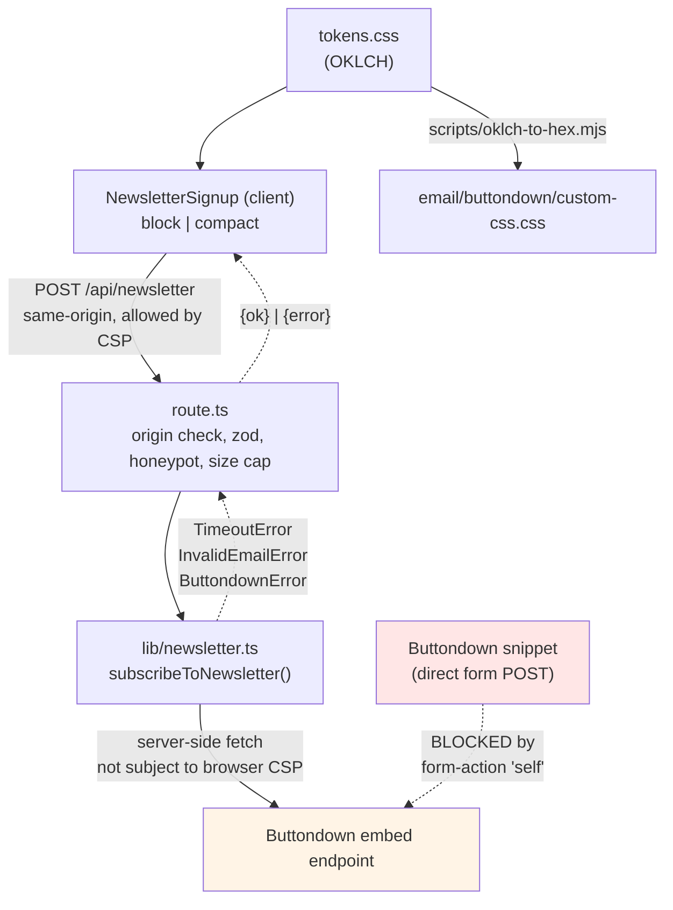

# Design Document

> **Retroactive spec.** This describes the design as built on branch
> `feat/buttondown-email-template` (2026-08-17), including two vendor assumptions that were
> disproven during implementation and one that remains unverified.

## Overview

Two independent surfaces that share one source of truth (`src/styles/tokens.css`):

1. **The email** — CSS and an HTML template that live in `email/buttondown/`, pasted into
   Buttondown's dashboard by hand. These are inert artifacts: no site code imports them, and the
   site build does not scan them.
2. **The signup** — a client component, a route handler, and a vendor module in `src/`, following
   the existing `/api/contact` architecture.

They are deliberately not coupled. The email is configured in a third-party dashboard on a release
cycle the site does not control; wiring it into the build would create a dependency with no payoff.

### Three vendor findings that shaped the design

Buttondown's docs and its own embed snippet were wrong or silent on three points. Each was checked
directly rather than assumed:

| Assumption (from the brief / vendor) | What is actually true | Consequence |
|---|---|---|
| Templating is Liquid | It is **Django** (``, `{{ x\|filter }}`, `{# #}`) | Template syntax; Prettier cannot parse the file |
| Custom CSS needs the Professional plan | Custom CSS is on **Basic**; only *full HTML templates* need Professional | The CSS path ships without a plan upgrade |
| The embed snippet can be pasted into the site | The site CSP blocks it outright | **Drove the entire signup architecture** — see below |

**The CSP finding is the load-bearing one.** `next.config.ts` sets `connect-src 'self'` and
`form-action 'self'`. Buttondown's snippet is a cross-origin form POST, so `form-action` blocks the
submit; a client-side `fetch` to buttondown.com is blocked by `connect-src`. Verified in-browser: a
direct `fetch` to the endpoint fails. Two options existed — relax the CSP, or proxy server-side.
Proxying was chosen because it keeps the security posture intact **and** satisfies Req 3.3: the
vendor endpoint answers a successful subscribe with a 302 to buttondown.com, which would have
bounced the visitor off the site.

## Steering Document Alignment

### Technical Standards (tech.md)

- Route handler under `src/app/api/`, returning `Response.json` with typed bodies — same shape as
  `/api/contact`.
- `zod` for server-side validation, already a project dependency.
- `AbortController` + `setTimeout` for the vendor timeout, mirroring `src/lib/mail.ts`.
- Typed error classes per failure mode (`TimeoutError`, `InvalidEmailError`, `ButtondownError`)
  rather than string matching, mirroring `mail.ts`'s `TimeoutError` / `ResendError`.
- No new dependencies.

### Project Structure (structure.md)

- `src/lib/newsletter.ts` — vendor access, alongside `src/lib/mail.ts`.
- `src/app/api/newsletter/route.ts` — endpoint, alongside `api/contact/route.ts`.
- `src/components/shared/newsletter-signup.tsx` — reused across multiple pages, so `shared/` per the
  convention that `shared/` holds components used by more than one page.
- `src/app/(site)/newsletter/page.tsx` — site route group, inheriting nav and footer.
- `email/buttondown/` — a new top-level directory. Not site source; it holds hand-authored assets
  for a third-party platform, the same way `research/` holds documents rather than code.

### Design System (design-system.md)

- **Heading ramp**: the block variant's heading takes `font-display text-3xl` — the settled section
  `h2` step. The email restates the same ramp in absolute px, since email has no utility layer.
- **Semantic roles only**: the component uses `border-border`, `bg-muted/40`, `text-muted-foreground`,
  `text-destructive`. No literal colors, no `chart-*`/`sidebar-*` (both reserved out of contract).
- **Status feedback**: success uses `StatusCallout tone="success"`. `--success` is defined in
  `tokens.css` today, so this does not reference a role that resolves to nothing.
- **Contrast is a pair property**: the block variant sits on `bg-muted/40`, so its text is gated
  against that surface rather than against `--background`.
- **Both themes first-class**: verified by running axe in both schemes, not by inspection.
- **Restraint over decoration**: one bordered block, no gradient, no illustration. This is also why
  the homepage hero has no signup — the landing page is a restrained path index, and a CTA block
  there would fight the principle. `/newsletter` is added as a path-index row instead.

## Code Reuse Analysis

### Existing Components to Leverage

- **`StatusCallout`** (`components/shared/status-callout.tsx`): tone-styled callout with an iconed
  accessible name. Used verbatim for the success state.
- **`Input` / `Label` / `Button`** (`components/ui/`): owned shadcn primitives. Used unchanged.
- **`SectionKicker`**: the `/ kicker` mono label on `/newsletter`, matching other slash pages.
- **`NewTabHint`**: appended to the outbound Buttondown credit link.

### Integration Points

- **`/api/contact`**: its `isAcceptedHost` / `originAllowed` CSRF pair is reproduced (not imported —
  see Known Compromises) along with the honeypot and body-size conventions.
- **`src/config/site.ts`**: `homeIndex` gains a `/newsletter` row; `siteConfig.url` is the trusted
  origin for the same-origin check.
- **`src/app/sitemap.ts`**: `/newsletter` added to the static route list.
- **`src/styles/globals.css`**: `@source not "../../email"` excludes the email directory from
  Tailwind's automatic content detection, following the existing exclusions for `.spec-workflow`
  and `e2e`.

## Architecture



The dashed red path is the architecture that was rejected — recorded because it is the obvious one
and the reason it fails is not visible from the vendor's documentation.

### Modular Design Principles

- **Single File Responsibility**: `lib/newsletter.ts` knows the vendor and nothing about HTTP
  requests or React. `route.ts` knows HTTP and validation, not the vendor's wire format. The
  component knows the site's own endpoint only.
- **Component Isolation**: one component, two variants, no per-surface duplication.
- **Service Layer Separation**: vendor call → endpoint → UI, each replaceable independently. A move
  off Buttondown touches `lib/newsletter.ts` alone.

## Components and Interfaces

### `lib/newsletter.ts`

- **Purpose:** call Buttondown; translate its HTML responses into typed errors.
- **Interfaces:** `subscribeToNewsletter(email: string): Promise<void>`;
  `BUTTONDOWN_REFERRAL_URL`; `TimeoutError`, `InvalidEmailError`, `ButtondownError`.
- **Dependencies:** `fetch` only.
- **Reuses:** the timeout and error-class shape of `src/lib/mail.ts`.

### `app/api/newsletter/route.ts`

- **Purpose:** the only origin the browser is allowed to talk to.
- **Interfaces:** `POST` → `200 {ok:true}` | `400 {error}` | `403` | `413` | `429` | `502` | `503`.
- **Dependencies:** `zod`, `siteConfig`, `lib/newsletter`.
- **Reuses:** `/api/contact`'s origin check, honeypot, and size-cap conventions.

### `components/shared/newsletter-signup.tsx`

- **Purpose:** the only signup UI on the site.
- **Interfaces:** `{ variant?: "block" | "compact"; id?: string; heading?: string; blurb?: string }`.
  `id` is required to differ per instance because a blog post renders both this and the footer copy
  on one page — duplicate DOM ids would break both `htmlFor` and `aria-describedby`.
- **Dependencies:** `StatusCallout`, `Input`, `Label`, `Button`.

### `email/buttondown/`

- **`custom-css.css`** — overrides for Buttondown's Modern template. The ship-now path (Basic plan).
- **`template.html`** — full HTML template, table-based (Outlook's Word engine ignores div layout).
  Professional plan.
- **`preview.html`** — loads Buttondown's **live** stylesheet, then ours, so the reviewed cascade is
  the one that runs in the inbox.
- **`README.md`** — install steps, the token table, the client test matrix, open questions.

### `scripts/oklch-to-hex.mjs`

- **Purpose:** derive email hex from `tokens.css` and assert the contrast gates (Req 2.5).
- **Interfaces:** CLI; exits non-zero if any gated pair drops below 4.5:1.
- **Reuses:** nothing — the conversion math is self-contained rather than a new dependency.

## Data Models

### Request (client → `/api/newsletter`)

```
{
  email: string          // trimmed, RFC-validated, max 254
  url_secondary: string  // honeypot; non-empty means bot
}
```

### Response

```
{ ok: true }                       // 200 — accepted, or honeypot silently absorbed
{ error: string }                  // 400 | 403 | 413 | 429 | 502 | 503
```

`error` is display-ready copy. The client renders it directly rather than mapping status codes to
its own strings, because the endpoint is the only thing that knows *why* the vendor failed.

### Buttondown's response (verified, not documented)

Buttondown answers with **HTML, not JSON**, so only the status is meaningful:

| Status | Meaning | Verified |
|---|---|---|
| 3xx | Accepted — 302 to the public archive | No — inferred; see Open Questions |
| 400 | Address rejected (HTML error page) | Yes — `curl` returned 400 for `not-an-email` |
| 429 | Rate limited | No — inferred |

## Error Handling

1. **Address rejected by us or by Buttondown** — `400 {error}`; the field takes `aria-invalid`,
   the message is announced and takes focus. The visitor can correct and resubmit.
2. **Vendor timeout (>8s)** — `503` + `Retry-After`; retryable message. Prevents a hung form.
3. **Vendor 5xx / unexpected** — `502`; generic retryable message. The vendor's own error text is
   never forwarded, because it is an HTML page, not a message for this visitor.
4. **Rate limited** — `429`; "try again shortly".
5. **Cross-origin request** — `403`, before any vendor call.
6. **Oversized body** — `413`, before parsing.
7. **Honeypot filled** — `200 {ok:true}` with no vendor call. A bot sees success and learns nothing.
8. **Network failure client-side** — the `fetch` rejection is caught and rendered as a connection
   message; the form stays filled so nothing is retyped.

## Testing Strategy

### Unit Testing

`src/lib/newsletter.test.ts` — 21 tests over the vendor module's request shape, status mapping, and
timeout, against a stubbed `fetch`. No test may reach buttondown.com: a real call on a valid address
creates a subscriber and mails a stranger.

The suite was **mutation-tested** rather than assumed to have teeth. Eight mutations of
`lib/newsletter.ts` were applied and reverted one at a time; seven were caught. The survivor was
load-bearing: it showed the `status === 0 || type === "opaqueredirect"` guard was **dead code**,
because the following `status < 400` check already accepts status 0. The guard was removed and the
reasoning moved into a comment; the equivalent mutation is now caught.

The origin check is covered by `/api/contact`'s 26 pre-existing tests, which exercise it through
`POST` and therefore continued to cover it after task 10 moved it to `src/lib/request-origin.ts`.
Suite total: 791 passing.

### Integration Testing

Endpoint verified by direct request against the dev server — all eight guard paths: invalid email,
honeypot, malformed JSON, missing field, array body, over-length address, cross-origin, oversized
body. Each returned the intended status and body.

### End-to-End Testing

- **Browser round trip**: form submitted in a real browser; the request cleared CSP, the error
  rendered, `aria-invalid` was set, and focus moved to the status region.
- **CSP claim proven, not assumed**: a direct `fetch` to Buttondown from the page was executed and
  failed, confirming the vendor snippet could not have worked.
- **Accessibility**: axe (wcag2a/2aa/21a/21aa) on `/`, `/blog/[slug]`, `/newsletter` in both
  themes — 0 violations across all six combinations.
- **Email**: 36 text elements checked for contrast in both schemes against Buttondown's live
  stylesheet — 0 failures. Two bugs were caught this way that reading the CSS did not reveal
  (see tasks 3 and 4).

### Not tested

**The subscribe success path.** Exercising it creates a real subscriber and sends a confirmation
email, so it was not run against the live list without the owner's say-so. The failure paths are
verified; the accepted path is inferred from the 302 the endpoint returns. One live signup closes
this.

## Known Compromises

- ~~**The origin check is duplicated, not shared.**~~ **RESOLVED in task 10, and the reason given
  here was wrong.** The claim was that extracting `isAcceptedHost` / `originAllowed` would edit a
  file governed by the repo's paired-merge CI guards. It would not: `verify-paired-merge.mjs`
  tracks `[src/__tests__/next-config-imports.test.ts, next.config.ts, src/lib/project-errors.ts,
  src/lib/blog-errors.ts]`, and the two canary guards track chokepoint fixtures plus
  `projects.test.ts`. **None names `api/contact/route.ts`.** The compromise was accepted on a
  premise nobody had checked — generalizing from the guards existing rather than reading their file
  list. Now extracted to `src/lib/request-origin.ts`, consumed by both routes, with contact's 26
  pre-existing tests passing unchanged as the behaviour-preservation proof.
- **Two signup forms render on a blog post** (post CTA + footer). Common practice, and the footer
  variant is visually quiet, but it is redundant. Suppressing the footer instance on pages that
  already carry a block CTA needs route-aware logic in site chrome, which was judged not worth the
  complexity. Left as a deliberate choice, not an oversight.
- **`template.html` is excluded from Prettier.** It is a Django template; Prettier's HTML parser
  fails on `{# #}` and reflowing the table layout would break the inline styles Outlook depends on.

## Open Questions

- **The body placeholder in `template.html` is unverified.** Buttondown documents every other
  variable used (`email.subject`, `email.publish_date`, `email.absolute_url`, `email.secondary_id`,
  `unsubscribe_url`, `manage_subscription_url`, `subscriber.email`) but never names the one that
  injects the body into a custom template. `{{ body }}` is a stand-in. Buttondown's template editor
  seeds the box with the current theme's HTML — the real placeholder is readable from there.
- **Newsletter name and description have no documented variables**, so `template.html` hardcodes
  "Matthew Field" in the masthead.
- **Whether the full HTML template is worth the Professional plan at all.** The CSS path reaches
  most of the design on Basic. The template only buys masthead and footer layout.
