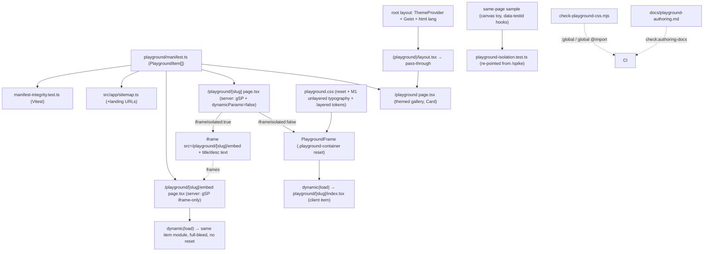

# Design Document

## Overview

The `playground` spec delivers spec #8 — the final decomposition spec: a sandbox section for self-contained "small-web" mini-apps and toys. It builds directly on the CSS-isolation foundation `site-foundation` scaffolded and spiked (outcome (b) "viable with restrictions"), and turns the placeholder `/playground` gallery into a real, manifest-driven section with two isolation modes (same-page reset container and iframe embed) plus the two inherited spike restrictions (M1 typography, M2 overlay portals) resolved as design pins.

The feature is **mostly wiring over an already-validated foundation**, not new architecture. The reset CSS, the route-scoped CSP opt-out, the `@layer playground` ordering, and the isolation test harness all already exist. This design adds:

- a typed **manifest** at the project root (`playground/manifest.ts`) as the single source of truth;
- a **layout refactor** that extracts the reset into a shared `<PlaygroundFrame>` server component and removes it from the `(playground)` group layout, so the gallery and embeds render outside the reset (Decision #9);
- the **M1 typography fix** in `playground.css` (a second *unlayered* rule, the spike's preferred option) plus the full test-fallout set;
- **three routes** — the themed gallery (`/playground`), the per-item landing (`/playground/[slug]`, same-page-or-iframe), and the standalone iframe embed (`/playground/[slug]/embed`);
- **two real sample items** (a same-page canvas toy, an iframe full-bleed visualization) that exercise the isolation architecture and host the migrated isolation-regression assertions;
- the **spike fixture removal** with its assertions re-pointed onto the same-page sample (Decision #7);
- metadata/SEO/sitemap wiring (production-scoped), a CSS-Modules leak guard, manifest↔route integrity tests, and an authoring doc gated by the (already-parameterized) `check-authoring-docs.mjs`.

The single new build-time concept is a **project-root import alias** (`#playground/*`) so `src/app/` consumers and the Vitest integrity test can import the manifest; everything else reuses an existing pattern.

### Revision notes (v2)

v2 responds to the v1 adversarial review (round 1), which verified every framework claim against the live repo (Next 16.2.2 / React 19.2.4) and judged the architecture sound — the exposure was **two hard blockers** and a cluster of test/boundary precision gaps. All findings accepted:

- **(Blocker 1 — would not compile) Route `params` are async on Next 16.** The v1 snippets destructured `params` synchronously (`{ params: { slug: string } }`); the repo's own sibling route `src/app/(site)/blog/[slug]/page.tsx:36-70` types `params: Promise<…>` and `await`s it. v2 rewrites all three route components and both `generateMetadata` functions to `async` + `params: Promise<{ slug: string }>` + `await params`, matching the live convention this design's verification section already cited. `generateStaticParams` is unchanged (no params arg).
- **(Blocker 2 — would throw at runtime) The container-color assertion must read sRGB, not `lab()`.** Req 5.3b names `expectLabClose`, but the live test file documents (`playground-isolation.test.ts:18-27`) that real `color` properties serialize to sRGB `rgb(…)` — only *custom properties* round-trip as `lab()` — and `expectLabClose`→`parseLab` (lines 105-112) throws on `rgb()`. The container `color` is read off the real `color` property (`cs.color`), so after M1 it serializes to `rgb(10,10,10)` (the sRGB of `oklch(0.145 0 0)`), not `lab()`. v2 implements Req 5.3b's **intent** (flip from the broken `[0,0,0]`/CanvasText to the re-established foreground) using `expectRgbEqual` against `EXPECTED_CONTAINER_COLOR_RGB = [10,10,10]` (empirically confirmed against the prod build before pinning), **not** `expectLabClose`. No requirements amendment is requested — the assertion proves the same property; only the helper name (which rested on a serialization assumption the live test contradicts) is corrected. The light baseline and the dark "stays light" re-read both assert the same non-zero foreground, which still proves dark-mode isolation (a leak would flip `color` to the dark `--foreground`).
- **(F3) The integrity test must not import route `page.tsx`.** Importing a route module drags `next/dynamic`, `next/navigation`, and a CSS import into jsdom with no repo precedent. v2 extracts the partition logic into two pure, exported helpers in the manifest module — `landingParams(items)` (all slugs) and `embedParams(items)` (iframe-only slugs) — which **both** route `generateStaticParams` call and the integrity test imports. The test imports only `#playground/manifest` (data + pure helpers), satisfying Req 10.1 without route-module evaluation.
- **(F6) `PlaygroundFrame` moves out of the boundary-forbidden `components/shared/`.** `structure.md:287` forbids items importing from `src/components/shared/` — the exact path v1 chose. Since `<PlaygroundFrame>` is route-private (only the same-page landing route renders it), v2 colocates it at `src/app/(playground)/_components/playground-frame.tsx` (an underscore-private App Router folder), off the item-import graph entirely (items already may not import from `src/app/`).
- **(F8) Leak guard widened.** v1 claimed `:global` and global-`@import` are "the only two" CSS-Module escapes; `composes: x from global;` also escapes. v2 adds the `composes … from global` pattern (and the `@import url(…)` form) to `check-playground-css.mjs`, its self-test, and the authoring-doc forbidden list, and corrects the claim.
- **(F7) iframe E2E asserts a ratio, not an absolute box.** An `aspect-ratio` + `w-full` box derives height from the test-viewport width, so an absolute bounding-box assertion is viewport-flaky. v2 asserts width > 0 (spans the column) AND `height ≈ width × 10/16` within tolerance. (`aspectRatio: "16 / 10"` as a string passes through React inline styles verbatim — confirmed.)
- **(F9) Vitest subpath alias.** Vite `resolve.alias` does prefix substitution, so `"#playground" → <root>/playground` resolves subpath imports like `#playground/manifest`; the `#`-prefix does not collide (no `package.json` `imports` field; the existing `#site/content` proves `#` works under `moduleResolution: bundler`). v2 keeps the alias and the tasks phase verifies it by **running** the integrity test, not just `tsc`.
- **(F5, accepted as a conscious non-move) `color-scheme`.** The M1 fix moves only the four properties Req 5.2 names to the unlayered rule, leaving `color-scheme: light` layered (so `all: initial` resets it to `normal` inside the container). Token colors are explicit `oklch()` (not `color-scheme`-derived) and no test asserts it, so this is benign — but `color-scheme: normal` does change form-control/scrollbar rendering, so v2 adds an authoring-doc note that same-page form controls render under `color-scheme: normal`.
- **(F4, confirmed) `next/dynamic` in a server component** without `{ ssr: false }` is the one legal configuration on Next 16 (SSR-on default; `ssr:false` is rejected in server components) and the design uses exactly that. It is first-of-kind in this repo (no existing `next/dynamic` usage), so the tasks phase verifies it against a real `next build` + render. The dynamic component is created in the render body (keyed by slug — it cannot be module-scope since it varies per item); acceptable for this scale.
- **Minor alignments:** the `sitemap.ts` snippet uses `new URL(\`/playground/${it.slug}\`, siteConfig.url).toString()` to match the repo's existing URL construction; the `check-authoring-docs.test.mjs` count assertion is at line 110.

Round 1 explicitly confirmed (no action): root-layout `ThemeProvider`/Geist/`lang`, the `(playground)/layout.tsx`→`PlaygroundFrame` extraction, M1 being real and the second-unlayered-rule cascade sound, the theme-toggle reuse (no `(site)` coupling), the CSP opt-out, `notFound()` not being swallowed by `error.tsx`, and empty-manifest `generateStaticParams` building cleanly.

### Revision notes (v3)

v3 responds to the v2/round-2 adversarial review, which verified every v2 fix against live code and confirmed **both round-1 blockers and all seven softer findings are closed** (the async-params rewrite matches `blog/[slug]` exactly; the container-color flip matches the `expectRgbEqual` readout already at `playground-isolation.test.ts:286`). Round 2 found **no new blocker** — its exposure was precision on the *new* surfaces v2 introduced. All findings accepted:

- **(r2-N1, Medium — Compounding on F3) The integrity test became tautological; on-disk existence wasn't asserted.** The pure `landingParams`/`embedParams` helpers are shared by the route and the test, so the test reconstructs its expectation from the same `playgroundItems` it checks — it proves the partition logic but not that each item module exists on disk. v3 (a) **adds an `fs.existsSync` check** to the integrity test that every slug has a `playground/[slug]/index.tsx` (catching a missing/typo'd item folder — the most likely drift, which `embedParams` would otherwise pass), and (b) states the **coverage handoff** explicitly: slug uniqueness/kebab-case + the partition logic + item-module existence are the integrity test's job; full route/embed *wiring* is covered by `next build` + the gallery E2E.
- **(r2-N2, Medium — Compounding on F4) SSR-prerender safety of the sample items was unstated.** `dynamic(it.load)` is SSR-on (the only legal config in a server-component host — `ssr:false` is illegal there), so both samples are static-prerendered at `next build`; any `window`/`document`/`canvas`/`requestAnimationFrame`/`ref.current` access at **module or render scope** (not inside `useEffect`) throws during prerender and **fails the build**. v3 adds this as an explicit sample-item + authoring-doc constraint (guard browser globals behind effects/refs; the canvas samples initialize in `useEffect`), folds it into Error Scenario 1, and notes there is **no `ssr:false` escape hatch** in the server-component host.
- **(r2-N3, Low) The embed "no site chrome" claim was overstated.** The embed renders under the shared root `<body>`, which `globals.css:37-40` themes (`background`/`color` follow the site light/dark theme), and inherits the Geist fonts + provider context. v3 tightens the wording: the embed has **no header/footer chrome and no `.playground-container` reset**, but it **does** inherit root-layout body theming, fonts, and providers — which is exactly the "own document, layout stack, and provider context" structure.md 277 calls for. (Benign for the full-bleed `starfield`, which paints its own background; Tailwind preflight zeroes `body` margin, so `100vw/100vh` is unconstrained — verified.)
- **(Honesty) The `[10,10,10]` provenance was overstated.** No `.next/static/css` artifact exists in the tree, so "empirically confirmed against the prod build" is not reproducible now. v3 rewords: `[10,10,10]` is **pinned from the toolchain's documented `#0a0a0a` fallback** (the existing `playground-isolation.test.ts:17-19` header) and **re-confirmed against the prod build in the tasks phase**. The value is correct; only the provenance claim is corrected.
- **(F9 carryover, Low — Recurring) The `#playground` subpath alias has no in-repo precedent.** `#site/content` is used **only** as a terminal import (the chokepoint checkers explicitly treat `#site/content/foo` subpaths as non-resolving), so the design no longer claims it "proves `#` works" for subpaths. Vite `resolve.alias` prefix-substitution does resolve `#playground/manifest`; v3 keeps that, adds a **documented fallback** (if Vitest fails to resolve the subpath, add the `vite-tsconfig-paths` plugin or use a relative import in the integrity test), and the tasks phase verifies by running.
- **(r2 aggregate, Low) First-of-kind patterns enumerated.** Three mechanisms are correct-per-framework but have no existing instance in this repo: the `_components` underscore-private folder, `next/dynamic`, and the `#`-subpath alias. v3's tasks-phase verification gate enumerates **all three** for build/run verification, not just `next/dynamic`.

Round 2 confirmed sound (no action): the `@layer playground` ordering surviving the CSS-import relocation (declared in `globals.css:4` before Tailwind; layer position fixed at first declaration), `dynamic(it.load)` type-checking under strict TS, the `../../_components/` path math, the `frame` union narrowing, the iframe ratio E2E on Desktop Chrome, the gallery `ThemeToggle` composition, and `notFound()`/`error.tsx`/`loading.tsx` behavior.

### Revision notes (v4)

v4 responds to the v3/round-3 adversarial review — the third round — which verified every v3 delta against live code and judged the document **converged and implementation-ready**, with **no new findings, no blockers, and no conclusion to reverse**. Round 3 confirmed each round-2 fix is correct and internally consistent:

- **r2-N1** (integrity `fs.existsSync`): sound and well-precedented — `process.cwd()`-relative node-fs reads under jsdom Vitest are established in this repo (`src/content/seed-content.test.ts:28`, `src/lib/blog.test.ts`, `src/__tests__/velite-output-shape.test.ts`, `src/app/feed.xml/parity.test.ts`); the coverage handoff is honest (item-module existence is the test's job; the missing-`embed/`-dir case is explicitly handed to `next build` + E2E).
- **r2-N2** (SSR safety): correct — `dynamic` is SSR-on with no `ssr:false` opt-out in a server component, and the "module/render scope throws, `useEffect` is safe" boundary correctly covers the `useState` lazy-initializer subtlety; a bare server-rendered `<canvas ref>` hydrates cleanly.
- **r2-N3** (embed theming): consistent across all three locations; `globals.css:37-40` body theming confirmed live; no residual "neutral surface" phrasing.
- Both honesty caveats corrected (the `[10,10,10]` provenance now cites the test-header `#0a0a0a` fallback; the `#`-subpath claim drops the false precedent and carries a fallback).

No body changes were required in v4. Round 3 sweep confirmed full requirement coverage with no criterion mentioned-without-mechanism (Req 9.4, 2.3, 4.6, 7.4, 10.4 each have a concrete mechanism + test; `<noscript>`, the M2-matrix retirement, production-scoped indexability, and the `data-testid`-not-hashed-class rule are all present).

**Deferred-by-design verifications carried into the tasks phase** (each is verify-by-build/run, not a design defect — already named in the body's *First-of-kind verification gate* and *Manual verification*):
1. Run the manifest-integrity Vitest test to prove the `#playground/manifest` subpath alias resolves (fallback: the `vite-tsconfig-paths` plugin or a relative import in the test).
2. `next build` + render to prove (i) the `(playground)/_components/` underscore folder is router-ignored and (ii) `next/dynamic` SSRs + hydrates the client item.
3. Re-confirm `EXPECTED_CONTAINER_COLOR_RGB = [10,10,10]` against the real prod-build CSS before pinning.
4. Vercel preview isolation + iframe-sizing re-check before merge.

### Design-phase verification of the approved requirements

Every mechanism the v4 requirements pin was verified against live code during this design and holds. Where the requirements left a detail to "finalized in design," this section states the concrete choice.

- **ThemeProvider is in the *root* layout** (`src/app/layout.tsx`: `<body><ThemeProvider attribute="class" defaultTheme="system" enableSystem>{children}</ThemeProvider>`), wrapping *all* groups including `(playground)`. So a `/playground` gallery rendered under the root layout (with the `(playground)` group layout reduced to a pass-through) is genuinely themeable and carries the Geist font variables from `<html className="${geistSans.variable} ${geistMono.variable}">` — confirming Decision #9 is buildable, not aspirational. `<html lang="en">` also lives there, so the embed route inherits `lang` (Req 4.6).
- **The reset lives in the group layout today and must move.** `src/app/(playground)/layout.tsx` is a server component returning `<div className="playground-container" data-testid="playground-container">{children}</div>` and importing `@/styles/playground.css`. An App Router segment layout cannot skip wrapping a child, so the wrapper is extracted into `<PlaygroundFrame>` and the layout reduced to a pass-through (Req 5.1, Decision #9). The `data-testid="playground-container"` hook moves with it.
- **M1 is real and the fix is the spike's preferred one.** `playground.css:14-20` is the unlayered `.playground-container { all: initial; isolation: isolate; … }` reset; `playground.css:22-77` is the `@layer playground` block re-declaring typography (font-family/font-size/line-height/`color: oklch(0.145 0 0)`) and the shadcn token set. Unlayered beats layered on the same selector, so the typography loses. `spike-results.md` recommends (Preferred) a **second unlayered rule** re-establishing typography after the reset, keeping tokens layered. This design adopts exactly that (Req 5.2).
- **The isolation test is pinned to `/spike` and encodes the broken state.** `e2e/tests/playground-isolation.test.ts` navigates to `SPIKE_PATH = "/spike"` (lines 184, 220, 244, 280, 329, 378, 403); `INTENDED_PLAYGROUND_FONT_FRAGMENT = "ui-sans-serif"` (line 103) is asserted with `not.toContain` (line 240); `EXPECTED_CONTAINER_COLOR_RGB = [0,0,0]` (line 63, with the lines 54-63 comment documenting the broken CanvasText state, read on both the light baseline and the dark "stays light" re-read); `EXPECTED_RADIUS = "10px"` (line 70); `HOST_FONT_FAMILY_FRAGMENTS = ["Geist"]` (line 97). The full re-point + flip set is specified below (Req 5.3, 10.2).
- **The CSP opt-out already covers the nested paths.** `next.config.ts:84` is `source: "/((?!playground(?:/|$)).*)"`, excluding `/playground`, `/playground/[slug]`, and `/playground/[slug]/embed` from the CSP header. No `X-Frame-Options` is set anywhere (the home CSP's `frame-src 'self'` at `next.config.ts:75` does not apply to the CSP-exempt host route). So a same-origin `/embed` iframe loads with no framing error (Req 9.1, 9.2). `next.config.ts:93-103` pushes `X-Robots-Tag: noindex, nofollow` onto `/(.*)` when `VERCEL_ENV === "preview"`, so every indexability statement here is **production-scoped** (Req 8). `output` is unset — routes are statically prerendered via `generateStaticParams`, not a static export.
- **`scripts/check-authoring-docs.mjs` is already parameterized** (the `slash-pages` spec did the parameterization; it is on disk now): it exports `CANONICAL_HEADINGS`, `SLASH_PAGES_HEADINGS`, and `AUTHORING_DOCS = [{ path: "docs/contributions-and-resources-authoring.md", … }, { path: "docs/slash-pages-authoring.md", … }]`, with `main(docs)` iterating and aggregating. This spec only **appends a third entry** and adjusts the one self-test assertion that hardcodes the doc count (below, Req 11.2). `card.tsx` exists in `src/components/ui/` (Req 2.2).
- **No project-root alias exists.** `tsconfig.json` `paths` is only `{"@/*": ["./src/*"], "#site/content": ["./.velite"]}`; `vitest.config.ts` mirrors `@` and `#site/content` as manual `resolve.alias` entries (no `vite-tsconfig-paths` plugin). So importing the project-root manifest from `src/` requires a **new alias declared in both files** — pinned below.
- **`src/app/sitemap.ts`** lists `/playground` (line 14) in a static `routes` array and derives dynamic entries from `src/lib` getters; adding manifest-derived landing routes is an additive change (Req 8.3). **`src/config/site.ts`** `navItems`/`homeIndex` deliberately omit `/playground` — it renders but is unlisted (no change needed).

No requirements amendment is requested; all pinned mechanisms are implemented as written.

## Steering Document Alignment

### Technical Standards (tech.md)

- **Same-page isolation = `@layer` + CSS Modules + `all: initial` reset; iframe for full isolation** (tech.md "Default same-page isolation" / "Full isolation"): both modes ship, selected per-item by the manifest `iframeIsolated` flag. The "when in doubt, use iframe" rule and its trigger list (conflicting deps, `position: fixed`, `100vw/100vh`, `:root/html/body` styles, third-party global CSS, custom CSP) are reproduced in the authoring doc (Req 11.1).
- **Client-side only at launch; no playground backend** (tech.md "Server-side convention"): item modules are client components; no `/api/playground/*` route is built (out of scope). The manifest body stays server/build-safe (Req 1.3).
- **Search scope**: playground items are dynamic and intentionally not Pagefind-indexed; only the static gallery/landing HTML is indexable (Req 8).
- **No workspace extraction at launch** (tech.md decision #7): dependency-conflicting items use iframe isolation, not pnpm-workspace extraction (out of scope).
- **Static-first, server components, minimal client JS, 90+ Lighthouse, TS strict, ESLint/Prettier/Vitest/Playwright** (tech.md "Application Architecture"/"Performance"/"Code Quality"): the gallery, both route hosts, and the embed shell are server components; only the dynamically-imported item components are client. The gallery carries no images and minimal JS (theme toggle + cards).

### Project Structure (structure.md)

- **Items at the project root** `playground/[slug]/` (`index.tsx` client component + `styles.module.css` + helpers), manifest at `playground/manifest.ts`, exactly per the structure.md tree (83-88) and prose (220-239). Field names follow structure.md: `slug`, `title`, `description`, `tags`, `iframeIsolated`.
- **Module boundaries** (structure.md 256-271): items may import from `src/lib/` and `src/components/ui/` and their own directory (`@/` aliases for `src/`, relative within `playground/[slug]/`); items SHALL NOT import from `src/app/`, `src/components/shared/`, or `src/components/layout/`. The reverse direction (the App Router route importing the manifest) is the documented consumer pattern.
- **Embed routes are standalone documents** (structure.md 277): `playground/[slug]/embed/page.tsx` renders the item's full output with its own metadata/heading, no header/footer chrome, and no reset wrapper (it does inherit root-layout body theming/fonts/providers — see the embed-route detail).
- **Route-group split** (`(site)` vs `(playground)`): the gallery and item routes stay under `(playground)`; they are NOT moved to `(site)` (that would re-import site chrome).
- `kebab-case` files, `camelCase` functions, typed config, no barrel files, direct imports. The new alias `#playground/*` mirrors the existing `#site/content` internal-alias convention.

## Code Reuse Analysis

### Existing Components to Leverage

- **`(playground)/layout.tsx` reset + `data-testid` hook** — the `<div className="playground-container" data-testid="playground-container">` and the `@/styles/playground.css` import move verbatim into the new `<PlaygroundFrame>`; the reset CSS itself is unchanged except the M1 addition.
- **`playground.css` two-part strategy** — kept as-is (unlayered reset + layered tokens); the only edit is the M1 unlayered typography rule.
- **`@layer playground;` ordering in `globals.css:4`** — reused unchanged; the layer stays below Tailwind's layers so utilities win inside the container.
- **`next.config.ts` CSP opt-out + preview `X-Robots-Tag`** — verified, not modified (Req 9.1).
- **`e2e/tests/playground-isolation.test.ts` harness** — the computed-style probing, `applyDarkMode` helper, and host-leak guard are reused; only the navigation target and the broken-state constants change (Req 5.3, 10.2).
- **`e2e/tests/csp.test.ts`** — extended from `/playground` to the nested `[slug]`/`embed` paths (Req 10.5).
- **`src/components/ui/card.tsx`** (shadcn `Card`) — the gallery cards (Req 2.2).
- **The site theme-toggle component** (the one the `(site)` header mounts) — reused for the gallery's minimal-chrome toggle; it works because `ThemeProvider` is in the *root* layout (verified).
- **`scripts/check-authoring-docs.mjs` / `.test.mjs`** — already parameterized over `AUTHORING_DOCS`; this spec appends a third entry (Req 11.2).
- **`scripts/run-e2e.mjs` + `e2e/playwright.config.ts`** — E2E runs against the prod `pnpm start` build (Webpack) at `baseURL http://localhost:${PORT}` (Req 10.4). New specs slot into `e2e/tests/`.

### Integration Points

- **`playground/manifest.ts` (new, project root)** — single source consumed by the gallery, `[slug]`/`embed` `generateStaticParams` + loaders, `src/app/sitemap.ts`, and the Vitest integrity test, via the `#playground/*` alias.
- **`tsconfig.json`** — add `"#playground/*": ["./playground/*"]` to `paths`.
- **`vitest.config.ts`** — add `"#playground": fileURLToPath(new URL("./playground", import.meta.url))` to `resolve.alias` (Vitest has no tsconfig-paths plugin, so the alias must be mirrored here). Vite `resolve.alias` does prefix substitution, so this bare-key alias resolves subpath imports like `#playground/manifest`. Note `#site/content` is **terminal-only** in this repo (the chokepoint checkers treat `#site/content/foo` subpaths as non-resolving), so the subpath case has no existing precedent; the tasks phase verifies it by **running** the integrity test, not just `tsc`, and the **fallback** if Vitest can't resolve the subpath is the `vite-tsconfig-paths` plugin or a relative import in the test (F9, r2).
- **`src/app/(playground)/layout.tsx`** — reduce to a pass-through (`return children`); the reset wrapper + CSS import move to `<PlaygroundFrame>`.
- **`src/app/(playground)/_components/playground-frame.tsx` (new)** — the extracted reset wrapper (route-private server component; out of the item-importable graph — F6).
- **`src/styles/playground.css`** — add the unlayered M1 typography rule after the reset; remove the typography declarations from the `@layer playground` block (tokens stay layered).
- **`src/app/(playground)/playground/page.tsx`** — replace the placeholder body with the manifest-driven themed gallery; flip `robots` to indexable; add `generateMetadata()`.
- **`src/app/(playground)/playground/[slug]/{page.tsx,loading.tsx,error.tsx}` (new)** — the per-item landing route + boundaries.
- **`src/app/(playground)/playground/[slug]/embed/page.tsx` (new)** — the standalone embed.
- **`src/app/(playground)/spike/` (removed)** — fixture deleted; assertions migrate to the same-page sample.
- **`src/app/sitemap.ts`** — add manifest-derived `/playground/[slug]` landing URLs (not embeds).
- **`e2e/tests/playground-isolation.test.ts`** + **`csp.test.ts`** — re-point/flip + extend.
- **`scripts/check-playground-css.mjs` (new) + `package.json` + CI** — the `:global`/global-`@import` leak guard.
- **`scripts/check-authoring-docs.mjs` / `.test.mjs`** — append `docs/playground-authoring.md`; bump the one count assertion.
- **`docs/playground-authoring.md` (new)** — the authoring doc.

## Architecture

The manifest is the hub. Routes and sitemap derive from it; same-page items render inside `<PlaygroundFrame>` (the isolation boundary), iframe items render a host shell that frames the standalone embed.



### Modular Design Principles

- **Single Responsibility**: `manifest.ts` = data + lazy thunks only; `[slug]/page.tsx` = mode routing + metadata + `dynamicParams`; `[slug]/embed/page.tsx` = standalone render; each `playground/[slug]/index.tsx` = one item's behavior + its CSS Module; `playground.css` + `<PlaygroundFrame>` = the isolation boundary.
- **Component Isolation**: `<PlaygroundFrame>` is the *only* place the reset is applied; the gallery card list is inline in the gallery route (used once, no extraction).
- **Service Layer Separation**: routes/sitemap consume the manifest; items never import routes; the manifest never imports React runtime or client code.
- **Utility Modularity**: the CSS leak guard and the authoring-doc check are small single-purpose `scripts/*.mjs`.

### Layout refactor — `<PlaygroundFrame>` extraction (Req 5.1, Decision #9)

The reset must wrap *only* same-page item surfaces. Because an App Router segment layout cannot wrap some children and not others, the wrapper leaves the group layout and becomes a shared component used by exactly one render path.

```tsx
// src/app/(playground)/layout.tsx — AFTER (pass-through; no wrapper, no CSS import)
export default function PlaygroundLayout({ children }: { children: React.ReactNode }) {
  return children;
}
```

```tsx
// src/app/(playground)/_components/playground-frame.tsx — NEW (route-private server component)
import "@/styles/playground.css";

export function PlaygroundFrame({ children }: { children: React.ReactNode }) {
  return (
    <div className="playground-container" data-testid="playground-container">
      {children}
    </div>
  );
}
```

- The `data-testid="playground-container"` hook is preserved (the isolation test selects it).
- Moving the `@/styles/playground.css` import into `<PlaygroundFrame>` scopes the reset + token CSS to the routes that render the frame (same-page `[slug]`), so the gallery and embed do **not** load the reset — exactly the intent of Decision #9. The `@layer playground;` *declaration* stays in `globals.css` (site-wide, empty, harmless).
- The group layout returning `children` keeps `/playground` under the root layout's `ThemeProvider`/fonts (themed gallery) without re-importing `(site)` chrome.

### M1 typography fix — `playground.css` (Req 5.2)

Add a second **unlayered** rule on `.playground-container`, declared after the reset, re-establishing the four typographic properties the test checks; remove those four from the `@layer playground` block so there is one source of truth. Tokens stay layered.

```css
/* playground.css — reset block (lines 14-20) UNCHANGED */
.playground-container { all: initial; isolation: isolate; display: block; box-sizing: border-box; unicode-bidi: normal; }

/* NEW — second unlayered rule, AFTER the reset, so it beats `all: initial` */
.playground-container {
  font-family: ui-sans-serif, system-ui, -apple-system, BlinkMacSystemFont,
    "Segoe UI", Roboto, "Helvetica Neue", Arial, sans-serif;
  font-size: 16px;
  line-height: 1.5;
  color: oklch(0.145 0 0);
}

/* @layer playground { … } — typography lines removed; the shadcn TOKEN re-declarations stay layered. */
```

- **Scope discipline (deliberate):** only `font-family`, `font-size`, `line-height`, `color` move to the unlayered rule — the exact four Req 5.2 names and the isolation test probes. `box-sizing` is already set unlayered in the reset (no change). `color-scheme: light` and `-webkit-text-size-adjust` stay in the layer; `all: initial` resets `color-scheme` to `normal`, which is cosmetically equivalent to `light` on this surface (token colors are explicit `oklch()` values, not `color-scheme`-derived) and is not asserted by any test — flagged here as a conscious non-move, not an oversight, to avoid over-reaching the requirement.
- Tokens stay layered (custom properties are unaffected by `all: initial` per spec), so Tailwind utilities inside the container still win.

### Manifest layer — `playground/manifest.ts` (Req 1)

```ts
// playground/manifest.ts — project root, server/build-import-safe (NO "use client", NO React runtime)
import type { ComponentType } from "react"; // type-only import; erased at build (Req 1.3)

export type PlaygroundFrameHint = { aspectRatio: string } | { height: string };

export type PlaygroundItem = {
  slug: string;                 // URL-safe kebab-case, unique across the manifest
  title: string;
  description: string;
  tags: string[];
  iframeIsolated: boolean;
  load: () => Promise<{ default: ComponentType }>; // lazy thunk: () => import("./[slug]")
  frame?: PlaygroundFrameHint;  // iframe sizing hint (Req 4.4); ignored for same-page items
};

export const playgroundItems: PlaygroundItem[] = [
  {
    slug: "scribble-pad",
    title: "Scribble Pad",
    description: "A tiny canvas drawing toy with a clashing palette and serif type — proof the reset isolates same-page items.",
    tags: ["canvas", "drawing", "interactive"],
    iframeIsolated: false,
    load: () => import("./scribble-pad"),
  },
  {
    slug: "starfield",
    title: "Starfield",
    description: "A full-bleed, position:fixed starfield animation that needs its own viewport — proof of the iframe path.",
    tags: ["canvas", "animation", "full-bleed"],
    iframeIsolated: true,
    load: () => import("./starfield"),
    frame: { aspectRatio: "16 / 10" },
  },
];

// Pure partition helpers (F3) — the route generateStaticParams AND the Vitest integrity test
// import these, so the test never imports a route page.tsx.
export const landingParams = (items: PlaygroundItem[]) => items.map((it) => ({ slug: it.slug }));
export const embedParams = (items: PlaygroundItem[]) =>
  items.filter((it) => it.iframeIsolated).map((it) => ({ slug: it.slug }));
```

- **Server/build-safe** (Req 1.3): no top-level `"use client"`, no React-runtime import (only `import type`, which is erased), no browser globals at module scope — so `sitemap.ts` and both `generateStaticParams` can import it during `next build`.
- The lazy `load` thunk keeps each item code-split (Req 1.3, 3.3). `import("./scribble-pad")` resolves to `playground/scribble-pad/index.tsx` (the directory's `index.tsx`).
- `frame` is available at launch (Req 4.4); the iframe sample declares a concrete `{ aspectRatio: "16 / 10" }` (Req 7.3), which the host applies and is also the documented fallback default.

**Import alias.** `tsconfig.json` `paths` gains `"#playground/*": ["./playground/*"]`; `vitest.config.ts` `resolve.alias` gains `"#playground": fileURLToPath(new URL("./playground", import.meta.url))`. Consumers import `#playground/manifest`. The `#`-prefix mirrors the existing `#site/content` convention and is unambiguous vs. npm scopes. (Playwright E2E does not import the manifest — it hardcodes the two stable sample slugs — so no Playwright resolver change is needed.)

### Gallery — `/playground` (Req 2)

```tsx
// src/app/(playground)/playground/page.tsx — server component
export function generateMetadata(): Metadata {
  return {
    title: "Playground",
    description: "Small self-contained web experiments, toys, and curiosities.",
    robots: { index: true }, // flipped from the placeholder's index:false (Req 8.1)
  };
}

export default function PlaygroundGallery() {
  return (
    <main className="mx-auto w-full max-w-5xl px-4 py-12">
      <div className="flex items-center justify-between">
        <Link href="/">← matthewfield.ca</Link>   {/* back to site (Req 2.4) */}
        <ThemeToggle />                            {/* reused site toggle (Req 2.4) */}
      </div>
      <h1>Playground</h1>
      {playgroundItems.length === 0 ? (
        <p>Nothing here yet — check back soon.</p>  {/* empty state (Req 2.3) */}
      ) : (
        <ul>{playgroundItems.map((it) => (
          <li key={it.slug}>
            <Link href={`/playground/${it.slug}`}>
              <Card>{/* title, description, tags */}</Card>
            </Link>
          </li>
        ))}</ul>
      )}
    </main>
  );
}
```

- Themed (root-layout `ThemeProvider`), **not** wrapped in `<PlaygroundFrame>` (Decision #9). Uses the shadcn `Card` (Req 2.2). Statically generated (no dynamic params). Single `<h1>`, semantic `<ul>/<li>`, keyboard-reachable back-link + toggle (Req 2.4, Accessibility NFR).
- Empty-manifest case renders a graceful state, never a blank/error page (Req 2.3, Reliability NFR).

### Per-item landing route — `/playground/[slug]` (Req 3, 4)

```tsx
// src/app/(playground)/playground/[slug]/page.tsx — SERVER component
import { notFound } from "next/navigation";
import dynamic from "next/dynamic";
import { playgroundItems, landingParams } from "#playground/manifest";
import { PlaygroundFrame } from "../../_components/playground-frame";

type Params = Promise<{ slug: string }>;        // Next 16: params is async (matches blog/[slug])

export const dynamicParams = false;             // unknown slug → 404 (Req 3.2)
export function generateStaticParams() {
  return landingParams(playgroundItems);        // all slugs (Req 3.4) — pure helper, also used by the integrity test
}

function find(slug: string) {
  return playgroundItems.find((it) => it.slug === slug);
}

export async function generateMetadata({ params }: { params: Params }): Promise<Metadata> {
  const { slug } = await params;
  const it = find(slug);
  if (!it) return {};
  return { title: it.title, description: it.description, robots: { index: true } }; // Req 8.2
}

export default async function ItemLanding({ params }: { params: Params }) {
  const { slug } = await params;
  const it = find(slug);
  if (!it) notFound();                          // defensive; dynamicParams=false already 404s unknown slugs

  if (it.iframeIsolated) {
    const style =
      it.frame && "height" in it.frame
        ? { height: it.frame.height }
        : { aspectRatio: (it.frame as { aspectRatio: string } | undefined)?.aspectRatio ?? "16 / 10" };
    return (
      <main className="mx-auto w-full max-w-3xl px-4 py-12">
        <h1>{it.title}</h1>
        <p>{it.description}</p>                  {/* real indexable text (Req 4.1, 8.5) */}
        <iframe src={`/playground/${it.slug}/embed`} title={it.title} className="w-full" style={style} />
      </main>
    );
  }

  const Item = dynamic(it.load);                // SSR'd + hydrated client item; created per-render (varies by slug)
  return (
    <>
      <noscript>This experiment needs JavaScript.</noscript>  {/* Req 3.5 */}
      <PlaygroundFrame>
        <Item />
      </PlaygroundFrame>
    </>
  );
}
```

- **Server boundary / client item** (Req 3.1): the route is a server component; `dynamic(it.load)` resolves the manifest thunk to the **client** item module (`"use client"` in `index.tsx`), SSR-rendered then hydrated. `next/dynamic` without `{ ssr: false }` is valid in a server component and preserves the per-item code-split.
- **`dynamicParams = false` + `generateStaticParams`** (Req 3.2, 3.4): all slugs are statically generated; an unknown slug 404s. The `notFound()` is belt-and-braces.
- **iframe sizing** (Req 4.4): width = `w-full` (content column), height/aspect from `frame` with a documented `16 / 10` fallback; accessible `title`, keyboard-reachable. Same-page item is rendered inside `<PlaygroundFrame>`; iframe host is outside it (Req 4.3).
- **Same-page item supplies its own `<h1>`** (Accessibility NFR allows item-appropriate heading); the iframe host supplies the themed `<h1>`/`<p>` (Req 4.1).

**Loading / error boundaries (Req 3.5).** `loading.tsx` (segment loading UI) and `error.tsx` (`"use client"` error boundary) at `…/[slug]/`. They cover **both** render modes (the same-page dynamic import is the meaningful case; the iframe shell renders fast). They catch render-time throws and `load`-thunk rejections — **not** post-hydration event-handler throws inside a client item (the item owns its runtime errors), stated plainly so no graceful-degradation is assumed for in-item bugs.

**M2 overlay containment (Req 3.6, Decision #5).** Neither sample mounts a shadcn overlay, so no containment ships. The decision rule (contain the portal only when the overlay must render against playground-scoped tokens; otherwise accept the `document.body` escape — the default) is captured in the authoring doc, not as code. The spike's M2 fixture matrix is retired with the spike (Req 10.2).

### Standalone embed route — `/playground/[slug]/embed` (Req 4)

```tsx
// src/app/(playground)/playground/[slug]/embed/page.tsx — SERVER component
import { notFound } from "next/navigation";
import dynamic from "next/dynamic";
import { playgroundItems, embedParams } from "#playground/manifest";

type Params = Promise<{ slug: string }>;

export const dynamicParams = false;
export function generateStaticParams() {
  return embedParams(playgroundItems);          // iframe-only slugs (Req 4.5) — pure helper, also used by the integrity test
}
export async function generateMetadata({ params }: { params: Params }): Promise<Metadata> {
  const { slug } = await params;
  const it = playgroundItems.find((i) => i.slug === slug);
  return { title: it?.title, robots: { index: false } }; // noindex, own <title> (Req 4.6, 8.4)
}
export default async function ItemEmbed({ params }: { params: Params }) {
  const { slug } = await params;
  const it = playgroundItems.find((i) => i.slug === slug);
  if (!it || !it.iframeIsolated) notFound();    // a same-page slug's /embed cleanly 404s (Req 4.5)
  const Item = dynamic(it.load);
  return <Item />;                              // full-bleed, NOT wrapped in PlaygroundFrame (Req 4.3)
}
```

- **`generateStaticParams` enumerates only `iframeIsolated: true` slugs**; a same-page slug's `/embed` 404s via `dynamicParams = false` + the defensive `notFound()` (Req 4.5).
- **Standalone document, single root layout (explicit).** App Router has exactly one root `<html>`/`<body>` (`src/app/layout.tsx`); a route cannot mint its own `<html>`. "Standalone document" (structure.md 277) is achieved operationally: the embed loads inside the iframe as its **own browsing context**, rendering the item's full output with its own `<title>`, **no header/footer chrome, and no `.playground-container` reset**. It **does** inherit, from the shared root layout, `<html lang="en">`, the Geist fonts, the provider context, and the root `<body>` theming — `globals.css:37-40` themes `body { background-color: var(--background); color: var(--foreground) }`, so the embed's body surface follows the site light/dark theme (r2-N3). That is exactly the "own document, layout stack, and provider context" structure.md 277 calls for; it is **not** a fragment, and "standalone" means no *site chrome*, not a neutral un-themed surface. (Benign for `starfield`, which paints its own full-bleed background; an embed wanting a neutral surface sets its own background. Tailwind preflight zeroes `body` margin, so `100vw/100vh` is unconstrained.) This is the deliberate reading of the structure.md note (which defers embed detail to implementation); it is called out here so a reviewer does not mistake "standalone" for "needs a second root layout."
- **Embed document a11y** (Req 4.6): `<title>` from metadata; `lang` from the root `<html>`; the embed item renders its own single `<h1>` — the host iframe's `title` attribute does not reach screen-reader users inside the frame.
- Lives under `/playground/` so it inherits the CSP exemption (Req 4.2); not under `/api/`.

### Sample items (Req 7)

Both at the project root under `playground/`, each `index.tsx` a client component (`structure.md:226`) + `styles.module.css`.

- **`playground/scribble-pad/` — same-page canvas/drawing toy** (`iframeIsolated: false`, Req 7.2). A small `<canvas>` freehand-draw toy whose CSS Module sets clashing values (serif `font-family`, a non-site `color`/`background`, a custom layout) that would visibly conflict with the site theme if they leaked — proving the reset + CSS Module isolate. It renders its own `<h1>` and carries the `data-testid` hooks the migrated isolation assertions need (below). Imports only from `src/lib/`, `src/components/ui/`, and its own dir.
- **`playground/starfield/` — iframe full-bleed visualization** (`iframeIsolated: true`, Req 7.3). A `position: fixed` / `100vw`×`100vh` animated starfield (the canonical "needs its own viewport" case from tech.md's iframe-required list) that would escape the same-page boundary. Manifest declares `frame: { aspectRatio: "16 / 10" }` (Req 4.4) so the iframe box is sized for it (not the clipping 300×150 default). Renders its own `<title>`/`<h1>` in the embed document.

**SSR-prerender safety constraint (r2-N2).** Both samples are loaded via `dynamic(it.load)` with **SSR on** (the only legal config in the server-component host — `ssr: false` is illegal in a Server Component on Next 16, so there is **no opt-out**). At `next build` the same-page route prerenders `scribble-pad` and the embed route prerenders `starfield`. Therefore item components **must not** touch `window`/`document`/`canvas.getContext`/`requestAnimationFrame`/`ref.current` at module or render scope — only inside `useEffect`/event handlers (the canvas samples acquire their context and start their loop in `useEffect`, rendering an empty `<canvas ref>` on the server). An unguarded browser-global access throws during the static prerender and **fails the build** (folded into Error Scenario 1). This is a hard authoring constraint, documented in the authoring doc (Req 11).

**`data-testid` hooks on the same-page sample** (for Req 10.2 migration; selected by `data-testid`, never hashed class — Req 10.3):

| Hook | Replaces spike fixture | Asserted property |
|---|---|---|
| `[data-testid="playground-container"]` | the group-layout wrapper | container `color` (M1), `font-size`/radius baseline, dark-mode "stays light" |
| `data-testid="sample-font-target"` (a `<Button>` or text node) | `spike-shadcn-button-target` | computed `font-family` `toContain("ui-sans-serif")` after M1 |
| `data-testid="sample-token-target"` (uses `var(--primary)`) | `spike-token-access` | token re-declaration reaches descendants |
| `data-testid="sample-leak-probe"` | `spike-ac2-inherit` | `HOST_FONT_FAMILY_FRAGMENTS` (`["Geist"]`) do NOT appear (host-leak guard) |

### CSS Modules + leak guard (Req 6, 10.6)

- Same-page items author colocated `playground/[slug]/styles.module.css`; class names are hashed and collision-free (Req 6.1).
- **Leak guard** `scripts/check-playground-css.mjs` (new): recursively read `playground/**/*.module.css`, fail (exit 1, `::warning::`) on the constructs that escape CSS-Module scoping — `:global(`, an `@import` (any form, incl. `@import url(…)`) whose target is not a `*.module.css`, and **`composes: … from global`** (which also escapes — v1's "only two constructs" claim was wrong, F8). Bare element selectors are scoped by the compiler and permitted (Req 6.2). A `check:playground-css` script is added to `package.json` and run in CI alongside `check:authoring-docs`. A small colocated self-test (`scripts/check-playground-css.test.mjs`, `node --test`) covers a clean file (pass), `:global` (fail), a global `@import` (fail), and `composes … from global` (fail) — matching the `check-authoring-docs` precedent without a full linter.

### Sitemap edit (Req 8.3)

```ts
// src/app/sitemap.ts — derive landing URLs from the manifest (NOT embeds)
import { playgroundItems } from "#playground/manifest";
// … in the entries array:
...playgroundItems.map((it) => ({
  url: new URL(`/playground/${it.slug}`, siteConfig.url).toString(), // matches the repo's URL construction
  lastModified: now,
})),
```

- Adds every `/playground/[slug]` **landing** URL (Req 8.3). `/playground` (line 14) stays. Embed URLs are **not** added (Req 8.4). Importing the server-safe manifest into `sitemap.ts` is safe (Req 1.3).

### CSP (Req 9, verify-only)

No `next.config.ts` change. The existing negative-lookahead opt-out covers `/playground`, `/playground/[slug]`, `/playground/[slug]/embed`; the same-origin iframe loads with no `frame-src`/`X-Frame-Options` block (verified). The relaxed CSP is an authorship privilege, not an enforced sandbox — stated in the authoring doc (Req 9.3). External `target="_blank"` links in items use `rel="noopener noreferrer"` (Req 9.4) — an authoring-doc rule (neither sample needs one).

### Authoring doc + `check-authoring-docs` append (Req 11)

`docs/playground-authoring.md`, following `docs/contributions-and-resources-authoring.md`/`slash-pages-authoring.md` tone, with canonical headings:

```js
// scripts/check-authoring-docs.mjs — append (the file is ALREADY parameterized)
export const PLAYGROUND_HEADINGS = [
  "## Where item modules live",
  "## Adding a manifest entry",
  "## Choosing an isolation mode",
  "## CSS Modules and the no-global-CSS rule",
  "## Import boundaries",
  "## Overlay containment (M2)",
  "## Launch constraints",
];
export const AUTHORING_DOCS = [
  { path: "docs/contributions-and-resources-authoring.md", headings: CANONICAL_HEADINGS },
  { path: "docs/slash-pages-authoring.md",                 headings: SLASH_PAGES_HEADINGS },
  { path: "docs/playground-authoring.md",                  headings: PLAYGROUND_HEADINGS }, // NEW
];
```

- The doc covers: where item modules live (`playground/[slug]/index.tsx` client component + `styles.module.css`); adding a manifest entry; picking an isolation mode (the "when in doubt, use iframe" rule + the iframe-required pattern list); the CSS-Modules + no-global-CSS constraint (`:global`, global-`@import`, **`composes … from global`** — F8); the `@/`-alias / no-`src/app`-import boundary; the M2 overlay-containment decision rule; a note that same-page form controls render under `color-scheme: normal` (the reset's `all: initial` resets it; token colors are explicit `oklch()` and unaffected — F5); the **SSR-safety rule** (items are SSR-prerendered via SSR-on `dynamic`; guard `window`/`document`/`canvas`/`requestAnimationFrame`/`ref.current` behind `useEffect`/refs — there is no `ssr:false` opt-out — r2-N2); and the launch constraints (client-only, no backend, first-party-only, CSP-as-privilege) (Req 11.1, 11.3).
- **Self-test update (Req 11.2):** the `writeDocs` helper already iterates `AUTHORING_DOCS`, so it writes all three docs automatically — no change there. The one assertion that hardcodes the doc count is the "neither doc written" CLI test (`check-authoring-docs.test.mjs:110` asserts `notFoundLines.length === 2`); appending a third doc makes `main()` emit three "author doc not found" lines, so this assertion is updated to `AUTHORING_DOCS.length` (drift-proof) — the test title's "two" is reworded to match. The pure-core tests and the zero-byte `warningCount === subjectHeadings.length` test (subject stays `slash-pages`) are unaffected.

### Implementation sequencing — in-spec prerequisites

Several gates this spec adds are **red by construction** until their content lands; the tasks phase orders the content/wiring to land together so the tree is never red mid-spec:

| Gate | Red until… |
|---|---|
| `next build` (`[slug]` / embed `generateStaticParams` import the manifest) | `playground/manifest.ts` + the `#playground` alias exist |
| Same-page route render | `playground/scribble-pad/index.tsx` (+ CSS Module) exists |
| iframe route + embed render | `playground/starfield/index.tsx` (+ CSS Module) exists |
| `playground-isolation.test.ts` (re-pointed to `/playground/scribble-pad`) | the sample carries the migrated `data-testid` hooks AND M1 is fixed |
| `check:playground-css` | the leak-guard script + (clean) sample CSS Modules exist |
| `check:authoring-docs` | `docs/playground-authoring.md` exists with all seven headings |

**Sequencing rule:** land the manifest + alias + both sample item folders + `<PlaygroundFrame>` + the M1 fix **before or with** the route/test/sitemap/guard edits. Removing `/spike` must land in the same change as re-pointing the isolation test (or the suite breaks). Author `docs/playground-authoring.md` with the `AUTHORING_DOCS` append.

**First-of-kind verification gate (r2).** Three mechanisms are framework-correct but have no existing instance in this repo, so the tasks phase MUST verify each against a real `next build` + run, not assume it: (1) the `src/app/(playground)/_components/` underscore-private folder (must be ignored by the router, not built as a route); (2) `next/dynamic` in a server component (SSR'd + hydrated client item); (3) the `#playground/*` subpath alias resolving under both Next and Vitest (fallback above).

## Components and Interfaces

### `PlaygroundFrame` (`src/app/(playground)/_components/playground-frame.tsx`)
- **Purpose:** apply the `.playground-container` reset around same-page item surfaces (route-private; not in `components/shared/` — F6).
- **Interfaces:** `PlaygroundFrame({ children })` (server component); renders the `data-testid="playground-container"` div; imports `playground.css`.
- **Dependencies:** `@/styles/playground.css`.
- **Reuses:** the exact wrapper + CSS the group layout used.

### Per-item landing (`src/app/(playground)/playground/[slug]/page.tsx`)
- **Purpose:** route a slug to same-page (`PlaygroundFrame` + `dynamic(load)`) or iframe (host shell framing `/embed`).
- **Interfaces:** `generateStaticParams()` (all slugs), `dynamicParams = false`, `generateMetadata()` (per-item, indexable), default server component; `loading.tsx`/`error.tsx`.
- **Dependencies:** `#playground/manifest`, `PlaygroundFrame`, `next/dynamic`, `next/navigation`.
- **Reuses:** the manifest lazy thunks.

### Embed (`src/app/(playground)/playground/[slug]/embed/page.tsx`)
- **Purpose:** standalone item render for iframe items.
- **Interfaces:** `generateStaticParams()` (iframe-only slugs), `dynamicParams = false`, `generateMetadata()` (`noindex`, own title), default server component.
- **Dependencies:** `#playground/manifest`, `next/dynamic`, `next/navigation`.

### Gallery (`src/app/(playground)/playground/page.tsx`)
- **Purpose:** themed manifest-driven card grid with minimal chrome.
- **Interfaces:** `generateMetadata()` (indexable), default server component.
- **Dependencies:** `#playground/manifest`, `Card`, the site theme-toggle, `next/link`.

### Manifest (`playground/manifest.ts`)
- **Purpose:** single source of truth (data + lazy thunks).
- **Interfaces:** exported `PlaygroundItem`/`PlaygroundFrameHint` types; `playgroundItems: PlaygroundItem[]`.
- **Dependencies:** none at runtime (type-only `react` import); server/build-safe.

### Leak guard (`scripts/check-playground-css.mjs`)
- **Purpose:** fail CI on `:global`/global-`@import` in `playground/**/*.module.css`.
- **Interfaces:** CLI exit code + `::warning::`; a small pure core for the self-test.

## Data Models

### PlaygroundItem (`playground/manifest.ts`)
```
- slug: string            (kebab-case, unique across manifest)
- title: string
- description: string
- tags: string[]
- iframeIsolated: boolean
- load: () => Promise<{ default: ComponentType }>   (lazy import thunk)
- frame?: { aspectRatio: string } | { height: string }   (iframe sizing hint; optional)
```

### Static params
```
[slug]:        { slug }[]  for every manifest entry
[slug]/embed:  { slug }[]  for entries where iframeIsolated === true
```

## Error Handling

> **Initial-state note:** Scenarios 1–3 and 7 describe the spec's initial (pre-content) state — red by construction until the in-spec prerequisites land (see *Implementation sequencing*). They are fail-loud guards that also gate first delivery.

### Error Scenarios

1. **An item module fails to import, or throws during SSR prerender (bad import, type/syntax error, or an unguarded browser global).**
   - **Handling:** `next build` fails — the route imports and **SSR-prerenders** the module (`dynamic` is SSR-on; `ssr:false` is illegal in the host). A broken import/type/syntax error *or* a `window`/`document`/`canvas`/`requestAnimationFrame`/`ref.current` access at module/render scope throws during prerender and fails the whole build (fail-loud, Reliability NFR). Items guard browser globals behind `useEffect`/refs (r2-N2). Distinct from the runtime error boundary.
   - **User Impact:** nothing ships; the build is red until fixed.

2. **Unknown slug at `/playground/[slug]` or a same-page slug at `/embed`.**
   - **Handling:** `dynamicParams = false` 404s unlisted params; the defensive `notFound()` covers the embed mode-mismatch (a `false` slug's `/embed` is not in that segment's `generateStaticParams`).
   - **User Impact:** a clean 404, never a blank/throwing page (Req 3.2, 4.5).

3. **A same-page item throws during render, or its `load` thunk rejects.**
   - **Handling:** the `[slug]/error.tsx` boundary catches it (Req 3.5); `loading.tsx` covers import latency.
   - **User Impact:** a scoped error UI, not a crashed route. (Post-hydration in-item event-handler throws are the item's own responsibility.)

4. **Two manifest entries share a slug, or an embed `generateStaticParams` desyncs from `iframeIsolated`.**
   - **Handling:** the Vitest integrity test (Req 10.1) asserts slug uniqueness + kebab-case + that the two `generateStaticParams` partitions match the manifest's `iframeIsolated` split.
   - **User Impact:** CI red before a route collision/blank embed can ship.

5. **A same-page item's CSS Module writes global CSS (`:global`/global `@import`).**
   - **Handling:** `check:playground-css` fails CI (Req 10.6).
   - **User Impact:** CI red until the global construct is removed.

6. **Empty manifest.**
   - **Handling:** the gallery renders its empty state; `generateStaticParams` returns `[]` (no `[slug]`/embed routes); sitemap adds no landing URLs.
   - **User Impact:** a graceful empty gallery, no build error (Req 2.3, Reliability NFR).

7. **Authoring doc loses a canonical heading.**
   - **Handling:** `check:authoring-docs` emits `::warning::` + exits non-zero (Req 11.2).
   - **User Impact:** CI red until restored.

8. **Host site in dark mode with a same-page item open.**
   - **Handling:** the item surface renders against the playground's light tokens (M1 unlayered `color` + layered tokens), not the site dark theme — preserved by the reset and verified by the re-pointed dark-mode assertion (Req 5.4).
   - **User Impact:** the item looks the same in either site theme (by design, product.md §10).

## Testing Strategy

### Unit / integrity testing (Vitest, `src/**/*.test.{ts,tsx}`)

- **Manifest↔route integrity** (Req 10.1), at `src/app/(playground)/playground/manifest-integrity.test.ts` (under Vitest's `src/**` include): import `playgroundItems`, `landingParams`, `embedParams` from `#playground/manifest` **only** — NOT the route modules (F3: importing `page.tsx` would drag `next/dynamic`/`next/navigation`/a CSS import into jsdom). Assert: every `slug` is unique and matches `^[a-z0-9]+(?:-[a-z0-9]+)*$`; `landingParams(playgroundItems)` equals all slugs; `embedParams(playgroundItems)` equals exactly the `iframeIsolated: true` slugs (so every iframe slug has an embed and no same-page slug does); and — because the helpers are shared with the routes and would otherwise be tautological (r2-N1) — **`fs.existsSync` that every slug has a `playground/[slug]/index.tsx`** on disk, so a missing/typo'd item folder fails the test (not just `next build`). **Coverage handoff:** the integrity test owns slug uniqueness/kebab-case, the partition logic, and item-module existence; full route/embed *wiring* (an unbuilt `[slug]`/`embed` segment) is covered by `next build` + the gallery E2E.
- **CSS leak-guard self-test** (`scripts/check-playground-css.test.mjs`, `node --test`): clean module → pass; `:global(...)` → fail; global `@import` → fail.
- **Authoring-doc self-test** (`scripts/check-authoring-docs.test.mjs`, `node --test`): the appended third doc is written full-present by the existing per-doc `writeDocs`; the "neither doc written" assertion becomes `notFoundLines.length === AUTHORING_DOCS.length` (Req 11.2).

### Isolation regression (Playwright, `e2e/tests/playground-isolation.test.ts`, re-pointed)

Re-point from the removed `/spike` to the same-page sample `/playground/scribble-pad`, preserving the computed-style probing, `applyDarkMode`, and host-leak guard (Req 10.2):

- `SPIKE_PATH` → the sample landing path; all 7 navigations updated. Descendant selectors move from `spike-*` to the sample's `data-testid` hooks (mapping table above).
- **M1 flips (Req 5.3):** (a) `INTENDED_PLAYGROUND_FONT_FRAGMENT = "ui-sans-serif"` — invert the `not.toContain` (line 240) to `toContain` on `sample-font-target`; (b) `EXPECTED_CONTAINER_COLOR_RGB` (line 63) — the M1 fix makes the container `color` resolve to `oklch(0.145 0 0)`, which Chromium serializes off the **real** `color` property as sRGB `rgb(…)` (the test header at lines 18-27 documents that only *custom properties* round-trip as `lab()`). So **keep the RGB tuple** and flip it from `[0,0,0]` (the broken CanvasText state) to the sRGB of the re-established foreground — `EXPECTED_CONTAINER_COLOR_RGB = [10,10,10]` (≈`#0a0a0a`, pinned from the toolchain's documented fallback in the test header at `playground-isolation.test.ts:17-19`, re-confirmed against the prod build in the tasks phase), asserted via the existing `expectRgbEqual` (**not** `expectLabClose`, whose `parseLab` throws on `rgb()` — Blocker 2), on both the light baseline and the dark "stays light" re-read; rewrite the lines 54-63 broken-state comment; (c) remove the `SPIKE FINDING`/broken-state comment blocks; (d) re-audit `applyDarkMode` against the next-themes hydration path. `EXPECTED_RADIUS = "10px"` stays (the fix re-declares `font-size: 16px`, the value `var(--radius)` resolves against) — do not over-correct.
- **Host-leak guard** `HOST_FONT_FAMILY_FRAGMENTS = ["Geist"]` (line 97) stays and still passes against `sample-leak-probe` (Req 5.5).
- The spike's **M2 overlay-containment matrix is retired** with the fixture (no sample mounts an overlay) — a deliberate scope reduction (Req 10.2), not a coverage regression for the reset/token/typography/leak behaviors, which all migrate.

### End-to-end (Playwright, `e2e/tests/playground.test.ts`)

- **Gallery → both samples render** (Req 10.3): open `/playground`, click into each sample. Same-page: the item content is visible inside `[data-testid="playground-container"]`. iframe: the `<iframe>` is present, its embed document loads, and its rendered box has width > 0 (spans the content column) AND `height ≈ width × 10/16` within tolerance — a **ratio** assertion (F7), since an `aspect-ratio`+`w-full` box derives height from the test-viewport width so an absolute bounding box would be viewport-flaky; this still beats the bare `≠ 150px` collapse check. Select by `data-testid`, never hashed class (Req 10.3).
- **CSP absence on nested paths** (Req 10.5): extend `csp.test.ts` to assert `/playground`, `/playground/scribble-pad`, and `/playground/starfield/embed` each serve **no** `Content-Security-Policy` header.
- **404 behavior** (Req 3.2, 4.5): `/playground/does-not-exist` → 404; `/playground/scribble-pad/embed` (a same-page slug's embed) → 404.
- **Embed a11y** (Req 4.6): the `starfield` embed document has a `<title>` and a single `<h1>`.
- Runs against the prod `pnpm start` build (Webpack) so `@layer` ordering + CSS-Module hashing match production (Req 10.4).

### Manual verification at launch

- **Lighthouse 90+** on `/playground` (NFR Performance); interactive items exempt from the strict budget but must not regress the gallery.
- **Vercel preview** isolation re-check before merge (Req 10.4): confirm the reset/token behavior and the iframe sizing on a real preview deploy (where `X-Robots-Tag: noindex` is expected on every route).
- **WCAG 2.1 AA** contrast on the gallery (both themes) and the sample surfaces (playground light tokens); semantic landmarks, single `<h1>` per route, accessible iframe `title` + embed `<h1>` (NFR Accessibility).
