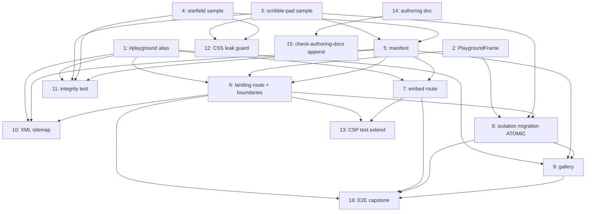

# Tasks Document

Tasks are listed in a **topological order** consistent with the DAG below; linear document order does not imply serial execution. The playground feature is mostly wiring over an already-validated foundation, so the graph has a few independent branches (alias, authoring doc, samples) that converge on the routes, plus **one deliberately-bundled atomic task (Task 8)** that performs the *only* breaking change in the spec.

**The red-by-construction hazard and how it's handled.** Removing the `.playground-container` wrapper from `(playground)/layout.tsx`, fixing M1 in `playground.css`, deleting the `/spike` fixture, and re-pointing `playground-isolation.test.ts` from `/spike` onto the same-page sample **must all land in one commit** — any subset leaves the isolation suite red (e.g. M1-fixed but still pointing at the broken-state `/spike` constants; or `/spike` deleted but the test still navigating to it). Task 8 bundles exactly these four edits and depends on the sample + same-page route already existing (Tasks 2/3/6), so it is the single point where the foundation flips, and the tree is green before and after it (design → *Implementation sequencing*, "Removing `/spike` must land in the same change as re-pointing the isolation test").

**One transient cosmetic state (not red, r1 C2).** Between Task 6 (the same-page route renders `<PlaygroundFrame>`) and Task 8 (which removes the group-layout wrapper), `/playground/scribble-pad` is wrapped by BOTH the group layout's `.playground-container` and `<PlaygroundFrame>`'s — a double `all: initial` nest. This is valid HTML/CSS and `next build` prerenders it without error (Task 6's `Success:` requires "no error," which holds); it is only cosmetically odd and no test points at that route until Task 8 re-points the isolation suite. A reviewer eyeballing the intermediate should not flag the double-reset surface as a regression — Task 8 resolves it.

## Revision history

- **v4 (post-r3 adversarial review of tasks.md, FINAL)**: r3 verified all four v3 deltas against live code and judged the breakdown **converged and execution-ready — zero blockers, zero new findings, no conclusion to reverse**, explicitly declining to manufacture a fourth-round objection. Confirmations: (F1) `node scripts/run-e2e.mjs playground-isolation` is in both Task 8's step-5 body and `_Prompt`; `run-e2e.mjs:102` forwards `argv.slice(2)` to `playwright test` and the positional resolves to exactly `e2e/tests/playground-isolation.test.ts` (the Task-16 `playground.test.ts` does not contain that substring) — runs the isolation spec alone. (F2) Task 3 body + `Success` both say six hooks; no stale count remains. (F3) the radius pin is correct — the live test reads the four `border*Radius` longhands each `=== "10px"` (`playground-isolation.test.ts:319-322,333-336`) and the `border-radius` shorthand produces exactly that; `var(--primary)`/`var(--primary-foreground)` both retained. (F4) the supersession note is accurate — `design.md:415-420` lists three illustrative hooks and Decision #7 (`requirements.md:245`) licenses "equivalent `data-testid` hooks," so the six-hook set is a refinement, not a contradiction. No body changes were required in v4; the implementer carry-forward items (the prod-build RGB pin, the `#playground` alias under Vitest, `next/dynamic` SSR + the `_components` folder, the Vercel-preview re-check) are already folded into `Success:` lines, not gaps.
- **v3 (post-r2 adversarial review of tasks.md)**: r2 verified both r1 blockers are **closed** — critically confirming the six-fixture panel matches the *asserted computed values* (not just selector names) on all six hooks with the same CSS mechanism (inline-style fixtures stay inline, the Tailwind fixture stays utility-class), and that the CI steps land in the correct `ci` job after the toolchain setup — and found **no new blocker**, only four one-line precision items; all accepted. (1) **(Medium) Task 8's step-5 RGB pin ran the whole E2E suite.** `run-e2e.mjs` forwards args to `playwright test`, so v3 scopes the command to `node scripts/run-e2e.mjs playground-isolation` (the isolation spec only — no coupling to unrelated or not-yet-written suites). (2) **(Low) Task 3's `Success:` still said "three" hooks** — a stale pre-v2 leftover; v3 corrects it to six. (3) **(Low) `sample-token-target` radius under-specified** — v3 pins that it applies `var(--radius)` to `border-radius` (the four live radius assertions read `border*Radius`, exact `=== "10px"`). (4) **(Low, traceability) The six-hook set supersedes the design's illustrative three-hook table** (`design.md:415-420`) — a legitimate refinement (Decision #7's "equivalent `data-testid` hooks needed to host the migrated assertions"; the design table was illustrative, not exhaustive), not a contradiction; recorded here for traceability. r2 confirmed fine (no change): the six-fixture assertion match, `button.tsx` SSR-safety (pure UI primitive, no `(site)` coupling), the alias-dep edges (every manifest importer carries the Task-1 edge; Tasks 13/16 don't import the manifest), Task 3/Task 8 atomicity, ordering safety (Task 13-before-8, Task 11 after 3/4, the unused `PlaygroundFrame` export not tripping eslint/tsc), and the `EXPECTED_RADIUS`/`text-sm`-post-M1 invariants and `THEME_STORAGE_KEY`.
- **v2 (post-r1 adversarial review of tasks.md)**: r1 verified every citation against live code, found the DAG mostly sound and Task 8's atomicity/`/spike`-deletion safe, but surfaced **two execution-blockers** plus softer gaps — all accepted. (1) **(BLOCKER, R1) Task 12 silently required a `ci.yml` edit.** "Wired into CI alongside check:authoring-docs" is not a `package.json` change — the live `ci.yml` has no aggregator step (every gate is an explicit step: `ci.yml:48-49` run, `97-98` self-test). v2 names `.github/workflows/ci.yml` in Task 12's `File:`/`Success:` and specifies the two steps to add (the `pnpm check:playground-css` run + the `node --test` self-test), so Req 10.6's CI half is actually gated. (2) **(BLOCKER, R2) The `data-testid` hook set was two short.** The live `playground-isolation.test.ts` selects **six** descendant testids (`spike-plain-div`/`shadcn-button`/`tailwind-div`/`token-access`/`button-token`/`ac2-inherit`), but Task 3 + the design's illustrative table defined only three — an unspecified 6→3 migration that would timeout on a still-present selector or silently drop the inline-style-preservation, Tailwind-in-`@layer`, and direct-component-token tests (contradicting Req 10.2's "SHALL NOT regress"). v2 expands Task 3 to a **six-fixture isolation panel** mapping 1:1 onto the six live selectors and rewrites Task 8's re-point as an explicit **6→6 mapping**. (3) **(R4) Task 8's `[10,10,10]` "pin if it differs" was a hidden verify-then-edit loop.** v2 makes it a **named post-build verification step**: implement the flip with `[10,10,10]` as the hypothesis, then run the prod-build suite, read the actual serialized `color`, and pin the exact triple (noting `expectRgbEqual` is exact `toBe`, no tolerance). (4) **(R3) `applyDarkMode` literal `"theme"`.** v2 replaces the vague "re-audit" with a concrete instruction: import `THEME_STORAGE_KEY` from `theme-provider.tsx` instead of the literal `"theme"`, and update the stale `/spike` route-group comment. (5) **(R5) Req 1.2** is marked **convention/by-construction** in the matrix (no task fails on a future parallel list). (6) **Missing alias-dep edges:** Tasks 9 and 10 import `#playground/manifest`, so they gain a **Task 1** dependency edge (DAG adds 1→9, 1→10). (7) Task 16's `_Requirements` footer adds the 10.4/7.4 it already delivers; Task 13 also cleans the stale `/playground/spike` comment in `csp.test.ts`. r1 confirmed fine (no change): Task 8 atomicity + `/spike` deletion safety (no external importers), the green-before/after claim (the transient Task 6→8 double-`.playground-container` nest builds without error), the axe pass being blocking-mandated (`requirements.md:288`), and the `check-authoring-docs` append/count-bump scoping.
- **v1**: Initial decomposition of the approved **v4 design** (converged after three adversarial rounds on both requirements and design). The design verified every pinned mechanism against live code, so the tasks pin the design's load-bearing decisions rather than inventing structure: (a) a project-root **`#playground/*` alias** added to BOTH `tsconfig.json` and `vitest.config.ts` (Vitest has no tsconfig-paths plugin) is the prerequisite for every `src/app`/test consumer of the manifest (Task 1, design *Integration Points*); (b) the reset is **extracted into a route-private `<PlaygroundFrame>`** at `src/app/(playground)/_components/` and removed from the group layout, so the gallery/embed render outside the reset (Tasks 2, 8, Decision #9); (c) the **M1 fix is a second *unlayered* rule** re-declaring the four typographic properties, with the isolation test's broken-state constants flipped — `EXPECTED_CONTAINER_COLOR_RGB` to `[10,10,10]` asserted via the existing `expectRgbEqual` (NOT `expectLabClose`, which `parseLab`-throws on a real `color`), `INTENDED_PLAYGROUND_FONT_FRAGMENT` inverted to `toContain` (Task 8, Reqs 5.2/5.3); (d) the manifest is **data + lazy thunks + two pure partition helpers** (`landingParams`/`embedParams`) that the routes AND the integrity test share, so the test never imports a route `page.tsx` into jsdom (Tasks 5, 11, design F3 fix); (e) routes use **async `params`** (`params: Promise<{slug}>` + `await`) per Next 16 and the live `blog/[slug]` convention, with `dynamicParams = false` (Tasks 6, 7); (f) same-page and embed items are **SSR-prerendered** via SSR-on `dynamic` (no `ssr:false` opt-out), so the sample components guard browser globals behind `useEffect`/refs or the build fails (Tasks 3, 4, design r2-N2); (g) the **leak guard** greps `:global`/global-`@import`/`composes … from global` (Task 12, Req 10.6); (h) the **authoring-doc check is already parameterized** — this spec only appends a third `AUTHORING_DOCS` entry and bumps the one hardcoded count assertion (`notFoundLines.length === 2` → `AUTHORING_DOCS.length`) (Task 15, Req 11.2). The four **deferred-by-design verify-by-build items** (the `#playground` subpath alias resolving under Vitest; the `_components` folder being router-ignored + `next/dynamic` SSRing; the `[10,10,10]` prod-build RGB; the Vercel-preview isolation re-check) are folded into the relevant tasks' `Success:` criteria. A Requirements Coverage Matrix at the foot makes orphan-AC visibility explicit.

---

## `_Requirements:` footer semantics

Each task's `_Requirements:` footer lists the requirement IDs it **contributes to satisfying** (in whole or in part). A requirement may be covered by several tasks; the Requirements Coverage Matrix at the document foot gives the inverse mapping so orphan requirements are visible at review time. All `_Prompt` fields are written for a fresh-context implementer and begin with the spec-workflow re-entry instruction.

**Route ↔ E2E coupling (conscious).** The route/gallery tasks (6, 7, 9) have `Success:` halves — same-page item rendering inside `.playground-container`, the iframe framing its embed at the declared aspect, the gallery listing one card per entry — whose *mechanical* proof lives in **Task 16** (the E2E capstone) and **Task 11** (the integrity test), not in the route task itself. This is deliberate (thin route wiring; runtime proofs concentrated in the E2E suite). It is recorded here so Task 16 is never descoped on the assumption that 6/7/9 are independently gated — they are not.

**First-of-kind verification (carried from design, r2).** Three mechanisms have no existing instance in this repo and MUST be proven by a real build/run, not assumed: the `_components` underscore-private folder being router-ignored and `next/dynamic` SSRing+hydrating (Task 6 `Success`); the `#playground/*` subpath alias resolving under Vitest (Task 11 `Success`, fallback: `vite-tsconfig-paths` plugin or a relative import); and the post-M1 container RGB matching `[10,10,10]` against the real prod-build CSS (Task 8 `Success`).

---

- [x] 1. Add the `#playground/*` project-root import alias (tsconfig + vitest)
  - File: tsconfig.json, vitest.config.ts
  - Add `"#playground/*": ["./playground/*"]` to `tsconfig.json` `compilerOptions.paths` (alongside the existing `@/*` and `#site/content`). Add `"#playground": fileURLToPath(new URL("./playground", import.meta.url))` to `vitest.config.ts` `resolve.alias` (Vitest has no tsconfig-paths plugin, so the alias MUST be mirrored or the integrity test can't resolve `#playground/manifest`). The `#`-prefix mirrors the existing `#site/content` convention.
  - Purpose: make the project-root manifest importable from `src/app/` routes, `sitemap.ts`, and the Vitest integrity test (design *Integration Points*, F9). This is the foundational prerequisite for Tasks 5–7, 10, 11.
  - _Leverage: tsconfig.json (existing `paths`); vitest.config.ts (existing `resolve.alias` with `@`/`#site/content`)_
  - _Requirements: 1.1, 1.2 (enabling)_
  - _Depends on: (none)_
  - _Prompt: Implement the task for spec playground, first run spec-workflow-guide to get the workflow guide then implement the task: Role: Build-tooling developer (TS/Vite) | Task: Add a `#playground/*` → `./playground/*` alias to tsconfig.json paths AND a mirrored `#playground` → ./playground alias to vitest.config.ts resolve.alias. Mark in-progress before starting; call log-implementation when done, then mark complete. | Restrictions: Do not touch the existing `@`/`#site/content` aliases; do not add a vite-tsconfig-paths plugin yet (that is the documented fallback only if the bare alias fails to resolve a subpath). | _Leverage: tsconfig.json, vitest.config.ts | _Requirements: 1.1, 1.2 | Success: `pnpm typecheck` stays clean; a throwaway `import x from "#playground/anything"` resolves the path (verified once the manifest lands in Task 5)._

- [x] 2. Extract the reset into a route-private `<PlaygroundFrame>` (do NOT yet touch the group layout)
  - File: src/app/(playground)/_components/playground-frame.tsx (new)
  - Create a **server component** `PlaygroundFrame({ children })` that renders `
{children}
` and `import "@/styles/playground.css"` at the top (verbatim from the current group layout). This file is route-private (underscore folder → not a route) and off the item-import graph (items may not import from `src/app/`), resolving the design's F6 (it is NOT in `components/shared/`).
  - **Do not** modify `(playground)/layout.tsx` or `playground.css` in this task — that breaking change is bundled into Task 8. After this task, `<PlaygroundFrame>` exists but is unused (the group layout still wraps everything), so `/spike` and the isolation suite stay green.
  - Purpose: the single place the `.playground-container` reset is applied around same-page item surfaces (Req 5.1, Decision #9).
  - _Leverage: src/app/(playground)/layout.tsx (the existing `
` + `playground.css` import to move); src/styles/playground.css_
  - _Requirements: 5.1_
  - _Depends on: (none)_
  - _Prompt: Implement the task for spec playground, first run spec-workflow-guide to get the workflow guide then implement the task: Role: Next.js App Router developer | Task: Create src/app/(playground)/_components/playground-frame.tsx as a server component rendering the `.playground-container` reset div (with `data-testid="playground-container"`) and importing `@/styles/playground.css`. Mark in-progress before starting; log-implementation when done, then mark complete. | Restrictions: Server component (no "use client"); preserve the `data-testid` hook exactly; do NOT edit the group layout or playground.css in this task (Task 8 does the atomic flip). | _Leverage: (playground)/layout.tsx, playground.css | _Requirements: 5.1 | Success: the component compiles and typechecks; the existing `/spike` isolation suite is untouched and still green._

- [x] 3. Build the same-page sample item `scribble-pad` (SSR-safe canvas toy with isolation `data-testid` hooks)
  - File: playground/scribble-pad/index.tsx (new), playground/scribble-pad/styles.module.css (new)
  - A `"use client"` interactive `<canvas>` freehand-drawing toy whose CSS Module sets **clashing** values (a serif `font-family`, a non-site `color`/`background`, a custom layout) that would visibly conflict with the site theme if they leaked (Req 7.2). Render the item's own single `<h1>`. Import only from `src/lib/`, `src/components/ui/`, and its own dir (`@/` aliases; relative within the folder) — never `src/app/`, `src/components/shared/`, `src/components/layout/` (structure.md boundary, Req 6.3).
  - **Isolation-proof panel — SIX `data-testid` hooks (R2, 6→6 with the live suite).** Alongside the toy, render a small fixture panel carrying one hook per the **six** descendant selectors the live `playground-isolation.test.ts` reads, so Task 8's re-point is 1:1 and Req 10.2's "SHALL NOT regress" holds:
    - `data-testid="sample-plain-div"` — an inline-styled element (a red `color` + a `serif` font set via inline `style`) proving inline styles survive the reset (replaces `spike-plain-div-target`).
    - `data-testid="sample-font-target"` — a shadcn `<Button>` whose computed `font-family` must resolve to the re-established `ui-sans-serif` stack after M1 (replaces `spike-shadcn-button-target`).
    - `data-testid="sample-tailwind-div"` — `className="bg-blue-500 p-4 text-lg"` proving Tailwind utilities resolve inside the container's `@layer` (replaces `spike-tailwind-div-target`).
    - `data-testid="sample-token-target"` — an element using `var(--primary)`/`var(--primary-foreground)` via inline `style`, with `var(--radius)` applied specifically to `border-radius` (the live radius assertions read `border*Radius`, exact `=== "10px"`), proving the token re-declaration reaches descendants (replaces `spike-token-access-target`).
    - `data-testid="sample-button-token"` — a `<Button>` with inline `style` referencing `var(--primary)`/`var(--primary-foreground)` (replaces `spike-button-token-target`).
    - `data-testid="sample-leak-probe"` — a no-override control element for the host-leak guard, where `HOST_FONT_FAMILY_FRAGMENTS` (`["Geist"]`) must NOT appear (replaces `spike-ac2-inherit-target`).
  - **SSR-safety (design r2-N2):** the route SSR-prerenders this component (`dynamic` is SSR-on; no `ssr:false` opt-out). All `window`/`document`/`canvas.getContext`/`requestAnimationFrame`/`ref.current` access MUST be inside `useEffect`/event handlers — render only a bare `<canvas ref>` on the server. An unguarded browser global throws at `next build`.
  - Purpose: the same-page isolation proof + the copyable template + the host for the migrated isolation-regression assertions (Reqs 7.1, 7.2, 6.1, 6.3).
  - _Leverage: src/components/ui/ primitives if helpful; design *Sample items* + the `data-testid` hook table_
  - _Requirements: 6.1, 6.3, 7.1, 7.2_
  - _Depends on: (none)_
  - _Prompt: Implement the task for spec playground, first run spec-workflow-guide to get the workflow guide then implement the task: Role: React/canvas developer | Task: Build playground/scribble-pad/{index.tsx,styles.module.css} — a "use client" canvas drawing toy with a clashing CSS-Module palette/typography, an own `<h1>`, and a SIX-hook isolation panel (sample-plain-div, sample-font-target, sample-tailwind-div, sample-token-target, sample-button-token, sample-leak-probe) mapping 1:1 onto the six live playground-isolation.test.ts selectors. Initialize the canvas/context/animation in useEffect; render a bare `<canvas ref>` on the server. Mark in-progress before starting; log-implementation when done, then mark complete. | Restrictions: NO browser-global access at module/render scope (SSR-prerender will throw) — guard everything in useEffect; import only from src/lib, src/components/ui, and own dir (no src/app, components/shared, components/layout); CSS Module only, no `:global`/global `@import`/`composes … from global`. | _Leverage: src/components/ui, design Sample-items section | _Requirements: 6.1, 6.3, 7.1, 7.2 | Success: the component typechecks; it renders client-side with a working draw interaction; it carries the six data-testid hooks; no browser global runs during SSR (verified when the route prerenders in Task 6/8)._

- [x] 4. Build the iframe sample item `starfield` (SSR-safe full-bleed visualization)
  - File: playground/starfield/index.tsx (new), playground/starfield/styles.module.css (new)
  - A `"use client"` full-bleed, animated starfield using `position: fixed` and `100vw`×`100vh` (the canonical tech.md "needs its own viewport" case that would escape the same-page boundary, Req 7.3). It renders its own `<title>`-worthy heading: a single `<h1>` and document-appropriate structure (the embed route supplies `<title>` via metadata and inherits `lang` from the root `<html>` — Req 4.6). Same SSR-safety rule as Task 3 (canvas/RAF in `useEffect`; bare `<canvas ref>` on the server). Same import boundary.
  - The manifest (Task 5) declares this entry's `frame: { aspectRatio: "16 / 10" }` so the host iframe is sized for it; this task ensures the content actually fills `100vw/100vh` within the iframe viewport.
  - Purpose: the iframe-isolation proof — a viewport-escaping visualization that justifies the separate browsing context (Reqs 7.1, 7.3, 4.6).
  - _Leverage: design *Sample items* (starfield) + *Standalone embed route*_
  - _Requirements: 6.3, 7.1, 7.3, 4.6_
  - _Depends on: (none)_
  - _Prompt: Implement the task for spec playground, first run spec-workflow-guide to get the workflow guide then implement the task: Role: React/canvas/animation developer | Task: Build playground/starfield/{index.tsx,styles.module.css} — a "use client" full-bleed position:fixed 100vw×100vh animated starfield with a single `<h1>`, initialized in useEffect (bare `<canvas ref>` on the server). Mark in-progress before starting; log-implementation when done, then mark complete. | Restrictions: NO browser-global access at module/render scope; import only from src/lib, src/components/ui, own dir; CSS Module only (no global escapes). | _Leverage: design Sample-items + embed-route sections | _Requirements: 6.3, 7.1, 7.3, 4.6 | Success: the component typechecks; it animates full-bleed inside its own viewport; a single `<h1>` is present; no browser global runs during SSR._

- [x] 5. Author the typed manifest with pure partition helpers
  - File: playground/manifest.ts (new)
  - Per the design's *Manifest layer*: `import type { ComponentType } from "react"` (type-only, erased — keeps the module server/build-safe, Req 1.3); export `type PlaygroundFrameHint = { aspectRatio: string } | { height: string }`; export `type PlaygroundItem = { slug; title; description; tags: string[]; iframeIsolated: boolean; load: () => Promise<{ default: ComponentType }>; frame?: PlaygroundFrameHint }`; export `const playgroundItems: PlaygroundItem[]` with the two entries — `scribble-pad` (`iframeIsolated: false`, `load: () => import("./scribble-pad")`) and `starfield` (`iframeIsolated: true`, `load: () => import("./starfield")`, `frame: { aspectRatio: "16 / 10" }`). Also export the two **pure partition helpers** the routes AND the integrity test share: `landingParams(items) = items.map(it => ({ slug: it.slug }))` and `embedParams(items) = items.filter(it => it.iframeIsolated).map(it => ({ slug: it.slug }))`.
  - **Server/build-safe invariant (Req 1.3):** no top-level `"use client"`, no React-runtime import (type-only), no browser global at module scope.
  - Purpose: the single source of truth + the shared partition logic that keeps the integrity test out of route `page.tsx` (Reqs 1.1, 1.2, 1.3, 1.5; design F3 fix).
  - _Leverage: design *Manifest layer* code block; structure.md manifest field names (`slug/title/description/tags/iframeIsolated`)_
  - _Requirements: 1.1, 1.2, 1.3, 1.5_
  - _Depends on: 3, 4 (the `./scribble-pad` / `./starfield` import thunks must resolve to existing folders for typecheck)_
  - _Prompt: Implement the task for spec playground, first run spec-workflow-guide to get the workflow guide then implement the task: Role: TypeScript developer | Task: Create playground/manifest.ts exporting PlaygroundItem/PlaygroundFrameHint types, the two-entry playgroundItems array (scribble-pad same-page, starfield iframe with `frame: { aspectRatio: "16 / 10" }`), and the pure landingParams/embedParams helpers. Mark in-progress before starting; log-implementation when done, then mark complete. | Restrictions: type-only React import (no runtime); NO "use client", no browser globals at module scope; lazy `() => import("./slug")` thunks only (no eager item imports); field names exactly per structure.md. | _Leverage: design Manifest-layer block | _Requirements: 1.1, 1.2, 1.3, 1.5 | Success: `pnpm typecheck` clean; the module imports cleanly in a Node/server context (no client-only deps)._

- [x] 6. Build the per-item landing route + loading/error boundaries
  - File: src/app/(playground)/playground/[slug]/page.tsx (new), .../[slug]/loading.tsx (new), .../[slug]/error.tsx (new)
  - Per the design's *Per-item landing route*: a **server** component with `type Params = Promise<{ slug: string }>`, `export const dynamicParams = false`, `generateStaticParams() { return landingParams(playgroundItems) }`, and `async generateMetadata({ params })` + `async ItemLanding({ params })` that `await params`. Look up the entry; `notFound()` if absent (defensive). For `iframeIsolated: false`: render `<PlaygroundFrame>` wrapping `const Item = dynamic(it.load)` + a `<noscript>` notice (Req 3.5). For `iframeIsolated: true`: render a themed `<main>` with `<h1>` title + `
` description (real indexable text, Req 4.1/8.5) + an `<iframe>` to the embed route (accessible `title`, `className="w-full"`, inline `style` sized from `frame` — aspect-ratio/height, default `16 / 10`). `generateMetadata` returns indexable per-item title/description (Req 8.2). `loading.tsx` is a server component; `error.tsx` is `"use client"` (covers render throws + thunk rejections, not post-hydration item bugs — Req 3.5).
  - Purpose: the linkable per-item route routing same-page vs iframe (Reqs 3.1–3.5, 4.1, 4.4, 8.2, 8.5).
  - _Leverage: src/app/(site)/blog/[slug]/page.tsx (the live async-`params` convention to mirror); src/app/(playground)/_components/playground-frame.tsx; #playground/manifest; design *Per-item landing route* block_
  - _Requirements: 3.1, 3.2, 3.3, 3.4, 3.5, 4.1, 4.4, 8.2, 8.5_
  - _Depends on: 1, 2, 5_
  - _Prompt: Implement the task for spec playground, first run spec-workflow-guide to get the workflow guide then implement the task: Role: Next.js 16 App Router developer | Task: Build the [slug] landing route + loading.tsx + error.tsx per the design — async params (Promise + await, matching blog/[slug]), dynamicParams=false, generateStaticParams=landingParams, same-page = `<PlaygroundFrame>` + `dynamic(it.load)` + `<noscript>`, iframe = themed h1/p + sized `<iframe>` to /embed. Mark in-progress before starting; log-implementation when done, then mark complete. | Restrictions: server component for page/loading; error.tsx is "use client"; params are async (await); `dynamic(it.load)` WITHOUT `ssr:false`; iframe carries an accessible `title` and explicit dimensions. | _Leverage: blog/[slug]/page.tsx, playground-frame.tsx, #playground/manifest | _Requirements: 3.1, 3.2, 3.3, 3.4, 3.5, 4.1, 4.4, 8.2, 8.5 | Success: `next build` prerenders both `/playground/scribble-pad` (same-page, SSR'd+hydrated client item) and `/playground/starfield` (iframe host) with NO error — proving `next/dynamic` SSRs and the `_components` folder is router-ignored (first-of-kind verifications); an unknown slug 404s; `pnpm typecheck` clean._

- [x] 7. Build the standalone iframe embed route
  - File: src/app/(playground)/playground/[slug]/embed/page.tsx (new)
  - Per the design's *Standalone embed route*: a **server** component with `type Params = Promise<{ slug: string }>`, `dynamicParams = false`, `generateStaticParams() { return embedParams(playgroundItems) }` (iframe-only slugs), `async generateMetadata` returning `{ title: it?.title, robots: { index: false } }` (noindex + own `<title>`, Reqs 4.6, 8.4), and `async ItemEmbed({ params })` that `await params`, `notFound()`s on a missing-or-non-iframe slug (so a same-page slug's `/embed` cleanly 404s, Req 4.5), and renders `const Item = dynamic(it.load)` **full-bleed, NOT wrapped in `<PlaygroundFrame>`** (Req 4.3). It lives under `/playground/` (inherits the CSP exemption, Req 4.2), inherits root-layout body theming/fonts/providers but no header/footer chrome.
  - Purpose: the standalone browsing context for iframe items (Reqs 4.2, 4.3, 4.5, 4.6, 8.4).
  - _Leverage: #playground/manifest (`embedParams`); design *Standalone embed route* block_
  - _Requirements: 4.2, 4.3, 4.5, 4.6, 8.4_
  - _Depends on: 1, 5_
  - _Prompt: Implement the task for spec playground, first run spec-workflow-guide to get the workflow guide then implement the task: Role: Next.js 16 App Router developer | Task: Build the [slug]/embed route — async params, dynamicParams=false, generateStaticParams=embedParams (iframe-only), noindex metadata with own title, notFound() on missing/non-iframe slug, full-bleed `dynamic(it.load)` NOT wrapped in PlaygroundFrame. Mark in-progress before starting; log-implementation when done, then mark complete. | Restrictions: server component; async params; noindex; NOT under /api; NOT wrapped in the reset; a same-page slug's /embed must 404. | _Leverage: #playground/manifest, design embed-route block | _Requirements: 4.2, 4.3, 4.5, 4.6, 8.4 | Success: `next build` prerenders `/playground/starfield/embed`; `/playground/scribble-pad/embed` 404s; the embed serves the item full-bleed with its own `<title>`/`<h1>`; `pnpm typecheck` clean._

- [x] 8. Isolation migration (ATOMIC: layout pass-through + M1 fix + remove /spike + re-point the isolation suite)
  - File: src/app/(playground)/layout.tsx, src/styles/playground.css, src/app/(playground)/spike/ (delete), e2e/tests/playground-isolation.test.ts
  - **All four edits land together (see the red-by-construction note at the top).**
    1. **Layout pass-through:** reduce `(playground)/layout.tsx` to `return children` — remove the `.playground-container` wrapper and the `playground.css` import (now owned by `<PlaygroundFrame>`).
    2. **M1 fix:** in `playground.css`, add a second **unlayered** rule on `.playground-container` *after* the reset block re-declaring `font-family` (the `ui-sans-serif, …` stack), `font-size: 16px`, `line-height: 1.5`, `color: oklch(0.145 0 0)`; **remove those four declarations from the `@layer playground` block** (tokens + `color-scheme: light` stay layered — a conscious non-move, design F5). Reset CSS itself is unchanged/not weakened.
    3. **Remove the spike:** delete `src/app/(playground)/spike/` (`page.tsx` + `spike-overlays.tsx`) — the M2 overlay-containment matrix is intentionally retired (Req 10.2, Decision #7).
    4. **Re-point + flip the isolation suite** (`playground-isolation.test.ts`): change the `SPIKE_PATH` navigation to `/playground/scribble-pad`; **re-point all six descendant selectors 1:1** — `spike-plain-div-target`→`sample-plain-div`, `spike-shadcn-button-target`→`sample-font-target`, `spike-tailwind-div-target`→`sample-tailwind-div`, `spike-token-access-target`→`sample-token-target`, `spike-button-token-target`→`sample-button-token`, `spike-ac2-inherit-target`→`sample-leak-probe` — plus the `data-testid="playground-container"` container (R2). **Flip the broken-state constants** — invert `INTENDED_PLAYGROUND_FONT_FRAGMENT` from `not.toContain` (line 240) to `toContain`; flip `EXPECTED_CONTAINER_COLOR_RGB` from `[0,0,0]` to **`[10,10,10]`** (hypothesis — confirmed in step 5) asserted via the existing `expectRgbEqual` (NOT `expectLabClose` — the real `color` serializes to sRGB, design Blocker 2), on both the light baseline and the dark "stays light" re-read; rewrite the lines 54-63 broken-state comment; remove the `SPIKE FINDING` blocks; **in `applyDarkMode`, import `THEME_STORAGE_KEY` from `theme-provider.tsx` and use it instead of the literal `"theme"` (line 160), and update the stale `/spike` route-group comment (lines 36-37)** (R3). Keep `EXPECTED_RADIUS = "10px"` and the `HOST_FONT_FAMILY_FRAGMENTS = ["Geist"]` host-leak guard (Reqs 5.4, 5.5).
    5. **Post-build RGB pin (R4 — completes edit 4, not a separate commit):** after the four edits, run **only the isolation spec** against the **prod build** (`node scripts/run-e2e.mjs playground-isolation` — `run-e2e.mjs` forwards the positional filter to `playwright test`, so this runs the isolation spec alone, not the whole suite or the not-yet-written `playground.test.ts`), read the *actual* serialized container `color`, and pin `EXPECTED_CONTAINER_COLOR_RGB` to that exact triple. `[10,10,10]` is the hypothesis from the toolchain's documented `#0a0a0a`; `expectRgbEqual` is an exact `toBe` match (no tolerance), so a 1-LSB serialization difference must be pinned, not tolerated.
  - Purpose: flip the foundation in one green-to-green step — gallery/embed render outside the reset, M1 is fixed, and the isolation suite proves it on the real sample (Reqs 5.1–5.5, 10.2).
  - _Leverage: design *Layout refactor* + *M1 typography fix* + the isolation-test re-point spec in *Testing Strategy*; the existing `playground-isolation.test.ts` harness (`applyDarkMode`, `expectRgbEqual`, computed-style probes); src/components/layout/theme-provider.tsx (exported `THEME_STORAGE_KEY`)_
  - _Requirements: 5.1, 5.2, 5.3, 5.4, 5.5, 10.2_
  - _Depends on: 2, 3, 6_
  - _Prompt: Implement the task for spec playground, first run spec-workflow-guide to get the workflow guide then implement the task: Role: Next.js + CSS-cascade + Playwright engineer | Task: In ONE change, reduce (playground)/layout.tsx to a pass-through, add the unlayered M1 typography rule to playground.css (removing those four declarations from @layer playground), delete src/app/(playground)/spike/, and re-point+flip e2e/tests/playground-isolation.test.ts from /spike onto /playground/scribble-pad — re-point all SIX descendant selectors 1:1 (spike-plain-div→sample-plain-div, spike-shadcn-button→sample-font-target, spike-tailwind-div→sample-tailwind-div, spike-token-access→sample-token-target, spike-button-token→sample-button-token, spike-ac2-inherit→sample-leak-probe) plus the playground-container, with EXPECTED_CONTAINER_COLOR_RGB=[10,10,10] via expectRgbEqual and INTENDED_PLAYGROUND_FONT_FRAGMENT inverted to toContain, importing THEME_STORAGE_KEY in applyDarkMode instead of literal "theme". Then run `node scripts/run-e2e.mjs playground-isolation` (isolation spec only) against the prod build and pin EXPECTED_CONTAINER_COLOR_RGB to the actual serialized value. Mark in-progress before starting; log-implementation when done, then mark complete. | Restrictions: the four code/test edits land in ONE commit (any subset leaves the suite red); do NOT weaken the reset; tokens + color-scheme stay layered; use expectRgbEqual NOT expectLabClose; re-point ALL SIX selectors (no test dropped — Req 10.2 no-regress); import THEME_STORAGE_KEY (no literal "theme"); pin the RGB to the exact prod-build serialization (expectRgbEqual is exact toBe, no tolerance); keep EXPECTED_RADIUS and the HOST_FONT_FAMILY_FRAGMENTS guard. | _Leverage: design Layout-refactor + M1 sections; existing isolation harness; theme-provider.tsx | _Requirements: 5.1, 5.2, 5.3, 5.4, 5.5, 10.2 | Success: the isolation suite (run against the prod build, Webpack) passes on /playground/scribble-pad in both themes with all six descendant assertions migrated; EXPECTED_CONTAINER_COLOR_RGB is pinned to the actual prod-build serialization (hypothesis [10,10,10]); `/spike` is gone; `pnpm typecheck`/build clean._

- [x] 9. Build the themed manifest-driven gallery
  - File: src/app/(playground)/playground/page.tsx
  - Replace the placeholder body with the design's *Gallery* block: a server component, **themed** (under the root `ThemeProvider`, NOT wrapped in `<PlaygroundFrame>`), `generateMetadata()` with title/description and `robots: { index: true }` (flip from the placeholder's `index: false`, Req 8.1). Render a minimal-chrome header (a `<Link href="/">` back to the site + the existing site **theme-toggle** component) and one shadcn `<Card>` per `playgroundItems` entry (title/description/tags) linking to `/playground/[slug]`. Empty manifest → a graceful empty state (Req 2.3). Single `<h1>`, semantic `<ul>/<li>`, keyboard-reachable (Req 2.4).
  - Purpose: the browseable, themed entry point (Reqs 2.1–2.5, 8.1).
  - _Leverage: src/components/ui/card.tsx; src/components/layout/theme-toggle.tsx (the existing exported toggle — works because ThemeProvider is in the ROOT layout); #playground/manifest; design *Gallery* block_
  - _Requirements: 2.1, 2.2, 2.3, 2.4, 2.5, 8.1_
  - _Depends on: 1, 5, 8 (imports `#playground/manifest`, so needs the alias from Task 1)_
  - _Prompt: Implement the task for spec playground, first run spec-workflow-guide to get the workflow guide then implement the task: Role: Next.js App Router + shadcn developer | Task: Replace the placeholder /playground gallery with a themed, indexable server component rendering a shadcn Card per manifest entry, a back-to-site link, the existing theme-toggle, an empty state, and a single `<h1>`. Mark in-progress before starting; log-implementation when done, then mark complete. | Restrictions: themed (NOT wrapped in PlaygroundFrame); flip robots to index:true; reuse the existing theme-toggle (do not rebuild); read playgroundItems only. | _Leverage: card.tsx, theme-toggle.tsx, #playground/manifest | _Requirements: 2.1, 2.2, 2.3, 2.4, 2.5, 8.1 | Success: /playground renders one card per item, themed in both light/dark, with a working back link + toggle and an empty-state branch; reports index:true; `pnpm typecheck`/build clean._

- [x] 10. Add manifest-derived landing URLs to the XML sitemap
  - File: src/app/sitemap.ts
  - Import `playgroundItems` from `#playground/manifest` and add one entry per item — the URL built as `new URL("/playground/" + it.slug, siteConfig.url).toString()` (matching the repo's existing URL construction). The existing `/playground` gallery entry (line 14) stays; **embed URLs are NOT added** (Req 8.4). Nothing else changes.
  - Purpose: list the indexable landing routes for discovery (Req 8.3), without advertising the `noindex` embeds.
  - _Leverage: src/app/sitemap.ts (existing static routes + URL construction); #playground/manifest_
  - _Requirements: 8.3_
  - _Depends on: 1, 5, 6 (imports `#playground/manifest`, so needs the alias from Task 1)_
  - _Prompt: Implement the task for spec playground, first run spec-workflow-guide to get the workflow guide then implement the task: Role: Next.js developer | Task: In src/app/sitemap.ts add one sitemap entry per playgroundItems slug (`/playground/<slug>` via `new URL(...).toString()`), keeping the existing `/playground` entry and adding NO embed URLs. Mark in-progress before starting; log-implementation when done, then mark complete. | Restrictions: landing URLs only (no `/embed`); match the file's existing URL-construction style; manifest must be the source (no hand-listed slugs). | _Leverage: sitemap.ts, #playground/manifest | _Requirements: 8.3 | Success: sitemap.xml lists `/playground` + `/playground/scribble-pad` + `/playground/starfield` and NO embed URL; `pnpm typecheck`/build clean._

- [x] 11. Add the manifest↔route integrity test
  - File: src/app/(playground)/playground/manifest-integrity.test.ts (new; under Vitest `src/**`)
  - Import `playgroundItems`, `landingParams`, `embedParams` from `#playground/manifest` **only** (NOT the route modules — design F3). Assert: every `slug` is unique and matches `^[a-z0-9]+(?:-[a-z0-9]+)*$`; `landingParams(playgroundItems)` equals all slugs; `embedParams(playgroundItems)` equals exactly the `iframeIsolated: true` slugs; and — closing the tautology (design r2-N1) — `fs.existsSync(path.join(process.cwd(), "playground", slug, "index.tsx"))` for every slug (a missing/typo'd item folder fails the test). The handoff is explicit: the missing-`embed/`-dir case stays with `next build` + E2E.
  - Purpose: fail CI on slug drift / a missing item module before a route collision or unbuildable import ships (Req 10.1).
  - _Leverage: src/content/seed-content.test.ts (the `process.cwd()` + node-fs pattern under jsdom Vitest); #playground/manifest; design *Testing Strategy → Unit/integrity*_
  - _Requirements: 10.1_
  - _Depends on: 1, 3, 4, 5_
  - _Prompt: Implement the task for spec playground, first run spec-workflow-guide to get the workflow guide then implement the task: Role: QA engineer (Vitest) | Task: Add src/app/(playground)/playground/manifest-integrity.test.ts importing playgroundItems/landingParams/embedParams from #playground/manifest and asserting slug uniqueness + kebab-case, the landing/embed partitions, and `fs.existsSync` of each `playground/<slug>/index.tsx`. Mark in-progress before starting; log-implementation when done, then mark complete. | Restrictions: import the manifest ONLY (never a route page.tsx); use `process.cwd()`-relative fs (the repo precedent); do not import next/dynamic or next/navigation. | _Leverage: seed-content.test.ts, #playground/manifest | _Requirements: 10.1 | Success: `pnpm test` passes the integrity test — PROVING the `#playground/manifest` subpath alias resolves under Vitest (if it does not, apply the design's fallback: vite-tsconfig-paths plugin or a relative import); a duplicate slug or a deleted item folder makes it fail._

- [x] 12. Add the CSS-Modules leak guard (script + self-test + package.json + CI steps)
  - File: scripts/check-playground-css.mjs (new), scripts/check-playground-css.test.mjs (new), package.json, .github/workflows/ci.yml
  - A small node script that recursively reads `playground/**/*.module.css` and fails (exit 1 + `::warning::`) on any `:global(`, any `@import` (incl. the `@import url(...)` form) whose target is not a `*.module.css`, or any `composes: … from global` (design F8 — these are the constructs that escape CSS-Module scoping; bare element selectors are permitted). Add a `check:playground-css` script to `package.json`. A colocated `node --test` self-test covers: a clean module (pass), `:global` (fail), a global `@import` (fail), and `composes … from global` (fail).
  - **CI wiring (R1 — `ci.yml` is a named file, not "free"):** the live `ci.yml` has no aggregator step, so add **two** steps mirroring the `check:authoring-docs` pair (`ci.yml:48-49` run + `ci.yml:97-98` self-test): a `Check playground CSS` step running `pnpm check:playground-css`, and a `Self-tests for check-playground-css` step running `node --test scripts/check-playground-css.test.mjs`. Without these the leak guard never runs in CI and Req 10.6's CI half is ungated even though the task looks done.
  - Purpose: keep the "items don't leak" safety story enforced cheaply (Reqs 6.2, 10.6).
  - _Leverage: scripts/check-authoring-docs.mjs (the `::warning::`/exit-code + self-test idiom); .github/workflows/ci.yml (the `Check authoring docs` step at 48-49 + the self-test step at 97-98 to mirror); design *CSS Modules + leak guard*_
  - _Requirements: 6.2, 10.6_
  - _Depends on: 3, 4 (the sample CSS Modules must exist and be clean for the production run to pass)_
  - _Prompt: Implement the task for spec playground, first run spec-workflow-guide to get the workflow guide then implement the task: Role: Node.js tooling + CI developer | Task: Create scripts/check-playground-css.mjs (greps playground/**/*.module.css for :global(, non-module @import incl. url(), and `composes … from global`), a node --test self-test covering clean/`:global`/`@import`/`composes`, a `check:playground-css` package script, AND two new ci.yml steps mirroring ci.yml:48-49 + 97-98 (a `pnpm check:playground-css` run step and a `node --test scripts/check-playground-css.test.mjs` self-test step). Mark in-progress before starting; log-implementation when done, then mark complete. | Restrictions: keep it a cheap grep (no full linter); bare element selectors are PERMITTED; the three escape constructs are the only failures; the CI steps MUST be added to .github/workflows/ci.yml (a package.json script alone does NOT run in CI). | _Leverage: check-authoring-docs.mjs idiom; ci.yml:48-49,97-98 | _Requirements: 6.2, 10.6 | Success: `node --test scripts/check-playground-css.test.mjs` passes; `pnpm check:playground-css` exits 0 against the clean sample modules and fails if a `:global`/global-`@import`/`composes-from-global` is introduced; AND both the run step and the self-test step exist in .github/workflows/ci.yml._

- [x] 13. Extend the CSP test to the nested playground paths
  - File: e2e/tests/csp.test.ts
  - Extend the existing `playground routes do not serve a CSP header` test to assert that `/playground`, `/playground/scribble-pad`, AND `/playground/starfield/embed` each serve **no** `Content-Security-Policy` header (Req 10.5) — confirming the negative-lookahead opt-out holds for the nested paths a future regex refactor could regress. Also asserts the same-origin embed iframe loads without a framing error (Req 9.2, covered structurally by the no-CSP + no-`X-Frame-Options` state). Clean the now-stale `/playground/spike` mention in the file's header comment (the spike fixture is deleted in Task 8).
  - Purpose: lock the route-scoped CSP opt-out on the nested paths (Reqs 10.5, 9.2).
  - _Leverage: e2e/tests/csp.test.ts (existing `/playground` assertion); design *Testing Strategy → E2E* CSP item_
  - _Requirements: 9.2, 10.5_
  - _Depends on: 6, 7_
  - _Prompt: Implement the task for spec playground, first run spec-workflow-guide to get the workflow guide then implement the task: Role: QA automation engineer (Playwright) | Task: Extend e2e/tests/csp.test.ts to assert no Content-Security-Policy header on /playground, /playground/scribble-pad, and /playground/starfield/embed. Mark in-progress before starting; log-implementation when done, then mark complete. | Restrictions: extend the existing test file; assert header ABSENCE on all three nested paths; do not modify next.config.ts. | _Leverage: csp.test.ts | _Requirements: 9.2, 10.5 | Success: the extended csp suite passes against the prod build, confirming all three playground paths are CSP-exempt._

- [x] 14. Author the playground authoring doc
  - File: docs/playground-authoring.md (new)
  - Following the tone/structure of `docs/contributions-and-resources-authoring.md`/`slash-pages-authoring.md`, with EXACTLY the seven canonical headings the CI check gates (Task 15): `## Where item modules live`, `## Adding a manifest entry`, `## Choosing an isolation mode`, `## CSS Modules and the no-global-CSS rule`, `## Import boundaries`, `## Overlay containment (M2)`, `## Launch constraints`. Cover: item modules at `playground/[slug]/index.tsx` (client component) + `styles.module.css`; the manifest-entry shape; the "when in doubt, use iframe" rule + the iframe-required pattern list; the CSS-Modules + no-global-CSS rule (`:global`, global-`@import`, `composes … from global`), plus the note that same-page form controls render under `color-scheme: normal`; the **SSR-safety rule** (items are SSR-prerendered via SSR-on `dynamic` — guard `window`/`document`/`canvas`/`requestAnimationFrame`/`ref.current` behind `useEffect`/refs; no `ssr:false` opt-out); the `@/`-alias / no-`src/app`-import boundary; the M2 overlay-containment decision rule; `target="_blank"` → `rel="noopener noreferrer"` (Req 9.4); and the launch constraints (client-only, no backend, first-party-only, CSP-as-authorship-privilege-not-sandbox).
  - Purpose: the single authoring contract (Reqs 11.1, 11.3, 3.6, 9.3, 9.4); also the gated artifact for Task 15.
  - _Leverage: docs/slash-pages-authoring.md (tone/structure); design *Authoring doc* section_
  - _Requirements: 11.1, 11.3, 3.6, 9.4_
  - _Depends on: (none)_
  - _Prompt: Implement the task for spec playground, first run spec-workflow-guide to get the workflow guide then implement the task: Role: Technical writer / maintainer | Task: Create docs/playground-authoring.md with the seven canonical headings, documenting module location, manifest entries, isolation-mode choice, the no-global-CSS rule (+ color-scheme:normal note), the SSR-safety rule, import boundaries, the M2 decision rule, the rel=noopener rule, and the launch constraints. Mark in-progress before starting; log-implementation when done, then mark complete. | Restrictions: the seven `##` headings must match the PLAYGROUND_HEADINGS set in Task 15 byte-for-byte; follow the sibling doc's tone. | _Leverage: slash-pages-authoring.md | _Requirements: 11.1, 11.3, 3.6, 9.4 | Success: the doc exists with all seven canonical headings and covers the SSR-safety + no-global-CSS + isolation-mode + launch constraints._

- [x] 15. Append the playground doc to `check-authoring-docs` and fix the count assertion
  - File: scripts/check-authoring-docs.mjs, scripts/check-authoring-docs.test.mjs
  - **Script:** export `PLAYGROUND_HEADINGS` (the seven Task-14 headings) and append `{ path: "docs/playground-authoring.md", headings: PLAYGROUND_HEADINGS }` as the third `AUTHORING_DOCS` entry. (The file is ALREADY parameterized over `AUTHORING_DOCS` with `main(docs)` iterating — no structural change.)
  - **Self-test:** the `writeDocs` helper already iterates `AUTHORING_DOCS`, so it writes all three docs automatically. The ONE assertion that hardcodes the doc count is the "neither doc written" test (`check-authoring-docs.test.mjs:110`, `assert.equal(notFoundLines.length, 2, …)`); change it to `AUTHORING_DOCS.length` (drift-proof) and reword the test title's "two" to match. The pure-core tests and the zero-byte `warningCount === subjectHeadings.length` test (subject stays slash-pages) are unaffected.
  - Purpose: gate the new doc for heading-drift with the existing machinery, no new CI script (Req 11.2).
  - _Leverage: scripts/check-authoring-docs.mjs (`AUTHORING_DOCS`/`main`); scripts/check-authoring-docs.test.mjs (the `notFoundLines.length === 2` assertion at line 110)_
  - _Requirements: 11.2_
  - _Depends on: 14_
  - _Prompt: Implement the task for spec playground, first run spec-workflow-guide to get the workflow guide then implement the task: Role: Node.js tooling developer | Task: Export PLAYGROUND_HEADINGS and append the third AUTHORING_DOCS entry (docs/playground-authoring.md) in scripts/check-authoring-docs.mjs, and change the self-test's `notFoundLines.length === 2` (line 110) to `=== AUTHORING_DOCS.length` (rewording the title). Mark in-progress before starting; log-implementation when done, then mark complete. | Restrictions: only append the entry + bump the count assertion; do not alter the parameterized core or the subject (slash-pages) tests; keep CANONICAL_HEADINGS/SLASH_PAGES_HEADINGS exports. | _Leverage: check-authoring-docs.mjs + .test.mjs | _Requirements: 11.2 | Success: `node --test scripts/check-authoring-docs.test.mjs` passes (the count assertion now matches three docs); `pnpm check:authoring-docs` exits 0 with all three docs present and fails if a playground heading is removed._

- [x] 16. Add the Playwright E2E capstone (render, sizing, 404, embed a11y, CSP-clean, axe, both themes)
  - File: e2e/tests/playground.test.ts (new)
  - Per the design's *Testing Strategy → E2E*, against the prod `pnpm start` build (Webpack), parameterized over `["light","dark"]` (Req 10.6):
    - **Gallery → samples render** (Req 10.3): open `/playground`, click into each sample. Same-page: item content visible inside `[data-testid="playground-container"]`. iframe: the `<iframe>` present, its embed document loaded, and its box width > 0 (spans the column) AND `height ≈ width × 10/16` within tolerance (a **ratio** assertion, design F7). Select by `data-testid` only (Req 10.3).
    - **404 behavior** (Reqs 3.2, 4.5): `/playground/does-not-exist` → 404; `/playground/scribble-pad/embed` (a same-page slug's embed) → 404.
    - **Embed a11y** (Req 4.6): the `starfield` embed document has a `<title>` and a single `<h1>`.
    - **Console/page-error cleanliness:** attach `console` (error-level only) + `pageerror` listeners; assert no errors on the gallery + both landing pages (no Pagefind carve-out needed — the search dialog is never opened).
    - **Axe/WCAG pass — cross-spec convention** (NFR Accessibility, blocking): using the same `AxeBuilder().withTags(AXE_TAGS).analyze()` pattern as `blog-axe.test.ts`, run an a11y analysis on the **gallery** and the **iframe landing** (themed, indexable real-content pages) in each theme and assert zero violations. The same-page item *surface* is exempt where the toy intentionally subverts conventions (documented in the authoring doc); the gallery + iframe-landing chrome are not. `setupTheme`/`assertTheme`/`AXE_TAGS` are local/non-exported in the sibling suites — **copy** those three; `THEME_STORAGE_KEY` **is** exported in `theme-provider.tsx` — **import** it (don't hardcode `"theme"`). `@axe-core/playwright` is already a dependency.
  - Purpose: end-to-end render, iframe sizing, 404, embed a11y, CSP-clean, accessibility, and both-theme coverage (Reqs 10.3, 10.4, 3.2, 4.5, 4.6, NFR Accessibility).
  - _Leverage: e2e/tests/blog-axe.test.ts (copy local setupTheme/assertTheme/AXE_TAGS + AxeBuilder usage); src/components/layout/theme-provider.tsx (import THEME_STORAGE_KEY); e2e/tests/playground-isolation.test.ts (data-testid probing idiom); playwright.config.ts (prod server, baseURL); @axe-core/playwright_
  - _Requirements: 10.3, 10.4, 7.4, 3.2, 4.5, 4.6 (+ NFR Accessibility; the console-clean check backstops 7.4, the prod-build run delivers 10.4)_
  - _Depends on: 6, 7, 8, 9_
  - _Prompt: Implement the task for spec playground, first run spec-workflow-guide to get the workflow guide then implement the task: Role: QA automation engineer (Playwright) | Task: Create e2e/tests/playground.test.ts — both themes, prod build: gallery→sample render (same-page inside container; iframe present + box width>0 AND height≈width×10/16), 404s for unknown slug and same-page /embed, embed `<title>`+single `<h1>`, error-level console/pageerror cleanliness, and an AxeBuilder zero-violations pass on the gallery + iframe landing. Mark in-progress before starting; log-implementation when done, then mark complete. | Restrictions: select by data-testid (never hashed class); iframe sizing is a RATIO assertion (not absolute px); copy the local setupTheme/assertTheme/AXE_TAGS but IMPORT THEME_STORAGE_KEY; axe on gallery + iframe-landing (same-page toy surface exempt); no Pagefind carve-out. | _Leverage: blog-axe.test.ts, theme-provider.tsx, playground-isolation.test.ts, playwright.config.ts | _Requirements: 10.3, 3.2, 4.5, 4.6, NFR Accessibility | Success: `node scripts/run-e2e.mjs` passes the new suite — render, sizing ratio, 404s, embed a11y, console-clean, and axe — in both themes against the prod build; also re-check item isolation + iframe sizing on a Vercel preview before merge (NFR / Req 10.4)._

---

## Requirements Coverage Matrix

Inverse mapping (requirement → covering tasks) for orphan-AC visibility. "M" = manual verification at launch (NFRs / criteria not mechanically gated).

| Requirement | Covering task(s) |
|---|---|
| 1.1 typed manifest array + exported type | 5 |
| 1.2 single source (gallery, both gSP, loader derive) | 5, 6, 7, 9 (established **by construction**; not independently gated — no task fails on a future hand-maintained parallel list, R5) |
| 1.3 data + lazy thunks only; server/build-safe | 5 |
| 1.4 duplicate slug caught by integrity check | 11 |
| 1.5 iframe load thunk consumable by embed | 5, 7 |
| 2.1 one card per manifest entry | 9 |
| 2.2 themed, not reset-wrapped, shadcn Card | 8, 9 |
| 2.3 empty-manifest graceful state | 9 |
| 2.4 back link + theme toggle, keyboard-reachable | 9 |
| 2.5 statically generated gallery | 9 |
| 3.1 same-page inline in container; server boundary | 6 |
| 3.2 dynamicParams=false → 404 | 6, 16 |
| 3.3 lazy load thunk (code-split) | 6 |
| 3.4 gSP enumerates all slugs | 6 |
| 3.5 loading + error boundary + noscript | 6 |
| 3.6 M2 containment authoring rule | 14 |
| 4.1 iframe host + real title/desc text | 6 |
| 4.2 embed under /playground/, not /api | 7 |
| 4.3 embed standalone, not reset-wrapped | 7 |
| 4.4 iframe explicit dims from `frame` | 6, 16 |
| 4.5 embed gSP iframe-only; same-page /embed 404s | 7, 16 |
| 4.6 embed doc a11y (title/lang/h1) | 4, 7, 16 |
| 5.1 keep two-part CSS; PlaygroundFrame; remove from layout | 2, 8 |
| 5.2 M1 unlayered typography fix | 8 |
| 5.3 test-fallout flips (rgb/font/comments/applyDarkMode) | 8 |
| 5.4 dark-mode item stays light | 8 |
| 5.5 host-leak guard retained | 8 |
| 6.1 colocated CSS Module for same-page items | 3 |
| 6.2 no global CSS; leak guard | 12 |
| 6.3 items at project root; `@/` alias; no src/app import | 3, 4 |
| 7.1 one same-page + one iframe sample | 3, 4 |
| 7.2 same-page conflicting styles + data-testid | 3 |
| 7.3 iframe full-bleed + concrete `frame` | 4, 5 |
| 7.4 samples render, no leakage, data-testid | 8, 16 |
| 8.1 gallery indexable + metadata | 9 |
| 8.2 landing per-item indexable metadata | 6 |
| 8.3 landing routes in XML sitemap from manifest | 10 |
| 8.4 embed noindex + not in sitemap | 7, 10 |
| 8.5 iframe landing real title/desc text | 6 |
| 9.1 rely on existing CSP opt-out (verify-only) | 13, M |
| 9.2 same-origin embed loads (no framing error) | 13, 16 |
| 9.3 no auth/data; CSP-as-privilege (authoring) | 14 |
| 9.4 item `target="_blank"` → rel=noopener (authoring) | 14 |
| 10.1 manifest↔route integrity (+ item-module existence) | 11 |
| 10.2 isolation suite re-point + M1 fallout + leak retained; M2 matrix retired | 8 |
| 10.3 E2E samples render + iframe sizing, data-testid | 16 |
| 10.4 prod-build (Webpack) run + Vercel preview re-check | 16, M |
| 10.5 CSP absent on nested paths | 13 |
| 10.6 leak guard CI; both-theme E2E | 12, 16 |
| 11.1 authoring-doc content | 14 |
| 11.2 gated by check-authoring-docs + self-test | 15 |
| 11.3 launch constraints in doc | 14 |
| NFR Performance (gallery Lighthouse 90+) | M |
| NFR Accessibility (WCAG AA, both themes) | 16 (axe gallery + iframe-landing per theme), M (contrast/same-page surface at launch) |
| NFR Reliability (fail-loud build; 404s; empty manifest) | 6, 7, 9, 11, M (next build) |
| NFR Security (CSP scope; first-party; rel) | 13, 14 |

---

## Orchestration log

- [x] Task 1 — `#playground/*` alias added to tsconfig + vitest; typecheck clean; review pass.
- [x] Task 2 — `PlaygroundFrame` route-private server component with data-testid hook; layout untouched; review pass.
- [x] Task 3 — `scribble-pad` SSR-safe canvas toy + six isolation hooks; review pass.
- [x] Task 4 — `starfield` SSR-safe full-bleed visualization; review pass.
- [x] Task 5 — typed manifest + pure landingParams/embedParams; server/build-safe; review pass.
- [x] Task 14 — playground authoring doc, seven byte-exact headings; review pass.
- [x] Task 6 — [slug] landing route + loading/error boundaries; build prerenders both routes; review pass.
- [x] Task 7 — [slug]/embed standalone noindex route; review pass.
- [x] Task 8 — ATOMIC migration: layout pass-through + unlayered M1 (color→#0a0a0a for mandated expectRgbEqual) + /spike deleted + isolation suite re-pointed (6 selectors); prod-build green both themes, RGB pinned [10,10,10]; two impl blockers (lab-serialization, panel font inheritance) resolved; review pass (Info comments cleaned).
- [x] Task 9 — themed gallery, index:true, reused ThemeToggle, empty-state; review pass.
- [x] Task 10 — manifest-derived landing URLs in XML sitemap, no embeds; review pass.
- [x] Task 11 — manifest↔route integrity test 7/7; #playground alias resolves under Vitest natively; review pass.
- [x] Task 12 — CSS leak guard script + 11/11 self-test + two CI steps; review pass.
- [x] Task 13 — CSP test extended to three nested playground paths + X-Frame-Options; 8/8; review pass.
- [x] Task 15 — appended playground doc to check-authoring-docs (drift-proof count); 7/7; review pass.
- [x] Task 16 — E2E capstone (render/iframe-ratio/404/embed-a11y/console/axe, both themes) 24 passed; review pass.

**All 16 tasks complete.** Manual-at-launch items remain per the coverage matrix (NFR Performance/Lighthouse, contrast, the Vercel-preview iframe/isolation re-check for Turbopack↔Webpack `@layer` divergence).
