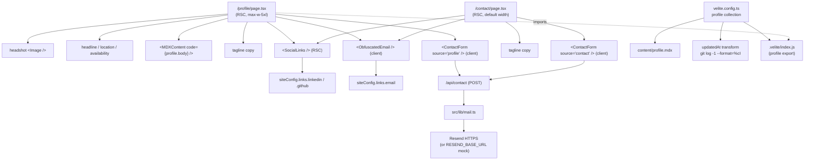
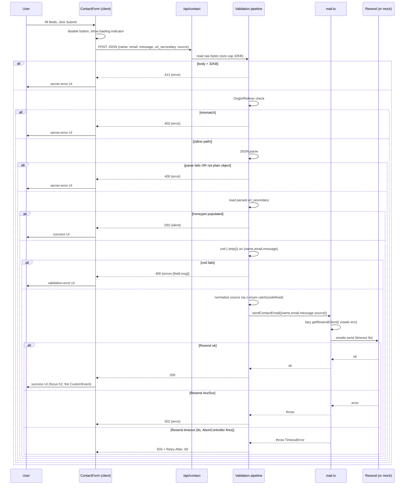

# Design Document

## Overview

The professional-profile feature delivers two routes (`/profile`, `/contact`), a content pipeline addition (a Velite single-document `profile` collection), three reusable contact components, one API route, one server-side mail helper, an extended site config, a CSP addition, and a Playwright smoke-test harness with a sidecar Resend mock.

The split of responsibility:

- **Routes** own page-level concerns: container width, headshot/headline composition (profile only), tagline copy, sibling-component composition, metadata.
- **Shared components** (`src/components/shared/`) own atomic concerns: link list, click-to-reveal email, form. Layout-agnostic — they do not impose width.
- **API route** (`src/app/api/contact/route.ts`) is the single chokepoint for all submissions from both pages, applying the layered defense in the order required by Req 3.5.
- **Mail helper** (`src/lib/mail.ts`) owns Resend transport (direct `fetch` with an `AbortController`-backed 9s timeout), env-tuple-cached client config, the subject template, and the user-input-to-`text`-only contract.
- **Velite collection** (`profile`, single) lives alongside the existing `pages` collection; both write to `.velite/` and are imported via `#site/content`.
- **CI harness** spawns a local HTTP mock that the API talks to via `RESEND_BASE_URL`; a wrapper script ensures env-var ordering across the Playwright `webServer` child process.

This design records *how* the requirements compose into a buildable implementation; it does not re-state the requirements themselves.

## Steering Document Alignment

### Technical Standards (tech.md)

- **Server components by default**: `/profile/page.tsx`, `/contact/page.tsx`, `<SocialLinks />` are RSCs. Only `<ContactForm />` and `<ObfuscatedEmail />` are `"use client"` (interactive state and runtime DOM behavior, respectively).
- **Static-first**: Both pages declare `export const dynamic = 'force-static'` (Req 1.9), participating in the project's "all main pages are statically generated at build time" posture. **Directive note (r2-§5)**: Req 1.9 explicitly mandates `force-static` *and* states its intent is to "prevent silent degradation to dynamic rendering if an implementer accidentally calls `headers()`/`cookies()`." There is a real semantic tension: on Next 16, `force-static` *suppresses* the build error you would otherwise get for an accidental dynamic API (silently coercing to static) rather than failing loudly, whereas `export const dynamic = 'error'` *fails the build* on any dynamic-API usage — which is closer to the requirement's stated "surface the signal" intent. This design conforms to the approved requirement as written (`force-static`); the `'error'` alternative is flagged as a candidate requirements refinement for a future requirements revision, not changed unilaterally here. The runtime POST is unaffected either way — it targets the separate (dynamic) route handler, not the statically-rendered page.
- **Velite as the content pipeline** (tech.md content-pipeline section): the new `profile` collection is the second collection added (after `pages` from site-foundation), following the existing `defineCollection` + `s.object()` pattern.
- **Resend as the only outbound integration** (tech.md external-integrations): no other vendors introduced. Resend's HTTP API is called via the platform `fetch` (no SDK dependency — `fetch` gives the abort-signal control we need that the Resend SDK does not currently expose). `zod` is the only new server-side runtime dep.
- **CSP discipline** (tech.md security): the existing path-scoped CSP in `next.config.ts` is extended with `form-action 'self'` (Req-NFR-Security clause). No directive is loosened.
- **No barrel files / direct imports** (structure.md import-rules): each shared component is imported by its own file path; no `src/components/shared/index.ts` re-export.
- **`src/lib/` boundary** (structure.md module-boundaries): `src/lib/mail.ts` does not import from `src/components/` or `src/app/`; the API route imports it.
- **Vercel Hobby constraints** (tech.md deployment): the 9s Resend timeout (Req 3.8) sits inside the 10s function execution cap; the 100K-invocation/month cap is acknowledged in Req-NFR-Security but not actively defended (deferred).

### Project Structure (structure.md)

- New files land in their structure.md-prescribed homes: shared components in `src/components/shared/`; route handler at `src/app/api/contact/route.ts`; mail helper at `src/lib/mail.ts`; site-config field on `src/config/site.ts`.
- A new top-level `scripts/` directory is introduced for the E2E wrapper script (`scripts/run-e2e.mjs`). This is not pre-described in structure.md but is a thin operational glue file for CI; it does not add a new architectural surface.
- A new top-level `vercel.json` is introduced (Req 1.4 shallow-clone remedy). This is a single-file deployment config and does not affect source layout.
- Component files use `kebab-case.tsx` filenames with `PascalCase` named exports (structure.md naming-conventions): `social-links.tsx` → `SocialLinks`, `obfuscated-email.tsx` → `ObfuscatedEmail`, `contact-form.tsx` → `ContactForm`.
- `content/profile.mdx` lives at `content/` root (not under `content/pages/`). The justification is *not* "filename collision avoidance" — the existing `pages` collection's `pattern: "pages/*.mdx"` only matches files inside `content/pages/`, so a hypothetical `content/pages/profile.mdx` would simply be picked up as a `Page` document with the existing schema. The real reason the profile lives in its own collection (and therefore at root) is that this spec needs richer typed frontmatter than the generic `Page` schema offers — `headline`, `location`, `availability`, an `s.image()`-typed optional `headshot`, and the build-time `git log` transform that emits `updatedAt`. None of these belong on the shared `Page` schema. Collection-level isolation, not filename collision, is what motivates the separate file. Acknowledged precedent: future single-doc collections (e.g. a hypothetical richly-typed `now`) would either follow this pattern (root-level MDX with a dedicated collection) or fold into `pages/*.mdx` if the generic schema suffices. This spec does not foreclose either option for downstream specs.

## Code Reuse Analysis

### Existing Components to Leverage

- **`<MDXContent />` (`src/components/shared/mdx-content.tsx`)**: rendered in `/profile/page.tsx` to compile the Velite-emitted `body` code into a React component. Used as-is — no `components` argument, consistent with Req 1.13 (no custom MDX registry).
- **Site theme provider (`src/components/layout/theme-provider.tsx`)**: existing `next-themes` integration; the contact form and obfuscated email inherit theme via Tailwind class hooks (`dark:` variants). No theming logic added here.
- **shadcn/ui primitives** (existing or to be added via shadcn CLI): `Button`, `Input`, `Textarea`, `Label` from `src/components/ui/` are used by `<ContactForm />`. If any are not yet installed, they are pulled in with the shadcn CLI as part of task 1 (no novel UI primitives are written).
- **`siteConfig` (`src/config/site.ts`)**: extended in place with a new `links` field; existing fields (name, description, url, ogImage, navItems, heroCards) are untouched.
- **Existing CSP block in `next.config.ts`**: the `cspDirectives` array has one new directive appended (`"form-action 'self'"`); the path-scoped routing rule is unchanged.

### Integration Points

- **Velite `#site/content`**: `/profile/page.tsx` imports `profile` (singular, since `single: true` emits a single object, not an array) from `#site/content`. Type generation is automatic via Velite's `.velite/index.d.ts`.
- **Existing `metadataBase` in `src/app/layout.tsx`**: `metadata.alternates.canonical = '/profile'` resolves against this base to produce the absolute URL asserted by Req 6.3.
- **Existing root layout `<title>` template** (`%s | matthewfield.ca`): `/profile/page.tsx`'s `generateMetadata()` returns `title: profile.title`, which the template wraps. No layout-level changes.
- **Existing Playwright config (`e2e/playwright.config.ts`)**: kept; the wrapper script (`scripts/run-e2e.mjs`) invokes `playwright test --config=e2e/playwright.config.ts` after env preparation. The config's `webServer` clause is unchanged.
- **Existing CSP smoke test (`e2e/tests/csp.test.ts`)**: NOT modified. A new test file (`e2e/tests/contact-form.test.ts`) covers the form-specific CSP assertions of Req-NFR-Security; the two CSP tests run in parallel and assert different surfaces.

## Architecture

### Modular Design Principles

- **Single File Responsibility**:
  - `social-links.tsx` renders only social links; no email, no form.
  - `obfuscated-email.tsx` renders only the obfuscated email; no surrounding tagline copy.
  - `contact-form.tsx` renders only the form; tagline copy is owned by each consuming page.
  - `mail.ts` owns Resend client construction + the subject template; the route handler owns request validation.
- **Component Isolation**: No `<ContactSection>` wrapper (Req 5.3). `/profile` and `/contact` each compose the three shared components as siblings.
- **Service Layer Separation**: `src/lib/mail.ts` (transport) is decoupled from `src/app/api/contact/route.ts` (validation and HTTP shaping).
- **Utility Modularity**: The zod schema for the contact body is exported from the route file (it's not reused elsewhere); if a future spec adds a second consumer, it is hoisted to `src/lib/`.

### High-Level Component Graph



### Submission Flow (sequence)



### Form-State Machine (client)

The `<ContactForm />` component holds a single `state` value drawn from a discriminated union — no parallel boolean flags (`isSubmitting && !hasError && ...`) which create unrepresentable states.

```ts
type FormState =
  | { kind: 'idle' }
  | { kind: 'submitting' }
  | { kind: 'success' }
  | { kind: 'validation-error', errors: Record<'name' | 'email' | 'message', string | undefined> }
  | { kind: 'server-error', status: number | 'network', retryAfterSeconds?: number };
```

Transitions:

- `idle` → `submitting`: on submit handler; submit button disabled, "Sending…" text rendered (no rotating spinner; honors `prefers-reduced-motion`).
- `submitting` → `success`: HTTP 200. Inputs cleared. Focus moved to the success `<h2 tabIndex={-1}>`. `element.scrollIntoView({ behavior: prefersReducedMotion ? 'auto' : 'smooth' })`. `document.dispatchEvent(new CustomEvent('contact_submit_success'))`.
- `submitting` → `validation-error`: HTTP 400 with `{errors}`. Per-field error spans render with `aria-live="polite"`, associated via `aria-describedby` on each input. A top-level `role="alert"` summary renders. Input values preserved. Focus moves to the first invalid input.
- `submitting` → `server-error`: HTTP 429 / 502 / 503 / 504 / network failure. A `role="status"` region renders with the heading, "Try again" button, and inline LinkedIn CTA `<a>`. Focus moves to that region. Input values preserved. Re-submitting transitions back to `submitting`.
- Any error state + form edit: stays in same state but clears the per-field error for the edited field on `onChange`. (Server-error state is not cleared until "Try again" re-submits — the affordance to retry is the recovery path, not silent re-submit on edit.)

The transitions are pure state changes; the side effects (focus, scroll, fire CustomEvent) run in a `useEffect` whose dependency is a per-attempt counter, NOT `state.kind`. The form keeps an `attemptId: number` value in state that increments on every submit handler call (regardless of outcome), and the effect is keyed on `[attemptId, state.kind]`. This is necessary because React's `useEffect` dependency-array semantics use `Object.is` equality: keying the effect on `state.kind` alone would silently skip same-kind transitions like `validation-error → validation-error` (e.g. a user submits with two empty fields, fixes one, submits again with a different invalid field — the focus-management effect must re-fire to move focus to the new first-invalid input). Pairing `attemptId` (which always changes) with `state.kind` (which captures the outcome) ensures every submit attempt re-runs the effect exactly once. (Note: React StrictMode double-invokes effects in *development only*; the success `CustomEvent` would therefore fire twice in dev. This is harmless today — no subscriber exists — but a future analytics subscriber attaching to `contact_submit_success` must dedupe or accept dev double-counts. Production is single-invoke. A one-line comment in the component should flag this for the future subscriber.)

`<ContactForm />` does NOT use the native `disabled` attribute on the submit button while submitting, because Chrome blurs disabled buttons (focus jumps to `<body>`) and screen readers announce nothing useful — the user is left in focus limbo with no anchor. Instead the button uses `aria-disabled="true"` while in `submitting` state. `aria-disabled` keeps the button focusable and screen-reader-announced.

The double-submission guard is a **synchronous `useRef` latch**, NOT a read of `state.kind`. The form holds `const inFlightRef = useRef(false)`; `handleSubmit` sets `inFlightRef.current = true` as its very first statement (before any `setState` or `await`) and early-returns if it was already `true`; it resets to `false` in the submit `finally`. This is deliberate: an `if (state.kind === 'submitting') return;` guard reads `state` from the render closure, and two synchronous `Enter` keydowns dispatched before the first `setState({kind:'submitting'})` commits both observe the *stale* `idle` closure and both proceed to `fetch` — sending two emails on a fast double-tap. React's event batching does not save this, because the second keydown handler runs in a separate task with the old closure. A ref is not subject to the stale-closure problem: the mutation is visible synchronously to the second handler. The `aria-disabled` attribute and the in-handler early-return that drives the focus-limbo-avoidance still key off `state.kind`; only the *no-double-submit guarantee* is carried by `inFlightRef`. This discharges Req 4.5's "prevent double-submission" clause with a mechanism that is actually true (the prior `state.kind` guard was racy and did not). The `aria-disabled`-for-`disabled` substitution is the documented a11y reinterpretation of Req 4.5's literal "disabled" wording (focus-limbo rationale above).

## Components and Interfaces

### Component: `/profile/page.tsx` (server, route)

- **Purpose**: Render the wide-layout professional profile page.
- **Interfaces**:
  - `default export`: React server component (no props per Next.js page convention).
  - `generateMetadata(): Metadata`: returns `{ title: profile.title, description: profile.description, alternates: { canonical: '/profile' } }`. Site-wide `%s | matthewfield.ca` template wraps `title`. Removes the placeholder `robots: { index: false }`.
  - `export const dynamic = 'force-static'` (Req 1.9).
- **Composition** (in DOM order): page wrapper (`<main className="mx-auto max-w-5xl px-..."`), headshot: when `profile.headshot` is present it renders with Next.js `<Image>` using the Velite-resolved `src`/`width`/`height`/`blurDataURL` properties produced by `s.image()`; when absent it renders an `<AvatarPlaceholder>` fallback (NOT nothing — the page always shows a headshot slot for visual stability). The as-authored `content/profile.mdx` ships *without* a headshot, so the placeholder branch is the one currently exercised. `<h1>{profile.headline}</h1>` group, location + availability metadata, `<MDXContent code={profile.body} />`, contact section subtree (tagline `<p>`, `<SocialLinks />`, `<ObfuscatedEmail />`, `<ContactForm source="profile" />`).
- **Dependencies**: `#site/content` (`profile` export), `next/image`, `@/components/shared/mdx-content`, `@/components/shared/social-links`, `@/components/shared/obfuscated-email`, `@/components/shared/contact-form`.
- **Reuses**: `<MDXContent />` (existing).

### Component: `/contact/page.tsx` (server, route)

- **Purpose**: Render the standalone slash page reusing the same contact components.
- **Interfaces**: `default export` server component. `generateMetadata(): Metadata` returns `{ title: 'Contact', description: <static copy distinct from /profile> }`. `export const dynamic = 'force-static'` (Req 1.9). Removes the placeholder `robots: { index: false }`.
- **Composition**: default-width container (whatever `(site)/layout.tsx` already wraps, with no extra `max-w-5xl`), `<h1>Get in touch</h1>` (or comparable), tagline `<p>`, `<SocialLinks />`, `<ObfuscatedEmail />`, `<ContactForm source="contact" />`.
- **Dependencies**: same shared components as `/profile/page.tsx`.
- **Reuses**: existing `(site)/layout.tsx` chrome.

### Component: `<SocialLinks />` (server, shared)

- **Purpose**: Render LinkedIn + GitHub external links.
- **File**: `src/components/shared/social-links.tsx`.
- **Interfaces**: `export function SocialLinks(): JSX.Element`. No props — pulls URLs from `siteConfig.links`.
- **Output shape**: a `<ul>` (or `<nav aria-label="Social profiles">` containing a `<ul>`) with two `<li>` entries; each `<a href={...} rel="noopener external" target="_blank" aria-label="Matthew on LinkedIn" / "...on GitHub">` contains an icon (lucide-react `Linkedin`, `Github`) and visible text.
- **Tap target**: each `<a>` has `inline-flex items-center` Tailwind classes plus `min-h-11 min-w-11` (44px = 11 × 4px Tailwind units) + horizontal padding to clear the 44×44 CSS px requirement (Req 4.11).
- **Dependencies**: `siteConfig.links.linkedin`, `siteConfig.links.github`, `lucide-react`.

### Component: `<ObfuscatedEmail />` (client, shared)

- **Purpose**: Click-to-reveal email display.
- **File**: `src/components/shared/obfuscated-email.tsx`. Top-level `"use client"` (react-obfuscate is a client library).
- **Interfaces**: `export function ObfuscatedEmail(): JSX.Element`. No props — reads `siteConfig.links.email`.
- **Markup**: a wrapper `<span>` with `inline-flex items-center min-h-11 px-3 py-1`, `aria-label="Reveal Matthew's email address"` (Req 2.4), wrapping `<Obfuscate email={siteConfig.links.email} />`. The wrapper bears the tap-target sizing (Req 2.3) so the size is independent of the rendered content's font size and line-height.
- **Pre-click rendered HTML**: `react-obfuscate` produces a reversed/encoded inline span; the bare `siteConfig.links.email` does NOT appear in the SSR HTML (Req 2.2). Verified manually during implementation; smoke-tested by asserting the rendered `/profile` HTML does not contain the literal email substring.
- **Dependencies**: `react-obfuscate`, `siteConfig.links.email`.

### Component: `<ContactForm />` (client, shared)

- **Purpose**: Stateful form rendering, client validation (UX only), submission, and feedback display per Req 4.
- **File**: `src/components/shared/contact-form.tsx`. Top-level `"use client"`.
- **Interfaces**: `export function ContactForm(props: { source?: 'profile' | 'contact' }): JSX.Element`.
- **Internal state**: a single `useState<FormState>` per the Form-State Machine above; field values held in a sibling `useState<{name, email, message}>`.
- **DOM structure**:
  - `<form onSubmit={handleSubmit} noValidate>` (we surface our own a11y errors, not native popovers; this avoids inconsistent native UI between browsers).
  - Three labeled fields (`<Label htmlFor>` + `<Input>` / `<Textarea>`): `name`, `email`, `message`. Each input carries native `required`. `aria-required` is NOT added (Req 4.7).
  - Honeypot: `<div style={{ display: 'none' }} aria-hidden="true"><label><input name="url_secondary" tabIndex={-1} aria-hidden="true" autoComplete="off" /></label></div>` — `display: none` per Req 3.2; sr-only / off-screen positioning is forbidden.
  - Hidden `source`: passed in the JSON body, NOT rendered as a DOM input (it's a prop, not a user control). `source` only enters the wire payload via the JS submit handler.
  - Submit `<Button type="submit" aria-disabled={state.kind === 'submitting'}>` showing "Send" / "Sending…". The synchronous `inFlightRef` latch (see form-state machine) is the actual double-submission guard; `aria-disabled` is the a11y affordance, set off `state.kind`, without the focus-loss side effect of native `disabled`.
  - Error & status regions: a per-field `<span id="...-error" aria-live="polite">` for each input (associated via `aria-describedby`), a top-level `<div role="alert">` for the validation summary, a `<div role="status" tabIndex={-1}>` for success/server-error states.
- **handleSubmit**: builds the JSON body `{ name, email, message, url_secondary, source }`, POSTs to `/api/contact`. Maps response → next state per the form-state machine. The fetch carries a per-call `AbortController` set to a 12-second ceiling — slightly above the server's 10s function cap so a normal Vercel-emitted 504 reaches the client cleanly, but well below the ~30s window where users abandon. On the no-response path (TCP RST, dropped connection mid-request), the abort fires at 12s and the form transitions to `server-error` with `status: 'network'`.
- **Dependencies**: `@/components/ui/{button,input,label,textarea}` (shadcn), `siteConfig.links.linkedin` (used in the server-error LinkedIn CTA).

### Module: `src/lib/mail.ts` (server)

- **Purpose**: Encapsulate Resend client construction, email body assembly, and the subject template.
- **Interfaces** (named exports):
  - `export type ContactEmailInput = { name: string; email: string; message: string; source: 'profile' | 'contact' | undefined; testId?: string }`. `testId` is the test-harness tenancy tag; it is consumed only in non-production builds (see Transport below) and never appears in the email payload.
  - `export async function sendContactEmail(input: ContactEmailInput): Promise<void>` — throws `TimeoutError` on 9s abort, `ResendError` (with `.status: number`) on 4xx/5xx response, or generic `Error` on network failure. The route handler maps thrown errors to HTTP responses.
  - **Internal**: `getResendClient(): { apiKey: string; baseUrl: string }` — returns the resolved env tuple, with caching keyed on `(RESEND_API_KEY, RESEND_BASE_URL)` so a warm invocation reuses the resolved values but a change to either env var (e.g. the test wrapper exporting `RESEND_BASE_URL` between invocations) rebuilds the cache. The cache satisfies Req 3.11's "env can change after first import" motivation while avoiding per-call work during a warm window.
  - **Sanity guard at handler-start**: if `apiKey === 'test-key'` AND `baseUrl` resolves to the production default (`https://api.resend.com`), `getResendClient()` throws synchronously. This rules out the worst-case footgun where the E2E wrapper script's `RESEND_BASE_URL` somehow doesn't propagate to the Next.js server but the test API key does — which would otherwise send mock-test traffic to the real Resend API.
- **Transport**: direct `fetch` to `${baseUrl}/emails` rather than the `resend` SDK's `emails.send()`. Rationale: the SDK does not expose a hook to pass an `AbortSignal` into its underlying fetch, so an SDK-level timeout would only abandon the outer promise while the socket stays open against the Vercel 10s function cap. Going direct keeps full control of the abort lifecycle. The request shape is the same JSON body the SDK constructs (`from`, `to`, `reply_to`, `subject`, `text`); auth is `Authorization: Bearer ${apiKey}`. The outbound `X-Test-Id` header is attached **only when `process.env.NODE_ENV !== 'production'` AND `typeof input.testId === 'string'`** — the test-only tenancy seam is dead-code-eliminated from production builds (see the mock-tenancy section's production-gating note). Header assembly may use either a plain header object or the `Headers` constructor — the choice is immaterial to the security property: a CRLF-bearing value is rejected by undici at request-construction time regardless, and the resulting throw is sanitized by the route's step-8 catch-all (R2). In production the test-id branch never runs (R1 gate), so the value is unreachable regardless.
- **Subject construction**: the literal template `` `Contact form submission from ${source ?? 'unspecified'}` `` (Req 3.6 subject contract). Constants only — no user-input interpolation.
- **`text` body**: a multi-line string composed of `From: ${name} <${email}>\nSource: ${source ?? 'unspecified'}\n\n${message}`. User fields go into `text` only; `html` parameter is not set.
- **`reply_to`**: bare `email` value (no `"Name" <email>` wrapper). Req 3.6 reply_to clause.
- **Timeout via `AbortController`**: an `AbortController` is constructed per call; `setTimeout(() => controller.abort(), 9000)` schedules the abort; `fetch(url, { signal: controller.signal, ... })` is the request. On timeout, the fetch rejects with a `DOMException` named `'AbortError'`, which `mail.ts` rethrows as a `TimeoutError`. The route handler's catch block branches on `err instanceof TimeoutError` to produce the 503 + `Retry-After: 60` response (Req 3.8). Because `controller.abort()` actually closes the underlying socket, the function's catch path runs within the Vercel 10s cap with measurable budget remaining (warm-path; cold-path overruns surface as 504 per Req-NFR-Reliability). The fetch-promise's `setTimeout` is `clearTimeout`'d in a `finally` to avoid leaking the timer when the request resolves quickly.

**Cold-path budget caveat (r2-§5)**: the "503 reaches the client cleanly" claim is warm-path. On a cold invocation, module-init (~100–200ms) + cold boot (~200–500ms) precede handler start, so a 9.5s Resend call aborts at ≈9.3–9.7s *wall* and the cheap (`<10ms`) catch path *usually just* ships the 503 before the 10s cap — but the margin is only the ~300ms the design already flags, and a slow cold log-flush can blow it (→ Vercel 504, which Req 4.4 handles client-side, so the *contract* still holds). The 9s value is chosen to maximize Resend's response window per Req 3.8; if cold-path 504s are observed operationally, dropping the abort to ~8000ms widens the cold-path response budget from ~300ms to ~1.3s at negligible cost (Resend p99 is well under 8s). This is a tuning lever, noted but not changed here since Req 3.8 fixes the 9s value.
- **Logging discipline**: the helper does NOT call `console.*` with any field of `input`. The route handler is responsible for all logging; this module only throws.
- **Reuses**: nothing existing (this is the first server-side helper in `src/lib/`).

### Module: `src/app/api/contact/route.ts`

- **Purpose**: HTTP shaping; orchestrates the Req 3.5 pipeline; calls `sendContactEmail`.
- **Interfaces**: `export async function POST(req: Request): Promise<Response>`. No `GET` exported (a GET request returns Next.js's default 405).
- **Pipeline implementation order** (matches Req 3.5 a–g):
  1. `const raw = await req.arrayBuffer()`. If `raw.byteLength > 32 * 1024` → `return Response.json({ error }, { status: 413 })`.
  2. Origin/Referer check. The accepted-origin set is computed once per request as a small list rather than a single string:
     - The production site origin from `process.env.NEXT_PUBLIC_SITE_URL` (e.g. `https://matthewfield.ca`).
     - The current Vercel deployment's own origin: `https://${process.env.VERCEL_URL}` if `VERCEL_URL` is set (Vercel injects this per-deploy on every preview and production build, so the running deployment's own origin is always in the list — preview submissions self-match without further configuration).
     - The Vercel preview wildcard suffix: any host ending in `.vercel.app` (covers Vercel-internal alias hosts like `matthew-field-ca-git-feat-x-mcf.vercel.app` that may appear on the request even when `VERCEL_URL` reflects a different alias for the same deploy).
     - `http://localhost:<port>` (any port, by hostname-equality on `localhost`) for local dev and the E2E wrapper.

     **`null` / unparseable normalization (r2-§2 fix)**: before the match logic, a header value of the literal string `"null"`, an empty string, or any value for which `new URL(value)` throws is normalized to *absent*. This is the key correction: a real browser in Lockdown Mode, a sandboxed iframe, certain `Referrer-Policy: no-referrer` + privacy-proxy combinations, and some redirect chains send `Origin: null` (present, but unusable) rather than omitting the header. The naive "present-but-mismatched → 403" path would silently reject these legitimate humans on the *primary inbound funnel*, while the both-absent fallback already allows browsers that strip the header entirely. Treating `null`/unparseable as absent closes that asymmetry.

     A request is accepted when (after the normalization above):
     - `Origin` is present-and-parseable and `new URL(origin).host` matches one of the above (production exact match, `VERCEL_URL` exact match, `*.vercel.app` suffix match, or `localhost` hostname match), OR
     - `Origin` is absent/`null`/unparseable AND `Referer` is present-and-parseable AND `new URL(referer).host` matches one of the above, OR
     - both `Origin` and `Referer` are absent/`null`/unparseable (the both-absent fallback per Req 3.5b).

     A genuinely cross-origin, parseable, mismatched `Origin` or `Referer` → 403. The fallback firing is NOT logged (Req 3.5b).

     **What this check is worth (honest reframing, r2-§2).** This endpoint is **credential-free** — no cookies, no session, no `Authorization` tied to a victim. Classic CSRF requires the server to act on *ambient authority* the victim's browser carries; a contact form that sends an email with caller-chosen `name`/`email`/`message` has no victim authority to ride, so a cross-origin page can do no more than a plain `curl` can. The Origin/Referer check therefore buys *near-zero* CSRF protection at any allowlist tightness; its only real effect is to make casual cross-origin form-reuse marginally harder. The honeypot, zod validation, and 32KB size cap already carry the abuse load. The check is retained because Req 3.5b mandates it and it is cheap friction — but it is deliberately tuned (via the `null`/unparseable normalization above) to **not** 403 privacy-conscious users, who are exactly the audience a personal site wants to court. Tightening the `*.vercel.app` wildcard to a per-deploy hostname list is explicitly NOT done: it would add false-403 modes (alias hosts) for zero security gain on a credential-free endpoint.

     Implementation note: the Vercel-wildcard suffix-match is intentionally permissive (any `*.vercel.app` is allowed) so preview/alias hosts self-match without per-deploy configuration. The security justification for *why* wildcard width is the right call here (credential-free endpoint → CSRF benefit is near-zero at any tightness, so the only thing that matters is not generating false-403s) is given in the "What this check is worth" reframing above, not repeated here.
  3. `JSON.parse(new TextDecoder().decode(raw))` inside `try`/`catch`. Failure → 400 `{error:'Malformed request.'}`.
  4. Plain-object guard: `typeof parsed === 'object' && parsed !== null && !Array.isArray(parsed)`. Failure → 400 same body (Req 3.5c2).
  5. Honeypot read: `if (typeof parsed.url_secondary === 'string' && parsed.url_secondary.length > 0) return Response.json({ ok: true }, { status: 200 })` (Req 3.5d).
  6. zod parse: `bodySchema.safeParse(parsed)` where `bodySchema = z.object({ name: z.string().trim().min(1).max(100), email: z.string().email().max(254), message: z.string().trim().min(10).max(5000) }).strip()`. On failure → 400 with `{ errors: <fieldname → first message> }` shape (Req 3.5f).
  7. Normalize `source`: `const source = z.enum(['profile','contact']).optional().catch(undefined).parse(parsed.source)`.
  8. `await sendContactEmail({ ...validated, source })` inside `try`/`catch`. The catch block is a **total mapping with no bare re-throw**: `TimeoutError` → 503 with `Retry-After: 60` header; `ResendError` → 502 with the user-facing message; **any other thrown value** (the catch-all) → 502 with the same generic message, after logging a sanitized code. Success → 200. The catch-all is load-bearing — without it, an unexpected throw from `sendContactEmail` (e.g. the `Headers` constructor rejecting a CRLF-bearing value, see the test-id gating note below) would escape as an unhandled 500 with a stack trace, violating Req 3.10. A bare `throw err` at the bottom of the catch is explicitly forbidden.
- **Error logging**: only sanitized codes. E.g. `console.warn(\`resend_${err instanceof TimeoutError ? 'timeout' : err instanceof ResendError ? '4xx_5xx' : 'unexpected'}\`)`. No `name`, `email`, `message`, `source` ever passed to `console.*`. No `Error` objects with those values in their `.message` thrown out of the handler — caught and replaced with sanitized errors at the boundary (Req 3.10). The `getResendClient()` sanity-guard error (test-key + production base URL) is the one allowed-to-bubble case — it is thrown *before* `sendContactEmail`'s try/catch in a misconfigured-deploy scenario only, its message contains no user data, and surfacing the misconfiguration loudly is preferable to silently routing test traffic to real Resend. Within `sendContactEmail` itself, every throw is one of the two typed errors or is caught by the step-8 catch-all.
- **Server-error status superset (`unknown` bucket)**: the client maps the *enumerated* statuses (429/502/503/504, and 400-with-`errors` → validation-error) explicitly; any other non-2xx status, or a 400 whose body lacks an `errors` key, falls into a generic `server-error` (`status: 'unknown'`) bucket that renders the same Req 4.4 recovery UI. This superset is wider than Req 4.4's enumerated set by design (fail-safe: an unexpected status still produces the recovery panel rather than a blank state); it is documented here so the `unknown` bucket in `contact-form.tsx` is not undocumented design surface.
- **Dependencies**: `zod`, `@/lib/mail`, `process.env`.

### Module: `velite.config.ts` (modified)

- **Addition**: a `profile` collection (single-document) alongside the existing `pages` collection.

```ts
import { execFileSync } from "node:child_process";

const profile = defineCollection({
  name: "Profile",
  pattern: "profile.mdx",
  single: true,
  schema: s
    .object({
      title: s.string().max(120),
      description: s.string().max(300),
      headline: s.string().max(160),
      location: s.string().max(80),
      availability: s.string().max(120),
      headshot: s.image().optional(),
      body: s.mdx(),
    })
    .transform((data, { meta }) => {
      const filePath = meta.path; // absolute path to content/profile.mdx
      const out = execFileSync(
        "git",
        ["log", "-1", "--follow", "--format=%cI", "--", filePath],
        { encoding: "utf8" },
      ).trim();
      if (!out) {
        throw new Error(
          `[velite/profile] git log returned empty for ${filePath}. ` +
          `This typically indicates a shallow clone — ensure 'git fetch --deepen=1000' ` +
          `runs before velite build (see vercel.json buildCommand).`
        );
      }
      return { ...data, updatedAt: out };
    }),
});

// register in defineConfig.collections:
collections: { pages, profile }
```

The transform context shape `(data, { meta })` is Velite v0.3.x's `ParseContext`; `meta.path` is the absolute file path string. Velite is pinned at v0.3.1 in the lockfile.

Two design-time choices in the snippet above:
- **`execFileSync` over `execSync`**: bypasses the shell entirely. Removes any shell-metacharacter / quoting hazard in the path arg even if Velite ever resolves a path with characters like `$`, backtick, or `;`. The `--` separator is retained as belt-and-braces against ambiguous-flag interpretation by `git` itself.
- **`--follow` on `git log`**: traces history through file renames. Without it, a future move (e.g. `content/profile.mdx` → `content/pages/profile.mdx`) would silently emit the *rename commit's* timestamp instead of the file's actual last-edit timestamp — a wrong-non-empty-output failure mode that the empty-output guard does not catch.
- **`.max()` bounds on the string fields** (r2-§4): `title`, `description`, `headline`, `location`, and `availability` feed constrained single-line/short layout slots (the `<h1>` headline group, the location/availability metadata line, the `<title>`/meta description). Unbounded `s.string()` would let an over-long value break the layout or bloat the `<title>`. The bounds are generous (well above realistic content) and fail the build at parse time with a field-named zod error, consistent with the other frontmatter-validation failure modes.

- **Order-of-operations (Req 1.14)**: the schema addition AND `content/profile.mdx` (with required frontmatter) land in the SAME commit so neither half of `defineCollection({ single: true, pattern: "profile.mdx" })` ever runs against a missing file.

### Module: `vercel.json` (new)

```json
{
  "buildCommand": "git fetch --deepen=1000 || git fetch --unshallow || true && pnpm build"
}
```

Three-step fallback: `--deepen=1000` is the preferred shape (works regardless of whether the clone is shallow); `--unshallow` is the older form some Vercel build-image versions accept; `|| true` is the last-resort safety so a network failure during the deepen step does not fail the build.

**Shell precedence (verified, r2-§5)**: in POSIX `sh`, `&&` and `||` have *equal precedence and are left-associative*, so the string parses as `(((deepen || unshallow) || true) && pnpm build)`. Because `|| true` guarantees the left operand of `&&` always exits 0, **`pnpm build` always runs** regardless of fetch outcome — there is no precedence trap. The genuine subtlety, stated plainly so it is not mistaken for a guarantee: `|| true` *swallows every fetch failure*, so a still-shallow clone with no history proceeds straight to build and `vercel.json` provides **zero fetch-failure signal**. 100% of the "we still don't have the commit" safety is downstream in the Velite transform's named-error empty-output guard (Req 1.4 transform-failure clause) — `vercel.json` is best-effort history-deepening, not a checked precondition.

### Module: `src/config/site.ts` (extended)

```ts
type SiteConfig = {
  // existing fields...
  links: {
    linkedin: string;
    github: string;
    email: string;
  };
};

// in siteConfig:
links: {
  linkedin: "https://www.linkedin.com/in/matthew-field-...",
  github: "https://github.com/...",
  email: "hello@matthewfield.ca",
},
```

The actual URL/email values are filled in during the implementation task; design only fixes the shape.

### Module: `next.config.ts` (extended)

```ts
const cspDirectives = [
  // existing directives...
  "form-action 'self'",
].join("; ");
```

Single-line addition. Path-scoping rule unchanged. The `connect-src 'self'` directive already covers the JS-submit path's `fetch()` call — no new `connect-src` source needed.

**What `form-action 'self'` actually buys**: this directive constrains the destination of *native form submissions* (where the browser navigates to a URL specified by `<form action="...">` after a non-prevented submit). Concretely: it blocks cross-origin native submission (`<form action="https://attacker.example/...">`), which is the exfiltration vector if an XSS injection ever managed to inject such markup into our DOM. It does NOT detect or block a same-origin regression (e.g. removing `event.preventDefault()` from the submit handler so the form falls back to native `<form action="/api/contact">` submission) — same-origin native submission is *allowed* by `form-action 'self'`. The directive is therefore correctly characterized as cross-origin defense-in-depth in a hypothetical XSS scenario, not as a regression detector for the JS-vs-native submission distinction. Keep it (the cost is one CSP token); do not rely on it for regression protection.

### Module: `.env.example` (extended)

Added documentation entries (committed as comments; values not committed):

```
RESEND_API_KEY=
RESEND_FROM=onboarding@resend.dev
RESEND_TO=
RESEND_BASE_URL=
```

Per Req 3.11 scoping, all four are documented. `RESEND_BASE_URL` is left blank in `.env.example` (defaults to `https://api.resend.com` if unset); CI's wrapper script overrides it with the mock URL.

## Data Models

### Velite `profile` document (parsed)

```
{
  title: string                    // e.g. "Professional Profile"
  description: string              // distinct from /about (Req 6.1)
  headline: string                 // one-line role summary
  location: string                 // "Vancouver, Canada"
  availability: string             // "Open to senior platform/SRE roles"
  headshot?: {
    src: string                    // /static/<hash>.jpg (Velite-copied)
    width: number
    height: number
    blurDataURL?: string
  }
  body: string                     // compiled MDX function body
  updatedAt: string                // ISO-8601 from git log -1 --format=%cI
}
```

The exact `s.image()` output shape is the Velite-defined `Image` type; consumed by Next.js `<Image src={profile.headshot.src} width={...} height={...} placeholder="blur" blurDataURL={...} />`.

### Contact form wire payload (request body)

```
{
  name: string                     // 1..100 chars (after .trim())
  email: string                    // RFC-validated, ≤254 chars
  message: string                  // 10..5000 chars (after .trim())
  url_secondary: string            // honeypot — empty for humans
  source: 'profile' | 'contact'    // set by parent page
}
```

### Contact form response (200 / 4xx / 5xx)

- **200**: `{ ok: true }` (and on the silent-honeypot path, also `{ ok: true }` — externally indistinguishable).
- **400 (parse / type-guard failure)**: `{ error: 'Malformed request.' }`.
- **400 (zod failure)**: `{ errors: { name?: string, email?: string, message?: string } }` — only failing fields present; first zod issue per field.
- **403**: `{ error: 'Forbidden.' }` — Origin/Referer mismatch.
- **413**: `{ error: 'Message is too long. Please shorten and try again.' }`.
- **502**: `{ error: 'Unable to send message. Please try again or use an alternative method.' }`.
- **503**: same body as 502; `Retry-After: 60` header.
- The 200-shape vs the validation-error 400-shape have disjoint top-level keys (`ok` vs `errors` vs `error`), so the client distinguishes via key presence rather than guessing on status alone.

### Resend outbound payload (constructed by `mail.ts`)

```
{
  from: process.env.RESEND_FROM,
  to: process.env.RESEND_TO,
  reply_to: input.email,                                  // bare, no display name
  subject: `Contact form submission from ${input.source ?? 'unspecified'}`,
  text: <multi-line string with name, email, source, message>,
  // html: NOT SET
}
```

## Testing Strategy

### Unit Testing (Vitest)

Two narrow unit-test surfaces — neither is a full coverage push; both target the pieces where wiring mistakes are silent.

- **`src/lib/mail.ts`** — subject construction across the three `source` cases (`'profile'`, `'contact'`, `undefined`) produces the literal strings asserted in Req 3.6. The outbound `fetch` is intercepted via `vi.stubGlobal('fetch', ...)`. Verifies `text` contains `name`, `email`, `source`, `message`; verifies `html` is not set; verifies `reply_to` is the bare email string. Additional cases: the 9-second `AbortController` timeout fires when the stubbed fetch hangs, surfacing as a `TimeoutError`; the env-tuple cache rebuilds when `RESEND_BASE_URL` changes between calls; the sanity guard throws when `RESEND_API_KEY === 'test-key'` AND `RESEND_BASE_URL` is unset (or resolves to `https://api.resend.com`).
- **`src/app/api/contact/route.ts`** — the validation pipeline tested in isolation by invoking `POST(new Request(...))` directly. One case per branch of Req 3.5: oversize body → 413; populated honeypot → 200 + `sendContactEmail` NOT called; zod failure on each field → 400 with the matching `errors` key; malformed JSON → 400; non-plain-object body (`null`, `[]`, `"string"`, `42`) → 400; happy path → 200 + `sendContactEmail` called once with normalized `source`. `sendContactEmail` mocked via `vi.mock('@/lib/mail', ...)`. Origin-check cases pin `process.env.NEXT_PUBLIC_SITE_URL = 'https://matthewfield.ca'` explicitly via `vi.stubEnv` and exercise: matching production-origin Request → continues; foreign Origin (`https://attacker.example`) → 403; `*.vercel.app` Origin matched via wildcard → continues; `localhost` Origin → continues; both-absent fallback → continues. The 503 path (timeout) asserts both the status code AND the presence of the `Retry-After: 60` response header — without that assertion, a regression that returns 503 without the header silently violates Req 3.8.

`<ContactForm />` is NOT unit-tested with jsdom — its surface is screen-reader behavior, focus management, and reduced-motion handling, all of which are fragile to assert in jsdom. The Playwright smoke covers the meaningful wiring; jsdom DOM tests would mostly assert React rendered the JSX as written, which is not load-bearing.

### Integration Testing

No separate integration layer beyond the unit tests above and the Playwright smoke. The route handler integrates with the mail helper through normal imports; the Vitest suite exercises that path with the real `mail.ts` against a mocked Resend SDK.

### End-to-End Testing (Playwright)

New E2E coverage plus a sidecar mock and a wrapper script. The cases described below are organized in the shipped tree across **four** files (a finer split than this design's section headers, and a better separation of concerns): `e2e/tests/contact-form.test.ts` (submission behavior — happy path, validation-error, server-error recovery, Enter-key, JS-submit), `contact-csp.test.ts` (CSP smoke), `contact-axe.test.ts` (axe in light+dark), and `contact-reduced-motion.test.ts` (reduced-motion). The section headers below group by concern, not by file; the new behavioral cases (validation-error, server-error, Enter-key, JS-submit) land in `contact-form.test.ts`.

#### Mock Resend server (`e2e/fixtures/mock-resend.mjs`)

A Node `http.createServer` listening on a port allocated by the wrapper script. The mock is **multi-tenant** — every recorded call is tagged with the test that produced it, so parallel workers do not race on a shared call list.

Tenancy mechanism: the API route handler reads an optional `X-Test-Id` header from the request and forwards it as a header on the outbound fetch to `${RESEND_BASE_URL}/emails`. In production the header is absent (no test ever attaches it); the mock partitions recorded calls by header value when present and by a default `'__untagged__'` bucket otherwise. The mock's surface:

- `POST /emails` (Resend's emails endpoint): reads the `X-Test-Id` request header, records `{ testId, body }` to an in-memory map keyed by `testId`. If a forced status has been set for that `testId` (see `/__mode`), returns that status with a Resend-shaped error body; otherwise returns `200 { id: 'mock-<n>' }`.
- `POST /__mode?testId=<id>&status=<code>`: sets the response status the mock returns for that `testId`'s next (and subsequent) `POST /emails` calls — e.g. `502` to simulate a Resend 4xx/5xx, or a special sentinel `timeout` to make the mock hang past the 9s server abort so the route's `TimeoutError`/503 path is exercised. Scoped per `testId` so it cannot affect a parallel worker. Returns `200 { ok: true }`. This is the control the validation-error and server-error E2E cases (below) need; without it the mock only ever returns 200 and the Req 4.4 recovery branch is untestable.
- `POST /__reset?testId=<id>`: clears the recorded calls AND any forced-status mode for that `testId` only (or all entries if `testId` is omitted, for one-shot harness reset). Returns `200 { ok: true }`.
- `GET /__state?testId=<id>`: returns `{ calls: [...] }` for that `testId` only — assertions are scoped to the test that generated them, even when a parallel worker is mid-submission for a different `testId`.

How the test attaches its id: each Playwright test allocates a UUID in a `beforeEach` hook and sets it on the page via `page.addInitScript((id) => { window.__TEST_ID = id; }, testId)` before navigating. The `<ContactForm />` component reads `window.__TEST_ID` (when present) and includes it as the JSON body field `testId` (NOT a header — client cannot set arbitrary headers without exposing a CORS-affecting surface). The route handler's zod schema `.strip()` mode discards the `testId` field from validated user data.

**Production gating (security-critical — this closes the r2-§1 trust-boundary finding).** The `testId` → `X-Test-Id` forward is a test-only seam and MUST NOT execute in production. The handler reads `parsed.testId` and `sendContactEmail` sets the `X-Test-Id` outbound header **only when `process.env.NODE_ENV !== 'production'`**. In a production build the entire branch is dead-code-eliminated; a hostile client POSTing `{name,email,message, testId: '...'}` to the deployed `/api/contact` has its `testId` ignored, so no attacker-controlled value crosses the trust boundary to the real `api.resend.com`. Without this gate, the forward is a property of *client goodwill*, not of the code: an attacker could attach an arbitrary `X-Test-Id` to the upstream Resend request (log-poisoning), and a CRLF-bearing `testId` would make undici's `Headers` setter throw a `TypeError` inside `sendContactEmail` — which is neither `TimeoutError` nor `ResendError` and so, absent the step-8 catch-all, would mint a repeatable unauthenticated 500 with a stack trace (Req 3.10 violation). Two independent defenses now exist: (1) the `NODE_ENV` gate removes the seam from production entirely; (2) the route's step-8 catch-all sanitizes any unexpected throw to a 502 regardless. In production, `window.__TEST_ID` is undefined and the gate is closed → no header forwarded → mock would log under `'__untagged__'` (irrelevant — production never hits the mock). The non-string `testId` case (`{testId: {}}`, `42`) is independently dropped by a `typeof parsed.testId === 'string'` guard, so only the gated, string-typed, non-production path ever sets the header.

This is the cleanest fix for the parallel-worker race called out in adversarial review §4.3 (`mode: 'serial'` only serializes within a file; cross-file races against a shared mock are real). With per-test partitioning, `fullyParallel: true` is safe: worker A's `__reset?testId=A` and `GET /__state?testId=A` cannot interact with worker B's submissions under `testId=B`.

Authentication header is accepted but not checked (the test is asserting the route handler's outbound payload shape, not Resend's auth contract).

#### Wrapper script (`scripts/run-e2e.mjs`)

The critical ordering glue per Req 3.13.

1. Allocate an ephemeral port via `net.createServer().listen(0)` then read `.address().port` and close.
2. Spawn `node e2e/fixtures/mock-resend.mjs` with `MOCK_PORT=<port>` and `stdio: ['ignore', 'pipe', 'inherit']`. Attach a `child.stdout.on('data', ...)` listener that resolves a promise when a chunk containing the literal `READY` is observed. Race that promise against a 5-second `setTimeout` reject — if the mock fails to print `READY` within 5s, the wrapper exits non-zero with a diagnostic message rather than starting Playwright against a non-listening mock.
3. Set `process.env.RESEND_BASE_URL = \`http://127.0.0.1:${port}\``.
4. Set `process.env.RESEND_API_KEY = 'test-key'`, `RESEND_FROM = 'onboarding@resend.dev'`, `RESEND_TO = 'test@example.com'`, `NEXT_PUBLIC_SITE_URL = 'http://localhost:3013'` (or whatever the test port is).
5. Register cleanup on `SIGTERM` and `SIGINT` (for local Ctrl-C) and on Node's `'exit'` event: `mockChild.kill('SIGTERM')`. This avoids orphaned mock processes when Playwright crashes or the developer aborts.
6. Spawn `pnpm exec playwright test --config=e2e/playwright.config.ts` inheriting the prepared env via the default `process.env` inheritance (do NOT pass an explicit `env: {...}` option, which would replace the inherited env wholesale).
7. On Playwright exit, kill the mock server and exit with Playwright's exit code.

The Playwright `webServer` clause then forks `pnpm start` with this env in scope (Req 3.13 critical-ordering note). `package.json` is updated so `test:e2e` invokes this wrapper instead of calling Playwright directly.

**Pin (do not violate without reading this paragraph)**: `e2e/playwright.config.ts`'s `webServer` clause must NOT set `webServer.env` to a literal object like `{ PORT: '3013' }`. Doing so silently *replaces* env inheritance from the wrapper rather than merging it — the result is `pnpm start` running without `RESEND_BASE_URL`, `RESEND_API_KEY`, `RESEND_TO`, etc., which means the mock server is bypassed and the route handler talks to the real `https://api.resend.com` if a real key happens to be in `.env.local`. If `webServer.env` ever needs to be set, it must be `{ ...process.env, PORT: '3013' }`. The `getResendClient()` sanity guard (mail.ts) is the second line of defense that catches this misconfiguration; the env-inheritance pin is the first.

#### Test file: `e2e/tests/contact-form.test.ts`

With the multi-tenant mock above, `fullyParallel: true` is safe — no `test.describe.configure({ mode: 'serial' })` needed.

`beforeEach`: allocate `const testId = randomUUID()`, attach via `page.addInitScript((id) => { window.__TEST_ID = id; }, testId)`, then `await request.post(\`http://127.0.0.1:${port}/__reset?testId=${testId}\`)` to zero this test's bucket.

The file covers the happy path AND the non-happy behavioral branches. The prior design overclaimed that "Playwright covers the meaningful wiring" while only exercising the 200 path; r2-§4 correctly flagged that Req 4.3 (validation-error UX) and Req 4.4 (server-error recovery UX) — the two *core* behavioral requirements of "accessible feedback" — had zero automated coverage. The cases below close that.

**Happy path** — for each of `/profile` and `/contact` (parameterized via `for (const path of ['/profile', '/contact']) { test(...) }`):
- Navigate to `path`. Assert form is visible.
- Fill `name`, `email`, `message` with valid values. Submit.
- Assert response success: success heading visible, focus on it.
- `GET /__state?testId=${testId}`: assert `calls.length === 1`, `calls[0].body.subject === \`Contact form submission from ${path === '/profile' ? 'profile' : 'contact'}\``, `calls[0].body.text` contains the source string, `calls[0].body.reply_to` equals the bare submitted email, `calls[0].body.html` undefined, `calls[0].body.text` contains `name`, `email`, `message`.

**Validation-error UX (Req 4.3, r2-§4)** — submit an invalid form (empty `name`, malformed `email`, sub-10-char `message`) and assert the full Req 4.3 contract:
- The route returns 400-with-`errors`; assert each invalid field renders an inline error hint associated via `aria-describedby` (`await expect(input).toHaveAttribute('aria-describedby', ...)` and the referenced element is visible with `aria-live="polite"`).
- A single top-level `role="alert"` summary region is present and visible.
- Focus moved to the first invalid field (`await expect(nameInput).toBeFocused()`).
- Entered values are PRESERVED (the bad email is still in the field).
- `GET /__state`: assert `calls.length === 0` (server-side zod rejected before any Resend call; client-side validation may also short-circuit, either way no send).

**Server-error recovery UX (Req 4.4, r2-§4)** — `POST /__mode?testId=${testId}&status=502` first, then submit a *valid* form, and assert:
- A `role="status"` region (with `tabindex="-1"`) renders inside `<main>`, is focused, and contains BOTH a visible "Try again" button and an inline LinkedIn recovery `<a>` whose `href` equals `siteConfig.links.linkedin`.
- Entered values are PRESERVED.
- No auto-retry: after the failure, wait and assert `calls.length === 1` (exactly the one failed attempt; the client did not silently re-POST).
- A second sub-case sets `status=503` and asserts the same recovery region renders (503 → server-error state); optionally asserts the client surfaces "try again in a minute" copy when present (not required by Req 4.4).
- **Timing trap (r3)**: prefer forcing an *immediate* status (`502`/`503` returned at once by the mock) for these recovery-UI assertions. If the `timeout` hang sentinel is used, the route's 503 lands at ~9s (the `mail.ts` server abort), which exceeds Playwright's default 5s `expect` timeout — the assertion on the recovery region must then raise its timeout (e.g. `expect(...).toBeVisible({ timeout: 12_000 })`). The hang sentinel is only needed when a test specifically asserts the 9s-abort→503 path; recovery-UI presence does not require it.

**Enter-key submission (Req 4.8)** — focus the `name` input, press `Enter`, assert the form submits (success heading appears / mock records a call). Focus the `message` `<textarea>`, press `Enter`, assert a newline is inserted and NO submission occurs (`calls.length` unchanged).

**JS-submit-stays-JS (r2-§6 — the escalated, previously-uncovered regression class)** — this is the one knowingly-open hole carried from v1; it is closed here, not deferred again. Rationale: the only existing `form-action` assertion checks the *response-header string*, which is structurally incapable of catching a regression where a future refactor (e.g. adopting React 19's idiomatic `<form action={fn}>` or a Server Action) drops the manual `fetch` + `event.preventDefault()`. `form-action 'self'` *allows* the resulting same-origin native submit, so the CSP smoke stays green while the form silently navigates away (full page reload) on submit — a UX catastrophe on the primary funnel. Minimal behavioral test:
```ts
test("form submits via JS, never native navigation", async ({ page }) => {
  await page.goto("/contact");
  const form = page.locator("form");
  await expect(form).not.toHaveAttribute("action", /.+/); // no action attribute
  let navigated = false;
  page.on("framenavigated", () => { navigated = true; });
  // fill valid fields + submit; assert success heading appears
  expect(navigated).toBe(false); // submit did not trigger a top-level navigation
});
```

#### Test file: `e2e/tests/contact-csp-axe.test.ts`

Single-pass CSP test (Req-NFR-Security):

- `page.addInitScript` registers a `securitypolicyviolation` listener on `document` BEFORE any page script runs (must be `addInitScript` rather than `page.evaluate`, so the listener is attached before the inline-hydration-script phase).
- Visit `/contact` (and `/profile`), click the obfuscated email to trigger the runtime decode, fill and submit the form to the mock-Resend sidecar.
- Assert zero `securitypolicyviolation` events were captured AND no console errors of the "blocked by CSP" class were emitted.

The smoke test exercises Vercel's already-enforcing production CSP (the same headers `next.config.ts` configures are served by the Next.js dev/prod server in tests, since the test wrapper runs `pnpm start`). A Report-Only pre-pass plus an enforcing pre-pass would not add useful signal: the production CSP is enforcing, the local server already emits the same headers via the `next.config.ts` path-scoping rule, and there is no scenario where Report-Only would reveal a violation that enforcing would not. Earlier drafts proposed using `page.setExtraHTTPHeaders` to inject an enforcing CSP for a second pass — this is mechanism-broken because Playwright's `setExtraHTTPHeaders` adds headers to outgoing *requests*, not response headers, and browsers ignore CSP supplied as a request header. If a future need arises to test against a CSP value distinct from the production directive, `page.route('**', ...)` can rewrite response headers, but that is out of scope for this spec.

The test exercises the JS-submit path's `connect-src 'self'`, NOT the `form-action 'self'` directive (the JS handler calls `event.preventDefault()`, so the form-submission destination is governed by `connect-src`, not `form-action`). The `form-action` directive is documented in `next.config.ts` for the cross-origin defense-in-depth rationale described above; no test actively exercises it.

axe-core/playwright runs against `/profile` and `/contact` in both light and dark theme. Theme toggle is achieved by setting the `next-themes` localStorage key before navigation:

```ts
import { THEME_STORAGE_KEY } from "@/components/layout/theme-provider"; // exported from the existing provider
await page.addInitScript(({ key, theme }) => { localStorage.setItem(key, theme); }, { key: THEME_STORAGE_KEY, theme: 'dark' });
```

The storage key is read from a single exported constant in `src/components/layout/theme-provider.tsx` rather than hardcoded. The default `next-themes` storage key is `'theme'`, but the existing provider may have been instantiated with a custom `storageKey` prop; if the test hardcodes `'theme'` and the provider uses something else, the dark-theme axe pass silently runs in the default light theme (no failure, no signal — the dark assertion becomes a duplicate of the light assertion). Sourcing the key from the provider eliminates that drift class. If the provider does not currently export a constant, this design adds the export as part of the implementation task.

Each axe run uses `new AxeBuilder({ page }).withTags(['wcag2a', 'wcag2aa', 'wcag21a', 'wcag21aa'])` to pull the WCAG 2.1 AA ruleset (which subsumes `color-contrast`, `region`, `landmark-one-main`, `heading-order`, etc., satisfying Req 4.10). Any violation fails the test.

#### Reduced-motion verification

A separate Playwright test case (or a parameterized sub-test of `contact-form.test.ts`) calls `page.emulateMedia({ reducedMotion: 'reduce' })` BEFORE navigation, then submits the form and asserts:
- The success transition does not trigger a smooth scroll (verified by recording the success heading's `getBoundingClientRect().top` immediately on state change and again 50ms later — no movement implies instant scroll).
- The "Sending…" indicator carries no rotation animation class while in the `submitting` state (asserted via `page.locator('[role="status"]').evaluate(el => getComputedStyle(el).animationName)` returning `'none'`).

Without this, Req 4.2 and Req 4.6's reduced-motion clauses are declared in code but never verified — a regression that re-introduces unconditional smooth scrolling or a rotating spinner ships unnoticed.

#### Coverage notes (known, accepted gaps)

- **Headshot *present* (`<Image>`) branch is untested (r2-§4, corrected r3-§5b)**: `content/profile.mdx` ships *without* a `headshot` field (`s.image().optional()`), so the happy-path and axe runs exercise only the *absent* branch — which renders the `<AvatarPlaceholder>` fallback (documented in the `/profile` composition), not "nothing". So the placeholder branch IS covered incidentally by every axe/happy-path run; what is uncovered is the real `<Image>`-rendering path (`profile.headshot.src` etc.). A regression that assumes `profile.headshot` is defined would not surface until a headshot is added and then removed. Accepted as low-risk given the as-shipped content, documented so it is a *known* gap. If a headshot is added later, a fixture-based test (or a temporary content variant) should assert the `<Image>` renders with the Velite-resolved `src`/`width`/`height`/`blurDataURL`.
- **Req 6.1 description-distinctness from `/about`** is an author-discretion manual gate (cannot be CI-enforced); confirmed, not a gap.
- **Lighthouse / Req-NFR-Performance (r3-§3a)**: the perf NFR (Lighthouse ≥ 90, enforced by the existing non-blocking `@lhci/cli` PR-comment job via `scripts/run-lhci.mjs`) is discharged for these routes by ensuring `/profile` and `/contact` are present in the LHCI URL set. The implementation task MUST add both routes to that set if not already present — without this the perf NFR is cite-without-mechanism for the two new pages. The headshot `<Image>` uses `priority` for LCP and the only client JS is `<ContactForm />` + `react-obfuscate`, so the budget is expected to pass, but the LHCI URL-set entry is the actual enforcing mechanism.

#### Existing tests untouched

`e2e/tests/csp.test.ts` (general CSP shape), `landing.test.ts`, `navigation.test.ts`, `theme.test.ts`, `playground-isolation.test.ts`, `smoke.test.ts` are unchanged. The new tests run alongside them under the same Playwright config.

## Error Handling

Each error class maps to a single response shape; the client maps that response shape to a single state-machine state.

1. **Body too large (>32 KB)**: handler returns 413 with `{error}`. Client → `server-error` state. User sees recovery UI with LinkedIn CTA. No Resend call attempted.
2. **Origin/Referer mismatch**: handler returns 403 with `{error}`. Client → `server-error` state. User sees recovery UI. (In practice, near-impossible from a real browser submitting the actual form, so this surfaces almost exclusively for replay/forged requests.)
3. **JSON parse failure**: handler returns 400 with `{error:'Malformed request.'}`. Client → `server-error` state (the 400-with-`error` shape, distinguished from the 400-with-`errors` zod-failure shape by key inspection).
4. **Non-plain-object body** (parses to `null`, `[]`, primitive): same as JSON parse failure (Req 3.5c2 closes the unhandled-500 path).
5. **Honeypot populated**: handler returns 200 silently. Client → `success` state. No email sent. Externally indistinguishable from real success — the bot sees "thanks" and moves on; no signal leaks back to the attacker.
6. **zod validation failure**: handler returns 400 with `{errors:{field:msg}}`. Client → `validation-error` state. Per-field hints render via `aria-describedby`; top-level `role="alert"` summary; focus to first invalid field. Values preserved.
7. **Resend 4xx/5xx**: handler returns 502 with `{error}`. Client → `server-error` state. No vendor detail leaked (Req 3.7).
8. **Resend timeout (>9s)**: the `AbortController` in `mail.ts` fires `controller.abort()` at 9000ms, the underlying fetch socket closes, the catch path runs within the Vercel 10s function cap with measurable budget remaining (warm-path), and the handler returns 503 with `{error}` and `Retry-After: 60`. Client → `server-error` state with `retryAfterSeconds: 60`. (Client may surface "try again in a minute" copy; not required.) On cold-start invocations where module-init eats into the budget, the catch path may not ship within the remaining time and Vercel emits 504 instead — handled by the next case.
9. **Vercel platform 429** (function-invocation cap): handler does not run; Vercel emits 429 directly. Client treats any 429 status as `server-error` regardless of body shape (Req 4.4 429 clause).
10. **Vercel function 504** (cold-start tail or runtime hang): handler killed; Vercel emits 504. Client treats as `server-error`.
11. **Network failure / fetch reject** (no response received): client catches the rejected `fetch` promise and transitions to `server-error` with `status: 'network'`.

In every server-error case the form values are preserved and a "Try again" button is shown alongside the LinkedIn CTA. The client never auto-retries (Req 4.4).

### Build-time error handling

- **Missing `content/profile.mdx`**: Velite collection with `single: true` + `pattern: 'profile.mdx'` fails the build with a Velite-named error (Req 1.2 missing-file clause). No silent `undefined` propagation.
- **Frontmatter schema violation**: zod (via Velite's `s.object()`) fails the build with a field-named error.
- **MDX compile error**: Velite surfaces the underlying MDX-compile error.
- **`git log` empty**: the transform throws the named error documented in `velite.config.ts` above (Req 1.4 transform-failure clause), pointing at the shallow-clone cause.
- **Render-time exception during static generation**: Next.js fails the build (Req 1.12d). No degradation to dynamic SSR.

The Order-of-Operations rule (Req 1.14) is enforced by the implementation tasks, not by code: the Velite collection schema and the initial `content/profile.mdx` file land in the same commit.

### Production observability

- The contact route handler emits a `console.warn(\`resend_${code}\`)` on Resend errors (sanitized only — no field values).
- The form fires `document.dispatchEvent(new CustomEvent('contact_submit_success'))` on successful submission (Req-NFR-Observability). Subscribers are out of scope for this spec; the handle exists for a future analytics spec to attach to.
- Vercel platform observability (function invocation count, Resend dashboard) is the operational signal for the deferred-rate-limiting risks (Req-NFR-Security).

## Implementation Sequencing & Risk Notes

These are not requirements — they're design-time guidance for whoever decomposes this into tasks.

- **Mail-provider filter prerequisite (NEW)**: the per-address mail-provider filter that defends `siteConfig.links.email` (e.g. `hello@matthewfield.ca`) MUST be in place at the mail provider *before the first commit referencing the alias lands on `main`*. GitHub Code Search indexes commits within minutes; once the value is committed, the address is searchable globally before the production deploy completes. Order: (1) provision the alias and forwarder rule + filter at the mail provider; (2) commit the value into `siteConfig`. This is alongside the DNS prerequisite, not a substitute for it.
- **Same-commit constraint** (Req 1.14): the Velite `profile` collection schema and the initial `content/profile.mdx` must land together. The decomposition task list orders them as parts of the same task. Note: the constraint is *also* enforced incidentally by existing tooling — schema-first commits fail Velite's missing-file check (Req 1.2); content-first commits fail TypeScript's undefined-export check at typecheck time. The same-commit rule is a hygiene constraint, not the only line of defense.
- **DNS prerequisite** (Req 3.6 production-from clause): SPF/DKIM/DMARC + Resend domain verification are launch prerequisites and live partially outside the codebase. The task list calls out the DNS work as a discrete task that must complete before production cutover; preview deploys can land first using the sandbox `from`.
- **Wrapper script before tests**: `scripts/run-e2e.mjs` and the mock server must exist before the Playwright tests are added, otherwise the tests cannot run locally. Decomposition should land the harness in one task, then the test files in subsequent tasks.
- **CSP directive before form launch**: `form-action 'self'` is added in the same change set as the form. Per the recharacterization in the `next.config.ts` section above, the directive's value is cross-origin defense-in-depth (XSS-injection scenario), not regression-protection against same-origin native submission.
- **`structure.md` updates**: `scripts/` and `vercel.json` are new top-level entries not present in `.spec-workflow/steering/structure.md`'s directory tree. The implementation tasks include a one-paragraph addition to `structure.md` documenting both: `scripts/` as the home for CI/dev wrappers (currently the E2E harness only); `vercel.json` as the deployment-config single-file. Without this, structure.md drifts from project state — it is the SSOT for project organization.
- **Acknowledged latent risks** (deferred): Resend 100/day quota DoS, Vercel 100K-invocation/month DoS, IDN email rejection, attacker-controlled `reply-to`. These are documented in requirements and not addressed here; the LinkedIn recovery CTA in Req 4.4 is the user-visible mitigation for the funnel-outage classes.

### Considered and rejected: edge middleware

The Vercel 100K-invocation/month DoS (Req-NFR-Security) is the spec's largest known residual: every invocation counts against the Hobby quota, including ones rejected at the size cap, origin check, JSON parse, plain-object guard, honeypot, or zod step inside the route handler. A 1-req/sec spray of invalid bodies consumes the monthly cap in ~28 hours, after which Vercel platform-level 429s the project for the rest of the calendar month — the route handler does not run, no structured response is emitted, and Matthew sees zero attempts in the Resend dashboard.

Vercel edge middleware (Next.js `middleware.ts`) runs at the edge before the function invocation. It could:
- Reject oversize bodies via `Content-Length` header inspection (no body read).
- Reject Origin/Referer mismatches (header inspection only).
- Forward to the route handler only if the request passes both checks.

Edge middleware counts against the edge-request quota (1M/month on Hobby), NOT the function-invocation quota — for a 1-req/sec spray, edge would absorb ~86,400 rejections/day at ~3% of the edge quota, sparing the function quota entirely.

**Why this design does not adopt it**:
- The Hobby tier's cold-path edge-middleware semantics add ~10–30ms to every legitimate request (low blast radius, but a real Lighthouse-budget cost on a static-first site).
- The 100K/month DoS is documented as a residual in Req-NFR-Security with the LinkedIn recovery CTA as the mitigation. Adopting edge middleware here is a scope-creep that crosses into the "edge-level rate limiting" work that requirements explicitly defer ("Edge-level rate limiting (Vercel firewall / edge middleware) is **deferred** as out-of-scope").
- The size-cap and origin-check duplication between middleware and the route handler is a maintenance hazard — if a future spec refines the size cap, two files need updating in lockstep.

**Conditions under which it should be reconsidered**: if Vercel function-invocation telemetry shows actual abuse (not theoretical), if the recovery CTA proves insufficient (recruiters frustrated by funnel outages), or if a follow-up spec adds operational rate limiting via Vercel KV / Upstash. Until then, the residual is accepted.

## Adversarial Review Response Log

> **Read this first — what this log means (corrected in v4).** This is a **design** document: every entry below records a *design decision* — the target behavior the implementation must conform to — **not** a claim that the shipped code already implements it. This distinction was muddied in v3, which described several decisions in completed-past-tense ("now gated", "replaced", "added") even though the feature was first implemented against design **v2** and the code does not yet contain the v3 decisions. Round 3 (reviewing against the live code) correctly flagged that drift. The decisions stand as the design of record; the gap between them and the shipped code is tracked explicitly in the **Implementation Status & Required Remediation** section that follows this log. Where a body section describes a mechanism (e.g. the `NODE_ENV` gate, the step-8 catch-all, the `inFlightRef` latch), read it as *specified design*, and consult the remediation table for whether the code currently matches.

### Round 2 (v2 → v3) — decisions

- **`testId` → `X-Test-Id` forward must be gated in production (Agreed, security-critical)**: the design specifies the forward is gated behind `process.env.NODE_ENV !== 'production'`, AND the route's step-8 catch block is a total mapping with an explicit catch-all → sanitized 502 (no bare `throw err`). Together these close the trust-boundary crossing and the CRLF-`testId` → unhandled-500 (Req 3.10) vector. See the mock-tenancy production-gating note, the `mail.ts` Transport note, and route pipeline step 8. **(Code status: NOT yet implemented — see remediation R1/R2.)**
- **Origin check on a credential-free endpoint (Partially agreed)**: the check is retained (Req 3.5b mandates it); the design specifies `Origin: null`/empty/unparseable is normalized to *absent* (→ both-absent allow path), eliminating false-403s for Lockdown-Mode/privacy/sandboxed-iframe users on the primary funnel. Added an honest reframing that the check's CSRF value is near-zero here and the wildcard width is correct precisely because tightening it only adds false-403s. **(Code status: normalization NOT yet implemented — see remediation R5.)**
- **Racy double-submit guard (Agreed)**: the design specifies replacing the stale-closure `if (state.kind === 'submitting')` guard with a synchronous `inFlightRef` `useRef` latch set at the top of `handleSubmit`, making Req 4.5's "prevent double-submission" guarantee actually true under rapid double-Enter. **(Code status: NOT yet implemented — code still ships the racy guard — see remediation R3.)**
- **Req 4.3 / 4.4 / 4.8 untested (Agreed — largest gap)**: the design specifies a `POST /__mode?testId=&status=` mock control to force 502/503/timeout responses, plus E2E cases for validation-error UX (per-field `aria-describedby`, `role="alert"`, focus-to-first-invalid, value preservation), server-error recovery UX (`role="status"` focused region, "Try again" + LinkedIn CTA, value preservation, no auto-retry), and Enter-key submission semantics. The "Playwright covers the meaningful wiring" overclaim was removed. **(Code status: `__mode` and these four behavioral tests do NOT yet exist — see remediation R4.)**
- **JS-vs-native submit regression (Agreed, escalated)**: the design specifies a behavioral `framenavigated` + no-`action`-attribute test. This is the one knowingly-open hole from v1. **(Code status: test does NOT yet exist — see remediation R4.)**
- **`force-static` vs `'error'` (Noted, not changed)**: Req 1.9 literally mandates `force-static`. The real semantic tension (`force-static` silences the accidental-dynamic-API signal that Req 1.9's *intent* wants surfaced, whereas `'error'` fails loudly) is documented and flagged as a candidate requirements refinement, but the design conforms to the approved requirement rather than contradicting it unilaterally. **(Code status: matches — both pages declare `force-static`.)**
- **Minor (Agreed)**: `.max()` bounds specified on the profile string schema fields; `vercel.json` shell-precedence verified and its zero-fetch-failure-signal property documented (all safety is the Velite transform guard); cold-path 9s/10s budget caveat and the ~8s tuning lever documented; the `unknown` server-error bucket documented; StrictMode dev-double-fire of the success `CustomEvent` flagged for a future analytics subscriber. **(Code status: `.max()` bounds NOT yet implemented — see remediation R6; the documentation items are doc-only.)**
- **Confirmed sound, no change (code matches design)**: stale-in-flight-fetch race (bounded by the re-entry guard), clear-on-success ordering, and all v1 carry-forwards (`execFileSync`+`--follow`, Velite empty-output guard, `getResendClient` sanity guard, `Retry-After: 60` assertion, reduced-motion test, `THEME_STORAGE_KEY` export, honeypot silent-200).

### Round 3 (v3 → v4) — decisions

Round 3 reviewed the design against the **already-shipped code** and found the dominant defect was not in the design's prescriptions (which it endorsed) but in the v3 Response Log presenting those prescriptions as completed code. Decisions:

- **Design-vs-code drift is the headline finding (Agreed — the central fix of v4)**: the document is corrected to clearly separate *specified design* from *current implementation status*. The v3 completed-past-tense framing is replaced (see the preamble above), and a new **Implementation Status & Required Remediation** section enumerates every drift item with file:line references and assigns it a remediation ID (R1–R6). The design's prescriptions are unchanged — Round 3 agreed they are correct — but the document no longer claims they are shipped. The reviewer offered two acceptable paths per item ("implement-to-match-design, or amend-design-to-match-code with the trade-off stated"); for every item this design keeps the (security-superior) prescription and routes the code-conformance work to the implementation phase via the remediation table. This is the honest resolution for a design-phase document: the design stays the source of truth for intended behavior, and the drift becomes tracked, actionable implementation work rather than a hidden false claim.
- **413 response-body string (Agreed, minor)**: the design's mandated 413 copy (`"Message is too long. Please shorten and try again."`, per Req 3.5a) is correct; the shipped code returns `"Payload too large."`. Tracked as remediation R6 (align code to the Req-3.5a string). The string is never user-visible (the client renders its own copy), so functional impact is nil, but it is a literal Req-3.5a contract.
- **Test-file inventory (Agreed)**: the design's Testing Strategy is corrected to reflect that the shipped E2E is split across **four** files (`contact-form.test.ts`, `contact-csp.test.ts`, `contact-axe.test.ts`, `contact-reduced-motion.test.ts`), which is a better separation than the two-file naming v3 used. The new behavioral cases (R4) land in `contact-form.test.ts` (and a new control in the mock fixture).
- **`AvatarPlaceholder` fallback (Agreed)**: the shipped `/profile` renders an `<AvatarPlaceholder>` when `headshot` is absent — the design previously implied nothing renders. The composition and data-model sections are corrected to document the placeholder branch, and the coverage note is corrected: the *placeholder* branch is what ships and is exercised by every axe/happy-path run; the real `<Image>` branch remains untested.
- **`mail.ts` header mechanism (Agreed, minor)**: the design's claim that header assembly "uses the `Headers` constructor" is loosened — the implementation may use a plain header object; CRLF rejection happens at undici's request-construction regardless, and the step-8 catch-all (R2) is what sanitizes the resulting throw. The security property does not depend on which header representation is used.
- **LHCI coverage of the two routes (Agreed, low)**: a sentence is added confirming `/profile` and `/contact` must be in the Lighthouse-CI URL set (Req-NFR-Performance), discharging the previously cite-without-mechanism perf NFR.
- **`__mode` timeout vs Playwright expect-timeout trap (Agreed, baked into the test spec)**: the server-error E2E case is annotated that a forced-`timeout` 503 lands at ~9s (the `mail.ts` server abort), which exceeds Playwright's default 5s `expect` timeout — the test must raise the `expect` timeout for that assertion (or use a short forced 502/503 status instead of the hang sentinel where it only needs the recovery-UI assertion).
- **Convergence verdict (Agreed)**: Round 3's "blocking until design and code are reconciled" is accepted. v4 reconciles the *document* (honest status + remediation plan); the *code* reconciliation is the remediation work itself, owned by the implementation phase. Until R1–R6 land, r2-§1, r2-§3/§4, r2-§4, and r2-§6 are treated as **open against the code** (and are listed as such below), not silently closed.

## Implementation Status & Required Remediation

**Context:** the professional-profile feature was first implemented against design **v2** (commit `a137649`). Design rounds 2–3 (this document's v3/v4) added prescriptions that the shipped code does not yet contain. The following table is the authoritative list of design↔code drift as of v4, verified against the live code by the Round 3 review. Each item is REQUIRED remediation work for the implementation phase (a dedicated remediation task should be added to `tasks.md`, or these folded into a re-open of the relevant tasks). Items R1 and R2 together are a **live, unauthenticated, repeatable production Req-3.10 violation** and are the highest priority.

| ID | Drift | Code location (as reviewed) | Required change | Severity |
|----|-------|------------------------------|-----------------|----------|
| R1 | `testId`→`X-Test-Id` forward ungated in production | `src/lib/mail.ts` (`headers["X-Test-Id"] = input.testId`); `src/app/api/contact/route.ts` (reads `parsed.testId`) | Gate both reads behind `process.env.NODE_ENV !== 'production'`; add a route test asserting suppression under stubbed `NODE_ENV=production`; update/replace the existing unit test that certifies the forward. | **Critical (security)** |
| R2 | Step-8 catch-all missing; code ships bare `throw err` | `src/app/api/contact/route.ts` catch block | Replace `throw err;` with `console.warn("resend_unexpected"); return Response.json({ error: <vendor message> }, { status: 502 })`; add a generic-error→502 test. | **Critical (Req 3.10)** |
| R3 | `inFlightRef` double-submit latch missing; racy `state.kind` guard ships | `src/components/shared/contact-form.tsx` `handleSubmit` | Add a `useRef` in-flight latch (set true first statement, early-return if set, reset in `finally`); add a two-rapid-submits→one-POST E2E test. | High |
| R4 | `POST /__mode` mock control + Req 4.3/4.4/4.8 + JS-submit E2E missing | `e2e/fixtures/mock-resend.mjs`; `e2e/tests/contact-form.test.ts` | Implement `/__mode` forced-status control; add validation-error, server-error-recovery, Enter-key, and `framenavigated`/no-`action` tests per the Testing Strategy. | High (coverage) |
| R5 | `Origin: null`/unparseable not normalized → false-403 for privacy users | `src/app/api/contact/route.ts` `originAllowed` | Normalize literal `"null"`/empty/unparseable Origin to *absent* (→ both-absent allow path) per pipeline step 2. | Low |
| R6 | `.max()` schema bounds missing; 413 string mismatch | `velite.config.ts` profile schema; `route.ts` 413 body | Add `.max()` bounds to `title/description/headline/location/availability`; change 413 body to Req-3.5a's `"Message is too long. Please shorten and try again."` | Low |

Until R1–R6 land in code, the design and the shipped implementation are NOT in agreement; the design is the target. The implementation phase MUST either bring the code to match (preferred — the prescriptions are security-superior and reviewer-endorsed) or, for any item where the team consciously decides against the prescription, amend this design with the trade-off stated rather than leaving a silent divergence.

### R1 — as-shipped gate (amendment)

R1 has landed, but the shipped gate is **`process.env.NODE_ENV !== 'production' || process.env.E2E_TEST_ID_ALLOWED === '1'`** (via `testIdForwardingAllowed()` in `src/lib/mail.ts`, also used by `route.ts`), not a `NODE_ENV`-only check. The reason: `next build` always inlines `process.env.NODE_ENV` as the literal `"production"` in the server bundle, so a `NODE_ENV !== 'production'` branch is dead-code-eliminated in every built deployment and would never forward the header even under test. `E2E_TEST_ID_ALLOWED` is a runtime-read flag (Next does not inline it) set to `1` only by the e2e harness (`scripts/run-e2e.mjs`, alongside `NODE_ENV=test`). Production deployments set neither signal, so the gate stays closed and the attacker-controllable `testId` is never forwarded — preserving the intended security property.
