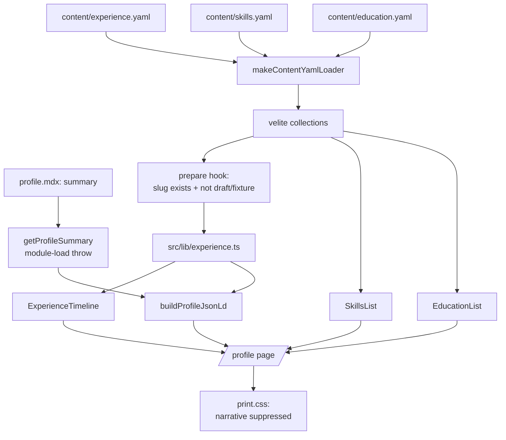

# Design Document — profile-resume

## Overview

This design turns `/profile` from a bio into a CV without turning it into a resume dump. The page
keeps its personal opening and gains three data-driven sections beneath it — experience, skills,
education — plus machine-readable `Person` data. Printing the same page yields a strictly
professional PDF.

All new content is **loader-managed YAML** — `experience.yaml`, `skills.yaml`, `education.yaml` —
following the `contributions.yaml` pattern exactly. The one exception is the professional summary, a
single prose string that stays in `profile.mdx` frontmatter and is guarded by an explicit
module-load throw (§Validation posture explains why the split, and why frontmatter alone is not
enough).

Everything is build-time: three schema modules, one selector, four presentational components, two
`prepare()` cross-checks, an authoring doc, and roughly thirty lines of print CSS. No client JS, no
runtime, no new dependency.

## Steering Document Alignment

### Technical Standards (tech.md)

- **Velite content pipeline, and the validation path that actually fails.** Velite only throws on
  schema issues when `config.strict` is set, and `velite.config.ts` does **not** set it. A zod failure
  in a plain collection therefore *warns and ships*. This is exactly why `makeContentYamlLoader`
  exists — it is the authoritative validator with centralized issue formatting. Every new collection
  here registers in **both** the `collections` map (types/output) and the loader (validation).
  Registering only one is the known failure mode, and it is the reason `skills` and `education` are
  YAML files rather than `profile.mdx` frontmatter.
- **Static rendering, no client JS.** `/profile` stays `force-static`. All new components are server
  components; JSON-LD is a serialized string in the server-rendered HTML. The change is HTML weight
  only — no new images or fonts — so the Lighthouse ≥90 Performance gate is unaffected.
- **CSP.** JSON-LD ships in an inline `<script type="application/ld+json">`. The content CSP is
  `script-src 'self' 'unsafe-inline'` (`next.config.ts:69`), so an inline data block is permitted. No
  CSP change is required and none is made.
- **Honest enforcement.** See §Testing Strategy: CI runs no Playwright today. This design does not
  claim E2E assertions are gates.

### Project Structure (structure.md)

- Schema modules at `src/lib/build/{experience,skills,education}-schema.ts`, mirroring
  `contributions-schema.ts` and reusing `content-schema-primitives.ts`.
- Selector at `src/lib/experience.ts` (no imports from `src/components/` or `src/app/`).
- Components at `src/components/profile/*.tsx` — kebab-case files, one PascalCase named export,
  matching the existing per-section directories (`projects/`, `blog/`, `now/`, `home/`).
- Print rules extend the existing slice `src/styles/print.css`; no new stylesheet.
- Authoring doc at `docs/experience-authoring.md`, matching the convention every other collection
  follows (`projects-authoring.md`, `contributions-and-resources-authoring.md`, …).

### Design System (design-system.md)

- **Tokens only.** Every colour, size, and space resolves to a semantic role or a named Tailwind step
  (R1.2). No arbitrary values — the timeline uses `lg:grid-cols-4` with column spans rather than an
  arbitrary `grid-cols-[12rem_1fr]`.
- **Flat + hairline surfaces** (§4). Roles are separated by `divide-y divide-border`, not cards. This
  also sidesteps the shadcn `Card` `shadow-sm` deviation recorded in `visual-design`.
- **The path-mark signature** (§3). Each section is introduced by a `SectionKicker` (`/ experience`,
  `/ skills`, `/ education`).
- **Type roles.** Section headings use the serif display face at the `h2` step; role titles are `h3`
  in sans; dates and technology tags use mono at the `text-xs` kicker step.
- **Brand restraint** (§1). Brand is used only for links. No second brand-filled button; the page
  keeps its single "Get in touch" CTA.
- **Gates.** Both themes, all named breakpoints, axe-clean, visible focus on every link.

## Validation posture (resolves adversarial r1 finding 1)

The two content paths have **different failure semantics**, and the choice must be made on that
basis rather than on how short the data is:

| Path | Failure behaviour | Used for |
|---|---|---|
| `makeContentYamlLoader` | Hard fail, file + field + entry named via `formatZodIssues` | `experience.yaml`, `skills.yaml`, `education.yaml` |
| Plain collection (frontmatter) | Zod *dirty* → warns and ships; *fatal* → aborts with `no data resolved for 'profile' collection`, naming neither file nor field | `profile.mdx` `summary` only |

`skills` and `education` are arrays with real constraints (`items` non-empty, bounded lengths). On the
frontmatter path a violation such as `items: []` would warn and ship, producing exactly the empty
section R5.4 forbids. They therefore become loader-managed YAML.

`summary` is a single prose string that belongs with the profile's other prose metadata
(`headline`, `location`, `availability`), so it stays in frontmatter — **guarded by an explicit
module-load throw**, following the existing in-repo precedent at `src/app/(site)/now/page.tsx`, where
`getNowPage()` throws if the entry or its `updated` field is missing. `getProfileSummary()` throws
with a message naming `content/profile.mdx` and the field if `summary` is absent or under-length.

`strict: true` on `defineConfig` was considered and **rejected for this spec**: it would change
failure behaviour for the four existing collections at once, with an unmeasured blast radius, which is
out of scope here. Recorded as a deferred decision.

## Code Reuse Analysis

### Existing Components to Leverage

- **`src/lib/build/content-schema-primitives.ts`**: `trimmed()` and `httpUrl()` are reused directly.
  Extended with one new primitive, `isoMonth()` (§Data Models). `isoDate()` is **not** used —
  employment dates are month-precision. `uniqueByKind()` is **not** used — no field here has a `kind`.
- **`makeContentYamlLoader`** (`velite.config.ts:445`): gains three entries.
- **`formatZodIssues`** (`src/lib/build/content-error-format.ts:304`): its `identifierField` is
  currently `basename.startsWith("contributions") ? "repo" : "title"`, so a new file would locate
  errors by `title` — the *job* title, not the employer. Replaced with a filename→field map:
  `contributions → repo`, `experience → organisation`, `skills → category`,
  `education → credential`, default `title`.
- **`prepare(data)` hook** (`velite.config.ts`): already performs cross-collection invariants for blog
  series. Extended with the experience→project checks (§Error Handling).
- **`profile` collection schema**: extended in place with `summary`. Its `.transform()` git-log
  behaviour is untouched.
- **`SectionKicker`**: labels each new section.
- **`src/lib/format-date.ts`**: gains a sibling `formatMonthYear(value: string)` for `YYYY-MM` input.
  `formatContentDate` is **not** reused for employment dates — it expects full ISO dates and would
  fabricate a day.
- **`src/styles/print.css`**: extended. Its `body:has(.profile-print-root)` scoping and forced-light
  token re-declaration already work; the new rules ride on both.
- **Tag-chip treatment** (`src/components/projects/`): reused for per-role technology chips.

### Integration Points

- **`/profile` page** (`src/app/(site)/profile/page.tsx`): composes the new sections between the
  existing narrative `<article>` and the `#get-in-touch` section. Keeps `.profile-print-root`.
- **`content/profile.mdx`**: frontmatter gains `summary`; body prose untouched.
- **Project pages**: a delivery's `project` slug resolves to `/projects/<slug>`; nothing changes on
  the project side.

## Architecture

Content is validated at build time, exposed through one selector per collection, and rendered by four
presentational components. The same selectors feed both the visible page and the JSON-LD, so they
cannot disagree (R7.2).

### Modular Design Principles

- **Single responsibility**: separate components for timeline, role, skills, and education.
- **Data/presentation split**: `src/lib/experience.ts` owns sorting and shaping; components receive
  data as props.
- **One source for two outputs**: the JSON-LD builder consumes selector output, never re-reads content.



### Section order and the narrative/summary split

On screen: hero → **narrative** (personal) → summary → experience → skills → education → contact.
In print: hero → summary → experience → skills → education → contact.

**What this costs, and why it is accepted** (records the r1 challenge rather than presenting the split
as neutral). The dual render buys a profile page that reads as a person's, at the cost of: a
`.profile-narrative` class, one print rule, a separate `summary` field, and a test proving nothing
professional was hidden. The adversarial review proposed collapsing all of it by moving the personal
narrative to `/about`, which `product.md` does designate as the personal page. That reversal is
**declined**: R2.2 and R6.3 encode two explicit decisions — keep personal flavour on `/profile`, and
make the PDF strictly professional — recorded in the requirements v2 revision history. The complexity
is four small artifacts, bounded and local. Nothing here is print-only: every printed element is
visible on screen, so the two renderings cannot silently diverge.

### The measure exception (R2.4, design-system exceptions rule)

**Rationale, recorded as the exceptions rule requires:** the page container is `max-w-5xl`, wider than
the 75ch prose measure. The timeline places a mono date rail beside each role. The rail sits *outside*
the prose column; the role's prose stays inside `max-w-measure`. That widens the gutter, not the
measure — what `visual-design` R4.3 permits for this page. Below `lg` the layout stacks and the date
becomes a line above the role title, so narrow viewports never trade measure for a rail.

Implemented as `lg:grid lg:grid-cols-4`, date rail at `lg:col-span-1`, content at
`lg:col-span-3 max-w-measure` — named steps, no arbitrary track sizes.

### The printed form (resolves adversarial r1 finding 3)

The screen timeline is **not** the printed timeline, and the difference is designed rather than
incidental. At 2cm margins the print viewport is ≈640px, below the `lg` breakpoint, so the grid never
matches and print always gets the stacked form. That is the intended printed layout: date line, role
title, organisation, then content — a conventional CV shape.

Print rules added to `src/styles/print.css`:

1. **Suppress the personal narrative** — `body:has(.profile-print-root) .profile-narrative { display: none }`.
2. **Suppress URL expansion on organisation links.** The existing
   `.profile-print-root a[href^="http"]::after` rule would render "CrowdStrike
   (https://www.crowdstrike.com)" on every role. Organisation links opt out via a class; expansion is
   retained where the URL earns its ink (contact and social links).
3. **Internal cross-links degrade to plain text.** `/projects/<slug>` links print as link-styled dead
   text today. In print they lose link styling and expand against `siteConfig.url`, so
   "Rudder (https://www.matthewfield.ca/projects/rudder)" is followable from paper.
4. **`break-inside: avoid` is scoped to the role *header***, not the whole role. Applying it to an
   entire role strands most of a page when a role is long; the header block keeps organisation, title,
   and dates together with the first content, which is the achievable guarantee (R6.5).

## Components and Interfaces

### ExperienceTimeline (`src/components/profile/experience-timeline.tsx`)
- **Purpose:** the full employment history as a hairline-divided list, newest first.
- **Interface:** `ExperienceTimeline({ roles }: { roles: ExperienceRole[] })`.
- **Behaviour:** returns `null` when empty (R5.4). Emits a labelled section wrapping an ordered list,
  so chronology is structural, not only visual (R8.4).

### ExperienceRoleItem (`src/components/profile/experience-role-item.tsx`)
- **Purpose:** one role — organisation, title, dates, location, summary, deliveries, highlights, tech.
- **Interface:** `ExperienceRoleItem({ role }: { role: ExperienceRole })`.
- **Behaviour:** a delivery with a `project` slug links to `/projects/<slug>`; without one it renders
  as text with its optional bullets. Carries the print-break header class.

### SkillsList (`src/components/profile/skills-list.tsx`)
- **Purpose:** skills grouped by category. Returns `null` when empty.
- **Behaviour:** a description list — `<dt>` category, `<dd>` items — so grouping is semantic.

### EducationList (`src/components/profile/education-list.tsx`)
- **Purpose:** credential, institution, completion, honours. Returns `null` when empty.

### buildProfileJsonLd (`src/lib/profile-json-ld.ts`)
- **Purpose:** the schema.org `Person` object. Pure function, unit-testable without rendering.
- **Shape (re-specified — resolves r1 finding 6):** `Occupation` carries neither employer nor dates, so
  employment history is **not** expressible through `hasOccupation` alone. The emitted shape is:
  - `name`, `url`, `jobTitle`, `description` (the summary)
  - `sameAs` — LinkedIn and GitHub from `siteConfig.links`
  - `worksFor` — `Organization`, current role only
  - `alumniOf` — `EducationalOrganization` per education entry
  - `knowsAbout` — flattened skill items
  - `hasOccupation` — one `Occupation` describing the occupational category
  - **`affiliation`** — one `OrganizationRole` per past role, carrying `roleName`, `startDate`,
    `endDate`, and a nested `Organization`. This is the standard shape for dated organisational roles
    and is how R7.1's "employment history" is satisfied; consumer support varies, which is a property
    of the vocabulary rather than of this design.
- **Emits no `telephone` and no `email`** (R7.3, R3.1), asserted by unit test.

### getExperience (`src/lib/experience.ts`)
- **Purpose:** the single read path for employment data.
- **Interface:** `getExperience(): ExperienceRole[]`.
- **Sort (re-specified — resolves r1 finding 6):** `end` descending with a **current role treated as
  infinity**, then `start` descending, then organisation ascending. Sorting on `start` alone
  mis-orders overlapping tenures, which R1.6 ("most-recent-first") does not intend.

### Content chokepoint
`src/lib/build/check-experience-chokepoint.ts` — a scanner asserting the `experience` / `skills` /
`education` symbols from `#site/content` are imported only by their selectors, matching the existing
`check-projects-chokepoint` convention. **Deliberately a new module rather than an extension of the
projects scanner:** CI paired-merge guards force `project-errors.ts` / `projects.test.ts` and their
coupled files to change all-or-none, so new code goes in an unguarded module to avoid tripping them.

## Data Models

### `content/experience.yaml` — array of roles

```yaml
- organisation: CrowdStrike                    # 2–80
  organisationUrl: https://www.crowdstrike.com # optional, httpUrl()
  title: Infrastructure Engineer III           # 2–80
  start: "2021-01"                             # isoMonth()
  end: "2026-01"                               # omit entirely for a current role
  location: Remote                             # 2–60
  summary: >-                                  # 30–400
    Member of the Infrastructure Engineering Kubernetes team…
  tech: [kubernetes, temporal, golang]         # optional, max 12, each 1–24
  deliveries:                                  # optional, max 4
    - title: Rudder                            # 2–60
      role: Architect & Lead Engineer          # 2–60
      project: rudder                          # optional slug; must resolve
      body: >-                                 # 30–500
        A single pane of glass for the Kubernetes fleet…
      highlights: []                           # optional, max 6, each 20–200
  highlights:                                  # 1–10, each 20–240
    - Owned build, management, and lifecycle of 40+ Kubernetes clusters…
```

- `.strict()` throughout — an unknown key is an authoring error. **There is no `phone` field and no
  free-form contact field, so R3.1's forbidden data is not expressible.**
- `start`/`end` use the new **`isoMonth()`** primitive: `/^\d{4}-(0[1-9]|1[0-2])$/` — the explicit
  `01`–`12` alternation matters, because `\d{2}` would accept `2026-13` and then misreport it as a
  future date. Followed by a round-trip check in the `isoDate()` style, and a not-in-the-future check
  anchored on `BUILD_START_UTC`.
- **`end` absent means current; an explicit `null` is rejected** — one spelling for "current". R1.2's
  "absent/null" phrasing is resolved here in favour of absent-only, and the authoring doc states it.
- `end` must be `>= start`.
- **Highlight length bounds are load-bearing for R3.4**: a 240-character ceiling makes a
  keyword-inventory line mechanically impossible.

### `content/skills.yaml` — array of groups

```yaml
- category: Cloud & Hybrid Infrastructure   # 2–60
  items: [AWS, GCP, OCI, Azure]             # 1–12 items, each 1–32
```
Max 8 groups — a bound that partly mechanizes R5.2's "curated, not exhaustive".

### `content/education.yaml` — array of credentials

```yaml
- credential: Bachelor of Applied Information Systems Technology  # 2–120
  institution: NAIT                                               # 2–80
  institutionUrl: https://www.nait.ca                             # optional
  completed: "2018-01"                                            # isoMonth()
  honours: With Honours                                           # optional, 2–40
  note: Network Management Major                                  # optional, 2–80
```

### `content/profile.mdx` frontmatter — one added field

```yaml
summary: >-        # 100–600; opens the experience section and the PDF
  Platform and infrastructure engineer with a decade in cloud infrastructure…
```

### Derived types

`ExperienceRole`, `ExperienceDelivery`, `SkillGroup`, `EducationEntry` are inferred from the Velite
collections (`(typeof experience)[number]` etc.), never hand-declared — matching `src/lib/projects.ts`.

## Editorial enforcement (R3, R9 — resolves adversarial r1 finding 5)

R3 and R9 are editorial requirements. Where possible they are made mechanical; the rest is a
checklist in the authoring doc, which is the honest place for judgement.

**Mechanical:**
- R3.1 — the schemas have no phone/email field; `.strict()` rejects any attempt to add one.
- R3.4/R3.5 — highlight and summary length bounds make ATS-style inventory lines impossible to author.
- R5.2 — the 8-group / 12-item skills bounds cap the wall of technology.
- R9.1 — a Vitest assertion that the "a decade" phrasing appears in **both** `siteConfig.intro` and
  the profile `summary`, so the two cannot drift.

**Checklist, in `docs/experience-authoring.md`:**
- The curated-content pass over the `.docx`: what is excluded and why (R3.1–3.7), so the next edit
  does not silently re-import the phone number or the job-search framing.
- R3.6's compress-don't-delete rule for breadth signals.
- R9.2 — one canonical interests list, living in the narrative.
- R9.3 — subjects touched by both narrative and data are stated once, in the narrative.
- The `end`-absent-means-current rule, and the month-precision date format.

## Error Handling

### Scenario 1 — A delivery references a project slug that does not exist, or one that will not ship
- **Handling:** `prepare()` builds a `Set` of every slug in the raw `projects` collection. A slug that
  is absent throws. A slug that resolves but is `draft: true` or `fixture-`-prefixed **also throws** —
  because `getPublishedProjects()` filters both on production, so such a link would 404 *only in
  production*. Validating raw-existence alone is satisfied-shaped, not satisfied (R4.2).
- **User Impact:** the build fails loudly; a production-only dead link is impossible.

### Scenario 2 — Malformed or contradictory dates
- **Handling:** `isoMonth()` rejects non-`YYYY-MM` and out-of-range months distinctly from future
  dates; a `superRefine` rejects `end < start`. Errors surface through `formatZodIssues` with the
  entry located by `organisation`.
- **User Impact:** build failure naming the file, entry, and field.

### Scenario 3 — `summary` missing or too short in frontmatter
- **Handling:** the frontmatter path cannot be relied on to fail (§Validation posture), so
  `getProfileSummary()` throws at module load naming `content/profile.mdx` and the field — the
  `getNowPage()` precedent.
- **User Impact:** build failure with a useful message, rather than a PDF that silently opens with
  nothing.

### Scenario 4 — Printing from dark mode
- **Handling:** already solved — `print.css` re-declares tokens under `:root, .dark` inside
  `@media print`. New sections inherit it because they consume the same token roles (R6.6).

### Scenario 5 — A role splits awkwardly across a page break
- **Handling:** `break-inside: avoid` scoped to the role *header*, per §The printed form.

### Scenario 6 — Skills or education absent
- **Handling:** components return `null`; no heading, kicker, or rule renders (R5.4).

## Testing Strategy

**Enforcement reality, stated plainly:** `.github/workflows/ci.yml` runs lint, format, typecheck,
Vitest, and build — **no Playwright**. E2E assertions in this repo are therefore developer-run, not
gates. This design does not claim otherwise. Guarantees are pushed into Vitest wherever Vitest can
carry them; adding a CI Playwright step is worth doing but is a CI concern, recorded as a follow-up
rather than smuggled into this spec.

### Unit Testing (Vitest — actually enforced)
- `src/lib/experience.test.ts` — sort order including the **overlapping-tenure** case (current first,
  then `end` desc, then `start` desc, then organisation); empty-collection behaviour.
- `src/lib/profile-json-ld.test.ts` — the emitted object contains the expected `affiliation` /
  `alumniOf` / `worksFor` entries, and **asserts absence of `telephone` and `email`** (R7.3 as a
  failing test, not a comment).
- Schema tests following `blog-errors.test.ts`: bad month format, `2026-13`, explicit `end: null`,
  `end < start`, unknown key under `.strict()`, empty `highlights`, over-length highlight.
- `formatMonthYear` formatting.
- The R9.1 consistency assertion across `siteConfig.intro` and the profile `summary`.
- The chokepoint scanner's own test, matching `check-projects-chokepoint`'s.

### Integration Testing
- The `prepare()` cross-check logic is extracted into an **importable, unit-testable function** rather
  than living inline in the hook, so the unknown-slug, draft-slug, and fixture-slug cases are asserted
  in Vitest instead of resting on a build fixture that nothing runs.

### End-to-End Testing (Playwright — developer-run, not a CI gate)
- `/profile` renders narrative, experience, skills, and education in DOM order; a delivery link
  navigates to `/projects/rudder`.
- Print emulation (`page.emulateMedia({ media: "print" })`): the narrative is not visible while
  summary, experience, skills, and education are. Note this validates **visibility**, which is
  media-query driven — it does not validate printed *layout*, since `emulateMedia` does not resize the
  viewport.
- axe on `/profile` in both themes. `e2e/tests/contact-axe.test.ts` already covers this route and
  **fails today** on `link-in-text-block` at the availability line; R8.3 puts that fix in scope, so
  this suite goes green as part of the work rather than being a pre-existing blocker.

### Post-implementation
- Record a Lighthouse run for `/profile` in `docs/profile-resume-lighthouse-runs.md`, following the two
  existing `docs/*-lighthouse-runs.md` precedents. `/profile` is the first URL in `lighthouserc.js`.

## Revision History

- **v2** — responded to adversarial review r1 (all findings accepted except one reversal). **Validation
  posture rewritten**: `skills`/`education` moved from `profile.mdx` frontmatter to loader-managed YAML
  because the frontmatter path warns-and-ships without `config.strict`; `summary` stays in frontmatter
  behind a `getNowPage()`-style module-load throw; `strict: true` explicitly deferred. **Cross-check
  tightened** to fail on draft/fixture slugs, closing a production-only dead-link path. **The printed
  form is now designed** (organisation-URL expansion suppressed, internal links expanded against
  `siteConfig.url`, `break-inside` scoped to the role header, stacked print layout acknowledged as
  intended). **Testing Strategy made honest** — CI runs no Playwright, so guarantees moved to Vitest
  and the `prepare()` check extracted to be unit-testable. **JSON-LD re-specified** using
  `OrganizationRole` under `affiliation`, since `Occupation` carries neither employer nor dates.
  **Sort key re-specified** as `end` desc (current = infinity) → `start` desc → organisation. Added
  string bounds throughout, `isoMonth()` with an explicit `01`–`12` range, the `formatZodIssues`
  identifier-field map, a content chokepoint in a deliberately unguarded module, `docs/experience-
  authoring.md`, an editorial-enforcement section covering R3/R9, and a Lighthouse run record.
  Corrected two false Code Reuse claims (`uniqueByKind`, `formatContentDate`). **Declined** the
  proposal to move the personal narrative to `/about`: R2.2/R6.3 encode explicit decisions, and the
  cost is now recorded rather than presented as neutral.
- **v1** — initial design.
