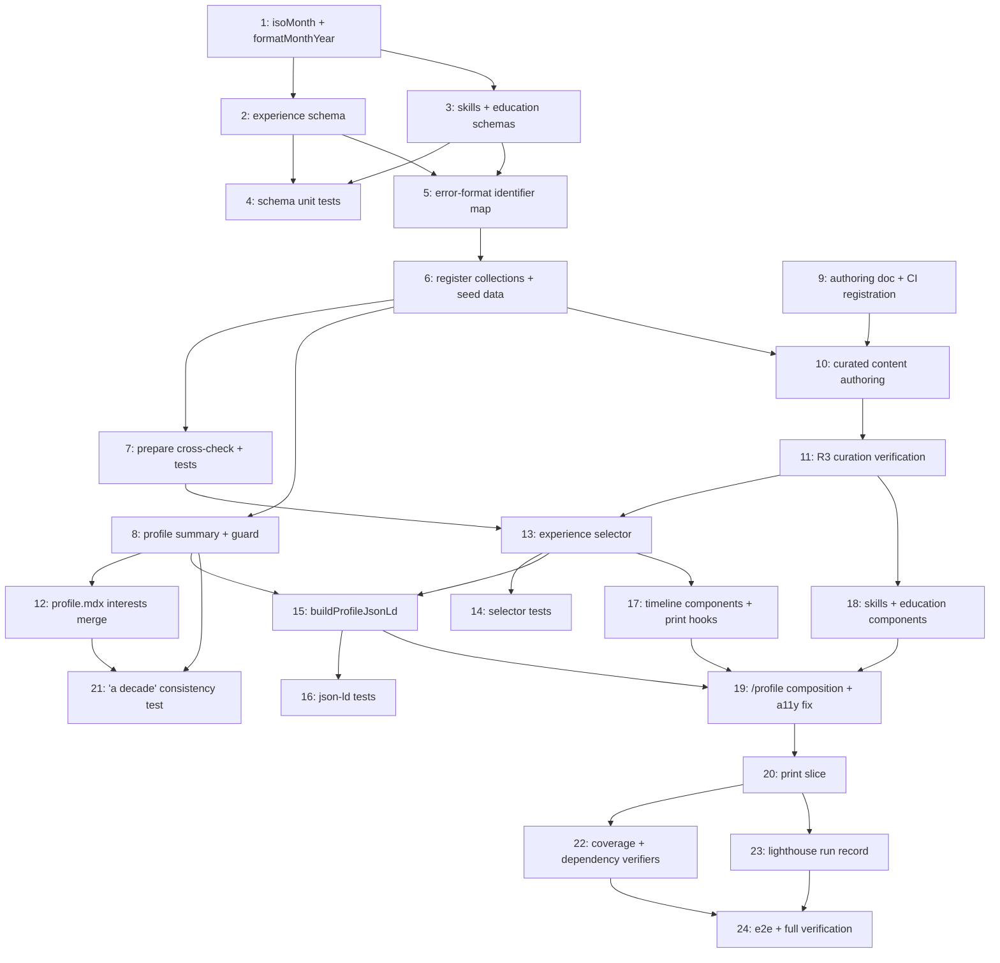

# Tasks Document

Tasks are listed in a **topological order** consistent with the DAG below; the linear ordering does not imply serial execution. Each task carries a `_Depends on:` footer, so the DAG is mechanically verifiable via `scripts/verify-task-dependencies.mjs` (task 22 extends it to this spec).

**Source-of-truth decision.** The curated YAML under `content/` is canonical for professional history from this spec onward. The master `.docx` becomes an **export target**, not an input — regenerated from the site data when an ATS copy is needed. This removes the undiscoverable-input problem: no task depends on a gitignored scratch file, and no unreviewed `.docx` content can reach a public repo without passing the R3 curation gate in task 11. The rule is written down in task 9's authoring doc.

**Intermediate-state policy.** `pnpm build` is green at every checkbox. Task 6 registers the collections *and* lands seed data in the same change, because velite resolves collections against files on disk — a schema with no data file is unverifiable, not merely untested. Tasks 10–12 then replace seed content with curated content.

---

- [x] 1. Add `isoMonth()` primitive and `formatMonthYear()`
  - File: src/lib/build/content-schema-primitives.ts, src/lib/format-date.ts
  - `isoMonth()`: regex `/^\d{4}-(0[1-9]|1[0-2])$/`, then a round-trip parse in the `isoDate()` style and a not-in-the-future check anchored on `BUILD_START_UTC`
  - `formatMonthYear(value)`: `YYYY-MM` → `{ datetime, display }`, matching `formatContentDate`'s shape
  - Purpose: employment dates are month-precision; `isoDate()` would force a fabricated day
  - _Leverage: content-schema-primitives.ts (isoDate, BUILD_START_UTC), src/lib/format-date.ts_
  - _Requirements: 1.5_
  - _Depends on: none_
  - _Prompt: Implement the task for spec profile-resume, first run spec-workflow-guide to get the workflow guide then implement the task: Role: TypeScript developer working on build-time validation | Task: Add `isoMonth()` and `formatMonthYear()` per design §Data Models | Restrictions: The month regex MUST use the `(0[1-9]|1[0-2])` alternation — `\d{2}` accepts `2026-13` and then misreports it as a future date, the exact bug this spec was reviewed for; the out-of-range-month error must be distinguishable from the future-date error; reuse BUILD_START_UTC, never Date.now(); do not modify isoDate() | _Leverage: the existing isoDate() implementation | _Requirements: 1.5 | Success: `2026-13`, `2026-00`, `2026-1` fail with a month-format error distinct from the future-date error; `2026-08` passes; formatMonthYear returns the datetime/display pair. Set [-] before starting; log-implementation then [x]_

- [x] 2. Create the experience per-entry schema
  - File: src/lib/build/experience-schema.ts
  - Roles with organisation, organisationUrl?, title, start, end?, location, summary, tech?, deliveries?, highlights — `.strict()`, all string fields bounded per design §Data Models
  - `end` absent means current; explicit `null` REJECTED; `superRefine` enforces `end >= start`
  - _Leverage: src/lib/build/contributions-schema.ts, content-schema-primitives.ts_
  - _Requirements: 1.1, 1.2, 1.3, 1.4, 3.1, 3.4, 4.1_
  - _Depends on: 1_
  - _Prompt: Implement the task for spec profile-resume, first run spec-workflow-guide to get the workflow guide then implement the task: Role: TypeScript developer building content schemas | Task: Create experience-schema.ts mirroring contributions-schema.ts, implementing the role/delivery model with every bound in design §Data Models | Restrictions: `.strict()` on every object; do NOT add any phone or free-form contact field — R3.1 is enforced by the schema's shape, so that absence is load-bearing; do NOT use uniqueByKind (nothing here has a `kind`); explicit `end: null` must fail, resolving R1.2's "absent/null" phrasing in favour of absent-only; the 240-char highlight ceiling is deliberate and makes an ATS inventory line impossible to author (R3.4) | _Leverage: contributions-schema.ts | _Requirements: 1.1-1.4, 3.1, 3.4, 4.1 | Success: schema compiles and exports a per-entry schema usable by both the collection and the loader. Set [-] before starting; log-implementation then [x]_

- [x] 3. Create the skills and education per-entry schemas
  - File: src/lib/build/skills-schema.ts, src/lib/build/education-schema.ts
  - Skills: `category` + non-empty `items`, max 8 groups / 12 items. Education: credential, institution, institutionUrl?, completed, honours?, note?
  - _Leverage: src/lib/build/contributions-schema.ts, content-schema-primitives.ts_
  - _Requirements: 5.1, 5.2, 5.3_
  - _Depends on: 1_
  - _Prompt: Implement the task for spec profile-resume, first run spec-workflow-guide to get the workflow guide then implement the task: Role: TypeScript developer building content schemas | Task: Create the skills and education per-entry schemas per design §Data Models | Restrictions: `.strict()` throughout; `items` must be non-empty — an empty group is exactly the empty-section failure R5.4 forbids; the 8-group/12-item caps partly mechanize R5.2's curation rule and must not be raised without a spec change | _Leverage: contributions-schema.ts | _Requirements: 5.1, 5.2, 5.3 | Success: both schemas compile and export per-entry schemas. Set [-] before starting; log-implementation then [x]_

- [x] 4. Write the schema rejection tests
  - File: src/lib/build/experience-schema.test.ts, src/lib/build/skills-education-schema.test.ts
  - The full list design.md commits to: bad month format, `2026-13`, explicit `end: null`, `end < start`, unknown key under `.strict()`, empty `highlights`, over-length highlight, empty skills `items`, over-cap arrays
  - Purpose: these are the most safety-critical tests in the spec and had no file, task, or checkbox in v1
  - _Leverage: src/lib/blog-errors.test.ts (schema-test conventions)_
  - _Requirements: 1.1, 1.2, 1.3, 1.4, 3.4, 5.1, 5.2_
  - _Depends on: 2, 3_
  - _Prompt: Implement the task for spec profile-resume, first run spec-workflow-guide to get the workflow guide then implement the task: Role: Test engineer | Task: Write rejection tests for every case enumerated in design §Testing Strategy → Unit Testing | Restrictions: Each listed case gets its own assertion — this task exists because v1 buried these inside other tasks' success criteria with no file path; assert the ERROR SHAPE where the message matters (month-format vs future-date must be distinguishable) | _Leverage: blog-errors.test.ts | _Requirements: 1.1-1.4, 3.4, 5.1, 5.2 | Success: every case in the design's list has a named, failing-when-broken assertion. Set [-] before starting; log-implementation then [x]_

- [x] 5. Replace the hardcoded `identifierField` with a filename map
  - File: src/lib/build/content-error-format.ts
  - Currently `basename.startsWith("contributions") ? "repo" : "title"` (~line 304). Replace with: contributions→repo, experience→organisation, skills→category, education→credential, default title
  - _Leverage: src/lib/build/content-error-format.ts_
  - _Requirements: 1.4_
  - _Depends on: 2, 3_
  - _Prompt: Implement the task for spec profile-resume, first run spec-workflow-guide to get the workflow guide then implement the task: Role: TypeScript developer maintaining build error formatting | Task: Replace the two-branch identifierField ternary with a filename→field map | Restrictions: Key the map on FILENAME only, never on field presence — `resources.yaml` also has a `category` field (resources-schema.ts:22), so presence-based detection would silently mis-key it; preserve contributions and resources behaviour exactly, as existing tests assert their output; keep the `title` default | _Leverage: the existing chooseLocator/formatZodIssues implementation | _Requirements: 1.4 | Success: existing tests stay green; new tests prove an experience issue locates by organisation and an education issue by credential. Set [-] before starting; log-implementation then [x]_

- [x] 6. Register the collections and land seed data
  - File: velite.config.ts, content/experience.yaml, content/skills.yaml, content/education.yaml
  - Add all three to the `collections` map AND `makeContentYamlLoader`; create the three files with one minimal valid entry each
  - Purpose: velite resolves collections against files on disk, so schema registration alone is unverifiable; seed data keeps the build green at this checkbox
  - _Leverage: the contributions/resources registration as the exact model_
  - _Requirements: 1.1, 1.4, 5.1, 5.3_
  - _Depends on: 5_
  - _Prompt: Implement the task for spec profile-resume, first run spec-workflow-guide to get the workflow guide then implement the task: Role: Build engineer wiring the content pipeline | Task: Register the three collections in BOTH the collections map and makeContentYamlLoader, and create the three data files with one valid placeholder entry each | Restrictions: Both registrations are mandatory — velite does not set `config.strict`, so a collection registered without its loader entry warns-and-ships on schema failure instead of failing the build; do NOT set `strict: true` on defineConfig (deferred as d-b2055869); seed entries are placeholders and MUST NOT contain real personal history — curation happens in task 10 under the R3 gate | _Leverage: contributions.yaml/resources.yaml registration | _Requirements: 1.1, 1.4, 5.1, 5.3 | Success: `pnpm build` is green; a deliberately malformed seed entry fails the build naming file, entry, and field. Set [-] before starting; log-implementation then [x]_

- [x] 7. Add the experience→project cross-check as an importable function
  - File: src/lib/build/check-experience-project-links.ts, src/lib/build/check-experience-project-links.test.ts, velite.config.ts
  - Pure function over experience roles + the raw projects collection; throws when a delivery's `project` slug is absent, OR resolves to a `draft: true` or `fixture-`-prefixed project. Wire into `prepare()`
  - **Also enforce the collection-level skills-group cap here** (design.md:298 "Max 8 groups"). A per-entry schema cannot count sibling entries, so task 3 shipped `SKILLS_MAX_GROUPS = 8` as an unread exported constant; this task is the first collection-level hook and gives it teeth
  - _Leverage: velite.config.ts prepare() (blog-series precedent), src/lib/projects.ts:61-70, SKILLS_MAX_GROUPS from src/lib/build/skills-schema.ts_
  - _Requirements: 4.1, 4.2, 5.2_
  - _Depends on: 6_
  - _Prompt: Implement the task for spec profile-resume, first run spec-workflow-guide to get the workflow guide then implement the task: Role: Build engineer implementing cross-collection invariants | Task: Extract the cross-check into an importable, unit-testable module and call it from prepare(), per design §Error Handling Scenario 1; additionally enforce the skills-group cap at collection level | Restrictions: Logic lives in its own module, NOT inline in the hook — unit-testability is the whole point; check the RAW projects collection for existence, then fail SEPARATELY for draft/fixture, because getPublishedProjects() filters both on production and a raw-only check permits a link that 404s only in production; messages name file, role, and slug; the skills-group check MUST read the exported SKILLS_MAX_GROUPS constant rather than restating 8, so the bound has one definition | _Leverage: the existing prepare() series invariant | _Requirements: 4.1, 4.2, 5.2 | Success: unit tests cover unknown slug, draft slug, fixture- slug (all throw) and valid published slug (passes); a 9-group skills fixture fails the build naming the file and the cap. Set [-] before starting; log-implementation then [x]_

- [x] 8. Add the `summary` frontmatter field and its module-load guard
  - File: velite.config.ts (profile schema), content/profile.mdx, src/lib/profile-summary.ts, src/lib/profile-summary.test.ts
  - Add `summary: s.string().optional()` — **optional deliberately** — and `getProfileSummary()` which throws naming the file and field when absent or under 100 chars
  - Purpose: a *required* field would abort the collection parse on absence, and velite's `no data resolved for 'profile' collection` fires before the guard is ever imported — the guard would cover only half the failure space
  - _Leverage: src/app/(site)/now/page.tsx getNowPage() (module-load-throw precedent)_
  - _Requirements: 2.3, 9.1_
  - _Depends on: 6_
  - _Prompt: Implement the task for spec profile-resume, first run spec-workflow-guide to get the workflow guide then implement the task: Role: TypeScript developer wiring profile metadata | Task: Add the professional summary with `s.string().optional()` in the schema and full validation in getProfileSummary() | Restrictions: The field MUST be optional in the collection schema. Making it required means deleting it aborts the profile parse inside velite and throws `no data resolved for 'profile' collection` before this module loads — the useless message the design set out to avoid. The guard owns validation end to end and produces the ONLY error message; follow getNowPage()'s throw-at-module-load shape; the summary must state "a decade" (R9.1); do not duplicate narrative content | _Leverage: getNowPage() | _Requirements: 2.3, 9.1 | Success: deleting `summary` from frontmatter fails the build with a message naming content/profile.mdx and the field — verified by actually deleting it, not by inspection; an under-length summary fails the same way. Set [-] before starting; log-implementation then [x]_
  - _Note: this task satisfies deferral d-b2055869's revisit trigger. Disposition: the trigger is NOT tripped, because the field is deliberately unconstrained in the schema — validation lives in application code, so no reliance is placed on frontmatter schema enforcement. Record this on the deferral rather than resolving it._

- [x] 9. Write and register the authoring doc
  - File: docs/experience-authoring.md, scripts/check-authoring-docs.mjs, scripts/check-authoring-docs.test.mjs
  - YAML shapes for all three files; the `end`-absent-means-current rule; month-precision dates; the R3 curation checklist; R9.2/R9.3 rules; **the source-of-truth rule** (curated YAML is canonical, the `.docx` is an export)
  - Add the doc to `AUTHORING_DOCS` with canonical headings, and extend the script's test
  - Purpose: written BEFORE the curation it governs; R3.2/3.3/3.6/3.7 enforcement lives here, so it must be CI-guarded like its three siblings
  - _Leverage: docs/contributions-and-resources-authoring.md, scripts/check-authoring-docs.mjs (runs in CI at ci.yml:32-33)_
  - _Requirements: 3.1-3.7, 9.2, 9.3, 1.2_
  - _Depends on: none_
  - _Prompt: Implement the task for spec profile-resume, first run spec-workflow-guide to get the workflow guide then implement the task: Role: Technical writer documenting content conventions | Task: Write docs/experience-authoring.md and register it in check-authoring-docs.mjs with canonical headings | Restrictions: This task comes BEFORE content authoring — the checklist governs the curation, so writing it after would be backwards; must state the full R3 exclusion list explicitly so a future edit cannot silently re-import the phone number or job-search framing; must state that `end` is omitted (never null) for current roles; must state month-precision format; must state the source-of-truth rule that curated YAML is canonical and the .docx is a regenerated export; registration in AUTHORING_DOCS is mandatory — an unguarded doc is the weakest possible home for the strongest editorial constraints | _Leverage: docs/contributions-and-resources-authoring.md | _Requirements: 3.1-3.7, 9.2, 9.3, 1.2 | Success: doc covers all three shapes plus the checklist; `node scripts/check-authoring-docs.mjs` passes and fails if a canonical heading is removed. Set [-] before starting; log-implementation then [x]_

- [x] 10. Author the curated content
  - File: content/experience.yaml, content/skills.yaml, content/education.yaml
  - Replace seed entries with the real curated history: four roles, curated skill groups, two credentials
  - _Leverage: docs/experience-authoring.md (task 9), requirements R3_
  - _Requirements: 3.1-3.7, 5.2, 4.3_
  - _Depends on: 6, 9_
  - _Prompt: Implement the task for spec profile-resume, first run spec-workflow-guide to get the workflow guide then implement the task: Role: Editor curating professional content for the web | Task: Author the three content files following docs/experience-authoring.md's checklist | Restrictions: Apply every R3 exclusion — no telephone, no personal email, no timezone line, no repeated social header block (R3.1); no job-search framing inside an entry (R3.2); no named in-flight client engagement with an expiry date (R3.3); outcomes not activity (R3.4); no ATS artifacts (R3.5); preserve breadth signals as one compressed line rather than deleting them (R3.6); omit 2017-2018 front-line helpdesk duties (R3.7); Rudder's delivery references `project: rudder` rather than restating the write-up (R4.3); the Temporal delivery keeps its bullets since it has no project page | _Leverage: the authoring doc's checklist | _Requirements: 3.1-3.7, 4.3, 5.2 | Success: `pnpm build` passes; content is curated, not transcribed. Set [-] before starting; log-implementation then [x]_

- [x] 11. Verify the curated content against the R3 checklist
  - File: .spec-workflow/specs/profile-resume/Implementation Logs/ (checklist artifact)
  - Walk R3.1–3.7 item by item against the authored files; record the per-criterion result in the implementation log
  - Purpose: v1's "no excluded content is present" was self-assessed and unfalsifiable; this makes the highest-consequence task in the spec auditable
  - _Leverage: requirements R3, docs/experience-authoring.md_
  - _Requirements: 3.1-3.7_
  - _Depends on: 10_
  - _Prompt: Implement the task for spec profile-resume, first run spec-workflow-guide to get the workflow guide then implement the task: Role: Reviewer auditing published personal content | Task: Verify the authored content against each R3 criterion individually and attach the completed checklist to the implementation log | Restrictions: Grep the files for telephone-shaped strings and any email address, do not merely read them; each of R3.1 through R3.7 gets an explicit pass/fail line with the evidence; if any criterion fails, fix the content and re-verify before marking complete — this task exists because publishing curated personal history to a public repository has already gone wrong once in this repo | _Leverage: requirements R3 | _Requirements: 3.1-3.7 | Success: a seven-line checklist with evidence is attached to the log and every line passes. Set [-] before starting; log-implementation then [x]_

- [x] 12. Merge the interests lists in the profile narrative
  - File: content/profile.mdx (body prose)
  - Fold the resume's interests (music production/performance, depth psychology, Pilates, parenting) into the existing canonical list, producing ONE list
  - Purpose: R9.2's merge is a real editorial action that no task owned in v1
  - _Leverage: content/profile.mdx body, requirements R9.2_
  - _Requirements: 9.2, 9.3, 2.2_
  - _Depends on: 8_
  - _Prompt: Implement the task for spec profile-resume, first run spec-workflow-guide to get the workflow guide then implement the task: Role: Editor working in Matthew's voice | Task: Merge the resume's interests into the canonical list in the profile.mdx body per R9.2 | Restrictions: Produce ONE list, not two — merge rather than append; keep Matthew's existing voice and sentence rhythm; this is the personal register R2.2 protects, so do not professionalize it; the narrative must continue to state "a decade" for R9.1 | _Leverage: the existing interests sentence in content/profile.mdx | _Requirements: 2.2, 9.2, 9.3 | Success: one canonical interests list; no second list anywhere on /profile. Set [-] before starting; log-implementation then [x]_

- [x] 13. Create the experience selector
  - File: src/lib/experience.ts
  - `getExperience()` sorted by `end` desc (current = infinity), then `start` desc, then organisation asc; plus skills/education selectors
  - _Leverage: src/lib/contributions.ts, src/lib/projects.ts_
  - _Requirements: 1.6_
  - _Depends on: 7, 11_
  - _Prompt: Implement the task for spec profile-resume, first run spec-workflow-guide to get the workflow guide then implement the task: Role: TypeScript developer building the query layer | Task: Implement the selectors per design §Components getExperience | Restrictions: Sort key is `end` desc (current = infinity) → `start` desc → organisation asc, NOT `start` alone, which mis-orders overlapping tenures; types inferred from the velite collections, never hand-declared; this module must not import from src/components/ or src/app/ | _Leverage: src/lib/contributions.ts | _Requirements: 1.6 | Success: selectors compile and return correctly ordered data. Set [-] before starting; log-implementation then [x]_

- [x] 14. Test the selector's sort order
  - File: src/lib/experience.test.ts
  - _Leverage: src/lib/blog.test.ts, src/lib/projects.test.ts_
  - _Requirements: 1.6_
  - _Depends on: 13_
  - _Prompt: Implement the task for spec profile-resume, first run spec-workflow-guide to get the workflow guide then implement the task: Role: Test engineer | Task: Test getExperience ordering | Restrictions: The overlapping-tenure case is mandatory — it is precisely what a naive start-desc sort gets wrong; also cover a current role and an empty collection | _Leverage: existing lib tests | _Requirements: 1.6 | Success: tests fail if the sort reverts to start-only. Set [-] before starting; log-implementation then [x]_

- [x] 15. Build the JSON-LD
  - File: src/lib/profile-json-ld.ts
  - Person with name, url, jobTitle, description, sameAs, worksFor, alumniOf, knowsAbout, hasOccupation, and `affiliation` as OrganizationRole entries carrying roleName/startDate/endDate + nested Organization
  - _Leverage: src/config/site.ts links, src/lib/experience.ts_
  - _Requirements: 7.1, 7.2, 7.3_
  - _Depends on: 8, 13_
  - _Prompt: Implement the task for spec profile-resume, first run spec-workflow-guide to get the workflow guide then implement the task: Role: Developer implementing structured data | Task: Implement buildProfileJsonLd per design §Components | Restrictions: Emit NO telephone and NO email under any circumstance (R7.3/R3.1); derive everything from the selectors so page and JSON-LD cannot disagree (R7.2); `Occupation` carries neither employer nor dates, which is why dated history uses OrganizationRole under affiliation; keep it a pure function returning a plain object | _Leverage: siteConfig.links, getExperience | _Requirements: 7.1, 7.2, 7.3 | Success: output validates as schema.org Person with dated affiliation entries. Set [-] before starting; log-implementation then [x]_

- [x] 16. Test the JSON-LD
  - File: src/lib/profile-json-ld.test.ts
  - _Leverage: existing lib tests_
  - _Requirements: 7.1, 7.3_
  - _Depends on: 15_
  - _Prompt: Implement the task for spec profile-resume, first run spec-workflow-guide to get the workflow guide then implement the task: Role: Test engineer | Task: Test the JSON-LD builder | Restrictions: The absence assertions for telephone and email are the point — walk the WHOLE object graph recursively, not just top-level keys, so a nested addition is caught | _Leverage: existing lib tests | _Requirements: 7.1, 7.3 | Success: adding a telephone anywhere in the emitted object fails the suite. Set [-] before starting; log-implementation then [x]_

- [x] 17. Build the experience timeline components and their print hooks
  - File: src/components/profile/experience-timeline.tsx, src/components/profile/experience-role-item.tsx
  - `lg:grid-cols-4` with the date rail at col-span-1 and content at col-span-3 `max-w-measure`; deliveries link to `/projects/<slug>`; **emit the print markup hooks**: an opt-out class on organisation links, a stable class on the role header, and a marker class on internal cross-links
  - Purpose: task 20 cannot suppress or transform what this task does not mark
  - _Leverage: src/components/shared/section-kicker.tsx, formatMonthYear, the projects tag-chip treatment_
  - _Requirements: 2.4, 4.1, 4.3, 8.1, 8.4, 6.4_
  - _Depends on: 13_
  - _Prompt: Implement the task for spec profile-resume, first run spec-workflow-guide to get the workflow guide then implement the task: Role: Front-end developer with an eye for layout | Task: Build the timeline components per design §Components and §The measure exception, including the print markup hooks | Restrictions: Named Tailwind steps only — no arbitrary values, specifically no `grid-cols-[...]`; role prose stays inside max-w-measure while only the date rail sits outside it; chronology conveyed by semantic markup, not the visual rail alone (R8.4); return null when empty; flat hairline surfaces, no Card, no shadow; the print hooks are REQUIRED and must be emitted here — task 20's rules target these classes and silently do nothing without them | _Leverage: SectionKicker, formatMonthYear | _Requirements: 2.4, 4.1, 4.3, 6.4, 8.1, 8.4 | Success: renders in both themes at all breakpoints, stacks below lg, and every class task 20 targets is present in the DOM. Set [-] before starting; log-implementation then [x]_

- [x] 18. Build the skills and education components
  - File: src/components/profile/skills-list.tsx, src/components/profile/education-list.tsx
  - _Leverage: src/components/shared/section-kicker.tsx_
  - _Requirements: 5.1, 5.3, 5.4, 8.1_
  - _Depends on: 11_
  - _Prompt: Implement the task for spec profile-resume, first run spec-workflow-guide to get the workflow guide then implement the task: Role: Front-end developer | Task: Build SkillsList and EducationList per design §Components | Restrictions: Both MUST return null when empty — no heading, kicker, or rule (R5.4); skills grouping must be semantic (description list), not visual; tokens and named steps only | _Leverage: SectionKicker | _Requirements: 5.1, 5.3, 5.4, 8.1 | Success: both render in both themes and vanish entirely when empty. Set [-] before starting; log-implementation then [x]_

- [x] 19. Compose /profile and fix the inline-link a11y violation
  - File: src/app/(site)/profile/page.tsx
  - Order: hero → narrative (wrapped with `profile-narrative`) → summary → experience → skills → education → contact. Emit JSON-LD. Change the availability link from `hover:underline` to permanent `underline`
  - _Leverage: src/components/profile/*, buildProfileJsonLd, getProfileSummary_
  - _Requirements: 2.1, 2.2, 2.3, 2.5, 2.6, 6.3, 7.1, 8.2, 8.3, 8.5_
  - _Depends on: 15, 17, 18_
  - _Note (from task 8's review): until this task imports `getProfileSummary()` into the app graph, deleting `summary` from frontmatter fails only `vitest`, not `next build`. Verify here that `pnpm build` now fails too._
  - _Prompt: Implement the task for spec profile-resume, first run spec-workflow-guide to get the workflow guide then implement the task: Role: Front-end developer composing a page | Task: Compose /profile per design §Section order, emit the JSON-LD, and fix the inline-link underline | Restrictions: Keep .profile-print-root and the single brand CTA — do NOT add a second brand-filled button (R2.5); the narrative wrapper needs the profile-narrative class or task 20's suppression silently does nothing (R6.3); the availability link needs a permanent underline, since brand colour alone against muted text is ~1.05:1 and fails WCAG 1.4.1 (R8.3); JSON-LD goes in an inline application/ld+json script, which the CSP permits | _Leverage: the new profile components | _Requirements: 2.1-2.3, 2.5, 2.6, 6.3, 7.1, 8.2, 8.3, 8.5 | Success: page renders in order in both themes; axe reports zero violations on /profile in BOTH themes, including the previously-failing light-theme case. Set [-] before starting; log-implementation then [x]_

- [x] 20. Extend the print slice
  - File: src/styles/print.css
  - Suppress `.profile-narrative`; opt organisation links out of URL expansion; expand internal `/projects/*` links against `siteConfig.url` and drop their link styling; scope `break-inside: avoid` to the role header **and exempt role list items from the existing blanket `li` rule**
  - _Leverage: the existing print.css scoping and token re-declaration_
  - _Requirements: 6.2, 6.3, 6.4, 6.5, 6.6_
  - _Depends on: 19_
  - _Prompt: Implement the task for spec profile-resume, first run spec-workflow-guide to get the workflow guide then implement the task: Role: CSS developer working on print styles | Task: Extend print.css per design §The printed form | Restrictions: print.css:75-78 already applies `break-inside: avoid` to every `li` inside .profile-print-root — since roles render as list items, that blanket rule OVERRIDES header-scoped breaking and strands whitespace, so role list items must be explicitly exempted or the header scoping is inert; the existing `a[href^="http"]::after` rule would print "CrowdStrike (https://www.crowdstrike.com)" on every role, so organisation links must opt out while contact/social links keep expansion; internal project links must expand against siteConfig.url rather than printing as dead link-styled text; do not touch the token re-declaration block | _Leverage: existing print.css | _Requirements: 6.2-6.6 | Success: print preview from both light and dark shows a light CV with no narrative, no organisation-URL noise, followable project links, and no orphaned headings or stranded pages. Set [-] before starting; log-implementation then [x]_

- [x] 21. Add the "a decade" consistency test
  - File: src/lib/profile-summary.test.ts (extend)
  - Assert the phrasing in all THREE surfaces R9.1 names: `siteConfig.intro`, the `profile.mdx` narrative body, and the summary
  - _Leverage: src/config/site.ts, src/lib/profile-summary.ts, #site/content profile body_
  - _Requirements: 9.1_
  - _Depends on: 8, 12_
  - _Note (from task 9's review): `docs/experience-authoring.md` currently records that R9.1 has no check behind it. Landing this task makes that line false — update the doc in the same change and restore the bullet to its "Mechanical, and will fail CI" list._
  - _Prompt: Implement the task for spec profile-resume, first run spec-workflow-guide to get the workflow guide then implement the task: Role: Test engineer | Task: Assert years-of-experience phrasing across all three surfaces | Restrictions: The narrative assertion is mandatory — v1 asserted only two of the three, leaving a live hole where editing the narrative to "twelve years" keeps the suite green while the page contradicts itself twice on one screen; failure messages must name which surface drifted | _Leverage: siteConfig.intro, getProfileSummary, the profile body | _Requirements: 9.1 | Success: changing any one of the three without the others fails the suite with a message naming it. Set [-] before starting; log-implementation then [x]_

- [x] 22. Extend the coverage and dependency verifiers to this spec
  - File: scripts/verify-requirements-coverage.mjs, scripts/verify-task-dependencies.mjs
  - Both are hardcoded to `blog-core`; extend their path lists to include profile-resume and run them against this document
  - Purpose: mechanically checks the coverage matrix and the `_Depends on:` graph that v1 lacked entirely
  - _Leverage: scripts/verify-requirements-coverage.mjs, scripts/verify-task-dependencies.mjs, verify-task-dependencies.test.mjs_
  - _Requirements: traceability (all)_
  - _Depends on: 20_
  - _Prompt: Implement the task for spec profile-resume, first run spec-workflow-guide to get the workflow guide then implement the task: Role: Build engineer extending repo tooling | Task: Extend both verifier scripts to cover profile-resume and run them | Restrictions: Neither script is currently in CI — do not claim they are gates; extend the hardcoded path constants rather than rewriting the scripts; keep blog-core coverage working and its tests green | _Leverage: the two verifier scripts and their tests | _Requirements: traceability | Success: both scripts run clean against profile-resume, reporting no orphan acceptance criteria and no dangling dependency references. Set [-] before starting; log-implementation then [x]_

- [x] 23. Record a Lighthouse run for /profile
  - File: docs/profile-resume-lighthouse-runs.md
  - _Leverage: docs/projects-showcase-lighthouse-runs.md, lighthouserc.js, scripts/run-lhci.mjs_
  - _Requirements: NFR Performance_
  - _Depends on: 20_
  - _Prompt: Implement the task for spec profile-resume, first run spec-workflow-guide to get the workflow guide then implement the task: Role: Performance engineer | Task: Run Lighthouse against the production build and record /profile's result | Restrictions: `pnpm lhci` runs lhci autorun across ALL seven URLs in lighthouserc.js, not just /profile — record /profile's numbers specifically and note the run covered the full set; the config's total-byte-weight thresholds are still flagged SCAFFOLD ONLY placeholders, so do not treat a byte-weight pass as meaningful; this task deliberately does NOT ship a cadence script, unlike the two existing runs-logs — state that non-parity explicitly in the doc header rather than implying parity; investigate rather than record any Performance score below 90 | _Leverage: scripts/run-lhci.mjs, existing runs-logs | _Requirements: NFR Performance | Success: a runs-log exists showing /profile Performance ≥90, with the no-cadence-script decision stated. Set [-] before starting; log-implementation then [x]_

- [x] 24. E2E coverage and full verification
  - File: e2e/tests/profile-resume.test.ts
  - DOM order; delivery link navigation to /projects/rudder; print-emulation visibility; axe both themes; **assert no telephone-shaped string or personal email in the rendered HTML** (NFR Security); then run the full suite and build
  - _Leverage: e2e/tests/contact-axe.test.ts, e2e/tests/projects-detail-layout.test.ts_
  - _Requirements: 2.1, 4.1, 6.3, 8.2, 8.5, NFR Security_
  - _Depends on: 22, 23_
  - _Prompt: Implement the task for spec profile-resume, first run spec-workflow-guide to get the workflow guide then implement the task: Role: QA engineer | Task: Write the E2E coverage and run full verification (vitest, tsc, eslint, prettier, build, playwright) | Restrictions: Include a rendered-HTML assertion that no telephone-shaped string and no personal email appears anywhere on /profile — the schemas make this inexpressible in the three collections but profile.mdx prose is unconstrained, so the JSON-LD test alone does not cover the NFR; note in the file that print emulation validates VISIBILITY only, since emulateMedia does not resize the viewport and cannot validate printed layout; contact-axe.test.ts already covers /profile in both themes and fails today on link-in-text-block, so confirm task 19's fix turned it green rather than assuming; CI runs no Playwright, so these are developer-run — do not describe them as gates | _Leverage: contact-axe.test.ts | _Requirements: 2.1, 4.1, 6.3, 8.2, 8.5, NFR Security | Success: all suites green; production build clean; axe zero violations on /profile in both themes; no contact data in rendered HTML. Set [-] before starting; log-implementation then [x]_

---

## Requirements Coverage Matrix

| Requirement | Acceptance criteria | Covering tasks |
|---|---|---|
| R1 — Experience as validated structured content | 1.1 | 2, 4, 6 |
| | 1.2 | 2, 4, 9 |
| | 1.3 | 2, 4 |
| | 1.4 | 2, 4, 5, 6 |
| | 1.5 | 1 |
| | 1.6 | 13, 14 |
| | 1.7 | 9 (source-of-truth rule) |
| R2 — `/profile` composition and layout | 2.1 | 19, 24 |
| | 2.2 | 12, 19 |
| | 2.3 | 8, 19 |
| | 2.4 | 17 |
| | 2.5 | 19 |
| | 2.6 | 17, 18, 19 |
| R3 — Curated content | 3.1 | 2, 10, 11, 24 |
| | 3.2 | 9, 10, 11 |
| | 3.3 | 9, 10, 11 |
| | 3.4 | 2, 4, 10, 11 |
| | 3.5 | 9, 10, 11 |
| | 3.6 | 9, 10, 11 |
| | 3.7 | 9, 10, 11 |
| R4 — Cross-linking | 4.1 | 2, 7, 17 |
| | 4.2 | 7 |
| | 4.3 | 10, 17 |
| | 4.4 | 2 (schema permits, no task authors it) |
| R5 — Skills and education | 5.1 | 3, 4, 6, 18 |
| | 5.2 | 3, 4, 7 (group cap), 10 |
| | 5.3 | 3, 6, 18 |
| | 5.4 | 18 |
| R6 — CV is a rendering of `/profile` | 6.1 | n/a — no `/resume` route created; negative requirement, verified by absence |
| | 6.2 | 20 |
| | 6.3 | 19, 20, 24 |
| | 6.4 | 17, 20 |
| | 6.5 | 20 |
| | 6.6 | 20 |
| R7 — Machine-readable data | 7.1 | 15, 16, 19 |
| | 7.2 | 15 |
| | 7.3 | 15, 16 |
| R8 — Accessibility & design-system | 8.1 | 17, 18 |
| | 8.2 | 19, 24 |
| | 8.3 | 19 |
| | 8.4 | 17 |
| | 8.5 | 19, 24 |
| R9 — Site-wide consistency | 9.1 | 8, 21 |
| | 9.2 | 9, 12 |
| | 9.3 | 9, 12 |
| NFR Code Architecture | — | 13 (lib/components split); chokepoint deferred as d-3a396493 |
| NFR Performance | — | 23 |
| NFR Security | — | 2, 11, 16, 24 |
| NFR Reliability | — | 4, 6, 7, 8 |
| NFR Usability | — | 17, 18, 20, 24 |

## Revision History

- **v2.1** (implementation) — task 3 surfaced that design.md:298's "Max 8 groups" bound is not expressible in a per-entry schema, because velite validates one entry at a time and nothing can count siblings. Adjudicated as an under-specified location, not a design contradiction: the design already establishes `prepare()` as the home for collection-level invariants (§Error Handling Scenario 1), so **task 7 now owns the skills-group cap** alongside the experience→project cross-check, reading task 3's exported `SKILLS_MAX_GROUPS` so the bound keeps one definition. Task 4 tests only what the per-entry schemas can express; the group-count case belongs to task 7's tests.
- **v2** — responded to adversarial review r1 of the tasks document. **Task 8 reversed**: `summary` is now `s.string().optional()` so the module-load guard owns validation end to end — a required field aborts the profile parse inside velite and produces the useless message the design set out to avoid, which the guard cannot intercept. **Tasks 9/10 (chokepoint) cut** and recorded as deferral `d-3a396493`: v1 specified scanner + test with no canary, no paired-merge verifier, and no CI step, which enforces nothing. **Ordering reversed** so the authoring doc precedes the curation it governs, and seed data lands with collection registration so the build is green at every checkbox. **Print ownership assigned**: task 17 now emits the markup hooks task 20 targets, and task 20 must exempt role list items from `print.css:75-78`'s blanket `li { break-inside: avoid }`, which would otherwise override the header scoping entirely. **New tasks** for the schema rejection tests (4), the R3 verification checklist (11), the R9.2 interests merge (12), and the coverage/dependency verifiers (22). **Task 21** extended to all three surfaces R9.1 names. **Task 24** gained the rendered-HTML contact-data assertion closing the NFR-Security gap. **Task 9** registers the authoring doc in the CI-run `check-authoring-docs.mjs`. **Task 23** states its non-parity with the existing runs-logs rather than implying it. Added a `_Depends on:` footer to every task, a Requirements Coverage Matrix, an intermediate-state policy, and the source-of-truth decision (curated YAML canonical, `.docx` an export), which removes v1's dependency on a gitignored file no spec named.
- **v1** — initial task breakdown.
