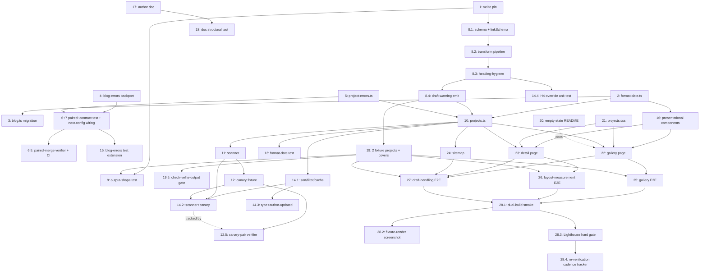

# Tasks Document

Tasks are listed in a **topological order** consistent with the DAG below; the linear ordering of the document does not imply serial execution. Two largely independent branches can run in parallel after Task 1 lands: the **next-config-wiring chain** (Tasks 2 → 3 → 4 → 5 → 6+7) and the **Velite-collection chain** (Tasks 1 → 8.1 → 8.2 → 8.3 → 8.4 → 19 → 9 → 10). They converge at Task 10 (`projects.ts`) and downstream consumers.



## Revision history

- **v1**: Initial decomposition of the v4 design (post-r3 adversarial). Tasks pin: (a) exact-patch Velite version operator (Component 17); (b) DRY `runDraftGuard` helper in `next.config.ts` with the `VITEST` gate (Component 15); (c) the contract test that locks the `next.config.ts` ↔ `*-errors.ts` named-import surface (Component 15 v4 — new); (d) module-scope env-snapshot cache for `getPublishedProjects()` with snapshotsEqual invalidation (Component 3 Risk 4 response); (e) the `--outer-width: 64rem` anchored-escape CSS with `<figure>` deliberately excluded from the wide-media list (Component 10 Risk 1 fix); (f) mandatory fixture-render screenshot step at the layout-measurement E2E task (Component 10 implementation gate); (g) `console.error` over `process.stderr.write+"\n"` (Component 15); (h) draft-warning emit relocated to the Velite transform — single-process, no per-worker dedup state in `projects.ts` (Component 1 Risk 3 response + Risk 5 resolution); (i) parity test triple uses `formatPostDate.toString() === formatProjectDate.toString()` for body-identity (Component 4 v4); (j) chokepoint canary at `src/__fixtures__/chokepoint-canary.ts` with `.ts` extension excluded from tsconfig build (Component 11 carry-over); (k) empty-state mechanism is `vi.mock("#site/content", () => ({ projects: [] }))` with a README sibling, no JSON file (Component 9 v4 + Attack 6 finding); (l) Requirements Coverage Matrix at document foot for orphan-AC visibility.
- **v2 (post-r1 adversarial review)**: (1) **Split Task 8 into 8.1/8.2/8.3/8.4** — atomic schema vs. transform vs. heading-hygiene helper vs. draft-warning emit; each gets its own checkbox, dependency edges, coverage list, and reviewer profile (closes Target 2). (2) **Split Task 28 into 28.1/28.2/28.3/28.4** — dual-build smoke + chokepoint negative, fixture-render screenshot, Lighthouse hard gate, recurring-cadence tracker; 28.3's success criterion is "all scores ≥90 OR task stays open" — no follow-up escape hatch (closes Target 3). (3) **Bundle Tasks 6+7 as a paired-merge contract** — both task bodies pin "may not land in separate commits/PRs; mark both [x] in the same log-implementation call" (closes Target 1). (4) **Rewrite preamble as a topological-order + DAG diagram** so reviewers see the two independent branches (closes Target 4). (5) **Add skip-if-absent escape to Tasks 25/26/27** — Playwright tests `test.skip()` cleanly when `.velite/projects.json` is absent locally (mirrors Task 9's existing escape). (6) **Disambiguate Task 14 Case 5** into 5a (guard throw cases) and 5b (filter-behavior cases) so Req 7.2.d vs. 7.3 coverage is mechanically separable. (7) **Add Req 1.9 type-correctness test** — `expectTypeOf<Project["links"]>().toEqualTypeOf<ProjectLink[] | undefined>()` etc. added to Task 14 (closes Target 5 for Req 1.9). (8) **Reword Task 8.3's "AST-only" restriction** to "AST walk is the sole inspection mechanism; no regex pass over the raw source text" (closes Target 5 inconsistency). (9) **Add inline-code pin to Task 8.4** — code comment in `velite.config.ts` documents the single-process assumption + rollback signal for a future worker-threads upgrade (closes Target 2 sub-finding). (10) **Add coverage-matrix legend** distinguishing **implements** (I) vs. **verifies** (V) vs. **pre-existing infra** (P) vs. **documentation-only** (D); re-classify Req 3.6 as P, Req 12 SRP claims as I+P, Req 10.1–10.6 / 11.4 as D, Req 6.9.d as D+P (existing `<MDXContent />` no-components-arg behaviour). (11) **Move Req 6.9.d** out of Task 8's coverage list (Task 8 takes no action on it) into Task 17's coverage only (author doc states the constraint) + matrix legend note. (12) **Add Req 1.5 verifier note** — assertion in Task 14 that the schema has no `updated`-derivation transform step (negative assertion against re-reading git history).
- **v3 (post-r2 adversarial review)**: r2's cross-cutting pattern: v2 closed findings with prose pins (paired-merge contract, canary pair-update, single-process comment, Lighthouse hard-gate language) that depend on implementer discipline. v3 swaps prose for **mechanical enforcement** wherever possible. (1) **Add Task 6.5 — `scripts/verify-paired-merge.mjs`** wired into CI: fails when a PR diff touches `src/__tests__/next-config-imports.test.ts` xor `next.config.ts`+`src/lib/project-errors.ts` (but not both). Closes r2 Target 1 with a tool gate, not prose. (2) **Split Task 14 into 14.1 / 14.2 / 14.3** by reviewer profile — (14.1) sort + filter + cache + guard (Cases 1–4, 5a, 5b, 6, 7); (14.2) chokepoint scanner + canary regex (Cases 8, 9, 11); (14.3) type-system + author-controlled `updated` negative assertion (Cases 10, 12, 13). Closes r2 Target 2. (3) **Tighten Case 13's negative grep** to enumerate the bypass patterns r2 surfaced: `child_process.execSync(`git log`)`, `simple-git`, `git-log-fast`, computed-string `import([...].join())`, AND a positive assertion that the projects schema's `updated` field is `s.isodate().optional()` with NO `.transform()` step (positive shape catches future bypasses outside the regex list). Closes r2 Target 2 sub-finding. (4) **Replace Case 12's `toMatchTypeOf<{ src, width, height }>` with `toEqualTypeOf<Image>`** importing the actual Velite-emitted `Image` type — exact-match, not subtype. The cover-shape regression catcher is then Task 9's runtime assertion plus this compile-time exact-match. Closes r2 Target 2 sub-finding. (5) **Gate skip-if-absent on `process.env.CI !== "true"`** in Tasks 9, 25, 26, 27 — under CI, the suite errors loud when `.velite/projects.json` is absent. Add **Task 19.5 — `scripts/check-velite-output.mjs`** wired into CI's pretest step as a separate fail-loud gate. Closes r2 Target 3. (6) **Pin Task 28.4 to Option C** (script + log file + GitHub Action wiring) — Option A (issue) and Option B (calendar) are dropped. 28.4 creates `scripts/check-lighthouse-cadence.mjs`, `docs/projects-showcase-lighthouse-runs.md`, AND a `.github/workflows/lighthouse-cadence.yml` that fires the script on every `push` to main. The success criterion is "all three artefacts committed AND the workflow's first run shows green," not "tracker exists." Closes r2 Target 4. (7) **Add a second non-draft fixture project** — `content/projects/fixture-published-second.mdx` (published, distinct earlier date) — to Task 19. Task 25's reverse-chrono assertion is now non-degenerate in BOTH build flavors. Task 28.1's draft-warning count assertion is parameterized on the count of draft fixtures (currently 1 — placeholder), not hard-coded. Closes r2 Target 5. (8) **Mark Req 11.3 as `[V — structural only]`** in the matrix legend; document the triple-copy of Req 11.1 heading strings as an explicit cross-reference contract (no shared constants file because markdown can't import). Apply the same partial-V marker wherever the verifier is mechanical-but-shallow (Task 18 is the canonical case; no others currently). Closes r2 Target 6.
- **v4 (post-r3 adversarial review, FINAL)**: r3's pattern: each v3 mechanical gate left an asymmetric residual (revert path, regex brittleness, trigger over-firing, single-direction sitemap assertion, canary asymmetry). v4 hardens each gate to be functional, not just structural. (1) **Extend Task 6.5's verifier**: (a) add `src/lib/blog-errors.ts` to the tracked file SET (now four paths, not three) so blog-errors rename surfaces with a correct diagnostic; (b) detect revert-shaped HEAD commits (`git log -1 --format=%s | grep -q '^Revert'`) and apply the all-or-none rule even on direct-push-to-main when the HEAD is a revert; (c) document GITHUB_BASE_REF semantics on `pull_request` vs. merge-queue events with a fallback to `origin/main` if unset; (d) emit a diagnostic that names ALL missing files in the tracked set, not a hardcoded subset. Closes r3 Target 1. (2) **Replace Case 13 with a runtime fixture-mutation assertion** (now Task 14.3 case 13-runtime): Task 19's `fixture-published-second.mdx` carries `updated: "2025-12-01"` in frontmatter; Case 13-runtime reads `.velite/projects.json` after build, asserts the corresponding entry has `updated === "2025-12-01"` verbatim. A second sub-case (Case 13b — git-mutation) uses `GIT_COMMITTER_DATE` to rewrite the fixture's most-recent git commit to a different date and re-runs `pnpm velite build`, asserting `updated` is UNCHANGED (proves no git-derived path). Retain v3's positive-shape regex on the schema source as **defense-in-depth only** (not primary signal). Closes r3 Target 2 — verifies the AC behaviorally, not by source-shape proxy. (3) **Switch Task 28.4 trigger from `push to main on mdx paths` to `workflow_dispatch + a final step in the existing CI workflow`**: the cadence script runs as a step IN the dual-build CI (after Build 2) — no separate workflow firing on every mdx edit; failures appear in the normal build run. Additionally: (a) script skips files matching `^fixture-.*\.mdx$` when counting published projects; (b) first-run verification includes a POSITIVE-case test (Task 28.4 implementation creates a `feature/cadence-test` branch, writes three throwaway `delete-me-*.mdx` published files, pushes, verifies workflow_dispatch fires red, deletes the branch) — the implementation log cites both the negative-case (launch state) and positive-case workflow run URLs. Closes r3 Target 3. (4) **Add positive Build-2 sitemap assertion to Task 27**: assert `/sitemap.xml` in Build 2 INCLUDES `/projects/fixture-published-second` AND EXCLUDES `/projects/fixture-placeholder` — both directions, in the SAME assertion block, so a sitemap-generator regression that drops the entire `/projects/*` subtree fails the positive case. Closes r3 Target 4. (5) **Add Task 12.5 — `scripts/verify-canary-regex-pair.mjs` + CI step**: applies Task 6.5's all-or-none paired-merge pattern to the canary fixture ↔ projects.test.ts regex-list pair. CI step `name: "Verify canary↔regex-list paired-merge"` runs before Build 1. Closes r3 Target 6 (recurring escalated finding). (6) **Fix Task 28.1's count substrate**: replace the `grep -l 'draft: true' content/projects/*.mdx | wc -l` substrate with `node -e "console.log(require('./.velite/projects.json').filter(p => p.draft).length)"` — count draft entries from the actual Velite output, not from frontmatter regex. Closes r3 Target 4 sub-finding. (7) **Pin Task 19.5's CI-step duplication as a structural invariant**: extend `scripts/check-velite-output.mjs` with a `--verify-ci-wiring` mode that reads `.github/workflows/ci.yml` and asserts the step name `"Check velite output before tests"` appears EXACTLY twice (once per build flavor). Wire as the FIRST self-test in `scripts/verify-paired-merge.test.mjs`-style fixture suite for the gate. Closes r3 Target 5 sub-finding. (8) **Add Task 14.4 — unit-test coverage for the `PROJECTS_ALLOW_H4=1` override branch**: Task 14.4 (sibling to 14.1/14.2/14.3) uses Vitest's `vi.stubEnv("PROJECTS_ALLOW_H4", "1")` + an in-memory MDX string fed through the heading-hygiene helper (extracted from velite.config.ts as a testable export per Task 8.3) to verify (i) depth-4 heading throws by default, (ii) depth-4 heading is permitted under the flag, (iii) `## → #### skip` STILL throws under the flag (depth unlocked, sequence enforced). Closes r3 Target 4 sub-finding (H4 override coverage gap). (9) **Re-classify Case 13 in the matrix as `[V]`** (no longer `[V — indirect]`) after the runtime-fixture replacement. (10) **Accept the cover-asset blob footprint** explicitly as a known precedent — Task 19's two ≤1 MB fixture assets total ≤2 MB; if the count grows past 4 (say two more specs replicate the pattern), file a follow-up to consolidate fixtures or use build-time SVG generation. Document this as a v4 deferral, not a v4 blocker.

---

## `_Requirements:` footer semantics

Each task carries a `_Requirements:` footer listing requirement IDs from `requirements.md`. The semantics are **"this task contributes to satisfying these requirements"** (in whole or in part) — *not* "this task transitively depends on these requirements." A requirement may be covered by multiple tasks; the Requirements Coverage Matrix at the document foot makes this inverse mapping explicit so orphan requirements are visible at review time.

---

- [x] 1. Pin Velite with exact-patch operator in package.json
  - File: package.json
  - Locate the existing `velite` entry under `dependencies` (added by blog-core's task 1). Rewrite the version specifier as an EXACT patch version (no `^`, no `~`, no `*`, no range). The literal patch version is resolved at implementation time against the latest published `0.3.x` patch; record the resolved string in the implementation log.
  - Do NOT add a `pnpm` block / `pnpm.overrides` / `overrides`. The exact-patch pin in `dependencies` plus the committed `pnpm-lock.yaml` plus CI's `pnpm install --frozen-lockfile` IS the enforcement (Design Component 17 v4 — Risk 2 reversal).
  - Run `pnpm install` so the lockfile reflects the pinned version. Commit `pnpm-lock.yaml` if changed.
  - Purpose: Lock Velite's `Image` shape + transform invocation contract behind an intentional upgrade gate; foundation for the output-shape regression test (Task 9).
  - _Leverage: existing package.json structure + committed pnpm-lock.yaml_
  - _Requirements: 1.11_
  - _Depends on: (none — root task)_
  - _Design refs: Component 17 v4; Steering "Velite API verification" → Version pin (v4 — simplified)_
  - _Prompt: Implement the task for spec project-showcase, first run spec-workflow-guide then implement the task: Role: Build/DevOps engineer with pnpm familiarity | Task: Convert the existing `velite` dependency specifier to an exact patch version (no caret/tilde/range). Resolve the literal at the latest published `0.3.x` patch at implementation time. Do NOT add a `pnpm` / `pnpm.overrides` block. Run `pnpm install`. Mark in-progress before starting; call log-implementation when done. | Restrictions: Exact-patch operator only. No range/caret/tilde. No overrides block. Do not modify other dependencies' specifiers. | _Leverage: existing package.json | _Requirements: 1.11 | Success: `grep -E '"velite":\s*"[0-9]+\.[0-9]+\.[0-9]+"' package.json` matches (no `^`/`~`); `pnpm install --frozen-lockfile` succeeds; lockfile commit reflects the pin. Then mark complete after logging._

- [x] 2. Create `src/lib/format-date.ts` (shared formatter)
  - File: src/lib/format-date.ts
  - Export a single helper:
    ```ts
    const contentDateFormatter = new Intl.DateTimeFormat("en-CA", {
      year: "numeric", month: "long", day: "numeric",
    });
    export function formatContentDate(iso: string): { datetime: string; display: string } {
      return { datetime: iso, display: contentDateFormatter.format(new Date(iso)) };
    }
    ```
  - Module-scope `contentDateFormatter` is created once. Both `blog.ts` and `projects.ts` will re-export `formatContentDate` under content-type-prefixed aliases (Tasks 3 and 10 respectively); both aliases MUST be the exact reference `=== formatContentDate` so the parity assertions in Task 13 hold.
  - Purpose: Single source of truth for content date formatting; substrate for the parity-triangle test in Task 13.
  - _Leverage: existing inline `postDateFormatter` constant in `src/lib/blog.ts` (logical citation per design Attack 7 finding — no line range)_
  - _Requirements: 9.1, 9.2, 9.3, 9.4_
  - _Depends on: (none — new file)_
  - _Design refs: Component 4 v4_
  - _Prompt: Implement the task for spec project-showcase, first run spec-workflow-guide then implement the task: Role: TypeScript developer | Task: Create the shared formatter module. Replace the inline `postDateFormatter` in `src/lib/blog.ts` with `export const formatPostDate = formatContentDate;` re-exported from this module (Task 3 finishes that step — do NOT touch blog.ts in this task beyond a no-op import sketch if useful, the migration is Task 3's body). Mark in-progress; log-implementation when done. | Restrictions: One `Intl.DateTimeFormat` instance at module scope. Locale pinned to `en-CA`. No timezone option (en-CA default is UTC-correct for ISO date strings). Function shape `(iso: string) => { datetime: string; display: string }` exactly. | _Leverage: existing en-CA formatter pattern in blog.ts | _Requirements: 9.1, 9.2, 9.3, 9.4 | Success: Module type-checks; both `datetime` and `display` are strings; calling with a valid ISO date produces a human-readable `display` and an unchanged `datetime`. Then mark complete after logging._

- [x] 3. Migrate `src/lib/blog.ts` to consume the shared formatter
  - File: src/lib/blog.ts (modify existing)
  - Replace the existing module-scope `postDateFormatter` constant + `formatPostDate` function literal with:
    ```ts
    import { formatContentDate } from "@/lib/format-date";
    export const formatPostDate = formatContentDate;
    ```
  - The reference identity is load-bearing: `formatPostDate === formatContentDate` MUST hold (Task 13's parity assertion verifies this). Do NOT wrap, alias-by-arrow, or `function formatPostDate(iso) { return formatContentDate(iso); }` — those break reference equality.
  - Do NOT modify other exports from `blog.ts` in this task.
  - Purpose: Eliminate the duplicate formatter; preserve reference identity for the parity tests.
  - _Leverage: src/lib/format-date.ts (Task 2)_
  - _Requirements: 9.2_
  - _Depends on: 2_
  - _Design refs: Component 4 v4 — "Migration" pin_
  - _Prompt: Implement the task for spec project-showcase, first run spec-workflow-guide then implement the task: Role: TypeScript developer | Task: Migrate blog.ts to re-export `formatContentDate` as `formatPostDate`. Mark in-progress; log-implementation when done. | Restrictions: `export const formatPostDate = formatContentDate;` exactly — no wrapper function. Remove the now-dead `postDateFormatter` constant. Do not modify other exports. Other consumers of `formatPostDate` (e.g. PostCard) must continue to type-check unchanged. | _Leverage: format-date.ts | _Requirements: 9.2 | Success: `pnpm typecheck` passes; `formatPostDate === formatContentDate` holds in a manual REPL probe; existing blog tests still pass. Then mark complete after logging._

- [x] 4. Backport looks-like-prod narrowing to `src/lib/blog-errors.ts`
  - File: src/lib/blog-errors.ts (modify existing)
  - Bring `checkVercelDraftGuard` in line with the narrowed predicate from Component 5:
    - Existing behaviour: production-with-drafts and preview-without-drafts return discriminators; everything else returns `null`. (Verify against current source.)
    - **Added narrowing**: introduce an `isLooksLikeProd` clause that fires ONLY when `vercel === "1"`, `drafts === "1"`, AND `env` is NOT one of `"production"` | `"preview"` | `"development"`. Return `{ kind: "production" }` for that case.
    - Critically: `VERCEL_ENV === "development" + BLOG_INCLUDE_DRAFTS=1` must NOT throw (regression-prone behaviour the v3 spec design called out and the projects spec mirrors).
  - Diff target is approximately +6 / -2 lines per the design.
  - Purpose: Symmetry with `project-errors.ts` (Task 5) so both guards share the same looks-like-prod semantics; closes the v3 backport debt the design records as "no regression deferred."
  - _Leverage: existing `src/lib/blog-errors.ts`_
  - _Requirements: 7.3 (analogous AC — looks-like-prod narrowing parity)_
  - _Depends on: (none — modifies existing module)_
  - _Design refs: Component 5 logic block; "Modified library module" in Project Structure_
  - _Prompt: Implement the task for spec project-showcase, first run spec-workflow-guide then implement the task: Role: TypeScript developer | Task: Add the looks-like-prod narrowing branch to blog-errors's checkVercelDraftGuard. Mark in-progress; log-implementation when done. | Restrictions: Do not change the production or preview branches' return shapes. The new branch returns `{ kind: "production" }`. `VERCEL_ENV === "development"` with drafts MUST NOT trigger any throw — narrowing explicitly excludes that env. Read env vars at call time only — no module-top-level reads. | _Leverage: existing blog-errors.ts | _Requirements: 7.3 | Success: A test (Task 15) verifies the four guard branches AND that `VERCEL_ENV=development + BLOG_INCLUDE_DRAFTS=1` returns null (no throw). Then mark complete after logging._

- [x] 5. Create `src/lib/project-errors.ts` (draft-leak guard)
  - File: src/lib/project-errors.ts
  - Exported surface (verbatim names):
    - `PROJECTS_DRAFT_FLAG_VAR_NAME = "PROJECTS_INCLUDE_DRAFTS"` (string constant)
    - `PROJECTS_DRAFT_LEAK_GUARD_MSG_PRODUCTION` (template-literal-composed string per Component 5 message block; multi-line, no leading whitespace on each line)
    - `PROJECTS_DRAFT_LEAK_GUARD_MSG_PREVIEW` (symmetric)
    - `checkVercelDraftGuard(): { kind: "production" | "preview" } | null` — pure function reading `process.env.VERCEL`, `process.env.VERCEL_ENV`, `process.env.PROJECTS_INCLUDE_DRAFTS` at call time, returning per the truth table in Component 5.
  - Message bodies follow the wording in Component 5 — reference Req 7.3 and the spec path; name `PROJECTS_INCLUDE_DRAFTS` explicitly so operators can grep.
  - Logic mirrors Task 4's blog-errors backport — including the `isLooksLikeProd` branch that fires only when `env` is NOT `"production"` | `"preview"` | `"development"`.
  - Purpose: Per-spec guard helper consumed by `getPublishedProjects()` (Task 10) and `next.config.ts` (Task 7).
  - _Leverage: nothing new — pattern parallels src/lib/blog-errors.ts_
  - _Requirements: 7.3, 7.6.b, 7.6.c, 7.6.d_
  - _Depends on: (none — new file)_
  - _Design refs: Component 5 v4_
  - _Prompt: Implement the task for spec project-showcase, first run spec-workflow-guide then implement the task: Role: TypeScript developer with operational-UX awareness | Task: Create `src/lib/project-errors.ts` per the v4 design — three constants + the helper. Mark in-progress; log-implementation when done. | Restrictions: NO env reads at module top-level — helper reads at call time. Constants are plain strings; messages are multi-line template literals with NO leading whitespace per line. Helper is REQUIRED (Tasks 7 and 10 import it). Looks-like-prod branch excludes `development` env. | _Leverage: pattern from src/lib/blog-errors.ts | _Requirements: 7.3, 7.6.b, 7.6.c, 7.6.d | Success: All four exports present; helper truth table verifiable manually (Task 14 automates this). Then mark complete after logging._

- [x] 6. Add `src/__tests__/next-config-imports.test.ts` (contract test) — **paired-merge with Task 7**
  - File: src/__tests__/next-config-imports.test.ts
  - **PAIRED-MERGE CONTRACT (v2 — closes r1 Target 1)**: Tasks 6 and 7 MUST land in the **same commit (or PR with paired commits)**. The contract test asserts the import surface Task 7 wires up — neither task is mergeable without the other present. Implementation log workflow: implement Task 7's `next.config.ts` edits first locally, then add this test, then commit BOTH changes (and any required project-errors / blog-errors edits from Tasks 4, 5 if not yet on main) in a single commit. Mark BOTH tasks [x] in the same `log-implementation` call. Rationale: a red test on main between merges poisons `git bisect` and gives a false signal to anyone running the suite in that window. Either-task-without-the-other reverts to a coherent state; a half-landed pair does not.
  - Vitest suite asserting (per Component 15 v4 — new test):
    - `expect(process.env.VITEST).toBe("true")` — proves the test runner sets the env var the gate relies on.
    - `await import("../../next.config")` resolves without `process.exit` — proves the `VITEST` gate prevents the runner from being killed mid-suite.
    - `blog-errors` exports the three expected names: `checkVercelDraftGuard` (function), `BLOG_DRAFT_LEAK_GUARD_MSG_PRODUCTION` (string), `BLOG_DRAFT_LEAK_GUARD_MSG_PREVIEW` (string).
    - `project-errors` exports the three expected names: `checkVercelDraftGuard` (function), `PROJECTS_DRAFT_LEAK_GUARD_MSG_PRODUCTION` (string), `PROJECTS_DRAFT_LEAK_GUARD_MSG_PREVIEW` (string).
  - Purpose: Lock the named-import surface so a future rename to either error module's exported constants surfaces at test time (Component 15 v4 — Attack 3 finding closure).
  - _Leverage: vitest + dynamic `import()`_
  - _Requirements: 7.4 (chokepoint detection AC — this test pins a related cross-module contract); 7.3 (via the message-constant import contract)_
  - _Depends on: 4, 5_
  - _Paired with: 7 (must land in the same commit/PR; see contract above)_
  - _Design refs: Component 15 v4 — new contract test; r1 Target 1 closure_
  - _Prompt: Implement the task for spec project-showcase, first run spec-workflow-guide then implement the task: Role: QA/Vitest engineer | Task: Implement the contract test per the design as part of the paired-merge with Task 7. Mark in-progress; log-implementation when done — BOTH 6 and 7 marked [x] in the same log call. | Restrictions: Use dynamic `await import()` of the next.config module — NOT `require`. Verify `process.env.VITEST === "true"` as an explicit precondition. Assert `mod.default` is defined (Next config is the default export). All three names from each error module asserted by `typeof` (function vs. string). Do NOT commit this test without Task 7's `next.config.ts` edits in the same commit/PR. | _Leverage: vitest globals; existing test config | _Requirements: 7.4, 7.3 | Success: Tests pass on the paired-merge commit; manually breaking either error module's export name (e.g. renaming `PROJECTS_DRAFT_LEAK_GUARD_MSG_PRODUCTION`) fails the relevant assertion with a clean diagnostic. Then mark BOTH 6 and 7 complete after logging._

- [x] 7. Extend `next.config.ts` — DRY `runDraftGuard` + VITEST gate + projects guard + `console.error` — **paired-merge with Task 6**
  - File: next.config.ts (modify existing)
  - **PAIRED-MERGE CONTRACT (v2 — closes r1 Target 1)**: Tasks 6 and 7 MUST land in the **same commit (or PR with paired commits)**. See Task 6's contract block for full rationale. Mark BOTH tasks [x] in the same `log-implementation` call.
  - Imports added at the top (Component 15 v4 snippet — verbatim):
    ```ts
    import {
      BLOG_DRAFT_LEAK_GUARD_MSG_PREVIEW,
      BLOG_DRAFT_LEAK_GUARD_MSG_PRODUCTION,
      checkVercelDraftGuard as checkBlogDraftGuard,
    } from "./src/lib/blog-errors";
    import {
      PROJECTS_DRAFT_LEAK_GUARD_MSG_PREVIEW,
      PROJECTS_DRAFT_LEAK_GUARD_MSG_PRODUCTION,
      checkVercelDraftGuard as checkProjectsDraftGuard,
    } from "./src/lib/project-errors";
    ```
  - Add the `__isUnderVitest` constant: `const __isUnderVitest = process.env.VITEST === "true";`
  - Add the `runDraftGuard` helper (Component 15 v4 — DRY closure of the four-branch repetition):
    ```ts
    function runDraftGuard(
      guard: { kind: "production" | "preview" } | null,
      msgProd: string,
      msgPreview: string,
    ): void {
      if (!guard) return;
      const msg = guard.kind === "production" ? msgProd : msgPreview;
      console.error(msg);
      if (!__isUnderVitest) process.exit(1);
    }
    ```
  - Replace any existing inline `process.stderr.write(... + "\n")` calls from the v3 blog backport with `console.error(...)` via the helper — the design pins `console.error` over manual-`\n` (Component 15 v4, Attack 3 finding).
  - Invoke the helper twice — once for blog, once for projects — using the imported guards/messages, in the same module-body position the existing blog guard runs.
  - Purpose: Single early-stderr exit path covering both content types; eliminate four-branch duplication; route through `console.error` so Node-conventional newline handling kicks in.
  - _Leverage: existing next.config.ts blog-guard block; src/lib/blog-errors.ts (Task 4); src/lib/project-errors.ts (Task 5)_
  - _Requirements: 7.2.b, 7.3_
  - _Depends on: 4, 5_
  - _Paired with: 6 (must land in the same commit/PR; see Task 6 contract)_
  - _Design refs: Component 15 v4 — top-level wiring + DRY helper + console.error; r1 Target 1 closure_
  - _Prompt: Implement the task for spec project-showcase, first run spec-workflow-guide then implement the task: Role: Next.js platform engineer | Task: Extend next.config.ts per Component 15 v4. Mark in-progress; log-implementation when done. | Restrictions: VITEST gate is a single module-level constant — read once, no per-invocation re-read. `runDraftGuard` is the ONLY emit/exit path — no inline `process.stderr.write` or `process.exit(1)` outside the helper. Both guards invoked in the same module-body position. Imports go at the top BEFORE the existing config-default export. | _Leverage: existing next.config.ts; src/lib/blog-errors.ts; src/lib/project-errors.ts | _Requirements: 7.2.b, 7.3 | Success: Task 6's contract test passes; `pnpm typecheck` clean; a deliberate `VERCEL=1 + VERCEL_ENV=production + PROJECTS_INCLUDE_DRAFTS=1` invocation under non-test env writes the named-message to stderr and exits 1. Then mark complete after logging._

- [x] 6.5. Implement `scripts/verify-paired-merge.mjs` + wire into CI — mechanical enforcement of the 6+7 paired-merge contract (v4 — hardened per r3 Target 1)
  - Files: scripts/verify-paired-merge.mjs, scripts/verify-paired-merge.test.mjs, scripts/__fixtures__/paired-merge/{good,bad-only-test,bad-only-config,bad-only-project-errors,bad-only-blog-errors,good-revert,bad-revert-partial}.diff, .github/workflows/ci.yml (modify — add a `verify-paired-merge` step)
  - Closes **r2 Target 1** (paired-merge prose-without-enforcement) with a true tool gate AND addresses **r3 Target 1** by extending the tracked SET to include `blog-errors.ts`, handling revert-shaped HEAD commits, naming all missing paths in diagnostics, and pinning event-trigger semantics.
  - **Script logic** (CI-side, fail-loud):
    - Read the diff via `git diff --name-only ${BASE}...HEAD` where BASE = `process.env.GITHUB_BASE_REF` (set on `pull_request` events) or `origin/main` (fallback for `push` events).
    - **Tracked SET (v4 — extended per r3 Target 1)**: `{ "src/__tests__/next-config-imports.test.ts", "next.config.ts", "src/lib/project-errors.ts", "src/lib/blog-errors.ts" }` — FOUR files. `blog-errors.ts` is in the set because Task 6's contract test asserts blog-errors's three exports too; a rename there should produce a correctly-named diagnostic.
    - **Pair rule**: ALL four files must be present in the diff, OR NONE of them. Strict subset → exit non-zero.
    - **Diagnostic format (v4 — closes r3 Target 1 sub-finding)**: enumerate which files ARE present and which ARE missing from the tracked set; do NOT hard-code the missing-files list — compute it from the actual diff vs. the tracked set so a `blog-errors.ts`-only PR gets a diagnostic naming the other three as missing.
    - **Revert-shape detection (v4 — closes r3 Target 1 revert-case finding)**: if `git log -1 --format=%s HEAD | grep -qE '^Revert "?'` is true (HEAD is a revert commit) AND the diff touches a strict subset of the tracked set, exit non-zero with diagnostic `"Revert-shape commit touches paired files: a single-commit revert of a paired-merge change restores the red-on-main window. Use a 'revert + paired re-apply' two-commit sequence, OR open a PR with the revert and reach the paired state via the PR's branch."`. This catches the direct-push-to-main revert case the v3 no-op explicitly excluded.
    - On exit 0, write a one-line summary identifying the case (`all-touched`, `none-touched`, `non-PR-non-revert-context-skipping`).
  - **Self-tests** (`scripts/verify-paired-merge.test.mjs`): seven fixture diffs (v4 — extended from v3's four per r3 Target 1):
    - `good.diff` — all four paths present; verifier exits 0.
    - `bad-only-test.diff` — only the test file present; verifier exits non-zero, diagnostic names `next.config.ts`, `project-errors.ts`, AND `blog-errors.ts` as missing.
    - `bad-only-config.diff` — only `next.config.ts` present; verifier exits non-zero naming the other three.
    - `bad-only-project-errors.diff` — only `project-errors.ts` present; same.
    - `bad-only-blog-errors.diff` (v4 — new): only `blog-errors.ts` present; diagnostic names the other three.
    - `good-revert.diff` (v4 — new): diff is empty (no tracked-set files touched) BUT a paired companion fixture says HEAD message is `"Revert \"Wire next.config + paired imports\""`. Self-test: verifier exits non-zero (revert-shape + no paired re-apply).
    - `bad-revert-partial.diff` (v4 — new): diff touches only `next.config.ts` AND HEAD message is a revert. Verifier exits non-zero with the revert-specific diagnostic.
  - **CI wiring**: add step `name: "Verify paired-merge for 6+7"` to `.github/workflows/ci.yml` BEFORE the Build 1 step. The step runs `node scripts/verify-paired-merge.mjs`. `GITHUB_BASE_REF` is set on `pull_request`; on a `push` event, the fallback `origin/main` applies — the revert-shape detection catches direct-push-to-main reverts.
  - **Merge-queue / squash-merge semantics**: GitHub's squash-merge collapses commits before `main`; the resulting `main` HEAD touches all four paths together (one squashed commit) → passes. Merge-queue events set `GITHUB_BASE_REF` per merge attempt → passes the gate per-attempt. Document this in the script's banner comment so a future maintainer understands the semantics.
  - Purpose: Functional mechanical enforcement of the paired-merge contract — closes r2 Target 1 + r3 Target 1.
  - _Leverage: blog-core's `scripts/verify-ci-topology.mjs` pattern; Node built-in fs + git subprocess_
  - _Requirements: 7.4 (chokepoint-related cross-module contract — same family)_
  - _Depends on: 6, 7_
  - _Design refs: r3 Target 1 closure_
  - _Prompt: Implement the task for spec project-showcase, first run spec-workflow-guide then implement the task: Role: CI tooling engineer | Task: Implement the v4 paired-merge verifier + seven-fixture self-test suite + CI wiring per r3 Target 1 closure. Mark in-progress; log-implementation when done. | Restrictions: NO external dependencies beyond Node built-ins + `git` subprocess. Tracked SET has FOUR files (v4). Pair rule is all-or-none across the four. Revert-shape detection: HEAD message starts with `Revert ` (with quote-tolerance). Diagnostic names ACTUALLY MISSING files (computed from diff ∩ tracked-set), NOT a hard-coded subset. Step name `"Verify paired-merge for 6+7"` MUST appear in ci.yml verbatim. Banner comment documents merge-queue / squash-merge semantics. | _Leverage: scripts/ patterns from blog-core | _Requirements: 7.4 | Success: Verifier exits 0 against `good.diff`; exits non-zero against each of the six `bad-*.diff` / `good-revert.diff` fixtures with diagnostics naming the actually-missing paths; CI step is present in ci.yml. Then mark complete after logging._

- [x] 8.1. Add the `projects` Velite collection — schema + `linkSchema` + `.strict()`
  - File: velite.config.ts (modify existing)
  - Define `projects` collection with `pattern: "projects/*.mdx"`. Schema per Component 1 v4 verbatim:
    - `title` (1–120), `description` (50–160), `summary` (30–140), `date` (`s.isodate()`), `cover` (`s.image()`), `coverAlt` (1–250), `tags` (array of kebab-slug strings, max 8, default `[]`), `status` (enum default `active`), `ogImage` optional, `updated` optional ISO date, `draft` boolean default `false`, `slug` from `s.path()`, `featured` boolean default `false`, `links` array of `linkSchema` max 6 optional, `body` from `s.mdx()`.
    - `.strict()` on the object.
    - `linkSchema`: `{ kind?: enum, label: 1–60 chars, url: validated http(s) }` — wrapped in `.refine()` for the protocol check, with the exact rejection-message contract from Req 5.1.
  - **No transform body yet** — empty `.transform((d) => d)` placeholder; Tasks 8.2/8.3/8.4 extend it.
  - **Do NOT register in `defineConfig`** in this task — 8.4 registers the collection after the transform chain is complete (mirrors blog-core 4.1's pattern).
  - Purpose: Schema atom — Zod author reviewable in isolation.
  - _Leverage: existing `posts` collection's schema pattern_
  - _Requirements: 1.1, 1.2, 1.3, 1.4, 1.6, 1.7, 5.1, 5.2, 5.8_
  - _Depends on: 1_
  - _Design refs: Component 1 v4 — schema block_
  - _Prompt: Implement the task for spec project-showcase, first run spec-workflow-guide then implement the task: Role: Velite/Zod schema engineer | Task: Add the projects collection schema (no transform body beyond identity). Mark in-progress; log-implementation when done. | Restrictions: `.strict()` mandatory. Exact Req 5.1 error-message string for `kind` violations. Do NOT register in `defineConfig` yet — 8.4 registers after transform chain is complete. | _Leverage: posts collection schema pattern | _Requirements: 1.1, 1.2, 1.3, 1.4, 1.6, 1.7, 5.1, 5.2, 5.8 | Success: Schema compiles; strict mode rejects unknown frontmatter keys (verifiable later by 8.2 fixture). Then mark complete._

- [x] 8.2. Implement the `projects` collection transform pipeline — slug strip + cover validation + ogImage validation + links uniqueness
  - File: velite.config.ts (continue from 8.1)
  - Inside the `.transform((data, { meta }) => …)` callback, execute steps 1–4 from Component 1 v4 transform pipeline (step 5 — heading hygiene — lives in 8.3; step 6 — draft-warning emit — lives in 8.4):
    1. Strip `projects/` prefix from `slug` (and trailing `/index.mdx` / `.mdx`).
    2. Validate cover dims/size: warn at 500 KB; fail at 1 MB; fail at `<1200×800`.
    3. Validate `ogImage` dims/aspect (≥1200 px wide, 1.72–2.10 aspect); emit INFO log when absent for non-draft project (`console.info(...)` — names slug + states site-default fallback applies).
    4. Validate `links` entries uniqueness per recognized `kind` (in addition to `linkSchema`'s per-entry validation from 8.1).
  - Purpose: Velite plugin author reviewable in isolation; covers steps that may fail review independently of the heading-hygiene helper.
  - _Leverage: 8.1 schema_
  - _Requirements: 1.4, 1.6, 3.1, 3.2, 5.1, 5.7_
  - _Depends on: 1, 8.1_
  - _Design refs: Component 1 v4 — Transform step 1–4_
  - _Prompt: Implement the task for spec project-showcase, first run spec-workflow-guide then implement the task: Role: Velite plugin author | Task: Implement transform steps 1-4. Mark in-progress; log-implementation when done. | Restrictions: Steps run in the order listed. Cover validation uses Velite's resolved `Image` width/height + file-size lookup. ogImage info log uses `console.info` (NOT `console.error` — info, not warning). Links uniqueness check: at most one entry per recognized `kind`. | _Leverage: 8.1 schema | _Requirements: 1.4, 1.6, 3.1, 3.2, 5.1, 5.7 | Success: A fixture with a 500-byte cover fails the dim check; an 800 KB cover prints a soft warning; two `kind: "demo"` links fail. Then mark complete._

- [x] 8.3. Implement `checkProjectHeadings(meta)` heading-hygiene helper inside `velite.config.ts`
  - File: velite.config.ts (continue from 8.2 — add helper, invoke as transform step 5)
  - Sibling helper (per Component 2 v4 verbatim):
    - Parse `meta.content` with `unified().use(remarkParse).use(remarkGfm).use(remarkMdx).parse(...)`. The AST walk is the SOLE inspection mechanism — no regex pass over the raw source text (v2 — reword closes r1 Target 2 inconsistency). The helper re-parses the raw content via `remark-mdx` because Velite hands it `meta.content` (the raw MDX source), not a pre-walked tree; the parse step is the AST-extraction path, not a "text scan."
    - Walk via `unist-util-visit`. Reject:
      - mdast `heading` nodes of `depth: 1`.
      - `mdxJsxFlowElement`/`mdxJsxTextElement` whose tag is `h1` or `H1`.
      - `depth >= 4` UNLESS `process.env.PROJECTS_ALLOW_H4 === "1"`.
    - Enforce h2-first-heading + no-level-skips against the linear sequence of `heading` nodes.
    - `PROJECTS_ALLOW_H4=1` unlocks depth but NOT the sequence rule.
  - Invoke as step 5 in the transform after step 4 succeeds; throw with a named error including file + offending heading depth.
  - Purpose: unified/mdast author reviewable in isolation.
  - _Leverage: blog-core's existing remark/rehype plugin stack imports_
  - _Requirements: 6.9.a, 6.9.b, 6.9.c_
  - _Depends on: 8.2_
  - _Design refs: Component 2 v4 — AST-walker contract_
  - _Prompt: Implement the task for spec project-showcase, first run spec-workflow-guide then implement the task: Role: unified/mdast engineer | Task: Implement the heading-hygiene AST walker per Component 2. Mark in-progress; log-implementation when done. | Restrictions: AST walk is the SOLE inspection mechanism — no regex pass over `meta.content` after the parse step. Re-parsing the raw content via remark is the AST-extraction path; this is NOT a "text scan." Sequence-rule applies in document order. PROJECTS_ALLOW_H4=1 unlocks depth, NOT sequence. | _Leverage: remark/remark-gfm/remark-mdx plugin stack | _Requirements: 6.9.a, 6.9.b, 6.9.c | Success: A fixture with `<h1>Title</h1>` throws; a code-fenced `<h1>` example does NOT throw (AST-only); a fixture starting with `### intro` throws sequence error; `PROJECTS_ALLOW_H4=1` permits depth-4 but a `## → #### skip` still throws. Then mark complete._

- [x] 8.4. Add `PROJECTS_INCLUDE_DRAFTS=1` build-log warning to the transform + register the collection
  - File: velite.config.ts (continue from 8.3 — finalize transform; register collection)
  - Inside the transform, after heading-hygiene succeeds, BEFORE the return value:
    ```ts
    // Single-process pin: velite runs once per build in one Node process; one emit per draft
    // per build is sufficient. If a future velite upgrade introduces worker-thread isolation
    // for transforms, this pin breaks silently (each worker emits its own warning per draft).
    // Rollback signal: the upgrade-gate test at src/__tests__/velite-output-shape.test.ts
    // (Task 9) plus the integration assertion in Task 28.1 will detect the regression —
    // count of emitted warnings will exceed the count of draft fixtures.
    if (data.draft === true && process.env.PROJECTS_INCLUDE_DRAFTS === "1") {
      console.error(`[velite/projects] PROJECTS_INCLUDE_DRAFTS=1 — including draft project: ${slug}`);
    }
    ```
  - Register `projects` in `defineConfig({ collections: { pages, profile, posts, projects } })`.
  - The inline comment above the emit is load-bearing (v2 — closes r1 Target 2 sub-finding about the single-process assumption rollback path).
  - Purpose: build-log UX reviewable in isolation; finalizes the Velite collection registration.
  - _Leverage: 8.1/8.2/8.3; existing defineConfig collections wiring_
  - _Requirements: 1.1, 7.2.c_
  - _Depends on: 8.3_
  - _Design refs: Component 1 v4 — Risk 3 reversal (single-process emit) + comment-trail rollback pin_
  - _Prompt: Implement the task for spec project-showcase, first run spec-workflow-guide then implement the task: Role: Velite + Node-stderr UX engineer | Task: Add the draft-warning emit with the load-bearing comment + register the collection. Mark in-progress; log-implementation when done. | Restrictions: Comment block MUST appear verbatim above the conditional emit — it is the rollback signal for a future worker-threads velite upgrade. `console.error` (NOT `console.warn`/`process.stderr.write`). Emit fires only when BOTH conditions hold (`draft === true` AND env var === `"1"`). Collection registered LAST. | _Leverage: 8.1-8.3; defineConfig | _Requirements: 1.1, 7.2.c | Success: `pnpm velite build` against an empty `content/projects/` succeeds (emits `projects: []`); against a fixture with a draft + `PROJECTS_INCLUDE_DRAFTS=1`, stderr contains exactly one `[velite/projects] PROJECTS_INCLUDE_DRAFTS=1 — including draft project: <slug>` line per draft fixture; collection visible via `#site/content`. Then mark complete._

- [x] 9. Add Velite output-shape regression test
  - File: src/__tests__/velite-output-shape.test.ts
  - Vitest case (run after `pnpm velite build` has populated `.velite/projects.json` — Vitest's existing globalSetup handles this for blog-core; verify it also runs for this test path):
    - Import `projects` from `#site/content`.
    - For the fixture project (Task 19), assert `cover` has numeric `width` and `height`, a string `src`, and the optional `blurDataURL` is either absent or a string starting with `data:`.
    - Assert the transform-output type includes `slug` (string), `body` (string — the MDX-compiled function-body code), and `draft` (boolean).
  - Purpose: Pin the Velite `s.image()` + `s.mdx()` output shape so an unintentional Velite upgrade that mutates either shape surfaces at CI time (paired with Task 1's exact-patch pin — the test is the upgrade-gate signal documented in §9 of the author doc).
  - _Leverage: vitest; #site/content; the fixture project from Task 19_
  - _Requirements: 1.11_
  - _Depends on: 8.4, 19_
  - _Design refs: Component 17 v4 — upgrade gate; Steering "Velite API verification"_
  - **Skip-if-absent escape (v3 — closes r2 Target 3)**: gate on `if (process.env.CI !== "true" && !fs.existsSync(path.join(process.cwd(), ".velite/projects.json"))) test.skip()`. Under CI (`process.env.CI === "true"`), the suite errors loud if the file is absent — Task 19.5's pretest gate runs first and would have already failed, but the in-test absence-check is a second tripwire that fails the suite instead of silently skipping.
  - _Prompt: Implement the task for spec project-showcase, first run spec-workflow-guide then implement the task: Role: QA/Vitest engineer | Task: Implement the output-shape regression test. Mark in-progress; log-implementation when done. | Restrictions: Test against the fixture project. Assertions name the specific Velite shape properties (`width`, `height`, `src`, `blurDataURL`). Skip-if-absent gated on `process.env.CI !== "true"` per v3 r2 Target 3 closure. | _Leverage: #site/content; vitest | _Requirements: 1.11 | Success: Test passes against current Velite output; mutating the fixture's cover to a non-image-typed value fails the assertion with a clean diagnostic; running locally without `.velite/projects.json` skips clean; running under `CI=true` without the file errors loud (not skip). Then mark complete after logging._

- [x] 10. Implement `src/lib/projects.ts` chokepoint module with cache + alias
  - File: src/lib/projects.ts
  - Public surface (per Component 3 v4 verbatim):
    ```ts
    export type Project = (typeof projects)[number];
    export type ProjectLink = NonNullable<Project["links"]>[number];
    export function getPublishedProjects(): Project[];
    export function getProjectBySlug(slug: string): Project | null;
    export function shouldShowUpdatedBadge(project: Project): boolean;
    export const formatProjectDate: typeof formatContentDate;
    ```
  - **Cache**: module-scope `__cached: { snapshot, result } | null` plus `envSnapshot()` and `snapshotsEqual()` helpers exactly as shown in Component 3 v4 — the env-snapshot keys are `VERCEL`, `VERCEL_ENV`, `PROJECTS_INCLUDE_DRAFTS`.
  - **`getPublishedProjects()` body**: take env snapshot → if cache matches, return cached `result` → otherwise call `checkVercelDraftGuard()` and throw the relevant message constant on a guard hit → otherwise filter (drafts vs not) → sort by `byDateDescSlugAsc` (descending date, ascending slug tiebreaker, defined privately at the top of the module) → cache `{ snapshot, result }` → return result.
  - **`getProjectBySlug(slug)`**: `return getPublishedProjects().find(p => p.slug === slug) ?? null;`
  - **`shouldShowUpdatedBadge(p)`**: `return p.updated != null && new Date(p.updated) > new Date(p.date);`
  - **`formatProjectDate`**: `export const formatProjectDate = formatContentDate;` (reference identity — load-bearing for Task 13).
  - **No warning emit** in this module — the build-log warning lives in velite (Task 8.d), per Component 1 v4 Risk 3 reversal. No test-only reset export — cache invalidation is via env-snapshot comparison.
  - Purpose: Single chokepoint between Velite output and downstream consumers (gallery, detail, sitemap, link checker).
  - _Leverage: `#site/content` typed alias; src/lib/format-date.ts (Task 2); src/lib/project-errors.ts (Task 5)_
  - _Requirements: 2.1, 6.2, 6.3, 7.1, 7.3, 7.4, 7.5, 7.6.a, 7.6.b, 7.6.c, 7.6.d, 7.6.e, 7.6.f, 7.6.g, 9.3, 12.0_
  - _Depends on: 2, 5, 8.4_
  - _Design refs: Component 3 v4 — full section with cache + getPublishedProjects body + getProjectBySlug + shouldShowUpdatedBadge + formatProjectDate_
  - _Prompt: Implement the task for spec project-showcase, first run spec-workflow-guide then implement the task: Role: Senior TypeScript developer | Task: Implement projects.ts per Component 3 v4. Mark in-progress; log-implementation when done. | Restrictions: Env reads happen INSIDE getPublishedProjects via envSnapshot, not at module top-level. NO consumer outside this module imports `projects` from `#site/content` — Task 11's scanner enforces this. `formatProjectDate = formatContentDate` exactly (reference equality required by Task 13). NO test-only reset export; cache invalidates via snapshotsEqual. NO warning emit here (moved to velite). | _Leverage: #site/content; format-date.ts; project-errors.ts | _Requirements: 2.1, 6.2, 6.3, 7.1, 7.3, 7.4, 7.5, 7.6.a, 7.6.b, 7.6.c, 7.6.d, 7.6.e, 7.6.f, 7.6.g, 9.3, 12.0 | Success: Type-check passes; all six exports present; throws use the imported message constants; cache hit returns the same array reference on consecutive calls with stable env. Then mark complete after logging._

- [x] 11. Implement chokepoint scanner `src/lib/build/check-projects-chokepoint.ts`
  - File: src/lib/build/check-projects-chokepoint.ts
  - Export `runChokepointScan(filePath: string): ScanFinding[]` that:
    - Reads the file via `fs.readFileSync(filePath, "utf-8")`.
    - Parses with the TypeScript compiler API (`ts.createSourceFile(filePath, source, ts.ScriptTarget.Latest, true)`).
    - Walks the AST detecting the 17 coverage-matrix shapes (Component 11 — carry-over from v3): named, named-renamed, namespace+member, namespace+destructure, namespace+destructure-with-rename, barrel-star, barrel-named, barrel-named-renamed, dynamic-string `import("#site/content")`, dynamic-template, type-only `import type { projects }`, plus the `require()` variants.
    - `isContentSpecifier` policy: exact equality `=== "#site/content"`. Sub-path imports out of scope.
    - Returns an array of `ScanFinding` (per Data Model 3 — `{ kind, node }`); empty array means no violations.
  - **Threat model**: explicitly defends against ACCIDENTAL import in a single-author repo. Out-of-scope shapes listed in the coverage matrix for transparency, NOT as a bypass menu. The author doc (Task 17, §9) reinforces this stance.
  - Purpose: AST-based scanner used by both production gate (Task 14) and the canary test (Task 14).
  - _Leverage: `typescript` package (already a dev dep)_
  - _Requirements: 7.4_
  - _Depends on: 10_
  - _Design refs: Component 11 v4 — algorithm + isContentSpecifier policy_
  - _Prompt: Implement the task for spec project-showcase, first run spec-workflow-guide then implement the task: Role: TypeScript compiler-API engineer | Task: Implement the AST-based chokepoint scanner. Mark in-progress; log-implementation when done. | Restrictions: Use `ts.createSourceFile` — NO regex-only scanning. Exact-equality check on the import specifier (sub-paths out of scope per design). Return `ScanFinding[]` per Data Model 3. Pure function — no I/O beyond reading the input file. | _Leverage: typescript package | _Requirements: 7.4 | Success: Calling against a synthetic file with each of the 17 shapes returns the expected findings (Task 14 verifies via the canary fixture). Then mark complete after logging._

- [x] 12. Create canary fixture `src/__fixtures__/chokepoint-canary.ts`
  - File: src/__fixtures__/chokepoint-canary.ts
  - Contains representative cases for ALL 17 coverage-matrix shapes (named, named-renamed, namespace+member, namespace+destructure, namespace+destructure-with-rename, barrel-star, barrel-named, barrel-named-renamed, dynamic-string, dynamic-template, type-only, etc.) — each shape exercised at least once. The fixture exists INSIDE `src/` (per Req 7.6.h — closes the v3 "fixture outside scanner's scan path" finding).
  - **`tsconfig.json` exclude**: add `"src/__fixtures__/chokepoint-canary.ts"` to the `exclude` array so the fixture is not type-checked during the production build. (The scanner reads it via `fs.readFileSync` regardless — `exclude` only governs tsc compilation, not the scanner's input set.)
  - **Allowlist** (Component 11 v4): explicit allowlist in Task 14's test wires this path so the canary is exempt from the "no raw `#site/content` import" rule.
  - **Sentinel regex assertions** on the fixture's own source — Task 14 reads `fs.readFileSync(canary path)` and asserts the expected per-shape canary substrings still exist. Catches accidental canary corruption.
  - Purpose: Test-of-the-test — the canary is the substrate the scanner is verified against (real, not a no-op per the design).
  - _Leverage: pre-existing fixture conventions in src/__fixtures__/_
  - _Requirements: 7.6.h_
  - _Depends on: (none — exists independently; Task 14 wires the test that consumes it)_
  - _Design refs: Component 11 v4 — canary fixture; Req 7.6.h_
  - _Prompt: Implement the task for spec project-showcase, first run spec-workflow-guide then implement the task: Role: Test-fixture author | Task: Create the canary fixture with all 17 shapes from Component 11 v4 coverage matrix. Update tsconfig.json to exclude this file. Mark in-progress; log-implementation when done. | Restrictions: File extension is `.ts` — NOT `.ts.txt` (Req 7.6.h closure). All 17 shapes from the coverage matrix represented. Each line clearly identifiable so a future maintainer can extend safely. | _Leverage: src/__fixtures__ convention; tsconfig.json exclude block | _Requirements: 7.6.h | Success: `pnpm typecheck` ignores this file (excluded); `runChokepointScan` against it returns findings for every shape (Task 14 verifies). Then mark complete after logging._

- [x] 12.5. Implement `scripts/verify-canary-regex-pair.mjs` + wire into CI — mechanical enforcement of the canary ↔ regex-list pair-update contract (v4 — closes r3 Target 6 recurring finding)
  - Files: scripts/verify-canary-regex-pair.mjs, scripts/verify-canary-regex-pair.test.mjs, scripts/__fixtures__/canary-pair/{good-both,good-neither,bad-only-canary,bad-only-test}.diff, .github/workflows/ci.yml (modify — add a CI step before Build 1)
  - **Closes r3 Target 6**: applies Task 6.5's all-or-none paired-merge gate pattern to the structurally identical canary fixture ↔ projects.test.ts regex-list pair. Without this gate, extending the canary without updating the regex list (or vice versa) silently breaks Task 14.2 case 9's invariant.
  - **Script logic** (mirrors 6.5):
    - Read the diff via `git diff --name-only ${BASE}...HEAD` (same BASE-derivation as 6.5).
    - Tracked PAIR: `{ "src/__fixtures__/chokepoint-canary.ts", "src/lib/projects.test.ts" }`.
    - Pair rule: ALL of {canary, projects.test.ts} present in the diff, OR NONE. Strict subset → exit non-zero with diagnostic naming the missing path.
    - Revert-shape detection: same logic as 6.5 — if HEAD message starts with `Revert `, apply the all-or-none rule.
  - **Self-tests** (mirrors 6.5's pattern): four fixture diffs in `scripts/__fixtures__/canary-pair/`:
    - `good-both.diff` — both paths touched; verifier exits 0.
    - `good-neither.diff` — neither path touched; verifier exits 0 (non-canary-related PR).
    - `bad-only-canary.diff` — only canary touched; verifier exits non-zero, names `src/lib/projects.test.ts` as missing.
    - `bad-only-test.diff` — only test touched; verifier exits non-zero, names canary as missing.
  - **CI wiring**: add step `name: "Verify canary↔regex-list paired-merge"` AFTER `"Verify paired-merge for 6+7"` (Task 6.5) and BEFORE Build 1. Step runs `node scripts/verify-canary-regex-pair.mjs`.
  - Purpose: Mechanical enforcement of the canary ↔ regex pair — closes r3 Target 6.
  - _Leverage: Task 6.5's script + fixture pattern_
  - _Requirements: 7.6.h_
  - _Depends on: 12, 14.2 (test must exist to be paired with)_
  - _Design refs: r3 Target 6 closure_
  - _Prompt: Implement the task for spec project-showcase, first run spec-workflow-guide then implement the task: Role: CI tooling engineer | Task: Implement the canary-pair verifier per Task 6.5's pattern. Mark in-progress; log-implementation when done. | Restrictions: Same all-or-none rule + revert-shape detection as 6.5. Step name `"Verify canary↔regex-list paired-merge"` MUST appear in ci.yml verbatim. Self-tests live in `scripts/__fixtures__/canary-pair/`. | _Leverage: scripts/ patterns; Task 6.5 implementation as reference | _Requirements: 7.6.h | Success: Verifier exits 0 against `good-both.diff` and `good-neither.diff`; exits non-zero against `bad-only-canary.diff` and `bad-only-test.diff`; CI step is present in ci.yml. Then mark complete after logging._

- [x] 13. Implement `src/lib/format-date.test.ts` — formatter + parity-triangle assertions
  - File: src/lib/format-date.test.ts
  - **Header comment** (verbatim, per Component 4 v4 + Attack 7 finding): `// Do not call vi.resetModules() in this file — parity assertions depend on shared module instances.`
  - Cases:
    1. **Formatter output**: for known ISO dates (e.g. `"2026-05-25"`), assert `display` is the human-readable string and `datetime` is the raw ISO.
    2. **Parity 1**: `import { formatContentDate } from "@/lib/format-date"; import { formatPostDate } from "@/lib/blog"; expect(formatPostDate).toBe(formatContentDate);` — reference equality, catches re-localization regressions.
    3. **Parity 2**: `import { formatProjectDate } from "@/lib/projects"; expect(formatProjectDate).toBe(formatContentDate);` — reference equality.
    4. **Body-identity**: `expect(formatPostDate.toString()).toBe(formatProjectDate.toString());` — function-body identity (per Component 4 v4 replacement of the v3 transitively-redundant assertion; closes Attack 7 finding by catching a body-mutation regression that the two reference-equality assertions alone wouldn't catch).
  - Purpose: Lock the cross-spec formatter contract; surface accidental wrapper insertion at CI time.
  - _Leverage: vitest_
  - _Requirements: 9.2, 9.3_
  - _Depends on: 2, 3, 10_
  - _Design refs: Component 4 v4 — parity tests block_
  - _Prompt: Implement the task for spec project-showcase, first run spec-workflow-guide then implement the task: Role: QA/Vitest engineer | Task: Implement the four assertions per Component 4 v4. Mark in-progress; log-implementation when done. | Restrictions: Header comment exact. NO `vi.resetModules()` in this file (would break reference equality). | _Leverage: vitest; the three modules from Tasks 2/3/10 | _Requirements: 9.2, 9.3 | Success: All four assertions pass; wrapping either alias with an arrow function fails Parity 1 or 2; mutating `formatContentDate`'s body fails Body-identity. Then mark complete after logging._

- [x] 14.1. Implement `src/lib/projects.test.ts` Part 1 — sort + filter + cache + guard
  - File: src/lib/projects.test.ts (initial creation; later parts append `describe` blocks)
  - Cases (filter-behavior + guard-throw reviewer profile):
    1. **Sort**: synthetic project array → assert `byDateDescSlugAsc` ordering (date desc; slug asc tiebreak).
    2. **Draft filter (Req 7.2 behavior)**: at `VERCEL_ENV=production` excludes drafts; at `VERCEL_ENV=production + PROJECTS_INCLUDE_DRAFTS=1` includes drafts; locally without `VERCEL` includes drafts. Each sub-case asserts the FILTER RESULT (length / contents), not a throw.
    3. **`shouldShowUpdatedBadge` truth table** (3 cases: no `updated` → false; `updated` equal to `date` → false; `updated > date` → true).
    4. **`getProjectBySlug`** returns `null` for missing slug.
    5a. **Draft-leak guard THROW cases (Req 7.3)** — production (throws PRODUCTION msg); preview-with-no-drafts (throws PREVIEW msg); looks-like-prod (env=`""`, env=`"staging"`, env unset) ALL throw PRODUCTION msg.
    5b. **Draft-leak guard NO-THROW cases (Req 7.2.d branch coverage)** — `VERCEL_ENV=development + PROJECTS_INCLUDE_DRAFTS=1` does NOT throw; `VERCEL` unset + drafts=1 does NOT throw; `VERCEL=1 + VERCEL_ENV=preview + PROJECTS_INCLUDE_DRAFTS=1` does NOT throw (preview-with-drafts is permitted).
    6. **Cache invalidation**: call `getPublishedProjects()`; mutate `process.env.PROJECTS_INCLUDE_DRAFTS`; call again; assert second result reflects the new env.
    7. **Cache memoization**: with stable env, call twice; assert `result1 === result2` (same array reference — cache hit).
  - `beforeEach`/`afterEach` env-var mutation pattern (clear `VERCEL`, `VERCEL_ENV`, `PROJECTS_INCLUDE_DRAFTS` between cases).
  - Purpose: filter-behavior + guard-throw reviewer profile in isolation (v3 — closes r2 Target 2 part 1).
  - _Leverage: vitest_
  - _Requirements: 2.1, 6.3, 7.1, 7.2.a, 7.2.b, 7.2.d, 7.3, 8.0_
  - _Depends on: 10_
  - _Design refs: Component 3 v4 — cache invariants; r2 Target 2 split_
  - _Prompt: Implement the task for spec project-showcase, first run spec-workflow-guide then implement the task: Role: QA/Vitest engineer (filter-behavior + env-mutation specialist) | Task: Implement Part 1 of projects.test.ts per v3. Mark in-progress; log-implementation when done. | Restrictions: NO `vi.resetModules()` (breaks Case 7 cache memoization). Env-mutation scoped via beforeEach/afterEach — reset all three vars. Cases 5a/5b explicitly partition throw vs. no-throw. | _Leverage: vitest | _Requirements: 2.1, 6.3, 7.1, 7.2.a, 7.2.b, 7.2.d, 7.3, 8.0 | Success: All 8 cases pass (5 splits into 5a/5b counted as two). Then mark complete._

- [x] 14.2. Implement `src/lib/projects.test.ts` Part 2 — chokepoint scanner + canary regex sentinels
  - File: src/lib/projects.test.ts (append `describe` block)
  - Cases (AST/scanner + regex-maintenance reviewer profile):
    8. **Chokepoint scanner** against the canary fixture: `const findings = runChokepointScan(canaryPath)` — assert at least one finding of each expected kind in `{ "named", "namespace-member", "namespace-destructure", "barrel-star", "barrel-named", "dynamic", "type-only" }` is present.
    9. **Canary regex sentinels**: read the canary file's text via `fs.readFileSync`; for each of the 17 documented shapes, a pinned regex matches its expected line. Failure indicates accidental canary corruption.
    11. **Allowlist self-test**: assert that scanning `src/lib/projects.ts` itself (which legitimately imports `projects` from `#site/content`) is NOT flagged as a violation when the allowlist contains its path.
  - Purpose: AST/scanner + regex-maintenance reviewer profile in isolation (v3 — closes r2 Target 2 part 2).
  - _Leverage: vitest; runChokepointScan from Task 11; canary fixture from Task 12_
  - _Requirements: 7.4, 7.6.a, 7.6.b, 7.6.c, 7.6.d, 7.6.e, 7.6.f, 7.6.h_
  - _Depends on: 11, 12, 14.1_
  - _Design refs: Component 11 v4 — scanner + canary; r2 Target 2 split_
  - _Prompt: Implement the task for spec project-showcase, first run spec-workflow-guide then implement the task: Role: QA engineer (AST + regex maintenance specialist) | Task: Implement Part 2 of projects.test.ts per v3. Mark in-progress; log-implementation when done. | Restrictions: The canary regex assertions are EACH a pinned literal regex matching the corresponding canary fixture line; updating the canary requires updating the regex list in the same PR (Author doc §9 contract). Allowlist self-test asserts the production allowlist (NOT a test-specific override) does not flag `src/lib/projects.ts`. | _Leverage: vitest; Task 11 scanner; Task 12 canary | _Requirements: 7.4, 7.6.a, 7.6.b, 7.6.c, 7.6.d, 7.6.e, 7.6.f, 7.6.h | Success: Cases 8/9/11 pass; mutating the scanner to skip the namespace pattern fails Case 8; corrupting the canary's named-renamed line fails Case 9. Then mark complete._

- [x] 14.3. Implement `src/lib/projects.test.ts` Part 3 — type-system + author-controlled `updated` + empty collection
  - File: src/lib/projects.test.ts (append `describe` block — empty-collection in its own sub-describe so the `vi.mock` is scoped)
  - Cases (type-system + meta-verification reviewer profile):
    10. **Empty collection via `vi.mock`**: in a separate `describe` block using `vi.mock("#site/content", () => ({ projects: [] }))`, assert `getPublishedProjects()` returns `[]`.
    12. **Type-correctness assertion (Req 1.9 — v3 tightens v2 Case 12 per r2 Target 2)**: using Vitest's `expectTypeOf`, assert:
        - `expectTypeOf<Project["links"]>().toEqualTypeOf<ProjectLink[] | undefined>()` — proves the `links` field is the expected discriminated optional array.
        - `expectTypeOf<Project["status"]>().toEqualTypeOf<"active" | "archived" | "concept">()` — proves the enum is narrowed.
        - **`expectTypeOf<Project["cover"]>().toEqualTypeOf<Image>()`** (v3 — closes r2 Target 2 sub-finding) — exact-match via `toEqualTypeOf` against the actual Velite-emitted `Image` type imported from `node_modules/velite/dist/index.d.ts` (or whatever public alias velite exports the type under at the pinned version from Task 1). If Velite's `Image` shape changes (e.g. gains a required field), `toEqualTypeOf` flags the drift at compile time. The v2 `toMatchTypeOf` was a subtype check that silently passed through Velite supertype additions.
        These are compile-time checks; if Velite's output type drifts, the file fails type-check at `pnpm typecheck`.
    13. **Author-controlled `updated` runtime fixture assertion (Req 1.5 — v4 replaces v3's regex-on-source per r3 Target 2)**:
        - **Case 13-runtime (PRIMARY)**: skip-if-absent guard for `.velite/projects.json` (same gate as Task 9 — `if (process.env.CI !== "true" && !fs.existsSync(...)) test.skip()`). Read `.velite/projects.json`; locate the `fixture-published-second` entry (slug match); assert `entry.updated === "2025-12-01"` verbatim — the literal frontmatter value Task 19 v4 commits. This is the BEHAVIORAL verifier the r3 review demanded: it proves the AC (author-set `updated` flows through unchanged) at the build-output surface, regardless of implementation shape.
        - **Case 13b — git-mutation NO-OP assertion (v4 — closes r3 Target 2)**: skip in non-CI environments (this case is opt-in via `process.env.PROJECTS_TEST_GIT_MUTATION === "1"` since it mutates git state; CI explicitly sets the env). Steps: (i) capture current `entry.updated` value from `.velite/projects.json`; (ii) run `git commit --amend --no-edit --date="2099-01-01T00:00:00Z" -- content/projects/fixture-published-second.mdx` (touches commit timestamp without changing file contents); (iii) re-run `pnpm velite build`; (iv) re-read `.velite/projects.json`; (v) assert `entry.updated` is UNCHANGED from step (i). This proves there is no git-history-derivation code path even by indirect means. Reset git state via `git reset --soft HEAD~1` + `git reset HEAD` to restore the pre-test commit shape.
        - **Case 13c — schema-shape defense-in-depth (v4 — RETAINED from v3 as defense, not primary)**: positive shape regex `/updated:\s*s\.isodate\(\)/` (loosened from v3 to omit the `.optional()` literal — `.optional()` may be chained with `.describe(...)` per common Zod patterns, and the `.transform(...)` red-flag is the only shape we actually reject). The regex now only flags if the schema field doesn't declare `s.isodate()` at all (the AC's positive shape) OR if a `.transform(` substring appears within the same line as `updated:` (the AC's negative shape). The widened r3 negative grep on the file is DROPPED — Cases 13-runtime + 13b verify behavior, making the noisy regex unnecessary.
        - Failure semantics: Case 13-runtime is mandatory (CI-running fixtures); Case 13b runs under `PROJECTS_TEST_GIT_MUTATION=1` (CI sets it; local devs opt in); Case 13c is best-effort defense, never the primary signal.
  - Purpose: type-system + meta-verification reviewer profile in isolation (v3 — closes r2 Target 2 part 3).
  - _Leverage: vitest; vitest's `expectTypeOf`; fs.readFileSync for the velite.config.ts grep_
  - _Requirements: 1.5, 1.8, 1.9_
  - _Depends on: 14.1_
  - _Design refs: Component 1 v4 (schema shape); r2 Target 2 closures_
  - _Prompt: Implement the task for spec project-showcase, first run spec-workflow-guide then implement the task: Role: QA/Vitest engineer (type-system + runtime-fixture specialist) | Task: Implement Part 3 of projects.test.ts per v4 — Case 13 is now a RUNTIME fixture assertion (13-runtime + 13b + 13c defense-in-depth). Mark in-progress; log-implementation when done. | Restrictions: Use `toEqualTypeOf` (not `toMatchTypeOf`) for `Project["cover"]` against the Velite-emitted `Image` type. Case 13-runtime asserts `entry.updated === "2025-12-01"` against fixture-published-second. Case 13b is opt-in via `PROJECTS_TEST_GIT_MUTATION=1` and runs the git-mutation reset/restore pattern. Case 13c is defense-in-depth only — never the primary signal. `expectTypeOf` checks compile-time; do NOT downgrade to runtime assertions. Empty-collection in a separate `describe` so `vi.mock` is scoped. | _Leverage: vitest expectTypeOf; .velite/projects.json; git subprocess for Case 13b | _Requirements: 1.5, 1.8, 1.9 | Success: Cases 10/12/13-runtime/13b/13c pass; mutating `Project["links"]` fails Case 12; changing fixture-published-second's `updated` value fails Case 13-runtime; a hypothetical git-history-derivation in velite.config.ts would fail Case 13b. Then mark complete._

- [x] 14.4. Implement `src/lib/build/check-project-headings.test.ts` — unit-test coverage for the `PROJECTS_ALLOW_H4=1` override branch (v4 — closes r3 Target 4 H4-coverage finding)
  - File: src/lib/build/check-project-headings.test.ts
  - **Prerequisite**: Task 8.3's `checkProjectHeadings` helper MUST be extractable from velite.config.ts as a testable export. Update Task 8.3 implementation to export the helper from `velite.config.ts` (named export) OR factor it into a sibling module `src/lib/build/check-project-headings.ts`. v4 prefers the sibling-module path; document the decision in the Task 8.3 implementation log.
  - Cases (in-memory MDX strings fed through the extracted helper):
    1. **Default reject — h4**: helper called against MDX `## Foo\n\n#### Bar` (h2 followed by h4 — depth-skip + h4+) WITHOUT `PROJECTS_ALLOW_H4` env set → throws.
    2. **Default reject — h1**: helper called against MDX `# Top\n\n## Sub` → throws (h1 rejected).
    3. **Override allows depth-4**: `vi.stubEnv("PROJECTS_ALLOW_H4", "1")` then helper called against MDX `## Foo\n\n### Bar\n\n#### Baz` (h2 → h3 → h4, valid sequence with depth-4 enabled) → does NOT throw.
    4. **Override does NOT allow level skip**: with `PROJECTS_ALLOW_H4=1` set, helper called against MDX `## Foo\n\n#### Bar` (h2 → h4, skips h3) → STILL throws (depth unlocked, sequence enforced — per Component 2 v4).
    5. **AST-only inspection**: helper called against MDX with `<h1>Tutorial example</h1>` inside a fenced code block (` ```html\n<h1>...</h1>\n``` `) → does NOT throw (AST walk doesn't see code-fenced text as a heading).
  - Purpose: Unit-test coverage of the H4 override branch that Task 19's fixtures don't exercise at E2E level (closes r3 Target 4 sub-finding).
  - _Leverage: vitest; `vi.stubEnv`; the extracted `checkProjectHeadings` helper from Task 8.3_
  - _Requirements: 6.9.a, 6.9.b, 6.9.c_
  - _Depends on: 8.3_
  - _Design refs: Component 2 v4; r3 Target 4 H4-coverage closure_
  - _Prompt: Implement the task for spec project-showcase, first run spec-workflow-guide then implement the task: Role: QA/Vitest engineer + unified/mdast | Task: Add unit-test coverage for the H4 override branch per v4 r3-Target-4 closure. Mark in-progress; log-implementation when done. | Restrictions: Extract `checkProjectHeadings` as a sibling module if not already done in Task 8.3 — the helper must be importable by this test. Use `vi.stubEnv` for env mutation; reset in `afterEach`. In-memory MDX strings, not on-disk fixtures. Five cases as listed; do NOT collapse them. | _Leverage: vitest stubEnv | _Requirements: 6.9.a, 6.9.b, 6.9.c | Success: All 5 cases pass; flipping the helper's depth-vs-sequence ordering (e.g., letting `PROJECTS_ALLOW_H4=1` also bypass sequence) fails Case 4. Then mark complete._

- [x] 15. Extend `src/lib/blog-errors.test.ts` for the looks-like-prod backport
  - File: src/lib/blog-errors.test.ts (extend existing)
  - Add a case asserting `VERCEL=1 + VERCEL_ENV=development + BLOG_INCLUDE_DRAFTS=1` returns `null` (no throw). This is the no-regression assertion for Task 4's narrowing backport.
  - Add a case asserting `VERCEL=1 + VERCEL_ENV="" + BLOG_INCLUDE_DRAFTS=1` returns `{ kind: "production" }` (looks-like-prod fires).
  - Add a case asserting `VERCEL=1 + VERCEL_ENV="staging" + BLOG_INCLUDE_DRAFTS=1` returns `{ kind: "production" }`.
  - Do NOT modify existing blog-errors tests' assertions.
  - Purpose: Pin the v3 backport's behaviour at the blog-side, matching the projects-side coverage in Task 14.
  - _Leverage: existing src/lib/blog-errors.test.ts_
  - _Requirements: 7.3 (analogous AC)_
  - _Depends on: 4_
  - _Design refs: Component 5 (logic mirror) + Code Reuse Analysis "Modified library module"_
  - _Prompt: Implement the task for spec project-showcase, first run spec-workflow-guide then implement the task: Role: QA/Vitest engineer | Task: Extend blog-errors.test.ts with the three looks-like-prod cases per the v4 backport. Mark in-progress; log-implementation when done. | Restrictions: Do not modify existing assertions. Env-var mutations scoped via beforeEach/afterEach. | _Leverage: existing blog-errors.test.ts | _Requirements: 7.3 | Success: All three new cases pass; reverting Task 4's narrowing fails them with clean diagnostics. Then mark complete after logging._

- [x] 16. Create presentational components — `<StatusBadge />`, `<UpdatedBadge />`, `<LinkRail />`, `<ProjectCard />`
  - Files: src/components/projects/status-badge.tsx, src/components/projects/updated-badge.tsx, src/components/projects/link-rail.tsx, src/components/projects/project-card.tsx
  - **`<StatusBadge status>`** (Component 7): `<span>` with status-specific class; renders "Archived" or "Concept" (not invoked for `active`).
  - **`<UpdatedBadge updated>`** (Component 14): `<span><time dateTime={updated}>Updated on {display}</time></span>` — `display` from `formatContentDate(updated).display`.
  - **`<LinkRail links>`** (Component 8): `<nav aria-label="Project links">` containing `<ul>` of `<li><a href={url} rel="noopener">{label}</a></li>` entries; optional kind-driven icon when `link.kind` is recognized. No `target="_blank"`. No `noreferrer` (per Req 5.5).
  - **`<ProjectCard project={project} eager={boolean}>`** (Component 6): wraps shadcn `<Card />`. DOM order per Req 2.3: cover image (`<Image>` with empty `alt`, `priority` if `eager`, `loading="lazy"` otherwise), title `<h3 id="card-title-<slug>">`, time, status badge (when not `active`), featured badge (when `featured`), summary (`project.summary`). Single `<a aria-labelledby="card-title-<slug>">` wrapping the card surface — the card's link's accessible name is the title only (per Req 2.6).
  - All four are server components — no `"use client"`. Named exports — no barrel files. PascalCase.
  - Purpose: Reusable presentation pieces consumed by gallery and detail pages.
  - _Leverage: src/components/ui/card.tsx; shadcn Card / CardHeader / CardContent (per Steering tech.md §Styling); next/image_
  - _Requirements: 2.3, 2.6, 2.7, 4.1, 4.2, 4.3, 4.4, 4.5, 5.4, 5.5, 5.7_
  - _Depends on: 2_
  - _Design refs: Components 6, 7, 8, 14_
  - _Prompt: Implement the task for spec project-showcase, first run spec-workflow-guide then implement the task: Role: React server-component engineer | Task: Implement the four components. Mark in-progress; log-implementation when done. | Restrictions: NO `"use client"`. Single anchor wraps the card; `aria-labelledby` scopes the accessible name to the title. `<a rel="noopener">` (no `target="_blank"`, no `noreferrer`). Status badge NOT rendered for `active`. UpdatedBadge consumed only when `shouldShowUpdatedBadge(project)` returns true (caller-side gate, not internal). | _Leverage: shadcn Card; next/image; formatContentDate | _Requirements: 2.3, 2.6, 2.7, 4.1, 4.2, 4.3, 4.4, 4.5, 5.4, 5.5, 5.7 | Success: All four type-check; cards render with the expected DOM structure under Storybook or a manual render probe. Then mark complete after logging._

- [x] 17. Create author doc `docs/projects-authoring.md`
  - File: docs/projects-authoring.md
  - Ten sections in the pinned order from Req 11.1 (each heading is `## §N <title>` exactly as Req 11.1 lists — the structural test in Task 18 reads these literal strings):
    - §1 Quick start — copy this MDX file
    - §2 Frontmatter fields (escape hatch: omit `kind`)
    - §3 Cover image constraints
    - §4 Sharing previews (`ogImage`)
    - §5 MDX body constraints
    - §6 Container width and wide media
    - §7 `updated` editorial guidance
    - §8 Lifecycle
    - §9 Local development environment variables
    - §10 `featured` editorial guidance
  - **§6 additions (v4 — Component 10 v4 + adversarial responses)**:
    - Inline SVG must have `viewBox` (otherwise it can't scale under the wide-media CSS).
    - First-party iframes default to 16/9 aspect-ratio; authors override via inline `style="aspect-ratio: ..."`.
    - Wide-media escape applies at `lg`+ breakpoints; below `lg` it is a visual no-op (acceptable trade-off — outer container itself is narrow on small viewports).
    - `<figure>` stays narrow; image-with-caption renders as wide-image + narrow-caption.
    - Transform-side-effects: wide-media descendants with `position: absolute` use the escaped element as their containing block; `position: sticky` on descendants is disabled by the parent transform.
  - **§9 additions (v4 — Components 11, 17 + Attack 4 finding + Attack 8 finding)**:
    - Scanner coverage matrix summary + threat-model statement: "Scanner defends against ACCIDENTAL import in a single-author repo. Out-of-scope shapes listed for transparency — DO NOT USE; reviewers will reject them."
    - Documented bypasses (alias-through-local, computed-string destructure) — DO NOT USE.
    - Velite version pin: `package.json` `dependencies` declares EXACT patch (no `^`/`~`). `pnpm install --frozen-lockfile` in CI. Upgrade workflow:
      1. Bump `package.json` to new exact-patch version.
      2. Run `pnpm install` to regenerate lockfile.
      3. **Manual checkpoint**: open `node_modules/velite/dist/index.d.ts`; confirm no sub-path exports were added; if yes, file a follow-up to extend `runChokepointScan` (Attack 8 sub-path concern).
      4. Re-run `src/__tests__/velite-output-shape.test.ts` (Task 9). **Upgrade-gate policy**: if it fails, the upgrade is breaking — update consumers AND the test in the SAME PR; do NOT silently update the test alone.
    - Canary maintenance protocol: when extending the fixture, update both the canary file AND the per-shape regex list in `src/lib/projects.test.ts` IN THE SAME PR (Task 14 case 9 contract).
  - Purpose: Author-facing reference + maintenance protocols + the v4 design's gate documentation.
  - _Leverage: existing docs/ directory; site Markdown rendering conventions_
  - _Requirements: 11.1, 11.2, 11.3, 11.4_
  - _Depends on: (none — independent prose, referenced by 18)_
  - _Design refs: Component 13 v4 — section order + §6 / §9 additions_
  - _Prompt: Implement the task for spec project-showcase, first run spec-workflow-guide then implement the task: Role: Technical writer with MDX/Velite familiarity | Task: Author the doc per Req 11.1 + Component 13 v4. Mark in-progress; log-implementation when done. | Restrictions: Section headings MUST match the Req 11.1 literal strings (Task 18 asserts these). Ten sections, in order. §6 and §9 include the v4 additions verbatim per the design. | _Leverage: docs/ conventions | _Requirements: 11.1, 11.2, 11.3, 11.4 | Success: Doc renders cleanly; Task 18 structural test passes against the ten heading strings; manual proofread confirms §6 and §9 additions present. Then mark complete after logging._

- [x] 18. Implement doc structural test `src/__tests__/docs-projects-authoring.test.ts`
  - File: src/__tests__/docs-projects-authoring.test.ts
  - Vitest case that:
    - Reads `docs/projects-authoring.md` via `fs.readFileSync`.
    - Asserts each of the ten Req 11.1 section heading strings appears as a `##` heading (exact-match) in document order.
    - Does NOT invoke `runChokepointScan` on the doc contents (per Component 13 v4 — Attack 8 doc-walk false-positive risk closure).
  - Purpose: Mechanical structural completeness check; substantive-content review remains a human/reviewer step (Req 11.3 — closes the "self-review" finding).
  - _Leverage: fs.readFileSync; vitest_
  - _Requirements: 11.3_
  - _Depends on: 17_
  - _Design refs: Component 13 v4 — structural test_
  - _Prompt: Implement the task for spec project-showcase, first run spec-workflow-guide then implement the task: Role: QA/Vitest engineer | Task: Implement the structural test. Mark in-progress; log-implementation when done. | Restrictions: Heading-string matching is `##` only (NOT `###`). Order asserted (each subsequent heading appears after the previous in the file). NO scanner invocation on doc contents. | _Leverage: fs; vitest; docs/projects-authoring.md | _Requirements: 11.3 | Success: Test passes against the doc from Task 17; renaming any section heading fails the test with a clean diagnostic. Then mark complete after logging._

- [x] 19. Create TWO fixture projects (1 draft + 1 published) with colocated cover images
  - Files: content/projects/fixture-placeholder.mdx, content/projects/fixture-placeholder-cover.png (≥1200×800), content/projects/fixture-published-second.mdx, content/projects/fixture-published-second-cover.png (≥1200×800)
  - **v3 — Two fixtures (closes r2 Target 5)**: a single fixture is the wrong substrate for downstream tasks. Two fixtures give: (a) Task 25's reverse-chrono assertion a non-degenerate sort case in BOTH build flavors; (b) Task 28.1's draft-warning-count assertion a parameterized expectation; (c) Task 27 a concrete Build-2 "published-stays-visible" assertion.
  - **Fixture 1 — `fixture-placeholder.mdx`** (DRAFT):
    - Frontmatter: `title: "Fixture: project placeholder"`, `description` (50–160 chars), `summary` (30–140 chars), `date: "2026-05-25"`, `cover: "./fixture-placeholder-cover.png"`, `coverAlt` (1–250), `tags: []`, `status: "active"`, `draft: true`.
    - Body: two h2 sections. Section one contains a narrow `<p>`. Section two contains the wide-media test substrate that Tasks 26 + 28.2 measure against — at minimum: one ``, one fenced code block (`<pre>`), one Markdown table (`<table>`), and one inline SVG with a `viewBox` attribute (per author doc §6 — SVG without `viewBox` cannot scale; omitting `viewBox` would break Task 26's measurement). **Iframe-vs-SVG deferred decision is now resolved (v3 — closes r2 Target 5 sub-finding)**: ship with the SVG approach by default. Task 26's iframe-rendered-height assertion is removed — the iframe carve-out in `projects.css` is verified by Task 21 (the CSS-file shape itself) plus the design comment, accepted as an acceptable test-coverage gap; flag for follow-up if launch testing reveals a regression. No h1. No h4+. No raw HTML other than the inline SVG (mdast `html` node — verify it survives the pipeline; if remark-mdx rejects, fall back to `<svg viewBox="..."></svg>` JSX-style and ensure 8.3's heading-hygiene helper does NOT misclassify it).
  - **Fixture 2 — `fixture-published-second.mdx`** (PUBLISHED, v3 — closes r2 Target 5; v4 — adds `updated:` for Case 13-runtime per r3 Target 2):
    - Frontmatter: `title: "Fixture: published second project"`, `description` (50–160 chars), `summary` (30–140 chars), `date: "2026-04-15"` (EARLIER than fixture 1's date), `updated: "2025-12-01"` (v4 — PINNED EXACT for Task 14.3 Case 13-runtime to assert against; do NOT change without coordinating with Task 14.3's expected-value literal), `cover: "./fixture-published-second-cover.png"`, `coverAlt` (1–250), `tags: []`, `status: "active"`, `draft: false` (THE KEY DIFFERENCE).
    - Body: minimal — one h2 + one narrow `<p>`. This fixture does NOT need the wide-media substrate (Fixture 1 covers that).
    - **Purpose**: this fixture is visible in BOTH Build 1 (with drafts) AND Build 2 (drafts excluded). Task 25's reverse-chrono assertion against ≥1 entry is now meaningful in Build 2. Task 27's "Build 2 still shows fixture 2's card and the published URL works" assertion gains concrete substrate.
  - **Cover images**: commit two real assets ≥1200×800, each ≤1 MB. Same `convert` command for both.
  - **Implementation log entry**: count both fixtures' draft state (draft count = 1; published count = 1); Task 28.1's draft-warning count assertion parameterizes on this — see Task 28.1 v3 update.
  - Purpose: Two-fixture substrate; non-degenerate sort + concrete Build-2 visibility (closes r2 Target 5).
  - _Leverage: content/posts/ MDX fixture conventions from blog-core_
  - _Requirements: 1.10, 7.13, 2.1 (reverse-chrono substrate)_
  - _Depends on: 8.4_
  - _Design refs: Overview — "One fixture project ships in the same PR"; r2 Target 5 closure_
  - _Prompt: Implement the task for spec project-showcase, first run spec-workflow-guide then implement the task: Role: Technical writer + image-asset committer | Task: Create BOTH fixture MDX files + their colocated cover assets per v3. Mark in-progress; log-implementation when done. | Restrictions: fixture-placeholder.mdx is `draft: true` and has wide-media substrate (img, pre, table, SVG with viewBox); fixture-published-second.mdx is `draft: false` and minimal body. Dates: placeholder `2026-05-25`, published-second `2026-04-15` (latter must be earlier so reverse-chrono shows placeholder first when both visible). Cover images ≥1200×800 + ≤1 MB each. Description 50–160; summary 30–140; both distinct strings; both fixtures. Body has no h1, no h4+, first heading h2, no level skips. SVG default for wide-media — iframe-rendered-height assertion is dropped per v3 r2 closure. | _Leverage: content/posts/ MDX style | _Requirements: 1.10, 7.13, 2.1 | Success: `pnpm velite build` accepts BOTH fixtures; `.velite/projects.json` contains both; with `PROJECTS_INCLUDE_DRAFTS=1` the stderr warning fires exactly once (one draft fixture); without `PROJECTS_INCLUDE_DRAFTS=1` only the published-second fixture appears in the output. Then mark complete after logging._

- [x] 19.5. Implement `scripts/check-velite-output.mjs` — fail-loud CI gate + step-count invariant (v4 — hardened per r3 Target 5)
  - Files: scripts/check-velite-output.mjs, scripts/check-velite-output.test.mjs, scripts/__fixtures__/check-velite/{good-ci.yml,bad-only-one-step.yml,bad-three-steps.yml}, .github/workflows/ci.yml (modify — add the pretest step in both build sequences)
  - Closes **r2 Target 3** and **r3 Target 5** sub-finding (CI-step duplication as a structural invariant).
  - **Script default mode (presence + shape gate)**:
    - Read `path.join(process.cwd(), ".velite/projects.json")` via `fs.readFileSync`. If missing → exit non-zero with diagnostic: `[check-velite-output] .velite/projects.json is absent — run \`pnpm velite build\` (or \`pnpm build\`) before tests`.
    - Parse the JSON; assert it is an array; if non-empty, assert each entry has the keys `slug`, `title`, `date`, `draft` (Velite's transform-output shape). On any shape failure, exit non-zero with the offending entry's index.
    - **Stale-detection note (v4 — acknowledges r3 Target 5 finding)**: this gate does NOT detect stale `.velite/` output (file exists but reflects an older build). Stale detection would require a build-id sentinel coordinated with Velite's emit step; that work is deferred to a follow-up (Velite does not currently emit such a sentinel, and adding one is out of scope here). The accepted residual risk is that a CI step which leaves stale `.velite/` from a prior cached build passes this gate; the dual-build CI's `rm -rf .velite .next` between builds is the operational mitigation.
    - On success: stdout summary `[check-velite-output] OK — N entries (D drafts, P published)`.
  - **Script `--verify-ci-wiring` mode (v4 — closes r3 Target 5 sub-finding)**:
    - Invoked as `node scripts/check-velite-output.mjs --verify-ci-wiring`.
    - Reads `.github/workflows/ci.yml` (parse via `yaml` npm package, already a devDep from blog-core's verify-ci-topology); walks the steps under the CI job; counts steps where `step.name === "Check velite output before tests"`.
    - Asserts the count is EXACTLY 2 (one per build flavor). On count ≠ 2, exit non-zero with diagnostic naming the actual count and the expected count.
    - This invocation is wired as a self-test that runs in the canonical test phase OR before Build 1 (the latter is preferred — failing the structural invariant early surfaces a refactor that dropped one of the duplicated steps).
  - **Self-tests** (`scripts/check-velite-output.test.mjs` — v4 new):
    - `good-ci.yml` fixture has two `"Check velite output before tests"` steps → `--verify-ci-wiring` exits 0.
    - `bad-only-one-step.yml` has one → exits non-zero with `expected 2, got 1`.
    - `bad-three-steps.yml` has three → exits non-zero with `expected 2, got 3`.
  - **CI wiring**: add TWO step invocations to `.github/workflows/ci.yml`:
    - Step `name: "Check velite output before tests"` AFTER `"Build 1 (with drafts)"` and BEFORE any test step.
    - Step `name: "Check velite output before tests"` (same name) AFTER `"Build 2 (production-mode)"` and BEFORE `"Verify production build (Build 2)"`.
    - Step `name: "Verify CI wiring for check-velite-output"` BEFORE Build 1 — invokes `node scripts/check-velite-output.mjs --verify-ci-wiring`. This is the structural-invariant gate: if a future CI refactor drops one of the two duplicated steps, this gate catches it in the same CI run.
  - **Defense pairing**: presence gate is the primary tripwire; structural-invariant gate is the second tripwire (catches refactor regressions); in-test `test.skip()` under `CI=true` is the third tripwire (catches mid-suite file deletion).
  - Purpose: Mechanical CI gate with structural-invariant enforcement (closes r2 Target 3 + r3 Target 5).
  - _Leverage: blog-core's verify-ci-topology pattern; `yaml` npm package (already devDep)_
  - _Requirements: 1.8, 7.14_
  - _Depends on: 8.4, 19_
  - _Design refs: r3 Target 5 closure_
  - _Prompt: Implement the task for spec project-showcase, first run spec-workflow-guide then implement the task: Role: CI tooling engineer | Task: Implement the v4 pretest gate + --verify-ci-wiring mode + CI wiring per r3 Target 5 closure. Mark in-progress; log-implementation when done. | Restrictions: Two modes (default + `--verify-ci-wiring`). Step name `"Check velite output before tests"` MUST appear EXACTLY TWICE in ci.yml — once per build flavor. The structural-invariant step runs BEFORE Build 1. Three self-test fixtures cover the count cases. Stale-detection deferred per the inline note. | _Leverage: scripts/ patterns; `yaml` package | _Requirements: 1.8, 7.14 | Success: Default mode exits 0 against a real Build 1 output; exits non-zero when `.velite/projects.json` is deleted. `--verify-ci-wiring` mode exits 0 against `good-ci.yml`; exits non-zero against the two `bad-*.yml` fixtures. All three CI step invocations are present. Then mark complete after logging._

- [x] 20. Create empty-state fixture `src/__fixtures__/projects-empty/README.md`
  - File: src/__fixtures__/projects-empty/README.md
  - Content per Component 9 v4 — explain the `vi.mock("#site/content", () => ({ projects: [] }))` approach, include a code example, note the import-graph constraint (gallery page only consumes `projects` via `src/lib/projects.ts`, not `pages` / `profile` / `posts` — so the mock returning only `projects` is sufficient).
  - **No `.json` file**. Just the README. (Component 9 v4 — closes the v3 "JSON-with-comments doesn't exist" attack-finding.)
  - Purpose: Documents the empty-state test mechanism for future maintainers.
  - _Leverage: src/__fixtures__/ conventions_
  - _Requirements: 1.8, 2.9_
  - _Depends on: (none)_
  - _Design refs: Component 9 v4 — empty-state mechanism_
  - _Prompt: Implement the task for spec project-showcase, first run spec-workflow-guide then implement the task: Role: Technical writer | Task: Create the README documenting the vi.mock empty-state mechanism. Mark in-progress; log-implementation when done. | Restrictions: Markdown only — NO .json sibling file. Include a code fence with the `vi.mock` example. State the import-graph reasoning explicitly. | _Leverage: src/__fixtures__/ conventions | _Requirements: 1.8, 2.9 | Success: File renders cleanly; future maintainer can follow the mock pattern by reading this doc alone. Then mark complete after logging._

- [x] 21. Create `src/styles/projects.css` with the anchored-escape rules
  - File: src/styles/projects.css
  - CSS per Component 10 v4 verbatim:
    ```css
    .projects-article {
      --outer-width: 64rem;
      position: relative;
    }
    .projects-article .prose :is(img, picture, video, pre, table, iframe, svg) {
      position: relative;
      left: 50%;
      transform: translateX(-50%);
      width: min(var(--outer-width), 100vw - 2rem);
      max-width: none;
    }
    .projects-article .prose iframe {
      aspect-ratio: 16 / 9;
      height: auto;
    }
    .projects-article .prose svg {
      height: auto;
    }
    ```
  - **`<figure>` deliberately excluded** from the wide-media list (Component 10 v4 — Attack 1 partial response). Image-with-caption renders as wide-image + narrow-caption.
  - Top-of-file comment explaining the math: `position: relative` on `.projects-article` makes it the containing block; descendants with `position: relative` reference its centerline; `transform: translateX(-50%)` re-centers; `width: min(var(--outer-width), 100vw - 2rem)` matches the outer container's content width on `lg`+. Below `lg`, escape is a visual no-op (documented in author doc §6).
  - Purpose: The CSS file imported by both the gallery (Task 22) and the detail (Task 23) pages.
  - _Leverage: project's existing CSS conventions; CSS custom properties; CSS `:is(...)` selector_
  - _Requirements: 6.7_
  - _Depends on: (none)_
  - _Design refs: Component 10 v4 — Container-width contract block_
  - _Prompt: Implement the task for spec project-showcase, first run spec-workflow-guide then implement the task: Role: CSS engineer with containing-block expertise | Task: Implement the CSS exactly as Component 10 v4 specifies. Mark in-progress; log-implementation when done. | Restrictions: `<figure>` deliberately NOT in the wide-media selector list. `--outer-width` declared on `.projects-article` (NOT on `.prose`). Iframe + SVG carve-outs present. Top-of-file comment explains the math. NO `!important`. | _Leverage: CSS custom properties; `:is(...)` selector | _Requirements: 6.7 | Success: CSS parses; rendered in a fixture page (Task 28 fixture render), wide media escape to the outer container's content width. Then mark complete after logging._

- [x] 22. Implement gallery page `src/app/(site)/projects/page.tsx`
  - File: src/app/(site)/projects/page.tsx
  - Per Component 9 v4:
    - `import "@/styles/projects.css";` at the top (page-level CSS import — per-route load decision).
    - Server component; `export const dynamic = "force-static";`.
    - `generateMetadata()`: `<title>` "Projects" composed through `%s | matthewfield.ca`; meta description short author-curated string; canonical to `/projects`.
    - Body: when `getPublishedProjects()` is empty → render empty-state copy "No projects published yet." + optional "Check back later." (Req 2.9). Otherwise → reverse-chronological grid of `<ProjectCard />` with `eager={i < 2}` (top-2 above-the-fold per Req 2.3); responsive breakpoints per Req 2.10 (1 col `<640px`, 2 col 641–1023px, 2+ col `≥1024px`).
    - NO `links` rail, NO tag chips (Req 2.5 + Req 2.6).
  - Purpose: The gallery surface.
  - _Leverage: src/lib/projects.ts (Task 10); src/components/projects/project-card.tsx (Task 16); src/styles/projects.css (Task 21)_
  - _Requirements: 2.1, 2.2, 2.3, 2.4, 2.5, 2.6, 2.7, 2.8, 2.9, 2.10_
  - _Depends on: 10, 16, 21_
  - _Design refs: Component 9 v4 — Gallery page_
  - _Prompt: Implement the task for spec project-showcase, first run spec-workflow-guide then implement the task: Role: Next.js App Router engineer | Task: Implement the gallery route per Component 9 v4. Mark in-progress; log-implementation when done. | Restrictions: NO direct `#site/content` imports — go through src/lib/projects.ts. `dynamic = "force-static"`. Page-level CSS import at the very top. `eager={i < 2}` exactly. Empty-state copy renders without throwing or 404'ing. | _Leverage: src/lib/projects.ts; <ProjectCard />; projects.css | _Requirements: 2.1, 2.2, 2.3, 2.4, 2.5, 2.6, 2.7, 2.8, 2.9, 2.10 | Success: `/projects` renders the fixture card when `PROJECTS_INCLUDE_DRAFTS=1`; empty-state visible when no projects published; chokepoint scanner (Task 11) flags no violations against this file. Then mark complete after logging._

- [x] 23. Implement detail page `src/app/(site)/projects/[slug]/page.tsx`
  - File: src/app/(site)/projects/[slug]/page.tsx
  - Per Component 10 v4 snippet verbatim (top-of-file `import "@/styles/projects.css";`; `dynamic = "force-static"`; `generateStaticParams` from `getPublishedProjects()`; `generateMetadata` per Req 6.4 with `openGraph` block including `publishedTime`, optional `modifiedTime`, optional `images` from `project.ogImage`).
  - Page body structure per Component 10 v4 snippet — wraps everything in `<div className="mx-auto w-full max-w-5xl px-4 py-12 sm:py-16 projects-article">` so the anchored-escape CSS resolves correctly (`projects-article` carries `--outer-width` and `position: relative`). DOM order per Req 6.1: header (h1 title, time, optional updated badge, optional status badge), cover image, optional link rail, `<div className="mx-auto max-w-prose mt-8"><div className="prose dark:prose-invert"><MDXContent code={project.body} /></div></div>`, "Back to all projects" link.
  - Null project → `notFound()`.
  - **Critical**: outer container has `className="... projects-article"` (NOT `.prose` — `.prose` is on the inner narrow div). The anchored-escape CSS depends on this exact nesting.
  - Purpose: The detail surface.
  - _Leverage: src/lib/projects.ts; src/components/projects/* (Task 16); src/components/shared/mdx-content.tsx; src/styles/projects.css; next/image_
  - _Requirements: 6.1, 6.2, 6.4, 6.5, 6.6, 6.7, 6.8, 6.10, 6.12_
  - _Depends on: 10, 16, 21_
  - _Design refs: Component 10 v4 — full snippet + container-width contract_
  - _Prompt: Implement the task for spec project-showcase, first run spec-workflow-guide then implement the task: Role: Next.js App Router + MDX engineer | Task: Implement the detail route per Component 10 v4. Mark in-progress; log-implementation when done. | Restrictions: NO direct `#site/content` imports. Outer container has `projects-article` class (CSS depends on it). Inner narrow div has `.prose` class — NO `position` on it. `<figure>` is NOT in the wide-media list (CSS deliberately excludes it). LinkRail rendered only when present and non-empty. Use `<MDXContent />` for the body. | _Leverage: src/lib/projects.ts; presentational components; projects.css | _Requirements: 6.1, 6.2, 6.4, 6.5, 6.6, 6.7, 6.8, 6.10, 6.12 | Success: `/projects/fixture-placeholder` renders with the v4 nesting; a wide `` in the body escapes to the outer container's content width; a narrow `<p>` sibling stays at `~65ch`. Then mark complete after logging._

- [x] 24. Extend `src/app/sitemap.ts` with project URLs
  - File: src/app/sitemap.ts (modify existing)
  - Append per-project entries from `getPublishedProjects()`: `url: <siteUrl>/projects/<slug>`, `lastModified: new Date(project.updated ?? project.date)`.
  - Always include `/projects` itself (regardless of whether any projects are published — Req 8.2).
  - All URLs composed via `new URL(path, siteConfig.url)` per the existing sitemap convention.
  - Do NOT add a separate sub-sitemap (Req 8.5).
  - Purpose: Sitemap inclusion + draft exclusion via the chokepoint module.
  - _Leverage: existing sitemap.ts; src/lib/projects.ts_
  - _Requirements: 8.1, 8.2, 8.3, 8.4, 8.5_
  - _Depends on: 10_
  - _Design refs: Code Reuse Analysis — `src/app/sitemap.ts: extended`_
  - _Prompt: Implement the task for spec project-showcase, first run spec-workflow-guide then implement the task: Role: SEO/Next.js engineer | Task: Extend sitemap.ts. Mark in-progress; log-implementation when done. | Restrictions: Do not change existing entries' shape. No hard-coded host. Drafts naturally excluded by `getPublishedProjects()` (the chokepoint applies the filter — sitemap inherits). | _Leverage: src/lib/projects.ts; siteConfig | _Requirements: 8.1, 8.2, 8.3, 8.4, 8.5 | Success: Built sitemap.xml contains `/projects` and per-project URLs when drafts visible; never contains a draft URL in CI's Build 2. Then mark complete after logging._

- [x] 25. E2E gallery test `e2e/tests/projects-gallery.test.ts`
  - File: e2e/tests/projects-gallery.test.ts
  - Playwright loads `/projects`. Assertions (per Testing Strategy E2E):
    - Cards render in reverse-chronological order (date desc; slug asc tiebreak).
    - Top-2 cards have `loading="eager"`; subsequent cards have `loading="lazy"`.
    - Each card's link accessible name is its project title only (verified by `aria-labelledby` → corresponding `<h3 id>`).
    - **Empty-state** (separate test block, builds against an empty `content/projects/` by reading `.velite/projects.json` and asserting count, then asserting "No projects published yet." copy renders) — see content-coupling pin below.
    - **Build-flavor coupling** (Component 9 v4 / Testing Strategy E2E v4): the test reads `.velite/projects.json` after `pnpm build` completes, filters by `!p.draft` if `process.env.PROJECTS_INCLUDE_DRAFTS !== "1"`, counts the resulting array length, and asserts the rendered card count matches. The dual-build CI runs both flavors and the assertion is parameterized by the env-var the test process inherits.
    - **Skip-if-absent escape (v2 — closes r1 Target 4)**: at suite entry, gate on `if (process.env.CI !== "true" && !fs.existsSync(path.join(process.cwd(), ".velite/projects.json"))) test.skip()` (v3 — closes r2 Target 3 by gating the skip on local-only). Under CI (`CI=true`), absent file = loud failure, not silent skip — Task 19.5's pretest step is the primary fail-loud gate; this in-test guard is a second tripwire.
  - Purpose: Functional gallery contract under real Velite output, dual-build aware.
  - _Leverage: existing Playwright config; `.velite/projects.json` access_
  - _Requirements: 2.1, 2.3, 2.6, 2.9_
  - _Depends on: 19, 22_
  - _Design refs: Testing Strategy → End-to-End — Gallery + draft handling_
  - _Prompt: Implement the task for spec project-showcase, first run spec-workflow-guide then implement the task: Role: QA/Playwright engineer | Task: Implement the gallery E2E per the design's dual-build content-coupling pin. Mark in-progress; log-implementation when done. | Restrictions: Read `.velite/projects.json` to derive the expected card count — do NOT hard-code. Parameterize on `process.env.PROJECTS_INCLUDE_DRAFTS`. Empty-state asserted by selector + visible text. Loading-attribute assertions check the rendered `` (not the `<Image>` source). | _Leverage: Playwright; .velite/projects.json | _Requirements: 2.1, 2.3, 2.6, 2.9 | Success: Test passes under both CI build flavors; deliberately dropping the eager-load contract on the first card fails the relevant assertion. Then mark complete after logging._

- [x] 26. E2E detail-page layout measurement test `e2e/tests/projects-detail-layout.test.ts`
  - File: e2e/tests/projects-detail-layout.test.ts
  - Playwright loads `/projects/fixture-placeholder` (or whatever the fixture's actual slug resolves to after the Task 19 fixture is built — read from `.velite/projects.json` for robustness).
  - **Skip-if-absent escape (v2 — closes r1 Target 4)**: gate on `if (process.env.CI !== "true" && !fs.existsSync(path.join(process.cwd(), ".velite/projects.json"))) test.skip()` at suite entry — same rationale as Task 25 (v3 — closes r2 Target 3 by gating the skip on local-only).
  - Viewport: `1280×720` (above `lg` breakpoint — escape contract holds here).
  - Assertions (per Testing Strategy → E2E → Detail-page layout measurement, Component 10 v4 — closes r3 Missing #1):
    - Measure rendered `<p>` width inside the prose body via `boundingBox().width`. Assert ≤ ~700px (the `max-w-prose` cap; tolerance ±20px for font-metric variation).
    - Measure rendered `` width inside the prose body. Assert within ±10px of `min(1024px, viewport.width - 32px)` = `1024 - 32 = 992` at 1280-viewport (no wait — at 1280 viewport, the outer container is `min(1280-32, 64rem) = min(1248, 1024) = 1024`; the `` width is `min(1024, 1280-32) = 1024`).
    - Measure rendered page `<h1>` width. Assert within ±10px of the outer container's content width (`1024px - 0px outer padding` = the outer max-w-5xl content box).
    - **(v3 — iframe-rendered-height assertion DROPPED per r2 Target 5 closure)**: the deferred iframe-vs-SVG decision is resolved in Task 19 v3 by shipping with SVG. The iframe carve-out in `projects.css` (`aspect-ratio: 16/9`) is not E2E-verified; it is documented in author doc §6 and verified at the CSS-file level only. Accepted launch-coverage gap; flag for follow-up if a regression appears.
    - Title-`<h1>` accessibility: `<h1>` text equals `project.title`.
    - Cover `` `alt` equals `project.coverAlt`.
    - Link rail renders only when present (Req 6.1).
  - Purpose: Empirical verification of the anchored-escape CSS math (closes r3 Missing #1).
  - _Leverage: existing Playwright config; .velite/projects.json; fixture from Task 19_
  - _Requirements: 6.1, 6.7, 6.12_
  - _Depends on: 19, 23_
  - _Design refs: Testing Strategy → E2E → Detail-page layout measurement (Component 10 v4)_
  - _Prompt: Implement the task for spec project-showcase, first run spec-workflow-guide then implement the task: Role: QA/Playwright engineer | Task: Implement the layout-measurement E2E per Component 10 v4. Mark in-progress; log-implementation when done. | Restrictions: Viewport exactly 1280×720. Tolerances ±20px (prose) / ±10px (others). Read slug from `.velite/projects.json`. The fixture must include a wide `` and an iframe (or svg with viewBox) body element for the wide-media measurement assertions to have substrate — coordinate with Task 19 to ensure those elements exist in the fixture body. | _Leverage: Playwright boundingBox; .velite/projects.json | _Requirements: 6.1, 6.7, 6.12 | Success: Test passes with the fixture content; deliberately removing the wide-media CSS from projects.css causes the `` width assertion to fail. Then mark complete after logging._

- [x] 27. E2E draft-handling test `e2e/tests/projects-draft-handling.test.ts`
  - File: e2e/tests/projects-draft-handling.test.ts
  - **Skip-if-absent escape (v2 — closes r1 Target 4)**: gate on `if (process.env.CI !== "true" && !fs.existsSync(path.join(process.cwd(), ".velite/projects.json"))) test.skip()` at suite entry — same rationale as Task 25 (v3 — closes r2 Target 3 by gating the skip on local-only).
  - Playwright assertions parameterized on `process.env.PROJECTS_INCLUDE_DRAFTS`:
    - When `PROJECTS_INCLUDE_DRAFTS=1` (Build 1): `/projects/fixture-placeholder` returns 200, fixture card visible on `/projects`, BOTH fixture entries present in `/sitemap.xml`.
    - When `PROJECTS_INCLUDE_DRAFTS` unset (Build 2; v4 — positive + negative sitemap assertions per r3 Target 4 closure):
      - `/projects/fixture-placeholder` returns 404 (`notFound()`); gallery does NOT show fixture-placeholder card.
      - `/projects/fixture-published-second` returns 200; gallery DOES show fixture-published-second card.
      - **`/sitemap.xml` POSITIVE assertion**: substring `/projects/fixture-published-second` is PRESENT in the response body.
      - **`/sitemap.xml` NEGATIVE assertion**: substring `/projects/fixture-placeholder` is ABSENT from the response body.
      - Both directions verified in the same assertion block. A sitemap-generator regression dropping the entire `/projects/*` subtree fails the positive assertion (was silently fine in v3 because only the negative case was explicit).
  - The dual-build CI matrix runs the test twice — once per flavor.
  - Purpose: Functional draft-handling contract end-to-end (Req 7.1, 7.2, 8.3).
  - _Leverage: existing dual-build CI; Playwright; .velite/projects.json_
  - _Requirements: 7.1, 7.2.a, 7.2.b, 7.2.c, 7.5, 8.3_
  - _Depends on: 19, 22, 23, 24_
  - _Design refs: Testing Strategy → E2E → Draft handling_
  - _Prompt: Implement the task for spec project-showcase, first run spec-workflow-guide then implement the task: Role: QA/Playwright engineer | Task: Implement the draft-handling E2E per the dual-build content-coupling pin. Mark in-progress; log-implementation when done. | Restrictions: Parameterize on `process.env.PROJECTS_INCLUDE_DRAFTS`. Assert 404 via Playwright's response status, not by text. Sitemap check fetches `/sitemap.xml` and substring-asserts. | _Leverage: Playwright; existing dual-build CI | _Requirements: 7.1, 7.2.a, 7.2.b, 7.2.c, 7.5, 8.3 | Success: Test passes under both flavors; deliberately removing the draft filter from `getPublishedProjects()` fails the Build-2 assertion. Then mark complete after logging._

- [x] 28.1. Dual-build local smoke + chokepoint negative verification
  - File: (no new file — verification step; document outcomes in the implementation log)
  - Local steps:
    1. `PROJECTS_INCLUDE_DRAFTS=1 pnpm build` → `pnpm test:e2e` → confirm Tasks 25, 26, 27 all pass under Build 1; cite JSON `results` fragments (per the citation contract in 28.3 below).
    2. `rm -rf .velite .next` → `pnpm build` (no env) → confirm `/projects/fixture-placeholder` 404s in the build output (glob `.next/server/app/projects/**` for the fixture slug — zero hits required); cite the glob command + result count in the log.
    3. **Chokepoint negative test**: run `pnpm test` (Vitest) — Task 14 cases 8 + 11 must pass against the real `src/lib/projects.ts` allowlist. Failure here means a future contributor has added a raw `#site/content` import outside the allowlist.
    4. **Draft-warning count assertion** (Component 1 v4 single-process pin verification; v4 — count substrate hardened per r3 Target 4 sub-finding): capture stderr from step 1's `pnpm build`; count draft entries from the Velite output rather than from frontmatter regex: `node -e "console.log(require('./.velite/projects.json').filter(p => p.draft).length)"` — this counts what Velite ACTUALLY parsed and emitted, not what the frontmatter text happens to say. Assert the count of `[velite/projects] PROJECTS_INCLUDE_DRAFTS=1 — including draft project:` stderr lines EQUALS that draft-count exactly. With v4's two-fixture setup (1 draft + 1 published), expected count is 1. If `stderr_count > velite_draft_count`, the single-process Velite assumption broke (likely a worker-thread Velite upgrade) — file a follow-up to redesign the dedup state. If `stderr_count < velite_draft_count`, a draft fixture was silently skipped from emit — investigate before marking 28.1 [x]. This is the rollback signal documented inline in Task 8.4.
  - **JSON-fragment citation contract**: Playwright test outputs cited by JSON `results` array fragment, NOT "all tests passed" prose. Use `pnpm test:e2e --reporter=json` (or save the existing reporter's JSON output) and paste the relevant `results[i].title + status + duration` slice into the implementation log.
  - Purpose: Dual-build smoke + draft-isolation evidence + single-process velite invariant check.
  - _Leverage: dual-build CI; Playwright; .next glob; velite stderr capture_
  - _Requirements: 7.1, 7.2, 7.5, 8.3_
  - _Depends on: 25, 26, 27_
  - _Design refs: Component 1 v4 single-process pin; Testing Strategy → E2E → Draft handling; r1 Target 3 split_
  - _Prompt: Implement the task for spec project-showcase, first run spec-workflow-guide then implement the task: Role: Senior engineer | Task: Run dual-build smoke + chokepoint negative + draft-warning count assertion. Mark in-progress; log-implementation when done. | Restrictions: Cite Playwright outputs as JSON fragments — NO "tests passed" prose. Glob the actual `.next/` tree (not a stub). Draft-warning count assertion is mechanical (`grep -c`); if it fails, do NOT mark 28.1 [x] — file the follow-up first. | _Leverage: dual-build CI patterns | _Requirements: 7.1, 7.2, 7.5, 8.3 | Success: Both builds complete; chokepoint negative test green; draft-warning count equals draft count exactly. Then mark complete after logging._

- [x] 28.2. Capture fixture-render screenshot (the empirical CSS-math evidence)
  - File: docs/projects-showcase-fixture-render.png (or similar — committed to the repo as the implementation evidence)
  - **Mandatory artefact** (Component 10 v4 implementation gate — closes the r3 Missing #6 + r1 Target 3 sub-finding about screenshot ambiguity):
    - Run under the Build 1 state (`PROJECTS_INCLUDE_DRAFTS=1 pnpm build` from 28.1 step 1) — explicitly NOT Build 2, since the fixture is `draft: true` and would 404 in Build 2. State this in the implementation log alongside the artefact.
    - Render `/projects/fixture-placeholder` at viewport 1280×720 via Playwright's `page.screenshot({ fullPage: true })`. The fixture body from Task 19 contains the wide-media test substrate (wide ``, wide `<table>`, wide `<pre>`, inline SVG with `viewBox`, narrow `<p>` sibling).
    - Save the screenshot under `docs/` so it is durably attached to the repo (not lost in CI artefact storage). Reference it from `docs/projects-authoring.md` §6 if useful as visual documentation.
    - Implementation log entry: paste the file path + a one-line viewport pin + the Build-state pin.
  - Purpose: Empirical evidence the anchored-escape CSS math holds at `lg`+ viewports — the design-mandated verification that Task 26's `boundingBox` assertions alone cannot fully capture (a screenshot proves visual correctness; bounding-box assertions prove numeric correctness).
  - _Leverage: Playwright `page.screenshot`; Task 19 fixture body wide-media substrate_
  - _Requirements: 6.7_
  - _Depends on: 28.1_
  - _Design refs: Component 10 v4 — implementation gate (fixture-render screenshot mandate)_
  - _Prompt: Implement the task for spec project-showcase, first run spec-workflow-guide then implement the task: Role: QA/Playwright engineer | Task: Capture the fixture-render screenshot per the v2 split. Mark in-progress; log-implementation when done. | Restrictions: Build 1 state ONLY (the fixture is draft). Viewport 1280×720 exactly. `fullPage: true`. Commit the PNG to `docs/`. Reference Build-state + viewport + path in the implementation log. | _Leverage: Playwright screenshot API | _Requirements: 6.7 | Success: PNG committed; implementation log links it; wide media visibly escapes to the outer container's content width; narrow `<p>` visibly stays at ~65ch. Then mark complete after logging._

- [x] 28.3. Lighthouse manual verification — hard gate (no follow-up escape)
  - File: (no new file — verification step; document scores in the implementation log)
  - Run `pnpm lhci-once` (or equivalent) against `/projects` AND `/projects/fixture-placeholder` (under Build 1 state).
  - Capture scores: performance, accessibility, best-practices, SEO — for BOTH URLs (eight numbers total).
  - **Hard gate (v2 — closes r1 Target 3 release-gate finding)**: ALL eight scores must be ≥90. If ANY score is `<90`, this task STAYS OPEN. Filing a follow-up does NOT permit marking 28.3 [x]. The spec is NOT releasable until the regression is investigated and either fixed (re-run pushes all eight to ≥90) OR the requirements.md Req 12 threshold is intentionally relaxed via a v5 requirements amendment (out of scope for this loop — would require a new spec).
  - Document the eight scores in the implementation log as a literal table.
  - Cite the Lighthouse JSON result IDs (not "scores look good" prose).
  - Purpose: Final release-gate verification. Decouples from the cadence-tracker task (28.4) so a launch failure doesn't co-block the cadence setup.
  - _Leverage: lighthouserc.js (per blog-core's task 21 pattern); existing dual-build CI's Build 1 state_
  - _Requirements: 12.0 (Performance / Lighthouse)_
  - _Depends on: 28.1_
  - _Design refs: Testing Strategy → E2E → Lighthouse manual; r1 Target 3 hard-gate closure_
  - _Prompt: Implement the task for spec project-showcase, first run spec-workflow-guide then implement the task: Role: Senior engineer | Task: Run Lighthouse against both URLs and apply the hard gate. Mark in-progress; log-implementation when done. | Restrictions: HARD GATE — do NOT mark [x] if ANY of the 8 scores is `<90`. Opening a follow-up does NOT satisfy the gate. Document all 8 scores as a table in the implementation log. Cite Lighthouse JSON result IDs. | _Leverage: lighthouserc.js; Build 1 state | _Requirements: 12.0 | Success: All 8 scores ≥90; table in implementation log; JSON IDs cited. Then mark complete after logging._

- [x] 28.4. Lighthouse re-verification cadence — script + log + CI-integrated step (v4 — hardened per r3 Target 3)
  - Files: scripts/check-lighthouse-cadence.mjs, docs/projects-showcase-lighthouse-runs.md, .github/workflows/ci.yml (modify — add a cadence step at the end of the existing CI job; v4 drops the separate `lighthouse-cadence.yml`)
  - **v4 trigger change (closes r3 Target 3)**: v3's separate workflow firing on `push to main` paths fired on EVERY mdx edit (typos, body changes, slug renames), degrading the signal. v4 collapses the cadence check into the EXISTING CI workflow as a final step after Build 2, AND adds `workflow_dispatch` for on-demand checks. The cadence alert appears in the normal CI build run.
  - **Artefact 1 — `scripts/check-lighthouse-cadence.mjs`** (v4 — fixture-exclusion + cleaner count substrate):
    - Counts published projects from `.velite/projects.json` (built by Build 2 — the CANONICAL published-projects view): `JSON.parse(fs.readFileSync(".velite/projects.json", "utf-8")).filter(p => !p.draft && !/^fixture-/.test(p.slug)).length`. The `!/^fixture-/` filter (v4 — closes r3 Target 3 sub-finding) EXCLUDES fixture projects from the cadence count — the cadence tracks USER-FACING projects, not test substrates.
    - Reads `docs/projects-showcase-lighthouse-runs.md` and parses the most-recent run entry's "Published projects at run time" line (format pinned: `- Published projects at run time: N`).
    - If `(current_count - last_count) >= 3` AND `current_count % 3 === 0`, exit non-zero with the diagnostic naming the cadence trigger + the log file to update.
    - Otherwise exit 0 with summary `[lighthouse-cadence] OK — N published (fixtures excluded), last run at M, next check at (N+3)`.
  - **Artefact 2 — `docs/projects-showcase-lighthouse-runs.md`** (unchanged from v3):
    - Heading `# Lighthouse runs — project-showcase`. Initial entry with launch scores from Task 28.3.
    - Pinned format (script's parser depends on it):
      ```markdown
      ## Run 1 — launch (DATE)
      - Published projects at run time: 0
      - /projects:        Perf XX | A11y XX | BP XX | SEO XX
      - /projects/<slug>: Perf XX | A11y XX | BP XX | SEO XX
      ```
    - Initial count is `0` (no real published projects at launch — fixture-published-second is excluded by the fixture filter).
  - **Artefact 3 — CI workflow integration (v4 — REPLACES the separate `lighthouse-cadence.yml`)**:
    - Modify `.github/workflows/ci.yml`: add a step `name: "Check Lighthouse cadence"` AFTER the `"Verify production build (Build 2)"` step. The step runs `node scripts/check-lighthouse-cadence.mjs`. If the script exits non-zero, the CI run fails red; reviewers see the cadence alert without a separate workflow.
    - Add a `workflow_dispatch` trigger to the CI workflow (top-level `on:` block) so Matthew can manually trigger a cadence check without pushing.
  - **Positive-case first-run verification (v4 — closes r3 Target 3 sub-finding)**: marking 28.4 [x] requires TWO workflow runs cited in the implementation log:
    - (a) Negative-case run (launch state, 0 published projects): the regular CI run completes green with the cadence step exiting 0.
    - (b) Positive-case run (cadence fires red): on a `feature/cadence-positive-test` throwaway branch, create three placeholder `delete-me-cadence-{1,2,3}.mdx` files (frontmatter only — title, description (50–160), summary (30–140), date, cover pointing to a recycled fixture cover, status active, NO `fixture-` prefix so they aren't filtered), push, capture the CI workflow run URL (which fires red on the cadence step), then `git push origin :feature/cadence-positive-test` to delete the branch + commits. The implementation log cites BOTH workflow run URLs.
  - **Mark complete only when**: (i) script + log + ci.yml modification all committed; (ii) both verification runs cited.
  - Purpose: Cadence with a functional firing mechanism, signal-preserving CI integration, and positive-case verification (closes r2 + r3 Target 3 / 4 lineage).
  - _Leverage: scripts/ patterns; existing ci.yml; .velite/projects.json from Build 2_
  - _Requirements: 12.0 (Lighthouse cadence pin)_
  - _Depends on: 28.3_
  - _Design refs: r3 Target 3 closure_
  - _Prompt: Implement the task for spec project-showcase, first run spec-workflow-guide then implement the task: Role: CI tooling engineer + DX | Task: Ship v4 cadence per r3 Target 3 closure — script + log + ci.yml integration + dual-case verification. Mark in-progress; log-implementation when done. | Restrictions: Script counts EXCLUDE fixture projects (`!/^fixture-/` filter). Trigger is the existing CI workflow's final step, NOT a separate workflow firing on mdx edits. `workflow_dispatch` added to existing CI on-block. Both negative-case AND positive-case workflow run URLs cited in the implementation log. Cadence threshold is N=3 (per Req 12). Step name `"Check Lighthouse cadence"` MUST appear in ci.yml verbatim. | _Leverage: scripts/; .github/workflows/ci.yml | _Requirements: 12.0 | Success: Three artefacts committed; CI runs green at launch state (0 published); positive-case branch run fires red on the cadence step; both URLs cited. Then mark complete after logging._

---

## Requirements Coverage Matrix

Inverse mapping from `requirements.md` IDs → covering task(s). Format: `Req X.Y — short tag — task(s) [role]`.

**Legend (v3 — extends v2 r1 Target 5 closure with the structural-only marker per r2 Target 6)**:
- **[I]** — *implements* the AC in code/config/content.
- **[V]** — *verifies* the AC at test time (mechanical assertion).
- **[V — structural only]** — *verifies* the AC's STRUCTURE but not its substantive content (e.g., heading-presence-checks). Used where a verifier is mechanical-but-shallow; reviewers should treat the V signal as "necessary, not sufficient." (v3 — new per r2 Target 6.)
- **[P]** — satisfied by *pre-existing infrastructure*; no new code required for this spec.
- **[D]** — *documentation-only* AC; satisfied by the author doc + structural test.

An AC ideally has at least one **[I]** + one **[V]** task, OR an explicit **[P]** / **[D]** annotation. If neither, it is an orphan — the v3 audit pass below flags any such case.

### Req 1 (projects collection)
- 1.1 — collection definition + flat pattern — **8.1 [I], 8.4 [I]** (registration)
- 1.2 — required frontmatter fields — **8.1 [I], 19 [I]**
- 1.3 — optional frontmatter fields — **8.1 [I], 19 [I]**
- 1.4 — slug derivation — **8.1 [I], 8.2 [I]**
- 1.5 — author-controlled `updated` — **8.1 [I]** (schema), **19 [I]** (fixture-published-second pins `updated: "2025-12-01"`), **14.3 case 13-runtime [V]** (asserts fixture's `updated` flows through Velite verbatim), **14.3 case 13b [V]** (git-mutation no-op assertion); **14.3 case 13c [V]** defense-in-depth_
- 1.6 — schema validation failure cases — **8.1 [I], 8.2 [I]**
- 1.7 — `.strict()` mode — **8.1 [I]**
- 1.8 — empty-collection-safe — **20 [D], 22 [I], 14.3 case 10 [V], 19.5 [V]** (parse-as-array gate)
- 1.9 — typed `#site/content` consumption — **8.1 [I], 10 [I], 11 [I], 14.3 case 12 [V]** (expectTypeOf)
- 1.10 — order-of-operations (schema + fixture + routes in same PR) — **19 [I]** (two fixtures: 1 draft + 1 published per v3 r2 Target 5)
- 1.11 — Velite output-shape contract test + version pin — **1 [I], 9 [V]**

### Req 2 (gallery)
- 2.1 — `/projects` reverse-chrono grid — **10 [I], 19 [I]** (two-fixture substrate for non-degenerate sort), **22 [I], 25 [V]**
- 2.2 — `dynamic = 'force-static'` — **22 [I]**
- 2.3 — card DOM order + eager/lazy loading — **16 [I], 22 [I], 25 [V]**
- 2.4 — card body copy = `project.summary` — **16 [I]**
- 2.5 — tags stored not rendered — **16 [I]**
- 2.6 — single-anchor + aria-labelledby — **16 [I], 25 [V]**
- 2.7 — featured accent-only — **16 [I]**
- 2.8 — gallery metadata — **22 [I]**
- 2.9 — empty-state — **20 [D], 22 [I], 25 [V]**
- 2.10 — responsive breakpoints — **22 [I]**

### Req 3 (cover image)
- 3.1 — dimension + file-size constraints — **8.2 [I], 19 [I]**
- 3.2 — missing/unreadable → build fails — **8.2 [I]**
- 3.3 — colocation layouts — **8.2 [I], 17 [D]**
- 3.4 — gallery `<Image>` rendering — **16 [I], 22 [I]**
- 3.5 — detail `<Image>` rendering — **23 [I]**
- 3.6 — same-domain CSP — **[P]** (existing site-foundation CSP block `img-src 'self' data:`; no new code; cover assets emit to `/static/` per Velite's `s.image()` convention)
- 3.7 — in-body images render as plain `` with wide-media escape — **17 [D], 21 [I], 23 [I]**
- 3.8 — no upper-bound on cover dims — **8.2 [I]** (negative: schema imposes no max)

### Req 4 (status)
- 4.1 — enum — **8.1 [I]**
- 4.2 — active → no badge — **16 [I]**
- 4.3 — archived badge on card + detail — **16 [I], 23 [I]**
- 4.4 — concept badge — **16 [I]**
- 4.5 — plain text badges, no JS — **16 [I]**
- 4.6 — status does not change sort order — **10 [I]**

### Req 5 (link rail)
- 5.1 — array-of-objects + closed kind enum + error contract — **8.1 [I], 8.2 [I]**
- 5.2 — two-stage URL validation — **8.1 [I], 8.2 [I]**
- 5.3 — empty/absent links → rail not rendered — **16 [I], 23 [I]**
- 5.4 — display order = array order; rail above body — **16 [I], 23 [I]**
- 5.5 — link attributes — **16 [I]**
- 5.6 — rail on detail only, never cards — **16 [I], 22 [I]**
- 5.7 — server-rendered, plain `<a>` — **16 [I]**
- 5.8 — max 6 entries — **8.1 [I]**

### Req 6 (detail)
- 6.1 — detail DOM order — **23 [I], 26 [V]**
- 6.2 — missing slug → `notFound()` — **23 [I]**
- 6.3 — `shouldShowUpdatedBadge` + UpdatedBadge — **10 [I], 16 [I], 23 [I], 14.1 case 3 [V]**
- 6.4 — metadata strategy — **23 [I]**
- 6.5 — `dynamic = 'force-static'` + generateStaticParams — **23 [I]**
- 6.6 — h2/h3 anchors via rehype-slug — **[P]** (existing `sharedRehypePlugins` from blog-core's Task 3 registers `rehype-slug`; consumed unchanged via `mdx` / `markdown` blocks in `velite.config.ts`)
- 6.7 — outer max-w-5xl + Tailwind Typography selective-element-width pattern — **17 [D], 21 [I], 23 [I], 26 [V], 28.2 [V]** (screenshot)
- 6.8 — build fails loudly on schema/MDX errors — **8.2 [I], 8.3 [I]**
- 6.9.a — no `<h1>` AST-only — **8.3 [I], 14.4 case 2 [V], 14.4 case 5 [V]**
- 6.9.b — no h4+ default; `PROJECTS_ALLOW_H4=1` override — **8.3 [I], 14.4 cases 1/3 [V]**
- 6.9.c — h2-first heading + no level skips enforced — **8.3 [I], 14.4 case 4 [V]**
- 6.9.d — no custom MDX component registry — **[D]** (Task 17 §5 documents the constraint) + **[P]** (existing `<MDXContent />` renders MDX via `new Function(code)(runtime)` with no `components` argument, so capitalized-tag references throw `ReferenceError` at static-generation — Req 6.8's build-fail covers the negative case)
- 6.10 — Back-to-all-projects link — **23 [I]**
- 6.11 — no related/comments/share buttons — **23 [I]** (negative: no code added)
- 6.12 — detail cover `alt = coverAlt` — **23 [I], 26 [V]**

### Req 7 (drafts)
- 7.1 — `draft` default false + production exclusion — **8.1 [I], 10 [I], 27 [V]**
- 7.2.a — pnpm dev visibility — **10 [I], 14.1 case 5b [V]**
- 7.2.b — local build excludes drafts; `PROJECTS_INCLUDE_DRAFTS=1` override — **8.4 [I], 10 [I], 14.1 case 2 [V]**
- 7.2.c — `pnpm start` footgun + build-log warning — **8.4 [I], 17 [D], 28.1 [V]** (count assertion)
- 7.2.d — unit tests exercise branches — **14.1 cases 2/5a/5b [V]**
- 7.3 — looks-like-prod guard — **4 [I], 5 [I], 14.1 case 5a [V], 15 [V]**
- 7.4 — chokepoint enforcement test (TS compiler API) — **6 [I], 6.5 [I+V]** (paired-merge mechanical gate; v4 — 4-file SET + revert detection), **7 [I], 11 [I], 14.2 cases 8/11 [V]**
- 7.5 — flipping draft to false IS publish — **10 [I], 27 [V]**
- 7.6 — unit tests + canary — **12 [I], 12.5 [I+V]** (canary↔regex pair-merge mechanical gate per v4 r3 Target 6), **14.2 cases 8/9 [V]**

### Req 8 (sitemap)
- 8.1 — per-project entries — **24 [I]**
- 8.2 — `/projects` always in sitemap — **24 [I]**
- 8.3 — drafts never in sitemap — **24 [I], 27 [V]** (v4 — Build-2 assertion checks BOTH positive presence of fixture-published-second AND negative absence of fixture-placeholder per r3 Target 4)
- 8.4 — consumes `getPublishedProjects()` — **24 [I]**
- 8.5 — no separate sub-sitemap — **24 [I]** (negative: no second sitemap file)

### Req 9 (shared date module)
- 9.1 — `formatContentDate` at pinned path — **2 [I]**
- 9.2 — blog.ts re-export + parity test — **3 [I], 13 [V], 15 [V]**
- 9.3 — projects.ts consumes shared formatter — **10 [I], 13 [V]**
- 9.4 — shared module ships in same spec — **2 [I]**

### Req 10 (lifecycle)
- 10.1 — editing → push → redeploy — **17 [D]** (author doc §7–§8)
- 10.2 — unpublish via file delete — **17 [D]**
- 10.3 — unpublish via draft flip — **17 [D]**
- 10.4 — renaming a slug, no automatic redirect — **17 [D]**
- 10.5 — rollback + CI duration contract — **17 [D]**
- 10.6 — no additional lifecycle machinery — **17 [D]** (negative documentation contract)

### Req 11 (author doc)
- 11.1 — doc path + ten section headings — **17 [I]** (the doc IS the implementation)
- 11.2 — `featured` user story in §10 — **17 [I]**
- 11.3 — structural test in CI — **18 [V — structural only]** (v3 — clarifies per r2 Target 6: Task 18 verifies heading PRESENCE + order only, not §6 / §9 content additions; substantive content review remains human/reviewer step at PR time)
- 11.4 — doc reviewed alongside future spec extensions — **[D]** (process contract — not mechanically enforceable in this spec)

### Req 12 (non-functional)
- Code architecture/modularity (SRP, modular, shared formatter) — **2 [I], 10 [I], 16 [I]**; verification: **[P]** (TypeScript module-scope + ESLint's standard rules; no spec-specific verifier added — accepted limitation; revisit if violations appear in practice)
- Performance — static gen, image optimization, file-size discipline, lazy-load below-fold: **8.2 [I], 16 [I], 22 [I]**; Lighthouse 90+: **28.3 [V]** (hard gate); cadence: **28.4 [I]** (tracker)
- Security — CSP: **[P]** (site-foundation); rel=noopener + URL validation: **8.1 [I], 16 [I]**
- Reliability — build-time validation: **8.1 [I], 8.2 [I], 8.3 [I]**; empty-collection contract: **22 [I], 14.3 case 10 [V]**; link integrity: **[P]** (existing CI link checker picks up the project subtree); draft-leak guard: **5 [I], 7 [I], 14.1 case 5a [V]**; chokepoint: **11 [I], 14.2 case 8 [V]**; build-log warning: **8.4 [I], 28.1 [V]**
- Usability — aria-labelledby: **16 [I], 25 [V]**; status visual+textual: **16 [I]**; predictable nav: **22 [I], 23 [I]**; theme parity: **[P]** (existing dark mode); mobile: **22 [I]**; keyboard: **[P]** (single anchor + native focus); author usability: **17 [D], 18 [V]**

### Coverage audit note
The matrix is now [I/V/P/D]-classified per v2's r1 Target 5 closure. Any AC ID not appearing here is presumed uncovered. The matrix verifies that every numeric AC has at least one **[I]** OR **[P]** OR **[D]** annotation; ACs with non-trivial behavior have a paired **[V]**. The audit reviewer should grep `requirements.md` for unlisted AC IDs and demand a task or annotation for each.
