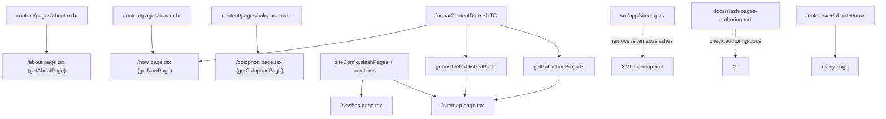

# Design Document

## Overview

This spec finishes the IndieWeb-convention slash pages on matthewfield.ca. It is deliberately the **smallest** of the recent specs: the requirements were already simplified across three adversarial rounds (the page registry, the XML refactor, the git-derived date, and the parity tests were all cut), so this design adds **no new build-time machinery** — no custom Velite loader, no AST chokepoint scanner, no new CI gate. It reuses the existing MDX-page pattern (`/about`), the existing `siteConfig` leaf, the existing shared date formatter, and the existing authoring-doc drift check.

Five pages are in scope:

- **`/about`** — finalize the already-wired MDX route: **author a real body** (the current `about.mdx` body is still the placeholder string and MUST be replaced for Req 10.2 to pass — this is authoring work, not verify-existing) + flip to indexable. The route wiring, `getAboutPage()` guard, and renderer are verify-existing; the body + index flip are new.
- **`/now`** — rewire from `<PlaceholderPage>` to MDX, with a required `updated` frontmatter date rendered in a `<time>`.
- **`/colophon`** — rewire from `<PlaceholderPage>` to MDX.
- **`/sitemap`** — a new component-only HTML page (no content file) listing Home + section pages + slash pages + primary content.
- **`/slashes`** — a new component-only index of the slash pages.

Plus six shared edits: one additive Velite field (`updated`), one one-line central date-formatter fix, two footer links, the XML sitemap `noindex`-route removal, a parameterized authoring-doc check, and a new authoring doc.

The author updates `/about`, `/now`, `/colophon` by editing MDX; `/slashes` and `/sitemap` track `siteConfig.slashPages` and the content helpers automatically.

### Revision notes (v2)

v2 responds to the v1 adversarial review, which verified every attack dimension against live code and judged the architecture sound and free of over-build — the exposure was concentrated in **test-spec precision** and **one false correctness generalization**. All findings were accepted:

- **(Highest-value correctness gap) `s.isodate()` does NOT pin to midnight.** Verified at `node_modules/velite/dist/index.js:140`: `s.isodate()` is `stringType().refine(Date.parse).transform(v => new Date(v).toISOString())` — it re-serializes *whatever the author wrote*. A date-only `2026-05-29` → `2026-05-29T00:00:00.000Z` (so the UTC-pinned formatter shows "May 29"), **but** a full datetime like `2026-05-29T18:30:00-04:00` is also accepted → re-serialized to `…T22:30:00.000Z` → UTC formatter shows the *next* day. So v1's "every consumer wants the calendar date, blast radius benign" was false for any time-of-day value. v2 scopes the claim to **date-only** values and adds an authoring-doc rule that `updated` (and dates generally) are **date-only `YYYY-MM-DD`, never with a time** (Req 9). v2 does **not** add a schema refine — that would deviate from Req 4.1's pinned "field addition only" and impose a cross-collection behavior change outside this spec's scope; the authoring-doc rule is the requirements-consistent mitigation (consistent with Decision #1's "authoring-doc reminder is the mitigation").
- **Blast-radius list was incomplete.** `formatContentDate` has **six** call sites; `/resources` (`resources.ts:56`) and `/contributions` (`contributions.ts:21`) are *also* same-reference re-exports. v2 corrects every blast-radius statement to name all four affected sections (`/blog`, `/projects`, `/resources`, `/contributions`) — all of which render date-only `s.isodate()` values, so the fix is correct for them.
- **(Highest-confidence implementation bug) the self-test rewrite was under-specified, with two red-test traps and a control-flow contradiction.** v2 replaces the loose prose with a **literal diff spec** for `scripts/check-authoring-docs.test.mjs`: the three pure-core call-sites that must pass the `headings` arg, the `writeDocs` helper that derives full-present text **per-doc** from `AUTHORING_DOCS[i].headings` (not the single old `ALL_PRESENT`), the zero-byte assertion changing from the hardcoded `CANONICAL_HEADINGS.length` (9) to the under-test doc's own heading count, and the corrected `main()` control flow (it **reports all** missing docs and aggregates the exit code; it does not stop at the first — the v1 "first missing doc → exit 1" phrasing was wrong).
- **Console/CSP "cleanliness" E2E had an unaddressed false-positive surface.** v2 specifies the carve-outs the sibling suites already use: **error-level only** (warnings excluded), **tolerate a missing Pagefind index** (the `(site)` chrome's search trigger may 404 the index, as `blog-axe.test.ts:78-81` already accommodates), and reliance on the **prod `pnpm start` server** (`playwright.config.ts`) to avoid dev-only React overlays.
- **Three asserted-but-unverified acceptance criteria.** v2 adds an E2E `toHaveTitle(/\| matthewfield\.ca$/)` check for all five pages (Req 7.1), decides **colophon external links open in the same tab with `rel="noopener"`** (so the `target="_blank"` → `noreferrer` NFR is N/A — matching the `/contributions`/`/resources` same-tab precedent) with a light E2E `rel` assertion, and restates Req 1.5 image-colocation as verify-existing.
- **Minor fixes:** `export type SlashPage` (the v1 snippet omitted `export`); the `getNowPage()` build-time-throw claim is now grounded in the `/about` module-load precedent rather than asserted; and the Req 10.4 UTC assertion is explicitly homed in the existing `src/lib/format-date.test.ts`.

### Revision notes (v3)

v3 responds to the v2/r2 adversarial review, which verified every v2 fix against live code and confirmed the architecture sound for a second round (no over-build; the self-test traps, control-flow contradiction, blast-radius list, and `export` typo all re-verified resolved). r2's exposure was concentrated in **new v2 mitigations that were weaker than their prose claims**. All findings accepted:

- **(Compounding, escalated) The date-only rule was documentation-only with a confirmed silent next-day bug, and a free fix was on the table.** r2 proved that a pasted evening-local timestamp (`2026-05-29T20:30:00-04:00`) in `now.mdx` builds clean and renders "May 30" — no test, no gate catches it. v3 adds the free fix r2 identified: the **already-planned Req 10.3 seed test (which already parses `now.mdx` frontmatter) asserts `!/T/.test(updated)`** — a one-line CI gate that rejects any time-of-day. v3 also corrects the refine-rejection rationale: r2 was right that v2 argued against a *posts-wide* refine (a strawman); a value-preserving **`pages`-only** refine would be pages-scoped and non-mutating. v3 still chooses the test assertion over a schema refine — because it adds zero change to the pinned Req 4.1 field type (`updated: s.isodate().optional()`), lives where the frontmatter is already read, and covers the only page that displays the date — but now says so honestly rather than via the strawman.
- **(Novel, significant) The Pagefind E2E carve-out was over-mitigation and mis-cited.** r2 proved `SiteSearch` (`site-search.tsx:55-83`) only fetches the index *inside the dialog-open effect*, and the slash-pages E2E never opens the dialog — so the index-404 console error **cannot fire** on these page loads. The cited `blog-axe.test.ts:78-81` is an axe-audit comment, not a console-error filter. v3 **removes the Pagefind carve-out entirely** (it guarded an unreachable path) and states plainly why none is needed.
- **(Novel) Component-page metadata `description` was a literal `"…"`.** Req 7.3 was left unspecified for `/sitemap` and `/slashes`. v3 specifies real description strings.
- **(Compounding) The zero-byte self-test assertion was specified two contradictory ways.** v3 picks the documented-coupling form `warningCount === <subject doc>.headings.length` (not the hardcoded `CANONICAL_HEADINGS.length`), and shows the `writeDocs` helper body (deriving each doc's dir from its `rel` via `path.dirname`).
- **(Novel) The colophon `rel` selector was broader than described.** r2 showed the host-based selector also collects the footer's `target="_blank"` external links (rendered on every page) and would mis-flag a hostless `mailto:` link. v3 scopes the selector to **`http(s):` external links only** and corrects the NFR narrative: the colophon *body* links open same-tab (`rel="noopener"`); the footer chrome's external links *do* use `target="_blank" rel="noopener noreferrer"` and the assertion correctly passes for both.
- **(Novel, low) The `toHaveTitle` precedent was overstated.** `smoke.test.ts:5` uses an *unanchored* `/matthewfield\.ca/` against the **home** page, whose title is the `default` (`siteConfig.name`) and does NOT pass through the `%s | …` template. v3 reframes the anchored `/\| matthewfield\.ca$/` check as a genuinely new assertion, noting `(site)/layout.tsx` has no title override so the root template resolves.
- **(Novel, low) XML-sitemap line citations were wrong and Req 8.4 focus-ring source was uncited.** v3 corrects the citation to `src/app/sitemap.ts:19-20` (with `/about`=15, `/now`=18 explicitly staying) and states the footer focus treatment honestly: no custom global `:focus-visible` rule exists in `globals.css`, so the new links use the identical className as the existing footer links (browser-default outline, per Req 8.2), with the `focus-visible:ring-*` utility on the PlaceholderPage "Return home" link noted as the established opt-in if a stronger ring is later wanted.

### Revision notes (v4)

v4 responds to the v3/r3 adversarial review (the third round), which verified all seven v3 fixes against live code, confirmed them internally consistent across Revision-notes / Architecture / Testing-Strategy, and judged the document **converged** — declining to manufacture a fourth structural objection. r3 raised one **real remaining blocker** and one cosmetic clarification; both accepted:

- **(Novel, the real remaining blocker) Seed content + authoring doc do not exist yet, and the design's own gates depend on them — not sequenced as in-spec prerequisites.** `content/pages/` holds only the placeholder `about.mdx` (body still the literal placeholder string); `now.mdx`, `colophon.mdx`, and `docs/slash-pages-authoring.md` are absent. So `next build` (the `getNowPage()`/`getColophonPage()` module-load throws), the seed-sentinel test (Req 10.2), the `!/T/` test (Req 10.3), and the two-doc CI gate (`ci.yml:49`) all go RED **by construction** until those files are authored — this is the spec's *initial* state, not a regression. v4 adds an explicit **"Implementation sequencing — in-spec content prerequisites"** subsection naming the four authoring deliverables as gated work that must land together with (or before) the route-rewire/CI edits so the tree is never red-by-construction mid-spec, reframes `/about` as **"flip-to-indexable + author real body"** (the placeholder body MUST be replaced for Req 10.2 — that is authoring work, not verify-existing), and annotates the Error-Handling scenarios that describe the initial (pre-authoring) state.
- **(Novel, cosmetic) `MDXContent` server-vs-client ambiguity under the no-`unsafe-eval` CSP.** `MDXContent` does `new Function(code)(runtime)` (`mdx-content.tsx:11`) and the CSP (`next.config.ts:69`) forbids `eval`. r3 confirmed this is benign — `MDXContent` has no `"use client"`, so the eval runs at SSR/build in Node (browser CSP does not apply), the identical path `/about` already ships. v4 adds a one-line clarification so a reader does not mistake it for a client CSP violation on the now-live `/now`/`/colophon` routes.

r3 also confirmed (no action needed): the two-doc CI self-test is hermetic (each tmp dir writes both docs from their own heading sets), the "zero added client JS" wording is honest (scoped to *added* JS beyond the `(site)` shell baseline), and `dynamic = "force-static"` on `/sitemap` is correct (the `getVisiblePublishedPosts()` draft-guard env is read at build/static-generation time, matching the existing static routes).

### Design-phase verification of the approved requirements

Unlike `contributions-and-resources` (whose pinned mechanisms did not survive contact with Velite's source), every mechanism the slash-pages requirements pin **was verified against live code during this design** and holds:

- The `pages` collection schema is a plain `.object({...}).transform(...)` (`velite.config.ts:47-58`) — **not `.strict()`** — so adding `updated: s.isodate().optional()` is a true field addition that cannot break existing `about.mdx` (Req 4). Confirmed: only `posts` is `.strict()` (`velite.config.ts:~95`).
- `formatContentDate` is a single TZ-naive `Intl.DateTimeFormat("en-CA", …)` with no `timeZone` (`src/lib/format-date.ts:1-9`), with **six call sites** rendering date-only `s.isodate()` values through it: `formatPostDate` (`blog.ts:87`), `formatProjectDate` (`projects.ts:76`), `formatResourceDate` (`resources.ts:56`), `formatContributionDate` (`contributions.ts:21`), plus direct calls in the project card/badge/detail and blog detail. So the central `timeZone: "UTC"` fix corrects `/now`, `/blog`, `/projects`, `/resources`, and `/contributions` alike (Req 2.2, Decision #5). **Caveat (v2):** `s.isodate()` re-serializes whatever the author wrote, so this is correct only for **date-only** values; the authoring convention (Req 9) is date-only `YYYY-MM-DD`.
- `getAboutPage()` evaluates at **module load** (`const aboutPage = getAboutPage()` at `about/page.tsx` top level), so mirroring it for `/now`/`/colophon` gives a genuine build-time throw (Reqs 2.3, 3.2).
- `scripts/check-authoring-docs.mjs` hardcodes a single `DOC_REL_PATH` + `CANONICAL_HEADINGS` and its `main()` reads `process.cwd()`-relative; its self-test (`check-authoring-docs.test.mjs`) spawns the script in tmp dirs containing only the contributions doc. So parameterizing `main()` **must** be paired with a test update or the five CLI self-tests break (Req 9.3 — the v3/r3 blocking finding). Verified the test currently writes only `DOC_REL_PATH`.
- The footer already renders a `/slashes` link inside `<nav aria-label="Footer">` (`footer.tsx`); only `/about` + `/now` are new (Req 8).
- `src/app/sitemap.ts` lists `/sitemap` (line 19) and `/slashes` (line 20) in its hardcoded `routes` array (`src/app/sitemap.ts:19-20`); removing those two strings is the one and only edit to that file (`/about`=line 15 and `/now`=line 18 stay — they are indexable). Req 7.6.

No requirements amendment is requested; all mechanisms are implemented as written.

## Steering Document Alignment

### Technical Standards (tech.md)

- **Static-first, server components, minimize client JS** (tech.md "Application Architecture", "Performance"): all five routes are server components with zero added client JS beyond the existing `(site)` shell. `/sitemap` and `/slashes` set `export const dynamic = "force-static"` (matching the `contributions`/`projects` route precedent); the MDX routes are static by default via module-level Velite data.
- **MDX-driven content via Velite** (tech.md "Content Pipeline"): `/about`, `/now`, `/colophon` render compiled MDX bodies; the `updated` field is build-time-validated by the existing `s.isodate()` schema type (the same one `posts` uses).
- **No new dependencies, no new CSP, no DB** (tech.md "Data Storage", "Security"): pages render only build-time content + config; no user input. External links in `/colophon` carry `rel="noopener"`.
- **90+ Lighthouse** (tech.md "Performance"): no images required, no client JS; manually verified at launch per the cross-spec baseline.
- **ESLint/Prettier/Vitest/Playwright, TS strict** (tech.md "Code Quality"): unit tests are colocated under `src/**`; E2E lives in `e2e/tests/` and runs via `scripts/run-e2e.mjs`.

### Project Structure (structure.md)

- Routes stay under `src/app/(site)/{about,now,colophon,sitemap,slashes}/page.tsx` (the directories already exist).
- `siteConfig` stays a **leaf** (`src/config/site.ts` imports nothing from `src/app/` or `src/components/`); `slashPages` is added there as data only (structure.md "Module Boundaries").
- Route files use `export default` (framework requirement); the new presentational pieces are inline in the route files (no component split is warranted — these are flat link lists), keeping with structure.md's "small focused files" without manufacturing components.
- `kebab-case` files, `camelCase` functions, typed config. No barrel files; direct imports.
- The authoring doc lives at `docs/slash-pages-authoring.md`; the CI script stays under `scripts/*.mjs`.

## Code Reuse Analysis

### Existing Components to Leverage

- **`getAboutPage()` + `MDXContent` route skeleton** (`src/app/(site)/about/page.tsx`, `src/components/shared/mdx-content.tsx`): `/now` and `/colophon` clone this exactly — a module-load `getXPage()` guard, `generateMetadata()` from frontmatter, an `<article>` wrapper with `<h1>` + `<MDXContent code={page.body} />`.
- **`formatContentDate(iso)`** (`src/lib/format-date.ts`): reused verbatim by `/now` for the `<time>` value; this design adds `timeZone: "UTC"` to its single formatter (the central fix).
- **`siteConfig`** (`src/config/site.ts`): extended with one new typed field `slashPages` and its `SlashPage` type, consumed by `/slashes` and `/sitemap`.
- **`getVisiblePublishedPosts()`** (`src/lib/blog.ts`) and **`getPublishedProjects()`** (`src/lib/projects.ts`): reused by `/sitemap` for the dynamic-content sections; both already guard the empty (`[]`) launch state without throwing.
- **`Footer`** (`src/components/layout/footer.tsx`): the existing `<nav aria-label="Footer">` gains `/about` and `/now` `<Link>`s matching the existing `hover:text-foreground` styling.
- **`check-authoring-docs.mjs` pure core** (`checkHeadings`): already structured for per-doc reuse; this design parameterizes `main()` over a doc-list.
- **E2E theme pattern** (`e2e/tests/blog-axe.test.ts`): the local `setupTheme(page, theme)` / `assertTheme(page, theme)` helpers driving `THEME_STORAGE_KEY` via `addInitScript` are the cross-spec theme-verification convention; the new slash-pages spec copies that idiom.

### Integration Points

- **`velite.config.ts`** — add `updated: s.isodate().optional()` to the `pages` object schema. The existing `title`/`description`/`slug`/`body` fields and the slug-prefix `.transform((data) => …)` are left byte-for-byte unchanged (no `{ meta }` arg, no git, no transform merge — Req 4.1).
- **`#site/content`** — the generated `Page` type gains `updated?: string`. The route files already import `{ pages }` from `#site/content` directly (`pages` is **not** chokepoint-guarded — the eslint `no-restricted-imports` rule names only `posts`); no chokepoint edit is needed.
- **`src/lib/format-date.ts`** — add `timeZone: "UTC"` to the one `Intl.DateTimeFormat`. Blast radius: all six consumers — `/now` (new), `/blog`, `/projects`, `/resources`, `/contributions`, and the projects updated-badge — render date-only `s.isodate()` values and want the authored calendar date; the change fixes a latent off-by-one on the existing five (Decision #5).
- **`src/app/sitemap.ts` (XML)** — delete the two strings `"/sitemap"` and `"/slashes"` from the `routes` array (`src/app/sitemap.ts:19-20`). Dynamic entries and the remaining static routes are untouched (Req 7.6). The `/sitemap` **page** does NOT import from this file.
- **`src/config/site.ts`** — add the `SlashPage` type, `slashPages: SlashPage[]` to the `SiteConfig` type and the `siteConfig` object.
- **`src/components/layout/footer.tsx`** — two new `<Link>`s.
- **`scripts/check-authoring-docs.mjs`** + **`scripts/check-authoring-docs.test.mjs`** — parameterize + update the self-test (Req 9.3). No new CI step (the existing `check:authoring-docs` step already runs the script).
- **`docs/slash-pages-authoring.md`** — new authoring doc.

## Architecture

The feature is five thin route slices over three shared edits (Velite field, date formatter, `siteConfig.slashPages`) plus one CI-script edit and one doc. There is **no new service layer** — the MDX pages read `#site/content` at module load exactly as `/about` does today; the component pages read `siteConfig` and the existing `src/lib` content helpers.



### Modular Design Principles

- **Single File Responsibility**: `siteConfig` holds the slash-page list (data only); route files own rendering + metadata; `velite.config.ts` owns the schema; `format-date.ts` owns date formatting. No route hand-maintains a parallel list.
- **Component Isolation**: the `/sitemap` and `/slashes` link lists are simple enough to live inline in their route files. Extracting them into `src/components/*` would add indirection without reuse (each is used once) — deliberately not done, per "don't over-engineer."
- **Service Layer Separation**: `/sitemap` calls `src/lib` helpers, never `#site/content` for posts/projects, and never `src/app/sitemap.ts`.
- **Utility Modularity**: the authoring-doc check keeps its pure `checkHeadings` core; the only change is threading the headings list as a parameter.

### Velite layer — additive `updated` field (Req 4)

```ts
// velite.config.ts — pages collection, AFTER (only the new line is added)
const pages = defineCollection({
  name: "Page",
  pattern: "pages/*.mdx",
  schema: s
    .object({
      title: s.string(),
      description: s.string(),
      slug: s.path(),
      body: s.mdx(),
      updated: s.isodate().optional(),   // NEW — same type posts uses (velite.config.ts:~100)
    })
    .transform((data) => ({ ...data, slug: data.slug.replace(/^pages\//, "") })),  // UNCHANGED
});
```

- `s.isodate()` is `stringType().refine(Date.parse).transform(v => new Date(v).toISOString())` (`velite/dist/index.js:140`) — it **re-serializes whatever the author wrote**, not "pins to midnight." A date-only `2026-05-29` round-trips to `2026-05-29T00:00:00.000Z` (so a UTC-frame consumer shows "May 29"); a value carrying a time-of-day would shift under UTC-pinning. The authoring convention (Req 9, v2) keeps these fields **date-only `YYYY-MM-DD`**, which is the only form `/about`/`/now`/`/colophon` will use.
- `.optional()` keeps the field collection-wide optional; `about.mdx`/`colophon.mdx` omit it and still validate (Req 4.2). The schema is not `.strict()`, so this cannot reject the existing files.
- `.transform` spreads `...data`, so `updated` flows to the output type automatically; no transform edit (Req 4.1).
- No git invocation is introduced (Req 4.4), so `pnpm dev` on an uncommitted `now.mdx` never fails.

### Date formatter — the central UTC fix (Req 2.2, Decision #5)

```ts
// src/lib/format-date.ts — AFTER
const contentDateFormatter = new Intl.DateTimeFormat("en-CA", {
  year: "numeric",
  month: "long",
  day: "numeric",
  timeZone: "UTC",            // NEW — render the authored calendar date, TZ-independent
});

export function formatContentDate(iso: string): { datetime: string; display: string } {
  return { datetime: iso, display: contentDateFormatter.format(new Date(iso)) };
}
```

`new Date("2026-05-29T00:00:00.000Z")` formatted with `timeZone: "UTC"` yields **"May 29, 2026"** in every ambient zone (without it, America/Toronto renders "May 28, 2026"). Because the formatter is now UTC-pinned, the unit test (in the existing `src/lib/format-date.test.ts`) is a single assertion that holds regardless of the runner's `TZ` (Req 10.4) — no TZ-mutation harness. (The existing date-only case in that file asserts only a loose regex and stays green; v2 adds the day-pinned `"May 29, 2026"` assertion alongside it.)

**Blast radius (corrected in v2):** all six `formatContentDate` consumers — `/now` (new), `/blog`, `/projects`, `/resources`, `/contributions`, and the projects updated-badge — render **date-only** `s.isodate()` values, so the UTC change shows the authored calendar date for every one. It is intentional and benign **for date-only values**.

**Time-of-day guard (v3).** A time-bearing `updated` (e.g. `2026-05-29T20:30:00-04:00`) is accepted by `s.isodate()` and re-serialized to UTC, which under the UTC-pinned formatter can shift the displayed day. The guard against this is **two-layered**: (1) the authoring convention (Req 9) mandates date-only `YYYY-MM-DD`; (2) — the load-bearing CI gate — the Req 10.3 seed test (which already reads `now.mdx`'s frontmatter) additionally asserts `!/T/.test(updated)`, failing the build for any time-of-day value on the one page that displays the date. v3 considered a **`pages`-only, value-preserving** `s.isodate().refine((v) => !/T/.test(v))`: it is *not* cross-collection (it touches only `pages`) and does not change the stored value or the transform, so it is a defensible reading of Req 4.1's "field addition only." v3 chooses the **test assertion** instead because it (a) leaves the pinned Req 4.1 field type `updated: s.isodate().optional()` byte-for-byte unchanged, (b) lives in a test that is already parsing the frontmatter (zero new machinery), and (c) covers the only page whose date is rendered. (The earlier "cross-collection / out-of-scope" rejection rationale was aimed at a posts-wide refine and is withdrawn.)

### Route layer

**MDX rendering is server-side (CSP note).** All three MDX routes render via `MDXContent` (`mdx-content.tsx`), which does `new Function(code)(runtime)`. `MDXContent` is a **server component** (no `"use client"`), so that eval runs at SSR/build in Node — browser CSP does not apply, and the client receives only rendered HTML. This is the identical path `/about` already ships in production; rewiring `/now`/`/colophon` to it adds no client-side eval and no CSP-violation surface (the no-`unsafe-eval` CSP at `next.config.ts:69` is irrelevant to server-side `new Function`).

**`/about`** (`src/app/(site)/about/page.tsx`) — verify-existing wiring + two new edits (author body, flip index):
- Preserve `getAboutPage()` (entry-existence throw at module load) and the `<article>`/`MDXContent` body (Reqs 1.1, 1.2, 1.6).
- Flip `generateMetadata()` from `robots: { index: false }` to `robots: { index: true }` (Req 1.3, 7.2).
- Real seed content authored into `content/pages/about.mdx`, replacing `Placeholder content. Replaced in a downstream spec.` (Req 1.3, 10.2).
- **Req 1.5 (verify-existing):** images embedded in any page MDX flow through the existing Velite `content/` → `public/static/` colocation pipeline; this spec adds no new image handling and changes nothing here.

**`/now`** (`src/app/(site)/now/page.tsx`) — rewire from `<PlaceholderPage>` to MDX:

```ts
import type { Metadata } from "next";
import { pages } from "#site/content";
import { MDXContent } from "@/components/shared/mdx-content";
import { formatContentDate } from "@/lib/format-date";

type Page = (typeof pages)[number];

// Mirrors getAboutPage() (entry-existence) AND additionally requires `updated`,
// so a dateless /now is a build error, not a silently-undated page (Req 2.3/2.5).
function getNowPage(): Page & { updated: string } {
  const entry = pages.find((page) => page.slug === "now");
  if (!entry) {
    throw new Error("Missing Velite entry for 'now' (expected content/pages/now.mdx)");
  }
  if (!entry.updated) {
    throw new Error("content/pages/now.mdx is missing required frontmatter 'updated' (a /now page needs a recency date)");
  }
  return entry as Page & { updated: string };
}

const nowPage = getNowPage();         // evaluates at module load → build-time throw

export function generateMetadata(): Metadata {
  return { title: nowPage.title, description: nowPage.description, robots: { index: true } };
}

export default function NowPage() {
  const { datetime, display } = formatContentDate(nowPage.updated);
  return (
    <article className="mx-auto w-full max-w-3xl px-4 py-16 sm:py-24">
      <h1 className="text-3xl font-semibold tracking-tight sm:text-4xl">{nowPage.title}</h1>
      <p className="mt-2 text-sm text-muted-foreground">
        Last updated <time dateTime={datetime}>{display}</time>
      </p>
      <div className="mt-6 text-base leading-relaxed text-foreground">
        <MDXContent code={nowPage.body} />
      </div>
    </article>
  );
}
```

- The `Page & { updated: string }` return narrows the optional field so `nowPage.updated` is `string` at the use site (TS strict — Req 2.3). The runtime guard rejects `undefined`; an empty string cannot occur because `s.isodate()` requires `Date.parse` to succeed, so the cast is honest (no hidden null).
- `<time dateTime={datetime}>` carries the ISO value; the rendered `display` is the UTC-framed calendar date (Req 2.2).
- **Build-time evaluation (grounded, not asserted):** `const nowPage = getNowPage()` runs at module top level exactly as the existing `const aboutPage = getAboutPage()` does (`about/page.tsx:19`). Next.js imports a statically-rendered route module during `next build`, so the throw fires before a build is emitted — this is the **same preserved invariant** that already protects `/about` (and which requires `velite build` to run before `next build`, as it does today on every CI/Vercel checkout). No new build-ordering risk is introduced. The Req 10.3 unit test deliberately reads the raw `.mdx` (not the route module) so it never triggers this import-time throw.

**`/colophon`** (`src/app/(site)/colophon/page.tsx`) — rewire to MDX with `getColophonPage()` **structurally identical to `getAboutPage()`** (entry-existence throw only — no `updated` requirement), `robots: { index: true }`, frontmatter-sourced metadata (Reqs 3.1-3.3). Seed content documents the stack (Next.js App Router, Tailwind v4, shadcn/ui, Velite, Vercel, GitHub Actions). External links **in the colophon body** open in the **same tab** with `rel="noopener"` (Req 3.4, NFR Security); because no body link uses `target="_blank"`, the NFR's `noreferrer` clause does not apply to them. (The footer chrome, rendered on this page like every other, does use `target="_blank" rel="noopener noreferrer"` for GitHub/LinkedIn — that is existing, compliant, and out of scope.) The E2E asserts the `rel` across all external `http(s)` links (above), and the authoring doc states the body same-tab convention so future colophon edits keep it.

**`/sitemap`** (`src/app/(site)/sitemap/page.tsx`) — component-only HTML page:

```ts
export const dynamic = "force-static";

export function generateMetadata(): Metadata {
  return {
    title: "Sitemap",
    description: "A human-readable index of every page, post, and project on matthewfield.ca.",
    robots: { index: false },
  };
}
```

The `description` is a real string (Req 7.3 — defined in code for the component-only pages), not a placeholder. Sections rendered, each an `<h2>` + `<ul>/<li>` of `<a>`:
1. **Home** — a single explicit `<a href="/">Home</a>` (Home is in neither `navItems` nor `slashPages`, so it must be added by hand — Req 5.1).
2. **Sections** — `siteConfig.navItems` (6 links).
3. **Slash pages** — `siteConfig.slashPages` (6 links incl. `/contact`).
4. **Posts** — `getVisiblePublishedPosts()` → `/blog/<slug>`; if empty, the section is omitted (Req 5.3).
5. **Projects** — `getPublishedProjects()` → `/projects/<slug>`; if empty, omitted.

A single `<h1>`, semantic `<ul>/<li>`, keyboard-navigable (Req 5.2). The page imports `siteConfig` and the two `src/lib` helpers only — **never** `src/app/sitemap.ts` (Req 5.5). No parity normalizer (Decision #4).

**`/slashes`** (`src/app/(site)/slashes/page.tsx`) — component-only index:

```ts
export const dynamic = "force-static";
export function generateMetadata(): Metadata {
  return {
    title: "Slashes",
    description: "An index of the standalone IndieWeb pages on matthewfield.ca and what each is for.",
    robots: { index: false },
  };
}
```

Renders `siteConfig.slashPages` as a `<ul>/<li>` (or `<dl>`) of titled, described links — each `<li>` an `<a href={href}>{title}</a>` + `<p>{description}</p>` (Reqs 6.1, 6.3). Single `<h1>`, server component, `noindex` (Reqs 6.3, 6.4).

### Config layer (Req 6.2, NFR)

```ts
// src/config/site.ts — additions
export type SlashPage = {
  href: string;        // leading slash, no trailing slash
  title: string;
  description: string;
};

// in SiteConfig: slashPages: SlashPage[];

slashPages: [
  { href: "/about",    title: "/about",    description: "Who I am beyond the resume." },
  { href: "/now",      title: "/now",      description: "What I'm focused on right now." },
  { href: "/colophon", title: "/colophon", description: "How this site is built." },
  { href: "/contact",  title: "/contact",  description: "Get in touch." },
  { href: "/sitemap",  title: "/sitemap",  description: "Every page and post, in one list." },
  { href: "/slashes",  title: "/slashes",  description: "This index of standalone pages." },
],
```

The set is exactly the six product-defined slash pages (Req 6.2). `SlashPage` is exported so `/slashes` and `/sitemap` share the type. `siteConfig` imports nothing from `app/`/`components/` (leaf — NFR).

### XML sitemap edit (Req 7.6)

In `src/app/sitemap.ts`, remove the two array members `"/sitemap"` (line 19) and `"/slashes"` (line 20) from `routes`. Nothing else changes — the dynamic post/tag/category/project entries and the `contributions`/`resources` entries are untouched. After the edit the XML sitemap no longer advertises the two `noindex` URLs (eliminating the Search-Console coverage warning).

### Footer edit (Req 8)

Add two `<Link>`s to the existing footer `<nav aria-label="Footer">`, before the `/slashes` link, matching the existing `className="hover:text-foreground"`:

```tsx
<Link href="/about" className="hover:text-foreground">/about</Link>
<Link href="/now" className="hover:text-foreground">/now</Link>
```

`/slashes` stays (verify-existing, Req 8.1). The top nav (`navItems`) is untouched (Req 8.3). **Focus states (Req 8.4):** the new links use the **identical className** as the existing footer links, so their focus treatment is identical to the current footer chrome by construction (Req 8.2 mandates matching the existing footer link styling). Honest note on the source of that treatment: `src/styles/globals.css` has **no** custom global `:focus-visible` rule, so the existing footer links — and therefore the new ones — show the **browser-default focus outline**. If a more prominent ring is later wanted, the established opt-in pattern is the `focus-visible:ring-2 focus-visible:ring-ring focus-visible:ring-offset-2` utility already used on the `PlaceholderPage` "Return home" link; this spec deliberately matches the existing footer links instead (per Req 8.2). The pre-existing LinkedIn href mismatch is left alone (explicitly out of scope).

### CI authoring-doc check — parameterized over a doc-list (Req 9.3)

The script's pure core stays; `main()` and `checkHeadings` are parameterized so multiple docs are gated without a new script.

```js
// scripts/check-authoring-docs.mjs — AFTER (shape)

// Per-doc canonical heading sets.
export const CANONICAL_HEADINGS = [ /* contributions headings — unchanged */ ];
export const SLASH_PAGES_HEADINGS = [
  "## Page frontmatter contract",
  "## Which file renders which page",
  "## Updating /now",
  "## Seed content expectation",
];

// The production doc-list (exported for the self-test to import).
export const AUTHORING_DOCS = [
  { path: "docs/contributions-and-resources-authoring.md", headings: CANONICAL_HEADINGS },
  { path: "docs/slash-pages-authoring.md",                 headings: SLASH_PAGES_HEADINGS },
];

// Pure core now takes the headings list as a parameter.
export function checkHeadings(docText, headings) {
  const lines = new Set(docText.split(/\r?\n/));
  const missing = headings.filter((h) => !lines.has(h));
  return { exitCode: missing.length === 0 ? 0 : 1, missing };
}

// CLI entry takes the doc-list; iterates, aggregates exit code + warnings.
function main(docs) {
  let exitCode = 0;
  for (const { path: rel, headings } of docs) {
    const docPath = path.join(process.cwd(), rel);
    if (!existsSync(docPath)) {
      process.stderr.write(`${TAG} author doc not found: ${docPath}\n`);
      exitCode = 1;
      continue;
    }
    const { exitCode: code, missing } = checkHeadings(readFileSync(docPath, "utf8"), headings);
    for (const heading of missing) {
      console.log(`::warning::${TAG} canonical heading missing from ${rel}: "${heading}"`);
    }
    if (code !== 0) exitCode = 1;
  }
  process.exit(exitCode);
}

if (process.argv[1] && process.argv[1] === fileURLToPath(import.meta.url)) {
  main(AUTHORING_DOCS);
}
```

- Doc-not-found stays exit-non-zero + stderr + **no annotation**; missing heading stays `::warning::` + exit-non-zero (semantics preserved per doc — Req 9.3).
- `CANONICAL_HEADINGS` stays exported (the contributions set) so its existing test import keeps working.

**Self-test update — literal diff spec** (`scripts/check-authoring-docs.test.mjs`, Req 9.3). This rewrites a currently-passing test, so the edits are enumerated as a checklist, not prose. The v1 review surfaced two concrete red-test traps and one control-flow misstatement; all are pinned below.

*Control-flow correction.* The new `main(docs)` **iterates all docs, aggregates the exit code, and reports every problem** — it does NOT `process.exit` on the first missing doc (the v1 prose "first missing doc → exit 1" was wrong; the code above `continue`s and exits once after the loop). The five assertions are evaluated against that report-all behavior below.

1. **Pure-core call-sites (mandatory — 3 edits).** The three existing pure-core tests call `checkHeadings(text)` with one arg (`test.mjs:41,48,54`); after the signature change `headings` would be `undefined` and `headings.filter` throws. Each MUST pass the headings list explicitly: `checkHeadings(ALL_PRESENT, CANONICAL_HEADINGS)`, `checkHeadings(CANONICAL_HEADINGS.slice(1).join("\n\n"), CANONICAL_HEADINGS)`, `checkHeadings("", CANONICAL_HEADINGS)`. (Using the contributions set keeps these tests' expected `missing` arrays unchanged.)

2. **`writeDocs` helper derives full-present text PER DOC.** Replace the single-doc `writeDoc(dir, content)` and the single `ALL_PRESENT = CANONICAL_HEADINGS.join(...)` constant with `writeDocs(dir, overrides)` that writes **every** entry in `AUTHORING_DOCS`, defaulting each unspecified doc to `doc.headings.join("\n\n")` (its OWN heading set — NOT the contributions `ALL_PRESENT`). `overrides` keys a `rel` path to scenario content for the doc-under-test. Helper body (derives each doc's dir from its `rel`, so it generalizes beyond `docs/`):
   ```js
   function writeDocs(dir, overrides = {}) {
     for (const { path: rel, headings } of AUTHORING_DOCS) {
       const content = rel in overrides ? overrides[rel] : headings.join("\n\n");
       const abs = path.join(dir, rel);
       mkdirSync(path.dirname(abs), { recursive: true });
       writeFileSync(abs, content);
     }
   }
   ```
   This closes trap (a): if the slash doc were written with contributions headings it would be permanently missing all four slash headings and break the "exit 0" test.

3. **CLI assertion edits (the two traps):**
   - *all-present → exit 0, no stdout:* `writeDocs(dir, {})` writes both docs full-present (each from its own headings) → exit 0, no `::warning::`. Holds with the per-doc helper.
   - *one heading missing → non-zero + `::warning::`:* `writeDocs(dir, { [CONTRIB_REL]: CANONICAL_HEADINGS.slice(1).join("\n\n") })` (sibling full-present) → exit 1, `::warning::` present. Holds.
   - *doc missing → non-zero + stderr + NO annotation:* `writeDocs(dir, {})` is NOT used; write **neither** doc (`makeTmp()` only). `main()` reports `author doc not found` for **both** docs (two stderr lines), no `::warning::`, exit 1. Assertions `match(stderr, /author doc not found/)` + `doesNotMatch(stdout, /::warning::/)` both hold under report-all.
   - *zero-byte doc → per-heading warnings:* **trap (c) — the assertion count must become per-doc.** The test writes the doc-under-test zero-byte and the sibling full-present; the script emits one `::warning::` per missing heading in the zero-byte doc and zero for the full sibling, so the count equals **that subject doc's own heading-set length**. Pin the assertion to that, explicitly: `warningCount === <subjectDoc>.headings.length` (e.g. `SLASH_PAGES_HEADINGS.length` when the slash doc is the subject; `CANONICAL_HEADINGS.length` when contributions is). **Do not** keep the hardcoded `=== CANONICAL_HEADINGS.length` from the current `test.mjs:104` — that only coincidentally holds when contributions is the subject and silently breaks if the subject changes. This is the single chosen form (the v2 prose offered two; this is the documented-coupling one).

4. **`CANONICAL_HEADINGS` stays exported** (the contributions set) so the existing `test.mjs:17` import is unchanged; `SLASH_PAGES_HEADINGS` and `AUTHORING_DOCS` are new exports the test also imports.

No new CI step: `package.json`'s `check:authoring-docs` script and its CI invocation already run `node scripts/check-authoring-docs.mjs`, which now gates both docs.

### Authoring doc (Req 9.1, 9.2)

`docs/slash-pages-authoring.md`, following the tone/structure of `docs/contributions-and-resources-authoring.md`, with the canonical headings above:
- **`## Page frontmatter contract`** — `title`, `description` required; `updated` optional **date-only** ISO `YYYY-MM-DD` — **never with a time-of-day**, because `s.isodate()` re-serializes a datetime to UTC and the UTC-pinned formatter would then shift the displayed day for evening-local authoring (v2 §1). No `.strict()`, so unknown keys are ignored (documented).
- **`## Which file renders which page`** — `about.mdx`→`/about`, `now.mdx`→`/now`, `colophon.mdx`→`/colophon`; `/sitemap` and `/slashes` are component-only (no file). Colophon external links open in the same tab (`rel="noopener"`, no `target="_blank"`).
- **`## Updating /now`** — bump `updated` (date-only) on each meaningful change; a missing `updated` on `now.mdx` is a build error; the stale-date tradeoff (Decision #1).
- **`## Seed content expectation`** — replace placeholder bodies with real prose; the placeholder sentinels that CI rejects.

### Implementation sequencing — in-spec content prerequisites (v4)

The seed `.mdx` files and the authoring doc **do not exist yet** (`content/pages/` holds only the placeholder `about.mdx`; `now.mdx`, `colophon.mdx`, `docs/slash-pages-authoring.md` are absent). They are **gated, in-spec deliverables**, not downstream assumptions — every gate this spec adds is RED *by construction* in the spec's initial state until they are authored:

| Gate added by this spec | Red until… |
|---|---|
| `next build` (module-load `getNowPage()`/`getColophonPage()` throws) | `now.mdx` + `colophon.mdx` exist with valid entries |
| `getNowPage()` `updated` throw (Req 2.3) | `now.mdx` carries a date-only `updated` |
| Seed-sentinel test (Req 10.2) | all three bodies are real prose (the current `about.mdx` body is the placeholder string) |
| `!/T/` test (Req 10.3) | `now.mdx` frontmatter parses with a date-only `updated` |
| Two-doc CI gate `pnpm check:authoring-docs` (`ci.yml:49`) | `docs/slash-pages-authoring.md` exists with all four canonical headings |

**Sequencing rule:** author the four content/doc deliverables **together with (or before)** the route-rewire, schema, config, and CI edits — never land the code edits against an empty `content/pages/`, or the tree is red-by-construction mid-spec. The four deliverables are: (1) real `about.mdx` body (replacing the placeholder); (2) `now.mdx` body + date-only `updated`; (3) `colophon.mdx` body + stack links (same-tab `rel="noopener"`); (4) `docs/slash-pages-authoring.md` with the four canonical headings. (`docs/projects-authoring.md` exists but stays OUT of `AUTHORING_DOCS` — pre-existing, out of scope.) The tasks phase orders these accordingly.

## Components and Interfaces

### MDX route guards (`src/app/(site)/{about,now,colophon}/page.tsx`)
- **Purpose:** map a `pages` collection entry to a rendered article; fail loudly at build if absent.
- **Interfaces:** `getAboutPage()`, `getNowPage()`, `getColophonPage()` (module-load); `generateMetadata()`; default page component.
- **Dependencies:** `#site/content` (`pages`), `MDXContent`, `formatContentDate` (`/now` only).
- **Reuses:** the `getAboutPage()` pattern verbatim (existence); `/now` extends it with the `updated` throw.

### Component pages (`src/app/(site)/{sitemap,slashes}/page.tsx`)
- **Purpose:** render link lists from config + content helpers.
- **Interfaces:** `generateMetadata()` (code-defined title/description, `noindex`); default component.
- **Dependencies:** `siteConfig`, `getVisiblePublishedPosts`, `getPublishedProjects` (`/sitemap` only).
- **Reuses:** `siteConfig.navItems`/`slashPages`; `src/lib` content getters. Does NOT import `src/app/sitemap.ts`.

### `siteConfig.slashPages` (`src/config/site.ts`)
- **Purpose:** single source of the slash-page list.
- **Interfaces:** exported `SlashPage` type; `siteConfig.slashPages: SlashPage[]`.
- **Dependencies:** none (leaf).
- **Reuses:** the existing `siteConfig` object/type.

### `formatContentDate` (`src/lib/format-date.ts`)
- **Purpose:** format a date-only ISO value as the authored calendar date.
- **Interfaces:** `formatContentDate(iso) → { datetime, display }` (unchanged signature).
- **Reuses:** itself — the only change is the `timeZone: "UTC"` formatter option.

### Authoring-doc check (`scripts/check-authoring-docs.mjs`)
- **Purpose:** fail CI on heading drift across a list of authoring docs.
- **Interfaces:** `checkHeadings(docText, headings)`, `main(docs)`, exported `AUTHORING_DOCS`/`CANONICAL_HEADINGS`/`SLASH_PAGES_HEADINGS`.
- **Reuses:** the existing pure-core + `::warning::` annotation form.

## Data Models

### Page (`.velite/pages.json` element / `#site/content` `pages[number]`)
```
- title: string         (required)
- description: string   (required)
- slug: string          (s.path(), "pages/" prefix stripped by transform)
- body: string          (compiled MDX function-string)
- updated?: string      (NEW — s.isodate(), full midnight-UTC ISO when present)
```

### SlashPage (`src/config/site.ts`)
```
- href: string          (leading slash, no trailing slash)
- title: string         (non-empty)
- description: string   (non-empty)
```

## Error Handling

> **Initial-state note (v4):** Scenarios 1, 2, 3, and 7 below describe the spec's **initial** state (no seed content, no authoring doc) as much as any later regression — they are RED by construction until the in-spec content prerequisites (see *Implementation sequencing*) are authored. They are fail-loud guards that also gate first delivery, not only ongoing protection.

### Error Scenarios

1. **`content/pages/now.mdx` or `colophon.mdx` missing (or `pages` entry absent)**
   - **Handling:** `getNowPage()` / `getColophonPage()` throw a named `Error` at module load (build time), mirroring `getAboutPage()`.
   - **User Impact:** the build fails with a named diagnostic; production is never updated. Never a placeholder or silently-empty page (Reqs 2.3, 3.2, Reliability).

2. **`now.mdx` present but missing `updated` frontmatter**
   - **Handling:** `getNowPage()` throws `content/pages/now.mdx is missing required frontmatter 'updated' …` (Req 2.3/2.5). The Req 10.3 unit test is the CI belt to this build-time brace.
   - **User Impact:** build fails; the author adds an `updated` date. A dateless `/now` never ships.

3. **A page's seed body is still the placeholder during the index flip**
   - **Handling:** the Req 10.2 unit test reads the raw `.mdx` from disk, strips frontmatter, and asserts the body does NOT contain the literal placeholder strings `"Placeholder content."` / `"Replaced in a downstream spec."`.
   - **User Impact:** CI red until real content is authored. (Narrow guard — not a content-quality floor.)

4. **`siteConfig.slashPages` drifts (wrong count, empty title/description, bad href)**
   - **Handling:** the Req 10.1 unit test enforces the invariant (exactly the six hrefs; non-empty `title`/`description`; leading-slash `href`).
   - **User Impact:** CI red on regression.

5. **A static `/sitemap`/`/slashes` link is broken/typo'd**
   - **Handling:** the Req 10.5 E2E asserts every static `/sitemap` link (Home + `navItems` + `slashPages`) and every `/slashes` link resolves to HTTP 200.
   - **User Impact:** CI red; the human sitemap can never silently omit/break a real page.

6. **Zero published posts or projects at launch**
   - **Handling:** `getVisiblePublishedPosts()`/`getPublishedProjects()` return `[]`; the `/sitemap` section is omitted (no throw).
   - **User Impact:** `/sitemap` renders the static sections only, no error.

7. **Authoring doc loses a canonical heading**
   - **Handling:** `check:authoring-docs` emits `::warning::` and exits non-zero.
   - **User Impact:** CI red until the doc heading is restored.

8. **Unknown path (e.g. `/about-us`)**
   - **Handling:** the existing global `not-found.tsx` serves; this spec adds no per-page 404 (Req 10.7).

## Testing Strategy

### Unit Testing (Vitest, colocated under `src/**`, per `vitest.config` `include`)

- **`src/config/site.test.ts`** (Req 10.1): assert `siteConfig.slashPages` has exactly the six expected hrefs (`/about`, `/contact`, `/colophon`, `/now`, `/sitemap`, `/slashes`); each entry has a non-empty `title`, non-empty `description`, and an `href` starting with `/`.
- **Seed-sentinel test** (Req 10.2): read the raw `content/pages/{about,now,colophon}.mdx` from disk via `fs` (NOT the compiled `body`), strip the leading `---…---` YAML block, and assert the remaining body does not include `"Placeholder content."` or `"Replaced in a downstream spec."`. No word-count floor, no generic sentinels.
- **`now.mdx` carries a date-only `updated`** (Req 10.3): read raw `now.mdx`, parse the frontmatter, assert an `updated` key is present (belt to the `getNowPage()` build brace) **and** assert `!/T/.test(updated)` — i.e. it is a date-only `YYYY-MM-DD`, never a time-bearing value (v3, the CI gate against the UTC display-shift). A dedicated missing-entry test is OPTIONAL (it would require destabilizing the shared `pages` collection) — the module-load throws are the primary safeguard.
- **`formatContentDate` UTC** (Req 10.4), added to the existing **`src/lib/format-date.test.ts`**: `formatContentDate("2026-05-29T00:00:00.000Z").display === "May 29, 2026"` (and the date-only `"2026-05-29"` form). TZ-independent by construction (no `TZ` harness) — this single day-pinned assertion proves the off-by-one fix for all six consumers (`/now`, `/blog`, `/projects`, `/resources`, `/contributions`, projects-badge). The file's existing loose-regex date-only case stays green.

### Script self-test (`node --test scripts/check-authoring-docs.test.mjs`)

Implemented per the literal diff spec in **Architecture → CI authoring-doc check** (the three pure-core call-site edits, the per-doc `writeDocs` helper, and the per-doc zero-byte count). Summary:
- Pure-core: all-present / one-missing / zero-byte, now calling `checkHeadings(text, CANONICAL_HEADINGS)`.
- CLI (under the two-doc `AUTHORING_DOCS` list, `main()` reporting all docs): all-present → exit 0, no stdout; one heading missing in the doc-under-test → exit non-zero + `::warning::`; neither doc written → exit non-zero + two `author doc not found` stderr lines, no `::warning::`; zero-byte doc-under-test → exit non-zero + warnings counted against **that doc's own** heading-set length (not the hardcoded 9). Fixtures write every managed doc (the not-under-test doc fully-present from its own headings) via `writeDocs`.

### End-to-End Testing (Playwright, `e2e/tests/slash-pages.test.ts`, run via `scripts/run-e2e.mjs`)

Following the `blog-axe.test.ts` theme convention (local `setupTheme`/`assertTheme` over `THEME_STORAGE_KEY`), parameterized over `["light","dark"]`. The E2E runs against the prod `pnpm start` server (`playwright.config.ts`), so there is no dev-only React error overlay:

- For each of `/about`, `/now`, `/colophon`, `/sitemap`, `/slashes`: navigate, assert HTTP 200 and a visible `level: 1` heading (Req 10.5).
- **Title-template resolution (Req 7.1):** for each of the five pages assert `await expect(page).toHaveTitle(/\| matthewfield\.ca$/)` — proving the per-page title resolves through the root `template: "%s | matthewfield.ca"` (`layout.tsx:19-22`). This is a **new, stricter** assertion: `smoke.test.ts:5` uses an *unanchored* `/matthewfield\.ca/` against the **home** page, whose title is the `default` (`siteConfig.name`) and does NOT pass through the `%s | …` template — so it does not prove the anchored template resolution this check needs. The resolution is structural: `(site)/layout.tsx` is a bare `SiteShell` with no `metadata`/title override, so the five routes' `title: "<X>"` resolve to `"<X> | matthewfield.ca"`. Titles are SSR'd into `<head>` (server components, no client title swap), so there is no mutation-timing flake.
- `/now`: assert a `<time>` element is present (Req 10.5).
- **Colophon external-link `rel` (NFR Security):** on `/colophon`, select external **`http(s):`-only** anchors — `a[href^="http"]` whose URL host ≠ the site host (the `http(s)` filter excludes `mailto:`/hostless links, which would otherwise be mis-flagged) — and assert each has a `rel` attribute containing `noopener`. Note the selector also collects the **footer's** GitHub/LinkedIn links (the footer renders on every page including `/colophon`); those use `target="_blank" rel="noopener noreferrer"` (`footer.tsx`) and pass the assertion. The colophon **body** links open in the **same tab** (`rel="noopener"`, no `target="_blank"`, matching the `/contributions`/`/resources` precedent); so across body + chrome every external link satisfies the NFR. (Correction to v2: the page is not free of `target="_blank"` links — the footer chrome has them, correctly carrying `noreferrer`.)
- Link-resolution guard (Req 5.5, 10.5): on `/sitemap`, collect the static-section hrefs (Home + `navItems` + `slashPages`, all leading-slash root-relative so they resolve against `baseURL`); on `/slashes`, collect every link href; for each, `page.request.get(href)` and assert `response.ok()` (200). `/contact` 200s under a plain GET (it is `force-static`; its CSP affects only `<script>`/`form-action`, not a GET). Dynamic post/project links are not in this static set — Req 10.5.
- Console/CSP cleanliness (Req 10.5, NFR Security): attach `page.on("console", …)` **filtered to `msg.type() === "error"`** (warnings — incl. next-themes/hydration `console.warn` — are excluded) and `page.on("pageerror", …)`; after load assert no errors were collected, for all five pages. **No Pagefind carve-out is needed (v3):** the `(site)` Header mounts `<SiteSearch>`, but it only fetches `/pagefind/pagefind-entry.json` *inside the dialog-open effect* (`site-search.tsx:55-83`), and this suite never opens the search dialog — so a missing-index 404 cannot fire on a plain page load. Relying on the prod `pnpm start` server (no dev React overlay) plus the error-level filter, a genuine console error or CSP violation must fail the test.
- Both themes (Req 10.6): every assertion runs once per theme via the loop.

### Manual verification at launch

- Lighthouse 90+ on all five pages (cross-spec performance baseline, NFR Performance).
- WCAG 2.1 AA contrast in both themes (NFR Accessibility) — semantic landmarks, single `<h1>`, `<time>` on `/now`, focusable footer links.
