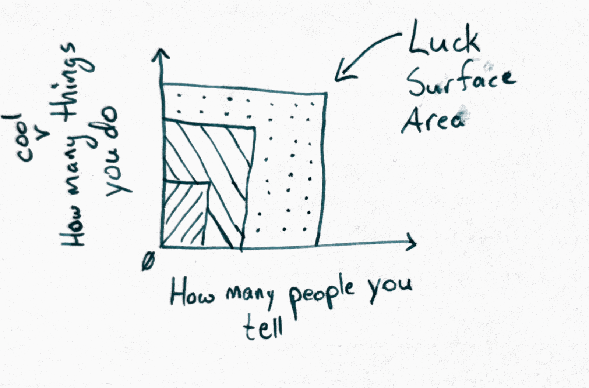
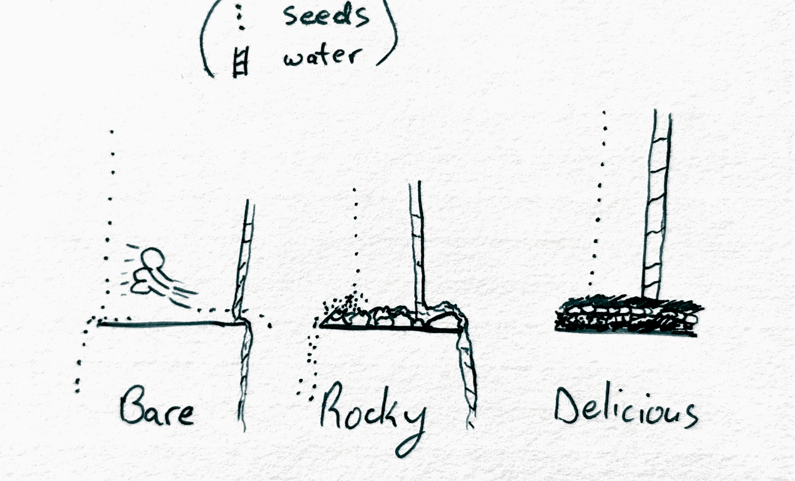

## How To: Faceplant Your Sales Demo

Back in the spring I had a decent shot at a sales engineering job with a tech firm called [Akuity](https://akuity.io/). I'd gotten through a few interviews, put together a solution proposal that I thought was stellar, and booked a live presentation to walk the Sales Engineering team through it. I did a dry-run earlier that day and all was well.

Minutes - yes, actually, literally a few minutes - before the meeting, an access token on which my demo depended expired. I didn't realize this until I was sharing my screen with the people I was trying to impress (I either missed or didn't get any notifications about it), at which point I got to spend about half of the already short time scrambling to get the thing working again while they watched. One of them helpfully tried to salvage our time by asking me some hypotheticals while I unexpectedly demonstrated my troubleshooting skill & speed.

This was not helpful.

It was not fun.

I did not get a job offer.

In hindsight, I should have rescheduled, should have rehearsed a backout spiel, but in the heat of the moment it seems I decided the only way out was through.\
Every now and then, I guess the obstacle really _isn't_ the path.

¯\\_(ツ)_/¯

I told that story in a [previous post](/blog/seasons-of-life-and-announcement) as one of the reasons I paused looking for a job. I wanted to tell it again, because I've been chewing on a concept for a couple months and that demo going up in flames... okay, well, it's not a _great_ example of it but I can't think of a better one, and, well, it's my blog so I'm processing my traumas whether you read it or not. The concept in question is the **luck surface area**.

_(Don't fear. I manage to beat the example back into submission later on. It'll all come together.)_

## Luck Surface Area

### The Equation

The phrase "luck surface area" has been going around for a while. [Jason Roberts](https://www.codusoperandi.com/posts/increasing-your-luck-surface-area) seems to have coined it back in 2010:

> The amount of serendipity that will occur in your life, your Luck Surface Area, is directly proportional to the degree to which you do something you're passionate about combined with the total number of people to whom this is effectively communicated.

(His post is very short and worth the read to get his whole idea.)

Roberts illustrates luck surface area as a two-dimensional product of these two numbers:

- how many interesting things you do
- how many people you tell about these things

Do interesting things in private and the second number is zero.\
Talk constantly but do nothing and the first one is.\
Either way, failing to do either produces an area of zero. A square with one side of length 0 has no area.

Do both and you've got a square that can catch luck.

### Katrina

I have to shout out [Katrina Romulo](https://www.youtube.com/watch?v=OlBm1Tme_xs) and her New York travel video for bringing the concept to my awareness. She'd been laid off 2 months after the proudest project of her career, and in the meantime had developed enough travel anxiety that she was saying no to most things. To break out of her funk, she booked a week in New York - with no plan whatsoever - to see if luck would find her.

The first two nights she didn't sleep at all, was having a gnarly time, and she came pretty close to changing her flight and going home.

But she realized something: she'd been seeing things & going places _but she hadn't actually told anybody she was in the city._\
Doing, yes. Telling, zero!

So she texted her cousin, and like magic the week filled itself in - museum days, dinner with a print studio she'd taken a workshop with in Manila years earlier, an aunt texting about a Broadway show that night, a print of something she'd drawn on the plane that showed up in the mail weeks later. As she puts it, none of it was Earth-shattering, but it was all **good**. She went home feeling like she'd been living instead of just existing, which is exactly what she'd hoped for.

Okay neat, that's the two numbers forming a square that 🌈luckdrops🌈 can fall on. Look at _what_ her luck landed _on_, though: a cousin, an aunt, a studio she'd met years before. Everything's a something that existed before she boarded the plane. Whether she realizes it or not, Katrina's cultivated a 🌳🌻substrate🌻🌳 that was fertile and ready to receive the luckdrops.

## 100 Days of Solitude (or so)

For four straight months after losing my job, I applied for new jobs. Full-time. I paid for access to a few remote job boards, and spent my days writing cover letters, tailoring resumes, researching companies & their platforms, prepping for interviews, getting rejection letter after rejection letter (many identical in wording from wildly different companies), and zero useful feedback from the interviewers.

More than 75 targeted, good-fit applications. Four months.

My brain was oozing out my ears, and I had very little to show for it.

Job applications are _doing_ with the _telling_ switched off. One recruiter sees it, maybe a hiring manager, and then it goes in the forever box. Nobody outside that loop can see any of it, so nothing outside that loop can land on it. Four months of full-time effort with a surface area of roughly one.

And then the sales engineering interview. That _was_ luck landing a hit on a small surface, but there was nothing to **catch** that luckdrop, hold it, nurture it, until it could give fruit.

### Let's abuse a metaphor!

I wrote this on an index card a while back:

> putting in the work does two things. It increases the surface area for luck to land on, _and_ it prepares a substrate that will catch, hold, and grow the spark when it hits.

:::aside
Side note: having a stack of blank index cards and a pen handy at all times is a super simple way to give your creative juices a kick in the ass. Your mind is regularly coming up with things. Ideas, questions, jokes - literally whatever you hear bouncing around in there; getting those things **out of your head and into the written environment as soon as possible** is like giving these ethereal psychic sparks a physical body. They find a home in the real world and as we all know, ideas love company. My index cards have become a village of ideas & questions & concepts & affirmations that have time and space to mingle like neighbors. Each new one has its own unpredictable impact on the dynamic. I swear these things are breeding. Anyways, give it a try. Maybe I'll make a small post about how I ingest and organize them sometime. Lemme just write that on a card...
:::

Right, substrate, ok. Here's a metaphor: Seeds land everywhere when they're released. Some will land on concrete, some on rocky ground, and some will land on good soil. The seeds' success is strongly related to the soil quality. [This is obviously not a novel idea](https://en.wikipedia.org/wiki/Parable_of_the_Sower).

Let's now whip the metaphor into our service: We're farmers and we want to grow crops. Cash crops, food crops, [balloon crops](https://www.jerdinenolen.com/books/bk_harvey_potter_balloon_farm.html), whatever - we want crops that sprout, grow, and produce a harvest. In our metaphor, seeds fall randomly from the sky like rain, and will grow into crops given good soil and care. But! The seeds produced by crops are themselves unable to sprout & grow. If they could, this whole thought experiment falls over. Look, the metaphor's crying now, poor thing.

We could consider our luck surface area as the amount of land we own as a farmer: if we want a larger surface area, we buy or seize or embezzle more land. More land means more seeds will fall on our holdings, which means more harvest in a given season. That's as far as Jason Roberts' luck surface area definition goes - more area means more luck.

I think there's more to it, though.

My sales demo had plenty of surface area. It didn't have a good substrate: in this specific case, some combination of safety fallbacks that would have had a better chance at saving the broken demo and ultimately my candidacy. Good loamy soil that would have held the seed of luck through stormy weather: backup slides and screenshots, a rehearsed "the demo is broken, here are our options right now" script, confidence in rescheduling the demo, &c. Any one of those and the exact same luck would have stuck. I'm not beating myself up over this, mind you. These are things I didn't know, or at least didn't think of. I'd never done a sales demo before, never considered its exigencies & responses. Now I've learned, and next time a demo fails I'll handle it better. Thus have I cultivated the substrate.

### The Third Dimension

This is my contribution to the luck surface area idea: A third dimension of substrate. Here are three different luck surface areas, each the same size, knocked over onto their backs to show each's different substrates from the side view. Each can catch, hold, protect, and nurture a different amount of seeds. **We as farmers have to develop that substrate if we want a good harvest.**

## Tradr's luck surface

On August 27 I posted about Tradr on LinkedIn. I had 264 followers at the time and never a post with more than a few hundred impressions.\
The post got 141,000 impressions and reached 96,000 people. 968 of those people clicked through to my profile. 24 followed my account. 72 saved the post for later.

The substrate caught a good chunk of that. Anyone who clicked landed on a working registration page, a docs site, a public repo, and a release pipeline that shipped a fix 5 days later. The first bug report came in within a day, from a fella I last worked with at NextDigital, and it was a real one: the onboarding walkthrough was broken, and my staging environment had somehow hidden that from me. That bug got found because the post existed. It got fixed in 5 days because the pipeline did.

The substrate dropped a lot too. 92,810 people reached and 22 new followers is a pretty rough conversion rate. There was no newsletter line in that post, and nothing on my site yet for a stranger to fall into and stay. The audience part of the substrate just hadn't been built. The luck landed on it anyway, and slid right off.

The same week I posted the same product to r/opensource. Zero upvotes, one comment calling it AI slop. Same substrate, different surface. You don't get to pick which surface the luck lands on, which is why another one of my cards says _more and smaller bets_: I don't know which ones will work yet, and the outside world will tell me.

## The part where I argue with two people at once

One more card, and then I'll stop quoting myself: _visioning is tuning our receptor paths to specific things. It doesn't mystically, magically create those things out of nothing._

I think there are two kinds of people who get luck wrong, and they get it wrong in mirror image. The hustle version treats surface area as the whole game: post more, ship more, and the numbers will take care of themselves. The manifestation version treats wanting as the whole game: get clear on what you want, really feel it, and it'll come to you.

Honestly, both are about half right. Wanting something does change what you notice when it flies past - that's real, and it's a nervous-system thing. Doing things in public does change how often something flies past at all. Neither one has any say in whether it sticks. That's the substrate, and it's the only one of the three you build entirely on your own time, before anything has shown up.

## So, what am I doing about it?

I gave myself 6 months to make self-employment sustainably pay the bills, which puts the clock at February. The bets are more and smaller. Field Notes (the newsletter this essay goes out in) is the audience substrate I didn't have on launch day. The Tradr repo stays public so that contributor luck has somewhere to land. And every Friday I sit down and write out what happened that week, which turns out to be the tuning: what landed, and what slid off.

I don't know which of these is going to be the one. I'm fairly sure that's the point.

What's landed on you this year that you weren't ready for? Reply if you're reading this in your inbox - I respond to every human.

p.s. Steven, thanks again for the bug report. It landed.
