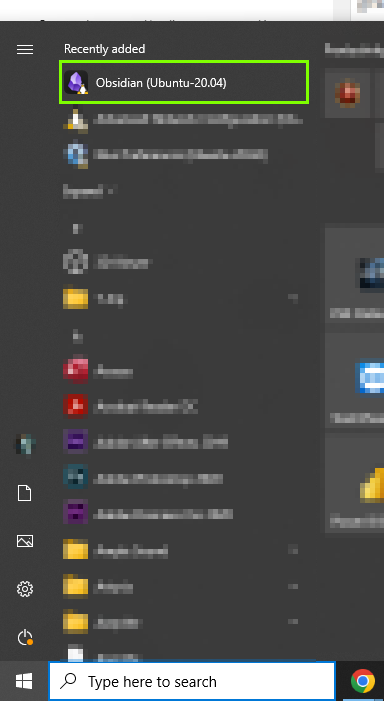
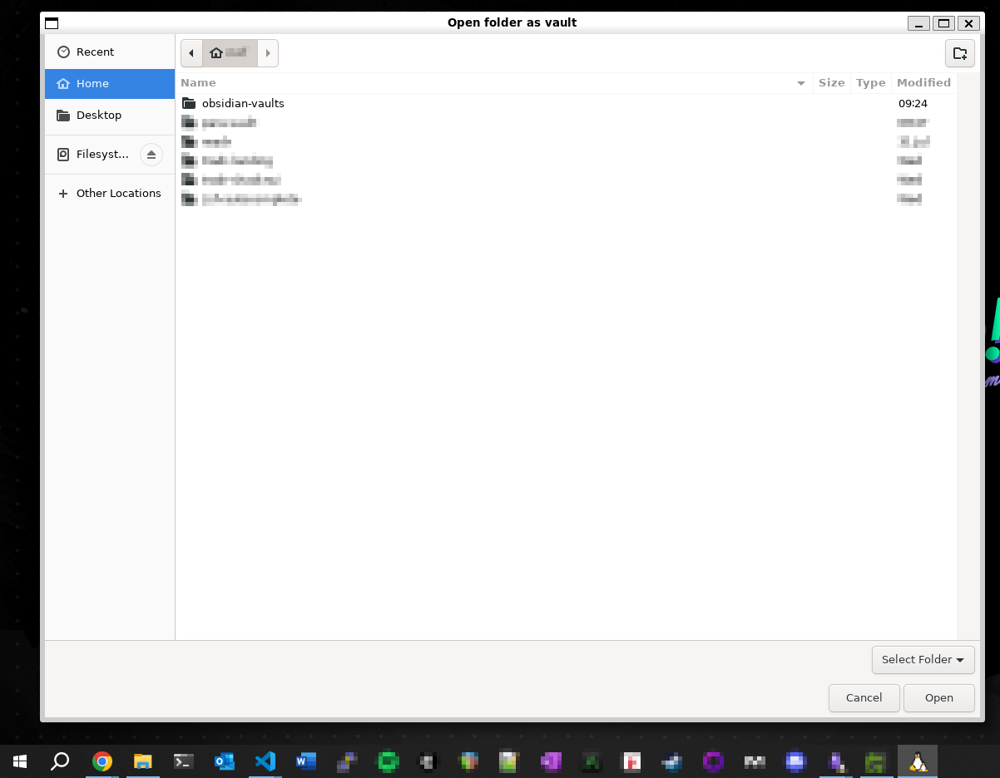

> **TL;DR** — WSL lets you install apps on the WSL filesystem but open their GUI natively in Windows. Install Obsidian via your distribution’s package manager; an Obsidian entry with a little Tux (Linux penguin) icon appears in your Start Menu. You can also run the `obsidian` binary in the WSL terminal and the GUI opens on the Windows desktop. It _just works™._

---

Huge shoutout to Rishnav in the Obsidian forums for the solution! [Forum post](https://forum.obsidian.md/t/support-for-vaults-in-windows-subsystem-for-linux-wsl/8580/50)

---

[Obsidian](https://obsidian.md) installed on Windows cannot open files under the `\\wsl.localhost\` mount that contains your WSL distribution filesystems. Try to open a directory therein, and Obsidian.exe will fail with the following error:

```text
Error: EISDIR: illegal operation on a directory, watch '\\wsl.localhost\Ubuntu-20.04\home\username\vault-directory'
```

If you want to use Obsidian’s GUI on your desktop, but your vault to live inside your WSL distro, this is for you. WSL lets you install a GUI app inside WSL and run it directly on the Windows desktop ([Docs](https://learn.microsoft.com/en-us/windows/wsl/tutorials/gui-apps)).

Simply ✨ ~~download and install~~ ✨ Obsidian’s package for your distribution (or build from source)!

I’ve included a bash script that’ll work on Ubuntu or Debian to demonstrate.

```bash
#! /bin/bash
# Works on Ubuntu/Debian systems

## Get the newest version of Obsidian .deb file
deb_link=$(curl -s https://obsidian.md/download |\
  grep -o "https://github[^0-9]*/v[0-9]\.[0-9]\.[0-9]/obsidian_[0-9]\.[0-9]\.[0-9]_amd64.deb")

wget $deb_link

## Get filename
deb_filename=$(ls | grep obsidian_[0-9]\.[0-9]\.[0-9]_amd64.deb)

## Install obsidian inside Ubuntu
sudo apt-get install -y ./$deb_filename
```

You should see a new Start Menu application named “Obsidian (Ubuntu-20.04)” that will function exactly as if you’d used the Windows .exe installer.

(Or, type `obsidian` or `/opt/Obsidian/obsidian` in the WSL terminal.)




