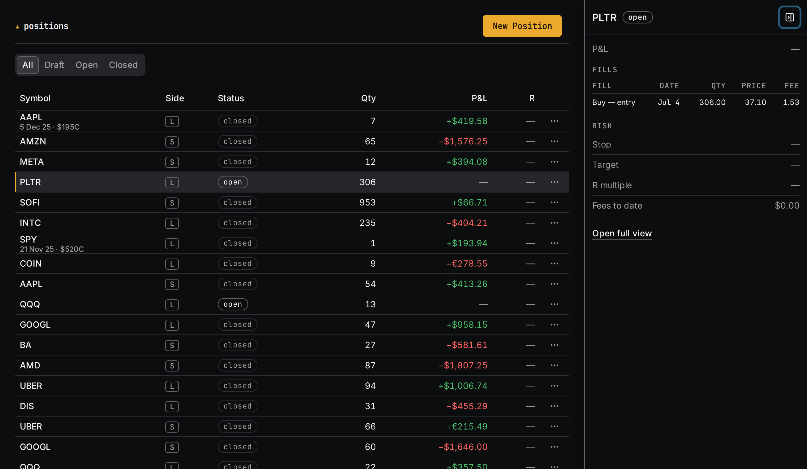
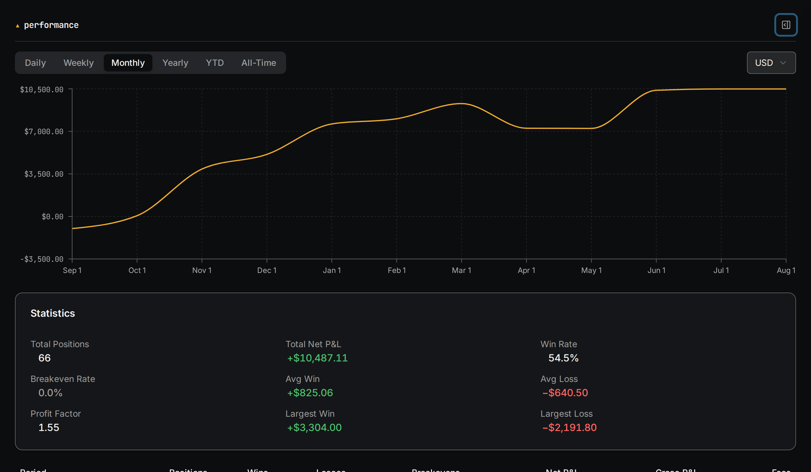

Tradr is an open-source trading journal for people who trade stocks and options.
You log every fill, size a trade before you take it, and the journal shows you
what your record says once the fees are counted. It's Apache-2.0, it runs on
your own machine with one command, and there's a hosted version at
[tradr.cloud](https://www.tradr.cloud) if you'd rather not run a server.

It never places an order. Nothing in it touches your broker.

## Why I built it

I trade my own account most weekdays. For years the journal was a spreadsheet,
and every month it drifted a little further from the truth. Fees got rounded
away. Scale-ins averaged wrong. A partial close would leave a row that didn't
match anything at the broker, and eventually I stopped trusting my own numbers,
which defeats the point of keeping them.

So I built the journal I wanted, and I made it open source on purpose. A
trading journal asks for a lot of trust: your balances and your worst trades.
With the code public you don't have to extend that trust to me. Read it, run it
on your own machine. If I ever vanish, your journal keeps working.

## What it does

- **Positions with many fills.** Draft, open, scale in, close in parts. The
  fills roll up into one position with the right average and a realised P&L
  that's net of the per-fill fees.
- **A double-entry ledger underneath.** Multiple brokerage accounts in multiple
  currencies, with the cash reconciled.
- **A sizing calculator.** Entry, target, and stop go in. Position size, R:R,
  dollar risk, and estimated fees come out, priced with your broker's actual fee
  schedule.
- **Performance.** An equity curve built from net P&L, broken down daily through
  all-time.
- **Options tools.** OCC symbol parsing, Black-Scholes pricing with the Greeks,
  and chain lookups if you bring your own Unusual Whales key.
- **CSV import.** Years of history from any broker, with a column-mapping step.
  Direct read-only broker connections are on the roadmap and not shipped.

There's a guided tour with demo data, so you can poke around a populated journal
before you log a real trade.

## Self-hosted first

The self-hosted version is the real product. It's 3 containers (web, API,
Postgres) behind one Docker Compose file, plus a quickstart script that
generates the secrets and waits for the API to report healthy. About 2 minutes.
Plan limits ship switched off, so a self-hosted instance is unlimited.

Nothing phones home until you turn it on. With no keys configured, a running
instance talks only to its own Postgres. The AI advisor, market data, billing,
and analytics are each gated behind their own configuration, and when the
config is absent the feature is absent, with no outbound call made for it. What
an instance can talk to, and which setting enables each connection, is written
down in the repo.

The hosted app at tradr.cloud is the same software from the same releases, with
backups and upgrades handled for you. The free plan is capped (1 brokerage
account, 1,000 positions, 6 months of analytics, 10 CSV imports a month) and
Pro lifts the caps for $10 a month at launch. Tradr is bootstrapped with no
investors, so the Pro plan is what keeps the servers on. I watch PostHog to see
how many sign-ups add an account and log a first trade, and the analytics never
record a price, a quantity, or a balance.

## How it's built

A TypeScript monorepo on pnpm. The API is Hono with Drizzle ORM on PostgreSQL.
The web app is React 19 on Vite with TanStack Router and Query, Tailwind CSS 4,
and shadcn/ui. Zod schemas live in a shared package so the API and the client
validate against the same types, and money math goes through decimal.js.

Migrations are forward-only and run at API boot, split expand-then-contract
across releases so redeploying the previous image stays a valid recovery. A tag
publishes container images only after CI passes on that exact commit, and CI
includes a smoke job that runs the same quickstart script the README tells you
to run, so the install instructions get executed on every push rather than
proofread. There are around 330 test files and a Playwright suite that runs on
two browser engines. Commits need a DCO sign-off, and there's no CLA.

The docs site is Astro Starlight, built from the same repo. The reference pages
for environment variables, the CLI, plan limits, the database schema, and the
OpenAPI spec are generated from source so they can't drift from the code. The
hosted app runs the same container images, with the API on Fly.io and the front
end on Cloudflare Pages.

## Where it is

Pre-1.0 and moving quickly. The proof of concept started in January 2026, a
rebuild began that March, and the code went public at the end of July. The
hosted app opened on August 27, 2026, on v0.11.x, and there's been close to a
release a day since the repo went public.

Pre-1.0 means the HTTP API isn't stable yet and endpoints can change in any
release until v1.0.0. Two things are missing right now: there's no direct
broker sync (CSV only), and the AI advisor is switched off on the hosted app
until I'm happy with how it behaves and how I can observe it.

## What's next

Read-only broker connections, so the CSV step goes away for the common brokers.
The advisor back on for hosted users once its observability is sorted. Trade
scoring, so a closed position can be graded against the plan you had for it.
And v1.0, once the API stops moving.

If you trade and you're tired of your spreadsheet,
[make a free account](https://app.tradr.cloud/register), log one real trade, and
tell me what breaks.
